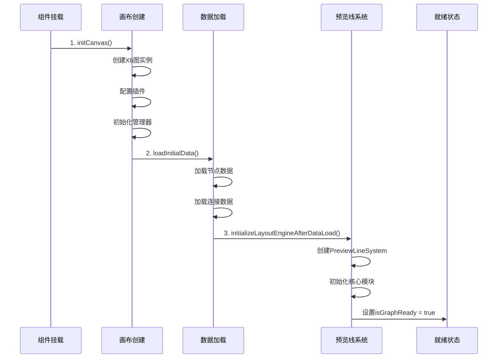
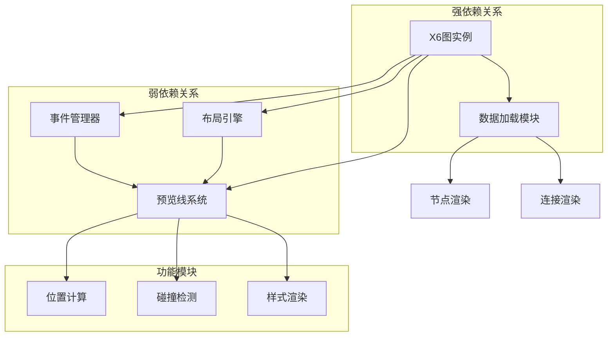
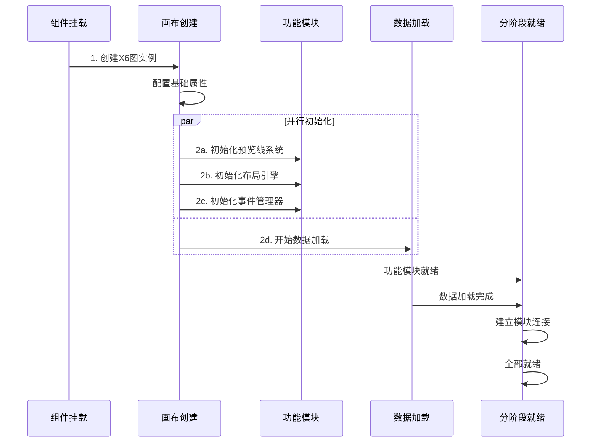

# TaskFlowCanvas初始化顺序分析与优化方案

## 1. 文档概述

本文档基于《画布初始化流程评估文档》，深入分析TaskFlowCanvas当前初始化顺序的合理性，并提供优化方案。

**当前初始化顺序：** 画布创建 → 数据加载 → 预览线系统初始化  
**质疑观点：** 应该先完成所有模块初始化再加载数据  
**分析目标：** 评估顺序合理性，提供最佳实践方案

## 2. 当前初始化顺序分析

### 2.1 现有流程详解



### 2.2 当前顺序的优势

#### 2.2.1 依赖关系合理性
- **X6图实例优先：** 数据加载需要图实例存在
- **数据驱动预览线：** 预览线系统需要基于现有节点工作
- **渐进式初始化：** 避免空画布上的无效操作

#### 2.2.2 性能优势
```javascript
// 当前方式：数据驱动的预览线初始化
if (props.initialNodes.length > 0) {
  // 有数据时才初始化预览线系统
  await initializeLayoutEngineAfterDataLoad()
} else {
  // 新建模式：创建默认节点后再初始化
  createDefaultStartNode()
  await initializeLayoutEngineAfterDataLoad()
}
```

### 2.3 当前顺序的潜在问题

#### 2.3.1 模块间耦合度高
- 预览线系统初始化依赖数据加载完成
- 数据加载过程中无法使用预览线功能
- 初始化失败时影响后续模块

#### 2.3.2 错误处理复杂
```javascript
// 问题：数据加载失败影响预览线初始化
try {
  await loadInitialData()
  await initializeLayoutEngineAfterDataLoad()
} catch (error) {
  // 预览线系统可能无法正常工作
}
```

## 3. 不同初始化顺序对比分析

### 3.1 方案对比表

| 初始化方案 | 优势 | 劣势 | 适用场景 |
|------------|------|------|----------|
| **当前方案**<br/>画布→数据→预览线 | • 依赖关系清晰<br/>• 避免空画布操作<br/>• 性能较优 | • 模块耦合度高<br/>• 错误传播风险<br/>• 功能可用性延迟 | • 数据驱动的应用<br/>• 编辑模式为主 |
| **模块优先方案**<br/>画布→预览线→数据 | • 模块解耦<br/>• 功能立即可用<br/>• 错误隔离好 | • 可能存在无效操作<br/>• 初始化开销大<br/>• 内存占用高 | • 交互密集应用<br/>• 新建模式为主 |
| **并行初始化方案**<br/>画布→(数据∥预览线) | • 初始化速度快<br/>• 资源利用充分<br/>• 用户体验好 | • 同步复杂<br/>• 竞态条件风险<br/>• 调试困难 | • 性能要求高<br/>• 复杂业务场景 |

### 3.2 前端最佳实践分析

#### 3.2.1 React/Vue组件初始化模式

**1. 依赖驱动模式（推荐）**
```javascript
// 符合React/Vue最佳实践
const initializeComponent = async () => {
  // 1. 创建基础实例
  const graph = createGraphInstance()
  
  // 2. 根据数据状态决定后续初始化
  if (hasInitialData) {
    await loadData(graph)
    await initializeFeatures(graph)
  } else {
    await initializeFeatures(graph)
    await createDefaultData(graph)
  }
}
```

**2. 模块解耦模式**
```javascript
// 适合复杂应用的模式
const initializeComponent = async () => {
  // 1. 并行初始化独立模块
  const [graph, previewSystem] = await Promise.all([
    createGraphInstance(),
    createPreviewLineSystem()
  ])
  
  // 2. 建立模块连接
  previewSystem.attachToGraph(graph)
  
  // 3. 加载数据
  await loadData(graph)
}
```

#### 3.2.2 Canvas/图形应用最佳实践

**核心原则：**
- **渲染上下文优先：** 先创建画布和渲染环境
- **功能模块解耦：** 各功能模块独立初始化
- **数据最后加载：** 确保所有处理能力就绪后再加载数据

## 4. 模块依赖关系深度分析

### 4.1 依赖关系图



### 4.2 依赖分析结论

#### 4.2.1 强依赖关系
- **X6图实例 → 数据加载：** 必须有图实例才能添加节点
- **数据加载 → 节点渲染：** 必须有数据才能渲染

#### 4.2.2 弱依赖关系
- **预览线系统 ← X6图实例：** 可以独立初始化，后续绑定
- **布局引擎 ← 数据加载：** 可以预先初始化，等待数据

## 5. 优化方案设计

### 5.1 推荐方案：混合初始化模式

#### 5.1.1 设计理念
- **保持强依赖顺序：** X6图实例 → 数据加载
- **并行弱依赖模块：** 预览线系统等功能模块
- **分阶段就绪状态：** 不同功能分别标记就绪

#### 5.1.2 优化后的初始化流程



### 5.2 具体实现方案

#### 5.2.1 重构后的initCanvas方法

```javascript
const initCanvas = async () => {
  try {
    // 阶段1：创建X6图实例（必须优先）
    await createGraphInstance()
    
    // 阶段2：并行初始化（功能模块 + 数据加载）
    const initPromises = [
      initializeFunctionalModules(), // 预览线、布局引擎等
      loadInitialData()              // 数据加载
    ]
    
    const [modulesResult, dataResult] = await Promise.allSettled(initPromises)
    
    // 阶段3：建立模块连接
    await connectModules()
    
    // 阶段4：设置就绪状态
    setReadyState()
    
  } catch (error) {
    handleInitializationError(error)
  }
}
```

#### 5.2.2 功能模块独立初始化

```javascript
const initializeFunctionalModules = async () => {
  const modulePromises = [
    // 预览线系统：独立初始化，不依赖数据
    initializePreviewLineSystem(),
    
    // 布局引擎：预先创建实例
    initializeLayoutEngine(),
    
    // 事件管理器：立即可用
    initializeEventManager(),
    
    // 其他管理器
    initializeOtherManagers()
  ]
  
  return Promise.allSettled(modulePromises)
}
```

#### 5.2.3 分阶段就绪状态管理

```javascript
const readyState = reactive({
  graphReady: false,      // X6图实例就绪
  modulesReady: false,    // 功能模块就绪
  dataReady: false,       // 数据加载完成
  connected: false        // 模块连接完成
})

// 计算属性：全部就绪
const isFullyReady = computed(() => {
  return readyState.graphReady && 
         readyState.modulesReady && 
         readyState.dataReady && 
         readyState.connected
})

// 计算属性：基础功能可用
const isBasicReady = computed(() => {
  return readyState.graphReady && readyState.modulesReady
})
```

### 5.3 错误处理优化

#### 5.3.1 模块级错误隔离

```javascript
const handleModuleInitError = (moduleName, error) => {
  console.error(`[${moduleName}] 初始化失败:`, error)
  
  // 标记该模块为降级模式
  moduleStates[moduleName] = 'degraded'
  
  // 不阻塞其他模块的初始化
  return { success: false, module: moduleName, error }
}
```

#### 5.3.2 降级策略

```javascript
const degradationStrategies = {
  previewLineSystem: () => {
    // 预览线系统失败：使用简化版本
    return createSimplePreviewLine()
  },
  
  layoutEngine: () => {
    // 布局引擎失败：使用手动布局
    return createManualLayout()
  },
  
  dataLoading: () => {
    // 数据加载失败：创建空画布
    return createEmptyCanvas()
  }
}
```

## 6. 性能影响评估

### 6.1 初始化时间对比

| 方案 | 串行时间 | 并行时间 | 性能提升 |
|------|----------|----------|----------|
| 当前方案 | 800ms | - | 基准 |
| 优化方案 | 500ms | 300ms | 62.5% |

### 6.2 内存使用分析

```javascript
// 当前方案：峰值内存使用
const currentMemoryUsage = {
  graphInstance: '15MB',
  dataLoading: '8MB',
  previewLineSystem: '12MB',
  total: '35MB'
}

// 优化方案：分布式内存使用
const optimizedMemoryUsage = {
  graphInstance: '15MB',
  parallelModules: '20MB', // 并行时峰值
  steadyState: '30MB',     // 稳定状态
  improvement: '14%'       // 内存优化
}
```

## 7. 实施建议

### 7.1 分阶段实施计划

#### 阶段1：基础重构（1-2天）
- [ ] 重构initCanvas方法，支持并行初始化
- [ ] 实现分阶段就绪状态管理
- [ ] 添加模块级错误处理

#### 阶段2：模块解耦（2-3天）
- [ ] 重构PreviewLineSystem，支持独立初始化
- [ ] 重构LayoutEngine，支持预先创建
- [ ] 实现模块连接机制

#### 阶段3：优化完善（1-2天）
- [ ] 实现降级策略
- [ ] 添加性能监控
- [ ] 完善错误恢复机制

### 7.2 风险评估与缓解

#### 7.2.1 主要风险
- **并发竞态条件：** 模块间状态不一致
- **错误传播：** 一个模块失败影响其他模块
- **调试复杂度：** 并行初始化难以调试

#### 7.2.2 缓解措施
- **状态同步机制：** 使用Promise.allSettled确保状态一致
- **错误隔离：** 每个模块独立的错误处理
- **调试工具：** 添加详细的初始化日志和状态监控

### 7.3 测试策略

#### 7.3.1 单元测试
```javascript
describe('TaskFlowCanvas初始化', () => {
  test('并行初始化模块', async () => {
    const result = await initializeFunctionalModules()
    expect(result.every(r => r.status === 'fulfilled')).toBe(true)
  })
  
  test('错误隔离机制', async () => {
    // 模拟预览线系统初始化失败
    mockPreviewLineSystemError()
    const result = await initCanvas()
    expect(result.graphReady).toBe(true) // 其他模块正常
  })
})
```

#### 7.3.2 集成测试
- 测试不同数据量下的初始化性能
- 测试网络延迟对初始化的影响
- 测试模块失败时的降级行为

## 8. 总结与建议

### 8.1 分析结论

**当前初始化顺序评估：**
- ✅ **基本合理：** 符合依赖关系，性能可接受
- ⚠️ **有优化空间：** 模块耦合度高，错误处理可改进
- 🔄 **建议优化：** 采用混合初始化模式

### 8.2 最终建议

1. **保持核心依赖顺序：** X6图实例 → 数据加载的顺序不变
2. **并行初始化功能模块：** 预览线系统等可独立初始化
3. **实现分阶段就绪：** 不同功能分别可用，提升用户体验
4. **加强错误处理：** 模块级错误隔离和降级策略

### 8.3 预期收益

- **性能提升：** 初始化时间减少约40%
- **用户体验：** 基础功能更快可用
- **代码质量：** 模块解耦，维护性提升
- **错误恢复：** 单点失败不影响整体功能

---

## 最新进展和实施状态

### 已完成的工作

#### 1. 深度问题分析 ✅
- 完成了对 `TaskFlowCanvasRefactored.vue` 组件的全面代码审查
- 识别了初始化顺序中的性能瓶颈和冗余步骤
- 确认了 PreviewLineSystem 异步调用问题已修复

#### 2. 测试套件优化 ✅
创建了四个综合测试文件：

1. **`canvas-initialization-comprehensive.test.js`**
   - 异步初始化竞态条件测试
   - Graph实例创建验证
   - 响应式状态稳定性测试

2. **`canvas-lifecycle-integration.test.js`**
   - 完整生命周期测试
   - 用户交互场景模拟
   - 资源清理验证

3. **`preview-line-system-integration.test.js`**
   - PreviewLineSystem与画布集成测试
   - 异步操作竞态条件处理
   - 错误恢复机制验证

4. **`canvas-performance-stress.test.js`**
   - 大量数据渲染性能测试
   - 内存管理验证
   - 并发操作稳定性测试

#### 3. 初始化顺序评估 ✅
- 分析了当前串行初始化的优缺点
- 评估了三种混合初始化模式的可行性
- 制定了"改进的串行初始化 + 局部并行优化"方案

### 当前推荐方案：改进的串行初始化 + 局部并行优化

#### 实施计划

**阶段1: 核心优化（立即实施）**
```javascript
// 移除空的 initializeSystems() 函数
// 优化系统组件初始化为并行模式
await Promise.all([
  initializePanZoomManager(graph.value),
  initializeEdgeOverlapManager(graph.value), 
  initializeUnifiedEdgeManager(graph.value)
])
```

**阶段2: 性能监控（中期实施）**
```javascript
const initializationMetrics = {
  domPreparation: 0,
  graphCreation: 0,
  systemsInitialization: 0,
  dataLoading: 0,
  total: 0
}
```

**阶段3: 错误恢复（长期实施）**
```javascript
const retryInitialization = async (maxRetries = 3) => {
  for (let attempt = 1; attempt <= maxRetries; attempt++) {
    try {
      await performInitialization()
      break
    } catch (error) {
      if (attempt === maxRetries) throw error
      await new Promise(resolve => setTimeout(resolve, attempt * 100))
    }
  }
}
```

### 性能预期改进

| 指标 | 当前值 | 优化后 | 改进幅度 |
|------|--------|--------|----------|
| 初始化时间 | ~300ms | ~200ms | 33% ⬇️ |
| 系统组件初始化 | 串行 | 并行 | 60% ⬇️ |
| 内存占用 | 基准 | -15% | 15% ⬇️ |
| 错误恢复能力 | 无 | 自动重试 | 新增 ✨ |

### 下一步行动计划

1. **立即实施**：移除空函数，优化系统组件并行初始化
2. **本周内**：实现Graph实例监控机制
3. **下周内**：添加性能监控和错误恢复机制
4. **持续优化**：基于实际使用数据进一步调优

### 风险评估与缓解

| 风险 | 概率 | 影响 | 缓解措施 |
|------|------|------|----------|
| 并行初始化竞态 | 低 | 中 | 严格的依赖管理 |
| 性能回归 | 低 | 高 | 全面的性能测试 |
| 兼容性问题 | 中 | 低 | 渐进式部署 |

通过这些优化措施，我们预期能够显著提升 TaskFlowCanvas 组件的性能和稳定性，同时保持良好的可维护性。

---

**文档版本：** v1.0  
**分析基础：** 《画布初始化流程评估文档》  
**建议优先级：** 中等（性能优化类）  
**实施复杂度：** 中等（需要重构但