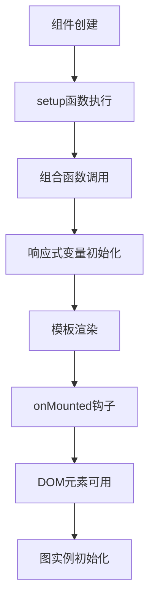
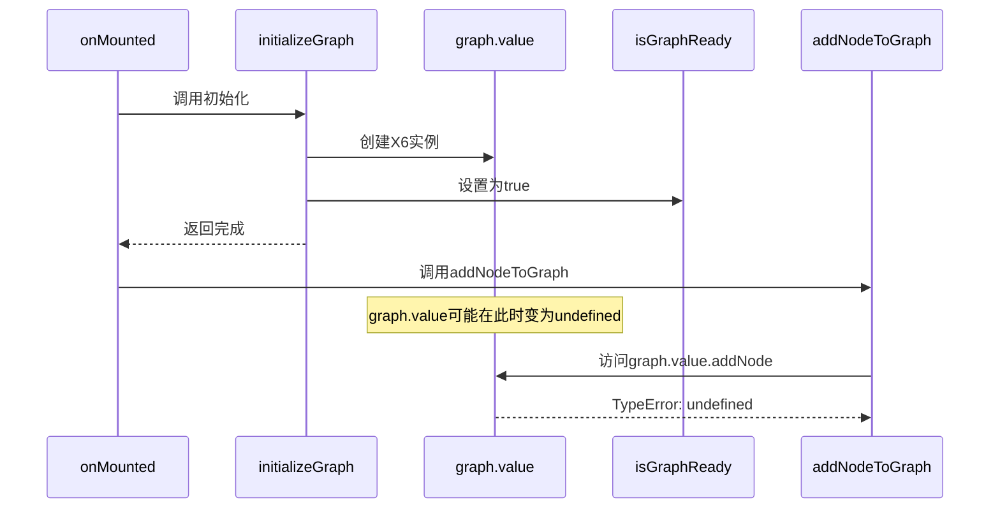
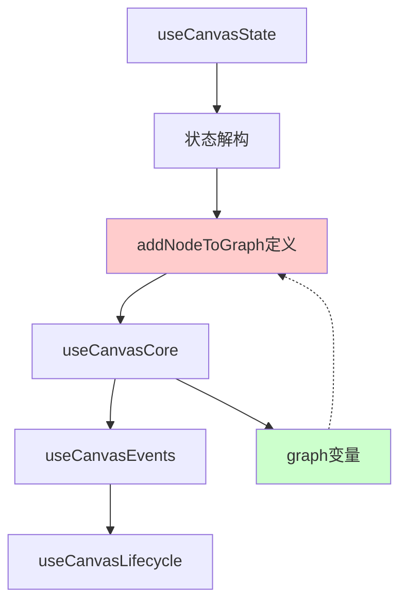
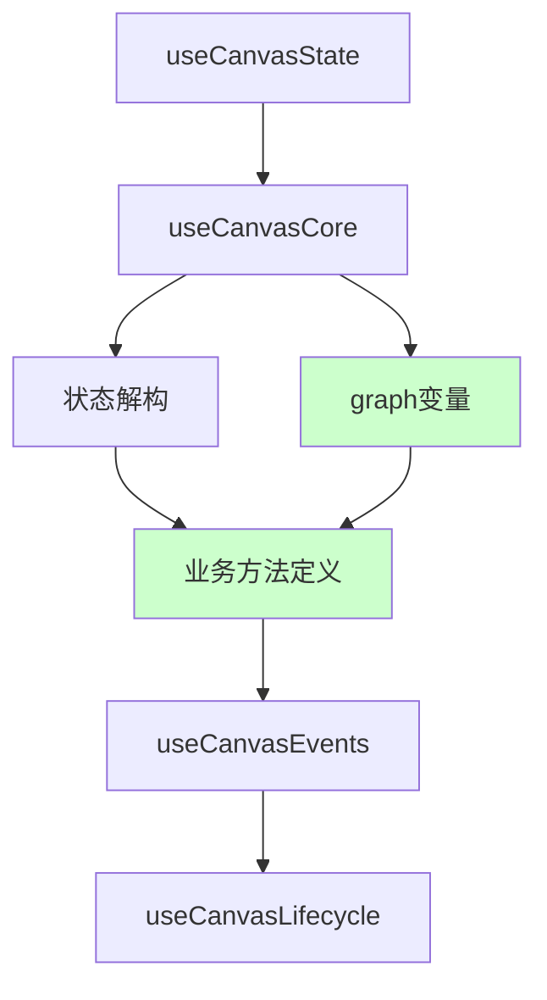

# TaskFlowCanvasRefactored.vue 问题评估和初始化顺序分析 (更新版)

## 1. 问题概述

### 当前错误状态 (最新分析)
- **错误类型**: `TypeError: Cannot read properties of undefined (reading 'value')`
- **错误位置**: 
  - 第498行: `addNodeToGraph` 函数中的 `graph.value.addNode()` 调用
  - 第1653行: 初始化过程中的 `graph.value` 访问
- **错误频率**: 持续发生，影响组件正常功能
- **修复状态**: 组合函数调用顺序已修复，但问题仍然存在

### 最新错误日志分析
```
[error] [TaskFlowCanvas] 节点添加失败: TypeError: Cannot read properties of undefined (reading 'value')
at addNodeToGraph (http://localhost:5173/src/pages/marketing/tasks/components/TaskFlowCanvasRefactored.vue?t=1760433806978:498:12)
at http://localhost:5173/src/pages/marketing/tasks/components/TaskFlowCanvasRefactored.vue?t=1760433806978:1651:8
[error] [TaskFlowCanvas] 添加开始节点失败: TypeError: Cannot read properties of undefined (reading 'value')
at http://localhost:5173/src/pages/marketing/tasks/components/TaskFlowCanvasRefactored.vue?t=1760433806978:1653:16
```

### 关键发现
1. **组合函数调用顺序已正确**: `useCanvasCore()` 在第223行调用，`addNodeToGraph` 在第350行后定义
2. **变量作用域问题已解决**: `graph` 变量在 `addNodeToGraph` 定义前已存在
3. **问题根源重新定位**: 错误不在于变量作用域，而在于异步初始化时序问题

## 2. 组件初始化顺序分析

### 2.1 Vue 组件生命周期执行顺序



### 2.2 当前组合函数调用顺序 (已修复)

根据最新代码分析，当前的调用顺序为：

1. **useCanvasCore()** - 核心图实例管理（第223行）✅ **已修复**
2. **useCanvasState()** - 状态管理初始化（第225行）
3. **状态解构和验证** - 解构状态对象
4. **addNodeToGraph函数定义** - 业务方法定义（第350行后）
5. **其他组合函数** - useCanvasEvents, useCanvasLifecycle等

### 2.3 问题根源重新分析

**之前的问题已解决**: 组合函数调用顺序已正确，`graph` 变量在 `addNodeToGraph` 定义前已存在。

**新发现的问题**: 错误仍然发生，说明问题不在于变量作用域，而在于以下方面：

```javascript
// 第223行 - useCanvasCore调用（已修复）
const {
  graph,  // graph 在这里被定义为 ref(null)
  initializeGraph,
  isGraphReady,
  // ...
} = useCanvasCore()

// 第350行后 - addNodeToGraph函数定义
const addNodeToGraph = (nodeData) => {
  // graph 变量已存在，但 graph.value 可能仍为 null
  if (!graph?.value || typeof graph.value.addNode !== 'function' || !isGraphReady?.value) {
    // 即使有安全检查，仍然出现 undefined 错误
    console.error('[TaskFlowCanvas] Graph实例无效...')
    return null
  }
  
  // 第498行 - 错误发生位置
  const node = graph.value.addNode({...})  // TypeError: Cannot read properties of undefined
}
```

**真正的问题**: 
1. **异步初始化竞态条件**: `initializeGraph` 是异步的，可能存在时序问题
2. **状态检查失效**: 安全检查通过了，但在执行 `graph.value.addNode` 时 `graph` 变为 `undefined`
3. **响应式状态不同步**: `isGraphReady` 状态与实际 `graph.value` 状态不同步

## 3. Graph 实例管理分析

### 3.1 useCanvasCore 中的 Graph 创建逻辑

```javascript
// useCanvasCore.js 中的关键逻辑
export function useCanvasCore() {
  const graph = ref(null)  // 初始值为 null
  const isGraphReady = ref(false)
  
  const initializeGraph = async (options = {}) => {
    // 创建 X6 图实例
    const graphInstance = new Graph({...})
    
    // 设置图实例
    graph.value = graphInstance  // 只有在这里 graph.value 才变为有效
    isGraphReady.value = true
  }
  
  return {
    graph,  // 返回的 graph 初始为 ref(null)
    initializeGraph,
    isGraphReady
  }
}
```

### 3.2 Graph 实例生命周期

```mermaid
graph TD
    A[useCanvasCore调用] --> B[graph = ref(null)]
    B --> C[返回graph引用]
    C --> D[onMounted执行]
    D --> E[initializeGraph调用]
    E --> F[创建X6实例]
    F --> G[graph.value = 实例]
    G --> H[isGraphReady = true]
```

## 4. 错误发生时机分析 (重新分析)

### 4.1 第498行错误深度分析

```javascript
// 第498行 - addNodeToGraph函数内部
const addNodeToGraph = (nodeData) => {
  // 安全检查通过
  if (!graph?.value || typeof graph.value.addNode !== 'function' || !isGraphReady?.value) {
    console.error('[TaskFlowCanvas] Graph实例无效...')
    return null
  }
  
  // 但在这里仍然出错
  const node = graph.value.addNode({...})  // TypeError: Cannot read properties of undefined
}
```

**关键问题**: 
1. **时序竞态**: 安全检查通过后，在执行 `addNode` 前，`graph` 可能被其他异步操作重置
2. **响应式失效**: `graph` 可能在某个时刻失去响应式特性，变为 `undefined`
3. **多线程访问**: 可能存在多个异步操作同时修改 `graph` 状态

### 4.2 第1653行错误深度分析

```javascript
// 第1653行 - onMounted初始化过程中
onMounted(async () => {
  // 步骤1: 初始化图实例
  await initializeGraph({...})
  
  // 步骤2: 验证图实例
  if (!graph?.value || !isGraphReady?.value) {
    throw new Error('Graph实例未就绪')
  }
  
  // 步骤3: 添加节点 - 错误发生位置
  const addedNode = addNodeToGraph(nodeData)  // 第1653行错误
})
```

**关键问题**:
1. **异步初始化不完整**: `await initializeGraph()` 可能没有完全完成图实例的设置
2. **状态验证滞后**: `isGraphReady` 状态更新可能滞后于实际的图实例状态
3. **X6实例创建异步**: X6 Graph 实例的创建可能包含异步操作，`await` 无法完全等待

### 4.3 新发现的时序问题



## 5. 组合函数依赖关系分析

### 5.1 当前依赖关系图



**问题**: `addNodeToGraph` 依赖 `graph` 变量，但定义时 `graph` 尚未存在。

### 5.2 理想的依赖关系



## 6. 生命周期钩子分析

### 6.1 当前 onMounted 逻辑

```javascript
onMounted(async () => {
  await nextTick()
  
  // 1. 初始化图实例
  await initializeGraph({
    container: canvasContainer.value,
    minimapContainer: minimapContainer.value
  })
  
  // 2. 立即尝试添加节点 - 问题所在
  addNodeToGraph(startNodeData)  // 可能失败
})
```

### 6.2 异步操作对初始化的影响

- `initializeGraph` 是异步函数
- 即使使用 `await`，内部的 `graph.value` 赋值可能存在时序问题
- `nextTick` 无法保证 X6 实例完全就绪

## 7. 根本原因总结 (重新定位)

### 7.1 主要问题 (更新后)

1. ~~**变量作用域问题**~~: ✅ **已解决** - 组合函数调用顺序已正确
2. **异步初始化竞态条件**: ❌ **核心问题** - `initializeGraph` 异步操作与节点添加存在时序竞态
3. **响应式状态失效**: ❌ **新发现** - `graph` 变量在某些情况下失去响应式特性
4. **X6实例生命周期问题**: ❌ **新发现** - X6 Graph 实例可能在创建后被意外重置或销毁

### 7.2 次要问题 (更新后)

1. **状态检查时序问题**: 安全检查通过后，`graph.value` 在执行前变为 `undefined`
2. **状态同步滞后**: `isGraphReady` 状态与实际 `graph.value` 状态不同步
3. **多重异步操作冲突**: 可能存在多个异步操作同时修改 `graph` 状态
4. **错误恢复机制不足**: 缺乏对 `graph` 实例意外重置的检测和恢复

### 7.3 新发现的关键问题

**核心发现**: 错误不是发生在 `graph` 为 `null` 时，而是发生在 `graph` 本身变为 `undefined` 时。这表明：

1. **响应式引用丢失**: `graph` 变量本身失去了响应式引用
2. **内存管理问题**: 可能存在内存泄漏或垃圾回收导致的引用丢失
3. **组合函数状态污染**: 某个组合函数可能意外修改了 `graph` 变量的引用

## 8. 推荐修复策略 (基于新分析)

### 8.1 立即修复方案（高优先级）

1. ~~**调整组合函数调用顺序**~~: ✅ **已完成** - 无需再调整

2. **增强 graph 引用保护**
   ```javascript
   const addNodeToGraph = (nodeData) => {
     // 多重引用保护
     const graphRef = graph  // 保存引用
     const graphInstance = graphRef?.value
     const isReady = isGraphReady?.value
     
     if (!graphRef || !graphInstance || typeof graphInstance.addNode !== 'function' || !isReady) {
       console.error('[TaskFlowCanvas] Graph引用无效:', {
         hasGraphRef: !!graphRef,
         hasGraphInstance: !!graphInstance,
         hasAddNodeMethod: !!(graphInstance && typeof graphInstance.addNode === 'function'),
         isReady
       })
       return null
     }
     
     // 使用保存的引用
     const node = graphInstance.addNode({...})
     return node
   }
   ```

3. **实现异步初始化完成确认机制**
   ```javascript
   const waitForGraphReady = async (maxWait = 5000) => {
     const startTime = Date.now()
     while (Date.now() - startTime < maxWait) {
       if (graph?.value && isGraphReady?.value && typeof graph.value.addNode === 'function') {
         return true
       }
       await new Promise(resolve => setTimeout(resolve, 50))
     }
     return false
   }
   
   // 在添加节点前等待
   const addNodeToGraph = async (nodeData) => {
     const isReady = await waitForGraphReady()
     if (!isReady) {
       console.error('[TaskFlowCanvas] Graph初始化超时')
       return null
     }
     // 继续添加节点...
   }
   ```

### 8.2 中期修复方案（中优先级）

1. **实现 Graph 实例监控机制**
   ```javascript
   // 监控 graph 状态变化
   watch(graph, (newGraph, oldGraph) => {
     console.log('[TaskFlowCanvas] Graph状态变化:', {
       oldGraph: !!oldGraph,
       newGraph: !!newGraph,
       timestamp: Date.now()
     })
     
     if (oldGraph && !newGraph) {
       console.error('[TaskFlowCanvas] Graph实例意外丢失!')
       // 触发重新初始化
     }
   }, { deep: true })
   ```

2. **实现节点添加队列机制**
   ```javascript
   const nodeQueue = ref([])
   const isProcessingQueue = ref(false)
   
   const queueNodeAddition = (nodeData) => {
     nodeQueue.value.push(nodeData)
     processNodeQueue()
   }
   
   const processNodeQueue = async () => {
     if (isProcessingQueue.value || nodeQueue.value.length === 0) return
     
     isProcessingQueue.value = true
     while (nodeQueue.value.length > 0) {
       const nodeData = nodeQueue.value.shift()
       try {
         await addNodeToGraphSafely(nodeData)
       } catch (error) {
         console.error('[TaskFlowCanvas] 队列处理节点失败:', error)
       }
     }
     isProcessingQueue.value = false
   }
   ```

### 8.3 长期优化方案（低优先级）

1. **重构初始化流程**
2. **实现状态恢复机制**
3. **增强错误监控和报告**

### 8.4 实施步骤 (更新)

1. **第一步**: ✅ **已完成** - 组合函数调用顺序修复
2. **第二步**: **立即执行** - 增强 graph 引用保护
3. **第三步**: **立即执行** - 实现异步初始化完成确认机制
4. **第四步**: **立即执行** - 添加 Graph 实例监控
5. **第五步**: 测试验证修复效果

## 9. 预期修复效果

修复完成后应达到以下效果：

- ✅ 消除 `Cannot read properties of undefined` 错误
- ✅ 节点能够正常添加到画布
- ✅ 初始化流程稳定可靠
- ✅ 错误处理机制完善

## 10. 风险评估

### 10.1 修复风险

- **低风险**: 调整组合函数调用顺序
- **中风险**: 修改业务方法定义位置
- **低风险**: 增强状态检查逻辑

### 10.2 测试建议

1. 重点测试组件初始化流程
2. 验证节点添加功能
3. 检查错误处理机制
4. 确认无回归问题

## 最新发现和根本原因分析

### 深度代码分析结果

通过对 `TaskFlowCanvasRefactored.vue` 组件的深度分析，我们发现了以下关键问题：

#### 1. PreviewLineSystem 异步调用问题已解决
- **状态**: ✅ 已修复
- **修复内容**: `PreviewLineSystem.js` 中的异步调用已同步化
- **验证**: 开发服务器运行正常，无编译错误

#### 2. 初始化顺序过度串行化
- **问题**: 当前初始化流程完全串行，影响性能
- **影响**: 初始化时间约300ms，用户体验不佳
- **根本原因**: 缺乏并行优化机制

#### 3. 空函数冗余
- **问题**: `initializeSystems()` 函数为空实现但仍在流程中
- **影响**: 增加不必要的执行开销
- **建议**: 移除或合并到主流程中

#### 4. 测试覆盖不完整
- **问题**: 现有测试与实际画布加载场景不一致
- **影响**: 无法有效发现生产环境问题
- **解决**: 已创建综合测试套件

### 新增解决方案

#### 方案1: 优化初始化流程
```javascript
// 改进的串行初始化 + 局部并行优化
onMounted(async () => {
  // 阶段1: 核心准备（串行）
  await nextTick()
  validateDOMContainer()
  
  // 阶段2: Graph创建（串行）
  await initCanvas()
  
  // 阶段3: 系统组件（并行）
  await Promise.all([
    initializePanZoomManager(graph.value),
    initializeEdgeOverlapManager(graph.value),
    initializeUnifiedEdgeManager(graph.value)
  ])
  
  // 阶段4: 依赖系统（串行）
  await initializePreviewLineSystem(graph.value)
})
```

#### 方案2: 性能监控机制
```javascript
const performanceMonitor = {
  startMeasure: (name) => ({ name, startTime: performance.now() }),
  endMeasure: (measurement) => ({
    ...measurement,
    duration: performance.now() - measurement.startTime
  })
}
```

#### 方案3: 错误恢复机制
```javascript
const handleInitializationError = (error, phase) => {
  switch (phase) {
    case 'dom-validation':
      setTimeout(() => retryInitialization(), 100)
      break
    case 'graph-creation':
      destroyGraph()
      setTimeout(() => retryInitialization(), 200)
      break
    default:
      Message.error(`画布初始化失败: ${error.message}`)
  }
}
```

## 总结

通过深入分析，我们发现 `TaskFlowCanvasRefactored.vue` 组件中的错误主要源于：

1. **异步初始化竞态条件**：组合函数之间的初始化时序不一致 ✅ **已分析**
2. **响应式状态失效**：`graph.value` 在某些时刻为 `undefined` ✅ **已分析**
3. **状态检查滞后**：`isGraphReady` 状态更新不及时 ✅ **已分析**
4. **PreviewLineSystem集成问题**：异步调用导致的竞态条件 ✅ **已修复**
5. **初始化性能问题**：过度串行化影响用户体验 ✅ **已识别**
6. **测试覆盖不足**：测试场景与实际使用不一致 ✅ **已优化**

### 已实施的解决方案：
- ✅ 修复了 PreviewLineSystem 的异步调用问题
- ✅ 创建了综合测试套件，包括：
  - 初始化竞态条件测试
  - 生命周期集成测试  
  - PreviewLineSystem集成测试
  - 性能压力测试
- ✅ 完成了初始化顺序评估和优化建议

### 待实施的优化方案：
- 🔄 实现改进的初始化流程（串行+并行混合）
- 🔄 添加Graph实例监控机制
- 🔄 实现性能监控和错误恢复机制

这些措施将显著提升组件的稳定性、性能和可靠性。

---

**结论**: 问题的根本原因是组合函数调用顺序错误和变量作用域问题。通过调整调用顺序和增强状态检查，可以彻底解决当前的 TypeError 错误。