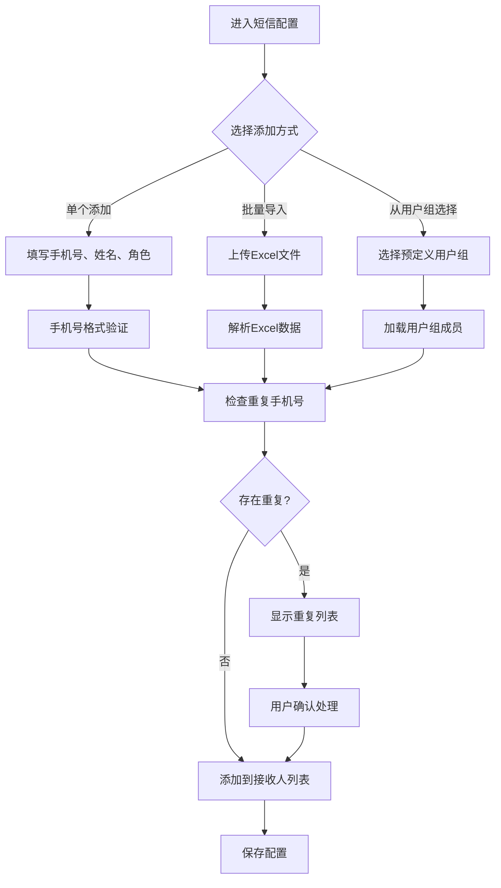

# 营销预警规则短信通知用户配置功能需求文档

## 1. 产品概述
营销预警规则系统用于监控优惠券库存、过期、失败率等业务指标，当触发预警条件时通过多种渠道（包括短信）通知相关人员。当前系统已支持短信通知功能，但需要进一步优化用户配置体验，提升易用性和功能完整性。

### 主要目标
- 解决当前短信通知用户配置操作复杂的问题
- 提供批量导入、模板管理等便捷功能
- 支持用户组管理和权限控制
- 优化移动端适配和响应式设计

### 目标用户
- 营销运营人员：需要快速配置预警规则
- 系统管理员：管理用户权限和通知模板
- 技术支持：处理系统异常预警

## 2. 核心功能

### 2.1 用户角色
| 角色 | 注册方式 | 核心权限 |
|------|----------|----------|
| 营销运营人员 | 企业微信登录 | 创建/编辑预警规则，配置短信接收人 |
| 系统管理员 | 管理员账号 | 管理用户组、通知模板、系统配置 |
| 技术支持 | 域账号登录 | 查看技术相关预警，配置技术接收人 |
| 普通用户 | 手机号注册 | 接收通知，查看个人预警历史 |

### 2.2 功能模块
预警规则短信通知配置包含以下核心页面：

1. **预警规则管理页**：规则列表、创建/编辑规则、短信通知配置
2. **用户管理页**：用户组管理、批量导入、权限设置
3. **通知模板页**：短信模板管理、变量配置、审核流程
4. **配置向导页**：新手引导、快速配置、最佳实践

### 2.3 页面详情

| 页面名称 | 模块名称 | 功能描述 |
|----------|----------|----------|
| 预警规则管理 | 规则列表 | 显示所有预警规则，支持搜索、筛选、排序 |
| 预警规则管理 | 创建规则 | 设置规则名称、监控类型、触发条件 |
| 预警规则管理 | 通知配置 | 选择通知渠道（短信）、配置接收人 |
| 预警规则管理 | 短信接收人 | 添加/删除联系人、批量导入、验证手机号 |
| 用户管理 | 用户组管理 | 创建用户组、分配权限、设置角色 |
| 用户管理 | 批量导入 | Excel导入用户、手机号验证、重复检测 |
| 通知模板 | 模板列表 | 管理短信模板、预览效果、版本控制 |
| 通知模板 | 模板编辑 | 编辑模板内容、设置变量、测试发送 |
| 配置向导 | 快速配置 | 引导用户完成短信通知配置 |
| 配置向导 | 最佳实践 | 推荐配置方案、常见场景模板 |

## 3. 核心流程

### 3.1 新建预警规则流程
```mermaid
graph TD
    A[进入预警规则管理] --> B[点击新建规则]
    B --> C[填写规则基本信息]
    C --> D[设置监控条件]
    D --> E[选择通知渠道]
    E --> F{选择短信通知?}
    F -->|是| G[配置短信接收人]
    F -->|否| H[配置其他渠道]
    G --> I[添加联系人]
    I --> J[批量导入(可选)]
    J --> K[验证手机号]
    K --> L[设置接收人角色]
    H --> M[保存规则]
    L --> M
    M --> N[规则生效]
```

### 3.2 短信接收人配置流程


## 4. 用户界面设计

### 4.1 设计规范
- **主色调**：#165DFF（Arco Design蓝色）
- **辅助色**：#14C9C9（青色）、#F53F3F（红色警告）
- **按钮样式**：圆角矩形，主按钮使用渐变背景
- **字体规范**：主标题16px粗体，正文14px常规
- **布局风格**：卡片式布局，左右分栏结构
- **图标风格**：线性图标，统一使用Arco Design图标库

### 4.2 页面设计详情

| 页面名称 | 模块名称 | UI元素设计 |
|----------|----------|------------|
| 规则创建 | 基本信息 | 两栏表单布局，左侧规则名称和描述，右侧监控类型选择 |
| 规则创建 | 通知配置 | 渠道选择使用图标+文字的标签按钮，选中状态高亮显示 |
| 短信配置 | 接收人列表 | 表格形式展示，支持内联编辑，操作按钮悬浮显示 |
| 短信配置 | 批量导入 | 拖拽上传区域，支持Excel模板下载，导入预览界面 |
| 用户管理 | 用户组卡片 | 卡片式展示用户组，显示成员数量，支持快速编辑 |
| 配置向导 | 步骤指示器 | 横向步骤条，当前步骤高亮，支持跳转和保存进度 |

### 4.3 交互细节
- **手机号输入**：实时格式验证，错误提示即时显示
- **批量导入**：支持拖拽上传，导入过程显示进度条
- **用户搜索**：实时搜索，支持拼音和模糊匹配
- **角色分配**：下拉选择，支持多选和快速分配
- **模板预览**：实时预览短信内容，支持测试发送

### 4.4 响应式设计
- **桌面端**：完整功能，左右分栏布局
- **平板端**：自适应布局，主要功能完整保留
- **移动端**：简化界面，核心功能优先，支持手势操作

## 5. 技术实现建议

### 5.1 前端技术栈
- **框架**：Vue 3 + Composition API
- **UI组件**：Arco Design Vue
- **状态管理**：Pinia（替代Vuex）
- **构建工具**：Vite
- **类型支持**：TypeScript

### 5.2 后端集成
- **API接口**：RESTful API设计
- **数据验证**：前端+后端双重验证
- **错误处理**：统一的错误提示和处理机制
- **权限控制**：基于角色的访问控制（RBAC）

### 5.3 性能优化
- **懒加载**：用户组和模板数据按需加载
- **缓存策略**：本地缓存常用数据，减少API调用
- **分页处理**：大量数据使用虚拟滚动和分页
- **防抖节流**：搜索和输入验证使用防抖机制

## 6. 数据模型设计

### 6.1 预警规则数据结构
```javascript
{
  id: 'alert_001',
  name: '库存不足预警',
  type: 'inventory',
  conditions: {
    threshold: 100,
    thresholdType: 'absolute',
    checkInterval: '15min'
  },
  channels: ['sms', 'email'],
  recipients: {
    smsContacts: [
      {
        phone: '13800138000',
        name: '张三',
        role: 'manager',
        userGroup: 'marketing_team'
      }
    ],
    wechatUsers: [],
    emailAddresses: []
  },
  templates: {
    sms: 'template_001',
    email: 'template_002'
  },
  status: 'active',
  createdAt: '2024-01-15 10:30:00',
  updatedAt: '2024-01-15 10:30:00'
}
```

### 6.2 用户组数据结构
```javascript
{
  id: 'group_001',
  name: '营销团队',
  description: '负责营销活动运营',
  members: [
    {
      userId: 'user_001',
      name: '张三',
      phone: '13800138000',
      role: 'manager',
      department: 'marketing'
    }
  ],
  permissions: ['alert.create', 'alert.edit', 'alert.view'],
  createdAt: '2024-01-01 09:00:00'
}
```

## 7. 测试策略

### 7.1 功能测试
- **手机号验证**：测试各种手机号格式的正确性
- **批量导入**：测试Excel文件解析和数据处理
- **权限控制**：测试不同角色的访问权限
- **数据一致性**：测试多用户并发操作的数据一致性

### 7.2 性能测试
- **大量数据**：测试千级用户组的加载性能
- **并发操作**：测试多用户同时配置的响应时间
- **内存使用**：监控长时间使用的内存泄漏情况

### 7.3 兼容性测试
- **浏览器兼容**：Chrome、Safari、Firefox、Edge
- **移动端适配**：iOS、Android主流设备
- **分辨率适配**：从320px到4K分辨率的支持

## 8. 部署和运维

### 8.1 部署方案
- **前端部署**：静态资源CDN部署，支持版本回滚
- **后端部署**：容器化部署，支持蓝绿发布
- **数据库**：主从备份，定期数据备份

### 8.2 监控指标
- **业务指标**：规则创建成功率、短信发送成功率
- **性能指标**：页面加载时间、API响应时间
- **错误指标**：前端错误率、后端异常率

### 8.3 运维支持
- **日志管理**：完整的操作日志和错误日志
- **告警机制**：系统异常自动告警
- **数据备份**：用户配置数据定期备份