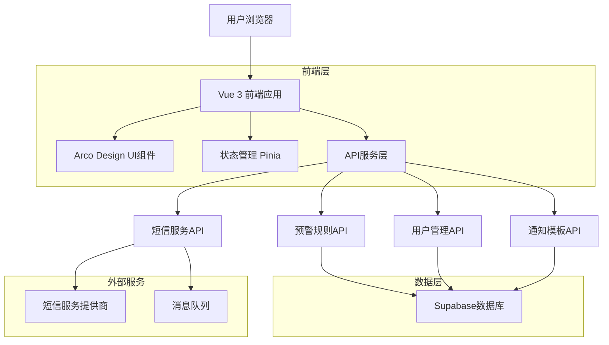
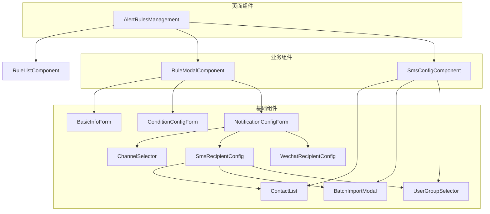
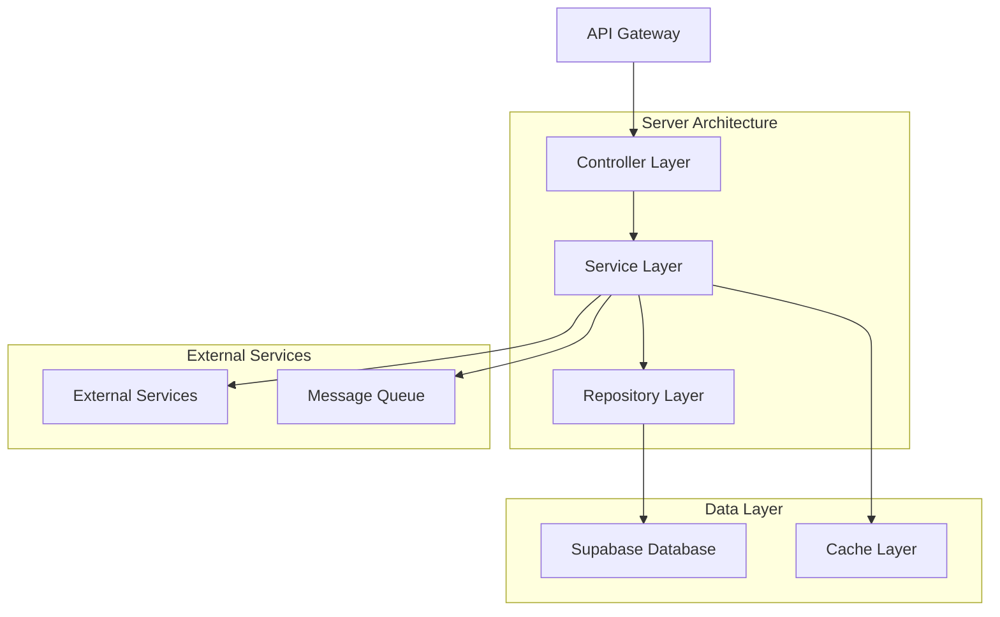
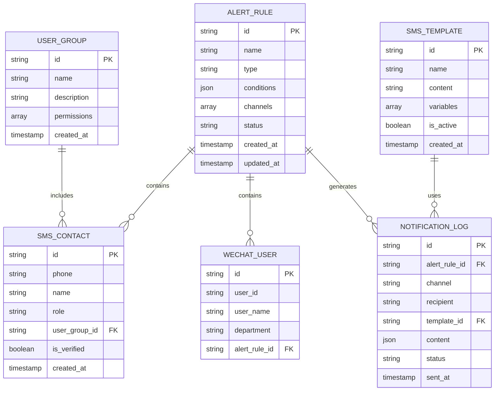

# 营销预警规则短信通知功能技术架构文档

## 1. 架构设计

### 1.1 系统架构图


### 1.2 组件架构


## 2. 技术栈描述

### 2.1 前端技术栈
- **框架**: Vue 3.4+ with Composition API
- **构建工具**: Vite 5.0+
- **UI组件库**: Arco Design Vue 2.5+
- **状态管理**: Pinia 2.1+
- **路由管理**: Vue Router 4.2+
- **HTTP客户端**: Axios 1.6+
- **类型支持**: TypeScript 5.0+
- **工具库**: 
  - @vueuse/core - Vue组合式工具
  - dayjs - 日期处理
  - lodash-es - 工具函数
  - xlsx - Excel文件处理

### 2.2 初始化工具
- **项目初始化**: Vite-init (Vue 3 + TypeScript模板)
- **包管理**: pnpm (性能优化和磁盘空间节省)

### 2.3 后端服务
- **数据库**: Supabase (PostgreSQL + 实时订阅)
- **认证服务**: Supabase Auth (支持企业微信SSO)
- **文件存储**: Supabase Storage (用户上传文件)
- **边缘函数**: Supabase Edge Functions (服务端逻辑)

### 2.4 外部服务集成
- **短信服务**: 阿里云短信服务 / 腾讯云短信
- **企业微信**: 企业微信API集成
- **邮件服务**: SendGrid / 阿里云邮件推送

## 3. 路由定义

| 路由路径 | 页面组件 | 功能描述 |
|----------|----------|----------|
| /marketing/alert/management | AlertManagement.vue | 预警管理主页面 |
| /marketing/alert/rules | AlertRules.vue | 预警规则配置页面 |
| /marketing/alert/rules/create | AlertRuleCreate.vue | 创建新规则页面 |
| /marketing/alert/rules/edit/:id | AlertRuleEdit.vue | 编辑规则页面 |
| /marketing/alert/sms-config | SmsConfig.vue | 短信配置管理页面 |
| /marketing/alert/user-groups | UserGroups.vue | 用户组管理页面 |
| /marketing/alert/templates | NotificationTemplates.vue | 通知模板管理页面 |
| /marketing/alert/setup-guide | SetupGuide.vue | 配置向导页面 |

## 4. API接口定义

### 4.1 预警规则API

#### 获取规则列表
```
GET /api/alert-rules
```

请求参数:
| 参数名 | 类型 | 必需 | 描述 |
|--------|------|------|------|
| page | number | 否 | 页码，默认1 |
| pageSize | number | 否 | 每页条数，默认20 |
| search | string | 否 | 搜索关键词 |
| type | string | 否 | 规则类型筛选 |
| status | string | 否 | 状态筛选 |

响应数据:
```json
{
  "success": true,
  "data": {
    "list": [
      {
        "id": "alert_001",
        "name": "库存不足预警",
        "type": "inventory",
        "conditions": {
          "threshold": 100,
          "thresholdType": "absolute"
        },
        "channels": ["sms", "email"],
        "recipients": {
          "smsContacts": [
            {
              "phone": "13800138000",
              "name": "张三",
              "role": "manager"
            }
          ]
        },
        "status": "active",
        "createdAt": "2024-01-15T10:30:00Z"
      }
    ],
    "total": 50,
    "page": 1,
    "pageSize": 20
  }
}
```

#### 创建预警规则
```
POST /api/alert-rules
```

请求体:
```json
{
  "name": "库存不足预警",
  "type": "inventory",
  "description": "监控优惠券库存",
  "conditions": {
    "threshold": 100,
    "thresholdType": "absolute",
    "checkInterval": "15min"
  },
  "channels": ["sms", "email"],
  "recipients": {
    "smsContacts": [
      {
        "phone": "13800138000",
        "name": "张三",
        "role": "manager"
      }
    ],
    "wechatUsers": []
  },
  "status": "active"
}
```

### 4.2 用户管理API

#### 获取用户组列表
```
GET /api/user-groups
```

#### 批量导入用户
```
POST /api/user-groups/batch-import
```

请求体:
```json
{
  "groupId": "group_001",
  "users": [
    {
      "phone": "13800138000",
      "name": "张三",
      "role": "manager",
      "department": "marketing"
    }
  ]
}
```

### 4.3 短信服务API

#### 发送测试短信
```
POST /api/sms/test
```

请求体:
```json
{
  "phone": "13800138000",
  "templateId": "template_001",
  "params": {
    "ruleName": "库存不足预警",
    "currentValue": 50,
    "threshold": 100
  }
}
```

#### 验证手机号
```
POST /api/sms/validate-phone
```

请求体:
```json
{
  "phone": "13800138000"
}
```

## 5. 服务端架构

### 5.1 服务分层架构


### 5.2 核心服务模块

#### 5.2.1 控制器层 (Controller Layer)
- **AlertRuleController**: 处理预警规则相关HTTP请求
- **UserController**: 处理用户管理相关请求
- **SmsController**: 处理短信服务相关请求
- **TemplateController**: 处理通知模板相关请求

#### 5.2.2 服务层 (Service Layer)
- **AlertRuleService**: 业务逻辑处理，规则验证
- **UserService**: 用户管理，权限验证
- **SmsService**: 短信发送，手机号验证
- **NotificationService**: 通知编排，多渠道发送

#### 5.2.3 数据访问层 (Repository Layer)
- **AlertRuleRepository**: 预警规则数据访问
- **UserRepository**: 用户数据访问
- **TemplateRepository**: 模板数据访问

## 6. 数据模型设计

### 6.1 数据库实体关系图


### 6.2 数据表定义

#### 预警规则表 (alert_rules)
```sql
CREATE TABLE alert_rules (
    id UUID PRIMARY KEY DEFAULT gen_random_uuid(),
    name VARCHAR(255) NOT NULL,
    type VARCHAR(50) NOT NULL,
    description TEXT,
    conditions JSONB NOT NULL,
    channels VARCHAR(50)[] NOT NULL,
    recipients JSONB,
    status VARCHAR(20) DEFAULT 'active' CHECK (status IN ('active', 'inactive')),
    created_at TIMESTAMP WITH TIME ZONE DEFAULT NOW(),
    updated_at TIMESTAMP WITH TIME ZONE DEFAULT NOW()
);

-- 索引
CREATE INDEX idx_alert_rules_type ON alert_rules(type);
CREATE INDEX idx_alert_rules_status ON alert_rules(status);
CREATE INDEX idx_alert_rules_created_at ON alert_rules(created_at DESC);
```

#### 短信联系人表 (sms_contacts)
```sql
CREATE TABLE sms_contacts (
    id UUID PRIMARY KEY DEFAULT gen_random_uuid(),
    phone VARCHAR(20) NOT NULL UNIQUE,
    name VARCHAR(100),
    role VARCHAR(50),
    user_group_id UUID REFERENCES user_groups(id),
    is_verified BOOLEAN DEFAULT false,
    verification_code VARCHAR(6),
    verification_expires_at TIMESTAMP WITH TIME ZONE,
    created_at TIMESTAMP WITH TIME ZONE DEFAULT NOW(),
    updated_at TIMESTAMP WITH TIME ZONE DEFAULT NOW()
);

-- 索引
CREATE INDEX idx_sms_contacts_phone ON sms_contacts(phone);
CREATE INDEX idx_sms_contacts_user_group ON sms_contacts(user_group_id);
CREATE INDEX idx_sms_contacts_verified ON sms_contacts(is_verified);
```

#### 用户组表 (user_groups)
```sql
CREATE TABLE user_groups (
    id UUID PRIMARY KEY DEFAULT gen_random_uuid(),
    name VARCHAR(100) NOT NULL UNIQUE,
    description TEXT,
    permissions VARCHAR(100)[],
    created_by UUID,
    created_at TIMESTAMP WITH TIME ZONE DEFAULT NOW(),
    updated_at TIMESTAMP WITH TIME ZONE DEFAULT NOW()
);

-- 初始数据
INSERT INTO user_groups (name, description, permissions) VALUES
('marketing_team', '营销团队', ARRAY['alert.create', 'alert.edit', 'alert.view']),
('tech_support', '技术支持', ARRAY['alert.view', 'alert.tech.manage']),
('admin', '系统管理员', ARRAY['alert.*', 'user.*', 'template.*']);
```

#### 短信模板表 (sms_templates)
```sql
CREATE TABLE sms_templates (
    id UUID PRIMARY KEY DEFAULT gen_random_uuid(),
    name VARCHAR(255) NOT NULL,
    content TEXT NOT NULL,
    variables VARCHAR(100)[],
    is_active BOOLEAN DEFAULT true,
    created_by UUID,
    created_at TIMESTAMP WITH TIME ZONE DEFAULT NOW(),
    updated_at TIMESTAMP WITH TIME ZONE DEFAULT NOW()
);

-- 初始模板数据
INSERT INTO sms_templates (name, content, variables) VALUES
('库存预警模板', '【优惠券预警】{{ruleName}}：当前库存{{currentValue}}，低于阈值{{threshold}}，请及时处理。', ARRAY['ruleName', 'currentValue', 'threshold']),
('过期预警模板', '【优惠券预警】{{ruleName}}：{{couponName}}将在{{expiryDays}}天后过期，请关注。', ARRAY['ruleName', 'couponName', 'expiryDays']);
```

#### 通知日志表 (notification_logs)
```sql
CREATE TABLE notification_logs (
    id UUID PRIMARY KEY DEFAULT gen_random_uuid(),
    alert_rule_id UUID REFERENCES alert_rules(id),
    channel VARCHAR(20) NOT NULL,
    recipient VARCHAR(255) NOT NULL,
    template_id UUID REFERENCES sms_templates(id),
    content JSONB,
    status VARCHAR(20) DEFAULT 'pending' CHECK (status IN ('pending', 'sent', 'failed', 'delivered')),
    error_message TEXT,
    sent_at TIMESTAMP WITH TIME ZONE,
    created_at TIMESTAMP WITH TIME ZONE DEFAULT NOW()
);

-- 索引
CREATE INDEX idx_notification_logs_rule ON notification_logs(alert_rule_id);
CREATE INDEX idx_notification_logs_channel ON notification_logs(channel);
CREATE INDEX idx_notification_logs_status ON notification_logs(status);
CREATE INDEX idx_notification_logs_created_at ON notification_logs(created_at DESC);
```

## 7. 安全设计

### 7.1 数据安全
- **数据加密**: 敏感数据（手机号）使用AES-256加密存储
- **访问控制**: 基于角色的权限控制（RBAC）
- **审计日志**: 所有操作记录审计日志
- **数据脱敏**: 前端展示时手机号脱敏处理

### 7.2 接口安全
- **身份认证**: JWT Token认证机制
- **请求签名**: 重要操作使用请求签名验证
- **频率限制**: API调用频率限制，防止滥用
- **输入验证**: 严格的输入验证和SQL注入防护

### 7.3 隐私保护
- **手机号验证**: 发送验证码验证手机号真实性
- **数据最小化**: 只收集必要的用户信息
- **数据保留**: 设置数据保留期限，到期自动清理
- **用户授权**: 明确告知用户数据使用目的

## 8. 性能优化

### 8.1 前端优化
- **代码分割**: 路由级别的代码分割
- **组件懒加载**: 大型组件按需加载
- **图片优化**: 使用WebP格式，响应式图片
- **缓存策略**: 合理使用浏览器缓存和Service Worker

### 8.2 后端优化
- **数据库索引**: 合理的索引设计
- **查询优化**: 避免N+1查询问题
- **连接池**: 数据库连接池管理
- **缓存层**: Redis缓存热点数据

### 8.3 网络优化
- **CDN加速**: 静态资源CDN分发
- **压缩传输**: 启用Gzip/Brotli压缩
- **HTTP/2**: 使用HTTP/2协议
- **预加载**: 关键资源预加载

## 9. 监控和运维

### 9.1 应用监控
- **性能监控**: 页面加载时间、API响应时间
- **错误监控**: JavaScript错误、API错误率
- **业务监控**: 规则创建成功率、短信发送成功率
- **用户行为**: 用户操作路径、功能使用频率

### 9.2 基础设施监控
- **服务器监控**: CPU、内存、磁盘使用率
- **数据库监控**: 连接数、查询性能、慢查询
- **网络监控**: 带宽使用、网络延迟
- **服务健康**: 服务可用性、响应时间

### 9.3 告警机制
- **多级告警**: 警告、严重、致命三级告警
- **通知渠道**: 短信、邮件、企业微信
- **告警收敛**: 避免告警风暴
- **自动恢复**: 自动故障恢复机制