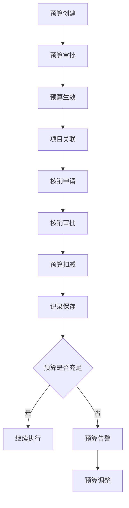
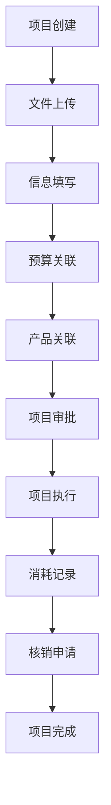
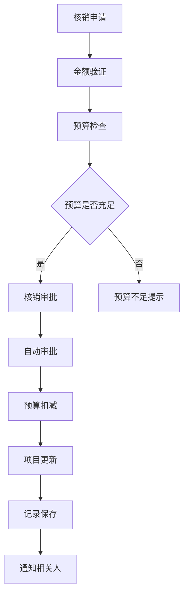

# 预算总览页面重构产品需求文档

## 1. 产品概述

重新设计预算总览页面，将外数预算管理和采购项目管理融合在一个统一的视图中。实现预算与采购项目的深度关联，支持预算金额的核销功能，采购项目展示真实消耗金额，提供完整的预算生命周期管理和可视化展示。

目标用户：财务管理人员、预算管理员、采购项目负责人
核心价值：提高预算管理效率，实现预算执行的实时监控，确保预算使用的合规性和透明度。

## 2. 核心功能

### 2.1 用户角色

| 角色 | 注册方式 | 核心权限 |
|------|----------|----------|
| 预算管理员 | 系统管理员分配 | 创建预算、审批预算、执行核销、查看所有数据 |
| 采购项目负责人 | 邮箱注册 + 管理员审核 | 创建采购项目、关联预算、申请核销、查看负责项目 |
| 财务审核员 | 系统管理员分配 | 审核核销申请、查看预算执行情况、导出报表 |
| 普通查看者 | 邮箱注册 | 查看预算和项目信息、导出权限范围内的数据 |

### 2.2 功能模块

**预算总览融合页面包含以下核心模块：**

1. **预算统计概览**：总预算金额、已使用金额、剩余金额、执行率统计
2. **采购项目统计**：项目总数、进行中项目、已完成项目、项目总金额
3. **预算-项目关联图**：可视化展示预算与采购项目的关系和资金流向
4. **预算列表管理**：预算创建、编辑、详情查看、核销操作
5. **采购项目列表**：项目创建、编辑、状态管理、详情查看
6. **核销管理中心**：单笔核销、批量核销、核销记录查看
7. **数据筛选搜索**：多条件组合筛选、快速搜索、高级搜索
8. **导出报表功能**：预算报表、项目报表、核销记录导出

### 2.3 页面详情

#### 2.3.1 预算总览融合页面

| 模块名称 | 功能描述 |
|----------|----------|
| 页面头部 | 显示页面标题、快速操作按钮（新建预算、新建项目、批量操作）、刷新按钮 |
| 统计概览区 | 展示预算相关统计卡片：总预算、已使用、剩余金额、执行率；项目相关统计：总项目数、进行中、已完成、项目总金额 |
| 关系图表区 | 使用AntV X6展示预算与采购项目的关联关系，支持拖拽、缩放、点击查看详情 |
| 预算列表区 | 表格展示预算信息，支持排序、筛选、分页，包含操作列（查看、编辑、核销） |
| 项目列表区 | 表格展示采购项目信息，支持排序、筛选、分页，包含操作列（查看、编辑、状态变更） |
| 核销操作区 | 快速核销入口，显示待核销项目列表，支持一键核销和批量核销 |
| 搜索筛选区 | 提供多条件搜索：预算年度、业务类型、项目状态、负责人、金额范围等 |

#### 2.3.2 预算详情页面

| 模块名称 | 功能描述 |
|----------|----------|
| 预算基本信息 | 展示预算编号、名称、年度、业务类型、平台产品、总额等基本信息 |
| 预算使用情况 | 显示总预算、已使用、剩余金额，使用进度条展示执行率 |
| 核销记录列表 | 表格展示所有核销记录，包含核销金额、项目、原因、时间、操作人 |
| 关联项目列表 | 展示使用该预算的所有采购项目，显示项目状态和金额 |
| 核销操作面板 | 提供核销功能：选择项目、输入核销金额、填写核销原因、提交核销 |
| 预算分解视图 | 按时间维度（月度、季度）展示预算分解和使用情况 |

#### 2.3.3 采购项目详情页面

| 模块名称 | 功能描述 |
|----------|----------|
| 项目基本信息 | 展示项目编号、名称、采购用量、总金额、采购日期、负责人 |
| 预算关联信息 | 显示关联的预算信息，包含预算编号、名称、可用余额 |
| 实际消耗展示 | 展示项目的实际消耗金额，与预算金额对比 |
| 采购文件列表 | 展示上传的采购文件，支持下载和预览 |
| 数据产品关联 | 展示关联的数据产品列表，包含产品名称、供应商、价格 |
| 核销记录 | 显示该项目的所有核销记录 |
| 操作历史 | 展示项目的操作历史记录 |

## 3. 核心流程

### 3.1 预算管理流程

### 3.2 采购项目管理流程

### 3.3 核销管理流程

## 4. 用户界面设计

### 4.1 设计规范

#### 4.1.1 色彩体系
- **主色调**：蓝色系 (#165DFF) - 预算相关元素
- **辅助色**：绿色系 (#00B42A) - 成功状态和项目元素  
- **警示色**：橙色系 (#FF7D00) - 核销和警告状态
- **错误色**：红色系 (#F53F3F) - 错误和删除操作
- **中性色**：灰色系 (#F2F3F5) - 背景和边框

#### 4.1.2 字体规范
- **标题字体**：16px 加粗，主要信息展示
- **正文字体**：14px 常规，内容展示
- **辅助文字**：12px 常规，次要信息
- **数字字体**：14px 等宽字体，金额展示

#### 4.1.3 按钮样式
- **主要按钮**：圆角 4px，主色调背景，白色文字
- **次要按钮**：圆角 4px，白色背景，主色调边框
- **文字按钮**：无边框，主色调文字，hover效果
- **危险按钮**：红色系配色，用于删除操作

#### 4.1.4 布局规范
- **卡片间距**：16px 标准间距
- **表格行高**：48px 标准高度
- **表单间距**：24px 垂直间距
- **响应式断点**：768px、1024px、1440px

### 4.2 页面布局设计

#### 4.2.1 预算总览页面布局

**顶部区域 (高度: 80px)**
- 页面标题：左侧，24px字体
- 快速操作：右侧，主要按钮组

**统计概览区 (高度: 160px)**
- 4个统计卡片，横向排列
- 每个卡片包含图标、数值、标签
- 悬停效果，点击可查看详情

**关系图表区 (高度: 400px)**
- AntV X6 关系图，全宽展示
- 支持拖拽、缩放、节点点击
- 预算节点和项目节点不同颜色

**数据列表区 (高度: 自适应)**
- 预算列表和项目列表并排或上下排列
- 表格展示，支持排序和筛选
- 分页控件在底部

**搜索筛选区 (高度: 80px)**
- 多条件搜索表单
- 折叠展开，节省空间
- 快速筛选标签

#### 4.2.2 预算详情页面布局

**基本信息区 (高度: 200px)**
- 两列布局展示预算信息
- 关键数据突出显示
- 编辑按钮在右上角

**使用情况区 (高度: 120px)**
- 进度条展示预算执行率
- 金额数字大字体显示
- 剩余预算警示提醒

**核销操作区 (高度: 200px)**
- 核销表单，输入金额和原因
- 关联项目选择器
- 提交按钮和重置按钮

**记录列表区 (高度: 自适应)**
- 核销记录表格
- 项目关联表格
- 支持导出和打印

### 4.3 交互设计

#### 4.3.1 交互动效
- **页面加载**：骨架屏过渡，1秒超时提示
- **数据更新**：局部刷新，loading状态
- **按钮点击**：按压效果，0.2秒过渡
- **卡片悬停**：阴影加深，上浮2px

#### 4.3.2 操作反馈
- **成功提示**：绿色toast，3秒自动消失
- **错误提示**：红色toast，需要手动关闭
- **确认对话框**：重要操作前的二次确认
- **进度提示**：长时间操作显示进度条

#### 4.3.3 键盘操作
- **表格操作**：方向键导航，Enter查看详情
- **表单操作**：Tab键切换，Enter提交
- **搜索框**：Enter触发搜索，Esc清空
- **模态框**：Esc关闭，Enter确认

### 4.4 响应式设计

#### 4.4.1 移动端适配 (768px以下)
- **统计卡片**：2x2网格布局
- **表格**：横向滚动，固定首列
- **图表**：高度自适应，支持触摸操作
- **操作按钮**：底部固定，方便点击

#### 4.4.2 平板适配 (768px-1024px)
- **统计卡片**：横向排列，适当缩小
- **表格**：减少列数，优先展示重要信息
- **图表**：保持交互功能，优化触摸体验
- **侧边栏**：可收起，增加内容区域

#### 4.4.3 桌面端适配 (1024px以上)
- **全功能展示**：所有模块完整显示
- **多列布局**：充分利用屏幕宽度
- **高级功能**：批量操作、快捷键支持
- **数据密度**：适当增加信息密度

## 5. 数据需求

### 5.1 预算数据统计需求

#### 5.1.1 核心指标
- **总预算金额**：所有预算的总和
- **已使用金额**：已核销金额的总和
- **剩余金额**：总预算减去已使用
- **平均执行率**：所有预算执行率的平均值
- **活跃预算数**：状态为active的预算数量

#### 5.1.2 分析维度
- **时间维度**：按年度、季度、月度统计
- **业务维度**：按业务类型、平台产品统计
- **状态维度**：按预算状态、项目状态统计
- **组织维度**：按创建人、负责人统计

### 5.2 采购项目统计需求

#### 5.2.1 核心指标
- **项目总数**：所有采购项目的数量
- **进行中项目**：状态为in_progress的项目数
- **已完成项目**：状态为completed的项目数
- **项目总金额**：所有项目的总金额
- **平均项目金额**：项目总金额除以项目数

#### 5.2.2 分析维度
- **项目状态**：待审批、进行中、已完成、已取消
- **预算关联**：关联预算的使用情况
- **时间分布**：按创建时间、完成时间分布
- **负责人分布**：按项目负责人统计

### 5.3 核销数据统计需求

#### 5.3.1 核心指标
- **总核销金额**：所有核销记录的总和
- **核销笔数**：核销记录的总数量
- **平均核销金额**：总核销金额除以核销笔数
- **核销频率**：单位时间内的核销次数
- **预算覆盖率**：有核销记录的预算占比

#### 5.3.2 预警指标
- **预算告警**：剩余预算低于阈值的预算数量
- **超支预警**：已使用金额超过预算的90%
- **异常核销**：单笔核销金额过大的记录
- **长期未核销**：超过一定时间未核销的预算

## 6. 非功能性需求

### 6.1 性能要求

#### 6.1.1 响应时间
- **页面加载时间**：首屏加载 < 3秒
- **数据查询时间**：列表查询 < 1秒
- **操作响应时间**：按钮点击 < 0.5秒
- **导出操作时间**：数据导出 < 5秒

#### 6.1.2 并发处理
- **并发用户数**：支持100个并发用户
- **并发操作数**：支持50个并发操作
- **数据库连接**：连接池最小10个，最大50个
- **缓存命中率**：Redis缓存命中率 > 80%

### 6.2 可用性要求

#### 6.2.1 系统可用性
- **系统可用性**：99.9%的年可用性
- **故障恢复时间**：RTO < 4小时
- **数据恢复点**：RPO < 15分钟
- **维护窗口**：每月不超过4小时

#### 6.2.2 用户体验
- **易学性**：新用户5分钟内能完成基本操作
- **易用性**：常用操作不超过3步完成
- **可访问性**：支持键盘导航和屏幕阅读器
- **多语言支持**：中文界面，预留国际化接口

### 6.3 安全要求

#### 6.3.1 数据安全
- **数据加密**：敏感数据AES-256加密存储
- **传输安全**：HTTPS协议，TLS 1.3
- **访问控制**：基于角色的权限控制
- **审计日志**：完整的操作审计记录

#### 6.3.2 应用安全
- **身份认证**：JWT令牌，2小时过期
- **输入验证**：前端和后端双重验证
- **SQL注入防护**：参数化查询
- **XSS防护**：内容安全策略

### 6.4 兼容性要求

#### 6.4.1 浏览器兼容
- **Chrome**：版本90及以上
- **Firefox**：版本88及以上
- **Safari**：版本14及以上
- **Edge**：版本90及以上

#### 6.4.2 设备兼容
- **桌面端**：1366x768分辨率及以上
- **平板端**：768px宽度及以上
- **手机端**：375px宽度及以上
- **打印支持**：支持预算报表打印

## 7. 项目实施计划

### 7.1 开发阶段划分

#### 7.1.1 第一阶段：基础框架 (2周)
- **数据库设计**：完成所有数据表设计
- **API开发**：完成核心CRUD接口
- **前端框架**：搭建页面框架和路由
- **基础组件**：开发通用组件和工具函数

#### 7.1.2 第二阶段：核心功能 (3周)
- **预算管理**：实现预算CRUD和统计功能
- **项目管理**：实现采购项目CRUD功能
- **关联功能**：实现预算-项目关联
- **基础展示**：完成列表和统计展示

#### 7.1.3 第三阶段：高级功能 (2周)
- **核销功能**：实现核销流程和记录
- **可视化**：实现关系图和图表
- **搜索筛选**：实现高级搜索功能
- **导出功能**：实现数据导出

#### 7.1.4 第四阶段：优化完善 (1周)
- **性能优化**：优化查询和渲染性能
- **用户体验**：完善交互和提示
- **测试修复**：修复发现的问题
- **文档完善**：完善使用文档

### 7.2 里程碑节点

| 里程碑 | 时间节点 | 交付内容 | 验收标准 |
|--------|----------|----------|----------|
| M1：基础框架完成 | 第2周末 | 数据库、API、前端框架 | API测试通过，基础页面可访问 |
| M2：核心功能完成 | 第5周末 | 预算和项目管理功能 | 功能测试通过，数据正确展示 |
| M3：高级功能完成 | 第7周末 | 核销和可视化功能 | 业务流程跑通，图表正确显示 |
| M4：项目交付 | 第8周末 | 完整功能和文档 | 所有需求实现，文档完整 |

### 7.3 风险管控

#### 7.3.1 技术风险
- **AntV X6兼容性**：提前验证图表组件兼容性
- **性能瓶颈**：提前进行性能测试和优化
- **数据一致性**：设计事务机制保证数据一致

#### 7.3.2 进度风险
- **需求变更**：建立需求变更管理流程
- **人员变动**：建立代码文档和知识传承机制
- **外部依赖**：提前确认第三方服务可用性

#### 7.3.3 质量风险
- **测试覆盖**：制定完整的测试计划
- **代码质量**：建立代码审查机制
- **安全漏洞**：进行安全测试和修复