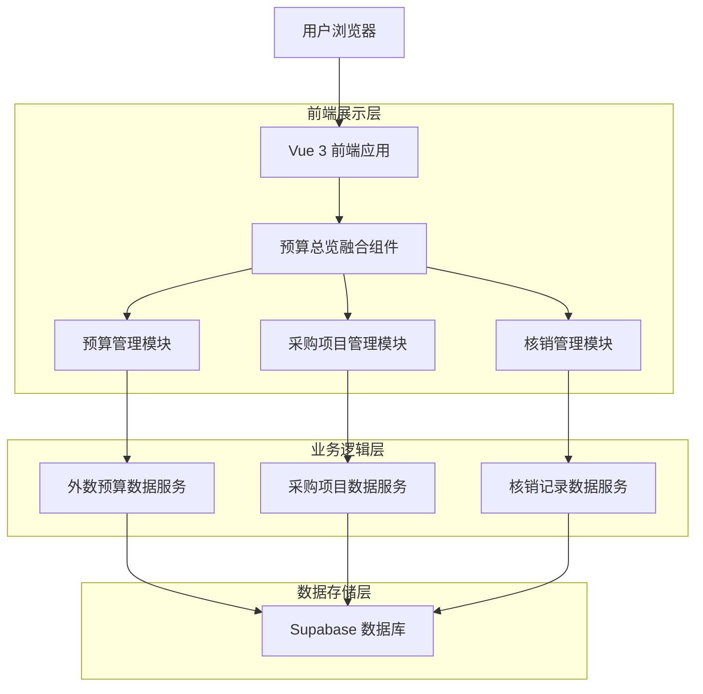
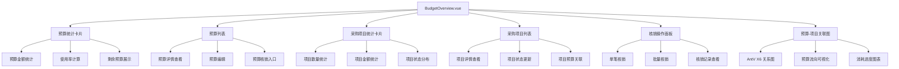
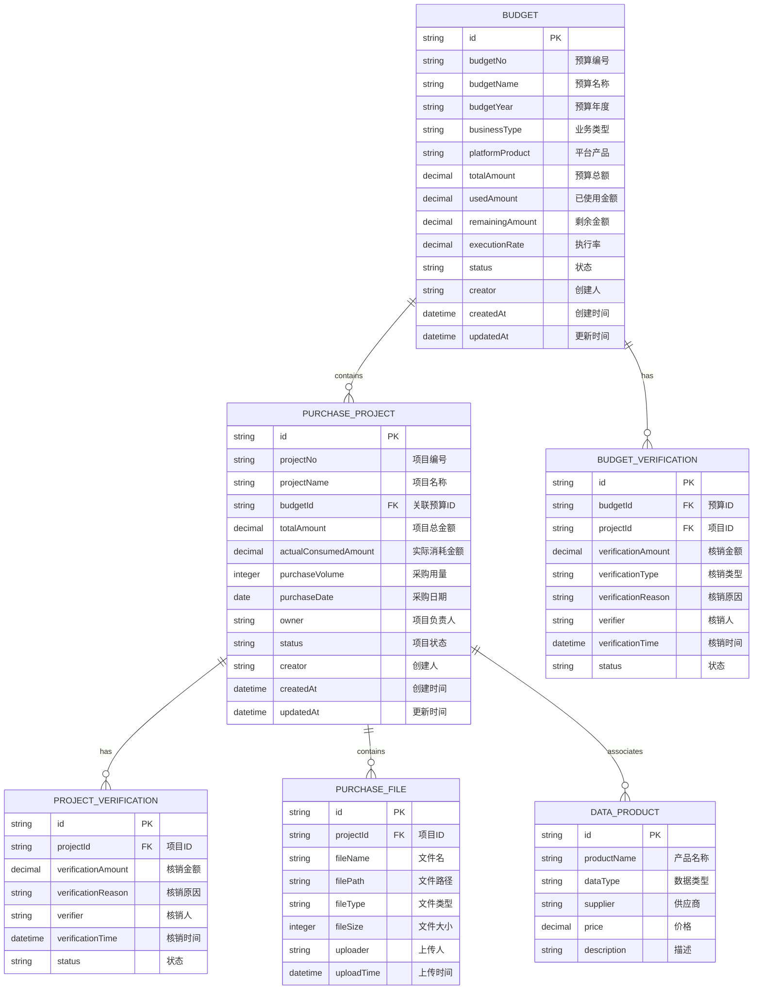
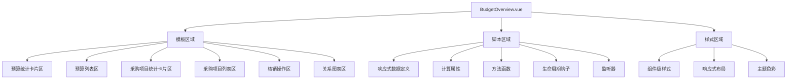

# 预算总览页面重构技术架构文档

## 1. 架构设计

### 1.1 整体架构图



### 1.2 组件架构图



## 2. 技术栈描述

- **前端框架**: Vue 3 (Composition API)
- **构建工具**: Vite
- **状态管理**: Vuex
- **路由管理**: Vue Router
- **UI组件**: Arco Design
- **图形引擎**: AntV X6
- **后端服务**: Supabase (PostgreSQL)
- **开发语言**: JavaScript + TypeScript
- **初始化工具**: vite-init

## 3. 路由定义

| 路由 | 用途 |
|-------|---------|
| /budget/overview | 预算总览融合页面，展示预算管理和采购项目管理 |
| /budget/detail/:id | 预算详情页面，包含核销功能 |
| /budget/create | 新建预算页面 |
| /budget/edit/:id | 编辑预算页面 |
| /discovery/asset-management/external-purchase-register | 采购项目登记页面 |

## 4. 数据模型设计

### 4.1 实体关系图



### 4.2 数据表定义

#### 预算表 (budgets)
```sql
-- 创建预算表
CREATE TABLE budgets (
    id UUID PRIMARY KEY DEFAULT gen_random_uuid(),
    budget_no VARCHAR(50) UNIQUE NOT NULL,
    budget_name VARCHAR(200) NOT NULL,
    budget_year VARCHAR(4) NOT NULL,
    business_type VARCHAR(100),
    platform_product VARCHAR(100),
    total_amount DECIMAL(15,2) NOT NULL DEFAULT 0,
    used_amount DECIMAL(15,2) NOT NULL DEFAULT 0,
    remaining_amount DECIMAL(15,2) NOT NULL DEFAULT 0,
    execution_rate DECIMAL(5,2) NOT NULL DEFAULT 0,
    status VARCHAR(20) DEFAULT 'active' CHECK (status IN ('active', 'inactive', 'expired')),
    creator VARCHAR(100),
    created_at TIMESTAMP WITH TIME ZONE DEFAULT NOW(),
    updated_at TIMESTAMP WITH TIME ZONE DEFAULT NOW()
);

-- 创建索引
CREATE INDEX idx_budgets_year ON budgets(budget_year);
CREATE INDEX idx_budgets_status ON budgets(status);
CREATE INDEX idx_budgets_creator ON budgets(creator);
```

#### 采购项目表 (purchase_projects)
```sql
-- 创建采购项目表
CREATE TABLE purchase_projects (
    id UUID PRIMARY KEY DEFAULT gen_random_uuid(),
    project_no VARCHAR(50) UNIQUE NOT NULL,
    project_name VARCHAR(200) NOT NULL,
    budget_id UUID REFERENCES budgets(id) ON DELETE SET NULL,
    total_amount DECIMAL(15,2) NOT NULL DEFAULT 0,
    actual_consumed_amount DECIMAL(15,2) NOT NULL DEFAULT 0,
    purchase_volume INTEGER NOT NULL DEFAULT 0,
    purchase_date DATE NOT NULL,
    owner VARCHAR(100),
    status VARCHAR(20) DEFAULT 'pending' CHECK (status IN ('pending', 'in_progress', 'completed', 'cancelled')),
    creator VARCHAR(100),
    created_at TIMESTAMP WITH TIME ZONE DEFAULT NOW(),
    updated_at TIMESTAMP WITH TIME ZONE DEFAULT NOW()
);

-- 创建索引
CREATE INDEX idx_projects_budget_id ON purchase_projects(budget_id);
CREATE INDEX idx_projects_status ON purchase_projects(status);
CREATE INDEX idx_projects_owner ON purchase_projects(owner);
CREATE INDEX idx_projects_purchase_date ON purchase_projects(purchase_date);
```

#### 预算核销记录表 (budget_verifications)
```sql
-- 创建预算核销记录表
CREATE TABLE budget_verifications (
    id UUID PRIMARY KEY DEFAULT gen_random_uuid(),
    budget_id UUID NOT NULL REFERENCES budgets(id) ON DELETE CASCADE,
    project_id UUID REFERENCES purchase_projects(id) ON DELETE SET NULL,
    verification_amount DECIMAL(15,2) NOT NULL,
    verification_type VARCHAR(50) DEFAULT 'normal',
    verification_reason TEXT,
    verifier VARCHAR(100),
    verification_time TIMESTAMP WITH TIME ZONE DEFAULT NOW(),
    status VARCHAR(20) DEFAULT 'active' CHECK (status IN ('active', 'cancelled')),
    created_at TIMESTAMP WITH TIME ZONE DEFAULT NOW()
);

-- 创建索引
CREATE INDEX idx_verifications_budget_id ON budget_verifications(budget_id);
CREATE INDEX idx_verifications_project_id ON budget_verifications(project_id);
CREATE INDEX idx_verifications_verifier ON budget_verifications(verifier);
CREATE INDEX idx_verifications_verification_time ON budget_verifications(verification_time);
```

## 5. 核心API定义

### 5.1 预算管理API

#### 获取预算列表
```
GET /api/budgets
```

请求参数：
| 参数名 | 参数类型 | 是否必需 | 描述 |
|-----------|-------------|-------------|-------------|
| page | number | false | 页码，默认1 |
| pageSize | number | false | 每页条数，默认20 |
| budgetYear | string | false | 预算年度 |
| businessType | string | false | 业务类型 |
| status | string | false | 状态 |

响应数据：
| 参数名 | 参数类型 | 描述 |
|-----------|-------------|-------------|
| data | array | 预算列表数据 |
| total | number | 总记录数 |
| page | number | 当前页码 |
| pageSize | number | 每页条数 |

#### 获取预算详情
```
GET /api/budgets/:id
```

响应数据：
| 参数名 | 参数类型 | 描述 |
|-----------|-------------|-------------|
| id | string | 预算ID |
| budgetNo | string | 预算编号 |
| budgetName | string | 预算名称 |
| totalAmount | number | 预算总额 |
| usedAmount | number | 已使用金额 |
| remainingAmount | number | 剩余金额 |
| projects | array | 关联的采购项目 |

### 5.2 采购项目API

#### 获取采购项目列表
```
GET /api/purchase-projects
```

请求参数：
| 参数名 | 参数类型 | 是否必需 | 描述 |
|-----------|-------------|-------------|-------------|
| page | number | false | 页码，默认1 |
| pageSize | number | false | 每页条数，默认20 |
| budgetId | string | false | 预算ID |
| projectNo | string | false | 项目编号 |
| status | string | false | 项目状态 |
| owner | string | false | 项目负责人 |

#### 创建采购项目
```
POST /api/purchase-projects
```

请求体：
```json
{
  "projectNo": "PROJ2024001",
  "projectName": "数据采购项目A",
  "budgetId": "budget-id-123",
  "totalAmount": 100000,
  "purchaseVolume": 50000,
  "purchaseDate": "2024-01-15",
  "owner": "张三",
  "description": "项目说明"
}
```

### 5.3 核销管理API

#### 预算核销
```
POST /api/budgets/:budgetId/verify
```

请求体：
```json
{
  "projectId": "project-id-456",
  "verificationAmount": 50000,
  "verificationReason": "采购项目核销",
  "verificationType": "normal"
}
```

#### 获取核销记录
```
GET /api/budgets/:budgetId/verifications
```

响应数据：
| 参数名 | 参数类型 | 描述 |
|-----------|-------------|-------------|
| data | array | 核销记录列表 |
| totalVerificationAmount | number | 总核销金额 |

## 6. 前端组件设计

### 6.1 预算总览融合组件结构



### 6.2 核心功能模块

#### 6.2.1 预算-项目关联展示
- 使用 AntV X6 创建关系图，展示预算与采购项目的关联关系
- 实时显示预算流向和消耗进度
- 支持点击查看详细关联信息

#### 6.2.2 核销功能实现
- 在预算详情中集成核销按钮
- 支持单笔核销和批量核销
- 核销金额实时更新预算使用情况
- 记录完整的核销历史

#### 6.2.3 数据联动机制
- 采购项目创建时自动关联预算
- 项目核销金额实时反映到预算使用中
- 预算超支预警和提示
- 项目状态变化同步更新预算状态

### 6.3 用户界面设计

#### 6.3.1 布局设计
- 采用卡片式布局，清晰分区展示
- 统计卡片置于顶部，快速了解整体情况
- 列表区域支持分页和搜索
- 关系图区域提供可视化展示

#### 6.3.2 交互设计
- 点击预算名称查看详情和核销
- 点击项目名称查看项目详情
- 拖拽上传采购文件
- 步骤向导式创建采购项目

#### 6.3.3 视觉设计
- 主色调：蓝色系（预算）、绿色系（项目）、橙色系（核销）
- 状态标签采用不同颜色区分
- 金额数字使用千分位分隔符
- 图表使用渐变色增强视觉效果

## 7. 数据流设计

### 7.1 预算数据流
```
预算创建 → 预算审批 → 预算分配 → 项目关联 → 核销申请 → 核销审批 → 预算更新
```

### 7.2 采购项目数据流
```
项目创建 → 文件上传 → 信息填写 → 产品关联 → 预算分配 → 项目执行 → 金额核销 → 项目完成
```

### 7.3 核销数据流
```
核销申请 → 金额验证 → 预算检查 → 核销执行 → 记录保存 → 预算更新 → 项目更新
```

## 8. 性能优化策略

### 8.1 前端优化
- 使用 Vue 3 的响应式系统优化渲染性能
- 实现虚拟滚动处理大量数据
- 使用防抖和节流优化搜索和筛选
- 组件懒加载减少初始加载时间

### 8.2 数据优化
- 分页加载预算和项目数据
- 使用索引优化数据库查询
- 实现数据缓存机制
- 压缩传输数据减少网络开销

### 8.3 用户体验优化
- 加载状态提示
- 操作反馈和确认
- 错误处理和恢复
- 响应式设计适配多设备

## 9. 安全设计

### 9.1 权限控制
- 基于角色的访问控制（RBAC）
- 预算管理权限分离
- 核销操作权限验证
- 数据访问权限控制

### 9.2 数据安全
- 敏感数据加密存储
- API 接口安全验证
- SQL 注入防护
- XSS 攻击防护

### 9.3 审计日志
- 预算操作日志记录
- 核销行为审计
- 异常操作监控
- 数据变更追踪

## 10. 部署和维护

### 10.1 部署方案
- 使用 Vite 构建生产版本
- 静态资源 CDN 加速
- 环境变量配置管理
- 自动化部署流程

### 10.2 监控和运维
- 前端性能监控
- 错误日志收集
- 用户行为分析
- 系统健康检查

### 10.3 版本管理
- Git 分支管理策略
- 版本号规范
- 发布流程规范
- 回滚机制设计