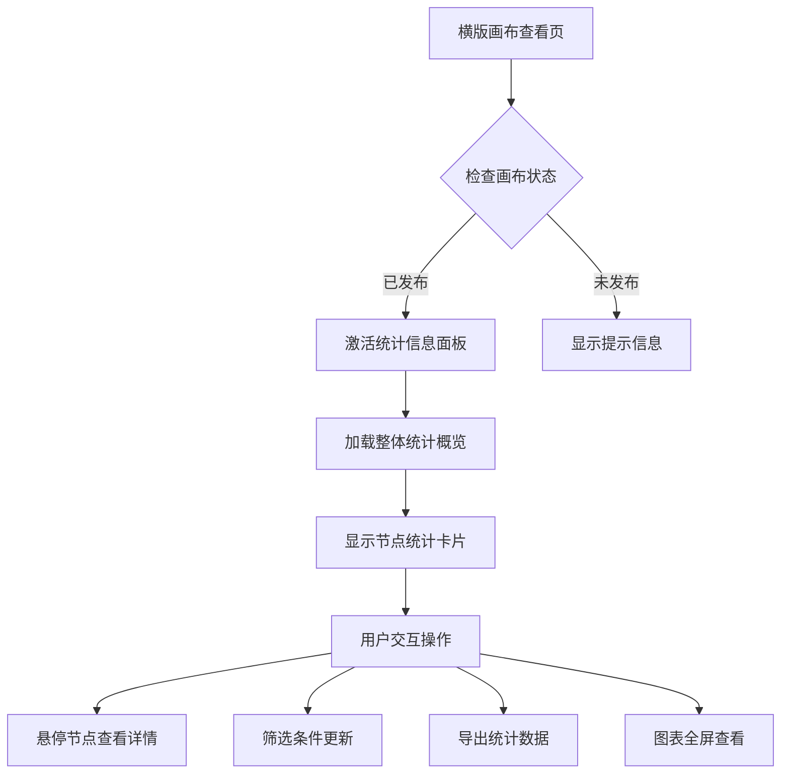
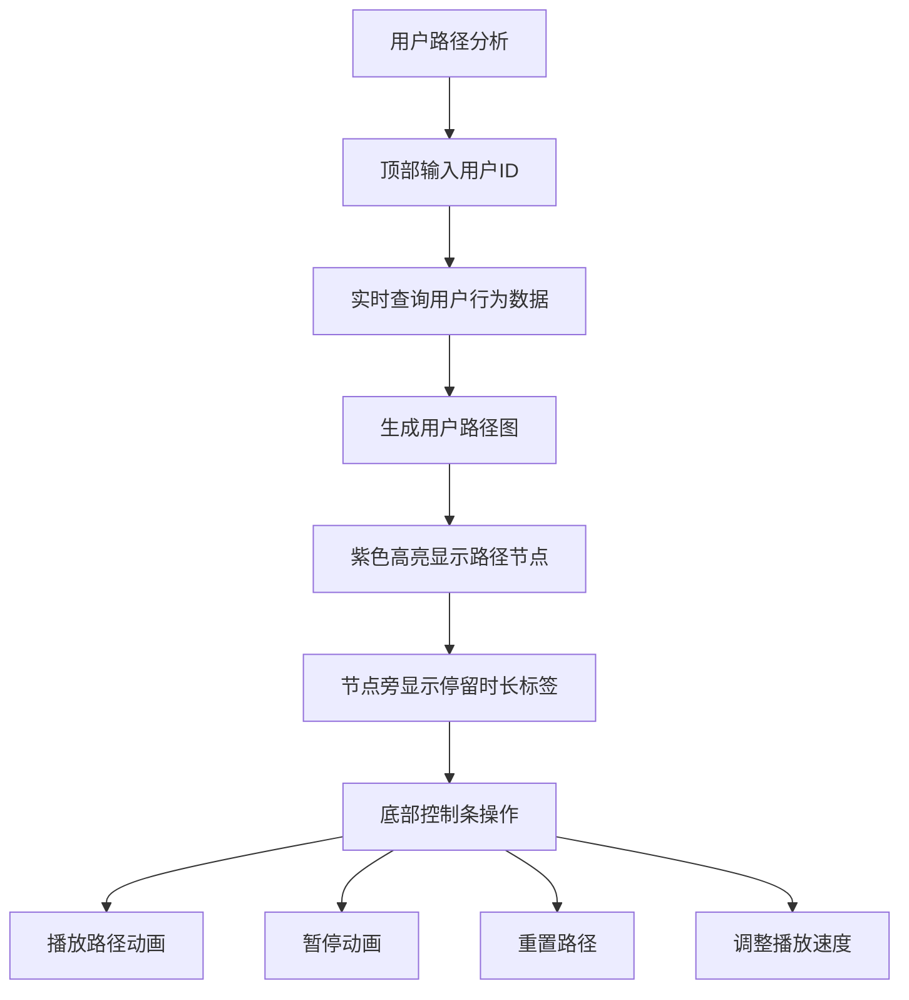

# 横版画布统计信息查询功能需求文档（桌面端专用）

## 1. 产品概述
基于现有横版画布系统，为桌面端用户实现发布后的统计信息查询功能。当画布处于"查看"状态且已发布时，提供全面的节点数据统计、用户行为路径分析和可视化展示功能。

该功能主要解决营销活动效果评估问题，帮助桌面端运营人员：
- 实时监控节点转化效果和用户行为
- 分析用户在画布中的完整行为路径
- 通过可视化图表直观了解活动表现
- 支持数据导出用于进一步分析

## 2. 核心功能

### 2.1 用户角色（桌面端）
| 角色 | 注册方式 | 核心权限 |
|------|----------|----------|
| 普通运营人员 | 系统登录 | 查看统计数据、导出报告、基础筛选 |
| 高级分析师 | 系统登录 | 深度分析、路径回放、自定义筛选、高级图表 |
| 管理员 | 系统登录 | 所有功能权限、数据管理、系统配置 |

### 2.2 功能模块（桌面端优化）
统计信息查询功能包含以下针对桌面端优化的核心模块：

1. **统计信息面板**: 画布右侧固定面板，宽度400px，支持拖拽调整宽度
2. **节点数据统计**: 每个节点的访问量、转化率、停留时长等指标，支持悬浮详情
3. **用户行为路径分析**: 顶部工具栏集成用户筛选器，支持路径高亮和动画回放
4. **数据筛选器**: 桌面端优化的下拉选择器、日期范围选择器、多选筛选
5. **可视化图表**: ECharts集成，支持大图展示、交互式图表、数据钻取
6. **数据导出**: 支持CSV/Excel格式导出，桌面端批量导出功能

### 2.3 页面详情（桌面端专用）

| 页面名称 | 模块名称 | 功能描述 |
|----------|----------|----------|
| 横版画布查看页 | 统计信息面板 | 右侧固定面板，显示整体统计概览卡片，包括总访问量、节点转化总数、活跃用户等关键指标，支持面板宽度调整 |
| 横版画布查看页 | 节点统计悬浮卡片 | 鼠标悬停节点时显示该节点的详细统计数据，包括进入人数、离开人数、转化率、平均停留时长，卡片位置智能避让 |
| 横版画布查看页 | 用户路径分析器 | 顶部工具栏添加用户筛选器，输入用户ID后高亮显示该用户的完整行为路径，支持路径动画回放控制条 |
| 横版画布查看页 | 数据筛选控制 | 时间范围选择器（日/周/月）、节点类型筛选、用户群体筛选，桌面端下拉多选，实时更新统计数据 |
| 横版画布查看页 | 图表展示区域 | 在统计面板中展示各类图表：节点访问量柱状图、转化率趋势折线图、用户路径流向图，支持全屏查看 |
| 横版画布查看页 | 数据导出功能 | 一键导出当前筛选条件下的统计数据为CSV或Excel格式，桌面端支持批量导出和自定义导出字段 |

## 3. 核心流程（桌面端交互优化）

### 3.1 统计信息查看流程

### 3.2 用户行为路径分析流程（桌面端）

## 4. 用户界面设计（桌面端优化）

### 4.1 设计风格（桌面端专用）
- **主色调**: 蓝色系 (#1890ff) 为主，绿色 (#52c41a) 表示成功数据
- **辅助色**: 橙色 (#fa8c16) 表示警告，紫色 (#722ed1) 表示用户路径
- **面板样式**: 右侧固定面板，宽度400px，支持拖拽调整，最小宽度320px
- **卡片设计**: 圆角卡片，阴影效果，悬停状态变化，桌面端优化间距
- **字体规范**: 标题 16px 加粗，正文 14px，辅助文字 12px，代码 13px
- **图标风格**: 线性图标，统一使用 Arco Design 图标库，桌面端16px大小

### 4.2 页面设计详情（桌面端布局）

| 页面名称 | 模块名称 | UI元素 |
|----------|----------|--------|
| 横版画布查看页 | 统计信息面板 | 右侧固定面板，顶部标题栏+收起按钮，4个统计卡片横向排列，大字体突出数值，支持拖拽调整宽度 |
| 横版画布查看页 | 节点统计悬浮卡片 | 智能定位避免遮挡，显示节点ID、访问量、转化率、停留时长，右上角关闭按钮，悬停显示更多详情 |
| 横版画布查看页 | 用户路径分析器 | 顶部工具栏集成搜索框，支持模糊匹配和历史记录，路径高亮使用紫色，节点边框加粗3px |
| 横版画布查看页 | 数据筛选控制 | 桌面端下拉多选框，时间范围选择器支持快速选择和自定义，筛选条件显示标签，一键清空 |
| 横版画布查看页 | 图表展示区域 | ECharts集成，支持大图模式、数据缩放、图例切换，柱状图使用蓝色渐变，折线图多条线对比 |
| 横版画布查看页 | 数据导出功能 | 桌面端批量导出，支持自定义字段选择，导出进度条，CSV/Excel格式选择，文件名自定义 |

### 4.3 桌面端交互优化
- **键盘快捷键**: 支持Ctrl+E导出数据，Ctrl+R刷新统计，空格键暂停/播放动画
- **拖拽操作**: 统计面板宽度拖拽调整，图表支持数据区域缩放
- **右键菜单**: 节点右键显示快速统计选项，画布右键显示导出和刷新功能
- **批量操作**: 支持多选节点批量查看统计，批量导出节点数据
- **记忆功能**: 记住用户面板宽度、筛选条件、图表配置等个性化设置

## 5. 性能要求（桌面端优化）
- **数据加载**: 10万+行为记录查询响应时间 < 2秒，支持后台加载
- **图表渲染**: 1000个节点内图表渲染时间 < 1秒，支持渐进式渲染
- **路径回放**: 动画播放流畅，帧率保持在 30fps 以上，支持硬件加速
- **分页加载**: 节点统计数据分页加载，每页50条记录，支持虚拟滚动
- **内存占用**: 长时间使用内存占用增长 < 100MB/小时，定期内存清理
- **CPU占用**: 统计面板运行时CPU占用 < 15%，动画播放时 < 25%

## 6. 数据隐私与安全（桌面端）
- **数据脱敏**: 用户ID等敏感信息在前端显示时进行脱敏处理（显示前4位+后4位）
- **权限控制**: 基于用户角色控制数据访问权限，桌面端支持细粒度权限配置
- **审计日志**: 记录数据查询和导出操作，便于审计追踪，支持日志导出
- **传输加密**: 所有统计数据通过HTTPS协议传输，支持证书验证
- **本地缓存**: 敏感数据不进行本地缓存，统计数据缓存加密存储
- **屏幕保护**: 长时间无操作自动模糊统计数据，防止屏幕窥视

## 7. 桌面端专用功能

### 7.1 高级筛选器
- **多条件组合**: 支持AND/OR逻辑组合，条件组保存和复用
- **自定义公式**: 支持转化率、停留时长等自定义计算公式
- **实时预览**: 筛选条件变更时实时显示结果数量
- **筛选历史**: 保存最近10个筛选条件，支持快速切换

### 7.2 图表交互增强
- **数据钻取**: 支持从概览图表钻取到详细数据表
- **多图表联动**: 选择节点时同步更新所有相关图表
- **图表对比**: 支持两个时间段数据对比显示
- **自定义图表**: 支持用户自定义图表类型和样式

### 7.3 导出功能增强
- **定时导出**: 支持设置定时导出任务，自动生成报告
- **模板导出**: 支持导出数据模板，自定义导出格式
- **批量导出**: 支持批量导出多个画布的统计数据
- **邮件发送**: 导出完成后自动发送邮件通知