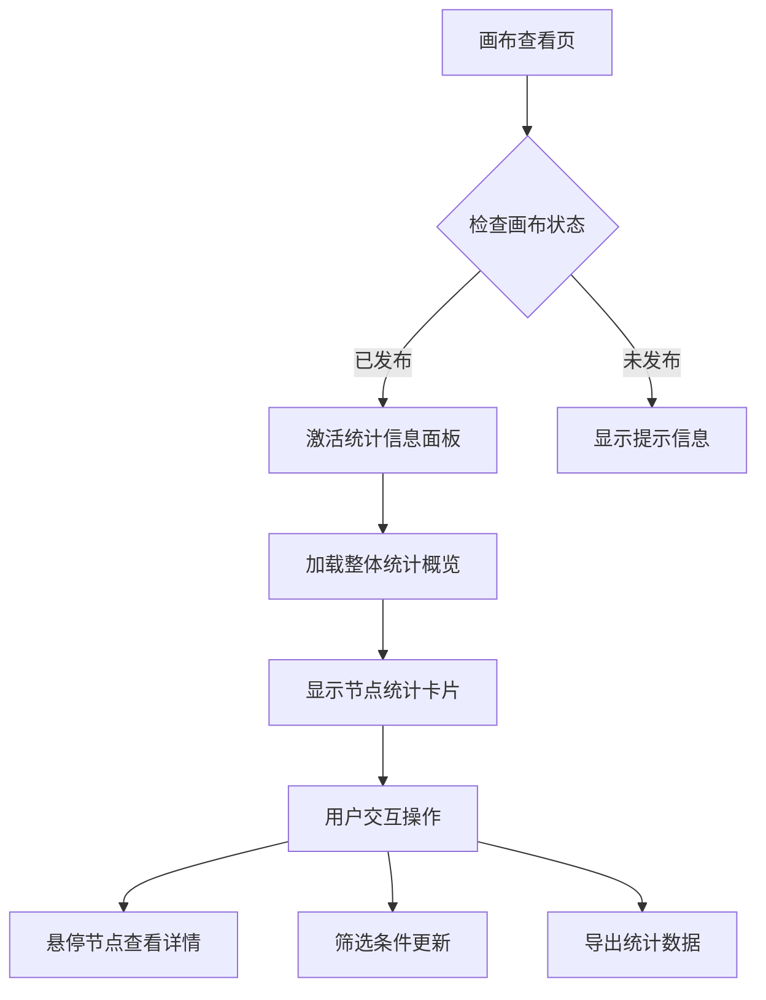
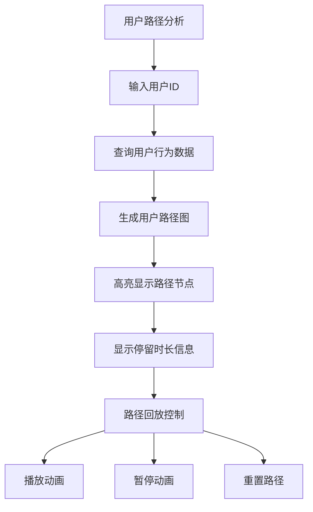

# 横版画布统计信息查询功能需求文档

## 1. 产品概述
基于现有横版画布系统，实现发布后的统计信息查询功能。当画布处于"查看"状态且已发布时，提供全面的节点数据统计、用户行为路径分析和可视化展示功能。

该功能主要解决营销活动效果评估问题，帮助运营人员：
- 实时监控节点转化效果和用户行为
- 分析用户在画布中的完整行为路径
- 通过可视化图表直观了解活动表现
- 支持数据导出用于进一步分析

## 2. 核心功能

### 2.1 用户角色
| 角色 | 注册方式 | 核心权限 |
|------|----------|----------|
| 普通运营人员 | 系统登录 | 查看统计数据、导出报告 |
| 高级分析师 | 系统登录 | 深度分析、路径回放、自定义筛选 |
| 管理员 | 系统登录 | 所有功能权限、数据管理 |

### 2.2 功能模块
统计信息查询功能包含以下核心模块：

1. **统计信息面板**: 画布右侧展示整体数据概览和详细统计
2. **节点数据统计**: 每个节点的访问量、转化率、停留时长等指标
3. **用户行为路径分析**: 用户ID查询、路径展示、动画回放
4. **数据筛选器**: 时间范围、节点类型、用户群体筛选
5. **可视化图表**: 柱状图、折线图、路径图等多种图表展示
6. **数据导出**: CSV/Excel格式导出统计数据

### 2.3 页面详情

| 页面名称 | 模块名称 | 功能描述 |
|----------|----------|----------|
| 画布查看页 | 统计信息面板 | 右侧滑动面板，显示整体统计概览卡片，包括总访问量、节点转化总数、活跃用户等关键指标 |
| 画布查看页 | 节点统计悬浮卡片 | 鼠标悬停节点时显示该节点的详细统计数据，包括进入人数、离开人数、转化率、平均停留时长 |
| 画布查看页 | 用户路径分析器 | 顶部工具栏添加用户筛选器，输入用户ID后高亮显示该用户的完整行为路径，支持路径动画回放 |
| 画布查看页 | 数据筛选控制 | 时间范围选择器（日/周/月）、节点类型筛选、用户群体筛选，实时更新统计数据 |
| 画布查看页 | 图表展示区域 | 在统计面板中展示各类图表：节点访问量柱状图、转化率趋势折线图、用户路径流向图 |
| 画布查看页 | 数据导出功能 | 一键导出当前筛选条件下的统计数据为CSV或Excel格式，包含所有节点和路径数据 |

## 3. 核心流程

### 3.1 统计信息查看流程

### 3.2 用户行为路径分析流程

## 4. 用户界面设计

### 4.1 设计风格
- **主色调**: 蓝色系 (#1890ff) 为主，绿色 (#52c41a) 表示成功数据
- **辅助色**: 橙色 (#fa8c16) 表示警告，红色 (#f5222d) 表示异常
- **面板样式**: 右侧滑动面板，宽度 400px，支持收起展开
- **卡片设计**: 圆角卡片，阴影效果，悬停状态变化
- **字体规范**: 标题 16px 加粗，正文 14px，辅助文字 12px
- **图标风格**: 线性图标，统一使用 Arco Design 图标库

### 4.2 页面设计详情

| 页面名称 | 模块名称 | UI元素 |
|----------|----------|--------|
| 统计信息面板 | 概览卡片区域 | 4个统计卡片横向排列，显示总访问量、节点转化数、活跃用户、平均停留时长，使用大字体突出数值 |
| 统计信息面板 | 节点统计列表 | 左侧节点名称，右侧关键指标（访问量、转化率），支持排序和搜索，每页显示10条记录 |
| 用户路径分析 | 用户ID输入 | 顶部搜索框，支持模糊匹配和历史记录，输入框下方显示用户基础信息卡片 |
| 用户路径分析 | 路径可视化 | 在原有画布基础上，用户路径使用紫色 (#722ed1) 高亮，节点边框加粗，显示停留时长标签 |
| 数据筛选器 | 时间选择器 | 下拉选择框，支持快速选择（今天、本周、本月）和自定义时间范围选择器 |
| 图表展示 | 柱状图 | 使用 ECharts 图表库，蓝色渐变柱状图，显示各节点访问量对比，支持悬停详情 |

### 4.3 响应式设计
- **桌面端优先**: 主要面向桌面端用户，优化大屏幕显示效果
- **平板适配**: 统计面板宽度自适应，最小宽度 320px
- **移动端支持**: 基础数据查看功能，复杂图表和操作在移动端简化处理
- **触控优化**: 按钮和交互元素最小点击区域 44px

## 5. 性能要求
- **数据加载**: 10万+行为记录查询响应时间 < 2秒
- **图表渲染**: 1000个节点内图表渲染时间 < 1秒
- **路径回放**: 动画播放流畅，帧率保持在 30fps 以上
- **分页加载**: 节点统计数据分页加载，每页 50 条记录
- **内存占用**: 长时间使用内存占用增长 < 100MB/小时

## 6. 数据隐私与安全
- **数据脱敏**: 用户ID等敏感信息在前端显示时进行脱敏处理
- **权限控制**: 基于用户角色控制数据访问权限
- **审计日志**: 记录数据查询和导出操作，便于审计追踪
- **传输加密**: 所有统计数据通过 HTTPS 协议传输