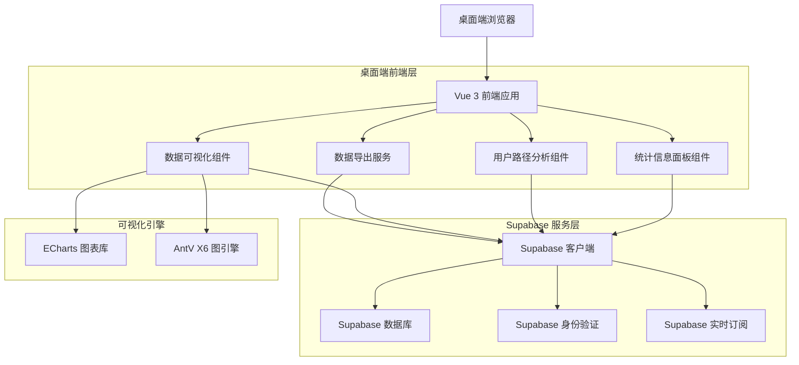
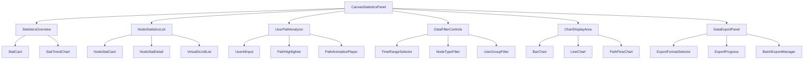
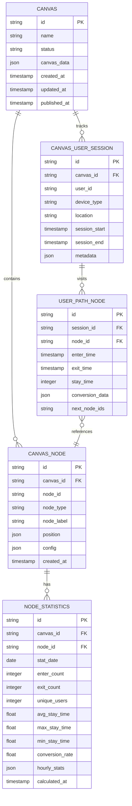

# 横版画布统计信息查询功能技术架构文档（桌面端专用）

## 1. 架构设计

### 1.1 整体架构图


### 1.2 组件架构图


## 2. 技术描述

### 2.1 核心技术栈
- **前端框架**: Vue 3.4+ (Composition API)
- **构建工具**: Vite 5.0+
- **状态管理**: Pinia 2.1+
- **UI组件库**: Arco Design Vue 2.5+
- **图表引擎**: ECharts 5.4+
- **图引擎**: AntV X6 2.x
- **数据库**: Supabase (PostgreSQL 15+)
- **实时通信**: Supabase Realtime
- **类型系统**: TypeScript 5.3+

### 2.2 初始化工具
- **项目初始化**: vite-init
- **包管理**: pnpm 8.0+
- **代码规范**: ESLint + Prettier
- **提交规范**: Husky + lint-staged

### 2.3 关键依赖
```json
{
  "dependencies": {
    "vue": "^3.4.0",
    "@supabase/supabase-js": "^2.39.0",
    "echarts": "^5.4.0",
    "@arco-design/web-vue": "^2.5.0",
    "@antv/x6": "^2.15.0",
    "pinia": "^2.1.0",
    "vue-router": "^4.2.0",
    "dayjs": "^1.11.0",
    "lodash-es": "^4.17.0",
    "xlsx": "^0.18.0"
  },
  "devDependencies": {
    "@vitejs/plugin-vue": "^5.0.0",
    "typescript": "^5.3.0",
    "vite": "^5.0.0",
    "vitest": "^1.1.0",
    "@vue/test-utils": "^2.4.0"
  }
}
```

## 3. 路由定义

### 3.1 主要路由配置
| 路由 | 用途 | 组件 |
|-------|---------|-------|
| /canvas/:id/statistics | 画布统计信息页 | CanvasStatisticsView |
| /canvas/:id/statistics/overview | 统计概览 | StatisticsOverviewPanel |
| /canvas/:id/statistics/nodes | 节点统计 | NodeStatisticsPanel |
| /canvas/:id/statistics/users | 用户分析 | UserAnalysisPanel |
| /canvas/:id/statistics/export | 数据导出 | DataExportPanel |

### 3.2 路由参数
```typescript
interface CanvasStatisticsRouteParams {
  id: string // 画布ID
}

interface CanvasStatisticsQuery {
  mode?: 'overview' | 'nodes' | 'users' | 'export'
  timeRange?: 'day' | 'week' | 'month' | 'quarter'
  nodeType?: string
  userId?: string
  dateFrom?: string
  dateTo?: string
}
```

## 4. API 定义

### 4.1 统计数据API

#### 获取画布整体统计
```
GET /api/canvas/:id/statistics/overview
```

请求参数：
| 参数名 | 类型 | 必需 | 描述 |
|--------|------|------|------|
| timeRange | string | false | 时间范围: day/week/month/quarter |
| dateFrom | string | false | 开始日期 (YYYY-MM-DD) |
| dateTo | string | false | 结束日期 (YYYY-MM-DD) |

响应数据：
```typescript
interface CanvasOverviewStats {
  totalVisits: number
  totalConversions: number
  activeUsers: number
  avgStayTime: number
  conversionRate: number
  topNodes: NodeStats[]
  trend: TimeSeriesData[]
  lastUpdated: string
}
```

#### 获取节点统计详情
```
GET /api/canvas/:id/statistics/nodes
```

请求参数：
| 参数名 | 类型 | 必需 | 描述 |
|--------|------|------|------|
| page | number | false | 页码，默认1 |
| pageSize | number | false | 每页条数，默认50 |
| nodeType | string | false | 节点类型筛选 |
| sortBy | string | false | 排序字段: visits/conversions/stayTime |
| sortOrder | string | false | 排序顺序: asc/desc |

响应数据：
```typescript
interface NodeStatisticsResponse {
  nodes: NodeStats[]
  total: number
  page: number
  pageSize: number
  summary: {
    totalNodes: number
    totalVisits: number
    avgConversionRate: number
  }
}

interface NodeStats {
  nodeId: string
  nodeType: string
  nodeLabel: string
  position: { x: number; y: number }
  enterCount: number
  exitCount: number
  conversionRate: number
  avgStayTime: number
  maxStayTime: number
  minStayTime: number
  uniqueUsers: number
  trend: TimeSeriesData[]
}
```

#### 获取用户行为路径
```
GET /api/canvas/:id/statistics/user-path/:userId
```

响应数据：
```typescript
interface UserPathData {
  userId: string
  userProfile: {
    firstVisit: string
    lastVisit: string
    totalVisits: number
    deviceType: string
    location: string
  }
  path: PathNode[]
  totalStayTime: number
  conversionPath: boolean
}

interface PathNode {
  nodeId: string
  nodeLabel: string
  position: { x: number; y: number }
  enterTime: string
  exitTime: string
  stayTime: number
  conversionRate: number
  nextNodes: string[]
}
```

#### 导出统计数据
```
POST /api/canvas/:id/statistics/export
```

请求体：
```typescript
interface ExportRequest {
  format: 'csv' | 'excel'
  dataType: 'overview' | 'nodes' | 'users' | 'all'
  filters: {
    timeRange?: string
    nodeType?: string
    userId?: string
    dateFrom?: string
    dateTo?: string
  }
  fields?: string[] // 指定导出的字段
}
```

### 4.2 Supabase 数据库API

#### 实时订阅统计更新
```typescript
// 订阅画布统计更新
const subscription = supabase
  .channel('canvas-stats')
  .on('postgres_changes', 
    { event: '*', schema: 'public', table: 'canvas_node_stats' },
    payload => handleStatsUpdate(payload)
  )
  .subscribe()
```

#### 批量插入节点统计数据
```typescript
const { data, error } = await supabase
  .from('canvas_node_stats')
  .upsert(nodeStatsData, { onConflict: 'canvas_id,node_id,date' })
```

## 5. 数据模型设计

### 5.1 数据库实体关系图


### 5.2 数据表定义

#### 画布节点统计表
```sql
CREATE TABLE canvas_node_stats (
    id UUID PRIMARY KEY DEFAULT gen_random_uuid(),
    canvas_id UUID NOT NULL REFERENCES canvases(id) ON DELETE CASCADE,
    node_id VARCHAR(100) NOT NULL,
    stat_date DATE NOT NULL,
    
    -- 基础统计
    enter_count INTEGER DEFAULT 0,
    exit_count INTEGER DEFAULT 0,
    unique_users INTEGER DEFAULT 0,
    
    -- 停留时长统计
    avg_stay_time INTEGER DEFAULT 0, -- 秒
    max_stay_time INTEGER DEFAULT 0, -- 秒
    min_stay_time INTEGER DEFAULT 0, -- 秒
    
    -- 转化率
    conversion_rate DECIMAL(5,4) DEFAULT 0,
    
    -- 分时统计
    hourly_stats JSONB DEFAULT '{}',
    
    -- 元数据
    calculated_at TIMESTAMP WITH TIME ZONE DEFAULT NOW(),
    created_at TIMESTAMP WITH TIME ZONE DEFAULT NOW(),
    updated_at TIMESTAMP WITH TIME ZONE DEFAULT NOW(),
    
    -- 约束
    UNIQUE(canvas_id, node_id, stat_date)
);

-- 索引
CREATE INDEX idx_canvas_node_stats_canvas_id ON canvas_node_stats(canvas_id);
CREATE INDEX idx_canvas_node_stats_node_id ON canvas_node_stats(node_id);
CREATE INDEX idx_canvas_node_stats_date ON canvas_node_stats(stat_date);
CREATE INDEX idx_canvas_node_stats_calculated ON canvas_node_stats(calculated_at DESC);
```

#### 用户会话表
```sql
CREATE TABLE canvas_user_sessions (
    id UUID PRIMARY KEY DEFAULT gen_random_uuid(),
    canvas_id UUID NOT NULL REFERENCES canvases(id) ON DELETE CASCADE,
    user_id VARCHAR(100) NOT NULL,
    
    -- 设备信息
    device_type VARCHAR(50),
    user_agent TEXT,
    ip_address INET,
    location VARCHAR(100),
    
    -- 会话时间
    session_start TIMESTAMP WITH TIME ZONE NOT NULL,
    session_end TIMESTAMP WITH TIME ZONE,
    total_duration INTEGER, -- 秒
    
    -- 行为统计
    nodes_visited INTEGER DEFAULT 0,
    conversions_count INTEGER DEFAULT 0,
    
    -- 元数据
    metadata JSONB DEFAULT '{}',
    created_at TIMESTAMP WITH TIME ZONE DEFAULT NOW(),
    
    -- 索引
    INDEX idx_sessions_canvas_user (canvas_id, user_id),
    INDEX idx_sessions_time (session_start, session_end),
    INDEX idx_sessions_user (user_id)
);
```

#### 用户路径节点表
```sql
CREATE TABLE user_path_nodes (
    id UUID PRIMARY KEY DEFAULT gen_random_uuid(),
    session_id UUID NOT NULL REFERENCES canvas_user_sessions(id) ON DELETE CASCADE,
    node_id VARCHAR(100) NOT NULL,
    
    -- 时间记录
    enter_time TIMESTAMP WITH TIME ZONE NOT NULL,
    exit_time TIMESTAMP WITH TIME ZONE,
    stay_time INTEGER, -- 秒
    
    -- 转化数据
    conversion_type VARCHAR(50),
    conversion_value DECIMAL(10,2),
    
    -- 路径信息
    previous_node_id VARCHAR(100),
    next_node_ids TEXT, -- 逗号分隔的节点ID列表
    
    -- 位置信息（用于路径回放）
    node_position JSONB,
    
    created_at TIMESTAMP WITH TIME ZONE DEFAULT NOW(),
    
    -- 索引
    INDEX idx_path_session (session_id),
    INDEX idx_path_node (node_id),
    INDEX idx_path_time (enter_time),
    INDEX idx_path_session_node (session_id, node_id)
);
```

### 5.3 视图和函数

#### 节点统计聚合视图
```sql
CREATE VIEW node_daily_stats AS
SELECT 
    canvas_id,
    node_id,
    stat_date,
    enter_count,
    exit_count,
    unique_users,
    avg_stay_time,
    conversion_rate,
    CASE 
        WHEN enter_count > 0 THEN ROUND((exit_count::DECIMAL / enter_count::DECIMAL) * 100, 2)
        ELSE 0
    END AS exit_rate,
    calculated_at
FROM canvas_node_stats
WHERE stat_date >= CURRENT_DATE - INTERVAL '30 days';
```

#### 实时统计更新函数
```sql
CREATE OR REPLACE FUNCTION update_node_stats(
    p_canvas_id UUID,
    p_node_id VARCHAR,
    p_user_id VARCHAR,
    p_stay_time INTEGER DEFAULT 0,
    p_converted BOOLEAN DEFAULT FALSE
) RETURNS VOID AS $$
BEGIN
    -- 更新或插入当日统计数据
    INSERT INTO canvas_node_stats (
        canvas_id, node_id, stat_date, enter_count, 
        unique_users, avg_stay_time
    ) VALUES (
        p_canvas_id, p_node_id, CURRENT_DATE, 1, 
        1, p_stay_time
    ) ON CONFLICT (canvas_id, node_id, stat_date) 
    DO UPDATE SET
        enter_count = canvas_node_stats.enter_count + 1,
        unique_users = CASE 
            WHEN p_user_id IS DISTINCT FROM ANY(SELECT user_id FROM user_path_nodes 
                WHERE session_id IN (SELECT id FROM canvas_user_sessions 
                    WHERE canvas_id = p_canvas_id AND stat_date = CURRENT_DATE))
            THEN canvas_node_stats.unique_users + 1
            ELSE canvas_node_stats.unique_users
        END,
        avg_stay_time = (canvas_node_stats.avg_stay_time * canvas_node_stats.enter_count + p_stay_time) / (canvas_node_stats.enter_count + 1),
        max_stay_time = GREATEST(canvas_node_stats.max_stay_time, p_stay_time),
        min_stay_time = LEAST(canvas_node_stats.min_stay_time, p_stay_time),
        updated_at = NOW();
END;
$$ LANGUAGE plpgsql;
```

## 6. 性能优化策略

### 6.1 数据库性能优化
- **分区表**: 按时间分区存储统计数据，自动归档历史数据
- **索引优化**: 复合索引覆盖常用查询条件，BRIN索引优化时间序列查询
- **物化视图**: 预计算常用统计指标，定时刷新
- **缓存策略**: Redis缓存热点统计数据，TTL设置为5分钟

### 6.2 前端性能优化
- **虚拟滚动**: 节点统计列表使用虚拟滚动，支持10万+节点流畅渲染
- **图表优化**: ECharts大数据模式，数据采样和分段加载
- **懒加载**: 统计面板按需加载，图表组件异步加载
- **内存管理**: 组件销毁时清理图表实例和事件监听器

### 6.3 实时更新机制
- **增量更新**: 只更新变化的统计数据，减少数据传输量
- **防抖处理**: 用户路径数据批量提交，避免频繁数据库操作
- **WebSocket**: 使用Supabase Realtime实现统计数据实时推送
- **本地缓存**: 浏览器本地存储常用筛选条件，减少重复请求

## 7. 安全与权限

### 7.1 数据访问权限
```sql
-- 创建统计数据的行级安全策略
ALTER TABLE canvas_node_stats ENABLE ROW LEVEL SECURITY;

-- 用户只能访问其有权限的画布统计数据
CREATE POLICY canvas_stats_access_policy ON canvas_node_stats
    FOR SELECT
    USING (
        canvas_id IN (
            SELECT canvas_id FROM canvas_permissions 
            WHERE user_id = auth.uid() AND permission_level >= 'read'
        )
    );
```

### 7.2 数据脱敏处理
```typescript
// 用户ID脱敏函数
function desensitizeUserId(userId: string): string {
    if (userId.length <= 8) {
        return '*'.repeat(userId.length);
    }
    return userId.substring(0, 4) + '****' + userId.substring(userId.length - 4);
}

// 统计数据脱敏
function desensitizeStatsData(data: any): any {
    return {
        ...data,
        userId: desensitizeUserId(data.userId),
        // 其他敏感字段脱敏
    };
}
```

### 7.3 审计日志
```sql
CREATE TABLE statistics_audit_log (
    id UUID PRIMARY KEY DEFAULT gen_random_uuid(),
    user_id UUID REFERENCES auth.users(id),
    canvas_id UUID REFERENCES canvases(id),
    action VARCHAR(50) NOT NULL, -- 'view', 'export', 'filter'
    action_details JSONB,
    ip_address INET,
    user_agent TEXT,
    created_at TIMESTAMP WITH TIME ZONE DEFAULT NOW()
);
```