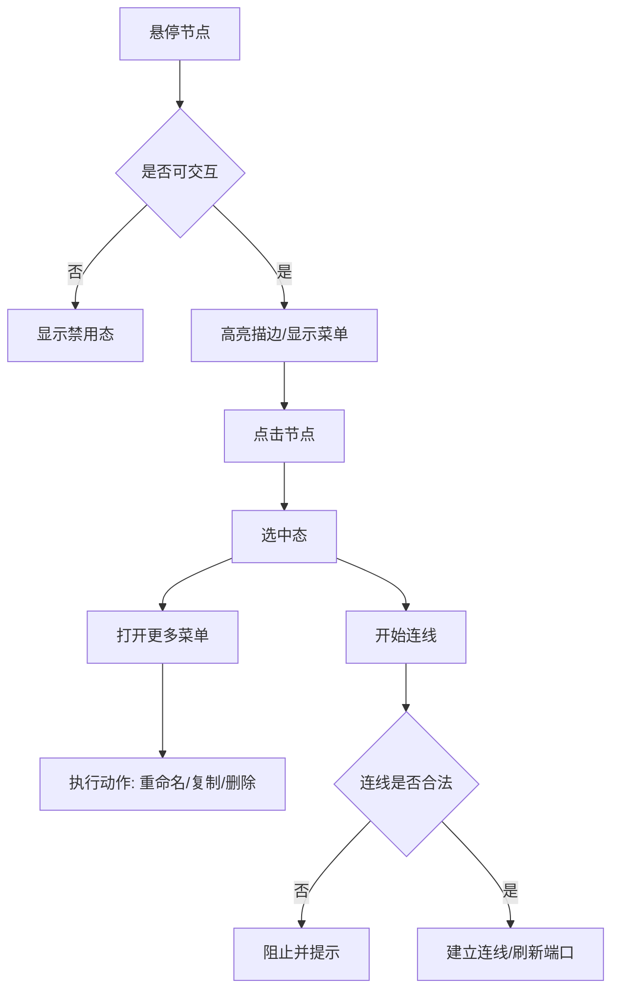
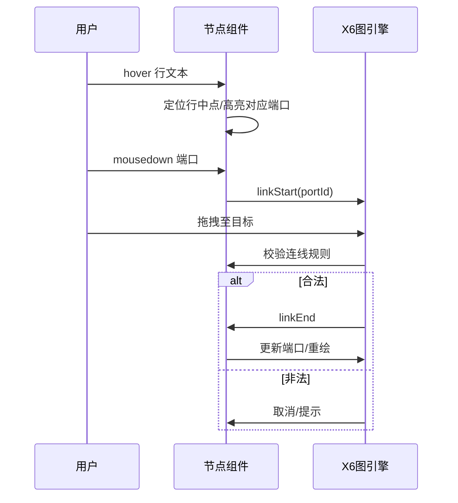

# CSS Grid 节点组件 PRD（对齐横向画布规范）

文档状态：正式版 v1.1.1  | 更新日期：2025-11-14  | 维护人：前端团队

关联规范：`/Users/mac/nis_mock/data_comunity/data_comunity/.trae/documents/横向画布节点样式设计与实现规范.md`

一致性声明：本组件的视觉与交互须与“横向画布节点样式设计与实现规范”像素级一致。任何偏差均视为不合规。

目录
- 1 产品概述
- 2 设计依据与像素一致性
- 3 节点通用组件设计
- 4 产品需求与边界
- 5 交互流程与状态说明
- 6 验收标准与样式实现Checklist
- 7 兼容性与性能指标
- 8 集成方案（AntV X6）
- 8.1 配置抽屉联动（数据→样式→端口）
- 9 风险与异常处理
- 10 版本与变更记录
- 附录 A：样式令牌与尺寸表
- 附件：交互流程图源文件位置

## 1. 产品概述

基于 CSS Grid 的通用化桌面端节点样式组件，用于横版任务流编辑器（AntV X6 + Vue 3）。目标是在不改变现有数据结构与交互语义的前提下，用现代化栅格布局替换绝对定位，实现：
- 完全遵循规范的尺寸、色彩、间距、对齐与端口附着规则；
- 高可靠的响应式与容器查询适配；
- 可维护、可扩展的组件化与主题化能力。

## 2. 设计依据与像素一致性

以下为与规范严格对齐的关键指标（不可更改）：
- 固定宽度：`280px`
- 最小高度：`96px`
- 标题区高度：`36px`
- 内容区上下内边距：`12px`
- 内容行高：`32px`
- 行文本基线微调：`+5px`（相对行中点）
- 动态高度：`max(96, headerHeight + contentPadding + max(1, rows.length) × rowHeight + 12)`
- 颜色：
  - 标题区背景 `#F8FAFC`
  - 分隔/边框 `#E5E7EB`
  - 正文文字 `#111827`
  - 图标块与描边 `#14B8A6`
  - 端口：输入-白底蓝框、输出-蓝底（蓝 `#4C78FF`，半径 `4px`）
- 标题元素：
  - 图标块：`28×20`，圆角 `6px`，位置 `(12, 8)`；文本 12px 白色，内容取 `nodeType` 前两位大写
  - 标题文本：左边距 `48px`，字体 `13px` 加粗，颜色 `#111827`
  - 更多菜单：三点，位置 `(宽度-24/18/12, 16)`（非 start/end 显示）
- 端口附着与对齐（左右结构）：
  - 输入端口：内容区左侧，垂直对齐内容区中心 `contentCenter`
  - 输出端口：内容区右侧，每行一个，垂直对齐该行中点 `lineCenter(i)`
  - 相对偏移：`dy = verticalOffset - nodeHeight/2`

间距系统：以 8px 为基准。可提供斐波那契增量表（8, 8, 16, 24, 40…）用于“栅格间距/模块间隙”推导，但最终落地尺寸必须以规范固定值为准，确保像素级一致。

## 3. 节点通用组件设计

### 3.1 架构与技术路线
- 框架：Vue 3（Composition API）+ TypeScript
- 布局：CSS Grid + Flex 辅助；容器查询（`@container`）用于字体与排版自适应
- 位置：节点容器 `position: relative`，端口层 `position: absolute` 叠加于内容区左右边缘
- 引擎集成：AntV X6 HTML 节点（foreignObject/html）承载 Vue 组件；端口仍由 X6 管理，使用组件暴露的 `verticalOffsets` 与 `inVerticalOffset` 参与配置

### 3.2 布局系统（CSS Grid）
- 容器：
  - `display: grid`
  - `grid-template-rows: 36px auto`（标题区 + 内容区）
  - `grid-template-columns: 1fr`
  - `width: 280px`，`min-height: 96px`，`border-radius: 8px`
- 标题区（grid row 1）：左侧图标块 + 标题文本 + 右侧更多菜单（内部用 Flex 对齐）
- 内容区（grid row 2）：
  - 文本列表采用 `display: grid; grid-auto-rows: 32px; row-gap: 0; padding: 12px 0;`
  - 每行内容左内边距 `16px`；文字溢出自动换行，宽度自适应，最小宽度不低于 `120px`
  - 端口层与内容同高，输出端口根据行序号定位到行中点

参考样例（样式片段）：
```css
.node { position: relative; width: 280px; min-height: 96px; display: grid;
  grid-template-rows: 36px auto; grid-template-columns: 1fr; background: #fff;
  border: 1px solid #E5E7EB; border-radius: 8px; overflow: hidden; }
.node__header { display: grid; grid-template-columns: 48px 1fr 36px; align-items: center;
  background: #F8FAFC; border-bottom: 1px solid #E5E7EB; }
.node__icon { width: 28px; height: 20px; border-radius: 6px; background: #14B8A6;
  color: #fff; font-size: 12px; line-height: 20px; text-align: center; margin-left: 12px; }
.node__title { font-weight: 600; font-size: 13px; color: #111827; }
.node__menu { justify-self: end; margin-right: 12px; }
.node__content { position: relative; padding: 12px 0; }
.node__lines { display: grid; grid-auto-rows: 32px; }
.node__line { padding-left: 16px; font-size: 13px; color: #111827; }
.node__ports { position: absolute; inset: 36px 0 0 0; pointer-events: none; }
/* 端口的实际定位由 JS 计算 top 值（行中点）并应用到子元素 */
```

### 3.3 标题与内容规则
- 标题字号使用 `clamp` 与容器查询微调，建议：`clamp(12px, 2.2vw, 13px)`（桌面端保持 13px）
- 文本自动换行：`word-break: break-all; overflow-wrap: anywhere;`
- 容器查询示例：
```css
@container (min-width: 280px) {
  .node__title { font-size: 13px; }
}
```

### 3.4 端口系统与对齐
- 输入端口：Y = `contentCenter`；输出端口：Y = `lineCenter(i)`
- 通过组件导出：
  - `inVerticalOffset: number`（绝对 Y）
  - `verticalOffsets: number[]`（各行中点绝对 Y）
- X6 端口 `dy` 取值：`offset - nodeHeight/2`

### 3.5 交互与状态（hover/active/disabled）
- hover：节点出现 2px 外发光描边 `rgba(76,120,255,0.2)`，更多菜单显形
- active（选中）：边框高亮 `#4C78FF`，阴影增强（不改变几何尺寸）
- disabled：整体 `opacity: 0.6`，禁用指针事件（菜单与端口不可交互）
- 端口 hover：半径 +1px；active：填充或描边加深

### 3.6 状态管理
- 受控/非受控双模式：
  - 受控：由上层状态源（如 Vuex/X6）驱动 `state`、`selected` 等
  - 非受控：组件内部管理 hover/菜单展开等临时态

### 3.7 组件 API（Props / Events / Slots）
```ts
type NodeKind = 'start'|'crowd-split'|'event-split'|'ab-test'|'ai-call'|'sms'|'manual-call'|'wait'|'benefit'|'end'

interface PortSpec {
  includeIn: boolean
  outIds: string[]
  inVerticalOffset?: number
  verticalOffsets?: number[]
}

interface GridNodeProps {
  id: string
  type: NodeKind
  title: string
  lines: string[] // 内容行（自动换行）
  size?: { width?: number; rowHeight?: number } // 默认 width=280, rowHeight=32
  ports?: PortSpec // 若不传，组件按行数自动计算 verticalOffsets
  state?: 'default'|'hover'|'active'|'disabled'|'error'
  disabled?: boolean
  density?: 'normal'|'compact'
  menuActions?: Array<{ key:string; label:string }>
  theme?: Record<string, string> // 可选主题令牌覆盖
}

type GridNodeEvents = {
  select: (id: string) => void
  openMenu: (id: string) => void
  action: (payload: { id:string; actionKey:string }) => void
  hoverPort: (payload: { id:string; portId:string }) => void
  leavePort: (payload: { id:string; portId:string }) => void
  linkStart: (payload: { id:string; portId:string }) => void
  linkEnd: (payload: { id:string; portId:string }) => void
}
```
Slots：`header-right`（自定义菜单区域，可选）、`footer`（保留）

### 3.8 代码结构建议
- `src/components/nodes/GridNode.vue`
- `src/components/nodes/usePorts.ts`（行中点计算、偏移导出）
- `src/styles/nodes/grid-node.scss`

## 4. 产品需求与边界

业务场景：用于横向任务流编辑器中的节点呈现与交互；节点类型范围受规范限制（不支持 email/wechat/task）。

使用限制：
- 宽度固定 280px，不开放自定义（保持连线与对齐一致性）
- 行高固定 32px，标题 36px，不支持变更
- 图标颜色固定 `#14B8A6`，不随类型变化

与其他系统集成：
- 通过 AntV X6 HTML 节点承载；端口仍使用现有 `createHorizontalPortConfig` 工厂输出
- 组件提供 `inVerticalOffset/verticalOffsets`，确保与 X6 端口 `dy` 对齐

## 5. 交互流程与状态说明

用户操作流程（简要）：


状态机（节点）：
```mermaid
stateDiagram-v2
  [*] --> default
  default --> hover: mouseenter
  hover --> default: mouseleave
  default --> active: click
  hover --> active: click
  active --> default: blur/unselect
  default --> disabled: prop.disabled=true
  active --> disabled: prop.disabled=true
  disabled --> default: prop.disabled=false
```

端口交互（输出端）：


更多完整流程图源文件：`/.trae/documents/diagrams/node-interactions.mmd`

## 6. 验收标准与样式实现Checklist

视觉与尺寸
- [ ] 宽度恒为 280px；最小高度 96px
- [ ] 标题区 36px；内容行高 32px；上下内边距 12px
- [ ] 文本基线相对行中点 +5px，居中观感一致
- [ ] 图标块 28×20，圆角 6px，位置 (12,8)，文本 12px 白色
- [ ] 标题左边距 48px，字号 13px 粗体，颜色 #111827
- [ ] 分隔/边框颜色 #E5E7EB；标题背景 #F8FAFC

端口与连线
- [ ] 输入端口居内容区垂直中心；输出端口对齐各行中点
- [ ] 端口风格：输入白底蓝框、输出蓝底（#4C78FF），半径 4px
- [ ] X6 端口 `dy` 计算与组件导出偏移一致

交互状态
- [ ] hover 出现 2px 外发光描边；菜单显形
- [ ] active 边框高亮 #4C78FF；阴影增强
- [ ] disabled `opacity:0.6`，端口与菜单禁用

响应式与容器查询
- [ ] 标题字号 clamp 方案在不同容器宽度下无断裂
- [ ] 文本自动换行不溢出；最小宽度保障

性能与兼容
- [ ] 批量 200 节点渲染时间 ≤ 1s（Chrome 最新稳定版）
- [ ] 拖拽/连线交互 60fps；无明显掉帧
- [ ] Chrome/Edge/Firefox/Safari 最新稳定版表现一致

配置联动（抽屉确认 → 节点刷新）
- [ ] 抽屉“确认保存”后，节点标题/内容/高度即时刷新（无闪烁）
- [ ] 输出端口数量与位置重算并对齐各行中点（dy=verticalOffset−nodeHeight/2）
- [ ] 输入端口重新对齐内容区中心（contentCenter）
- [ ] out 端口 ID 按 out-0..n-1 重建并更新端口组配置
- [ ] 配置校验失败或取消时不更新节点数据与样式
- [ ] 单次刷新耗时 ≤ 16ms/节点；200 节点批量刷新 ≤ 1s

## 7. 兼容性与性能指标

浏览器兼容（最新稳定版）：Chrome、Edge、Firefox、Safari。
- 容器查询不可用场景：回退为固定字号 `13px` 与既定排版，不影响端口对齐

性能指标（Mac 桌面端参考）：
- 首次渲染：≤ 4ms/节点（空闲主线程）
- 批量渲染：200 节点 ≤ 1s
- 交互流畅度：拖拽/连线 60fps；端口高亮响应 ≤ 16ms
- 内存占用：常驻 DOM、样式与 JS 开销 ≤ 20KB/节点（均值）

## 8. 集成方案（AntV X6）

使用 HTML 节点承载 Vue 组件；端口通过现有工厂创建，`dy` 由组件导出偏移计算：
```ts
// 伪代码示例
const lines = buildDisplayLines(type, config)
const contentHeight = Math.max(1, lines.length) * 32
const contentCenter = 36 + 12 + Math.floor(contentHeight/2)
const verticalOffsets = lines.map((_, i) => 36 + 12 + i*32 + 16)

const ports = createHorizontalPortConfig(lines.length, {
  verticalOffsets,
  nodeHeight: 36 + 12 + contentHeight + 12,
  inVerticalOffset: contentCenter
})
```

注意：任何对 `rowHeight/width/header` 的改动均会破坏连线对齐，禁止修改。

### 8.1 配置抽屉联动（数据→样式→端口）

目标：用户在配置抽屉中修改配置后，节点应同步刷新“数据 → 展示样式 → 端口”，确保展示信息与连线对齐始终正确。

事件与流程（参考 useConfigDrawers 接入）：
1) 打开抽屉：携带 `nodeId`、`type`、`data`（含 `config`/`isConfigured`）。
2) 确认保存：触发配置确认回调（或 `node:config-updated` 事件），参数 `{ node, type, config }`。
3) 页面处理：调用 `updateNodeFromConfig(node, type, config)` 执行刷新。

刷新规则（规范）：
- 更新数据：`node.setData({ ...prev, isConfigured: true, config })`。
- 重建内容：`lines = buildDisplayLines(type, config)`；当 `lines.length === 0` 时按 1 行占位处理。
- 重算几何：
  - `contentHeight = max(1, lines.length) * 32`
  - `nodeHeight = 36 + 12 + contentHeight + 12`
  - `contentCenter = 36 + 12 + floor(contentHeight/2)`
  - `verticalOffsets = lines.map((_, i) => 36 + 12 + i*32 + 16)`
- 重建端口（覆盖式）：
  - `outIds = lines.map((_, i) => 'out-' + i)`
  - `ports = createHorizontalPortConfig(lines.length, { includeIn: true, outIds, verticalOffsets, nodeHeight, inVerticalOffset: contentCenter })`
  - 输入端口：`dy = inVerticalOffset - nodeHeight/2`
  - 输出端口：`dy = verticalOffsets[i] - nodeHeight/2`
- 刷新渲染：同时更新 `markup/attrs`（标题、行文本、菜单点），与高度一致。

连线兼容：
- 当分支数量减少导致某些 `out-i` 被移除时，相关连线按现有连接规则处理（可删除并提示）。
- 当分支数量增加时，新端口可被正常拖拽连接。

性能要求：
- 刷新为一次批处理：数据、端口与 attrs 同步更新；单节点 ≤ 16ms。
- 不得出现端口位置“抖动”或闪烁。

## 9. 风险与异常处理
- 非法连线：与 X6 校验规则协同，拒绝并提示；保持节点态不变
- 超长文本：换行与截断策略并存；不得遮挡端口
- 极端数据：0 行内容时，视为 1 行占位，仍有输出端口
- 容器过窄：维持 280px 固定宽度，外层滚动承载

## 10. 版本与变更记录

版本：v1.1.1（2025-11-14）
- 新增“8.1 配置抽屉联动（数据→样式→端口）”章节，明确抽屉确认后需同步刷新样式与 out 端口
- 在“6. 验收标准与样式实现Checklist”补充配置联动相关验收项

版本：v1.1.0（2025-11-14）
- 全面重构文档结构，统一格式与术语
- 新增“节点通用组件设计”（架构、布局、API、状态管理）
- 对齐“横向画布规范”，补充像素级样式与端口对齐规则
- 增补交互流程与状态机（附源文件）
- 提供验收 Checklist、性能与兼容性指标、集成方案

版本：v1.0.0（历史）
- 初版草案，未对齐现网规范

---

附录 A：样式令牌与尺寸表（可用于主题覆盖）
- `--node-width: 280px`
- `--node-min-height: 96px`
- `--node-header-height: 36px`
- `--node-row-height: 32px`
- `--node-padding-y: 12px`
- `--node-text-color: #111827`
- `--node-border-color: #E5E7EB`
- `--node-header-bg: #F8FAFC`
- `--node-icon-color: #14B8A6`
- `--node-port-blue: #4C78FF`

附件：
- 交互流程图源文件：`/.trae/documents/diagrams/node-interactions.mmd`
- 导入说明：可直接被 Mermaid 渲染；可在 Figma（通过 Mermaid 插件）或 Visio（通过中转 SVG/PNG）中导入使用
