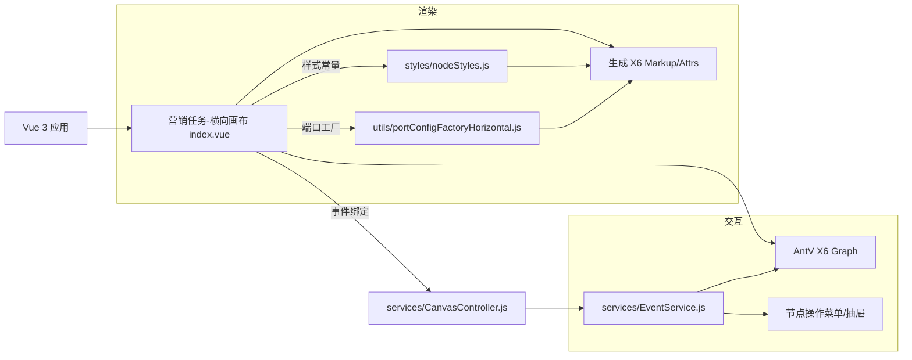

# CSS Grid 节点组件技术架构与实施方案（横向画布）

本文档结合当前代码实现（`http://localhost:5173/marketing/tasks/horizontal`）与《CSS Grid 节点组件 PRD》（`/.trae/documents/css-grid-node-component-prd.md`），产出技术架构、代码映射与实施计划，确保与《横向画布节点样式设计与实现规范》像素级对齐。

## 1. 目标与范围

* 对齐规范：宽高、内边距、字体、颜色、端口附着、交互状态严格遵循规范。

* 组件化设计：抽象样式常量与端口配置工厂，支持横向画布中所有节点类型的统一渲染。

* 可维护性：样式与交互参数常量化，消除硬编码，保证统一与复用。

* 性能与兼容：X6 渲染性能稳定（60 FPS 交互目标）、现代浏览器兼容。

## 2. 架构总览



关键文件：

* `src/pages/marketing/tasks/horizontal/index.vue` 渲染与节点工厂、页面交互入口。

* `src/pages/marketing/tasks/horizontal/styles/nodeStyles.js` 样式令牌与类型映射。

* `src/pages/marketing/tasks/horizontal/utils/portConfigFactoryHorizontal.js` 横版端口配置工厂。

* `src/pages/marketing/tasks/horizontal/services/CanvasController.js` 画布控制器。

* `src/pages/marketing/tasks/horizontal/services/EventService.js` X6 事件适配与行为编排。

* 参考：`components/UniversalNode.vue`（横向目录下）为纯 Vue 组件版节点样式原型，便于与 X6 版本风格一致性验证。

## 3. 技术栈与规范

* 前端框架：`Vue 3 (Composition API)`，语言：`JavaScript + TypeScript`。

* 构建工具：`Vite`，UI 组件库：`Arco Design`，状态管理：`Vuex`，路由：`Vue Router`。

* 图形引擎：`AntV X6`（节点/边、端口、工具、事件）。

* 样式实现遵循《横向画布节点样式设计与实现规范》；PRD 与代码保持一一映射。

## 4. 代码结构与职责

* `index.vue`

  * 负责图初始化、节点创建与更新（`createRectNode` / `updateNodeFromConfig`）、抽屉联动、菜单展示、调试入口。

  * 根据节点类型与配置，构建显示行（`buildDisplayLines`），计算高度与端口位置，生成 X6 `markup` 与 `attrs`。

  * 配置联动：`updateNodeFromConfig` 采用“覆盖式端口重建”（先移除再新增）以强制 X6 端口重算，`dy = offset - nodeHeight/2`；同步更新 `outIds=out-0..n-1` 及 `markup/attrs`。

* `styles/nodeStyles.js`

  * 常量：`NODE_DIMENSIONS`、`COLORS`、`TYPOGRAPHY`、`POSITIONS`、`INTERACTION_STATES`。

  * 工具：`getBaseNodeStyles()`、`getNodeIconText()`、`getPortStyles()`。

* `utils/portConfigFactoryHorizontal.js`

  * 工厂：`createHorizontalPortConfig(outCount, { includeIn, outIds, verticalOffsets, nodeHeight, inVerticalOffset })`。

  * 按规范输出端口组 `in/out`、连接限制、交互状态、Y 轴 `dy` 偏移（相对节点中心）。

* `services/CanvasController.js` / `services/EventService.js`

  * 统一绑定 X6 事件，封装 UI 坐标转换、标题区/菜单点区域判定、菜单弹出、边工具、抽屉开启等行为。

* 参考样式原型：`horizontal/components/UniversalNode.vue` + `composables/useNodePorts.js` / `useNodeStyling.js` / `styles/universalNodeStyles.js`。

### 4.1 Composables 代码映射（实际实现）

目录：`src/pages/marketing/tasks/horizontal/composables`

* `useNodePorts.js`

  * 职责：端口位置计算、端口样式生成、端口校验与连接状态存储。

  * 关键导出：

    * `calculatePortPositions({ nodeType, contentLines, nodeHeight, headerHeight=36, contentPadding=12 })`

      * 输入端：`dy = (headerHeight + contentPadding + contentHeight/2) - nodeHeight/2`

      * 输出端（分流/AB）：逐行 `dy = (headerHeight + contentPadding + i*32 + 16) - nodeHeight/2`

      * 普通节点：单个输出端对齐内容中心。

    * `generatePortConfig(portConfig)`：输出 X6 `ports.items`（组：`in/out`；`args.dy` 按上述规则）。

    * `validatePortPositions(portConfig, contentLines)`：允许 ±2px 误差，校验每个端口与内容行中点的对齐关系。

    * `getPortStyles(portType, options)`、`getPortConnection/ updatePortConnection`：样式与连接缓存。

  * 与 `index.vue` 差异：`useNodePorts` 采用固定行高 32 与行中点 +16 的计算；`index.vue` 额外引入 `TYPOGRAPHY.CONTENT_BASELINE_ADJUST` 到文本渲染，但端口 `dy` 仍以“行几何中心/内容中心”为准，二者视觉上对齐一致。

* `useNodeSpacing.js`

  * 职责：基于斐波那契序列与黄金比例生成响应式间距（`S/M/L/XL`），输出 `header/content/ports/total`。

  * 关键导出：`getFibonacciSpacing`、`calculateSpacing`、`calculateResponsiveSpacing`、`validateSpacing`。

  * 与规范对齐：默认 `M` 尺寸近似 `HEADER=36`、`lineHeight=32`、端口对齐至行中点。

* `useNodeStyling.js`

  * 职责：统一节点样式系统（色板、字体、动画），按尺寸与类型生成基础样式与类型样式，支持响应式缩放。

  * 关键导出：`getNodeStyles(size)`、`getNodeTypeStyles(nodeType)`、`getResponsiveStyles(viewportWidth, viewportHeight)`。

* `useNodeActions.js`

  * 职责：节点操作菜单与动作执行（配置、重命名、复制、禁用、调试、删除）。

  * 关键导出：`getAvailableActions(nodeType, isDisabled, permissions)`、`executeAction(actionKey, ctx)`。

  * 与抽屉联动：`configure` 动作是抽屉打开的触发点（当前由页面层 `useConfigDrawers` 负责真正弹出并在保存后调用 `updateNodeFromConfig`）。

## 5. 渲染设计（X6 节点）

渲染流程（`index.vue`）：

1. 内容构建：`rows = buildDisplayLines(nodeType, config)`（按业务配置生成每行文案）。
2. 几何计算：

   * `width = NODE_DIMENSIONS.WIDTH`

   * `height = max(MIN_HEIGHT, HEADER_HEIGHT + CONTENT_PADDING + rows*ROW_HEIGHT + 12)`

   * `contentCenter = HEADER_HEIGHT + CONTENT_PADDING + floor(contentHeight/2)`

   * `verticalOffsets`：分流类节点（`crowd-split`/`event-split`/`ab-test`）按每行中点 + `TYPOGRAPHY.CONTENT_BASELINE_ADJUST`；其他节点取 `contentCenter`。
3. 端口：`createHorizontalPortConfig(...)`，为输入端（居中）与每行输出端生成 `dy` 偏移。
4. 标记与样式：生成 `markup`（`rect`/`text`）与 `attrs`，合并 `getBaseNodeStyles()` 与标题、内容行、菜单点样式。

关键像素与样式（映射规范）：

* 标题区：`HEADER_HEIGHT=36`，图标 `ICON_SIZE={28x20}`、圆角 `ICON_RADIUS=6`、图标文本字号 `12`，标题字号 `13`、粗细 `600`。

* 行高与间距：`ROW_HEIGHT=32`，内容起始 X：`POSITIONS.CONTENT_START_X=16`，内容文本基线微调：`CONTENT_BASELINE_ADJUST=5`。

* 菜单点：三点坐标 `y=POSITIONS.MENU_DOT_Y=16`，`x` 以 `width - 24/-18/-12` 渲染（建议统一回收为 `POSITIONS` 常量，详见“统一化修正”）。

示例（节选）：

* `attrs['header-title'] = { text, fill: COLORS.TITLE_TEXT, fontSize: TYPOGRAPHY.TITLE_FONT_SIZE, fontWeight: TYPOGRAPHY.TITLE_FONT_WEIGHT, x: POSITIONS.TITLE_X, y: POSITIONS.TITLE_Y }`

* 行文本 `y = HEADER_HEIGHT + CONTENT_PADDING + i*ROW_HEIGHT + floor(ROW_HEIGHT/2) + CONTENT_BASELINE_ADJUST`

## 6. 端口附着策略（横向）

工厂：`utils/portConfigFactoryHorizontal.js`

* 组配置：`in` 组在左、仅入（`inbound=true`）、单连接；`out` 组在右、仅出（`outbound=true`）、单连接。

* 样式：`r=PORT_RADIUS`、`stroke=COLORS.PORT_STROKE`、`fill`：入端白、出端蓝，含 `hover/connecting/connected` 交互态。

* 位置：通过 `args.dy = (verticalOffset - nodeHeight/2)` 将端口与内容区中心/行中点严格对齐。

* 分流/AB：出口 `id` 与内容行一一对应（`out-0/out-1/...`）。

与规范对齐：

* 输入端口：对齐内容区垂直中心。

* 输出端口：对齐每一行文本中点，兼容动态行数。

实现对齐与差异（composables vs index.vue）：

* 几何基准一致：`headerHeight=36`、`contentPadding=12`、`lineHeight=32`、`contentCenter = header + padding + contentHeight/2`。

* `index.vue` 文本渲染包含 `CONTENT_BASELINE_ADJUST`（微调文字基线），端口 `dy` 不受该微调影响，仍与“行几何中心/内容中心”对齐；`useNodePorts` 直接采用 `+16`（行中点）计算，两者视觉一致。

* 端口工厂：实际运行时以 `utils/createHorizontalPortConfig()` 为准，`useNodePorts.generatePortConfig()` 作为 UI/组件化版本的参考实现。

## 7. 事件与交互

统一入口：`services/EventService.js`

* 坐标转换：将 X6 本地坐标转为容器坐标，用于 UI 定位（菜单弹出）。

* 区域判定：通过 `getClickRegion()` 判断标题区与“更多”菜单点区域（与规范中的 `HEADER_HEIGHT=36`、`MENU_DOT_Y=16` 对齐）。

* 交互策略：

  * 菜单点点击或命中区域：弹出节点操作菜单（非 `start/end`）。

  * 标题区点击：仅选择节点，不开抽屉。

  * 内容区点击：切换选中态并打开配置抽屉。

  * 边悬停：添加“+”按钮，支持在中点插入新节点并自动重连。

状态处理（`index.vue`）：

* 选中/悬停/禁用态样式来自 `INTERACTION_STATES`，通过 `node.setAttrs()` 应用。

* `setNodeDisabled(nodeId, disabled)` 支持禁用/启用，并恢复 `getBaseNodeStyles()`。

### 7.1 配置抽屉联动（数据→样式→端口）

目标：抽屉“确认保存”配置后，节点需同步刷新数据、展示样式与端口，确保文案与连线对齐正确。

事件与流程（与 PRD v1.1.1 8.1 对齐）：

* 打开抽屉：携带 `nodeId/type/data`（含 `config`、`isConfigured`）。

* 确认保存：触发回调或事件（如 `node:config-updated`），参数 `{ node, type, config }`。

* 页面处理：`updateNodeFromConfig(node, type, config)` 执行刷新。

刷新算法（规范实现）：

```ts
const lines = buildDisplayLines(type, config)
const contentHeight = Math.max(1, lines.length) * 32
const nodeHeight = 36 + 12 + contentHeight + 12
const contentCenter = 36 + 12 + Math.floor(contentHeight/2)
const verticalOffsets = lines.map((_, i) => 36 + 12 + i*32 + 16)
const outIds = lines.map((_, i) => `out-${i}`)

const ports = createHorizontalPortConfig(lines.length, {
  includeIn: true,
  outIds,
  verticalOffsets,
  nodeHeight,
  inVerticalOffset: contentCenter,
})

// 覆盖式端口重建以触发 X6 重算；同步更新 attrs/markup 与高度
```

端口对齐规则：

* 输入端：`dy = inVerticalOffset - nodeHeight/2` → 内容区垂直中心。

* 输出端：`dy = verticalOffsets[i] - nodeHeight/2` → 各行文本中点。

连线兼容：

* 分支减少导致端口移除：按连接规则删除相关连线并提示。

* 分支增加：新端口可正常拖拽连接。

性能：

* 刷新批处理合并提交；单节点 ≤ 16ms；无闪烁/端口抖动。

## 8. 数据结构与业务映射

X6 节点 `data` 字段：

* `type/nodeType`：节点类型（`start`/`crowd-split`/`event-split`/`ab-test`/`ai-call`/`sms`/`manual-call`/`wait`/`benefit`/`end`）。

* `config`：业务配置（决定 `buildDisplayLines()` 输出的行与顺序）。

* `isConfigured`：是否已配置（用于提示与校验）。

* `disabled`：禁用态控制。

内容行构建（示例）：

* `crowd-split`：`crowdLayers`/`splitCount`/`branches` → `命中：xxx` + `否则：未命中人群`。

* `event-split`：`yesLabel` + `timeout` → `命中：是` / `等待 N 分钟未命中`。

* `ab-test`：`branches/variants/versions` → `变体A：50%`...

## 9. 与 PRD/规范的逐点映射

* 整体布局：宽度、高度、标题区、内容区 → `NODE_DIMENSIONS`、`TYPOGRAPHY`、`POSITIONS`、`getBaseNodeStyles()`。

* 标题区：图标块与图标文本、标题文字 → `header-icon`、`header-icon-text`、`header-title`。

* 内容区：行高 32、基线偏移 5、左间距 16 → 行文本 `y` 计算与 `x=POSITIONS.CONTENT_START_X`。

* 端口附着：输入居中、输出对齐每行 → `createHorizontalPortConfig()` 的 `inVerticalOffset/verticalOffsets`。

* 分支节点每行 UI：行文案与输出端口一一对应 → `outIds = rows.map(i => out-i)`。

* 交互状态：`hover/selected/disabled/dragging` → `INTERACTION_STATES` + `setAttrs()` 应用。

* 操作菜单：三点 `menu-dot-0/1/2` + `EventService` 区域判定与 UI 定位。

## 10. 统一化修正建议（待办项与收益）

* 统一图标文本坐标：

  * 现状：`index.vue` 中 `header-icon-text` 存在 `x:26,y:22` 的直接数值；而 `nodeStyles.js` 提供 `POSITIONS.ICON_TEXT_X=26, ICON_TEXT_Y=18`。

  * 建议：改为统一取自 `POSITIONS.ICON_TEXT_X/Y`，并对齐 `ref:'header'` 以保证自适应。

* 统一菜单点 X 偏移：

  * 现状：`x: width - 24/-18/-12` 没有从 `POSITIONS` 读取。

  * 建议：在 `POSITIONS` 增加 `MENU_DOT_OFFSETS=[-24,-18,-12]` 或 `MENU_DOT_BASE_X + MENU_DOT_SPACING` 算法，统一调用。

* 常量收敛：确保 `HEADER_HEIGHT`/`ROW_HEIGHT` 在事件命中与渲染处一致使用常量（`EventService` 中 `HEADER_H = 36` 可替换为常量导入）。

以上修正不改变 UI 行为，仅减少硬编码、提升一致性与可维护性。

## 11. 性能、兼容性与稳定性

* 性能目标：

  * 常规交互 60 FPS（节点拖拽/连线/悬停效果）。

  * 节点数量 100 级别保持流畅，边工具按需加载（`edge:mouseenter` 才添加工具）。

* 资源管理：

  * 事件统一在 `CanvasController` 绑定；组件卸载时 `graph.dispose()` 释放资源。

* 浏览器兼容：现代 Chromium/Firefox/Safari；Retina 屏幕像素对齐验证。

## 12. 测试与验收

* 像素对齐：宽度/高度/圆角/边框/间距/字体/颜色与规范逐项对照（参考 PRD 中验收 Checklist）。

* 端口对齐：

  * 输入端 `dy = inVerticalOffset - nodeHeight/2`，指向内容区垂直中心。

  * 输出端与每行文本中点一致（动态行数）。

* 交互状态：`hover/selected/disabled/dragging` 状态切换与样式正确应用，禁用态不可操作。

* 事件行为：

  * 三点菜单区域精准；标题区仅选中；内容区开启配置抽屉；边上“+”可插入节点并自动重连。

* 路由验证：访问 `http://localhost:5173/marketing/tasks/horizontal`，进行完整回归。

配置联动（抽屉确认 → 节点刷新）：

* 确认保存后，节点标题/内容/高度即时刷新（无闪烁）。

* 输出端口数量与位置重算并对齐各行中点（`dy = verticalOffset − nodeHeight/2`）。

* 输入端口重新对齐内容区中心（`contentCenter`）。

* `out` 端口 ID 按 `out-0..n-1` 重建并更新端口组配置。

* 配置校验失败或取消时不更新节点数据与样式。

* 单次刷新耗时 ≤ 16ms/节点；200 节点批量刷新 ≤ 1s。

Composables 覆盖测试（建议新增）：

* 端口校验：`useNodePorts.validatePortPositions` 校验不同 `contentLines` 场景与分流类型；误差控制在 ±2px。

* 间距校验：`useNodeSpacing.validateSpacing` 校验 `lineHeight >= 24`、`端口 spacing ≈ lineHeight/2`、黄金比例误差 ≤ 5%。

* 样式一致性：`useNodeStyling.getNodeTypeStyles` 与页面常量一致（颜色、边框、icon 背景色）。

## 13. 实施方案与里程碑

里程碑与任务：

1. 代码统一化与样式校准（1 天）

   * 替换硬编码：`header-icon-text` 坐标、菜单点 X 偏移、`EventService` 中 `HEADER_H` → 常量。

   * 自测并更新 `styles/style-validation-report.md`。

2. 文档与示例完善（0.5 天）

   * 在 PRD 与本技术文档中补充“差异与决策”记录；示例节点与截图更新。

3. 回归与交付（0.5 天）

   * 像素验收、交互验收、端口对齐验收；完成版本说明与归档。

4. 配置抽屉联动落地与回归（0.5 天）

   * 实现 `updateNodeFromConfig` 覆盖式端口重建（支持 `nodeHeight/inVerticalOffset/verticalOffsets/outIds`）。

   * 新增联动单测：断言 `lines/nodeHeight/verticalOffsets/ports.dy/outIds` 正确性与性能门槛。

   * 手测分支增减对连线兼容性（删除与新增）。

5. Composables 对齐与沉淀（0.5–1 天）

   * 端口工厂对齐：确保 `utils/createHorizontalPortConfig` 与 `useNodePorts.calculatePortPositions/generatePortConfig` 的 `dy` 公式、组名、限制一致。

   * 常量统一：`headerHeight/contentPadding/lineHeight/baselineAdjust` 由单一常量源导出，`EventService` 与两套实现共用。

   * 单测沉淀：为 `useNodePorts/useNodeSpacing/useNodeStyling` 增加快照/参数化测试，锁定像素级输出。

   * 文档更新：记录“页面层（X6 实跑） vs 组件层（Composable 原型）”的对齐策略与差异边界。

风险与回滚：

* 若统一化更改引发样式偏移，保留变更点 Feature Flag（或临时分支），可回滚至当前实现。

## 14. 版本与变更

* v1.1.2（当前）：

  * 增补“4.1 Composables 代码映射（实际实现）”，明确 `useNodePorts/useNodeSpacing/useNodeStyling/useNodeActions` 的职责、导出与与 `index.vue` 的对齐关系。

  * 在“6. 端口附着策略”增加实现对齐与差异说明，澄清 `baselineAdjust` 仅影响文本渲染而非端口 `dy`。

  * 在“12. 测试与验收”“13. 实施方案与里程碑”新增 Composables 的测试与对齐落地计划。

* v1.1.1：

  * 同步 PRD v1.1.1，新增“7.1 配置抽屉联动（数据→样式→端口）”。

  * 明确 `updateNodeFromConfig` 采用“覆盖式端口重建”，统一 `dy` 对齐规则与性能门槛。

  * 更新“12. 测试与验收”“13. 实施方案与里程碑”以覆盖抽屉联动验收与测试。

* v1.0.0（历史）：首次形成完整技术架构文档，补齐代码映射、端口策略、事件行为、实施方案与验收标准；对硬编码统一化给出整改建议。

## 15. 参考与附录

* PRD 文档：`/.trae/documents/css-grid-node-component-prd.md`

* 交互流程与状态图（Mermaid 源文件）：`/.trae/documents/diagrams/node-interactions.mmd`

* 样式校验报告：`src/pages/marketing/tasks/horizontal/styles/style-validation-report.md`

* 关键源码：

  * `src/pages/marketing/tasks/horizontal/index.vue`

  * `src/pages/marketing/tasks/horizontal/styles/nodeStyles.js`

  * `src/pages/marketing/tasks/horizontal/utils/portConfigFactoryHorizontal.js`

  * `src/pages/marketing/tasks/horizontal/services/{CanvasController,EventService}.js`

