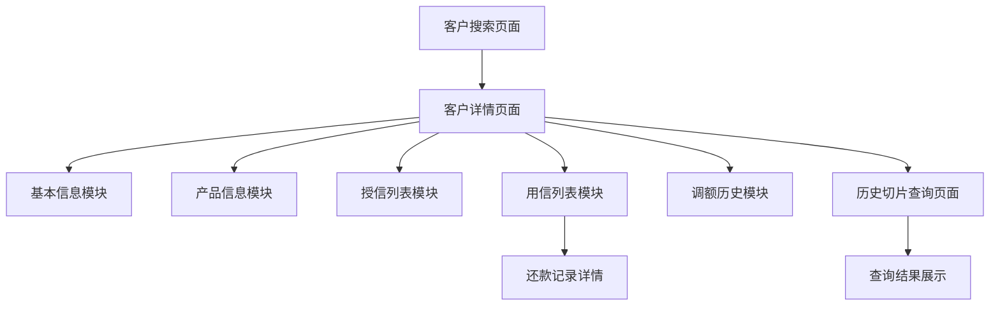
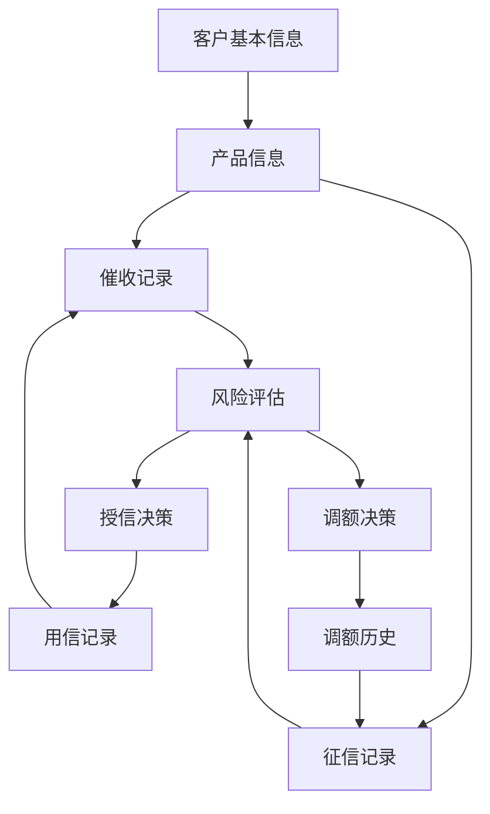

# 客户360视图系统需求文档

## 1. 产品概述

客户360视图系统是一个综合性的客户信息管理平台，为银行业务人员提供客户全方位信息查询和管理功能。系统通过统一的客户视图，整合客户基本信息、产品信息、授信记录、用信记录等多维度数据，支持快速查询、数据导出和历史数据分析，提升客户服务效率和风险管控能力。

## 2. 核心功能

### 2.1 用户角色

| 角色   | 登录方式   | 核心权限                  |
| ---- | ------ | --------------------- |
| 业务人员 | 系统账号登录 | 可查询客户信息、查看产品详情、导出数据   |
| 风控人员 | 系统账号登录 | 可查询客户信息、查看风险数据、分析历史切片 |
| 管理人员 | 系统账号登录 | 拥有所有查询权限，可管理查询模板      |

### 2.2 功能模块

客户360视图系统包含以下主要页面：

1. **客户搜索页面**：客户ID搜索、快速定位客户信息
2. **客户详情页面**：客户基本信息展示、产品信息管理、记录查询、营销记录
3. **历史切片查询页面**：客户历史数据查询、模板管理、数据分析

### 2.3 页面详情

| 页面名称     | 模块名称    | 功能描述                    |
| -------- | ------- | ----------------------- |
| 客户搜索页面   | 搜索表单    | 输入客户ID进行搜索，支持模糊匹配和精确查询  |
| 客户搜索页面   | 搜索结果    | 显示搜索结果列表，支持快速跳转到详情页     |
| 客户详情页面   | 客户基本信息  | 展示姓名、年龄、性别、手机号、身份证等基础信息 |
| 客户详情页面   | 产品级客户信息 | 显示透支天数、透支金额、还款率等产品相关信息  |
| 客户详情页面   | 自营产品信息  | 展示自营产品的基础信息、催收记录、征信记录   |
| 客户详情页面   | 助贷产品信息  | 展示助贷产品的基础信息、催收记录、征信记录   |
| 客户详情页面   | 催收记录    | 显示催收时间、方式、结果、催收人员等详细信息  |
| 客户详情页面   | 征信记录    | 展示征信查询时间、机构、原因、结果等信息    |
| 客户详情页面   | 授信列表    | 显示客户所有授信记录，支持快速复制功能     |
| 客户详情页面   | 用信列表    | 显示用信记录，支持查看还款明细和快速复制    |
| 客户详情页面   | 调额历史    | 展示额度调整历史记录，支持快速复制功能     |
| 客户详情页面   | 营销记录    | 展示AI外呼、短信、人工外呼等触达记录和权益发放记录 |
| 历史切片查询页面 | 查询模板选择  | 选择预设的查询模板或自定义查询条件       |
| 历史切片查询页面 | 切片数据展示  | 多种方式展示客户历史明细数据，支持快速复制功能 |
| 历史切片查询页面 | 数据表格展示  | 分页表格展示，支持排序筛选，每行支持快速复制 |
| 历史切片查询页面 | 统计卡片展示  | 关键指标卡片化展示，支持点击复制数值     |
| 历史切片查询页面 | 图表展示    | 时间序列图表展示趋势，支持数据点复制     |
| 历史切片查询页面 | 复制操作区   | 提供批量复制、全部复制、格式选择等功能    |

### 2.4 征信记录模块设计

#### 征信报告展示（简化版）
- **征信报告链接**：提供征信报告的查看链接，支持在线预览
- **报告基本信息**：
  - 报告生成时间
  - 查询机构名称
  - 征信评分（数值显示）
  - 信用等级（等级标签）
- **快速概览**：
  - 当前征信状态（正常/异常）
  - 风险等级标识
  - 最近查询次数
- **操作功能**：
  - 查看完整征信报告（跳转链接）
  - 下载征信报告PDF
  - 复制征信报告链接

#### Demo功能说明
- 征信数据作为演示功能，不进行详细解释和分析
- 重点展示征信报告的访问入口和基本状态信息
- 支持模拟征信报告链接的展示和交互

### 2.5 营销记录模块设计

#### 触达记录管理
- **触达时间**：具体的触达发起时间
- **渠道类型**：AI外呼、短信、人工外呼、邮件、APP推送等
- **触达内容**：营销内容摘要或模板名称
- **触达结果**：成功、失败、拒绝、无应答等状态
- **响应情况**：客户反馈、接听时长、点击率等
- **执行人员**：触达执行的系统或人员信息
- **关联活动**：所属营销活动或推广计划
- **成本信息**：单次触达成本（可选）

#### 权益发放记录
- **权益类型**：优惠券、积分、免费服务、利率优惠等
- **发放时间**：权益发放的具体时间
- **权益内容**：具体的权益描述和价值
- **使用状态**：未使用、已使用、已过期
- **使用时间**：权益实际使用时间
- **有效期**：权益的有效期限
- **发放渠道**：权益发放的渠道来源
- **关联产品**：权益关联的具体产品或服务
- **使用场景**：权益的适用场景或限制条件

#### 营销效果分析
- **触达成功率**：各渠道触达成功率统计
- **响应转化率**：从触达到响应的转化率
- **权益使用率**：权益发放后的实际使用率
- **渠道效果对比**：不同渠道的营销效果对比
- **时间趋势分析**：营销效果的时间变化趋势
- **ROI分析**：营销投入产出比分析（可选）

## 3. 核心流程

### 3.1 客户信息查询流程

用户通过客户ID搜索 → 系统验证客户存在性 → 跳转到客户详情页 → 展示客户全方位信息 → 支持数据操作（复制、查看明细等）

### 3.2 历史数据查询流程

选择查询模板 → 设置查询参数 → 执行切片数据查询 → 展示历史明细数据 → 支持数据分析和导出

### 3.3 营销记录查询流程

用户进入客户详情页的营销记录模块 → 选择查看触达记录或权益发放记录 → 可按时间、渠道、状态等条件筛选 → 查看详细的营销记录和效果分析 → 支持快速复制和数据导出

### 3.4 历史切片数据查询增强流程

点击历史数据查询按钮 → 打开查询记录抽屉 → 选择查看历史记录或新建查询 → 配置数据模型和查询条件 → 提交查询任务 → 查看结果表格 → 导出或复制数据



## 4. 用户界面设计

### 4.1 UE优化方案

#### 产品切换交互设计

**1. 产品类型切换**
- **主要切换器**：页面顶部设置产品类型切换Tab（自营产品 / 助贷产品）
- **切换状态保持**：切换产品类型时，保持当前选中的信息模块Tab状态
- **数据加载优化**：产品切换时显示骨架屏，避免页面闪烁
- **URL状态同步**：产品类型切换反映在URL中，支持直接访问和分享

**2. 产品内容区域设计**
```
┌─────────────────────────────────────────┐
│ 自营产品 | 助贷产品                        │ ← 产品类型切换
├─────────────────────────────────────────┤
│ 基本信息 | 催收记录 | 征信记录 | 营销记录    │ ← 信息模块切换
├─────────────────────────────────────────┤
│                                         │
│           模块内容展示区域                │
│                                         │
└─────────────────────────────────────────┘
```

#### 信息模块切换优化

**1. 二级Tab设计**
- **自营产品下的模块**：基本信息、催收记录、征信记录、营销记录
- **助贷产品下的模块**：基本信息、催收记录、征信记录、营销记录
- **Tab状态独立**：不同产品类型下的Tab选中状态独立记忆
- **懒加载策略**：仅在Tab被激活时加载对应数据

**2. 模块内容布局**
- **统一布局标准**：所有模块采用相同的卡片布局和间距
- **内容自适应**：根据数据量自动调整内容区域高度
- **加载状态一致**：统一的加载动画和骨架屏样式

#### 交互体验优化

**1. 切换动画效果**
- **产品切换**：使用淡入淡出动画，切换时间200ms
- **模块切换**：使用滑动动画，增强切换的连贯性
- **数据加载**：显示进度条或骨架屏，避免空白页面

**2. 状态记忆功能**
- **会话级记忆**：在当前会话中记住用户的切换偏好
- **URL参数**：通过URL参数记录当前产品类型和模块状态
- **默认展示**：首次访问时默认展示自营产品的基本信息

**3. 响应式适配**
- **移动端优化**：在小屏幕下将Tab改为下拉选择器
- **触摸友好**：增大点击区域，支持滑动切换
- **内容优先级**：在小屏幕下优先显示核心信息

#### 信息架构优化

**1. 分层信息展示**
```
第一层：产品类型（自营/助贷）
第二层：信息模块（基本信息/催收记录/征信记录/营销记录）
第三层：具体内容（表格/卡片/图表）
```

**2. 数据展示策略**
- **关键信息前置**：重要数据在模块顶部优先展示
- **分页加载**：大数据量采用分页，默认每页20条
- **虚拟滚动**：超长列表使用虚拟滚动技术
- **智能筛选**：提供快速筛选和搜索功能

**3. 操作便捷性**
- **快速复制**：所有列表数据支持一键复制
- **批量操作**：支持多选和批量导出
- **快捷键支持**：常用操作支持键盘快捷键

### 4.2 设计风格

* **主色调**：#165dff（蓝色）、#ffffff（白色）

* **辅助色**：#86909c（灰色）、#f7f8fa（浅灰背景）

* **按钮样式**：圆角按钮，支持主要、次要、文本三种类型

* **字体**：系统默认字体，标题16px，正文14px，辅助文本12px

* **布局风格**：卡片式布局，顶部导航，垂直信息展示

* **图标风格**：使用Arco Design图标库，简洁现代风格

### 4.3 页面设计概览

| 页面名称     | 模块名称  | UI元素                    |
| -------- | ----- | ----------------------- |
| 客户搜索页面   | 搜索表单  | 居中布局，大尺寸输入框，渐变背景，白色卡片容器 |
| 客户详情页面   | 顶部操作栏 | 返回按钮、面包屑导航、刷新和导出按钮、历史数据查询按钮，白色背景 |
| 客户详情页面   | 产品切换器 | Tab标签页，支持自营产品和助贷产品切换    |
| 客户详情页面   | 信息展示区 | 垂直布局的卡片式设计，每个模块独立卡片，支持滚动条     |
| 客户详情页面   | 催收记录表格 | 时间线布局，状态标签，联系结果图标，支持筛选和复制，滚动优化 |
| 客户详情页面   | 征信记录表格 | 评分展示，等级标签，风险提示，支持详情查看和复制，滚动优化 |
| 客户详情页面   | 营销记录区 | Tab切换、折叠面板、虚拟滚动表格、筛选器、统计卡片，滚动优化 |
| 客户详情页面   | 数据表格  | 带边框表格，支持排序和快速复制功能，滚动优化       |
| 查询记录抽屉   | 抽屉头部  | 标题显示、关闭按钮、新建查询按钮、筛选器组件 |
| 查询记录抽屉   | 记录列表  | 查询记录卡片、状态标识、操作按钮、分页器，虚拟滚动 |
| 查询记录抽屉   | 结果展示  | 表格组件、列配置、导出按钮、统计信息，全屏模式 |
| 新建查询弹窗   | 模型选择  | 分类导航、模型列表、搜索框、模型预览，步骤指示器 |
| 新建查询弹窗   | 条件配置  | 动态表单、条件验证、高级选项、预览区域 |
| 新建查询弹窗   | 任务提交  | 任务命名、执行选项、提交按钮、进度指示 |
| 历史切片查询页面 | 查询条件区 | 表单布局，下拉选择和日期选择器，查询按钮   |
| 历史切片查询页面 | 结果展示区 | 多Tab展示（表格/图表/卡片），每个区域都支持复制 |
| 历史切片查询页面 | 复制工具栏 | 固定工具栏，包含复制选中、复制全部、格式选择按钮 |
| 历史切片查询页面 | 数据统计区 | 显示查询结果统计信息，支持一键复制统计数据 |

### 4.4 新增功能UI设计规格

#### 4.4.1 历史数据查询按钮
* **位置**：页面右上角，产品类型切换Tab旁边
* **样式**：主色调按钮，图标+文字组合
* **尺寸**：高度32px，内边距12px 16px
* **状态指示**：显示查询任务数量的红色徽章（数量>0时显示）
* **悬停效果**：按钮阴影加深，背景色变为#4080ff
* **图标**：使用IconSearch图标，16px大小

#### 4.4.2 查询记录抽屉
* **宽度**：屏幕宽度的65%，最小800px，最大1200px
* **高度**：100vh全屏高度
* **背景**：白色背景，带有0 4px 12px rgba(0,0,0,0.15)阴影
* **头部高度**：60px，包含标题、筛选器和操作按钮
* **内容区**：可滚动区域，支持虚拟滚动优化
* **动画**：从右侧滑入，300ms cubic-bezier(0.34, 0.69, 0.1, 1)缓动
* **遮罩层**：半透明黑色背景rgba(0,0,0,0.5)

#### 4.4.3 查询记录卡片
* **布局**：左侧状态图标(24px)，中间信息区域，右侧操作按钮组
* **高度**：80px固定高度
* **内边距**：16px水平，12px垂直
* **间距**：卡片间距8px
* **边框**：1px solid #e5e6eb，圆角6px
* **悬停效果**：边框颜色变为#165dff，阴影0 2px 8px rgba(22,93,255,0.15)
* **状态颜色**：
  - 成功：#00b42a（绿色）
  - 失败：#f53f3f（红色）
  - 执行中：#165dff（蓝色）
  - 等待：#86909c（灰色）

#### 4.4.4 新建查询弹窗
* **尺寸**：宽度800px，高度600px
* **位置**：屏幕居中显示
* **背景**：白色，圆角8px
* **阴影**：0 4px 20px rgba(0,0,0,0.15)
* **步骤指示器**：顶部40px高度，3个步骤圆点，当前步骤高亮
* **内容区**：高度520px，支持分步内容切换
* **按钮组**：底部右对齐，按钮间距8px
* **表单样式**：统一的Arco Design表单控件

#### 4.4.5 查询结果表格
* **表头**：固定表头，高度40px，背景色#f7f8fa
* **行高**：40px标准行高
* **斑马纹**：奇数行背景色#fafafa
* **边框**：1px solid #e5e6eb
* **操作列**：右侧固定，宽度120px
* **排序图标**：表头右侧，16px大小
* **加载状态**：骨架屏效果，灰色渐变动画
* **空状态**：居中显示空状态图标和提示文字

#### 4.4.6 滚动条样式
* **宽度**：8px
* **轨道颜色**：#f5f5f5
* **滑块颜色**：#c1c1c1
* **滑块悬停**：#a8a8a8
* **圆角**：4px
* **滚动指示器**：右下角显示滚动位置百分比

### 4.5 响应式设计

* **桌面端优先**：主要针对1920x1080及以上分辨率设计
* **平板适配**：支持1024x768分辨率，调整布局和字体大小
* **移动端适配**：支持375x667及以上移动设备，采用垂直布局
* **触摸优化**：移动端支持触摸手势，按钮和链接区域适当放大
* **抽屉适配**：移动端抽屉宽度调整为90%，弹窗改为全屏模式
* **滚动优化**：移动端优化滚动性能，支持惯性滚动和橡皮筋效果
* **字体缩放**：移动端字体大小适当增加，确保可读性
* **交互优化**：移动端增加触摸反馈，长按显示操作菜单

## 5. 数据模型设计

### 5.1 客户基本信息

```typescript
interface CustomerBasicInfo {
  userId: string;           // 客户ID
  name: string;            // 姓名
  age: number;             // 年龄
  gender: string;          // 性别
  mobile: string;          // 手机号
  idCard: string;          // 身份证号
  customerNo: string;      // 客户号
  address: string;         // 地址
  status: string;          // 客户状态
}
```

### 5.2 产品信息结构

```typescript
interface ProductInfo {
  productKey: string;      // 产品编号
  productType: '自营产品' | '助贷产品';  // 产品类型
  productName: string;     // 产品名称
  basicInfo: {             // 基础信息
    balance: number;       // 余额
    rate: number;          // 利率
    status: string;        // 状态
  };
  collectionRecords: CollectionRecord[];  // 催收记录
  creditRecords: CreditRecord[];          // 征信记录
}
```

### 5.3 催收记录结构

```typescript
interface CollectionRecord {
  collectionId: string;    // 催收记录ID
  collectionDate: string;  // 催收时间
  collectionType: '电话催收' | '短信催收' | '上门催收' | '法律催收';  // 催收方式
  collectorName: string;   // 催收人员
  collectorPhone: string;  // 催收人员电话
  contactResult: '已联系' | '未联系' | '拒接' | '空号' | '关机';  // 联系结果
  promiseDate: string;     // 承诺还款日期
  promiseAmount: number;   // 承诺还款金额
  collectionResult: '成功' | '失败' | '部分成功';  // 催收结果
  overdueAmount: number;   // 逾期金额
  overdueDays: number;     // 逾期天数
  remark: string;          // 催收备注
  nextFollowDate: string;  // 下次跟进时间
  riskLevel: '低风险' | '中风险' | '高风险';  // 风险等级
}
```

### 5.4 征信记录结构（简化版）

```typescript
interface CreditRecord {
  creditId: string;        // 征信记录ID
  reportDate: string;      // 报告生成时间
  queryInstitution: string; // 查询机构名称
  creditScore: number;     // 征信评分
  creditLevel: 'AAA' | 'AA' | 'A' | 'BBB' | 'BB' | 'B' | 'CCC' | 'CC' | 'C' | 'D';  // 信用等级
  status: '正常' | '异常'; // 当前征信状态
  riskLevel: '低风险' | '中风险' | '高风险';  // 风险等级
  queryCount: number;      // 最近查询次数
  reportUrl: string;       // 征信报告链接
  reportPdfUrl?: string;   // 征信报告PDF下载链接
  remark?: string;         // 备注信息
}

// 征信报告展示信息
interface CreditReportDisplay {
  hasReport: boolean;      // 是否有征信报告
  reportTitle: string;     // 报告标题
  reportDate: string;      // 报告日期
  quickInfo: {             // 快速概览信息
    score: number;         // 评分
    level: string;         // 等级
    status: string;        // 状态
    riskLevel: string;     // 风险等级
  };
  actions: {               // 可执行操作
    viewReport: boolean;   // 是否可查看报告
    downloadPdf: boolean;  // 是否可下载PDF
    copyLink: boolean;     // 是否可复制链接
  };
}
```

### 5.5 用信记录结构

```typescript
interface LoanRecord {
  loanNo: string;          // 用信编号
  amount: number;          // 用信金额
  balance: number;         // 剩余余额
  installments: number;    // 总期数
  paidInstallments: number; // 已还期数
  repaymentRecords: RepaymentRecord[]; // 还款记录明细
}

interface RepaymentRecord {
  repaymentDate: string;   // 还款日期
  amount: number;          // 还款金额
  principal: number;       // 本金
  interest: number;        // 利息
  status: string;          // 还款状态
}
```

### 5.6 调额历史结构

```typescript
interface QuotaAdjustment {
  id: string;              // 调额记录ID
  adjustDate: string;      // 调额日期
  adjustType: string;      // 调额类型（提额/降额）
  beforeAmount: number;    // 调额前金额
  afterAmount: number;     // 调额后金额
  adjustAmount: number;    // 调额金额
  reason: string;          // 调额原因
  operator: string;        // 操作人
  status: string;          // 状态
  remark?: string;         // 备注
}
```

### 5.7 营销记录结构

```typescript
// 触达记录
interface ContactRecord {
  id: string;              // 记录ID
  userId: string;          // 用户ID
  contactTime: string;     // 触达时间
  channelType: string;     // 渠道类型（AI外呼、短信、人工外呼、邮件、APP推送）
  contactContent: string;  // 触达内容摘要
  templateId?: string;     // 模板ID
  contactResult: string;   // 触达结果（成功、失败、拒绝、无应答）
  responseInfo?: string;   // 响应情况
  duration?: number;       // 接听时长（秒）
  clickRate?: number;      // 点击率
  executor: string;        // 执行人员/系统
  campaignId?: string;     // 关联活动ID
  campaignName?: string;   // 关联活动名称
  cost?: number;           // 触达成本
  createTime: string;      // 创建时间
  updateTime: string;      // 更新时间
}

// 权益发放记录
interface BenefitRecord {
  id: string;              // 记录ID
  userId: string;          // 用户ID
  benefitType: string;     // 权益类型（优惠券、积分、免费服务、利率优惠）
  benefitName: string;     // 权益名称
  benefitContent: string;  // 权益内容描述
  benefitValue: number;    // 权益价值
  issueTime: string;       // 发放时间
  useStatus: string;       // 使用状态（未使用、已使用、已过期）
  useTime?: string;        // 使用时间
  validFrom: string;       // 有效期开始
  validTo: string;         // 有效期结束
  issueChannel: string;    // 发放渠道
  relatedProduct?: string; // 关联产品
  useScene?: string;       // 使用场景
  restrictions?: string;   // 使用限制
  campaignId?: string;     // 关联活动ID
  createTime: string;      // 创建时间
  updateTime: string;      // 更新时间
}

// 营销效果统计
interface MarketingStats {
  userId: string;          // 用户ID
  totalContacts: number;   // 总触达次数
  successContacts: number; // 成功触达次数
  successRate: number;     // 触达成功率
  responseRate: number;    // 响应率
  conversionRate: number;  // 转化率
  totalBenefits: number;   // 总权益发放数
  usedBenefits: number;    // 已使用权益数
  benefitUseRate: number;  // 权益使用率
  totalCost?: number;      // 总营销成本
  roi?: number;            // 投资回报率
  lastContactTime?: string;// 最后触达时间
  lastBenefitTime?: string;// 最后权益发放时间
}
```

## 6. 功能增强需求

### 6.1 快速复制功能

* **复制范围**：支持单行数据、多行数据、单元格数据、全部数据的复制
* **复制格式**：支持文本、JSON、CSV等多种格式
* **复制触发**：右键菜单、快捷键、按钮点击等多种触发方式
* **复制反馈**：复制成功后的提示信息和状态反馈

### 6.2 页面滚动优化

#### 6.2.1 滑动条支持
* **垂直滚动**：页面支持上下滑动条，确保长内容的可访问性
* **滚动优化**：平滑滚动效果，支持鼠标滚轮和触摸板操作
* **滚动位置记忆**：切换模块时保持滚动位置状态
* **滚动指示器**：显示当前滚动位置和页面总长度

### 6.3 历史切片数据查询增强

#### 6.3.1 查询入口优化
历史切片数据查询功能从原有的直接展示改为按钮触发模式，提供更好的用户体验和数据管理。

* **查询按钮**：在页面右上角或相关模块中添加"历史数据查询"按钮
* **按钮状态**：显示当前用户的查询任务数量和最新查询状态
* **快速访问**：支持快捷键触发查询功能

#### 6.3.2 抽屉式查询记录管理

**抽屉展示设计**
* **抽屉位置**：从页面右侧滑出，宽度占屏幕60-70%
* **抽屉标题**：显示"明细数据查询记录 - {客户姓名}({客户ID})"
* **关闭方式**：支持点击遮罩层、ESC键、关闭按钮关闭抽屉

**查询记录列表**
* **记录展示**：以时间倒序展示当前用户的所有查询记录
* **记录信息**：查询时间、数据模型名称、查询条件摘要、执行状态、结果数量
* **状态标识**：执行中、成功、失败、超时等状态的图标和颜色标识
* **操作按钮**：查看结果、重新执行、删除记录、导出数据

**查询记录筛选**
* **时间筛选**：今天、最近7天、最近30天、自定义时间范围
* **状态筛选**：全部、成功、失败、执行中
* **模型筛选**：按数据模型类型筛选查询记录

#### 6.3.3 新建查询任务功能

**新建查询按钮**
* **按钮位置**：抽屉顶部工具栏中的"新建查询"按钮
* **权限控制**：根据用户角色控制查询权限和频次限制

**查询配置弹窗**
* **弹窗设计**：模态弹窗，宽度800px，高度600px，居中显示
* **弹窗标题**："新建明细数据查询 - {客户姓名}({客户ID})"
* **分步配置**：数据模型选择 → 查询条件配置 → 结果预览设置

**数据模型选择**
* **模型分类**：客户信息、产品信息、交易记录、风险数据、营销数据等
* **模型列表**：展示可用的数据模型，包含模型名称、描述、字段数量、更新时间
* **模型预览**：选择模型后显示字段结构和示例数据
* **搜索功能**：支持按模型名称和描述搜索

**查询条件配置**
* **动态表单**：根据选择的数据模型动态生成查询条件表单
* **条件类型**：等于、不等于、大于、小于、包含、不包含、为空、不为空
* **时间范围**：支持绝对时间和相对时间（如最近30天）
* **高级条件**：支持AND/OR逻辑组合，条件分组
* **条件验证**：实时验证查询条件的有效性

**查询任务提交**
* **任务命名**：用户可自定义查询任务名称
* **执行方式**：立即执行或定时执行
* **结果通知**：查询完成后的通知方式（页面提示、邮件通知）
* **预估时间**：根据查询复杂度预估执行时间

#### 6.3.4 查询结果展示

**结果查看入口**
* **列表点击**：点击查询记录列表中的"查看结果"按钮
* **状态跳转**：查询完成后自动跳转到结果页面

**表格数据展示**
* **表格设计**：在抽屉内展示查询结果表格，支持全屏模式
* **分页加载**：大数据量结果支持分页展示，每页50-100条
* **列配置**：支持显示/隐藏列、调整列宽、列排序
* **数据筛选**：表格内支持快速筛选和搜索
* **数据导出**：支持导出Excel、CSV格式

**数据操作功能**
* **快速复制**：继承原有的快速复制功能
* **数据对比**：支持与历史查询结果对比
* **数据钻取**：支持点击数据行查看详细信息
* **统计信息**：显示查询结果的统计摘要

### 6.4 历史切片数据查询（原有功能保留）

历史切片数据查询功能允许用户查看客户在不同时间点的数据状态，支持数据对比和趋势分析。

#### 6.2.1 集成management/data-models模块

* **模板管理**：基于management/data-models模块的数据模型管理功能
* **查询模板类型**：
  - 明细数据下载模板：用于导出客户历史明细数据
  - 分析报告模板：用于生成客户分析报告
* **技术实现**：复用data-models模块的SQL/Python执行引擎
* **参数配置**：支持动态参数配置（客户ID、时间范围、产品类型等）

#### 6.2.2 页面展示模版设计

```typescript
// 客户历史切片查询模板
interface HistorySliceTemplate {
  id: string;
  name: string;
  templateType: 'display' | 'report';
  dataType: 'customer_info' | 'product_status' | 'risk_assessment' | 'marketing_record';
  sqlTemplate: string;
  parameters: TemplateParameter[];
  displayFormat: 'table' | 'chart' | 'card' | 'timeline';
  description: string;
}

// 模板参数定义
interface TemplateParameter {
  name: string;
  type: 'string' | 'number' | 'date' | 'select';
  required: boolean;
  defaultValue: any;
  options?: string[]; // 用于select类型
  description: string;
}

// 数据展示配置
interface DisplayConfig {
  showType: 'table' | 'chart' | 'card' | 'timeline';
  copyable: boolean;
  columns?: ColumnConfig[];
  chartConfig?: ChartConfig;
  cardConfig?: CardConfig;
}

// 快速复制配置
interface CopyConfig {
  enableRowCopy: boolean;      // 支持单行复制
  enableCellCopy: boolean;     // 支持单元格复制
  enableBatchCopy: boolean;    // 支持批量复制
  enableAllCopy: boolean;      // 支持全部复制
  copyFormat: 'text' | 'json' | 'csv';
}
```

#### 6.2.3 预设查询模板

**客户基本信息历史切片**
```sql
SELECT 
    customer_id,
    snapshot_date,
    name,
    age,
    gender,
    mobile,
    address,
    customer_level,
    status
FROM customer_history_snapshot 
WHERE customer_id = '{customer_id}'
    AND snapshot_date BETWEEN '{start_date}' AND '{end_date}'
ORDER BY snapshot_date DESC;
```

**产品状态历史切片**
```sql
SELECT 
    customer_id,
    product_id,
    product_name,
    product_type,
    balance,
    status,
    credit_limit,
    used_amount,
    snapshot_date
FROM product_history_snapshot 
WHERE customer_id = '{customer_id}'
    AND product_type IN ({product_types})
    AND snapshot_date BETWEEN '{start_date}' AND '{end_date}'
ORDER BY snapshot_date DESC, product_id;
```

#### 6.2.4 数据查询和展示流程

1. **模板选择**：从预设模板中选择或自定义查询条件
2. **参数配置**：设置客户ID、时间范围、产品类型等参数
3. **查询执行**：调用data-models模块的执行引擎
4. **结果展示**：表格、图表、统计卡片、时间轴等多种展示方式
5. **快速复制**：支持单行、多行、全部数据的快速复制功能

#### 6.2.5 数据展示方式

**1. 表格展示**
- 支持分页、排序、筛选功能
- 每行数据支持快速复制
- 支持多选批量复制
- 表格头部提供"复制全部"按钮

**2. 统计卡片展示**
- 关键指标卡片化展示
- 支持点击卡片复制数值
- 卡片支持趋势图表展示

**3. 图表展示**
- 时间序列图表展示数据趋势
- 支持图表数据点的复制
- 图表下方提供数据表格

**4. 时间轴展示**
- 按时间顺序展示历史变化
- 每个时间节点支持详情查看和复制
- 支持时间范围筛选

### 6.3 还款记录查看

* **明细展示**：每期还款的本金、利息、手续费明细

* **还款状态**：正常、逾期、提前还款等状态标识

* **统计信息**：累计还款金额、剩余本金、下期还款日等

* **操作功能**：支持导出还款计划、复制还款记录

### 6.4 催收记录管理

* **催收时间线**：按时间顺序展示催收记录，支持时间筛选

* **催收方式分类**：电话、短信、上门、法律等不同方式的标识和统计

* **联系结果统计**：已联系、未联系、拒接等结果的可视化展示

* **催收效果分析**：成功率统计、承诺还款跟踪、风险等级变化

* **快速操作**：支持批量复制、导出催收报告、添加催收备注

### 6.5 征信记录查询

* **征信评分趋势**：展示征信评分的历史变化趋势图

* **查询机构统计**：按查询机构分类展示查询频次和原因

* **风险提示预警**：高亮显示风险提示信息，支持风险等级筛选

* **征信报告详情**：支持查看完整征信报告，包括逾期记录、贷款记录等

* **数据对比分析**：支持不同时期征信数据的对比分析

## 7. 模块交互关系

### 7.1 催收记录与其他模块的关系

* **与用信记录关联**：催收记录关联具体的用信记录，展示逾期贷款的催收情况

* **与征信记录关联**：催收结果影响征信评分，支持查看催收对征信的影响

* **与风险评估关联**：催收记录作为风险评估的重要依据，影响客户风险等级

* **与客户基本信息关联**：催收记录中的联系方式与客户基本信息保持同步

### 7.2 征信记录与其他模块的关系

* **与授信记录关联**：征信记录影响授信决策，展示征信对授信的影响

* **与产品信息关联**：不同产品类型对征信要求不同，支持按产品查看征信记录

* **与调额历史关联**：征信变化是调额的重要依据，支持查看征信对调额的影响

* **与风险管控关联**：征信记录是风险管控的核心数据，支持风险预警和分析

### 7.3 数据流转关系



## 8. 技术实现要点

### 8.1 前端技术栈

* **框架**：Vue 3 + Composition API
* **UI组件**：Arco Design
* **状态管理**：Vuex
* **路由**：Vue Router
* **构建工具**：Vite
* **开发语言**：TypeScript + JavaScript

### 8.2 页面滚动优化技术实现

#### 8.2.1 滚动条样式和行为

```typescript
// 滚动优化配置
const scrollConfig = {
  // 自定义滚动条样式
  customScrollbar: {
    width: '8px',
    trackColor: '#f5f5f5',
    thumbColor: '#c1c1c1',
    thumbHoverColor: '#a8a8a8'
  },
  
  // 平滑滚动配置
  smoothScroll: {
    behavior: 'smooth',
    duration: 300
  },
  
  // 滚动位置记忆
  scrollMemory: {
    enabled: true,
    storageKey: 'customer360_scroll_position'
  }
};

// 滚动位置管理
class ScrollPositionManager {
  private scrollPositions: Map<string, number> = new Map();
  
  saveScrollPosition(moduleKey: string, position: number) {
    this.scrollPositions.set(moduleKey, position);
    localStorage.setItem(
      scrollConfig.scrollMemory.storageKey,
      JSON.stringify(Object.fromEntries(this.scrollPositions))
    );
  }
  
  restoreScrollPosition(moduleKey: string): number {
    return this.scrollPositions.get(moduleKey) || 0;
  }
  
  loadFromStorage() {
    const stored = localStorage.getItem(scrollConfig.scrollMemory.storageKey);
    if (stored) {
      const positions = JSON.parse(stored);
      this.scrollPositions = new Map(Object.entries(positions));
    }
  }
}
```

#### 8.2.2 滚动事件处理

```typescript
// 滚动事件监听和处理
const useScrollOptimization = () => {
  const scrollManager = new ScrollPositionManager();
  const currentModule = ref('');
  
  const handleScroll = throttle((event: Event) => {
    const target = event.target as HTMLElement;
    const scrollTop = target.scrollTop;
    
    // 保存当前滚动位置
    if (currentModule.value) {
      scrollManager.saveScrollPosition(currentModule.value, scrollTop);
    }
    
    // 更新滚动指示器
    updateScrollIndicator(scrollTop, target.scrollHeight, target.clientHeight);
  }, 100);
  
  const restoreScroll = (moduleKey: string) => {
    currentModule.value = moduleKey;
    nextTick(() => {
      const position = scrollManager.restoreScrollPosition(moduleKey);
      if (position > 0) {
        const container = document.querySelector('.customer-detail-container');
        container?.scrollTo({
          top: position,
          behavior: scrollConfig.smoothScroll.behavior
        });
      }
    });
  };
  
  return {
    handleScroll,
    restoreScroll,
    scrollManager
  };
};
```

### 8.3 历史切片数据查询增强技术实现

#### 8.3.1 抽屉组件设计

```typescript
// 查询记录抽屉组件
const QueryRecordsDrawer = {
  props: {
    visible: Boolean,
    customerId: String,
    customerName: String
  },
  
  setup(props, { emit }) {
    const queryRecords = ref([]);
    const loading = ref(false);
    const selectedRecord = ref(null);
    const showNewQueryModal = ref(false);
    
    // 查询记录列表
    const fetchQueryRecords = async () => {
      loading.value = true;
      try {
        const response = await queryHistoryAPI.getQueryRecords({
          customerId: props.customerId,
          pageSize: 50,
          sortBy: 'created_at',
          sortOrder: 'desc'
        });
        queryRecords.value = response.data;
      } catch (error) {
        Message.error('获取查询记录失败');
      } finally {
        loading.value = false;
      }
    };
    
    // 查看查询结果
    const viewQueryResult = async (record) => {
      selectedRecord.value = record;
      if (record.status === 'completed') {
        // 获取查询结果数据
        const resultData = await queryHistoryAPI.getQueryResult(record.id);
        // 在抽屉内展示表格数据
        showResultTable(resultData);
      }
    };
    
    // 新建查询
    const createNewQuery = () => {
      showNewQueryModal.value = true;
    };
    
    return {
      queryRecords,
      loading,
      selectedRecord,
      showNewQueryModal,
      fetchQueryRecords,
      viewQueryResult,
      createNewQuery
    };
  }
};
```

#### 8.3.2 新建查询弹窗组件

```typescript
// 新建查询弹窗组件
const NewQueryModal = {
  props: {
    visible: Boolean,
    customerId: String
  },
  
  setup(props, { emit }) {
    const currentStep = ref(1); // 1: 选择模型, 2: 配置条件, 3: 确认提交
    const selectedModel = ref(null);
    const queryConditions = ref({});
    const queryName = ref('');
    
    // 数据模型列表
    const dataModels = ref([]);
    const modelCategories = ref([
      { key: 'customer', label: '客户信息', icon: 'icon-user' },
      { key: 'product', label: '产品信息', icon: 'icon-product' },
      { key: 'transaction', label: '交易记录', icon: 'icon-transaction' },
      { key: 'risk', label: '风险数据', icon: 'icon-risk' },
      { key: 'marketing', label: '营销数据', icon: 'icon-marketing' }
    ]);
    
    // 获取数据模型列表
    const fetchDataModels = async () => {
      try {
        const response = await dataModelsAPI.getDataModelsList({
          useCase: 'query',
          status: 'active'
        });
        dataModels.value = response.data;
      } catch (error) {
        Message.error('获取数据模型失败');
      }
    };
    
    // 动态生成查询条件表单
    const generateConditionForm = (model) => {
      const formItems = model.fields.map(field => ({
        field: field.name,
        label: field.displayName || field.name,
        type: field.type,
        required: field.required,
        options: field.options,
        validation: field.validation
      }));
      
      return formItems;
    };
    
    // 提交查询任务
    const submitQuery = async () => {
      try {
        const queryTask = {
          name: queryName.value,
          customerId: props.customerId,
          modelId: selectedModel.value.id,
          conditions: queryConditions.value,
          executeType: 'immediate'
        };
        
        await queryHistoryAPI.createQueryTask(queryTask);
        Message.success('查询任务已提交');
        emit('query-submitted');
        emit('update:visible', false);
      } catch (error) {
        Message.error('提交查询任务失败');
      }
    };
    
    return {
      currentStep,
      selectedModel,
      queryConditions,
      queryName,
      dataModels,
      modelCategories,
      fetchDataModels,
      generateConditionForm,
      submitQuery
    };
  }
};
```

#### 8.3.3 查询结果表格组件

```typescript
// 查询结果表格组件
const QueryResultTable = {
  props: {
    queryRecord: Object,
    resultData: Array
  },
  
  setup(props) {
    const tableColumns = ref([]);
    const tableData = ref([]);
    const pagination = ref({
      current: 1,
      pageSize: 50,
      total: 0
    });
    
    // 根据查询结果动态生成表格列
    const generateTableColumns = (data) => {
      if (data.length === 0) return [];
      
      const firstRow = data[0];
      return Object.keys(firstRow).map(key => ({
        title: key,
        dataIndex: key,
        key: key,
        sortable: true,
        filterable: true,
        width: 150,
        ellipsis: true,
        tooltip: true
      }));
    };
    
    // 数据导出功能
    const exportData = async (format = 'excel') => {
      try {
        const exportData = {
          queryId: props.queryRecord.id,
          format: format,
          columns: tableColumns.value.map(col => col.dataIndex)
        };
        
        const response = await queryHistoryAPI.exportQueryResult(exportData);
        
        // 下载文件
        const link = document.createElement('a');
        link.href = response.downloadUrl;
        link.download = `查询结果_${props.queryRecord.name}_${new Date().toISOString().slice(0, 10)}.${format}`;
        link.click();
        
        Message.success('导出成功');
      } catch (error) {
        Message.error('导出失败');
      }
    };
    
    return {
      tableColumns,
      tableData,
      pagination,
      generateTableColumns,
      exportData
    };
  }
};
```

### 8.4 原有历史切片数据查询技术实现

#### 8.4.1 集成management/data-models模块

```typescript
// 历史切片查询服务
class HistorySliceService {
  // 获取查询模板列表
  async getTemplateList(params: {
    templateType?: 'display' | 'report';
    dataType?: string;
  }) {
    return await dataModelsAPI.getDataModelsList({
      ...params,
      useCase: params.templateType === 'display' ? 'display' : 'report'
    });
  }
  
  // 执行历史切片查询
  async executeQuery(templateId: string, parameters: Record<string, any>) {
    return await dataModelsAPI.executeDataModel(templateId, parameters);
  }
  
  // 格式化查询结果用于页面展示
  formatResultForDisplay(result: any[], displayConfig: DisplayConfig) {
    switch (displayConfig.showType) {
      case 'table':
        return this.formatTableData(result, displayConfig.columns);
      case 'chart':
        return this.formatChartData(result, displayConfig.chartConfig);
      case 'card':
        return this.formatCardData(result, displayConfig.cardConfig);
      case 'timeline':
        return this.formatTimelineData(result);
      default:
        return result;
    }
  }
}
```

#### 8.2.2 快速复制功能实现

```typescript
// 快速复制服务
class CopyService {
  // 复制单行数据
  async copyRowData(rowData: any, format: 'text' | 'json' | 'csv' = 'text') {
    let copyText = '';
    switch (format) {
      case 'json':
        copyText = JSON.stringify(rowData, null, 2);
        break;
      case 'csv':
        copyText = Object.values(rowData).join(',');
        break;
      default:
        copyText = Object.entries(rowData)
          .map(([key, value]) => `${key}: ${value}`)
          .join('\n');
    }
    
    await navigator.clipboard.writeText(copyText);
    Message.success('数据已复制到剪贴板');
  }
  
  // 复制表格数据
  async copyTableData(tableData: any[], selectedRows?: any[], format: 'text' | 'json' | 'csv' = 'csv') {
    const dataToCopy = selectedRows && selectedRows.length > 0 ? selectedRows : tableData;
    let copyText = '';
    
    switch (format) {
      case 'json':
        copyText = JSON.stringify(dataToCopy, null, 2);
        break;
      case 'csv':
        if (dataToCopy.length > 0) {
          const headers = Object.keys(dataToCopy[0]).join(',');
          const rows = dataToCopy.map(row => Object.values(row).join(','));
          copyText = [headers, ...rows].join('\n');
        }
        break;
      default:
        copyText = dataToCopy.map(row => 
          Object.entries(row).map(([key, value]) => `${key}: ${value}`).join(', ')
        ).join('\n');
    }
    
    await navigator.clipboard.writeText(copyText);
    Message.success(`已复制 ${dataToCopy.length} 条数据`);
  }
  
  // 复制单元格数据
  async copyCellData(cellValue: any) {
    await navigator.clipboard.writeText(String(cellValue));
    Message.success('单元格数据已复制');
  }
}

// 查询参数组件
const QueryParameterForm = {
  props: ['template'],
  setup(props) {
    const formData = ref({});
    
    // 根据模板参数动态生成表单
    const formItems = computed(() => {
      return props.template.parameters.map(param => ({
        field: param.name,
        label: param.description,
        type: param.type,
        required: param.required,
        defaultValue: param.defaultValue,
        options: param.options
      }));
    });
    
    return { formData, formItems };
  }
};
```

### 8.3 产品切换和模块切换技术实现

#### 8.3.1 状态管理设计

```typescript
// Vuex Store 模块
const customer360Module = {
  state: {
    currentProductType: 'self', // 'self' | 'partner'
    currentModule: 'basic',     // 'basic' | 'collection' | 'credit' | 'marketing'
    productModuleStates: {
      self: { activeModule: 'basic', loadedModules: [] },
      partner: { activeModule: 'basic', loadedModules: [] }
    },
    customerData: {},
    moduleData: {}
  },
  
  mutations: {
    SET_PRODUCT_TYPE(state, productType) {
      state.currentProductType = productType;
      state.currentModule = state.productModuleStates[productType].activeModule;
    },
    
    SET_CURRENT_MODULE(state, module) {
      state.currentModule = module;
      state.productModuleStates[state.currentProductType].activeModule = module;
    },
    
    SET_MODULE_DATA(state, { productType, module, data }) {
      if (!state.moduleData[productType]) {
        state.moduleData[productType] = {};
      }
      state.moduleData[productType][module] = data;
    }
  },
  
  actions: {
    async switchProductType({ commit, dispatch }, productType) {
      commit('SET_PRODUCT_TYPE', productType);
      await dispatch('loadModuleData');
    },
    
    async switchModule({ commit, dispatch }, module) {
      commit('SET_CURRENT_MODULE', module);
      await dispatch('loadModuleData');
    }
  }
};
```

#### 8.3.2 路由状态同步

```typescript
// 路由配置
const routes = [
  {
    path: '/customer360/:customerId',
    component: Customer360Detail,
    props: route => ({
      customerId: route.params.customerId,
      productType: route.query.productType || 'self',
      module: route.query.module || 'basic'
    })
  }
];

// 组件中的路由同步
const Customer360Detail = {
  setup() {
    const route = useRoute();
    const router = useRouter();
    const store = useStore();
    
    // 监听状态变化，同步到URL
    watch(
      () => [store.state.currentProductType, store.state.currentModule],
      ([productType, module]) => {
        router.replace({
          query: {
            ...route.query,
            productType,
            module
          }
        });
      }
    );
  }
};
```

### 8.4 征信记录技术实现

#### 8.4.1 征信报告组件

```typescript
// 征信报告展示组件
const CreditReportCard = {
  props: ['creditRecord'],
  setup(props) {
    const handleViewReport = () => {
      window.open(props.creditRecord.reportUrl, '_blank');
    };
    
    const handleDownloadPdf = async () => {
      if (props.creditRecord.reportPdfUrl) {
        const link = document.createElement('a');
        link.href = props.creditRecord.reportPdfUrl;
        link.download = `征信报告_${props.creditRecord.reportDate}.pdf`;
        link.click();
      }
    };
    
    const handleCopyLink = async () => {
      await navigator.clipboard.writeText(props.creditRecord.reportUrl);
      Message.success('征信报告链接已复制');
    };
    
    return {
      handleViewReport,
      handleDownloadPdf,
      handleCopyLink
    };
  }
};
```

### 8.5 数据交互和性能优化

* **API接口**：RESTful API设计，支持分页和筛选
* **数据缓存**：使用Vue的provide/inject进行数据共享
* **懒加载**：模块数据按需加载，减少初始加载时间
* **虚拟滚动**：大列表使用虚拟滚动技术
* **错误处理**：统一错误处理机制，友好的错误提示
* **加载状态**：骨架屏和加载动画，提升用户体验

### 8.6 催收记录技术实现

* **时间线组件**：使用Arco Design的Timeline组件展示催收历史
* **状态管理**：催收记录状态的实时更新和同步
* **数据筛选**：支持按时间、催收方式、结果等多维度筛选
* **导出功能**：支持Excel、PDF格式的催收报告导出

### 8.4 征信记录技术实现

* **图表展示**：使用ECharts展示征信评分趋势和统计图表

* **数据可视化**：征信等级、风险提示的可视化展示

* **报告预览**：支持征信报告的在线预览和打印

* **数据对比**：支持多时期征信数据的对比分析

### 8.5 营销模块技术实现

* **Tab懒加载**：营销记录Tab采用懒加载，减少初始页面加载时间

* **虚拟滚动**：触达记录列表使用虚拟滚动，支持大数据量展示

* **智能筛选**：提供多维度筛选器，支持组合条件查询

* **实时统计**：营销效果数据实时计算和更新

* **缓存策略**：营销数据采用分级缓存，提升查询性能

### 8.6 API接口定义

#### 8.6.1 查询记录管理API

**获取查询记录列表**
```
GET /api/query-history/records
```

请求参数：
| 参数名 | 类型 | 必填 | 描述 |
|--------|------|------|------|
| customerId | string | 是 | 客户ID |
| page | number | 否 | 页码，默认1 |
| pageSize | number | 否 | 每页数量，默认50 |
| status | string | 否 | 查询状态筛选 |
| startDate | string | 否 | 开始时间 |
| endDate | string | 否 | 结束时间 |

响应示例：
```json
{
  "code": 200,
  "data": {
    "records": [
      {
        "id": "query_123",
        "name": "客户基本信息查询",
        "customerId": "887123",
        "modelId": "model_001",
        "modelName": "客户基本信息模型",
        "status": "completed",
        "createdAt": "2024-01-15T10:30:00Z",
        "completedAt": "2024-01-15T10:31:25Z",
        "resultCount": 156,
        "conditions": {
          "dateRange": "2023-01-01 to 2024-01-01",
          "productType": "loan"
        }
      }
    ],
    "total": 25,
    "page": 1,
    "pageSize": 50
  }
}
```

**创建查询任务**
```
POST /api/query-history/tasks
```

请求体：
```json
{
  "name": "自定义查询任务",
  "customerId": "887123",
  "modelId": "model_001",
  "conditions": {
    "field1": "value1",
    "dateRange": {
      "start": "2023-01-01",
      "end": "2024-01-01"
    }
  },
  "executeType": "immediate"
}
```

**获取查询结果**
```
GET /api/query-history/results/{queryId}
```

响应示例：
```json
{
  "code": 200,
  "data": {
    "queryId": "query_123",
    "columns": [
      {"name": "customer_id", "type": "string", "displayName": "客户ID"},
      {"name": "name", "type": "string", "displayName": "客户姓名"},
      {"name": "balance", "type": "number", "displayName": "余额"}
    ],
    "rows": [
      {"customer_id": "887123", "name": "张三", "balance": 10000},
      {"customer_id": "887124", "name": "李四", "balance": 15000}
    ],
    "total": 156,
    "page": 1,
    "pageSize": 50
  }
}
```

#### 8.6.2 数据模型API

**获取数据模型列表**
```
GET /api/data-models/list
```

请求参数：
| 参数名 | 类型 | 必填 | 描述 |
|--------|------|------|------|
| category | string | 否 | 模型分类 |
| useCase | string | 否 | 使用场景 |
| status | string | 否 | 模型状态 |

响应示例：
```json
{
  "code": 200,
  "data": [
    {
      "id": "model_001",
      "name": "客户基本信息模型",
      "description": "包含客户的基本信息和联系方式",
      "category": "customer",
      "fieldCount": 15,
      "updatedAt": "2024-01-10T09:00:00Z",
      "fields": [
        {
          "name": "customer_id",
          "type": "string",
          "displayName": "客户ID",
          "required": true,
          "description": "唯一客户标识"
        }
      ]
    }
  ]
}
```

### 8.7 数据模型设计

#### 8.7.1 查询记录表 (query_records)

```sql
CREATE TABLE query_records (
    id VARCHAR(50) PRIMARY KEY,
    name VARCHAR(200) NOT NULL,
    customer_id VARCHAR(50) NOT NULL,
    model_id VARCHAR(50) NOT NULL,
    model_name VARCHAR(200) NOT NULL,
    status VARCHAR(20) NOT NULL DEFAULT 'pending',
    conditions JSON,
    result_count INTEGER DEFAULT 0,
    execute_type VARCHAR(20) DEFAULT 'immediate',
    created_by VARCHAR(50) NOT NULL,
    created_at TIMESTAMP DEFAULT CURRENT_TIMESTAMP,
    started_at TIMESTAMP NULL,
    completed_at TIMESTAMP NULL,
    error_message TEXT NULL,
    INDEX idx_customer_id (customer_id),
    INDEX idx_created_at (created_at DESC),
    INDEX idx_status (status)
);
```

#### 8.7.2 查询结果表 (query_results)

```sql
CREATE TABLE query_results (
    id VARCHAR(50) PRIMARY KEY,
    query_id VARCHAR(50) NOT NULL,
    result_data JSON NOT NULL,
    row_count INTEGER NOT NULL,
    file_path VARCHAR(500) NULL,
    created_at TIMESTAMP DEFAULT CURRENT_TIMESTAMP,
    expires_at TIMESTAMP NULL,
    FOREIGN KEY (query_id) REFERENCES query_records(id),
    INDEX idx_query_id (query_id),
    INDEX idx_created_at (created_at DESC)
);
```

#### 8.7.3 数据模型定义表 (data_models)

```sql
CREATE TABLE data_models (
    id VARCHAR(50) PRIMARY KEY,
    name VARCHAR(200) NOT NULL,
    description TEXT,
    category VARCHAR(50) NOT NULL,
    use_case VARCHAR(50) NOT NULL,
    status VARCHAR(20) DEFAULT 'active',
    field_definitions JSON NOT NULL,
    query_template TEXT,
    created_by VARCHAR(50) NOT NULL,
    created_at TIMESTAMP DEFAULT CURRENT_TIMESTAMP,
    updated_at TIMESTAMP DEFAULT CURRENT_TIMESTAMP ON UPDATE CURRENT_TIMESTAMP,
    INDEX idx_category (category),
    INDEX idx_status (status),
    INDEX idx_use_case (use_case)
);
```

### 8.8 性能优化

* **懒加载**：大数据量表格支持分页和虚拟滚动

* **组件复用**：通用组件抽取，减少代码重复

* **数据预取**：关键数据预加载，提升响应速度

* **缓存策略**：合理的缓存策略，平衡性能和数据实时性

* **异步加载**：催收记录和征信记录支持异步加载，避免阻塞主界面

* **营销记录优化**：营销记录数据分页加载和预取，Tab切换时的数据预加载策略

* **查询结果缓存**：查询结果支持缓存机制，避免重复查询

* **分页优化**：抽屉中的查询记录和结果表格支持虚拟滚动

* **任务队列**：查询任务支持队列机制，避免并发查询影响系统性能

### 8.7 营销模块交互设计

* **模块间联动**：营销记录与客户基本信息、产品信息的关联展示

* **数据钻取**：从营销统计数据可钻取到具体的触达记录或权益记录

* **状态同步**：营销记录的状态变化实时同步到相关统计数据

* **权限控制**：不同角色用户对营销数据的查看和操作权限控制

## 9. 新增功能增强需求 (2024年更新)

### 9.1 页面滚动优化增强

#### 9.1.1 滑动条支持
* **垂直滚动条**：页面支持上下滑动条，确保长内容的完全可访问性
* **滚动性能优化**：
  - 平滑滚动效果，支持鼠标滚轮和触摸板操作
  - 滚动节流优化，避免频繁触发事件
  - 支持键盘方向键滚动
* **滚动位置记忆**：
  - 切换产品类型时保持滚动位置状态
  - 切换信息模块时记住各模块的滚动位置
  - 页面刷新后恢复滚动位置
* **滚动指示器**：
  - 右下角显示当前滚动位置百分比
  - 滚动条样式优化，支持拖拽快速定位
  - 长页面支持"回到顶部"按钮

#### 9.1.2 响应式滚动适配
* **移动端滚动优化**：
  - 支持触摸滑动和惯性滚动
  - 橡皮筋效果和边界反弹
  - 防止滚动穿透问题
* **大屏幕适配**：
  - 4K显示器下的滚动性能优化
  - 高DPI屏幕的滚动条显示优化

### 9.2 历史切片数据查询功能重构

#### 9.2.1 查询入口改造
原有的历史切片数据查询页面改为按钮触发模式，提供更好的用户体验：

* **查询按钮设计**：
  - 位置：页面右上角，产品类型切换Tab旁边
  - 样式：主色调按钮，图标+文字组合"历史数据查询"
  - 尺寸：高度32px，内边距12px 16px
  - 状态指示：显示查询任务数量的红色徽章（数量>0时显示）
  - 悬停效果：按钮阴影加深，背景色变为#4080ff
  - 图标：使用IconSearch图标，16px大小

* **按钮状态管理**：
  - 默认状态："历史数据查询"
  - 有任务状态："历史数据查询 (3)" - 显示任务数量
  - 执行中状态：按钮显示loading图标
  - 权限控制：根据用户角色显示/隐藏按钮

#### 9.2.2 抽屉式查询记录管理

**抽屉组件设计**：
* **尺寸和位置**：
  - 宽度：屏幕宽度的65%，最小800px，最大1200px
  - 高度：100vh全屏高度
  - 位置：从右侧滑入
  - 背景：白色背景，带有0 4px 12px rgba(0,0,0,0.15)阴影
  - 动画：300ms cubic-bezier(0.34, 0.69, 0.1, 1)缓动
  - 遮罩层：半透明黑色背景rgba(0,0,0,0.5)

* **抽屉头部**：
  - 高度：60px
  - 标题："明细数据查询记录 - {客户姓名}({客户ID})"
  - 操作区：新建查询按钮、筛选器、关闭按钮
  - 统计信息：显示总查询次数、成功次数、最近查询时间

**查询记录列表**：
* **记录卡片设计**：
  - 布局：左侧状态图标(24px)，中间信息区域，右侧操作按钮组
  - 高度：80px固定高度
  - 内边距：16px水平，12px垂直
  - 间距：卡片间距8px
  - 边框：1px solid #e5e6eb，圆角6px
  - 悬停效果：边框颜色变为#165dff，阴影0 2px 8px rgba(22,93,255,0.15)

* **状态标识系统**：
  - 成功：#00b42a（绿色）+ 成功图标
  - 失败：#f53f3f（红色）+ 错误图标
  - 执行中：#165dff（蓝色）+ 加载动画
  - 等待：#86909c（灰色）+ 等待图标
  - 超时：#ff7d00（橙色）+ 警告图标

* **记录信息展示**：
  - 查询名称：用户自定义的查询任务名称
  - 数据模型：所使用的数据模型名称
  - 查询时间：格式化的查询创建时间
  - 执行时长：查询执行耗时
  - 结果数量：查询返回的记录数量
  - 条件摘要：查询条件的简化显示

* **操作按钮组**：
  - 查看结果：跳转到结果表格页面
  - 重新执行：使用相同条件重新执行查询
  - 复制条件：复制查询条件到新查询
  - 导出数据：导出查询结果为Excel/CSV
  - 删除记录：删除查询记录（需确认）

**筛选和搜索功能**：
* **时间筛选**：
  - 今天、最近7天、最近30天、自定义时间范围
  - 支持日期选择器快速选择

* **状态筛选**：
  - 全部、成功、失败、执行中、等待、超时
  - 多选支持，支持状态组合筛选

* **模型筛选**：
  - 按数据模型类型筛选查询记录
  - 支持模型分类筛选

* **搜索功能**：
  - 支持按查询名称、模型名称搜索
  - 实时搜索，输入即筛选

#### 9.2.3 新建查询任务功能

**新建查询入口**：
* **触发方式**：
  - 抽屉顶部工具栏中的"新建查询"按钮
  - 快捷键：Ctrl+N (Windows) / Cmd+N (Mac)
  - 空状态页面的"创建首个查询"按钮

* **权限控制**：
  - 根据用户角色控制查询权限
  - 查询频次限制（如每小时最多10次）
  - 数据模型访问权限控制

**查询配置弹窗**：
* **弹窗设计**：
  - 尺寸：宽度800px，高度600px
  - 位置：屏幕居中显示
  - 背景：白色，圆角8px
  - 阴影：0 4px 20px rgba(0,0,0,0.15)
  - 标题："新建明细数据查询 - {客户姓名}({客户ID})"

* **步骤指示器**：
  - 顶部40px高度，3个步骤圆点
  - 步骤：1.选择模型 → 2.配置条件 → 3.确认提交
  - 当前步骤高亮显示，已完成步骤显示勾选

**第一步：数据模型选择**：
* **模型分类导航**：
  - 左侧分类树：客户信息、产品信息、交易记录、风险数据、营销数据
  - 支持分类展开/收起，显示每个分类下的模型数量

* **模型列表展示**：
  - 网格布局，每行3个模型卡片
  - 模型卡片信息：名称、描述、字段数量、更新时间、使用频次
  - 选中状态：边框高亮，显示选中图标

* **模型搜索**：
  - 顶部搜索框，支持按模型名称和描述搜索
  - 搜索结果高亮显示匹配文本
  - 支持搜索历史记录

* **模型预览**：
  - 选择模型后右侧显示字段结构
  - 字段信息：字段名、类型、描述、是否必填
  - 示例数据展示，帮助用户理解字段含义

**第二步：查询条件配置**：
* **动态表单生成**：
  - 根据选择的数据模型动态生成查询条件表单
  - 支持不同字段类型的条件输入：文本、数字、日期、选择等

* **条件操作符**：
  - 文本字段：等于、不等于、包含、不包含、为空、不为空
  - 数字字段：等于、不等于、大于、小于、大于等于、小于等于、区间
  - 日期字段：等于、大于、小于、区间、相对时间（如最近30天）
  - 选择字段：等于、不等于、包含、不包含

* **高级条件配置**：
  - 支持AND/OR逻辑组合
  - 条件分组，支持嵌套逻辑
  - 条件优先级设置
  - 条件模板保存和复用

* **条件验证**：
  - 实时验证查询条件的有效性
  - 显示条件错误提示和修复建议
  - 预估查询结果数量范围

* **预览功能**：
  - 实时预览生成的SQL查询语句
  - 条件逻辑可视化展示
  - 查询复杂度评估

**第三步：任务配置和提交**：
* **任务基本信息**：
  - 任务名称：用户自定义，默认生成格式"客户{ID}-{模型名称}-{日期}"
  - 任务描述：可选，用于记录查询目的

* **执行配置**：
  - 执行方式：立即执行、定时执行
  - 定时设置：支持指定执行时间
  - 优先级：高、中、低（影响执行顺序）

* **结果配置**：
  - 结果通知：页面提示、邮件通知、短信通知
  - 结果保存：保存天数设置（默认30天）
  - 导出格式：Excel、CSV、JSON

* **预估信息**：
  - 根据查询复杂度预估执行时间
  - 预估结果数据量
  - 系统资源消耗评估

#### 9.2.4 查询结果展示增强

**结果查看入口**：
* **多种访问方式**：
  - 点击查询记录列表中的"查看结果"按钮
  - 查询完成后的自动跳转（可配置）
  - 通过查询ID直接访问

* **结果状态处理**：
  - 执行中：显示进度条和预估剩余时间
  - 成功：直接展示结果表格
  - 失败：显示错误信息和重试选项
  - 超时：显示超时提示和处理建议

**表格数据展示**：
* **表格设计**：
  - 在抽屉内展示查询结果表格
  - 支持全屏模式，最大化数据展示空间
  - 表头固定，支持水平和垂直滚动

* **性能优化**：
  - 虚拟滚动：大数据量结果支持虚拟滚动
  - 分页加载：每页50-100条记录
  - 懒加载：按需加载数据，提升响应速度

* **列管理功能**：
  - 显示/隐藏列：用户可自定义显示的列
  - 列宽调整：支持拖拽调整列宽
  - 列排序：支持单列和多列排序
  - 列固定：重要列可固定在左侧或右侧

* **数据筛选和搜索**：
  - 表格内快速筛选：每列支持筛选器
  - 全局搜索：跨所有列的关键词搜索
  - 高级筛选：支持复杂条件组合筛选
  - 筛选历史：保存常用筛选条件

**数据操作功能**：
* **快速复制增强**：
  - 继承原有的快速复制功能
  - 支持复制选中行、选中列、选中区域
  - 多种复制格式：纯文本、JSON、CSV、Excel格式
  - 复制预览：复制前预览复制内容

* **数据导出功能**：
  - 导出格式：Excel、CSV、JSON、PDF
  - 导出范围：全部数据、当前页、选中数据
  - 导出配置：自定义列、格式化选项
  - 批量导出：支持多个查询结果批量导出

* **数据分析功能**：
  - 数据对比：支持与历史查询结果对比
  - 数据钻取：支持点击数据行查看详细信息
  - 统计摘要：显示查询结果的统计信息
  - 数据可视化：支持生成简单的图表

### 9.3 技术实现方案

#### 9.3.1 前端技术架构

**组件设计**：
* **HistoryQueryButton组件**：历史数据查询按钮
* **QueryRecordsDrawer组件**：查询记录抽屉
* **NewQueryModal组件**：新建查询弹窗
* **QueryResultTable组件**：查询结果表格
* **DataModelSelector组件**：数据模型选择器
* **QueryConditionForm组件**：查询条件表单

**状态管理**：
```javascript
// Vuex store 结构
const queryStore = {
  state: {
    queryRecords: [],        // 查询记录列表
    currentQuery: null,      // 当前查询
    dataModels: [],          // 数据模型列表
    queryResults: {},        // 查询结果缓存
    drawerVisible: false,    // 抽屉显示状态
    modalVisible: false,     // 弹窗显示状态
  },
  mutations: {
    SET_QUERY_RECORDS,
    SET_CURRENT_QUERY,
    SET_DATA_MODELS,
    SET_QUERY_RESULTS,
    TOGGLE_DRAWER,
    TOGGLE_MODAL,
  },
  actions: {
    fetchQueryRecords,       // 获取查询记录
    createQuery,             // 创建查询任务
    executeQuery,            // 执行查询
    fetchQueryResult,        // 获取查询结果
    deleteQuery,             // 删除查询记录
  }
}
```

**API接口设计**：
```javascript
// 查询记录相关API
const queryAPI = {
  // 获取查询记录列表
  getQueryRecords: (customerId, params) => {
    return request.get(`/api/customers/${customerId}/query-records`, { params })
  },
  
  // 创建查询任务
  createQuery: (customerId, queryData) => {
    return request.post(`/api/customers/${customerId}/query-records`, queryData)
  },
  
  // 获取查询结果
  getQueryResult: (queryId, params) => {
    return request.get(`/api/query-records/${queryId}/results`, { params })
  },
  
  // 获取数据模型列表
  getDataModels: (params) => {
    return request.get('/api/data-models', { params })
  },
  
  // 删除查询记录
  deleteQuery: (queryId) => {
    return request.delete(`/api/query-records/${queryId}`)
  }
}
```

#### 9.3.2 后端技术架构

**数据库设计增强**：
```sql
-- 查询记录表增强
ALTER TABLE query_records ADD COLUMN priority VARCHAR(10) DEFAULT 'medium';
ALTER TABLE query_records ADD COLUMN estimated_time INTEGER DEFAULT 0;
ALTER TABLE query_records ADD COLUMN actual_time INTEGER DEFAULT 0;
ALTER TABLE query_records ADD COLUMN result_size BIGINT DEFAULT 0;
ALTER TABLE query_records ADD COLUMN notification_config JSON;

-- 查询结果缓存表
CREATE TABLE query_result_cache (
    id VARCHAR(50) PRIMARY KEY,
    query_id VARCHAR(50) NOT NULL,
    cache_key VARCHAR(200) NOT NULL,
    cache_data LONGTEXT NOT NULL,
    expires_at TIMESTAMP NOT NULL,
    created_at TIMESTAMP DEFAULT CURRENT_TIMESTAMP,
    INDEX idx_query_id (query_id),
    INDEX idx_cache_key (cache_key),
    INDEX idx_expires_at (expires_at)
);

-- 数据模型字段定义表
CREATE TABLE model_field_definitions (
    id VARCHAR(50) PRIMARY KEY,
    model_id VARCHAR(50) NOT NULL,
    field_name VARCHAR(100) NOT NULL,
    field_type VARCHAR(50) NOT NULL,
    display_name VARCHAR(200) NOT NULL,
    description TEXT,
    is_required BOOLEAN DEFAULT FALSE,
    default_value VARCHAR(500),
    validation_rules JSON,
    sort_order INTEGER DEFAULT 0,
    FOREIGN KEY (model_id) REFERENCES data_models(id),
    INDEX idx_model_id (model_id),
    INDEX idx_sort_order (sort_order)
);
```

**服务层设计**：
```javascript
// 查询服务类
class QueryService {
  // 创建查询任务
  async createQuery(customerId, queryData) {
    // 1. 验证用户权限和频次限制
    await this.validateQueryPermission(customerId)
    
    // 2. 验证查询条件
    await this.validateQueryConditions(queryData)
    
    // 3. 创建查询记录
    const queryRecord = await this.createQueryRecord(customerId, queryData)
    
    // 4. 根据执行方式处理
    if (queryData.executeType === 'immediate') {
      await this.executeQueryAsync(queryRecord.id)
    } else {
      await this.scheduleQuery(queryRecord.id, queryData.scheduleTime)
    }
    
    return queryRecord
  }
  
  // 执行查询
  async executeQuery(queryId) {
    try {
      // 1. 更新查询状态为执行中
      await this.updateQueryStatus(queryId, 'running')
      
      // 2. 构建查询SQL
      const sql = await this.buildQuerySQL(queryId)
      
      // 3. 执行查询
      const startTime = Date.now()
      const results = await this.executeSQL(sql)
      const executionTime = Date.now() - startTime
      
      // 4. 保存查询结果
      await this.saveQueryResults(queryId, results)
      
      // 5. 更新查询状态为完成
      await this.updateQueryStatus(queryId, 'completed', {
        resultCount: results.length,
        executionTime
      })
      
      // 6. 发送通知
      await this.sendQueryNotification(queryId, 'completed')
      
    } catch (error) {
      // 处理查询失败
      await this.updateQueryStatus(queryId, 'failed', {
        errorMessage: error.message
      })
      await this.sendQueryNotification(queryId, 'failed')
    }
  }
}
```

#### 9.3.3 性能优化策略

**前端性能优化**：
* **虚拟滚动**：大数据量表格使用虚拟滚动技术
* **组件懒加载**：抽屉和弹窗组件按需加载
* **数据缓存**：查询结果和数据模型信息缓存
* **防抖节流**：搜索和筛选操作使用防抖
* **分页优化**：智能分页，根据数据量动态调整页大小

**后端性能优化**：
* **查询优化**：SQL查询优化，添加必要索引
* **结果缓存**：查询结果缓存，避免重复查询
* **异步处理**：长时间查询使用异步处理
* **连接池**：数据库连接池优化
* **任务队列**：查询任务队列，控制并发数量

### 9.4 用户体验优化

#### 9.4.1 交互体验优化
* **加载状态**：所有异步操作提供清晰的加载状态
* **错误处理**：友好的错误提示和恢复建议
* **操作反馈**：及时的操作成功/失败反馈
* **快捷操作**：常用操作提供快捷键支持
* **状态保持**：页面刷新后保持用户操作状态

#### 9.4.2 可访问性优化
* **键盘导航**：全功能键盘导航支持
* **屏幕阅读器**：适配屏幕阅读器
* **高对比度**：支持高对比度模式
* **字体缩放**：支持字体大小调整
* **色彩无障碍**：避免仅依赖颜色传达信息

### 9.5 测试策略

#### 9.5.1 功能测试
* **查询功能测试**：各种查询条件组合测试
* **界面交互测试**：抽屉、弹窗、表格交互测试
* **数据展示测试**：大数据量、空数据、异常数据测试
* **权限测试**：不同角色用户的权限验证

#### 9.5.2 性能测试
* **并发查询测试**：多用户同时查询的性能表现
* **大数据量测试**：百万级数据的查询和展示性能
* **内存使用测试**：长时间使用的内存泄漏检测
* **响应时间测试**：各功能模块的响应时间测试

#### 9.5.3 兼容性测试
* **浏览器兼容性**：主流浏览器的功能兼容性
* **设备适配测试**：不同屏幕尺寸的适配效果
* **网络环境测试**：不同网络条件下的功能表现

### 9.6 部署和维护

#### 9.6.1 部署策略
* **灰度发布**：新功能采用灰度发布策略
* **回滚机制**：快速回滚机制，确保系统稳定性
* **监控告警**：完善的监控和告警机制
* **性能监控**：查询性能和系统资源监控

#### 9.6.2 维护计划
* **数据清理**：定期清理过期的查询结果
* **性能优化**：定期分析和优化查询性能
* **功能迭代**：根据用户反馈持续优化功能
* **安全更新**：及时更新安全补丁和依赖包

