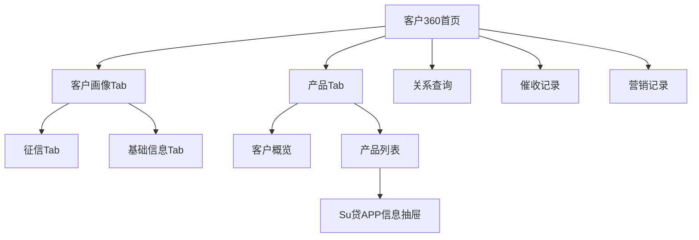

# 客户360功能优化需求文档

## 1. 产品概述

客户360功能优化旨在提升客户信息展示的完整性和易用性，通过重新设计页面结构和功能模块，为业务人员提供更全面、更直观的客户画像和产品信息视图。本次优化将删除冗余模块，新增征信Tab，优化产品功能展示，并增强催收记录和营销记录的管理能力。

## 2. 核心功能

### 2.1 用户角色
| 角色 | 登录方式 | 核心权限 |
|------|----------|----------|
| 业务人员 | 系统账号登录 | 查看客户基础信息、产品信息、征信报告 |
| 风控人员 | 系统账号登录 | 查看所有客户信息、历史切片数据、风险评估 |
| 管理人员 | 系统账号登录 | 查看所有功能、数据导出、系统配置 |

### 2.2 页面详情

| 页面名称 | 模块名称 | 功能描述 |
|----------|----------|----------|
| 客户360主页 | 客户画像Tab | 展示客户基础信息、风险评估、行为分析等核心画像数据 |
| 客户360主页 | 产品Tab | 展示客户的产品信息、授信情况、用信记录等产品相关数据 |
| 客户360主页 | 征信Tab | 展示客户征信报告，支持无报告、无权限、查得报告三种状态切换 |
| 客户360主页 | 催收Tab | 展示客户催收记录，包括催收活动、结果、统计信息和时间线 |
| 客户360主页 | 营销Tab | 展示客户营销记录，包括活动参与、效果统计、渠道分析等 |
| 历史切片查询页 | 数据查询模块 | 支持多种数据模型的历史版本查询、对比分析和数据导出 |
| 调额历史页 | 调额记录模块 | 展示客户额度调整历史，包括调整原因、过程和结果追踪 |
| 支付流程页 | 签约记录模块 | 管理客户签约记录，包括合同信息、签约方式和状态跟踪 |
| 支付流程页 | 放款记录模块 | 管理放款记录，包括放款渠道、到账信息和费用记录 |
| 支付流程页 | 还款记录模块 | 管理还款记录，包括还款方式、交易流水和本息分离 |
| 关系查询页 | 关系网络模块 | 展示客户关联关系网络，支持可视化展示和风险分析 |

### 2.3 页面结构调整

#### 2.1.1 删除页面顶部模块
- **删除模块**：客户信息、资产负债、授信情况三个顶部展示模块
- **调整原因**：信息冗余，与下方Tab内容重复
- **影响范围**：页面布局更简洁，减少信息重复展示

#### 2.1.2 默认显示调整
- **当前状态**：页面默认显示产品Tab
- **调整后**：页面默认显示客户画像Tab
- **业务价值**：优先展示客户基础信息，符合业务查询习惯

#### 2.1.3 Tab架构优化
- **一级Tab**：客户画像、产品
- **二级Tab**：
  - 客户画像：征信、基础信息
  - 产品：保持现有结构

### 2.2 客户画像Tab功能

#### 2.2.1 征信Tab新增

**功能状态管理**
- **无报告状态**：显示"暂无征信报告"提示
- **无权限状态**：显示"无权限查看征信报告"提示
- **查得报告状态**：显示完整征信信息

**征信报告状态字段**
```typescript
interface CreditReportStatus {
  reportStatus: 'none' | 'no_permission' | 'available' // 报告状态
  generateTime?: string // 生成时间
  validUntil?: string // 有效期
  queryTime?: string // 查询时间
  queryOrganization?: string // 查询机构
}
```

**征信基本信息字段**
```typescript
interface CreditBasicInfo {
  name: string // 姓名
  idNumber: string // 身份证号
  queryTime: string // 查询时间
  queryOrganization: string // 查询机构
}
```

**信贷记录摘要字段**
```typescript
interface CreditSummary {
  creditCardAccounts: number // 信用卡账户数
  loanAccounts: number // 贷款账户数
  overdueAccounts: number // 逾期账户数
  maxOverdueDays: number // 最长逾期天数
}
```

**查询记录字段**
```typescript
interface CreditQueryRecord {
  queryDate: string // 查询日期
  queryOrganization: string // 查询机构
  queryReason: string // 查询原因
  queryType: string // 查询类型
}
```

**异议信息字段**
```typescript
interface CreditDispute {
  disputeDate: string // 异议日期
  disputeReason: string // 异议原因
  disputeStatus: string // 处理状态
  disputeResult?: string // 处理结果
}
```

**Mock功能**
- 支持一键切换三种状态进行测试
- 提供Mock数据生成功能
- 支持状态持久化存储

#### 2.2.2 客户基础信息展示

**客户基本信息字段**
```typescript
interface CustomerBasicInfo {
  name: string // 姓名
  customerNumber: string // 客户号
  idNumber: string // 身份证号
  phoneNumber: string // 手机号
  age: number // 年龄
  gender: string // 性别
  domicile: string // 户籍
  idValidUntil: string // 身份证有效期
  userStatus: string // 用户状态
  totalCreditLimit: number // 自营总额度
  usedCreditLimit: number // 自营已用额度
}
```

### 2.3 产品Tab功能优化

#### 2.3.1 客户概览模块调整

**保留字段**
```typescript
interface CustomerOverview {
  maxHistoryOverdueDays: number // 历史最大逾期天数
  currentOverdueDays: number // 当前逾期天数
  currentTotalLoanBalance: number // 当前总在贷余额
  currentTotalCreditAmount: number // 当前总授信金额
}
```

**删除字段**
- 客户基本信息相关字段（已移至客户画像Tab）

#### 2.3.2 产品概览合并优化

**合并策略**
- 将原有产品概览信息整合到客户概览中
- 统一展示客户的产品使用情况
- 优化信息层级结构

#### 2.3.3 Su贷产品特殊功能

**APP信息查询抽屉**

**设备信息字段**
```typescript
interface DeviceInfo {
  deviceName: string // 设备名称
  deviceBrand: string // 设备品牌
  deviceModel?: string // 设备型号
  operatingSystem?: string // 操作系统
  osVersion?: string // 系统版本
}
```

**WIFI信息字段**
```typescript
interface WifiInfo {
  wifiName: string // WIFI名称
  bssid: string // BSSID
  signalStrength?: number // 信号强度
  frequency?: string // 频率
  security?: string // 安全类型
}
```

**位置信息字段**
```typescript
interface LocationInfo {
  longitude: number // 经度
  latitude: number // 纬度
  homeAddress: string // 家庭地址
  gpsAddress: string // GPS地址
  accuracy?: number // 定位精度
  timestamp?: string // 定位时间
}
```

**应用信息字段**
```typescript
interface AppInfo {
  appName: string // App名称
  version: string // 版本号
  firstInstallDate: string // 首次安装日期
  lastUpdateDate: string // 最近更新日期
  packageName?: string // 包名
  appSize?: number // 应用大小
}
```

**备注信息字段**
```typescript
interface RemarkInfo {
  name: string // 姓名
  phoneNumber: string // 号码
  relationship?: string // 关系
  remark?: string // 备注
}
```

**通讯录功能**
- 支持分页展示（每页20条）
- 支持搜索和筛选
- 支持导出功能
- 支持联系人详情查看

**APP信息功能**
- 支持分页展示（每页50条）
- 支持按类别筛选
- 支持按安装时间排序
- 支持应用详情查看

### 2.4 历史切片数据功能

#### 2.4.1 功能概述
历史切片数据功能提供客户数据的历史快照查询和对比分析能力，支持多种数据模型的时间点查询，帮助业务人员了解客户数据的变化趋势和历史状态。

#### 2.4.2 数据模型支持
```typescript
type DataModel = 
  | 'customer_basic' // 客户基础信息
  | 'product_info' // 产品信息
  | 'credit_records' // 授信记录
  | 'loan_records' // 用信记录
  | 'collection_records' // 催收记录
  | 'marketing_records' // 营销记录
```

#### 2.4.3 查询条件配置
```typescript
interface HistorySliceQuery {
  dataModel: DataModel // 数据模型
  queryDate: string // 查询日期
  timeRange?: string // 时间范围选择器
  queryDimension?: string // 查询维度
  dataType?: string // 数据类型
  version?: string // 版本选择
}
```

#### 2.4.4 查询结果展示
**多种视图模式**
- **表格视图**：传统表格展示，支持排序和筛选
- **时间线视图**：按时间轴展示数据变化
- **树形视图**：层级结构展示关联数据
- **卡片视图**：卡片形式展示关键信息

**结果数据结构**
```typescript
interface HistorySliceResult {
  sliceId: string // 切片ID
  queryTime: string // 查询时间
  dataModel: DataModel // 数据模型
  snapshotDate: string // 快照日期
  data: any[] // 查询结果数据
  totalCount: number // 总记录数
  metadata: {
    columns: ColumnConfig[] // 列配置
    summary: any // 汇总信息
  }
}
```

#### 2.4.5 切片对比功能
**多切片选择**
- 支持选择多个历史切片进行对比
- 最多支持5个切片同时对比
- 支持不同时间点的数据对比

**差异显示**
```typescript
interface SliceComparison {
  baseSlice: HistorySliceResult // 基准切片
  compareSlices: HistorySliceResult[] // 对比切片
  differences: {
    added: any[] // 新增数据
    modified: any[] // 修改数据
    deleted: any[] // 删除数据
    unchanged: any[] // 未变化数据
  }
  changeStatistics: {
    totalChanges: number // 总变化数
    addedCount: number // 新增数量
    modifiedCount: number // 修改数量
    deletedCount: number // 删除数量
  }
}
```

**变化高亮**
- 新增数据：绿色高亮
- 修改数据：黄色高亮
- 删除数据：红色高亮
- 字段级别变化标识

#### 2.4.6 数据筛选和搜索
**筛选条件**
- 按数据类型筛选
- 按关键字搜索
- 按变化类型筛选（新增/修改/删除）
- 按时间范围筛选
- 按字段值筛选

**搜索功能**
- 全文搜索支持
- 字段精确匹配
- 模糊查询支持
- 正则表达式搜索

#### 2.4.7 快速复制功能
**复制选项**
- 复制历史切片数据（CSV格式）
- 复制对比结果（包含差异标识）
- 复制变化摘要
- 复制选中数据
- 复制SQL查询语句

#### 2.4.8 导出功能
**Excel导出**
- 支持导出历史切片数据
- 支持导出对比结果
- 支持自定义导出字段
- 支持多Sheet导出

**PDF报告导出**
- 生成对比分析报告
- 包含图表和统计信息
- 支持自定义报告模板

#### 2.4.9 SQL预览功能
**SQL生成**
- 根据查询条件自动生成SQL语句
- 支持语法高亮显示
- 支持SQL语句复制
- 支持执行预览

**SQL优化**
- 查询性能优化建议
- 索引使用提示
- 执行计划展示

### 2.5 调额历史功能

#### 2.5.1 功能概述
调额历史功能记录和展示客户的额度调整历史，包括调整前后的额度、利率、期限等信息，帮助业务人员了解客户的额度变化轨迹。

#### 2.5.2 调额记录数据结构
```typescript
interface AdjustmentHistory {
  customerNo: string // 客户号
  productKey?: string // 产品标识
  productName?: string // 产品名称
  adjustDate: string // 调整日期
  beforeAmount: number // 调整前额度
  afterAmount: number // 调整后额度
  adjustReason: string // 调整原因
  beforeRate: number // 调整前利率
  afterRate: number // 调整后利率
  beforePeriod: number // 调整前期限
  afterPeriod: number // 调整后期限
  operator: string // 操作人
  result: string // 调整结果
  adjustType?: 'increase' | 'decrease' | 'maintain' // 调整类型
  adjustAmount?: number // 调整金额
  approvalStatus?: string // 审批状态
  remark?: string // 备注
}
```

#### 2.5.3 展示功能
**表格展示**
- 客户号、调整日期、调整前后额度对比
- 调整前后利率对比
- 调整前后期限对比
- 调整原因和操作人信息
- 调整结果状态

**数据格式化**
- 金额千分位格式化
- 利率百分比显示
- 期限单位标识（月）
- 日期标准格式化

**状态标识**
- 额度增加：绿色上升箭头
- 额度减少：红色下降箭头
- 额度不变：灰色横线

#### 2.5.4 调试信息
**组件调试**
- 支持调试信息输出
- 监听数据变化
- 组件生命周期跟踪
- 错误信息记录

### 2.6 关系查询功能

#### 2.6.1 功能概述
基于现有的关系图谱和关联关系功能，提供客户关系网络查询和可视化展示，支持多维度关系分析和风险评估。

#### 2.6.2 关系数据结构
```typescript
interface RelationshipData {
  relationId: string // 关系ID
  sourceTable: string // 源表
  targetTable: string // 目标表
  relationFields: RelationFieldPair[] // 关联字段
  relationType: string // 关系类型（1:1, 1:N, N:N）
  relationDescription: string // 关系描述
  relationStrength?: number // 关系强度
  discoveryDate?: string // 发现日期
  status?: string // 关系状态
  riskLevel?: string // 风险等级
}

interface RelationFieldPair {
  sourceField: string // 源字段
  targetField: string // 目标字段
}
```

#### 2.6.3 可视化展示
**关系树图**
- 基于ECharts的树形图展示
- 支持节点点击交互
- 支持缩放和平移操作
- 支持节点样式自定义

**网络图谱**
- 客户关系网络可视化
- 关系强度可视化
- 风险等级颜色标识
- 交互式节点操作

#### 2.6.4 关系分析
**关系类型分析**
- 一对一关系（1:1）
- 一对多关系（1:N）
- 多对多关系（N:N）

**关联强度评估**
- 基于关联字段数量
- 基于数据匹配度
- 基于业务规则权重

#### 2.6.5 表格展示功能
- 支持分页展示（每页20条）
- 支持多字段排序
- 支持关系类型筛选
- 支持目标表筛选
- 支持关系描述搜索
- 支持导出功能

### 2.7 支付流程记录功能

#### 2.7.1 功能概述
支付流程记录功能提供完整的客户支付流程跟踪，包括签约、放款、还款三个核心环节的详细记录和管理。

#### 2.7.2 签约记录管理
**签约记录数据结构**
```typescript
interface ContractRecord {
  contractId: string // 合同ID
  productKey: string // 产品标识
  signDate: string // 签约日期
  signMethod: string // 签约方式
  contractType: string // 合同类型
  contractStatus: string // 合同状态
  contractAmount: number // 合同金额
  contractTerm: number // 合同期限（月）
  signLocation: string // 签约地点
  documentUrl: string // 合同文件链接
  signatories: string[] // 签约人
  witnesses?: string[] // 见证人
  legalReview?: boolean // 法务审核
  riskAssessment?: string // 风险评估
}
```

**签约方式类型**
- 线上签约：电子签名、数字证书
- 线下签约：现场签约、邮寄签约
- 电子签约：第三方电子签约平台

**合同状态管理**
- 草稿：合同准备中
- 待签约：等待客户签约
- 已签约：签约完成
- 生效中：合同生效
- 已终止：合同终止
- 已到期：合同到期

#### 2.7.3 放款记录管理
**放款记录数据结构**
```typescript
interface DisbursementRecord {
  disbursementId: string // 放款ID
  productKey: string // 产品标识
  disbursementDate: string // 放款日期
  disbursementAmount: number // 放款金额
  disbursementChannel: string // 放款渠道
  receivingAccount: string // 收款账户
  disbursementStatus: string // 放款状态
  transactionId: string // 交易流水号
  arrivalTime: string // 到账时间
  handlingFee: number // 手续费
  exchangeRate?: number // 汇率（跨币种）
  approvalPerson: string // 审批人
  riskScore?: number // 风险评分
}
```

**放款渠道类型**
- 银行转账：直接银行转账
- 第三方支付：支付宝、微信等
- 现金：现金发放
- 支票：银行支票

**放款状态管理**
- 待审批：等待审批
- 审批通过：审批完成
- 放款中：正在放款
- 放款成功：放款完成
- 放款失败：放款失败
- 已撤销：放款撤销

#### 2.7.4 还款记录管理
**还款记录数据结构**
```typescript
interface RepaymentRecord {
  repaymentId: string // 还款ID
  productKey: string // 产品标识
  repaymentDate: string // 还款日期
  repaymentAmount: number // 还款金额
  repaymentMethod: string // 还款方式
  repaymentChannel: string // 还款渠道
  repaymentStatus: string // 还款状态
  paymentAccount: string // 付款账户
  transactionId: string // 交易流水号
  principalAmount: number // 本金金额
  interestAmount: number // 利息金额
  penaltyAmount: number // 罚息金额
  remainingBalance: number // 剩余余额
  period?: number // 还款期数
  dueDate?: string // 应还日期
  actualDate?: string // 实际还款日期
}
```

**还款方式类型**
- 自动扣款：银行卡自动扣款
- 主动还款：客户主动还款
- 线下还款：现金、转账等
- 代扣代缴：第三方代扣

**还款渠道类型**
- 银行卡：借记卡、信用卡
- 支付宝：支付宝账户
- 微信：微信支付
- 现金：现金还款
- 转账：银行转账

#### 2.7.5 本息分离计算
**本息分离逻辑**
```typescript
interface RepaymentBreakdown {
  totalAmount: number // 总还款金额
  principalAmount: number // 本金部分
  interestAmount: number // 利息部分
  penaltyAmount: number // 罚息部分
  feeAmount: number // 手续费部分
  taxAmount?: number // 税费部分
  calculationMethod: string // 计算方式
  calculationDate: string // 计算日期
}
```

#### 2.7.6 交易流水管理
**交易流水记录**
```typescript
interface TransactionFlow {
  transactionId: string // 交易流水号
  transactionType: string // 交易类型
  transactionDate: string // 交易日期
  amount: number // 交易金额
  currency: string // 币种
  fromAccount: string // 付款账户
  toAccount: string // 收款账户
  status: string // 交易状态
  channel: string // 交易渠道
  reference: string // 业务关联号
  description: string // 交易描述
  fee?: number // 手续费
  exchangeRate?: number // 汇率
}
```

#### 2.7.7 功能特性
**数据展示**
- 支持分页展示（每页20条）
- 支持多维度筛选
- 支持时间范围查询
- 支持状态筛选
- 支持金额范围筛选

**数据导出**
- 支持Excel导出
- 支持PDF报告生成
- 支持自定义导出字段
- 支持批量导出

**数据统计**
- 签约成功率统计
- 放款及时率统计
- 还款按时率统计
- 各渠道使用情况统计

### 2.8 征信功能优化

#### 2.8.1 功能概述
征信功能提供完整的客户征信信息查询和管理，支持三种状态切换（无报告、无权限、查得报告），并提供详细的征信报告展示和分析功能。

#### 2.8.2 征信状态管理
**状态类型定义**
```typescript
type CreditStatus = 
  | 'no_report' // 无报告
  | 'no_permission' // 无权限
  | 'available' // 查得报告
```

**状态切换功能**
- 支持开发环境下的状态切换调试
- 状态颜色标识：无报告（灰色）、无权限（橙色）、查得报告（绿色）
- 状态文本显示和图标展示

#### 2.8.3 征信报告基本信息
**基本信息展示**
```typescript
interface CreditBasicInfo {
  name: string // 姓名
  idCard: string // 身份证号
  queryTime: string // 查询时间
  queryOrg: string // 查询机构
  reportDate: string // 报告生成时间
  validUntil: string // 报告有效期
}
```

#### 2.8.4 信贷记录摘要
**摘要统计信息**
```typescript
interface CreditSummary {
  creditCardCount: number // 信用卡账户数
  loanCount: number // 贷款账户数
  overdueCount: number // 逾期账户数
  maxOverdueDays: number // 最长逾期天数
  totalCreditLimit: number // 总授信额度
  usedCredit: number // 已用额度
}
```

**展示特性**
- 使用统计卡片展示关键指标
- 支持数值格式化（千分位、后缀单位）
- 逾期信息警告标识

#### 2.8.5 查询记录管理
**查询记录数据结构**
```typescript
interface QueryRecord {
  date: string // 查询日期
  org: string // 查询机构
  reason: string // 查询原因
  type: string // 查询类型（机构查询/本人查询）
}
```

**查询记录展示**
- 表格形式展示查询历史
- 支持查询类型分类显示
- 查询原因详细说明

#### 2.8.6 异议信息管理
**异议记录数据结构**
```typescript
interface DisputeRecord {
  content: string // 异议内容
  date: string // 异议日期
  status?: string // 处理状态
  result?: string // 处理结果
}
```

**异议信息展示**
- 列表形式展示异议记录
- 空状态友好提示
- 异议处理状态跟踪

#### 2.8.7 征信记录详细信息
**征信记录数据结构**
```typescript
interface CreditReport {
  id: string // 记录ID
  source: string // 数据源
  queryDate: string // 查询日期
  creditScore: number // 信用评分
  creditLevel: string // 信用等级（AAA, AA, A, BBB等）
  queryReason: string // 查询原因
  queryInstitution: string // 查询机构
  creditCardAccounts: number // 信用卡账户数
  loanAccounts: number // 贷款账户数
  totalCreditLimit: number // 总授信额度
  usedCredit: number // 已用额度
  overdueCount: number // 逾期次数
  maxOverdueDays: number // 最长逾期天数
  currentOverdue: number // 当前逾期金额
  recentQueries: number // 近6个月查询次数
  loanQueries: number // 贷款审批查询次数
  creditCardQueries: number // 信用卡审批查询次数
  riskWarning?: string // 风险警告
}
```

**信用评分分级**
- 优秀（750+）：绿色标识
- 良好（650-749）：蓝色标识
- 一般（550-649）：橙色标识
- 较差（<550）：红色标识

**信用等级颜色映射**
- AAA/AA：绿色
- A：蓝色
- BBB/BB：橙色
- B及以下：红色

#### 2.8.8 征信功能特性
**数据展示**
- 支持多条征信记录展示
- 记录数量统计显示
- 支持数据刷新功能
- 空状态友好提示

**风险提示**
- 逾期信息警告标识
- 风险等级颜色区分
- 异常查询次数提醒

**交互功能**
- 支持征信记录详情查看
- 支持状态切换（开发环境）
- 支持数据导出功能

### 2.9 营销记录功能

#### 2.9.1 功能概述
营销记录功能提供完整的客户营销活动跟踪和分析，包括营销活动管理、效果统计、趋势分析等功能，帮助业务人员了解营销活动的执行情况和效果。

#### 2.9.2 营销记录数据结构
**营销活动记录**
```typescript
interface MarketingRecord {
  id: string // 活动ID
  campaignName: string // 活动名称
  campaignType: string // 活动类型
  status: string // 活动状态
  channel: string // 营销渠道
  startTime: string // 开始时间
  endTime: string // 结束时间
  responseRate: number // 响应率
  targetAmount: number // 目标金额
  actualAmount: number // 实际金额
  productKey?: string // 关联产品
}
```

**活动类型分类**
- 产品推广：蓝色标识
- 交叉销售：绿色标识
- 新产品：橙色标识
- 客户关怀：紫色标识

**活动状态管理**
- 成功：绿色标识
- 失败：红色标识
- 进行中：橙色标识

#### 2.9.3 营销渠道支持
**渠道类型**
- 短信：短信图标
- 邮件：邮件图标
- 电话：电话图标
- APP推送：通知图标

**渠道效果分析**
- 各渠道响应率对比
- 渠道成本效益分析
- 渠道偏好统计

#### 2.9.4 概览统计功能
**统计卡片展示**
```typescript
interface MarketingOverview {
  successfulCampaigns: number // 成功营销数量
  pendingCampaigns: number // 进行中数量
  failedCampaigns: number // 失败营销数量
  successRate: number // 总体成功率
}
```

**统计卡片设计**
- 成功营销：绿色图标（对勾圆圈）
- 进行中：橙色图标（时钟圆圈）
- 失败营销：红色图标（关闭圆圈）
- 成功率：蓝色图标（柱状图）

#### 2.9.5 筛选和搜索功能
**筛选条件**
- 活动名称搜索：支持模糊匹配
- 状态筛选：成功/失败/进行中
- 渠道筛选：短信/邮件/电话/APP推送
- 时间范围筛选：支持日期范围选择

**搜索特性**
- 实时搜索支持
- 多条件组合筛选
- 筛选结果分页显示
- 筛选条件重置功能

#### 2.9.6 营销记录表格
**表格列定义**
- 活动名称：150px宽度
- 活动类型：100px宽度，标签显示
- 状态：80px宽度，彩色标签
- 渠道：100px宽度，图标+文字
- 开始时间：120px宽度
- 结束时间：120px宽度
- 响应率：120px宽度，进度条+百分比
- 操作：140px宽度，查看详情/效果分析

**响应率可视化**
- 进度条颜色：70%+绿色，40-69%橙色，<40%红色
- 百分比数值显示
- 响应率排序支持

#### 2.9.7 营销趋势分析
**时间维度选择**
- 近7天：短期趋势分析
- 近30天：月度趋势分析
- 近90天：季度趋势分析

**图表展示**
- 营销活动数量趋势
- 成功率变化趋势
- 渠道效果对比
- 活动类型分布

#### 2.9.8 数据管理功能
**数据操作**
- 刷新数据：重新加载营销记录
- 导出记录：Excel格式导出
- 查看详情：营销活动详细信息
- 效果分析：营销效果深度分析

**分页功能**
- 每页10条记录
- 支持页码跳转
- 总记录数显示
- 分页状态保持

#### 2.9.9 触达记录和权益记录
**数据来源**
- 优先使用传入的过滤数据（marketingData）
- 从用户信息中获取并按产品过滤
- 使用默认模拟数据作为后备

**记录合并**
- 触达记录（touchRecords）
- 权益记录（benefitRecords）
- 按产品标识过滤
- 统一展示格式

### 2.10 催收记录优化

#### 2.5.1 详情展示增强

**催收记录基础字段**
```typescript
interface CollectionRecord {
  id: string // 记录ID
  customerId: string // 客户ID
  collectionDate: string // 催收日期
  collectionType: string // 催收类型
  collectorName: string // 催收员姓名
  contactResult: string // 联系结果
  promiseAmount: number // 承诺还款金额
  promiseDate?: string // 承诺还款日期
  actualPayment: number // 实际还款金额
  paymentDate?: string // 实际还款日期
  overdueAmount: number // 逾期金额
  overdueDays: number // 逾期天数
  collectionStage: string // 催收阶段
  remark: string // 备注
  status: string // 催收状态
  difficulty: string // 催收难度
  tags: string[] // 标签
}
```

**催收统计信息**
```typescript
interface CollectionSummary {
  totalRecords: number // 总催收记录数
  successRate: number // 催收成功率
  totalPromiseAmount: number // 总承诺金额
  totalActualPayment: number // 总实际还款
  averageCollectionDays: number // 平均催收天数
  difficultyDistribution: {
    easy: number // 容易
    medium: number // 中等
    hard: number // 困难
  }
  stageDistribution: {
    M1: number // M1阶段
    M2: number // M2阶段
    M3: number // M3阶段
  }
  typeDistribution: {
    phone: number // 电话催收
    sms: number // 短信催收
    visit: number // 上门催收
  }
}
```

#### 2.5.2 标签系统

**标签分类**
```typescript
interface CollectionTag {
  tag: string // 标签名称
  count: number // 使用次数
  type: 'positive' | 'negative' | 'neutral' | 'method' | 'complaint' // 标签类型
}

interface CollectionTags {
  difficultyTags: CollectionTag[] // 难易度标签
  collectionTags: CollectionTag[] // 催收方法标签
  complaintTags: CollectionTag[] // 投诉类标签
}
```

**标签示例**
- 难易度标签：配合度高、还款意愿强、联系困难、逃避还款
- 催收方法标签：电话催收有效、短信提醒、需要上门
- 投诉类标签：投诉催收方式、投诉催收时间、投诉催收态度

#### 2.5.3 功能增强
- 支持催收记录时间线展示
- 支持催收效果统计分析
- 支持催收策略推荐
- 支持批量操作功能
- 支持催收记录导出

### 2.6 营销记录功能

#### 2.6.1 功能概述
营销记录模块用于展示客户的营销活动参与情况和效果，支持多维度的数据分析和管理。

#### 2.6.2 数据结构
- **营销活动记录**：活动ID、活动名称、活动类型、参与时间、活动状态
- **触达记录**：触达方式、触达时间、触达状态、响应情况
- **权益记录**：权益类型、权益内容、获得时间、使用状态、有效期
- **效果统计**：点击率、转化率、参与度、收益情况

#### 2.6.3 渠道支持
- **线上渠道**：APP推送、短信、邮件、微信
- **线下渠道**：电话营销、网点活动、上门服务
- **第三方渠道**：合作伙伴、代理商、联盟营销

#### 2.6.4 概览统计
- **参与活动总数**：客户参与的营销活动总数量
- **成功转化数**：成功转化为业务的活动数量
- **平均响应时间**：客户对营销活动的平均响应时间
- **偏好渠道分析**：客户偏好的营销渠道统计

#### 2.6.5 筛选搜索
- **按活动类型筛选**：产品推广、优惠活动、会员活动等
- **按时间范围筛选**：支持自定义时间范围查询
- **按渠道筛选**：按不同营销渠道进行筛选
- **按状态筛选**：进行中、已结束、已取消等状态
- **关键词搜索**：支持活动名称、内容关键词搜索

#### 2.6.6 表格展示
- **活动信息**：活动名称、类型、开始时间、结束时间、状态
- **参与情况**：参与时间、参与方式、响应状态、转化结果
- **权益详情**：权益类型、权益内容、获得时间、使用情况
- **效果数据**：点击次数、转化次数、收益金额

#### 2.6.7 趋势分析
- **参与趋势图**：展示客户营销活动参与的时间趋势
- **转化率趋势**：展示不同时期的营销转化率变化
- **渠道效果对比**：对比不同营销渠道的效果
- **ROI分析**：营销投入产出比分析

#### 2.6.8 数据管理
- **数据导出**：支持Excel格式导出营销记录数据
- **数据刷新**：支持手动刷新最新营销数据
- **数据同步**：与营销系统实时同步数据
- **历史归档**：长期营销记录的归档管理

#### 2.6.9 触达和权益记录
- **触达记录管理**：记录每次营销触达的详细信息
- **权益发放记录**：记录客户获得的各类权益
- **使用轨迹跟踪**：跟踪权益的使用情况和轨迹
- **到期提醒**：权益到期前的提醒功能

### 2.7 历史切片数据功能

#### 2.7.1 功能概述
历史切片数据功能提供客户数据的历史版本查询和对比分析，支持多维度的数据回溯和变更追踪。

#### 2.7.2 数据模型支持
- **客户基础信息**：个人信息、联系方式、身份信息的历史变更
- **产品信息**：产品状态、额度、利率等产品相关信息的历史记录
- **授信记录**：授信额度、授信状态、风险等级的历史变化
- **用信记录**：借款记录、还款记录、逾期记录的历史数据
- **催收记录**：催收活动、催收结果、催收状态的历史追踪
- **营销记录**：营销活动、客户响应、转化效果的历史数据

#### 2.7.3 查询条件设置
- **日期选择**：支持按日期范围查询历史切片
- **版本选择**：支持按数据版本号查询特定版本
- **查询维度**：支持按客户、产品、业务类型等维度查询
- **数据类型**：支持选择特定数据类型进行查询

#### 2.7.4 查询结果展示
- **表格视图**：以表格形式展示历史切片数据，支持排序和筛选
- **时间线视图**：按时间轴展示数据变更历史
- **树形视图**：按层级结构展示数据关系
- **卡片视图**：以卡片形式展示关键数据变更

#### 2.7.5 切片对比功能
- **多切片选择**：支持选择多个历史切片进行对比
- **差异显示**：高亮显示不同切片间的数据差异
- **变化统计**：统计数据变更的数量和类型
- **变更轨迹**：展示数据从一个状态到另一个状态的变更轨迹

#### 2.7.6 数据筛选和搜索
- **按数据类型筛选**：筛选特定类型的历史数据
- **关键字搜索**：支持在历史数据中进行关键字搜索
- **变化类型筛选**：按新增、修改、删除等变化类型筛选
- **操作员筛选**：按数据操作员进行筛选
- **时间范围筛选**：按具体时间范围筛选数据

#### 2.7.7 快速复制和导出
- **单行复制**：支持复制单行数据到剪贴板
- **批量复制**：支持选中多行数据进行批量复制
- **CSV格式导出**：将查询结果导出为CSV格式
- **Excel导出**：将历史数据导出为Excel文件
- **PDF报告**：生成历史数据分析PDF报告

#### 2.7.8 SQL预览功能
- **查询语句生成**：根据查询条件自动生成SQL语句
- **语句预览**：在执行前预览生成的SQL语句
- **语句优化建议**：提供SQL语句优化建议
- **执行计划**：显示查询的执行计划和性能信息

### 2.8 调额历史功能

#### 2.8.1 功能概述
调额历史功能用于记录和展示客户额度调整的完整历史，包括调额原因、调整过程和结果追踪。

#### 2.8.2 调额记录展示
- **客户信息**：客户号、客户姓名、产品信息
- **调整时间**：调额申请时间、审批时间、生效时间
- **额度变化**：调整前额度、调整后额度、调整金额、调整幅度
- **利率变化**：调整前利率、调整后利率、利率变化幅度
- **期限变化**：调整前期限、调整后期限、期限变化

#### 2.8.3 调整原因和操作记录
- **调整原因**：系统调整、人工调整、风险调整、客户申请
- **操作人员**：记录执行调额操作的人员信息
- **审批流程**：记录调额审批的完整流程和节点
- **备注信息**：调额相关的补充说明和备注

#### 2.8.4 调整结果状态
- **成功状态**：调额成功、额度生效、系统更新完成
- **失败状态**：调额失败、审批拒绝、系统异常
- **处理中状态**：审批中、系统处理中、等待确认
- **结果详情**：详细的调额结果说明和影响分析

#### 2.8.5 数据筛选和搜索
- **按调整类型筛选**：提额、降额、冻结、解冻
- **按时间范围筛选**：支持自定义时间范围查询
- **按操作人筛选**：按具体操作人员进行筛选
- **按结果状态筛选**：成功、失败、处理中等状态筛选
- **关键词搜索**：支持客户号、产品名称等关键词搜索

#### 2.8.6 统计分析功能
- **调额趋势分析**：展示调额的时间趋势和规律
- **调额成功率**：统计不同类型调额的成功率
- **平均调额幅度**：分析平均调额金额和幅度
- **风险影响评估**：调额对风险指标的影响分析

### 2.9 支付流程记录功能

#### 2.9.1 功能概述
支付流程记录功能提供完整的客户支付相关业务流程记录，包括签约、放款、还款等各个环节的详细信息。

#### 2.9.2 签约记录管理
- **合同信息**：合同ID、合同类型、签约方式、合同状态
- **签约详情**：签约日期、签约地点、合同金额、合同期限
- **文档管理**：合同文件链接、电子签名、文档版本控制
- **状态跟踪**：有效、失效、终止等合同状态变化

#### 2.9.3 放款记录管理
- **放款基础信息**：放款ID、借据号、产品名称、放款金额
- **放款渠道**：银行转账、第三方支付、现金等放款方式
- **到账信息**：收款账户、收款银行、到账时间、处理时长
- **费用信息**：手续费、服务费等相关费用记录
- **放款状态**：成功、失败、处理中、待处理等状态

#### 2.9.4 还款记录管理
- **还款基础信息**：还款ID、期数、还款日期、还款金额
- **还款方式**：主动还款、自动扣款、线下还款等方式
- **交易流水**：交易ID、支付渠道、交易状态、交易时间
- **本息分离**：本金金额、利息金额、罚息金额、费用金额
- **账户信息**：还款账户、余额变化、账户状态

#### 2.9.5 流程状态跟踪
- **流程节点**：申请、审批、放款、还款等关键节点
- **状态变更**：记录每个节点的状态变更和时间
- **操作记录**：记录每个操作的执行人和操作时间
- **异常处理**：记录流程中的异常情况和处理结果

#### 2.9.6 数据查询和筛选
- **按流程类型筛选**：签约、放款、还款等不同流程类型
- **按状态筛选**：成功、失败、处理中等状态筛选
- **按时间范围筛选**：支持自定义时间范围查询
- **按金额范围筛选**：支持按金额区间进行筛选
- **关键词搜索**：支持合同号、交易ID等关键词搜索

#### 2.9.7 统计分析功能
- **成功率统计**：各类支付流程的成功率统计
- **处理时长分析**：平均处理时长和效率分析
- **渠道效果对比**：不同支付渠道的效果对比
- **异常分析**：支付流程异常的原因分析和趋势

### 2.10 关系查询功能

#### 2.10.1 功能概述
关系查询功能基于客户关系网络，提供客户关联关系的查询和可视化展示，支持风险传导分析。

#### 2.10.2 关系网络查询
- **直接关系**：配偶、亲属、同事等直接关联关系
- **间接关系**：通过中间节点连接的间接关系
- **业务关系**：共同担保、联合借款等业务关联
- **设备关系**：共用设备、IP地址等技术关联

#### 2.10.3 关系可视化展示
- **网络图谱**：以图形方式展示客户关系网络
- **关系强度**：通过线条粗细表示关系强度
- **节点信息**：显示关联客户的基本信息和风险状态
- **交互操作**：支持节点点击、缩放、拖拽等交互

#### 2.10.4 关系分析功能
- **风险传导分析**：分析风险在关系网络中的传导路径
- **关系强度评估**：评估不同关系的强度和重要性
- **异常关系识别**：识别可疑的异常关联关系
- **关系变化追踪**：跟踪关系网络的变化和演进

#### 2.10.5 查询条件设置
- **关系类型筛选**：按不同关系类型进行筛选
- **关系层级设置**：设置查询的关系层级深度
- **风险等级筛选**：按关联客户的风险等级筛选
- **时间范围限制**：限制关系建立的时间范围

#### 2.10.6 数据导出功能
- **关系列表导出**：将关系数据导出为表格格式
- **网络图导出**：导出关系网络图为图片格式
- **分析报告生成**：生成关系分析的详细报告
- **风险评估报告**：生成基于关系的风险评估报告

## 3. 核心流程

### 3.1 用户访问流程
1. 用户进入客户360页面
2. 系统默认显示客户画像Tab
3. 用户可切换到征信或基础信息子Tab
4. 用户可切换到产品Tab查看产品相关信息
5. 用户可访问关系查询、催收记录、营销记录等功能模块

### 3.2 征信查询流程
1. 用户点击征信Tab
2. 系统检查征信权限和报告状态
3. 根据状态显示对应内容：
   - 无报告：显示提示信息
   - 无权限：显示权限申请入口
   - 有报告：展示完整征信信息
4. 支持Mock状态切换测试

### 3.3 Su贷APP信息查询流程
1. 用户在Su贷产品行点击APP信息按钮
2. 系统打开APP信息抽屉
3. 展示设备信息、WIFI信息、位置信息等
4. 用户可切换到通讯录Tab查看联系人
5. 支持分页浏览和搜索功能



## 4. 用户界面设计

### 4.1 设计风格
- **主色调**：#1890ff（蓝色主题）
- **辅助色**：#52c41a（成功绿）、#faad14（警告黄）、#f5222d（错误红）
- **按钮样式**：圆角按钮，主要按钮使用主色调
- **字体**：14px 常规字体，16px 标题字体
- **布局风格**：卡片式布局，清晰的层级结构
- **图标风格**：线性图标，统一的视觉语言

### 4.2 页面设计概览

| 页面名称 | 模块名称 | UI元素 |
|----------|----------|--------|
| 客户画像Tab | 征信状态 | 状态标签、Mock切换按钮、信息卡片 |
| 客户画像Tab | 征信详情 | 描述列表、数据表格、时间线组件 |
| 客户画像Tab | 基础信息 | 信息卡片、标签组件、统计数字 |
| 产品Tab | 客户概览 | 统计卡片、进度条、数据展示 |
| 产品Tab | 产品列表 | 数据表格、操作按钮、状态标签 |
| APP信息抽屉 | 设备信息 | 描述列表、信息卡片 |
| APP信息抽屉 | 通讯录 | 数据表格、分页组件、搜索框 |
| 关系查询 | 关系网络 | 数据表格、筛选器、可视化图表 |
| 催收记录 | 记录列表 | 数据表格、标签组件、时间线 |
| 催收记录 | 统计信息 | 统计卡片、图表组件、进度条 |
| 营销记录 | 概览统计 | 统计卡片、百分比显示 |
| 营销记录 | 记录表格 | 数据表格、筛选工具栏、分页 |

### 4.3 响应式设计
- **桌面优先**：主要针对桌面端设计
- **移动适配**：支持平板和手机端访问
- **触摸优化**：按钮和交互元素适配触摸操作

## 5. 技术实现要点

### 5.1 数据结构设计

#### 5.1.1 状态管理
```typescript
// 客户360状态管理
interface Customer360State {
  activeTab: 'profile' | 'product' // 当前激活的一级Tab
  profileActiveTab: 'credit' | 'basic' // 客户画像子Tab
  creditReportStatus: CreditReportStatus // 征信报告状态
  customerData: CustomerData // 客户数据
  productData: ProductData[] // 产品数据
  relationshipData: RelationshipData[] // 关系数据
  collectionData: CollectionRecord[] // 催收数据
  marketingData: MarketingRecord[] // 营销数据
  loading: {
    customer: boolean
    credit: boolean
    product: boolean
    relationship: boolean
    collection: boolean
    marketing: boolean
  }
}
```

#### 5.1.2 API响应数据结构
```typescript
// 统一API响应格式
interface ApiResponse<T> {
  code: number
  message: string
  data: T
  timestamp: number
}

// 分页响应格式
interface PaginatedResponse<T> {
  items: T[]
  total: number
  page: number
  pageSize: number
  totalPages: number
}
```

### 5.2 组件架构

#### 5.2.1 组件层级结构
```
Customer360Page
├── Customer360Tabs
│   ├── CustomerProfileTab
│   │   ├── CreditReportTab
│   │   └── BasicInfoTab
│   └── ProductTab
│       ├── CustomerOverview
│       └── ProductList
│           └── SuLoanAppDrawer
├── RelationshipQuery
├── CollectionRecords
│   ├── CollectionSummary
│   ├── CollectionTable
│   └── CollectionTimeline
└── MarketingRecords
    ├── MarketingSummary
    └── MarketingTable
```

#### 5.2.2 核心组件设计

**Customer360Tabs组件**
```vue
<template>
  <a-tabs v-model:activeKey="activeTab" @change="handleTabChange">
    <a-tab-pane key="profile" tab="客户画像">
      <CustomerProfileTab :userId="userId" />
    </a-tab-pane>
    <a-tab-pane key="product" tab="产品">
      <ProductTab :userId="userId" />
    </a-tab-pane>
  </a-tabs>
</template>
```

**CreditReportTab组件**
```vue
<template>
  <div class="credit-report-tab">
    <!-- Mock状态切换 -->
    <div class="mock-controls" v-if="isDevelopment">
      <a-radio-group v-model:value="mockStatus">
        <a-radio-button value="none">无报告</a-radio-button>
        <a-radio-button value="no_permission">无权限</a-radio-button>
        <a-radio-button value="available">查得报告</a-radio-button>
      </a-radio-group>
    </div>
    
    <!-- 状态展示 -->
    <CreditStatusCard :status="creditStatus" />
    
    <!-- 征信详情 -->
    <CreditDetailCard 
      v-if="creditStatus.reportStatus === 'available'"
      :creditData="creditData" 
    />
  </div>
</template>
```

### 5.3 API接口设计

#### 5.3.1 征信相关接口
```typescript
// 获取征信报告状态
GET /api/customer/{customerId}/credit/status
Response: ApiResponse<CreditReportStatus>

// 获取征信报告详情
GET /api/customer/{customerId}/credit/report
Response: ApiResponse<CreditReportData>

// 更新征信Mock状态
POST /api/customer/{customerId}/credit/mock
Request: { status: 'none' | 'no_permission' | 'available' }
Response: ApiResponse<void>
```

#### 5.3.2 关系查询接口
```typescript
// 获取客户关系数据
GET /api/customer/{customerId}/relationships
Query: {
  page?: number
  pageSize?: number
  relationshipType?: string
  riskLevel?: string
  sortBy?: string
  sortOrder?: 'asc' | 'desc'
}
Response: ApiResponse<PaginatedResponse<RelationshipData>>
```

#### 5.3.3 催收记录接口
```typescript
// 获取催收记录
GET /api/customer/{customerId}/collection/records
Query: {
  page?: number
  pageSize?: number
  startDate?: string
  endDate?: string
  status?: string
  collectionType?: string
}
Response: ApiResponse<PaginatedResponse<CollectionRecord>>

// 获取催收统计
GET /api/customer/{customerId}/collection/summary
Response: ApiResponse<CollectionSummary>

// 获取催收标签
GET /api/customer/{customerId}/collection/tags
Response: ApiResponse<CollectionTags>
```

#### 5.3.4 营销记录接口
```typescript
// 获取营销记录
GET /api/customer/{customerId}/marketing/records
Query: {
  page?: number
  pageSize?: number
  status?: string
  channel?: string
  startDate?: string
  endDate?: string
}
Response: ApiResponse<PaginatedResponse<MarketingRecord>>

// 获取营销统计
GET /api/customer/{customerId}/marketing/summary
Response: ApiResponse<MarketingSummary>
```

#### 5.3.5 Su贷APP信息接口
```typescript
// 获取APP信息
GET /api/customer/{customerId}/suloan/app-info
Query: {
  page?: number
  pageSize?: number
  category?: string
}
Response: ApiResponse<PaginatedResponse<AppInfo>>

// 获取通讯录
GET /api/customer/{customerId}/suloan/contacts
Query: {
  page?: number
  pageSize?: number
  search?: string
}
Response: ApiResponse<PaginatedResponse<ContactInfo>>
```

### 5.4 状态管理

#### 5.4.1 Pinia Store设计
```typescript
// customer360Store.ts
export const useCustomer360Store = defineStore('customer360', {
  state: (): Customer360State => ({
    activeTab: 'profile',
    profileActiveTab: 'credit',
    creditReportStatus: {
      reportStatus: 'none',
      generateTime: undefined,
      validUntil: undefined
    },
    customerData: null,
    productData: [],
    relationshipData: [],
    collectionData: [],
    marketingData: [],
    loading: {
      customer: false,
      credit: false,
      product: false,
      relationship: false,
      collection: false,
      marketing: false
    }
  }),
  
  actions: {
    async fetchCustomerData(customerId: string) {
      this.loading.customer = true
      try {
        const response = await customerApi.getCustomerData(customerId)
        this.customerData = response.data
      } finally {
        this.loading.customer = false
      }
    },
    
    async fetchCreditReport(customerId: string) {
      this.loading.credit = true
      try {
        const statusResponse = await creditApi.getCreditStatus(customerId)
        this.creditReportStatus = statusResponse.data
        
        if (statusResponse.data.reportStatus === 'available') {
          const reportResponse = await creditApi.getCreditReport(customerId)
          this.creditData = reportResponse.data
        }
      } finally {
        this.loading.credit = false
      }
    },
    
    async updateCreditMockStatus(customerId: string, status: string) {
      await creditApi.updateMockStatus(customerId, { status })
      this.creditReportStatus.reportStatus = status
    }
  }
})
```

### 5.5 工具函数

#### 5.5.1 数据格式化
```typescript
// formatters.ts
export const formatCurrency = (amount: number): string => {
  return new Intl.NumberFormat('zh-CN', {
    style: 'currency',
    currency: 'CNY'
  }).format(amount)
}

export const formatDate = (date: string): string => {
  return new Date(date).toLocaleDateString('zh-CN')
}

export const formatPercentage = (value: number): string => {
  return `${(value * 100).toFixed(1)}%`
}
```

#### 5.5.2 状态映射
```typescript
// statusMappings.ts
export const creditStatusMap = {
  none: { text: '暂无征信报告', color: 'default' },
  no_permission: { text: '无权限查看', color: 'warning' },
  available: { text: '报告可用', color: 'success' }
}

export const collectionDifficultyMap = {
  easy: { text: '容易', color: 'green' },
  medium: { text: '中等', color: 'orange' },
  hard: { text: '困难', color: 'red' }
}
```

## 6. 用户体验优化

### 6.1 加载状态优化
- 使用骨架屏提升加载体验
- 分模块异步加载，避免阻塞
- 提供加载进度指示

### 6.2 交互优化
- Tab切换无偏移，保持页面稳定
- 表格支持虚拟滚动，提升大数据展示性能
- 抽屉组件支持拖拽调整大小

### 6.3 错误处理
- 统一错误提示机制
- 网络错误重试功能
- 数据异常降级展示

## 7. 性能优化

### 7.1 组件优化
- 使用Vue 3 Composition API提升性能
- 合理使用computed和watch
- 组件懒加载和代码分割

### 7.2 数据优化
- 实现数据缓存机制
- 分页加载大数据集
- 防抖搜索和筛选

### 7.3 渲染优化
- 虚拟列表处理大量数据
- 图片懒加载
- 合理使用v-show和v-if

## 8. 测试策略

### 8.1 单元测试
- 组件功能测试
- 工具函数测试
- Store状态管理测试

### 8.2 集成测试
- API接口集成测试
- 组件交互测试
- 数据流测试

### 8.3 端到端测试
- 用户操作流程测试
- 跨浏览器兼容性测试
- 性能基准测试

### 8.4 测试用例示例
```typescript
// 征信Tab测试用例
describe('CreditReportTab', () => {
  it('应该根据状态显示正确的内容', async () => {
    const wrapper = mount(CreditReportTab, {
      props: { userId: '123' }
    })
    
    // 测试无报告状态
    await wrapper.vm.updateMockStatus('none')
    expect(wrapper.text()).toContain('暂无征信报告')
    
    // 测试有报告状态
    await wrapper.vm.updateMockStatus('available')
    expect(wrapper.find('.credit-detail').exists()).toBe(true)
  })
})
```

## 9. 部署和维护

### 9.1 部署要求
- Node.js 16+
- Vue 3 + Vite构建
- 支持Docker容器化部署

### 9.2 监控和日志
- 前端错误监控
- 性能指标收集
- 用户行为分析

### 9.3 版本管理
- 语义化版本控制
- 渐进式功能发布
- 回滚机制支持