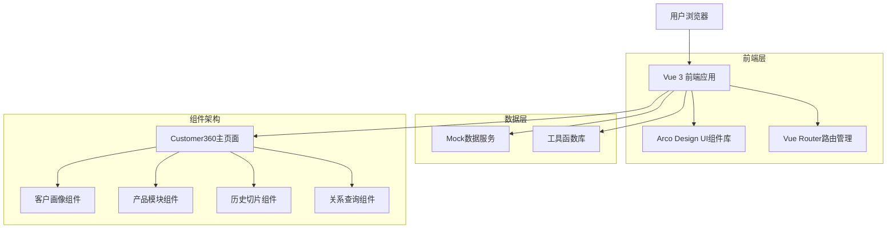
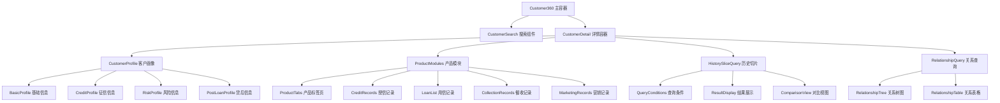

# 客户360技术架构文档

## 1. 架构设计



## 2. 技术描述

- 前端：Vue@3 + TypeScript + Arco Design + Vite
- 路由：Vue Router@4
- 状态管理：Vue 3 Composition API
- UI组件库：Arco Design Vue
- 构建工具：Vite
- 测试框架：Vitest + Vue Test Utils
- 数据模拟：Mock数据服务

## 3. 路由定义

| 路由 | 用途 |
|------|------|
| /discovery/customer360 | 客户360主页面，用户ID搜索入口 |
| /discovery/customer360/:userId | 客户详情页面，展示完整的客户360信息 |
| /discovery/customer360/history | 历史切片数据查询页面 |
| /discovery/customer360/relationship | 关系查询页面 |

## 4. 组件架构设计

### 4.1 核心组件层次结构



### 4.2 组件通信机制

**Props传递**
- 父组件向子组件传递数据和配置
- 支持响应式数据更新
- 类型安全的TypeScript接口定义

**事件发射**
- 子组件通过emit向父组件发送事件
- 支持调试信息收集
- 数据刷新和状态同步

**组合式API**
- 使用Composition API管理组件状态
- 响应式数据和计算属性
- 生命周期钩子管理

## 5. 数据模型定义

### 5.1 核心数据接口

**用户数据接口**
```typescript
interface UserData {
  userId: string
  name: string
  idCard: string
  phone: string
  email: string
  address: string
  // 客户画像数据
  userProfile: UserProfile
  // 产品数据
  products: ProductInfo[]
  // 授信记录
  creditsList: CreditRecord[]
  // 用信记录
  loanRecords: LoanRecord[]
  // 催收记录
  collectionRecords: CollectionRecord[]
  // 营销记录
  marketingRecords: MarketingRecord[]
  // 征信记录
  creditReports: CreditReport[]
  // 额度调整历史
  quotaAdjustHistory: AdjustmentHistory[]
}
```

**客户画像接口**
```typescript
interface UserProfile {
  // 基础信息
  basicInfo: BasicInfo
  // 征信信息
  creditInfo: CreditInfo
  // 风险信息
  riskInfo: RiskInfo
  // 设备信息
  deviceInfo: DeviceInfo
  // 位置信息
  locationInfo: LocationInfo
  // 应用信息
  appInfo: AppInfo
  // 营销偏好
  marketingPreference: MarketingPreference
}
```

**产品信息接口**
```typescript
interface ProductInfo {
  productKey: string
  productName: string
  productType: string
  status: string
  creditLimit: number
  usedAmount: number
  interestRate: number
  term: number
  // 特殊功能标识
  hasAppInfo?: boolean
  hasContactInfo?: boolean
}
```

### 5.2 历史切片数据模型

```typescript
interface HistorySliceQuery {
  dataModel: DataModel
  queryDate: string
  timeRange?: string
  queryDimension?: string
  dataType?: string
  version?: string
}

interface HistorySliceResult {
  sliceId: string
  queryTime: string
  dataModel: DataModel
  snapshotDate: string
  data: any[]
  totalCount: number
  metadata: {
    columns: ColumnConfig[]
    summary: any
  }
}
```

### 5.3 关系查询数据模型

```typescript
interface RelationshipData {
  relationId: string
  sourceTable: string
  targetTable: string
  relationFields: RelationFieldPair[]
  relationType: string
  relationDescription: string
  relationStrength?: number
  discoveryDate?: string
  status?: string
  riskLevel?: string
}
```

## 6. 服务层设计

### 6.1 数据服务

**Mock数据服务**
```typescript
// customer360.ts
export const mockUserData: UserData = {
  // 完整的用户数据模拟
}

export const getUserInfo = (userId: string): Promise<UserData> => {
  // 模拟API调用
}

export const getProductInfo = (productKey: string): Promise<ProductInfo> => {
  // 模拟产品信息获取
}
```

**API服务接口**
```typescript
interface ApiService {
  // 用户信息
  getUserInfo(userId: string): Promise<UserData>
  // 产品信息
  getProductInfo(productKey: string): Promise<ProductInfo>
  // 历史切片查询
  queryHistorySlice(query: HistorySliceQuery): Promise<HistorySliceResult>
  // 关系查询
  queryRelationships(params: RelationshipQueryParams): Promise<RelationshipData[]>
  // 征信查询
  getCreditReports(userId: string): Promise<CreditReport[]>
}
```

### 6.2 工具函数库

**格式化工具**
```typescript
// formatUtils.ts
export const formatAmount = (amount: number): string => {
  // 金额格式化（千分位）
}

export const formatDate = (date: string): string => {
  // 日期格式化
}

export const formatPercent = (value: number): string => {
  // 百分比格式化
}
```

**复制工具**
```typescript
// copyUtils.ts
export const copyToClipboard = (text: string): Promise<void> => {
  // 复制到剪贴板
}

export const copyTableData = (data: any[], format: 'csv' | 'json'): Promise<void> => {
  // 表格数据复制
}
```

## 7. 状态管理

### 7.1 组件状态管理

**响应式状态**
```typescript
// 使用Vue 3 Composition API
const userInfo = ref<UserData | null>(null)
const loading = ref(false)
const error = ref<string | null>(null)

// 计算属性
const hasProducts = computed(() => {
  return userInfo.value?.products?.length > 0
})

// 监听器
watch(userInfo, (newValue) => {
  // 数据变化处理
}, { deep: true })
```

**状态同步**
```typescript
// 父子组件状态同步
const emit = defineEmits<{
  'update:loading': [boolean]
  'data-change': [any]
  'debug-info': [any]
}>()

// 发射状态变化
emit('update:loading', true)
emit('data-change', newData)
```

### 7.2 全局状态管理

**用户会话状态**
```typescript
// 当前用户信息
const currentUser = ref<UserData | null>(null)
// 搜索历史
const searchHistory = ref<string[]>([])
// 应用配置
const appConfig = ref<AppConfig>({})
```

## 8. 测试架构

### 8.1 单元测试

**组件测试**
```typescript
// Customer360.integration.test.ts
describe('Customer360 Integration Tests', () => {
  test('should render customer profile correctly', async () => {
    // 组件渲染测试
  })
  
  test('should handle tab switching', async () => {
    // 交互测试
  })
})
```

**Mock服务测试**
```typescript
// Mock数据服务测试
describe('Mock Data Service', () => {
  test('should return user data', async () => {
    const userData = await getUserInfo('test-user-id')
    expect(userData).toBeDefined()
  })
})
```

### 8.2 集成测试

**页面流程测试**
- 用户搜索流程测试
- 数据加载和展示测试
- 组件交互测试
- 错误处理测试

## 9. 性能优化

### 9.1 组件优化

**懒加载**
```typescript
// 组件懒加载
const HistorySliceQuery = defineAsyncComponent(() => 
  import('./components/HistorySliceQuery.vue')
)
```

**虚拟滚动**
- 大数据量表格使用虚拟滚动
- 分页加载优化
- 数据缓存机制

### 9.2 数据优化

**数据缓存**
```typescript
// 数据缓存策略
const dataCache = new Map<string, any>()

const getCachedData = (key: string) => {
  if (dataCache.has(key)) {
    return dataCache.get(key)
  }
  // 获取新数据并缓存
}
```

**按需加载**
- 标签页数据按需加载
- 图表数据延迟加载
- 大文件分块加载

## 10. 部署和构建

### 10.1 构建配置

**Vite配置**
```typescript
// vite.config.ts
export default defineConfig({
  plugins: [vue()],
  build: {
    target: 'es2015',
    outDir: 'dist',
    assetsDir: 'assets',
    sourcemap: true
  },
  resolve: {
    alias: {
      '@': path.resolve(__dirname, 'src')
    }
  }
})
```

### 10.2 环境配置

**开发环境**
- 热重载支持
- 调试工具集成
- Mock数据服务
- 错误边界处理

**生产环境**
- 代码压缩优化
- 资源文件压缩
- CDN资源配置
- 性能监控集成

## 11. 安全考虑

### 11.1 数据安全

**敏感数据处理**
- 身份证号脱敏显示
- 手机号部分隐藏
- 金额数据加密传输

**权限控制**
- 组件级权限控制
- 数据访问权限验证
- 操作日志记录

### 11.2 前端安全

**XSS防护**
- 输入数据验证
- 输出数据转义
- CSP策略配置

**数据验证**
- 表单数据验证
- API响应验证
- 类型安全检查
