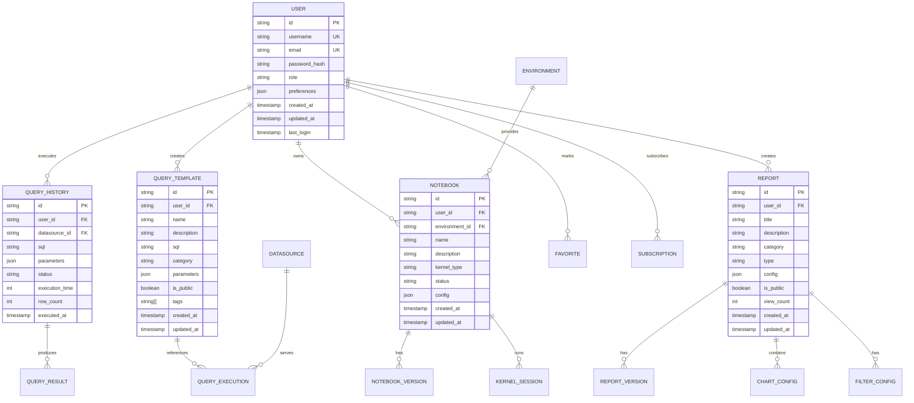

# 统一数据分析平台技术架构文档

## 1. 架构设计

### 1.1 整体架构图


### 1.2 微前端架构设计


## 2. 技术栈描述

### 2.1 前端技术栈
- **前端框架**: Vue 3.4 + Composition API
- **构建工具**: Vite 5.0
- **状态管理**: Vuex 4.0
- **路由管理**: Vue Router 4.0
- **UI组件库**: Arco Design Vue 2.0
- **图表库**: ECharts 5.0 + AntV X6
- **CSS框架**: Tailwind CSS 3.0
- **代码规范**: ESLint + Prettier + TypeScript

### 2.2 后端服务
- **API网关**: Kong Gateway 3.0
- **认证服务**: Supabase Auth
- **数据库**: Supabase (PostgreSQL 15)
- **实时通信**: Supabase Realtime
- **对象存储**: Supabase Storage
- **缓存服务**: Redis 7.0
- **容器编排**: Docker + Docker Compose

### 2.3 第三方集成
- **Jupyter Hub**: 提供Python分析环境
- **BI工具**: Apache Superset / Metabase
- **SQL编辑器**: Monaco Editor
- **代码高亮**: Prism.js
- **富文本**: Quill Editor

## 3. 路由定义

### 3.1 主应用路由

| 路由路径 | 组件名称 | 权限要求 | 描述 |
|----------|----------|----------|------|
| / | HomePage | 所有用户 | 平台入口首页 |
| /login | LoginPage | 未登录用户 | 用户登录页面 |
| /dashboard | DashboardPage | 已登录用户 | 个人工作台 |
| /query | QueryModule | 分析师+管理员 | 统一查询模块 |
| /jupyter | JupyterModule | 分析师+管理员 | Jupyter分析环境 |
| /report | ReportModule | 所有用户 | 智慧报表模块 |
| /admin | AdminModule | 管理员 | 系统管理后台 |
| /profile | ProfilePage | 已登录用户 | 个人设置页面 |
| /help | HelpPage | 所有用户 | 帮助中心 |

### 3.2 统一查询模块子路由

| 路由路径 | 功能描述 |
|----------|----------|
| /query/editor | SQL编辑器 |
| /query/templates | 查询模板库 |
| /query/history | 查询历史 |
| /query/results | 查询结果 |
| /query/saved | 保存的查询 |

### 3.3 Jupyter Hub模块子路由

| 路由路径 | 功能描述 |
|----------|----------|
| /jupyter/notebooks | Notebook管理 |
| /jupyter/environments | 环境配置 |
| /jupyter/templates | 分析模板 |
| /jupyter/projects | 项目管理 |
| /jupyter/monitor | 资源监控 |

### 3.4 智慧报表模块子路由

| 路由路径 | 功能描述 |
|----------|----------|
| /report/dashboard | 报表仪表板 |
| /report/explore | 报表浏览 |
| /report/favorites | 收藏报表 |
| /report/subscriptions | 报表订阅 |
| /report/create | 创建报表 |

## 4. API接口定义

### 4.1 用户认证相关API

#### 用户登录
```http
POST /api/auth/login
```

请求参数：
```json
{
  "username": "string",
  "password": "string",
  "rememberMe": true
}
```

响应数据：
```json
{
  "code": 0,
  "message": "success",
  "data": {
    "token": "string",
    "user": {
      "id": "string",
      "username": "string",
      "email": "string",
      "roles": ["analyst"],
      "permissions": ["query.read", "jupyter.read"]
    },
    "expiresIn": 7200
  }
}
```

#### 用户信息获取
```http
GET /api/auth/userinfo
```

响应数据：
```json
{
  "code": 0,
  "message": "success", 
  "data": {
    "id": "string",
    "username": "string",
    "email": "string",
    "avatar": "string",
    "roles": ["analyst"],
    "preferences": {
      "theme": "light",
      "language": "zh-CN",
      "defaultModule": "query"
    }
  }
}
```

### 4.2 统一查询模块API

#### 获取数据源列表
```http
GET /api/query/datasources
```

响应数据：
```json
{
  "code": 0,
  "message": "success",
  "data": {
    "list": [
      {
        "id": "string",
        "name": "string",
        "type": "postgresql",
        "host": "string",
        "port": 5432,
        "database": "string",
        "description": "string",
        "status": "active"
      }
    ],
    "total": 10
  }
}
```

#### 执行SQL查询
```http
POST /api/query/execute
```

请求参数：
```json
{
  "datasourceId": "string",
  "sql": "SELECT * FROM users LIMIT 100",
  "params": {},
  "format": "table"
}
```

响应数据：
```json
{
  "code": 0,
  "message": "success",
  "data": {
    "queryId": "string",
    "status": "completed",
    "executionTime": 1250,
    "rowCount": 100,
    "columns": [
      {
        "name": "id",
        "type": "integer",
        "nullable": false
      }
    ],
    "rows": [
      [1, "user1", "email1@example.com"]
    ],
    "metadata": {
      "totalRows": 1000,
      "pageSize": 100,
      "currentPage": 1
    }
  }
}
```

#### 保存查询模板
```http
POST /api/query/templates
```

请求参数：
```json
{
  "name": "用户活跃度分析",
  "description": "统计每日用户活跃度",
  "sql": "SELECT DATE(created_at) as date, COUNT(DISTINCT user_id) as active_users FROM user_activities GROUP BY date",
  "category": "user_analytics",
  "isPublic": false,
  "tags": ["用户分析", "活跃度"]
}
```

### 4.3 Jupyter Hub模块API

#### 获取环境列表
```http
GET /api/jupyter/environments
```

响应数据：
```json
{
  "code": 0,
  "message": "success",
  "data": {
    "environments": [
      {
        "id": "string",
        "name": "Python 3.9 数据分析",
        "image": "jupyter/datascience-notebook",
        "status": "running",
        "resources": {
          "cpu": "2 cores",
          "memory": "4GB",
          "disk": "20GB"
        },
        "createdAt": "2024-01-01T00:00:00Z",
        "lastUsed": "2024-01-15T10:30:00Z"
      }
    ]
  }
}
```

#### 启动Notebook
```http
POST /api/jupyter/notebooks
```

请求参数：
```json
{
  "environmentId": "string",
  "name": "用户行为分析",
  "templateId": "string",
  "kernel": "python3"
}
```

响应数据：
```json
{
  "code": 0,
  "message": "success",
  "data": {
    "notebookId": "string",
    "url": "https://jupyter.example.com/user/analyst/notebooks/user_behavior_analysis.ipynb",
    "status": "starting",
    "accessToken": "string",
    "expiresIn": 3600
  }
}
```

### 4.4 智慧报表模块API

#### 获取报表列表
```http
GET /api/reports?page=1&size=20&category=sales
```

响应数据：
```json
{
  "code": 0,
  "message": "success",
  "data": {
    "list": [
      {
        "id": "string",
        "title": "销售数据分析报表",
        "description": "月度销售数据综合分析",
        "category": "sales",
        "type": "dashboard",
        "thumbnail": "string",
        "createdBy": "analyst1",
        "createdAt": "2024-01-01T00:00:00Z",
        "lastModified": "2024-01-15T10:30:00Z",
        "isFavorite": true,
        "viewCount": 1250,
        "status": "published"
      }
    ],
    "total": 150,
    "page": 1,
    "size": 20
  }
}
```

#### 获取报表详情
```http
GET /api/reports/{reportId}
```

响应数据：
```json
{
  "code": 0,
  "message": "success",
  "data": {
    "id": "string",
    "title": "销售数据分析报表",
    "description": "详细的销售数据分析",
    "category": "sales",
    "type": "dashboard",
    "config": {
      "charts": [
        {
          "type": "line",
          "title": "月度销售趋势",
          "dataSource": "sales_data"
        }
      ],
      "filters": [
        {
          "name": "date_range",
          "type": "date_range",
          "default": "last_30_days"
        }
      ]
    },
    "data": {
      "lastUpdated": "2024-01-15T10:30:00Z",
      "refreshInterval": 3600
    },
    "permissions": {
      "canView": true,
      "canEdit": false,
      "canShare": true
    }
  }
}
```

## 5. 服务器架构设计

### 5.1 微服务架构


### 5.2 服务层详细设计

**认证服务（Auth Service）**：
- JWT Token管理
- 用户权限验证
- SSO集成
- 审计日志记录

**查询服务（Query Service）**：
- SQL查询执行
- 数据源管理
- 查询结果缓存
- 查询历史记录

**Jupyter服务（Jupyter Service）**：
- Notebook生命周期管理
- 环境资源调度
- 用户会话管理
- 安全隔离控制

**报表服务（Report Service）**：
- 报表配置管理
- 数据可视化生成
- 报表权限控制
- 订阅推送管理

## 6. 数据模型设计

### 6.1 实体关系图



### 6.2 数据库表结构

#### 用户表（users）
```sql
CREATE TABLE users (
    id UUID PRIMARY KEY DEFAULT gen_random_uuid(),
    username VARCHAR(50) UNIQUE NOT NULL,
    email VARCHAR(255) UNIQUE NOT NULL,
    password_hash VARCHAR(255) NOT NULL,
    role VARCHAR(20) NOT NULL CHECK (role IN ('analyst', 'business', 'admin', 'manager', 'developer')),
    avatar_url VARCHAR(500),
    preferences JSONB DEFAULT '{}',
    is_active BOOLEAN DEFAULT true,
    last_login_at TIMESTAMP WITH TIME ZONE,
    created_at TIMESTAMP WITH TIME ZONE DEFAULT NOW(),
    updated_at TIMESTAMP WITH TIME ZONE DEFAULT NOW()
);

-- 索引
CREATE INDEX idx_users_username ON users(username);
CREATE INDEX idx_users_email ON users(email);
CREATE INDEX idx_users_role ON users(role);
```

#### 数据源表（datasources）
```sql
CREATE TABLE datasources (
    id UUID PRIMARY KEY DEFAULT gen_random_uuid(),
    name VARCHAR(100) NOT NULL,
    type VARCHAR(50) NOT NULL,
    host VARCHAR(255) NOT NULL,
    port INTEGER NOT NULL,
    database VARCHAR(100) NOT NULL,
    username VARCHAR(100),
    password_encrypted TEXT,
    description TEXT,
    config JSONB DEFAULT '{}',
    is_active BOOLEAN DEFAULT true,
    created_by UUID REFERENCES users(id),
    created_at TIMESTAMP WITH TIME ZONE DEFAULT NOW(),
    updated_at TIMESTAMP WITH TIME ZONE DEFAULT NOW()
);

-- 索引
CREATE INDEX idx_datasources_type ON datasources(type);
CREATE INDEX idx_datasources_created_by ON datasources(created_by);
```

#### 查询模板表（query_templates）
```sql
CREATE TABLE query_templates (
    id UUID PRIMARY KEY DEFAULT gen_random_uuid(),
    user_id UUID NOT NULL REFERENCES users(id),
    name VARCHAR(200) NOT NULL,
    description TEXT,
    sql TEXT NOT NULL,
    category VARCHAR(50),
    parameters JSONB DEFAULT '[]',
    is_public BOOLEAN DEFAULT false,
    tags TEXT[] DEFAULT '{}',
    usage_count INTEGER DEFAULT 0,
    created_at TIMESTAMP WITH TIME ZONE DEFAULT NOW(),
    updated_at TIMESTAMP WITH TIME ZONE DEFAULT NOW()
);

-- 索引
CREATE INDEX idx_query_templates_user_id ON query_templates(user_id);
CREATE INDEX idx_query_templates_category ON query_templates(category);
CREATE INDEX idx_query_templates_is_public ON query_templates(is_public);
CREATE INDEX idx_query_templates_tags ON query_templates USING GIN(tags);
```

#### 查询历史表（query_history）
```sql
CREATE TABLE query_history (
    id UUID PRIMARY KEY DEFAULT gen_random_uuid(),
    user_id UUID NOT NULL REFERENCES users(id),
    datasource_id UUID NOT NULL REFERENCES datasources(id),
    template_id UUID REFERENCES query_templates(id),
    sql TEXT NOT NULL,
    parameters JSONB DEFAULT '{}',
    status VARCHAR(20) NOT NULL CHECK (status IN ('pending', 'running', 'completed', 'failed', 'cancelled')),
    execution_time INTEGER,
    row_count INTEGER,
    error_message TEXT,
    result_size BIGINT,
    executed_at TIMESTAMP WITH TIME ZONE DEFAULT NOW()
);

-- 索引
CREATE INDEX idx_query_history_user_id ON query_history(user_id);
CREATE INDEX idx_query_history_datasource_id ON query_history(datasource_id);
CREATE INDEX idx_query_history_status ON query_history(status);
CREATE INDEX idx_query_history_executed_at ON query_history(executed_at DESC);
```

#### Notebook表（notebooks）
```sql
CREATE TABLE notebooks (
    id UUID PRIMARY KEY DEFAULT gen_random_uuid(),
    user_id UUID NOT NULL REFERENCES users(id),
    environment_id VARCHAR(100) NOT NULL,
    name VARCHAR(200) NOT NULL,
    description TEXT,
    kernel_type VARCHAR(50) NOT NULL,
    status VARCHAR(20) NOT NULL CHECK (status IN ('stopped', 'starting', 'running', 'error')),
    config JSONB DEFAULT '{}',
    access_url VARCHAR(500),
    resource_usage JSONB DEFAULT '{}',
    last_accessed_at TIMESTAMP WITH TIME ZONE,
    created_at TIMESTAMP WITH TIME ZONE DEFAULT NOW(),
    updated_at TIMESTAMP WITH TIME ZONE DEFAULT NOW()
);

-- 索引
CREATE INDEX idx_notebooks_user_id ON notebooks(user_id);
CREATE INDEX idx_notebooks_environment_id ON notebooks(environment_id);
CREATE INDEX idx_notebooks_status ON notebooks(status);
```

#### 报表表（reports）
```sql
CREATE TABLE reports (
    id UUID PRIMARY KEY DEFAULT gen_random_uuid(),
    user_id UUID NOT NULL REFERENCES users(id),
    title VARCHAR(200) NOT NULL,
    description TEXT,
    category VARCHAR(50),
    type VARCHAR(50) NOT NULL,
    config JSONB NOT NULL,
    thumbnail_url VARCHAR(500),
    is_public BOOLEAN DEFAULT false,
    is_featured BOOLEAN DEFAULT false,
    view_count INTEGER DEFAULT 0,
    share_count INTEGER DEFAULT 0,
    status VARCHAR(20) NOT NULL CHECK (status IN ('draft', 'published', 'archived')),
    published_at TIMESTAMP WITH TIME ZONE,
    created_at TIMESTAMP WITH TIME ZONE DEFAULT NOW(),
    updated_at TIMESTAMP WITH TIME ZONE DEFAULT NOW()
);

-- 索引
CREATE INDEX idx_reports_user_id ON reports(user_id);
CREATE INDEX idx_reports_category ON reports(category);
CREATE INDEX idx_reports_type ON reports(type);
CREATE INDEX idx_reports_status ON reports(status);
CREATE INDEX idx_reports_is_public ON reports(is_public);
```

#### 收藏表（favorites）
```sql
CREATE TABLE favorites (
    id UUID PRIMARY KEY DEFAULT gen_random_uuid(),
    user_id UUID NOT NULL REFERENCES users(id),
    resource_type VARCHAR(50) NOT NULL CHECK (resource_type IN ('template', 'report', 'notebook')),
    resource_id UUID NOT NULL,
    folder VARCHAR(100) DEFAULT 'default',
    notes TEXT,
    created_at TIMESTAMP WITH TIME ZONE DEFAULT NOW(),
    UNIQUE(user_id, resource_type, resource_id)
);

-- 索引
CREATE INDEX idx_favorites_user_id ON favorites(user_id);
CREATE INDEX idx_favorites_resource_type ON favorites(resource_type);
CREATE INDEX idx_favorites_resource_id ON favorites(resource_id);
```

### 6.3 初始数据

#### 插入默认管理员用户
```sql
INSERT INTO users (username, email, password_hash, role, preferences) VALUES 
('admin', 'admin@example.com', '$2b$10$YourHashedPasswordHere', 'admin', '{"theme":"light","language":"zh-CN"}');
```

#### 插入示例数据源
```sql
INSERT INTO datasources (name, type, host, port, database, description, config) VALUES 
('主数据库', 'postgresql', 'localhost', 5432, 'analytics', '主要业务数据库', '{"ssl":false,"timeout":30}'),
('数据仓库', 'postgresql', 'warehouse.example.com', 5432, 'dw', '数据仓库', '{"ssl":true,"timeout":60}');
```

#### 插入示例查询模板
```sql
INSERT INTO query_templates (user_id, name, description, sql, category, parameters, tags) VALUES 
((SELECT id FROM users WHERE username = 'admin'), '用户注册统计', '统计每日新注册用户数量', 'SELECT DATE(created_at) as date, COUNT(*) as new_users FROM users WHERE created_at >= $1 GROUP BY date ORDER BY date', 'user_analytics', '[{"name":"start_date","type":"date","default":"2024-01-01"}]', '{"用户分析","注册统计"}');
```

## 7. 部署架构

### 7.1 容器化部署

```yaml
# docker-compose.yml
version: '3.8'
services:
  frontend:
    build: ./frontend
    ports:
      - "3000:3000"
    environment:
      - VITE_API_URL=http://api:8000
    depends_on:
      - api

  api:
    build: ./backend
    ports:
      - "8000:8000"
    environment:
      - DATABASE_URL=postgresql://user:pass@db:5432/analytics
      - REDIS_URL=redis://redis:6379
      - SUPABASE_URL=http://supabase:8001
    depends_on:
      - db
      - redis
      - supabase

  jupyterhub:
    image: jupyterhub/jupyterhub:latest
    ports:
      - "8001:8000"
    volumes:
      - jupyter_data:/srv/jupyterhub
    environment:
      - JUPYTERHUB_CRYPT_KEY=your-secret-key

  db:
    image: postgres:15
    ports:
      - "5432:5432"
    volumes:
      - postgres_data:/var/lib/postgresql/data
    environment:
      - POSTGRES_DB=analytics
      - POSTGRES_USER=user
      - POSTGRES_PASSWORD=pass

  redis:
    image: redis:7-alpine
    ports:
      - "6379:6379"
    volumes:
      - redis_data:/data

  supabase:
    image: supabase/supabase:latest
    ports:
      - "8002:8000"
    environment:
      - POSTGRES_DB=analytics
      - JWT_SECRET=your-jwt-secret

volumes:
  postgres_data:
  redis_data:
  jupyter_data:
```

### 7.2 环境配置

**开发环境**：
- 本地开发服务器
- 热重载和调试工具
- 模拟数据和API

**测试环境**：
- 独立的测试数据库
- 自动化测试流程
- 性能测试工具

**生产环境**：
- 负载均衡和CDN
- 数据库集群和备份
- 监控和报警系统

## 8. 监控和运维

### 8.1 监控指标

**应用性能监控**：
- 页面加载时间
- API响应时间
- 错误率和异常监控
- 用户行为追踪

**基础设施监控**：
- CPU和内存使用率
- 磁盘空间和I/O
- 网络流量和延迟
- 服务可用性

**业务指标监控**：
- 用户活跃度
- 功能使用频率
- 数据查询量
- 报表访问统计

### 8.2 日志管理

**日志收集**：
- 前端错误日志
- 后端应用日志
- 数据库查询日志
- 系统运行日志

**日志分析**：
- 实时日志分析
- 异常检测和报警
- 用户行为分析
- 性能瓶颈识别

### 8.3 备份策略

**数据备份**：
- 数据库定期备份
- 文件系统备份
- 配置信息备份
- 备份完整性验证

**灾难恢复**：
- 备份数据恢复流程
- 服务迁移方案
- 应急响应机制
- 业务连续性保障

---

*本技术架构文档为统一数据分析平台提供了完整的技术实现方案，包括架构设计、API规范、数据模型和部署方案。文档将根据项目需求变化和技术发展进行持续更新。*