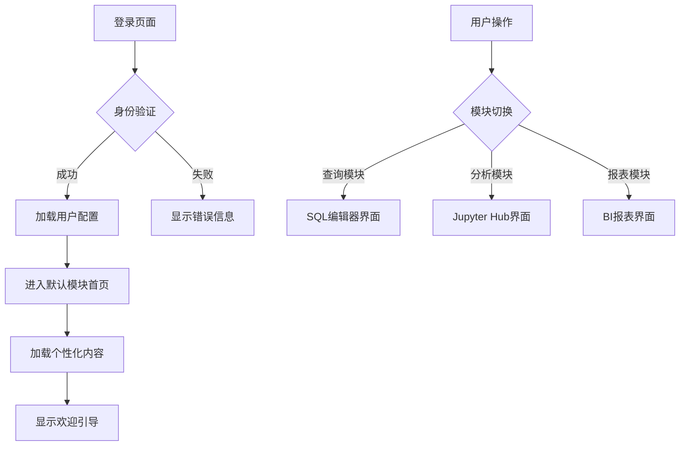
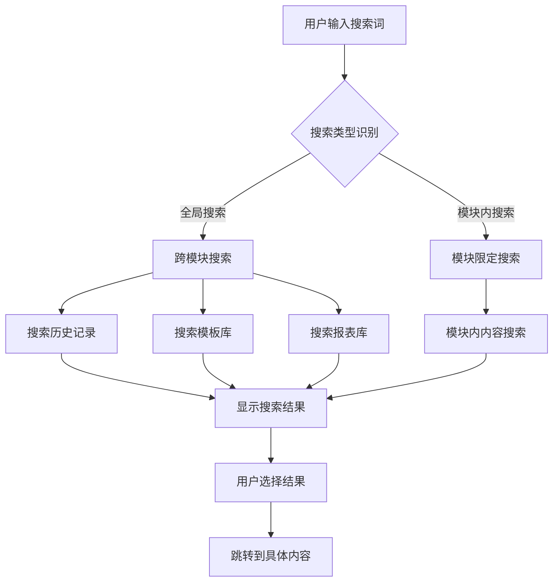

# 统一数据分析平台入口页面需求文档

## 1. 产品概述

统一数据分析平台是一个集成化的数据分析工作环境，整合了SQL查询、Python分析和BI报表三大核心功能模块。该平台旨在为不同角色的用户提供一站式的数据分析服务，提升数据驱动决策的效率。

平台主要解决以下问题：
- 数据分析师需要在多个工具间切换，工作效率低下
- 业务人员缺乏直观易用的数据查询和分析工具
- 管理层难以快速获取统一的数据视图和报表

目标用户群体包括数据分析师、业务人员、管理层以及开发工程师等，通过提供统一入口和标准化界面，降低数据分析门槛，提升组织的数据分析能力。

## 2. 用户角色分析

### 2.1 用户角色定义

| 角色 | 注册方式 | 核心权限 | 功能特点 |
|------|----------|----------|----------|
| 数据分析师 | LDAP/SSO统一认证 | 全模块访问权限，高级查询功能 | 复杂SQL查询、Python建模、自定义报表 |
| 业务人员 | 邮箱邀请注册 | 基础查询和报表查看权限 | 预定义模板使用、简单筛选、报表浏览 |
| 管理员 | 系统初始化创建 | 系统管理、用户管理、权限配置 | 用户管理、系统监控、数据源配置 |
| 管理层 | 管理员分配 | 报表查看和概览权限 | 关键指标查看、报表订阅、数据概览 |
| 开发工程师 | LDAP/SSO统一认证 | 查询和API访问权限 | 数据验证、接口调试、技术查询 |

### 2.2 角色使用场景

**数据分析师场景**：
- 日常数据探索和分析工作
- 复杂业务问题的数据挖掘
- 分析模型的开发和验证
- 自动化报表的创建和维护

**业务人员场景**：
- 业务数据的日常监控
- 临时数据查询需求
- 标准报表的查看和导出
- 数据问题的快速验证

**管理层场景**：
- 关键业务指标的查看
- 定期报表的审阅
- 数据驱动决策的支持
- 业务趋势的监控

## 3. 功能模块设计

### 3.1 统一查询模块（SQL）

**核心功能**：
- SQL编辑器：支持语法高亮、智能提示、查询格式化
- 查询模板：常用查询模板的保存、分类管理和快速调用
- 历史记录：查询历史的自动保存、搜索和重新执行
- 结果展示：表格展示、图表可视化、数据导出
- 协作功能：查询分享、评论、版本管理

**界面元素**：
- 左侧：数据库导航树、表结构查看
- 中间：SQL编辑器区域、执行按钮
- 右侧：查询历史、模板库、结果预览
- 底部：结果展示区域、状态栏

### 3.2 Jupyter Hub模块（Python）

**核心功能**：
- 环境管理：Python环境的选择和配置
- 模板市场：常用分析模板的浏览和使用
- 项目管理：最近项目的快速访问和管理
- 状态监控：环境资源使用情况的实时监控
- 协作共享：Notebook的分享和协作编辑

**界面元素**：
- 顶部：环境选择器、新建项目按钮
- 左侧：项目文件树、模板分类
- 中间：最近项目卡片、快速启动区域
- 右侧：环境状态、资源使用情况

### 3.3 智慧报表模块（BI）

**核心功能**：
- 报表浏览：分类浏览、搜索筛选、收藏管理
- 预览功能：报表缩略图、关键指标预览
- 交互分析：钻取分析、筛选交互、数据探索
- 订阅管理：报表订阅、定时推送、权限控制
- 移动端适配：响应式设计、移动端优化

**界面元素**：
- 顶部：搜索栏、筛选器、新建报表
- 左侧：报表分类树、收藏夹
- 中间：报表卡片网格、预览区域
- 右侧：常用报表、最近查看

## 4. 页面布局设计

### 4.1 整体布局架构

采用响应式三栏布局设计，确保在不同屏幕尺寸下的最佳用户体验：

```
┌─────────────────────────────────────────────────────────────┐
│                    顶部导航栏 (60px)                        │
├─────────────┬─────────────────────────────┬───────────────┤
│             │                             │               │
│   左侧栏    │       主内容区域           │   右侧辅助栏   │
│   (240px)   │       (自适应)             │   (280px)     │
│             │                             │               │
├─────────────┴─────────────────────────────┴───────────────┤
│                    底部状态栏 (40px)                        │
└─────────────────────────────────────────────────────────────┘
```

### 4.2 详细布局说明

**顶部导航栏**：
- Logo和平台名称
- 全局搜索框
- 用户信息和通知中心
- 系统设置和帮助入口

**左侧导航栏**：
- 模块切换菜单（图标+文字）
- 快速操作按钮
- 最近使用记录
- 个人收藏夹

**主内容区域**：
- 模块首页概览
- 功能卡片网格
- 数据展示表格
- 图表可视化区域

**右侧辅助栏**：
- 快捷操作面板
- 实时数据概览
- 系统公告和消息
- 帮助提示信息

**底部状态栏**：
- 系统状态指示
- 数据更新时间
- 连接状态显示
- 版权信息

### 4.3 响应式设计

**桌面端 (>1200px)**：完整三栏布局
**平板端 (768px-1200px)**：双栏布局，右侧栏折叠
**移动端 (<768px)**：单栏布局，侧边栏抽屉式

## 5. 交互流程设计

### 5.1 登录和首页流程



### 5.2 模块内操作流程

**查询模块流程**：
1. 选择数据源 → 2. 编写/选择SQL → 3. 执行查询 → 4. 查看结果 → 5. 保存/导出

**分析模块流程**：
1. 选择环境 → 2. 创建/打开项目 → 3. 编写代码 → 4. 运行分析 → 5. 保存分享

**报表模块流程**：
1. 浏览/搜索报表 → 2. 预览报表 → 3. 交互分析 → 4. 收藏/订阅 → 5. 导出分享

### 5.3 搜索和筛选流程



## 6. 视觉设计规范

### 6.1 配色方案

**主色调**：
- 主色：#1890FF（科技蓝）
- 辅助色：#52C41A（成功绿）
- 警告色：#FAAD14（警告黄）
- 错误色：#F5222D（错误红）

**中性色**：
- 标题文字：#262626
- 正文文字：#595959
- 辅助文字：#8C8C8C
- 边框颜色：#D9D9D9
- 背景色：#F5F5F5

**渐变色**：
- 导航栏渐变：linear-gradient(135deg, #1890FF 0%, #096DD9 100%)
- 卡片背景：linear-gradient(180deg, #FFFFFF 0%, #FAFAFA 100%)

### 6.2 图标风格

**图标类型**：
- 线性图标：用于导航和功能按钮
- 面性图标：用于重要功能和状态指示
- 双色图标：用于品牌元素和特殊功能

**图标规范**：
- 尺寸规范：16px、20px、24px、32px
- 线条粗细：统一2px
- 圆角半径：2px
- 视觉修正：保持视觉一致性

### 6.3 字体规范

**字体族**：
- 中文：PingFang SC、Hiragino Sans GB、Microsoft YaHei
- 数字和英文：SF Pro Display、Helvetica Neue
- 等宽字体：SF Mono、Consolas

**字号规范**：
- 标题：24px、20px、18px、16px
- 正文：14px、12px
- 辅助文字：12px、11px

**字重规范**：
- 标题：600（SemiBold）
- 正文：400（Regular）
- 强调：500（Medium）

### 6.4 间距和排版

**间距系统**：
- 基础间距：4px、8px、12px、16px、24px、32px、48px
- 组件间距：遵循8的倍数原则
- 内容间距：16px为基础单元

**排版原则**：
- 对齐原则：左对齐为主，特殊情况居中对齐
- 层次结构：通过字号、字重、颜色建立视觉层次
- 留白艺术：适当的留白提升界面呼吸感

### 6.5 动效设计

**动效类型**：
- 过渡动效：0.3s ease-in-out
- 反馈动效：0.2s ease-out
- 加载动效：循环2s

**动效原则**：
-  purposeful：每个动效都有明确目的
- 快速：避免冗长的动效影响效率
- 自然：符合物理世界的运动规律
- 一致性：保持动效风格统一

## 7. 权限控制方案

### 7.1 权限模型设计

采用RBAC（Role-Based Access Control）权限模型，实现灵活的权限管理：

```
用户 → 角色 → 权限 → 资源
```

**权限层级**：
1. 系统级权限：模块访问权限
2. 功能级权限：具体功能操作权限
3. 数据级权限：数据查看和操作权限
4. 操作级权限：增删改查操作权限

### 7.2 权限配置表

| 角色 | 查询模块 | 分析模块 | 报表模块 | 系统管理 |
|------|----------|----------|----------|----------|
| 数据分析师 | 全部权限 | 全部权限 | 查看+创建 | 查看 |
| 业务人员 | 模板使用 | 模板使用 | 查看+收藏 | 无 |
| 管理员 | 全部权限 | 全部权限 | 全部权限 | 全部权限 |
| 管理层 | 查看 | 查看 | 查看+订阅 | 查看 |
| 开发工程师 | 查询+调试 | 查看 | 查看 | 查看 |

### 7.3 权限控制实现

**前端权限控制**：
- 路由级权限控制：基于角色动态生成路由
- 组件级权限控制：按钮和功能的显示控制
- 数据级权限控制：数据的过滤和脱敏

**后端权限控制**：
- API权限验证：每个接口的权限检查
- 数据权限过滤：SQL级别的数据过滤
- 审计日志记录：关键操作的日志记录

**权限缓存机制**：
- 用户权限缓存：减少重复查询
- 角色权限缓存：提升权限验证效率
- 动态权限更新：实时更新权限变更

## 8. 性能要求

### 8.1 性能指标

**页面加载性能**：
- 首屏加载时间：≤ 2秒
- 完整页面加载：≤ 3秒
- 首次内容绘制（FCP）：≤ 1.5秒
- 最大内容绘制（LCP）：≤ 2.5秒

**交互性能**：
- 按钮响应时间：≤ 100ms
- 页面切换时间：≤ 500ms
- 搜索响应时间：≤ 1秒
- 数据加载时间：≤ 2秒

**资源优化**：
- 首屏资源大小：≤ 500KB
- 图片资源优化：WebP格式，懒加载
- 字体资源优化：字体子集化，预加载
- 代码分割：按需加载，减少初始加载体积

### 8.2 性能优化策略

**前端优化**：
- 资源压缩：Gzip/Brotli压缩
- 缓存策略：浏览器缓存、CDN缓存
- 懒加载：图片懒加载、组件懒加载
- 预加载：关键资源预加载

**网络优化**：
- CDN加速：静态资源CDN分发
- HTTP/2：多路复用，头部压缩
- 请求合并：减少HTTP请求数量
- 域名分片：突破浏览器并发限制

**渲染优化**：
- 虚拟滚动：大数据列表优化
- 防抖节流：减少不必要的渲染
- 组件缓存：保持组件状态
- 骨架屏：提升感知性能

### 8.3 监控和报警

**性能监控**：
- 前端性能监控：Real User Monitoring
- 错误监控：JavaScript错误收集
- 业务监控：关键业务指标监控
- 可用性监控：服务可用性检测

**报警机制**：
- 性能降级报警：响应时间异常报警
- 错误率报警：错误率超过阈值报警
- 容量报警：系统资源使用报警
- 业务指标报警：关键业务指标异常报警

## 9. 扩展性设计

### 9.1 模块化架构

**插件化设计**：
- 模块注册机制：动态注册新模块
- 接口标准化：统一的模块接口规范
- 配置化接入：通过配置文件接入新模块
- 生命周期管理：模块的加载、卸载、更新

**微前端架构**：
- 主应用：负责框架和基础功能
- 子应用：各功能模块独立部署
- 通信机制：模块间通信标准化
- 状态管理：跨模块状态共享

### 9.2 API扩展规范

**接口设计原则**：
- RESTful风格：统一的接口设计规范
- 版本控制：API版本管理和兼容性
- 分页规范：统一的分页参数和返回格式
- 错误处理：统一的错误码和错误信息

**数据格式规范**：
```json
{
  "code": 0,
  "message": "success",
  "data": {
    "list": [],
    "total": 0,
    "page": 1,
    "size": 10
  },
  "timestamp": 1640995200000
}
```

### 9.3 主题和个性化

**主题系统**：
- 预设主题：提供多种预设主题
- 自定义主题：支持用户自定义主题
- 主题变量：CSS变量管理主题色
- 主题切换：运行时主题切换

**个性化配置**：
- 布局配置：支持多种布局方式
- 组件配置：组件显示和隐藏控制
- 快捷键：支持自定义快捷键
- 个人设置：个人偏好设置保存

### 9.4 国际化支持

**多语言支持**：
- 语言包管理：支持多语言包动态加载
- 本地化格式：日期、数字、货币本地化
- 文本方向：支持RTL（右到左）布局
- 文化适配：考虑不同文化的界面设计

**国际化规范**：
- 翻译管理：统一的翻译管理平台
- 版本控制：翻译版本的同步更新
- 质量保证：翻译质量的审核流程
- 用户贡献：支持用户贡献翻译

## 10. 用户故事和验收标准

### 10.1 用户故事

**作为数据分析师，我希望能够快速访问SQL查询工具**：
- 能够从首页直接点击进入SQL编辑器
- 能够看到最近使用的查询模板
- 能够快速切换到其他分析工具

**作为业务人员，我希望能够轻松找到所需的报表**：
- 能够通过分类浏览找到相关报表
- 能够收藏常用的报表
- 能够通过搜索快速定位报表

**作为管理员，我希望能够有效管理系统**：
- 能够查看系统使用统计
- 能够管理用户权限
- 能够监控系统状态

### 10.2 验收标准

**功能验收标准**：
- 所有核心功能模块正常加载和使用
- 用户权限控制准确无误
- 数据展示正确完整
- 搜索和筛选功能有效

**性能验收标准**：
- 页面加载时间满足性能要求
- 交互响应时间符合用户体验
- 并发用户支持达到设计要求
- 资源使用率在合理范围内

**兼容性验收标准**：
- 主流浏览器兼容性良好
- 不同设备分辨率适配正常
- 辅助功能支持完善
- 国际化显示正确

**安全验收标准**：
- 权限控制严格有效
- 数据传输加密完整
- 敏感信息脱敏处理
- 审计日志记录完整

## 11. 项目里程碑

### 11.1 开发阶段划分

**第一阶段（4周）**：基础框架和入口页面
- 技术架构搭建
- 基础组件库开发
- 入口页面原型实现
- 用户认证系统集成

**第二阶段（6周）**：核心功能模块
- 统一查询模块开发
- Jupyter Hub集成
- 智慧报表模块开发
- 权限管理系统

**第三阶段（4周）**：优化和测试
- 性能优化
- 用户体验优化
- 安全测试
- 兼容性测试

**第四阶段（2周）**：上线准备
- 部署方案制定
- 监控和报警配置
- 用户培训和文档
- 正式上线发布

### 11.2 风险控制

**技术风险**：
- 第三方服务集成失败 → 准备备用方案
- 性能不达标 → 提前进行性能测试和优化
- 安全漏洞 → 加强安全测试和代码审查

**项目风险**：
- 需求变更 → 建立需求变更管理流程
- 人员变动 → 建立知识文档和代码规范
- 时间延期 → 制定详细的进度计划和里程碑

**运营风险**：
- 用户接受度低 → 提前进行用户调研和试用
- 数据质量问题 → 建立数据质量监控机制
- 系统稳定性 → 建立完善的监控和应急响应机制

---

*本文档为统一数据分析平台入口页面的详细产品需求文档，将作为后续设计、开发和测试的指导文档。文档内容将根据项目进展和用户需求变化进行持续更新和完善。*