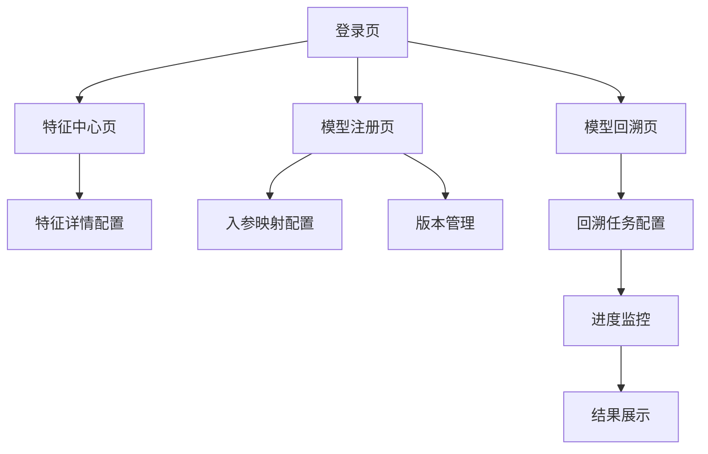

## 1. 产品概述
特征中心与模型管理系统，用于统一管理机器学习特征和模型生命周期。解决特征复用困难、模型版本混乱、回溯效率低等问题，为数据科学家和算法工程师提供一站式管理平台。

## 2. 核心功能

### 2.1 用户角色
| 角色 | 注册方式 | 核心权限 |
|------|----------|----------|
| 数据科学家 | 邮箱注册 | 创建/编辑特征、注册模型、查看依赖关系 |
| 算法工程师 | 邮箱注册 | 模型训练、版本管理、回溯查询 |
| 管理员 | 管理员创建 | 系统配置、权限管理、审计日志 |

### 2.2 功能模块
系统包含以下核心页面：
1. **特征中心页**：特征列表展示、依赖DAG可视化、特征详情配置
2. **模型注册页**：模型信息录入、版本管理、入参映射配置
3. **模型回溯页**：回溯任务创建、进度监控、结果展示

### 2.3 页面详情
| 页面名称 | 模块名称 | 功能描述 |
|----------|----------|----------|
| 特征中心页 | 特征列表 | 展示所有特征基本信息，支持搜索筛选、排序、分页 |
| 特征中心页 | 依赖DAG图 | 可视化展示特征间依赖关系，支持拖拽缩放、节点点击查看详情 |
| 特征中心页 | 特征详情 | 显示特征定义、数据来源、更新频率、质量指标等详细信息 |
| 模型注册页 | 基础信息 | 录入模型名称、描述、算法类型、训练数据等基础信息 |
| 模型注册页 | 版本管理 | 支持多版本管理、版本对比、版本冻结功能 |
| 模型注册页 | 入参映射 | 配置模型输入参数与特征的映射关系，支持必填项标记 |
| 模型回溯页 | 任务配置 | 选择回溯时间范围、目标模型、输出格式等配置 |
| 模型回溯页 | 进度监控 | 实时显示回溯任务执行进度、预计剩余时间 |
| 模型回溯页 | 结果展示 | 展示回溯结果统计、错误日志、下载链接 |

## 3. 核心流程

### 数据科学家流程
1. 登录系统进入特征中心
2. 创建新特征并配置依赖关系
3. 在DAG图中验证依赖关系正确性
4. 提交特征审核

### 算法工程师流程
1. 进入模型注册页面
2. 填写模型基础信息
3. 配置模型入参映射关系
4. 上传模型文件并创建版本
5. 在模型回溯页发起回溯任务
6. 监控任务进度并查看结果

## 4. 用户界面设计

### 4.1 设计风格
- **主色调**：深蓝色 (#1890ff) 搭配白色背景
- **辅助色**：浅灰色 (#f5f5f5) 用于卡片背景
- **按钮样式**：圆角矩形，主按钮使用渐变色
- **字体**：系统默认字体，标题16px，正文14px
- **布局风格**：卡片式布局，左侧导航右侧内容
- **图标风格**：使用Arco Design内置线性图标

### 4.2 页面设计概述
| 页面名称 | 模块名称 | UI元素 |
|----------|----------|--------|
| 特征中心页 | 特征列表 | 表格展示，包含特征名、类型、创建时间等列，操作列包含编辑删除按钮 |
| 特征中心页 | 依赖DAG图 | 使用AntV X6绘制，节点为圆角矩形，边为带箭头的曲线，支持缩放和拖拽 |
| 模型注册页 | 基础信息 | 表单输入，包含文本框、下拉选择、文本域等组件 |
| 模型注册页 | 入参映射 | 表格形式，左侧为模型参数，右侧为特征选择下拉框，必填项用红色星号标记 |
| 模型回溯页 | 进度监控 | 进度条配合百分比显示，不同状态使用不同颜色标识 |

### 4.3 响应式设计
采用桌面端优先设计，支持1920x1080及以上分辨率。平板端自适应布局，手机端提供简化版本，核心功能可通过移动端访问。