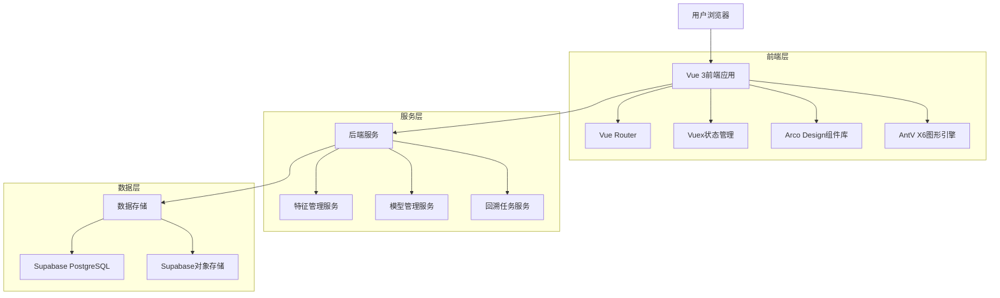
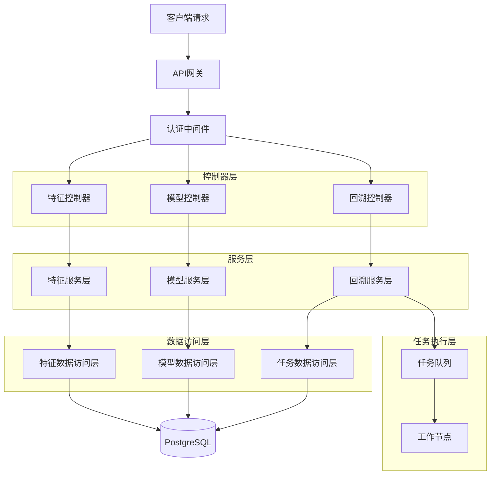
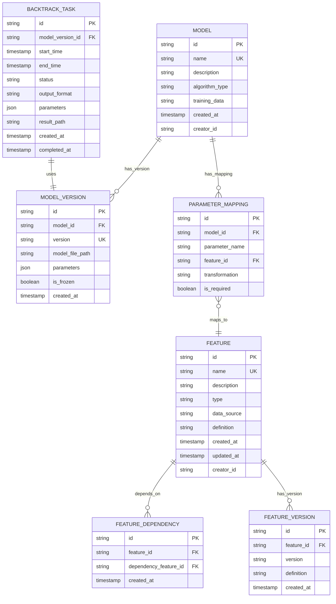

## 1. 架构设计



## 2. 技术描述

* **前端框架**: Vue 3 (Composition API) + TypeScript

* **构建工具**: Vite

* **图形引擎**: AntV X6

* **状态管理**: Vuex 4

* **路由管理**: Vue Router 4

* **UI组件**: Arco Design Vue

* **后端服务**: Node.js + Express

* **数据库**: Supabase (PostgreSQL)

* **对象存储**: Supabase Storage

* **初始化工具**: vite-init

## 3. 路由定义

| 路由                 | 用途                |
| ------------------ | ----------------- |
| /                  | 登录页，用户身份验证        |
| /features          | 特征中心页，特征管理和依赖关系展示 |
| /features/:id      | 特征详情页，单个特征的详细配置   |
| /models            | 模型注册页，模型信息录入和版本管理 |
| /models/:id        | 模型详情页，特定模型的详细信息   |
| /backtrack         | 模型回溯页，回溯任务管理      |
| /backtrack/:taskId | 回溯结果页，特定任务的执行结果   |

## 4. API定义

### 4.1 特征管理API

**获取特征列表**

```
GET /api/features
```

请求参数：

| 参数名      | 参数类型   | 是否必需  | 描述         |
| -------- | ------ | ----- | ---------- |
| page     | number | false | 页码，默认为1    |
| pageSize | number | false | 每页条数，默认为20 |
| keyword  | string | false | 搜索关键词      |

响应：

```json
{
  "code": 200,
  "data": {
    "list": [
      {
        "id": "feature_001",
        "name": "user_age",
        "description": "用户年龄特征",
        "type": "numerical",
        "dependencies": ["user_birthday"],
        "createdAt": "2024-01-01T00:00:00Z",
        "updatedAt": "2024-01-01T00:00:00Z"
      }
    ],
    "total": 100
  }
}
```

**创建特征**

```
POST /api/features
```

请求体：

```json
{
  "name": "user_age",
  "description": "用户年龄特征",
  "type": "numerical",
  "definition": "计算用户年龄",
  "dependencies": ["user_birthday"],
  "dataSource": "user_profile"
}
```

### 4.2 模型管理API

**注册模型**

```
POST /api/models
```

请求体：

```json
{
  "name": "credit_score_model",
  "description": "信用评分模型",
  "algorithmType": "xgboost",
  "trainingData": "credit_dataset_v1",
  "parameters": [
    {
      "name": "income",
      "type": "float",
      "required": true,
      "description": "用户收入"
    }
  ],
  "featureMappings": [
    {
      "parameterName": "income",
      "featureName": "user_income",
      "transformation": "log"
    }
  ]
}
```

**创建模型版本**

```
POST /api/models/:id/versions
```

### 4.3 回溯任务API

**创建回溯任务**

```
POST /api/backtrack/tasks
```

请求体：

```json
{
  "modelId": "model_001",
  "version": "v1.0.0",
  "startTime": "2024-01-01T00:00:00Z",
  "endTime": "2024-01-31T23:59:59Z",
  "outputFormat": "csv",
  "parameters": {
    "batchSize": 1000
  }
}
```

**获取任务进度**

```
GET /api/backtrack/tasks/:taskId/progress
```

## 5. 服务器架构图



## 6. 数据模型

### 6.1 数据模型定义



### 6.2 数据定义语言

**特征表 (features)**

```sql
-- 创建特征表
CREATE TABLE features (
  id UUID PRIMARY KEY DEFAULT gen_random_uuid(),
  name VARCHAR(100) UNIQUE NOT NULL,
  description TEXT,
  type VARCHAR(50) NOT NULL CHECK (type IN ('numerical', 'categorical', 'text', 'datetime')),
  data_source VARCHAR(100),
  definition TEXT,
  created_at TIMESTAMP WITH TIME ZONE DEFAULT NOW(),
  updated_at TIMESTAMP WITH TIME ZONE DEFAULT NOW(),
  creator_id UUID REFERENCES auth.users(id)
);

-- 创建索引
CREATE INDEX idx_features_name ON features(name);
CREATE INDEX idx_features_type ON features(type);
CREATE INDEX idx_features_created_at ON features(created_at DESC);

-- 授权
GRANT SELECT ON features TO anon;
GRANT ALL PRIVILEGES ON features TO authenticated;
```

**特征依赖表 (feature\_dependencies)**

```sql
-- 创建特征依赖表
CREATE TABLE feature_dependencies (
  id UUID PRIMARY KEY DEFAULT gen_random_uuid(),
  feature_id UUID REFERENCES features(id) ON DELETE CASCADE,
  dependency_feature_id UUID REFERENCES features(id) ON DELETE CASCADE,
  created_at TIMESTAMP WITH TIME ZONE DEFAULT NOW(),
  UNIQUE(feature_id, dependency_feature_id)
);

-- 创建索引
CREATE INDEX idx_feature_dependencies_feature_id ON feature_dependencies(feature_id);
CREATE INDEX idx_feature_dependencies_dep_id ON feature_dependencies(dependency_feature_id);

-- 授权
GRANT SELECT ON feature_dependencies TO anon;
GRANT ALL PRIVILEGES ON feature_dependencies TO authenticated;
```

**模型表 (models)**

```sql
-- 创建模型表
CREATE TABLE models (
  id UUID PRIMARY KEY DEFAULT gen_random_uuid(),
  name VARCHAR(100) UNIQUE NOT NULL,
  description TEXT,
  algorithm_type VARCHAR(50) NOT NULL,
  training_data VARCHAR(200),
  created_at TIMESTAMP WITH TIME ZONE DEFAULT NOW(),
  creator_id UUID REFERENCES auth.users(id)
);

-- 授权
GRANT SELECT ON models TO anon;
GRANT ALL PRIVILEGES ON models TO authenticated;
```

**模型版本表 (model\_versions)**

```sql
-- 创建模型版本表
CREATE TABLE model_versions (
  id UUID PRIMARY KEY DEFAULT gen_random_uuid(),
  model_id UUID REFERENCES models(id) ON DELETE CASCADE,
  version VARCHAR(50) NOT NULL,
  model_file_path TEXT,
  parameters JSONB,
  is_frozen BOOLEAN DEFAULT FALSE,
  created_at TIMESTAMP WITH TIME ZONE DEFAULT NOW(),
  UNIQUE(model_id, version)
);

-- 创建索引
CREATE INDEX idx_model_versions_model_id ON model_versions(model_id);
CREATE INDEX idx_model_versions_version ON model_versions(version);

-- 授权
GRANT SELECT ON model_versions TO anon;
GRANT ALL PRIVILEGES ON model_versions TO authenticated;
```

**参数映射表 (parameter\_mappings)**

```sql
-- 创建参数映射表
CREATE TABLE parameter_mappings (
  id UUID PRIMARY KEY DEFAULT gen_random_uuid(),
  model_id UUID REFERENCES models(id) ON DELETE CASCADE,
  parameter_name VARCHAR(100) NOT NULL,
  feature_id UUID REFERENCES features(id),
  transformation VARCHAR(100),
  is_required BOOLEAN DEFAULT TRUE,
  created_at TIMESTAMP WITH TIME ZONE DEFAULT NOW()
);

-- 创建索引
CREATE INDEX idx_parameter_mappings_model_id ON parameter_mappings(model_id);
CREATE INDEX idx_parameter_mappings_feature_id ON parameter_mappings(feature_id);

-- 授权
GRANT SELECT ON parameter_mappings TO anon;
GRANT ALL PRIVILEGES ON parameter_mappings TO authenticated;
```

**回溯任务表 (backtrack\_tasks)**

```sql
-- 创建回溯任务表
CREATE TABLE backtrack_tasks (
  id UUID PRIMARY KEY DEFAULT gen_random_uuid(),
  model_version_id UUID REFERENCES model_versions(id),
  start_time TIMESTAMP WITH TIME ZONE NOT NULL,
  end_time TIMESTAMP WITH TIME ZONE NOT NULL,
  status VARCHAR(50) DEFAULT 'pending' CHECK (status IN ('pending', 'running', 'completed', 'failed')),
  output_format VARCHAR(50) DEFAULT 'csv',
  parameters JSONB,
  result_path TEXT,
  created_at TIMESTAMP WITH TIME ZONE DEFAULT NOW(),
  completed_at TIMESTAMP WITH TIME ZONE
);

-- 创建索引
CREATE INDEX idx_backtrack_tasks_model_version_id ON backtrack_tasks(model_version_id);
CREATE INDEX idx_backtrack_tasks_status ON backtrack_tasks(status);
CREATE INDEX idx_backtrack_tasks_created_at ON backtrack_tasks(created_at DESC);

-- 授权
GRANT SELECT ON backtrack_tasks TO anon;
GRANT ALL PRIVILEGES ON backtrack_tasks TO authenticated;
```

