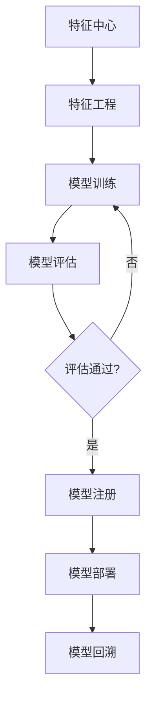
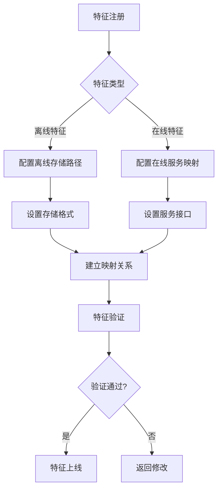
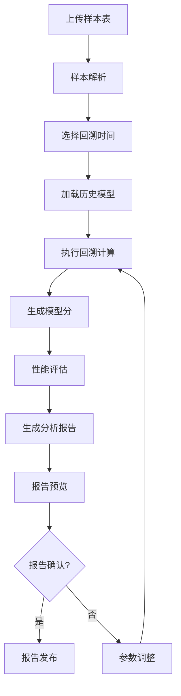
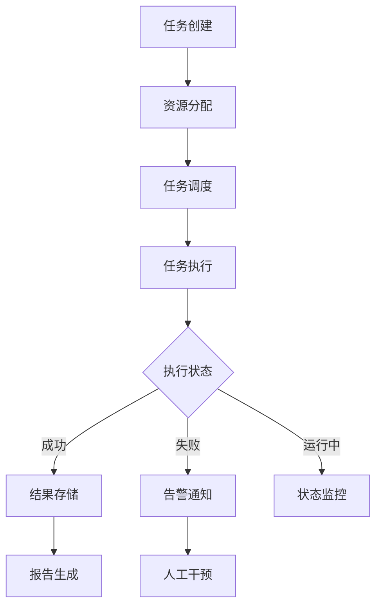

# 数字风险平台离线模型模块需求文档

## 1. 产品概述

数字风险平台离线模型模块是面向金融风控、反欺诈等业务场景的核心组件，旨在为风险模型提供全生命周期管理能力。该模块通过特征工程、模型训练、评估和部署的完整流程，帮助风险分析师和数据科学家高效构建、管理和优化风险预测模型。

产品核心价值：
- 提升风险模型开发效率50%以上
- 实现模型全生命周期可追溯管理
- 支持大规模特征工程和模型训练
- 提供标准化的模型评估和部署流程

## 2. 核心功能

### 2.1 用户角色

| 角色 | 注册方式 | 核心权限 |
|------|----------|----------|
| 风险分析师 | 企业邮箱注册 | 特征工程、模型训练、模型评估、报告查看 |
| 数据科学家 | 管理员邀请 | 完整模型开发权限、算法配置、高级评估 |
| 模型管理员 | 管理员分配 | 模型注册、版本管理、部署审核 |
| 系统管理员 | 超级管理员创建 | 系统配置、用户管理、资源分配 |

### 2.2 功能模块

本模块包含以下核心功能组件：

1. **特征中心**：特征注册管理、离线存储与在线服务映射、特征数据存储管理、特征工程处理、特征检索和可视化分析、特征元数据管理、特征生命周期管理
2. **模型注册**：模型版本控制、参数管理、文件上传下载、元数据管理界面
3. **模型回溯**：样本表上传管理、指定时间模型选择、回溯分析报告生成、训练过程记录、性能指标存储对比、完整追溯、可视化分析工具
4. **任务管理**：任务调度系统、训练评估任务管理、优先级和资源分配、状态监控告警
5. **模型评估**：多维度评估指标体系、离在线评估统一管理、结果可视化、自动报告生成

### 2.3 页面详情

| 页面名称 | 模块名称 | 功能描述 |
|----------|----------|----------|
| 特征中心页 | 特征注册管理 | 支持新特征注册，配置特征名称、类型、来源、业务含义等基础信息 |
| 特征中心页 | 存储映射管理 | 建立离线存储路径与在线服务特征的映射关系，支持多环境配置 |
| 特征中心页 | 特征库管理 | 展示特征列表，支持特征搜索、筛选、版本对比 |
| 特征中心页 | 特征工程工具 | 提供特征提取、转换、标准化等处理流程 |
| 特征中心页 | 特征分析可视化 | 生成特征分布图、相关性热力图、重要性排序 |
| 特征中心页 | 特征元数据 | 管理特征业务含义、技术属性、质量指标等元数据 |
| 特征中心页 | 特征生命周期 | 管理特征从注册、开发、测试到上线的完整生命周期 |
| 模型注册页 | 模型版本管理 | 展示模型版本历史，支持版本对比和回滚 |
| 模型注册页 | 模型上传下载 | 支持模型文件上传、下载，提供版本标签管理 |
| 模型注册页 | 参数配置 | 管理模型超参数、训练参数、部署参数 |
| 模型回溯页 | 样本表上传 | 支持CSV、Excel格式样本表上传，自动解析字段结构 |
| 模型回溯页 | 时间选择器 | 选择回溯时间点，系统加载该时刻的模型版本和参数 |
| 模型回溯页 | 模型分计算 | 基于上传样本和选定模型进行回溯评分计算 |
| 模型回溯页 | 回溯分析报告 | 自动生成包含评分分布、性能指标、对比分析的详细报告 |
| 模型回溯页 | 训练记录 | 记录每次训练的详细过程、参数、结果 |
| 模型回溯页 | 性能对比 | 多版本模型性能指标对比分析 |
| 模型回溯页 | 可视化分析 | 提供训练过程可视化、性能趋势图 |
| 任务管理页 | 任务调度 | 创建、编辑、删除模型训练和评估任务 |
| 任务管理页 | 任务监控 | 实时显示任务状态、进度、资源使用情况 |
| 任务管理页 | 告警配置 | 设置任务失败、超时等告警规则 |
| 模型评估页 | 评估指标 | 配置准确率、召回率、AUC等多维度指标 |
| 模型评估页 | 评估报告 | 自动生成模型评估报告，支持导出 |
| 模型评估页 | 结果可视化 | 展示ROC曲线、混淆矩阵、特征重要性等 |

## 3. 核心流程

### 3.1 模型开发流程

### 3.2 特征注册与映射流程

### 3.3 模型回溯分析流程

### 3.4 任务管理流程

## 4. 用户界面设计

### 4.1 设计规范

- **主色调**：深蓝色 (#1E3A8A) 体现金融科技的专业性
- **辅助色**：浅蓝色 (#3B82F6)、绿色 (#10B981) 表示成功状态
- **警告色**：橙色 (#F59E0B)、红色 (#EF4444) 表示异常状态
- **按钮样式**：圆角矩形，主要按钮使用渐变背景
- **字体**：中文使用思源黑体，英文使用Inter，正文字号14px
- **布局风格**：卡片式布局，左侧导航+右侧内容区域
- **图标风格**：使用线性图标，保持简洁专业

### 4.2 页面设计

| 页面名称 | 模块名称 | UI元素 |
|----------|----------|--------|
| 特征中心页 | 特征注册表单 | 分步表单设计，包含基本信息、存储配置、映射设置三个步骤 |
| 特征中心页 | 存储映射配置 | 可视化界面配置离线存储路径和在线服务映射关系 |
| 特征中心页 | 特征列表 | 表格展示，支持排序、筛选，每行显示特征名称、类型、版本、创建时间 |
| 特征中心页 | 特征详情 | 侧边抽屉展示特征统计信息、分布直方图、相关性分析 |
| 特征中心页 | 映射关系图 | 使用AntV X6绘制存储与服务的映射拓扑图 |
| 模型注册页 | 模型卡片 | 卡片式展示模型信息，包含模型名称、版本、状态、性能指标 |
| 模型回溯页 | 样本上传区域 | 拖拽上传区域，支持CSV、Excel文件，显示上传进度 |
| 模型回溯页 | 时间选择器 | 日期时间选择组件，支持快速选择常用时间点 |
| 模型回溯页 | 回溯配置面板 | 配置回溯参数，包括特征映射、评分阈值等 |
| 模型回溯页 | 结果展示 | 表格展示回溯结果，包含样本ID、模型分、预测结果等 |
| 模型回溯页 | 报告预览 | PDF报告预览组件，支持在线查看和下载 |
| 模型回溯页 | 时间轴 | 垂直时间轴展示模型训练历史，支持点击查看详情 |
| 任务管理页 | 任务列表 | 表格展示任务状态，使用彩色标签区分不同状态 |
| 模型评估页 | 图表区域 | 使用ECharts展示ROC曲线、混淆矩阵等评估图表 |

### 4.3 响应式设计

- **桌面优先**：主要面向桌面端用户，支持1920x1080及以上分辨率
- **移动端适配**：支持平板设备，关键功能可在移动端查看
- **交互优化**：支持拖拽上传、快捷键操作等效率功能

## 5. 非功能需求

### 5.1 性能要求

- 特征查询响应时间 < 500ms
- 模型训练任务并发数 ≥ 10
- 大数据集处理支持百万级样本
- 系统可用性 ≥ 99.9%

### 5.2 安全要求

- 数据传输采用HTTPS加密
- 敏感数据脱敏存储
- 用户权限细粒度控制
- 操作日志完整记录

### 5.3 扩展性要求

- 支持分布式部署
- 插件化架构设计
- 支持第三方算法集成
- 容器化部署支持

### 5.4 特征中心特殊要求

- **存储兼容性**：支持HDFS、S3、本地文件系统等多种存储后端
- **服务映射**：支持REST API、gRPC、消息队列等多种在线服务协议
- **数据一致性**：确保离线存储与在线服务的数据一致性
- **版本管理**：支持特征定义版本与数据版本分离管理

### 5.5 模型回溯特殊要求

- **样本格式支持**：支持CSV、Excel、Parquet等多种格式
- **时间精度**：支持秒级时间点的模型版本回溯
- **报告模板**：内置多种回溯报告模板，支持自定义模板
- **性能要求**：10万样本回溯计算时间 < 5分钟