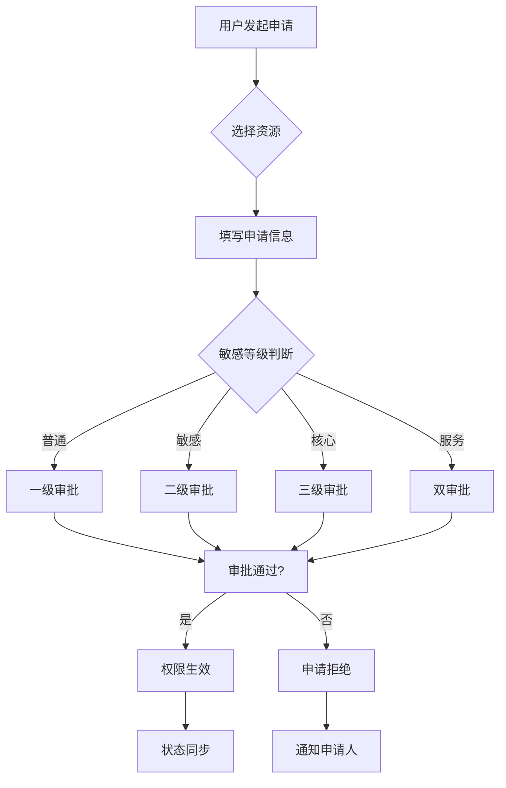
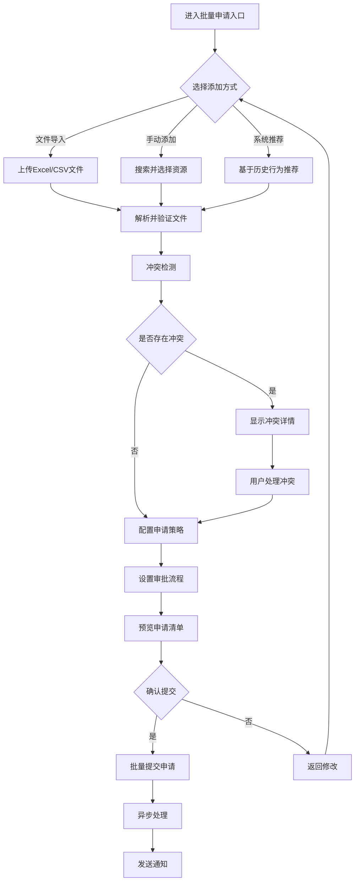
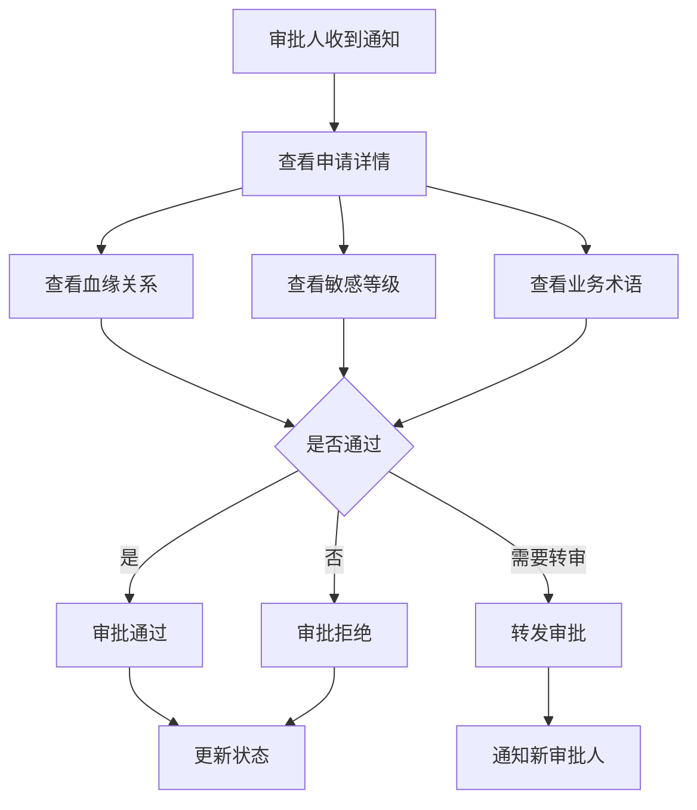

## 1. 产品概述
权限申请模块是数据资产管理平台的核心功能，提供资产/资源权限的申请、审批、进度查询全流程管理。通过集成业务语义、敏感标记、血缘信息，支撑高效合规的权限管控，实现权限申请闭环管理。

目标用户包括数据使用者（申请权限）、审批者（各级管理员）、系统管理员（权限管理），解决权限申请流程复杂、审批决策缺乏数据支撑、权限状态不同步等问题。

## 2. 核心功能

### 2.1 用户角色
| 角色 | 注册方式 | 核心权限 |
|------|----------|----------|
| 普通用户 | 企业SSO/邮箱注册 | 申请权限、查看申请进度、使用已授权资源 |
| 直属上级 | 系统自动分配 | 一级审批、转发审批、查看下属申请记录 |
| 数据管理员 | 管理员分配 | 二级审批、敏感资源审批、权限回收 |
| 业务负责人 | 管理员分配 | 核心资产审批、业务规则制定 |
| 技术负责人 | 管理员分配 | 服务资源审批、技术规范审核 |
| 系统管理员 | 管理员创建 | 权限配置、审批规则设置、系统监控 |

### 2.2 功能模块
权限申请模块包含以下核心页面：
1. **权限申请页**：申请信息填写、资源选择、申请提交
2. **批量权限申请入口页**：批量资源选择、申请策略配置、冲突检测
3. **审批管理页**：待审批列表、审批操作、审批历史
4. **申请进度页**：进度查询、状态跟踪、消息通知
5. **权限管理页**：权限查看、权限回收、有效期管理

### 2.3 页面详情
| 页面名称 | 模块名称 | 功能描述 |
|----------|----------|----------|
| 权限申请页 | 资源选择器 | 支持按名称、类型、标签搜索资产/资源；单选/多选模式切换；显示资源基础信息、敏感等级、业务术语 |
| 权限申请页 | 申请信息表单 | 自动填充资源名称、数据库类型、业务模块、敏感等级；选择权限类型（查看/编辑/调用/订阅）；设置申请期限（永久/临时）；填写申请理由（必填，支持模板选择） |
| 权限申请页 | 批量申请 | 支持勾选多个资源批量发起申请；显示批量申请资源清单；统一设置权限类型和期限 |
| 批量权限申请入口页 | 资源批量选择 | 支持文件导入（Excel/CSV）、手动添加、系统推荐三种方式；提供资源模板下载；实时显示选择进度和统计 |
| 批量权限申请入口页 | 申请策略配置 | 统一设置权限类型、申请期限、申请理由；支持按资源类型分组配置；提供批量申请模板保存功能 |
| 批量权限申请入口页 | 冲突检测 | 自动检测已拥有权限、重复申请、权限互斥；显示冲突详情和解决建议；支持一键清理冲突项目 |
| 批量权限申请入口页 | 审批联动设置 | 设置批量申请的审批流程；支持统一审批和分组审批；设置紧急程度和优先级 |
| 批量权限申请入口页 | 应用/数据兼容检查 | 自动检查应用权限和数据权限的兼容性；提示权限依赖关系；推荐最佳权限组合 |
| 批量权限申请入口页 | 批量策略应用 | 支持按业务域、敏感等级、资源类型等维度批量设置；提供策略模板库；支持自定义策略保存 |
| 批量权限申请入口页 | 性能优化 | 分页加载大量资源；支持异步处理和进度显示；提供批量操作结果反馈 |
| 批量权限申请入口页 | 消息同步配置 | 设置批量申请的通知方式；支持审批进度批量通知；配置结果反馈渠道 |
| 审批管理页 | 待审批列表 | 按审批级别筛选（一级/二级/三级）；显示申请信息摘要（申请人、资源、权限类型、申请时间）；支持快速审批操作 |
| 审批管理页 | 审批详情 | 展示业务术语、血缘关系、敏感等级、资源用途；显示历史审批记录；支持通过/拒绝/转发操作；填写审批意见 |
| 申请进度页 | 进度展示 | 显示申请状态（待审批/已通过/已拒绝/审批中）；展示当前审批人、审批时间轴；支持催办功能 |
| 申请进度页 | 消息中心 | 审批状态变更推送；权限到期提醒；系统通知管理 |
| 申请进度页 | 历史记录 | 展示用户过往申请记录；支持按时间、状态、资源类型筛选；提供导出功能 |
| 权限管理页 | 权限视图 | 列表/卡片视图切换；显示权限详情（资源信息、权限类型、有效期）；支持权限续期申请 |
| 权限管理页 | 权限回收 | 管理员手动回收权限；批量回收功能；回收原因记录；状态同步更新 |

## 3. 核心流程

### 3.1 权限申请流程

### 3.3 批量权限申请流程

### 3.2 审批决策流程

## 4. 用户界面设计

### 4.1 设计风格
- **主色调**：蓝色系（#1890ff）体现专业性，绿色（#52c41a）表示通过状态，红色（#ff4d4f）表示拒绝状态
- **按钮样式**：圆角矩形，主操作使用填充样式，次要操作使用边框样式
- **字体规范**：主标题16px加粗，正文14px常规，辅助文字12px
- **布局风格**：卡片式布局，左侧导航+右侧内容区域，响应式栅格系统
- **图标风格**：使用Arco Design图标库，线性风格，统一尺寸

### 4.2 页面设计概述
| 页面名称 | 模块名称 | UI元素 |
|----------|----------|--------|
| 权限申请页 | 资源选择器 | 搜索框置顶，支持模糊搜索；资源列表采用卡片布局，显示名称、类型、标签；多选模式下显示选中数量 |
| 权限申请页 | 申请表单 | 分组表单设计，基础信息、权限设置、申请理由分开展示；敏感资源自动高亮提示；申请理由提供模板快速选择 |
| 审批管理页 | 待审批列表 | 表格展示，包含申请人、资源、权限类型、申请时间；状态标签区分不同审批级别；操作按钮固定在右侧 |
| 审批管理页 | 审批详情 | 左侧展示申请信息，右侧展示资源详情；血缘关系使用树形图展示；审批操作区域固定在底部 |
| 申请进度页 | 进度时间轴 | 垂直时间轴展示审批流程，不同状态使用不同颜色标识；当前步骤高亮显示；支持点击查看详细意见 |
| 批量权限申请入口页 | 资源选择区域 | 左侧分类导航树，右侧资源列表；支持拖拽调整选择顺序；顶部显示选中数量统计和操作按钮 |
| 批量权限申请入口页 | 冲突检测结果 | 卡片式展示冲突信息，包含冲突类型、涉及资源、解决建议；支持批量处理和单独处理 |
| 批量权限申请入口页 | 策略配置面板 | 分组表单设计，按权限类型、申请期限、申请理由分类；提供常用模板快速选择；显示预估审批时长 |
| 批量权限申请入口页 | 批量预览弹窗 | 表格展示所有申请项，支持筛选和排序；显示每个申请的状态预测；提供导出功能 |

### 4.3 响应式设计
- **桌面端优先**：基础设计基于1920x1080分辨率，支持最小1366px宽度
- **平板适配**：768px-1024px宽度下，侧边栏收起，表格转为卡片布局
- **移动端适配**：小于768px时，采用底部导航，表单变为单列布局
- **触摸优化**：移动端增大点击区域，支持滑动操作，优化触摸反馈

## 5. 数据权限与应用权限兼容性

### 5.1 权限类型映射
| 应用权限 | 数据权限 | 适用场景 |
|----------|----------|----------|
| 查看 | SELECT | 数据查询、报表查看 |
| 编辑 | UPDATE/INSERT | 数据修改、记录新增 |
| 调用 | EXECUTE | API调用、服务访问 |
| 订阅 | READ + NOTIFY | 数据变更订阅、消息通知 |

### 5.2 统一审批规则
- **权限合并申请**：支持同时申请应用和数据权限，自动匹配对应关系
- **分级审批策略**：根据资源敏感等级确定审批级别，不受权限类型影响
- **状态同步机制**：应用权限和数据权限状态保持一致，统一展示和管理