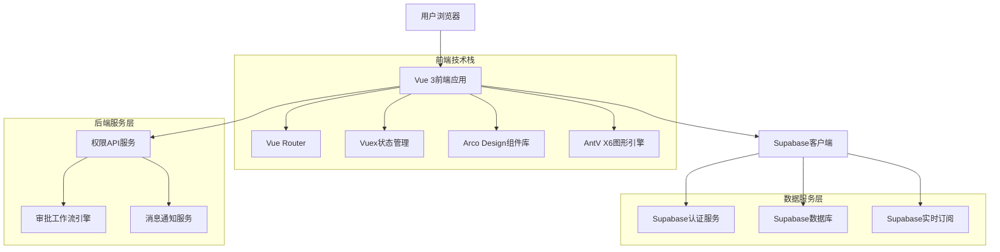
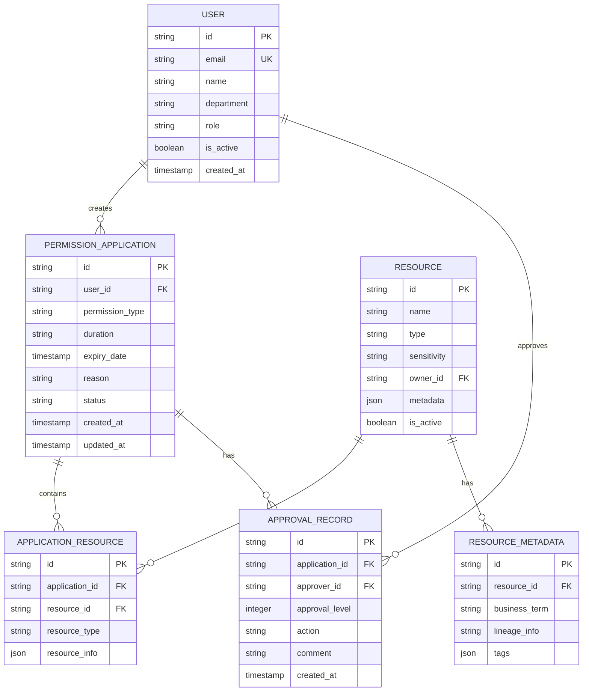

## 1. 架构设计



## 2. 技术描述

- **前端框架**: Vue 3 (Composition API) + TypeScript
- **构建工具**: Vite
- **UI组件库**: Arco Design Vue
- **图形引擎**: AntV X6（用于血缘关系展示）
- **状态管理**: Vuex 4
- **路由管理**: Vue Router 4
- **后端服务**: Supabase（认证+数据库+实时功能）
- **初始化工具**: vite-init

## 3. 路由定义

| 路由路径 | 页面名称 | 功能描述 |
|----------|----------|----------|
| /permission/apply | 权限申请页 | 发起权限申请，支持单资源/批量申请 |
| /permission/approval | 审批管理页 | 审批人处理待审批事项，查看审批历史 |
| /permission/progress | 申请进度页 | 查看个人申请进度和历史记录 |
| /permission/manage | 权限管理页 | 管理已授权权限，支持回收和续期 |
| /permission/resource/:id | 资源详情页 | 查看资源详情和权限申请入口 |

## 4. API定义

### 4.1 权限申请API

```typescript
// 申请权限请求
POST /api/permission/apply

Request Body:
{
  userId: string;          // 申请人ID
  resourceIds: string[];   // 资源ID数组
  permissionType: 'view' | 'edit' | 'execute' | 'subscribe'; // 权限类型
  duration: 'permanent' | 'temporary'; // 申请期限
  expiryDate?: string;     // 临时权限到期时间
  reason: string;          // 申请理由
  templateId?: string;     // 申请理由模板ID
}

Response:
{
  success: boolean;
  applicationId: string;   // 申请单ID
  status: 'pending' | 'approved' | 'rejected';
  message: string;
}
```

### 4.2 审批管理API

```typescript
// 获取待审批列表
GET /api/permission/approvals?status=pending&level=1

Response:
{
  applications: Array<{
    id: string;
    applicant: {
      id: string;
      name: string;
      department: string;
    };
    resource: {
      id: string;
      name: string;
      type: string;
      sensitivity: 'normal' | 'sensitive' | 'core';
    };
    permissionType: string;
    applyTime: string;
    currentApprover: string;
  }>;
  total: number;
}

// 审批操作
PUT /api/permission/approval/:id

Request Body:
{
  action: 'approve' | 'reject' | 'forward';
  comment: string;         // 审批意见
  forwardTo?: string;     // 转发目标用户ID
}
```

### 4.3 进度查询API

```typescript
// 获取申请进度
GET /api/permission/progress/:applicationId

Response:
{
  application: {
    id: string;
    status: 'pending' | 'approved' | 'rejected' | 'processing';
    applyTime: string;
    resourceCount: number;
    permissionType: string;
  };
  timeline: Array<{
    step: number;
    approver: string;
    action: 'pending' | 'approved' | 'rejected' | 'forwarded';
    time: string;
    comment: string;
  }>;
  currentStep: number;
}
```

## 5. 数据模型

### 5.1 实体关系图



### 5.2 数据表定义

```sql
-- 权限申请表
CREATE TABLE permission_applications (
    id UUID PRIMARY KEY DEFAULT gen_random_uuid(),
    user_id UUID NOT NULL REFERENCES users(id),
    permission_type VARCHAR(20) NOT NULL CHECK (permission_type IN ('view', 'edit', 'execute', 'subscribe')),
    duration VARCHAR(20) NOT NULL CHECK (duration IN ('permanent', 'temporary')),
    expiry_date TIMESTAMP WITH TIME ZONE,
    reason TEXT NOT NULL,
    status VARCHAR(20) DEFAULT 'pending' CHECK (status IN ('pending', 'approved', 'rejected', 'processing')),
    created_at TIMESTAMP WITH TIME ZONE DEFAULT NOW(),
    updated_at TIMESTAMP WITH TIME ZONE DEFAULT NOW()
);

-- 申请资源关联表
CREATE TABLE application_resources (
    id UUID PRIMARY KEY DEFAULT gen_random_uuid(),
    application_id UUID NOT NULL REFERENCES permission_applications(id),
    resource_id UUID NOT NULL REFERENCES resources(id),
    resource_type VARCHAR(50) NOT NULL,
    resource_info JSONB,
    created_at TIMESTAMP WITH TIME ZONE DEFAULT NOW()
);

-- 审批记录表
CREATE TABLE approval_records (
    id UUID PRIMARY KEY DEFAULT gen_random_uuid(),
    application_id UUID NOT NULL REFERENCES permission_applications(id),
    approver_id UUID NOT NULL REFERENCES users(id),
    approval_level INTEGER NOT NULL CHECK (approval_level >= 1 AND approval_level <= 3),
    action VARCHAR(20) NOT NULL CHECK (action IN ('approve', 'reject', 'forward', 'pending')),
    comment TEXT,
    created_at TIMESTAMP WITH TIME ZONE DEFAULT NOW()
);

-- 用户权限表（存储最终授权结果）
CREATE TABLE user_permissions (
    id UUID PRIMARY KEY DEFAULT gen_random_uuid(),
    user_id UUID NOT NULL REFERENCES users(id),
    resource_id UUID NOT NULL REFERENCES resources(id),
    permission_type VARCHAR(20) NOT NULL,
    granted_by UUID NOT NULL REFERENCES users(id),
    expiry_date TIMESTAMP WITH TIME ZONE,
    is_active BOOLEAN DEFAULT true,
    created_at TIMESTAMP WITH TIME ZONE DEFAULT NOW(),
    updated_at TIMESTAMP WITH TIME ZONE DEFAULT NOW()
);

-- 创建索引
CREATE INDEX idx_applications_user_id ON permission_applications(user_id);
CREATE INDEX idx_applications_status ON permission_applications(status);
CREATE INDEX idx_approval_records_application_id ON approval_records(application_id);
CREATE INDEX idx_user_permissions_user_resource ON user_permissions(user_id, resource_id);

-- 权限设置
GRANT SELECT ON permission_applications TO anon;
GRANT ALL PRIVILEGES ON permission_applications TO authenticated;
GRANT SELECT ON application_resources TO anon;
GRANT ALL PRIVILEGES ON application_resources TO authenticated;
GRANT SELECT ON approval_records TO anon;
GRANT ALL PRIVILEGES ON approval_records TO authenticated;
GRANT SELECT ON user_permissions TO anon;
GRANT ALL PRIVILEGES ON user_permissions TO authenticated;
```

## 6. 实时功能设计

### 6.1 审批状态实时推送
```typescript
// 使用Supabase实时订阅
const subscription = supabase
  .channel('approval-status')
  .on('postgres_changes', 
    { event: 'INSERT', schema: 'public', table: 'approval_records' },
    payload => {
      // 处理新的审批记录
      handleNewApproval(payload.new);
    }
  )
  .subscribe();
```

### 6.2 权限到期提醒
```typescript
// 定时任务检查即将到期的权限
const checkExpiringPermissions = async () => {
  const { data, error } = await supabase
    .from('user_permissions')
    .select('*')
    .eq('is_active', true)
    .lt('expiry_date', new Date(Date.now() + 7 * 24 * 60 * 60 * 1000)); // 7天内到期
  
  // 发送到期提醒通知
  data?.forEach(permission => {
    sendExpiryNotification(permission);
  });
};
```

## 7. 安全与性能优化

### 7.1 安全措施
- **行级安全策略(RLS)**：确保用户只能查看和操作自己的申请记录
- **审批权限验证**：每次审批操作都验证用户是否有相应审批权限
- **敏感数据脱敏**：在展示界面中对敏感资源信息进行脱敏处理
- **操作日志记录**：记录所有关键操作，便于审计追踪

### 7.2 性能优化
- **分页查询**：审批列表和申请记录使用分页加载
- **索引优化**：为常用查询字段建立复合索引
- **缓存策略**：对资源元数据和用户信息使用本地缓存
- **懒加载**：血缘关系图等复杂组件采用懒加载方式