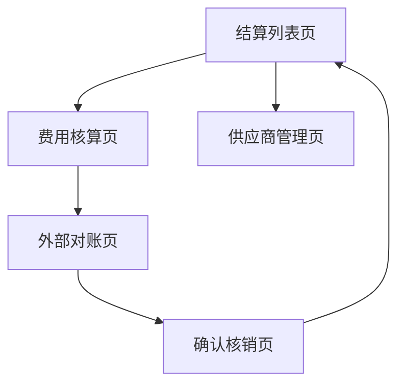

## 1. 产品概述
结算管理系统用于管理外数产品的费用结算流程，实现从费用核算到最终核销的完整闭环管理。系统通过三状态流程（费用核算→外部对账→确认核销）确保结算数据的准确性和可追溯性。

目标用户为财务部门和供应商管理人员，帮助他们高效处理外数产品的结算业务，提升结算效率和数据准确性。

## 2. 核心功能

### 2.1 用户角色
| 角色 | 注册方式 | 核心权限 |
|------|----------|----------|
| 财务专员 | 管理员分配账号 | 发起结算、费用核算、外部对账、确认核销 |
| 供应商管理员 | 管理员分配账号 | 查看本供应商结算任务、上传对账文件、确认核销 |
| 系统管理员 | 管理员分配账号 | 用户管理、系统配置、数据查看 |

### 2.2 功能模块
结算管理系统包含以下主要页面：
1. **结算列表页**：展示所有结算任务，支持按供应商筛选和状态查询。
2. **费用核算页**：展示外数产品用量数据，支持手动调整和核算确认。
3. **外部对账页**：展示对账详情，支持上传对账文件和差异标记。
4. **确认核销页**：最终确认结算金额，完成核销操作。
5. **供应商管理页**：维护供应商信息和结算规则配置。

### 2.3 页面详情
| 页面名称 | 模块名称 | 功能描述 |
|----------|----------|----------|
| 结算列表页 | 任务列表 | 显示所有结算任务，包含任务编号、供应商、状态、创建时间等基本信息 |
| 结算列表页 | 筛选搜索 | 支持按供应商、结算状态、时间范围进行筛选查询 |
| 结算列表页 | 发起结算 | 选择供应商和结算周期，发起新的结算任务 |
| 费用核算页 | 用量数据展示 | 展示该供应商外数产品的用量数据（来自数据底表） |
| 费用核算页 | 费用计算 | 根据用量和单价自动计算费用总额 |
| 费用核算页 | 核算确认 | 确认核算结果，进入外部对账环节 |
| 外部对账页 | 对账文件上传 | 支持上传供应商提供的对账文件 |
| 外部对账页 | 差异对比 | 系统自动对比内部数据与外部对账文件，标记差异项 |
| 外部对账页 | 差异处理 | 支持逐条核对账单，标记差异原因和处理方式 |
| 外部对账页 | 对账确认 | 完成对账后进入确认核销环节 |
| 确认核销页 | 结算详情 | 展示最终结算金额、差异处理结果等详细信息 |
| 确认核销页 | 核销确认 | 确认无误后完成核销，更新结算状态 |
| 供应商管理页 | 供应商列表 | 展示所有供应商基本信息 |
| 供应商管理页 | 结算规则配置 | 设置各供应商的结算周期、单价规则等参数 |

## 3. 核心流程

### 3.1 结算流程
1. 财务专员在结算列表页点击"发起结算"
2. 选择供应商和结算周期，系统根据数据底表获取外数产品用量
3. 进入费用核算页，系统自动计算费用，专员确认后提交
4. 进入外部对账页，供应商管理员上传对账文件
5. 系统对比内外数据，标记差异，支持逐条核对
6. 差异处理完成后，进入确认核销页
7. 财务专员确认最终结算金额，完成核销

### 3.2 页面导航流程

## 4. 用户界面设计

### 4.1 设计风格
- **主色调**：蓝色系（#1890ff）为主，体现专业可信的财务系统形象
- **辅助色**：绿色（#52c41a）表示成功状态，红色（#ff4d4f）表示异常或差异
- **按钮样式**：圆角矩形，主要操作为实心按钮，次要操作为线框按钮
- **字体**：系统默认字体，主标题16px，正文14px，辅助文字12px
- **布局风格**：卡片式布局，顶部导航栏+左侧菜单的经典后台布局
- **图标风格**：使用简洁的线性图标，保持界面清爽

### 4.2 页面设计概述
| 页面名称 | 模块名称 | UI元素 |
|----------|----------|--------|
| 结算列表页 | 任务列表 | 表格展示，包含状态标签（待核算/对账中/已核销），操作列显示"查看"按钮 |
| 费用核算页 | 用量数据展示 | 卡片式布局展示用量统计，表格展示详细用量明细 |
| 外部对账页 | 差异对比 | 左右分栏对比展示，差异项用红色高亮标记 |
| 确认核销页 | 结算详情 | 汇总信息卡片+详细列表，重要数据加粗显示 |
| 供应商管理页 | 供应商列表 | 简洁的表格展示，支持快速搜索和筛选 |

### 4.3 响应式设计
- **桌面优先**：主要面向桌面端用户设计，确保在大屏幕上的最佳体验
- **移动端适配**：支持平板设备的基本操作，手机端仅支持查看功能
- **交互优化**：表格支持横向滚动，确保数据完整展示