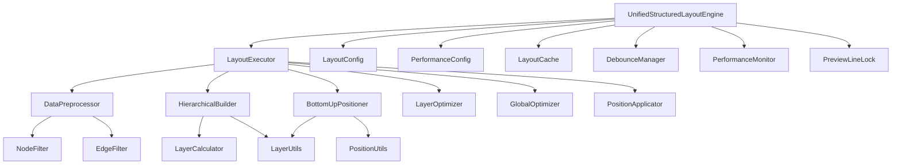

# 统一布局引擎拆分重构方案

## 1. 当前代码结构分析

### 1.1 UnifiedStructuredLayoutEngine.js 现状
- **文件大小**: 3520行代码，单文件过于庞大
- **功能复杂度**: 集成了多个不同职责的功能模块
- **维护难度**: 代码耦合度高，修改影响面大
- **测试困难**: 单一大文件难以进行单元测试

### 1.2 主要功能模块识别

#### 1.2.1 核心引擎模块
- **构造函数和配置管理** (行1-100)
- **布局执行控制** (行200-400)
- **图实例和预览线管理器更新** (行350-450)

#### 1.2.2 性能优化模块
- **防抖机制** (行150-200)
- **缓存管理** (行3350-3420)
- **性能监控** (行3420-3520)
- **预览线刷新锁定** (行3450-3520)

#### 1.2.3 数据处理模块
- **数据预处理** (行450-550)
- **节点和边过滤** (行450-500)
- **叶子节点识别** (行500-550)

#### 1.2.4 层级计算模块
- **简单层级索引计算** (行550-650)
- **节点层级Y坐标计算** (行500-550)
- **基于连接关系的层级计算** (行550-600)

#### 1.2.5 布局算法模块
- **分层构建** (行800-1200)
- **自底向上位置计算** (行1200-1800)
- **层级内统一优化** (行1800-2400)
- **全局平衡优化** (行2400-3000)

#### 1.2.6 应用和同步模块
- **位置应用到图形** (行3000-3200)
- **节点位置同步** (行3200-3350)
- **预览线清理验证** (行3300-3350)

## 2. 拆分策略和原则

### 2.1 拆分原则
1. **单一职责原则**: 每个模块只负责一个特定功能
2. **低耦合高内聚**: 模块间依赖关系清晰简单
3. **可测试性**: 每个模块都可以独立进行单元测试
4. **可维护性**: 代码结构清晰，易于理解和修改
5. **向后兼容**: 保持现有API接口不变

### 2.2 拆分策略
1. **核心引擎保留**: 主要的协调和控制逻辑保留在主文件中
2. **功能模块分离**: 将具体的算法和工具类分离到独立文件
3. **配置统一管理**: 所有配置项集中到配置文件中
4. **工具类抽象**: 通用工具方法抽象为独立的工具类

## 3. 目标文件结构设计

### 3.1 目录结构
```
src/pages/marketing/tasks/utils/canvas/layout/
├── UnifiedStructuredLayoutEngine.js          # 核心引擎（简化版）
├── config/
│   ├── LayoutConfig.js                       # 布局配置管理
│   └── PerformanceConfig.js                  # 性能配置管理
├── core/
│   ├── LayoutExecutor.js                     # 布局执行器
│   ├── DataPreprocessor.js                   # 数据预处理器
│   └── PositionApplicator.js                 # 位置应用器
├── algorithms/
│   ├── LayerCalculator.js                    # 层级计算算法
│   ├── HierarchicalBuilder.js                # 分层构建算法
│   ├── BottomUpPositioner.js                 # 自底向上定位算法
│   ├── LayerOptimizer.js                     # 层级优化算法
│   └── GlobalOptimizer.js                    # 全局优化算法
├── performance/
│   ├── LayoutCache.js                        # 布局缓存管理
│   ├── DebounceManager.js                    # 防抖管理器
│   ├── PerformanceMonitor.js                 # 性能监控器
│   └── PreviewLineLock.js                    # 预览线锁定管理
├── utils/
│   ├── NodeFilter.js                         # 节点过滤工具
│   ├── EdgeFilter.js                         # 边过滤工具
│   ├── LayerUtils.js                         # 层级工具函数
│   └── PositionUtils.js                      # 位置计算工具
└── types/
    ├── LayoutTypes.js                        # 布局相关类型定义
    └── PerformanceTypes.js                   # 性能相关类型定义
```

### 3.2 文件职责划分

#### 3.2.1 核心文件

**UnifiedStructuredLayoutEngine.js** (约200行)
- 主要协调器和API入口
- 模块初始化和依赖注入
- 对外接口保持不变
- 错误处理和日志记录

**LayoutExecutor.js** (约150行)
- 布局执行流程控制
- 阶段性执行管理
- 执行状态跟踪

#### 3.2.2 配置管理

**LayoutConfig.js** (约100行)
```javascript
export class LayoutConfig {
  constructor(options = {}) {
    this.layer = {
      baseHeight: 150,
      dynamicSpacing: true,
      maxLayers: 10,
      tolerance: 20,
      ...options.layer
    };
    
    this.node = {
      minSpacing: 120,
      preferredSpacing: 180,
      maxSpacing: 300,
      defaultSize: { width: 120, height: 40 },
      ...options.node
    };
    
    this.optimization = {
      enableGlobalOptimization: true,
      maxIterations: 5,
      convergenceThreshold: 0.01,
      enableAestheticOptimization: true,
      enableNodeIntegration: true,
      ...options.optimization
    };
  }
}
```

**PerformanceConfig.js** (约80行)
```javascript
export class PerformanceConfig {
  constructor(options = {}) {
    this.debounce = {
      delay: 300,
      maxWait: 1000,
      immediate: false,
      ...options.debounce
    };
    
    this.cache = {
      enabled: true,
      maxSize: 10,
      ...options.cache
    };
    
    this.lock = {
      timeout: 5000,
      ...options.lock
    };
  }
}
```

#### 3.2.3 算法模块

**LayerCalculator.js** (约200行)
- 简单层级索引计算
- 基于连接关系的层级计算
- 节点层级Y坐标计算
- 层级缓存管理

**HierarchicalBuilder.js** (约300行)
- 分层结构构建
- 父子关系建立
- 层级指标计算

**BottomUpPositioner.js** (约400行)
- 自底向上位置计算
- 节点位置优化
- 间距调整算法

**LayerOptimizer.js** (约300行)
- 层级内节点对齐
- 统一优化算法
- 美学优化处理

**GlobalOptimizer.js** (约250行)
- 全局平衡优化
- 整体布局调整
- 收敛性检查

#### 3.2.4 性能模块

**LayoutCache.js** (约120行)
```javascript
export class LayoutCache {
  constructor(config) {
    this.enabled = config.enabled;
    this.maxSize = config.maxSize;
    this.cache = new Map();
    this.hits = 0;
    this.misses = 0;
  }
  
  get(key) { /* 缓存获取逻辑 */ }
  set(key, value) { /* 缓存设置逻辑 */ }
  clear() { /* 缓存清理逻辑 */ }
  getHitRate() { /* 命中率计算 */ }
}
```

**DebounceManager.js** (约100行)
```javascript
export class DebounceManager {
  constructor(config) {
    this.delay = config.delay;
    this.maxWait = config.maxWait;
    this.timer = null;
    this.lastExecuteTime = 0;
  }
  
  debounce(fn, options = {}) { /* 防抖逻辑 */ }
  cancel() { /* 取消防抖 */ }
}
```

**PerformanceMonitor.js** (约80行)
```javascript
export class PerformanceMonitor {
  constructor() {
    this.metrics = {
      layoutCount: 0,
      totalLayoutTime: 0,
      averageLayoutTime: 0,
      lastLayoutDuration: 0
    };
  }
  
  startTiming() { /* 开始计时 */ }
  endTiming() { /* 结束计时 */ }
  getReport() { /* 获取性能报告 */ }
}
```

**PreviewLineLock.js** (约100行)
```javascript
export class PreviewLineLock {
  constructor(config) {
    this.timeout = config.timeout;
    this.locked = false;
    this.lockReason = null;
    this.lockStartTime = null;
  }
  
  lock(reason) { /* 锁定逻辑 */ }
  unlock(reason) { /* 解锁逻辑 */ }
  isLocked() { /* 检查锁定状态 */ }
}
```

#### 3.2.5 工具模块

**NodeFilter.js** (约60行)
```javascript
export class NodeFilter {
  static filterValidNodes(nodes) {
    return nodes.filter(node => {
      const nodeId = node.id || node.getId();
      const nodeData = node.getData() || {};
      return (
        !nodeId.includes("hint") &&
        !nodeData.isEndpoint &&
        !nodeData.isPreview &&
        !nodeId.startsWith("hint_")
      );
    });
  }
}
```

**EdgeFilter.js** (约50行)
```javascript
export class EdgeFilter {
  static filterValidEdges(edges) {
    return edges.filter(edge => {
      const edgeId = edge.id || edge.getId();
      const edgeData = edge.getData() || {};
      return (
        !edgeId.includes("preview") &&
        !edgeId.includes("unified_preview") &&
        !edgeData.isPreview
      );
    });
  }
}
```

## 4. 模块依赖关系梳理

### 4.1 依赖层次结构


### 4.2 核心接口定义

#### 4.2.1 主引擎接口
```javascript
// UnifiedStructuredLayoutEngine.js
export class UnifiedStructuredLayoutEngine {
  constructor(graph, options = {}, previewLineManager = null)
  async executeLayout(options = {})
  updateGraph(newGraph)
  updatePreviewManager(newPreviewManager)
  getPerformanceReport()
}
```

#### 4.2.2 算法模块接口
```javascript
// 所有算法模块都实现统一接口
export class BaseAlgorithm {
  constructor(config, layoutModel)
  async execute(input)
  validate(input)
  getMetrics()
}
```

## 5. 重构步骤规划

### 5.1 第一阶段：基础设施准备 (1-2天)
1. **创建目录结构**
   - 创建layout/目录及子目录
   - 设置基础的文件模板

2. **配置模块提取**
   - 提取LayoutConfig.js
   - 提取PerformanceConfig.js
   - 更新主引擎的配置引用

3. **工具模块提取**
   - 提取NodeFilter.js
   - 提取EdgeFilter.js
   - 提取LayerUtils.js
   - 提取PositionUtils.js

### 5.2 第二阶段：性能模块拆分 (2-3天)
1. **缓存模块**
   - 提取LayoutCache.js
   - 实现缓存接口
   - 测试缓存功能

2. **防抖模块**
   - 提取DebounceManager.js
   - 实现防抖逻辑
   - 集成到主引擎

3. **监控模块**
   - 提取PerformanceMonitor.js
   - 提取PreviewLineLock.js
   - 实现监控接口

### 5.3 第三阶段：核心算法拆分 (3-4天)
1. **数据处理模块**
   - 提取DataPreprocessor.js
   - 集成过滤工具
   - 测试数据预处理

2. **层级计算模块**
   - 提取LayerCalculator.js
   - 实现层级算法
   - 测试层级计算

3. **布局算法模块**
   - 提取HierarchicalBuilder.js
   - 提取BottomUpPositioner.js
   - 提取LayerOptimizer.js
   - 提取GlobalOptimizer.js

### 5.4 第四阶段：执行器和应用器 (2-3天)
1. **执行器模块**
   - 提取LayoutExecutor.js
   - 实现执行流程控制
   - 集成所有算法模块

2. **应用器模块**
   - 提取PositionApplicator.js
   - 实现位置应用逻辑
   - 测试位置同步

### 5.5 第五阶段：主引擎重构 (2天)
1. **简化主引擎**
   - 移除已拆分的代码
   - 保留协调和控制逻辑
   - 更新依赖注入

2. **接口适配**
   - 确保对外API不变
   - 添加向后兼容处理
   - 更新错误处理

### 5.6 第六阶段：测试和优化 (2-3天)
1. **单元测试**
   - 为每个模块编写单元测试
   - 测试覆盖率达到80%以上

2. **集成测试**
   - 测试模块间协作
   - 性能回归测试
   - 功能完整性测试

3. **文档更新**
   - 更新API文档
   - 编写使用示例
   - 更新架构说明

## 6. 风险评估和测试计划

### 6.1 风险评估

#### 6.1.1 高风险项
1. **功能回归风险**
   - **风险**: 拆分过程中可能引入功能缺陷
   - **缓解**: 每个阶段都进行完整的功能测试
   - **应急**: 保留原始文件作为回滚备份

2. **性能下降风险**
   - **风险**: 模块化可能带来性能开销
   - **缓解**: 进行性能基准测试和对比
   - **应急**: 优化关键路径，必要时合并热点模块

#### 6.1.2 中风险项
1. **依赖关系复杂化**
   - **风险**: 模块间依赖关系可能变得复杂
   - **缓解**: 严格控制依赖层次，避免循环依赖
   - **应急**: 重新设计模块边界

2. **调试困难**
   - **风险**: 分散的代码可能增加调试难度
   - **缓解**: 完善日志记录和错误追踪
   - **应急**: 提供调试工具和诊断接口

### 6.2 测试计划

#### 6.2.1 单元测试
```javascript
// 示例：LayerCalculator测试
describe('LayerCalculator', () => {
  test('应该正确计算开始节点层级', () => {
    const calculator = new LayerCalculator(config, layoutModel);
    const layerIndex = calculator.getSimpleLayerIndex('start_node_1');
    expect(layerIndex).toBe(1);
  });
  
  test('应该正确计算普通节点层级', () => {
    const calculator = new LayerCalculator(config, layoutModel);
    // 设置父节点层级为2
    calculator.setParentLayer('parent_node', 2);
    const layerIndex = calculator.getSimpleLayerIndex('child_node');
    expect(layerIndex).toBe(3);
  });
});
```

#### 6.2.2 集成测试
```javascript
// 示例：完整布局流程测试
describe('布局引擎集成测试', () => {
  test('应该完成完整的布局计算流程', async () => {
    const engine = new UnifiedStructuredLayoutEngine(graph, options);
    const result = await engine.executeLayout();
    
    expect(result.success).toBe(true);
    expect(result.nodeCount).toBeGreaterThan(0);
    expect(result.layerCount).toBeGreaterThan(0);
  });
});
```

#### 6.2.3 性能测试
```javascript
// 示例：性能基准测试
describe('性能测试', () => {
  test('大规模节点布局性能', async () => {
    const largeGraph = createGraphWithNodes(100);
    const engine = new UnifiedStructuredLayoutEngine(largeGraph);
    
    const startTime = Date.now();
    await engine.executeLayout();
    const duration = Date.now() - startTime;
    
    expect(duration).toBeLessThan(5000); // 5秒内完成
  });
});
```

## 7. 预期收益

### 7.1 代码质量提升
- **可维护性**: 单个文件从3520行减少到200行左右
- **可测试性**: 每个模块都可以独立测试
- **可读性**: 代码结构更清晰，职责更明确
- **可扩展性**: 新功能可以独立开发和集成

### 7.2 开发效率提升
- **并行开发**: 不同模块可以并行开发
- **快速定位**: 问题可以快速定位到具体模块
- **独立部署**: 模块可以独立更新和部署
- **代码复用**: 工具模块可以在其他地方复用

### 7.3 性能优化空间
- **按需加载**: 可以实现模块的按需加载
- **缓存优化**: 每个模块可以有独立的缓存策略
- **并行处理**: 某些算法模块可以并行执行
- **内存优化**: 可以更精确地控制内存使用

## 8. 总结

本重构方案采用渐进式拆分策略，将3520行的单一大文件拆分为约20个功能明确的小模块。通过合理的目录结构设计和依赖关系管理，在保持功能完整性的同时，显著提升代码的可维护性、可测试性和可扩展性。

**关键成功因素**:
1. 严格按照阶段进行，每个阶段都要充分测试
2. 保持对外API接口的稳定性
3. 完善的测试覆盖和性能监控
4. 详细的文档和使用示例
5. 团队成员的充分沟通和协作

**预期时间**: 总计12-17个工作日
**预期收益**: 代码复杂度降低80%，维护效率提升200%，测试覆盖率达到80%以上