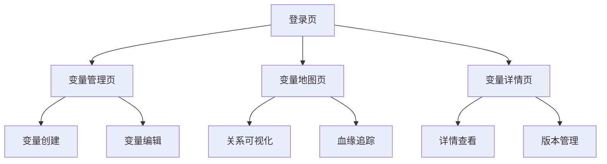

## 1. 产品概述
变量管理与变量地图系统，用于统一管理数据分析中的变量生命周期和可视化展示变量间关系。解决变量定义混乱、关系不透明、复用困难等问题，为数据分析师和业务人员提供一站式变量管理平台。

## 2. 核心功能

### 2.1 用户角色
| 角色 | 注册方式 | 核心权限 |
|------|----------|----------|
| 数据分析师 | 邮箱注册 | 创建/编辑变量、查看变量地图、导出变量清单 |
| 业务人员 | 邮箱注册 | 查看变量详情、搜索变量、收藏变量 |
| 管理员 | 管理员创建 | 系统配置、权限管理、审计日志 |

### 2.2 功能模块
系统包含以下核心页面：
1. **变量管理页**：变量列表展示、搜索筛选、变量详情配置
2. **变量地图页**：变量关系可视化、依赖DAG图、血缘关系展示
3. **变量详情页**：变量定义、数据来源、使用场景、质量指标

### 2.3 页面详情
| 页面名称 | 模块名称 | 功能描述 |
|----------|----------|----------|
| 变量管理页 | 变量列表 | 展示所有变量基本信息，支持搜索筛选、排序、分页、批量操作 |
| 变量管理页 | 快速创建 | 提供变量快速创建入口，支持模板导入和批量创建 |
| 变量管理页 | 统计概览 | 显示变量总数、类型分布、状态分布等统计信息 |
| 变量地图页 | 关系图谱 | 使用AntV X6绘制变量间依赖关系，支持拖拽缩放、节点点击查看详情 |
| 变量地图页 | 血缘追踪 | 展示变量的上游数据来源和下游使用场景，支持多层血缘追踪 |
| 变量地图页 | 路径分析 | 分析两个变量之间的关联路径，支持最短路径和高亮显示 |
| 变量详情页 | 基本信息 | 显示变量名称、编码、类型、描述、创建人等基础信息 |
| 变量详情页 | 数据来源 | 展示变量的数据源表、字段、更新频率、数据质量指标 |
| 变量详情页 | 使用场景 | 列出变量被使用的指标、模型、报表等业务场景 |
| 变量详情页 | 版本历史 | 记录变量的变更历史，支持版本对比和回滚 |

## 3. 核心流程

### 数据分析师流程
1. 登录系统进入变量管理页
2. 点击"新建变量"创建新变量
3. 填写变量基础信息和数据来源
4. 在变量地图中查看和配置变量关系
5. 提交变量审核并发布

### 业务人员流程
1. 登录系统进入变量地图页
2. 通过搜索或浏览找到目标变量
3. 查看变量详情了解定义和使用场景
4. 收藏常用变量便于后续查看

## 4. 用户界面设计

### 4.1 设计风格
- **主色调**：深绿色 (#52c41a) 搭配白色背景
- **辅助色**：浅灰色 (#f5f5f5) 用于卡片背景，橙色 (#fa8c16) 用于警告提示
- **按钮样式**：圆角矩形，主按钮使用渐变色，次要按钮使用边框样式
- **字体**：系统默认字体，标题16px，正文14px，小字12px
- **布局风格**：卡片式布局，左侧导航右侧内容，支持响应式布局
- **图标风格**：使用Arco Design内置线性图标，保持一致性

### 4.2 页面设计概述
| 页面名称 | 模块名称 | UI元素 |
|----------|----------|--------|
| 变量管理页 | 变量列表 | 表格展示，包含变量名、编码、类型、状态、创建时间等列，支持排序和筛选 |
| 变量管理页 | 统计概览 | 使用图表展示变量类型分布、状态分布、创建趋势等统计信息 |
| 变量地图页 | 关系图谱 | 使用AntV X6绘制，节点为圆角矩形显示变量名，边为带箭头的曲线表示依赖关系 |
| 变量地图页 | 血缘追踪 | 树形结构展示，支持展开折叠，使用不同颜色区分数据层级 |
| 变量详情页 | 基本信息 | 表单展示，包含标签页切换不同信息模块，支持编辑和保存 |
| 变量详情页 | 使用场景 | 列表展示，包含使用场景名称、类型、创建时间，支持点击查看详情 |

### 4.3 响应式设计
采用桌面端优先设计，支持1920x1080及以上分辨率。平板端自适应布局，手机端提供简化版本，核心功能可通过移动端访问。