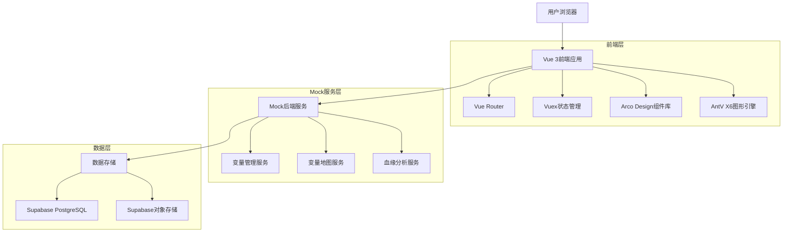
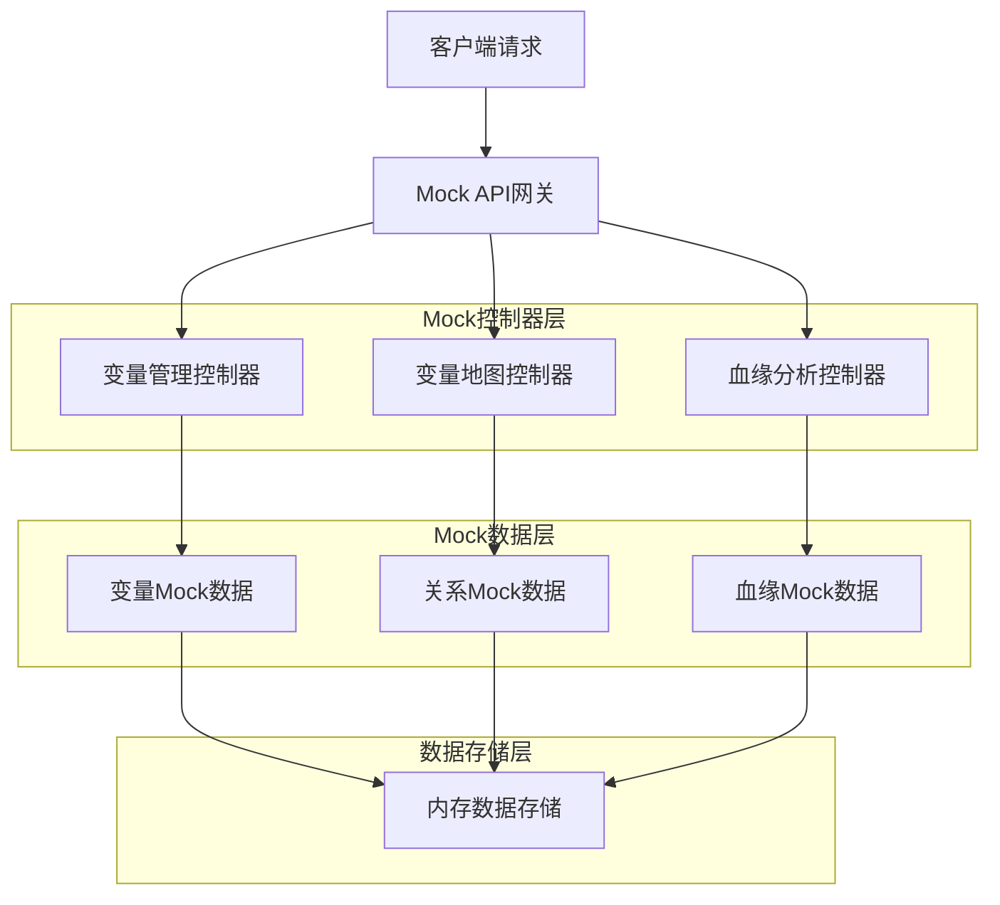
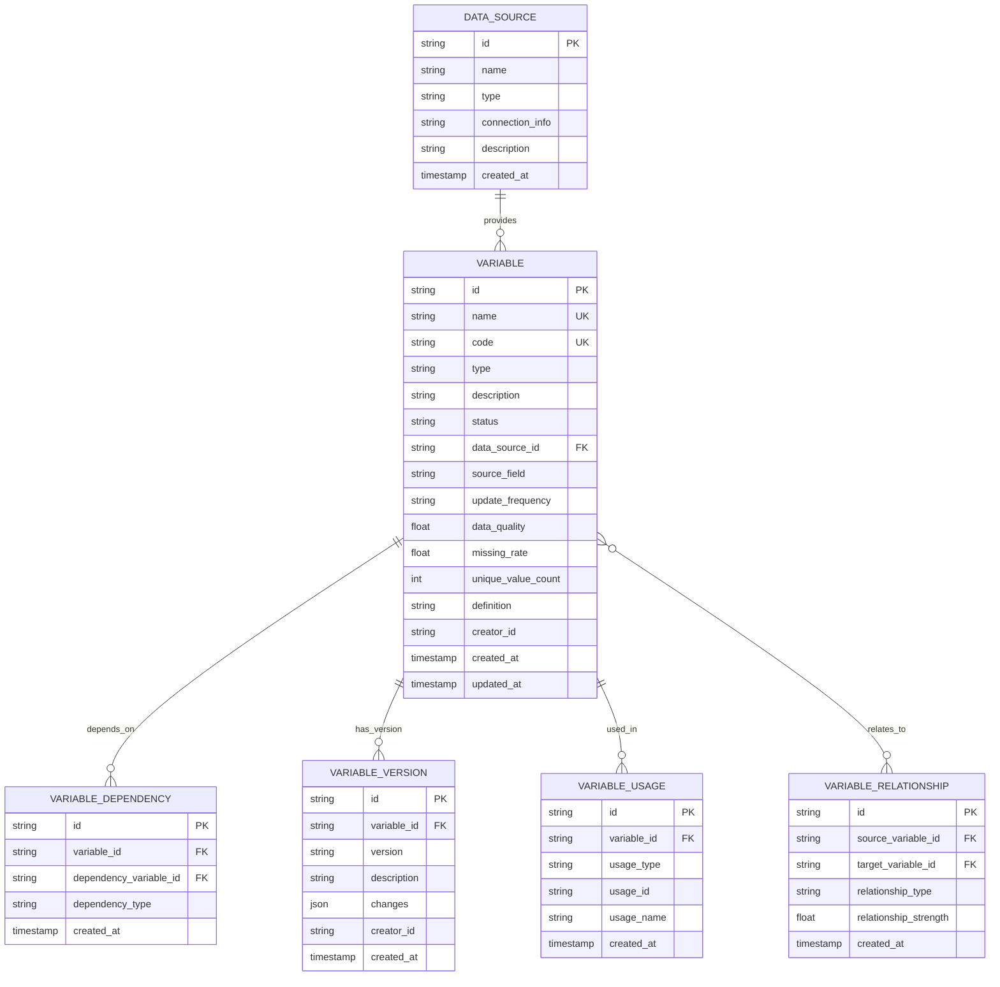

## 1. 架构设计



## 2. 技术描述

- **前端框架**: Vue 3 (Composition API) + TypeScript
- **构建工具**: Vite
- **图形引擎**: AntV X6
- **状态管理**: Vuex 4
- **路由管理**: Vue Router 4
- **UI组件**: Arco Design Vue
- **Mock服务**: Node.js + Express
- **数据库**: Supabase (PostgreSQL)
- **对象存储**: Supabase Storage
- **初始化工具**: vite-init

## 3. 路由定义

| 路由 | 用途 |
|------|------|
| /variables | 变量管理页，变量列表和管理功能 |
| /variables/:id | 变量详情页，单个变量的详细信息 |
| /variable-map | 变量地图页，变量关系可视化展示 |
| /variable-map/:id | 变量关系详情页，特定变量的关系分析 |

## 4. API定义

### 4.1 变量管理API

**获取变量列表**
```
GET /api/variables
```

请求参数：
| 参数名 | 参数类型 | 是否必需 | 描述 |
|--------|----------|----------|------|
| page | number | false | 页码，默认为1 |
| pageSize | number | false | 每页条数，默认为20 |
| keyword | string | false | 搜索关键词 |
| type | string | false | 变量类型筛选 |
| status | string | false | 变量状态筛选 |

响应：
```json
{
  "code": 200,
  "data": {
    "list": [
      {
        "id": "var_001",
        "name": "用户年龄",
        "code": "user_age",
        "type": "numerical",
        "description": "用户的年龄信息",
        "status": "active",
        "dataSource": "user_profile",
        "updateFrequency": "每日",
        "dataQuality": 95.2,
        "missingRate": 0.8,
        "createdAt": "2024-01-01T00:00:00Z",
        "creator": "张三"
      }
    ],
    "total": 100
  }
}
```

**创建变量**
```
POST /api/variables
```

请求体：
```json
{
  "name": "用户年龄",
  "code": "user_age",
  "type": "numerical",
  "description": "用户的年龄信息",
  "dataSource": "user_profile",
  "sourceField": "age",
  "updateFrequency": "每日",
  "definition": "从用户基础信息表中获取年龄字段"
}
```

### 4.2 变量地图API

**获取变量关系图**
```
GET /api/variable-map/graph
```

请求参数：
| 参数名 | 参数类型 | 是否必需 | 描述 |
|--------|----------|----------|------|
| centerId | string | false | 中心节点ID |
| depth | number | false | 关系深度，默认为2 |

响应：
```json
{
  "code": 200,
  "data": {
    "nodes": [
      {
        "id": "var_001",
        "name": "用户年龄",
        "type": "numerical",
        "status": "active"
      }
    ],
    "edges": [
      {
        "source": "var_001",
        "target": "var_002",
        "type": "dependency",
        "strength": 0.8
      }
    ]
  }
}
```

**获取变量血缘**
```
GET /api/variable-map/lineage/:id
```

响应：
```json
{
  "code": 200,
  "data": {
    "upstream": [
      {
        "id": "table_001",
        "name": "用户基础信息表",
        "type": "table",
        "field": "age"
      }
    ],
    "downstream": [
      {
        "id": "metric_001",
        "name": "用户平均年龄",
        "type": "metric"
      }
    ]
  }
}
```

**路径分析**
```
POST /api/variable-map/path-analysis
```

请求体：
```json
{
  "sourceId": "var_001",
  "targetId": "var_010",
  "maxDepth": 5
}
```

### 4.3 变量详情API

**获取变量详情**
```
GET /api/variables/:id
```

响应：
```json
{
  "code": 200,
  "data": {
    "id": "var_001",
    "name": "用户年龄",
    "code": "user_age",
    "type": "numerical",
    "description": "用户的年龄信息",
    "status": "active",
    "dataSource": "user_profile",
    "sourceField": "age",
    "updateFrequency": "每日",
    "dataQuality": 95.2,
    "missingRate": 0.8,
    "uniqueValueCount": 1200,
    "definition": "从用户基础信息表中获取年龄字段",
    "createdAt": "2024-01-01T00:00:00Z",
    "updatedAt": "2024-01-15T00:00:00Z",
    "creator": "张三",
    "usageScenarios": [
      {
        "id": "metric_001",
        "name": "用户平均年龄",
        "type": "metric",
        "createdAt": "2024-01-10T00:00:00Z"
      }
    ],
    "versions": [
      {
        "version": "v1.0.0",
        "description": "初始版本",
        "createdAt": "2024-01-01T00:00:00Z"
      }
    ]
  }
}
```

## 5. Mock服务架构图



## 6. 数据模型

### 6.1 数据模型定义



### 6.2 数据定义语言

**变量表 (variables)**
```sql
-- 创建变量表
CREATE TABLE variables (
  id UUID PRIMARY KEY DEFAULT gen_random_uuid(),
  name VARCHAR(100) NOT NULL,
  code VARCHAR(100) UNIQUE NOT NULL,
  type VARCHAR(50) NOT NULL CHECK (type IN ('numerical', 'categorical', 'text', 'datetime', 'boolean')),
  description TEXT,
  status VARCHAR(50) DEFAULT 'draft' CHECK (status IN ('draft', 'pending', 'active', 'inactive', 'expired')),
  data_source_id UUID REFERENCES data_sources(id),
  source_field VARCHAR(100),
  update_frequency VARCHAR(50),
  data_quality FLOAT CHECK (data_quality >= 0 AND data_quality <= 100),
  missing_rate FLOAT CHECK (missing_rate >= 0 AND missing_rate <= 100),
  unique_value_count INTEGER,
  definition TEXT,
  creator_id UUID REFERENCES auth.users(id),
  created_at TIMESTAMP WITH TIME ZONE DEFAULT NOW(),
  updated_at TIMESTAMP WITH TIME ZONE DEFAULT NOW(),
  UNIQUE(name, code)
);

-- 创建索引
CREATE INDEX idx_variables_name ON variables(name);
CREATE INDEX idx_variables_code ON variables(code);
CREATE INDEX idx_variables_type ON variables(type);
CREATE INDEX idx_variables_status ON variables(status);
CREATE INDEX idx_variables_created_at ON variables(created_at DESC);

-- 授权
GRANT SELECT ON variables TO anon;
GRANT ALL PRIVILEGES ON variables TO authenticated;
```

**变量依赖表 (variable_dependencies)**
```sql
-- 创建变量依赖表
CREATE TABLE variable_dependencies (
  id UUID PRIMARY KEY DEFAULT gen_random_uuid(),
  variable_id UUID REFERENCES variables(id) ON DELETE CASCADE,
  dependency_variable_id UUID REFERENCES variables(id) ON DELETE CASCADE,
  dependency_type VARCHAR(50) DEFAULT 'direct' CHECK (dependency_type IN ('direct', 'indirect', 'computed')),
  created_at TIMESTAMP WITH TIME ZONE DEFAULT NOW(),
  UNIQUE(variable_id, dependency_variable_id)
);

-- 创建索引
CREATE INDEX idx_variable_dependencies_variable_id ON variable_dependencies(variable_id);
CREATE INDEX idx_variable_dependencies_dep_id ON variable_dependencies(dependency_variable_id);
CREATE INDEX idx_variable_dependencies_type ON variable_dependencies(dependency_type);

-- 授权
GRANT SELECT ON variable_dependencies TO anon;
GRANT ALL PRIVILEGES ON variable_dependencies TO authenticated;
```

**变量版本表 (variable_versions)**
```sql
-- 创建变量版本表
CREATE TABLE variable_versions (
  id UUID PRIMARY KEY DEFAULT gen_random_uuid(),
  variable_id UUID REFERENCES variables(id) ON DELETE CASCADE,
  version VARCHAR(50) NOT NULL,
  description TEXT,
  changes JSONB,
  creator_id UUID REFERENCES auth.users(id),
  created_at TIMESTAMP WITH TIME ZONE DEFAULT NOW(),
  UNIQUE(variable_id, version)
);

-- 创建索引
CREATE INDEX idx_variable_versions_variable_id ON variable_versions(variable_id);
CREATE INDEX idx_variable_versions_version ON variable_versions(version);
CREATE INDEX idx_variable_versions_created_at ON variable_versions(created_at DESC);

-- 授权
GRANT SELECT ON variable_versions TO anon;
GRANT ALL PRIVILEGES ON variable_versions TO authenticated;
```

**变量使用场景表 (variable_usages)**
```sql
-- 创建变量使用场景表
CREATE TABLE variable_usages (
  id UUID PRIMARY KEY DEFAULT gen_random_uuid(),
  variable_id UUID REFERENCES variables(id) ON DELETE CASCADE,
  usage_type VARCHAR(50) NOT NULL CHECK (usage_type IN ('metric', 'model', 'report', 'dashboard')),
  usage_id VARCHAR(100) NOT NULL,
  usage_name VARCHAR(200) NOT NULL,
  created_at TIMESTAMP WITH TIME ZONE DEFAULT NOW(),
  UNIQUE(variable_id, usage_type, usage_id)
);

-- 创建索引
CREATE INDEX idx_variable_usages_variable_id ON variable_usages(variable_id);
CREATE INDEX idx_variable_usages_type ON variable_usages(usage_type);
CREATE INDEX idx_variable_usages_usage_id ON variable_usages(usage_id);

-- 授权
GRANT SELECT ON variable_usages TO anon;
GRANT ALL PRIVILEGES ON variable_usages TO authenticated;
```

**数据源表 (data_sources)**
```sql
-- 创建数据源表
CREATE TABLE data_sources (
  id UUID PRIMARY KEY DEFAULT gen_random_uuid(),
  name VARCHAR(100) UNIQUE NOT NULL,
  type VARCHAR(50) NOT NULL CHECK (type IN ('database', 'file', 'api', 'stream')),
  connection_info JSONB,
  description TEXT,
  created_at TIMESTAMP WITH TIME ZONE DEFAULT NOW(),
  updated_at TIMESTAMP WITH TIME ZONE DEFAULT NOW()
);

-- 创建索引
CREATE INDEX idx_data_sources_name ON data_sources(name);
CREATE INDEX idx_data_sources_type ON data_sources(type);

-- 授权
GRANT SELECT ON data_sources TO anon;
GRANT ALL PRIVILEGES ON data_sources TO authenticated;
```