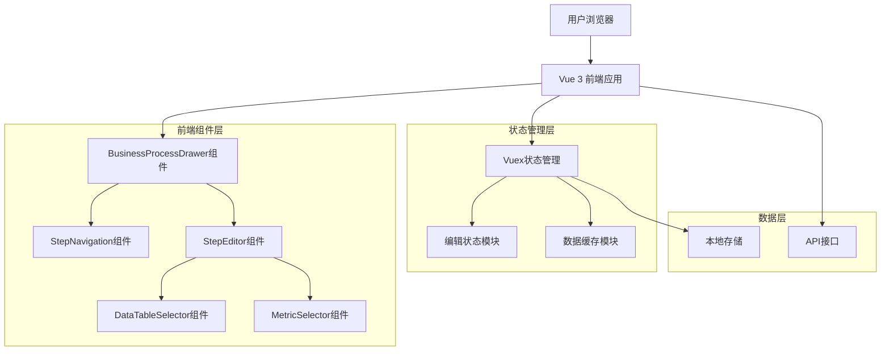
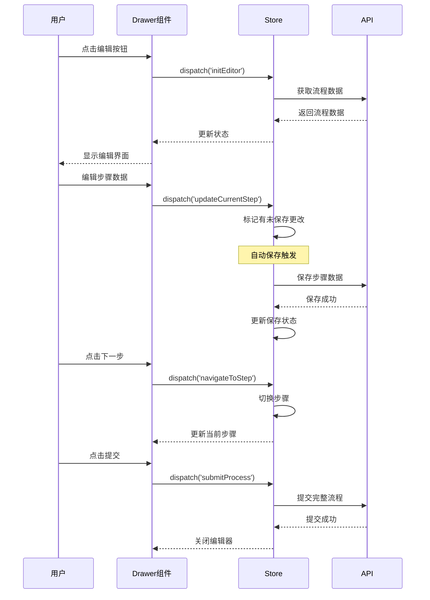

# 业务流程编辑功能技术架构文档

## 1. 架构设计



## 2. 技术描述

* **前端**: Vue 3 (Composition API) + TypeScript + Arco Design

* **状态管理**: Vuex 4 用于管理编辑状态和分步骤数据

* **组件库**: Arco Design Vue 提供抽屉、表单等UI组件

* **构建工具**: Vite 提供开发和构建支持

## 3. 路由定义

| 路由                              | 用途                |
| ------------------------------- | ----------------- |
| /discovery/data-map             | 数据地图主页，包含业务流程编辑入口 |
| /discovery/data-map/process/:id | 业务流程详情页（可选）       |

## 4. API定义

### 4.1 核心API

业务流程分步骤保存接口：

```
POST /api/business-process/save-step
```

请求参数:

| 参数名       | 参数类型    | 是否必需  | 描述            |
| --------- | ------- | ----- | ------------- |
| processId | string  | true  | 流程ID，新建时为临时ID |
| stepIndex | number  | true  | 当前步骤索引        |
| stepData  | object  | true  | 步骤配置数据        |
| isDraft   | boolean | false | 是否为草稿保存       |

响应数据:

| 参数名       | 参数类型    | 描述              |
| --------- | ------- | --------------- |
| success   | boolean | 保存是否成功          |
| processId | string  | 流程ID（新建时返回正式ID） |
| message   | string  | 操作结果消息          |

示例请求:

```json
{
  "processId": "temp_001",
  "stepIndex": 0,
  "stepData": {
    "name": "用户注册",
    "description": "用户注册流程步骤",
    "tables": ["user_register", "user_device"],
    "metrics": ["日注册量", "渠道转化率"]
  },
  "isDraft": true
}
```

```
POST /api/business-process/submit
```

请求参数:

| 参数名         | 参数类型   | 是否必需 | 描述     |
| ----------- | ------ | ---- | ------ |
| processId   | string | true | 流程ID   |
| processData | object | true | 完整流程数据 |

```
GET /api/business-process/draft/:id
```

响应数据:

| 参数名       | 参数类型    | 描述     |
| --------- | ------- | ------ |
| success   | boolean | 请求是否成功 |
| data      | object  | 草稿数据   |
| lastSaved | string  | 最后保存时间 |

## 5. 组件架构设计

### 5.1 主要组件结构

```
src/components/business-process/
├── BusinessProcessDrawer.vue          # 主抽屉组件
├── StepNavigation.vue                 # 步骤导航组件
├── StepEditor.vue                     # 步骤编辑器
├── BasicInfoEditor.vue                # 基本信息编辑
├── DataTableSelector.vue              # 数据表选择器
├── MetricSelector.vue                 # 指标选择器
├── ProcessPreview.vue                 # 流程预览组件
└── composables/
    ├── useProcessEditor.ts             # 编辑逻辑组合函数
    ├── useStepNavigation.ts            # 步骤导航逻辑
    └── useAutoSave.ts                  # 自动保存逻辑
```

### 5.2 组件接口定义

**BusinessProcessDrawer.vue**

```typescript
interface Props {
  visible: boolean
  processId?: string
  mode: 'create' | 'edit'
}

interface Emits {
  (e: 'update:visible', value: boolean): void
  (e: 'save', data: ProcessData): void
  (e: 'cancel'): void
}
```

**StepEditor.vue**

```typescript
interface Props {
  stepData: ProcessStep
  stepIndex: number
  totalSteps: number
}

interface Emits {
  (e: 'update:stepData', data: ProcessStep): void
  (e: 'next'): void
  (e: 'prev'): void
  (e: 'save'): void
}
```

## 6. 状态管理设计

### 6.1 Vuex模块结构

```typescript
// store/modules/processEditor.ts
interface ProcessEditorState {
  // 当前编辑的流程数据
  currentProcess: ProcessData | null
  // 当前步骤索引
  currentStepIndex: number
  // 编辑模式
  editMode: 'create' | 'edit'
  // 是否有未保存的更改
  hasUnsavedChanges: boolean
  // 自动保存状态
  autoSaveStatus: 'idle' | 'saving' | 'saved' | 'error'
  // 可用的数据表列表
  availableTables: TableItem[]
  // 可用的指标列表
  availableMetrics: MetricItem[]
}

interface ProcessEditorActions {
  // 初始化编辑器
  initEditor(payload: { processId?: string, mode: 'create' | 'edit' }): Promise<void>
  // 更新当前步骤数据
  updateCurrentStep(stepData: ProcessStep): void
  // 切换到指定步骤
  navigateToStep(stepIndex: number): void
  // 保存当前步骤
  saveCurrentStep(): Promise<void>
  // 提交整个流程
  submitProcess(): Promise<void>
  // 重置编辑器
  resetEditor(): void
}
```

### 6.2 数据流设计



## 7. 核心功能实现

### 7.1 自动保存机制

```typescript
// composables/useAutoSave.ts
export function useAutoSave(processId: Ref<string>, stepIndex: Ref<number>) {
  const { saveCurrentStep } = useStore()
  const autoSaveTimer = ref<NodeJS.Timeout | null>(null)
  const lastSaveTime = ref<Date | null>(null)
  
  // 防抖保存函数
  const debouncedSave = useDebounceFn(async () => {
    try {
      await saveCurrentStep()
      lastSaveTime.value = new Date()
    } catch (error) {
      console.error('自动保存失败:', error)
    }
  }, 2000)
  
  // 监听数据变化触发自动保存
  const triggerAutoSave = () => {
    debouncedSave()
  }
  
  return {
    triggerAutoSave,
    lastSaveTime: readonly(lastSaveTime)
  }
}
```

### 7.2 步骤导航逻辑

```typescript
// composables/useStepNavigation.ts
export function useStepNavigation() {
  const store = useStore()
  const currentStepIndex = computed(() => store.state.processEditor.currentStepIndex)
  const totalSteps = computed(() => store.state.processEditor.currentProcess?.steps.length || 0)
  
  const canGoNext = computed(() => {
    return currentStepIndex.value < totalSteps.value - 1
  })
  
  const canGoPrev = computed(() => {
    return currentStepIndex.value > 0
  })
  
  const goNext = async () => {
    if (canGoNext.value) {
      await store.dispatch('processEditor/navigateToStep', currentStepIndex.value + 1)
    }
  }
  
  const goPrev = async () => {
    if (canGoPrev.value) {
      await store.dispatch('processEditor/navigateToStep', currentStepIndex.value - 1)
    }
  }
  
  const goToStep = async (stepIndex: number) => {
    if (stepIndex >= 0 && stepIndex < totalSteps.value) {
      await store.dispatch('processEditor/navigateToStep', stepIndex)
    }
  }
  
  return {
    currentStepIndex: readonly(currentStepIndex),
    totalSteps: readonly(totalSteps),
    canGoNext: readonly(canGoNext),
    canGoPrev: readonly(canGoPrev),
    goNext,
    goPrev,
    goToStep
  }
}
```

### 7.3 数据验证机制

```typescript
// utils/processValidation.ts
export interface ValidationRule {
  field: string
  required?: boolean
  validator?: (value: any) => boolean | string
}

export function validateProcessStep(stepData: ProcessStep): ValidationResult {
  const rules: ValidationRule[] = [
    {
      field: 'name',
      required: true,
      validator: (value: string) => {
        if (!value || value.trim().length === 0) {
          return '步骤名称不能为空'
        }
        if (value.length > 50) {
          return '步骤名称不能超过50个字符'
        }
        return true
      }
    },
    {
      field: 'tables',
      validator: (value: TableItem[]) => {
        if (!value || value.length === 0) {
          return '至少需要关联一个数据表'
        }
        return true
      }
    }
  ]
  
  const errors: string[] = []
  
  for (const rule of rules) {
    const fieldValue = stepData[rule.field as keyof ProcessStep]
    
    if (rule.required && (!fieldValue || fieldValue === '')) {
      errors.push(`${rule.field}是必填项`)
      continue
    }
    
    if (rule.validator && fieldValue !== undefined) {
      const result = rule.validator(fieldValue)
      if (result !== true) {
        errors.push(typeof result === 'string' ? result : `${rule.field}验证失败`)
      }
    }
  }
  
  return {
    isValid: errors.length === 0,
    errors
  }
}
```

## 8. 性能优化策略

### 8.1 组件懒加载

```typescript
// 异步加载大型选择器组件
const DataTableSelector = defineAsyncComponent(() => 
  import('./DataTableSelector.vue')
)

const MetricSelector = defineAsyncComponent(() => 
  import('./MetricSelector.vue')
)
```

### 8.2 虚拟滚动

```typescript
// 在数据表和指标选择器中使用虚拟滚动
<a-virtual-list
  :data="filteredTables"
  :height="400"
  :item-height="48"
>
  <template #item="{ item }">
    <TableSelectItem :table="item" />
  </template>
</a-virtual-list>
```

### 8.3 数据缓存策略

```typescript
// 缓存常用数据，减少API调用
const dataCache = new Map<string, any>()

export function useCachedData<T>(key: string, fetcher: () => Promise<T>) {
  const data = ref<T | null>(null)
  const loading = ref(false)
  
  const fetchData = async () => {
    if (dataCache.has(key)) {
      data.value = dataCache.get(key)
      return
    }
    
    loading.value = true
    try {
      const result = await fetcher()
      dataCache.set(key, result)
      data.value = result
    } finally {
      loading.value = false
    }
  }
  
  return { data, loading, fetchData }
}
```

## 9. 错误处理和用户反馈

### 9.1 错误处理策略

```typescript
// 全局错误处理
export function handleApiError(error: any) {
  if (error.response?.status === 401) {
    // 未授权，跳转登录
    router.push('/login')
  } else if (error.response?.status === 403) {
    // 权限不足
    Message.error('权限不足，无法执行此操作')
  } else if (error.response?.status >= 500) {
    // 服务器错误
    Message.error('服务器错误，请稍后重试')
  } else {
    // 其他错误
    Message.error(error.message || '操作失败')
  }
}
```

### 9.2 用户反馈机制

```typescript
// 操作反馈组件
export function useOperationFeedback() {
  const showSuccess = (message: string) => {
    Message.success({
      content: message,
      duration: 3000
    })
  }
  
  const showError = (message: string) => {
    Message.error({
      content: message,
      duration: 5000
    })
  }
  
  const showLoading = (message: string = '处理中...') => {
    return Message.loading({
      content: message,
      duration: 0
    })
  }
  
  return {
    showSuccess,
    showError,
    showLoading
  }
}
```

## 10. 测试策略

### 10.1 单元测试

```typescript
// tests/components/BusinessProcessDrawer.spec.ts
import { mount } from '@vue/test-utils'
import BusinessProcessDrawer from '@/components/business-process/BusinessProcessDrawer.vue'

describe('BusinessProcessDrawer', () => {
  it('should render correctly', () => {
    const wrapper = mount(BusinessProcessDrawer, {
      props: {
        visible: true,
        mode: 'create'
      }
    })
    
    expect(wrapper.find('.business-process-drawer').exists()).toBe(true)
  })
  
  it('should emit save event when form is submitted', async () => {
    const wrapper = mount(BusinessProcessDrawer, {
      props: {
        visible: true,
        mode: 'create'
      }
    })
    
    await wrapper.find('.submit-button').trigger('click')
    expect(wrapper.emitted('save')).toBeTruthy()
  })
})
```

### 10.2 集成测试

```typescript
// tests/integration/processEditor.spec.ts
import { createStore } from 'vuex'
import processEditorModule from '@/store/modules/processEditor'

describe('Process Editor Integration', () => {
  let store: any
  
  beforeEach(() => {
    store = createStore({
      modules: {
        processEditor: processEditorModule
      }
    })
  })
  
  it('should save step data correctly', async () => {
    const stepData = {
      name: 'Test Step',
      description: 'Test Description',
      tables: [],
      metrics: []
    }
    
    await store.dispatch('processEditor/updateCurrentStep', stepData)
    await store.dispatch('processEditor/saveCurrentStep')
    
    expect(store.state.processEditor.autoSaveStatus).toBe('saved')
  })
})
```

