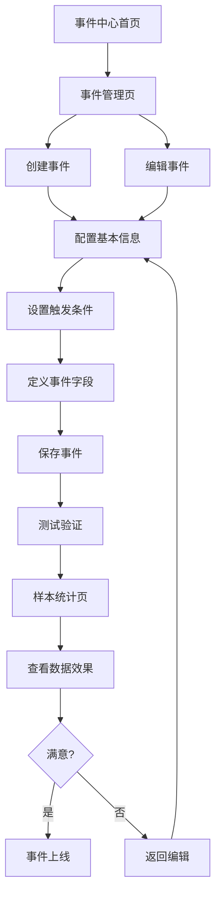
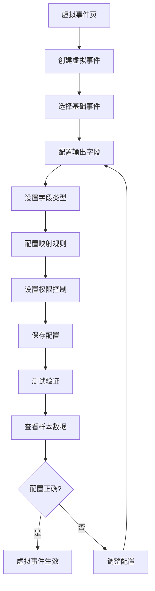
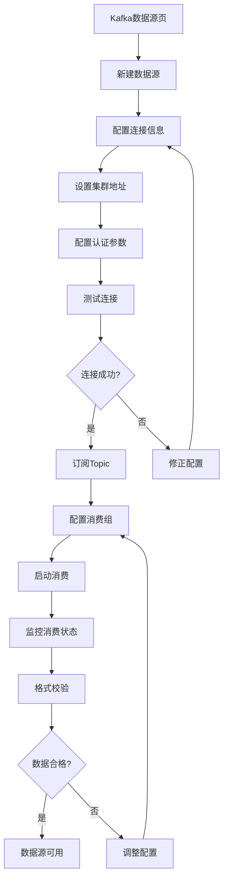

## 1. 产品概述
事件中心是客群中心的核心模块，提供事件全生命周期管理能力。通过统一的事件管理平台，支持事件定义、虚拟事件配置、数据源管理等功能，帮助企业实现精细化用户行为分析和营销策略制定。

目标用户：数据分析师、产品经理、运营人员
核心价值：降低事件管理复杂度，提升数据驱动决策效率

## 2. 核心功能

### 2.1 用户角色
| 角色 | 注册方法 | 核心权限 |
|------|----------|----------|
| 数据分析师 | 管理员分配 | 事件定义、数据查询、报表配置 |
| 产品经理 | 管理员分配 | 事件创建、虚拟事件配置、测试验证 |
| 运营人员 | 管理员分配 | 事件查看、基础配置、数据监控 |
| 系统管理员 | 管理员分配 | 全功能权限、系统配置、用户管理 |

### 2.2 功能模块
事件中心包含以下核心页面：

1. **事件中心首页**：导航入口、概览统计、快捷操作
2. **事件管理页**：事件列表、创建编辑、状态管理、测试验证
3. **虚拟事件页**：虚拟事件配置、字段映射、输出配置、测试验证
4. **样本统计页**：数据可视化、行为分析、异常检测、报表导出
5. **Kafka数据源页**：连接配置、Topic管理、消费监控、格式校验

### 2.3 页面详情

| 页面名称 | 模块名称 | 功能描述 |
|----------|----------|----------|
| 事件中心首页 | 导航菜单 | 提供事件中心各模块入口，显示事件总数、活跃事件数等关键指标 |
| 事件中心首页 | 概览统计 | 展示事件趋势图、事件类型分布、最近操作记录 |
| 事件中心首页 | 快捷操作 | 提供新建事件、查看报表、系统设置等快捷入口 |
| 事件管理页 | 事件列表 | 展示所有事件，支持搜索、筛选、分页、排序功能 |
| 事件管理页 | 事件创建 | 提供事件基本信息配置、触发条件设置、字段定义 |
| 事件管理页 | 事件编辑 | 支持事件信息修改、状态切换、版本管理 |
| 事件管理页 | 测试功能 | 点击测试按钮跳转样本统计页，查看事件数据效果 |
| 样本统计页 | 数据可视化 | 展示点击量、转化率等核心指标的图表 |
| 样本统计页 | 分时段统计 | 支持按小时/天/周维度切换的时间序列图表 |
| 样本统计页 | 行为路径分析 | 展示用户行为路径、转化漏斗分析 |
| 样本统计页 | 异常检测 | 自动识别异常事件，提供告警配置 |
| 虚拟事件页 | 虚拟事件列表 | 管理虚拟事件，支持创建、编辑、删除操作 |
| 虚拟事件页 | 字段配置 | 配置输出字段类型、映射规则、格式转换 |
| 虚拟事件页 | 权限控制 | 设置字段级权限，控制不同角色访问权限 |
| 虚拟事件页 | 测试验证 | 验证虚拟事件配置效果，跳转样本统计页 |
| Kafka数据源页 | 连接管理 | 配置Kafka集群连接信息、认证参数 |
| Kafka数据源页 | Topic订阅 | 管理Topic订阅关系、消费组配置 |
| Kafka数据源页 | 消费监控 | 实时监控消费状态、延迟情况、错误率 |
| Kafka数据源页 | 格式校验 | 校验消息格式、字段完整性、数据质量 |

## 3. 核心流程

### 3.1 事件管理流程

### 3.2 虚拟事件配置流程

### 3.3 数据源管理流程

## 4. 用户界面设计

### 4.1 设计规范
- **主色调**：#165DFF（科技蓝）
- **辅助色**：#14C9C9（青绿色）、#FF7D00（橙色）
- **背景色**：#F2F3F5（浅灰）、#FFFFFF（白色）
- **按钮样式**：圆角矩形，主按钮使用主色调
- **字体规范**：
  - 标题：16px，font-weight: 600
  - 正文：14px，font-weight: 400
  - 辅助文字：12px，font-weight: 400
- **布局风格**：卡片式布局，左侧导航+右侧内容区
- **图标风格**：线性图标，简洁现代风格

### 4.2 页面设计详述

| 页面名称 | 模块名称 | UI元素 |
|----------|----------|--------|
| 事件中心首页 | 顶部导航 | 面包屑导航、用户头像、系统通知图标 |
| 事件中心首页 | 左侧菜单 | 垂直菜单，图标+文字，当前选中高亮显示 |
| 事件中心首页 | 统计卡片 | 圆角卡片，阴影效果，数字大字体突出显示 |
| 事件中心首页 | 趋势图表 | 折线图，蓝色主色调，支持悬停显示详细数据 |
| 事件管理页 | 搜索区域 | 输入框+下拉筛选+搜索按钮，一行布局 |
| 事件管理页 | 数据表格 | 斑马线样式，操作按钮使用图标+文字 |
| 事件管理页 | 分页控件 | 底部居中，显示总条数，支持页码跳转 |
| 样本统计页 | 图表容器 | 卡片式容器，标题+图表，支持全屏查看 |
| 样本统计页 | 时间选择器 | 日期范围选择，支持相对时间（近7天等） |
| 样本统计页 | 指标卡片 | 小卡片展示核心指标，支持同比环比显示 |
| 虚拟事件页 | 配置面板 | 分步骤配置，左侧步骤导航，右侧配置表单 |
| 虚拟事件页 | 字段表格 | 可编辑表格，支持添加删除行，内联编辑 |
| Kafka数据源页 | 连接表单 | 分组表单，必填项标记，实时验证提示 |
| Kafka数据源页 | 监控面板 | 实时数据刷新，状态指示灯，图表展示 |

### 4.3 Desktop-Only Professional Design
**专业级桌面端设计**
- **固定布局**: 基于1920×1080分辨率固定设计，不响应式缩放
- **超大图表区域**: 全屏数据可视化，支持复杂多维度分析
- **专业级交互**: 右键上下文菜单、拖拽操作、悬停详情等高级交互
- **键盘快捷键体系**: 完整的键盘导航和快捷操作，提升专业用户效率
- **多窗口/标签**: 支持浏览器多标签页状态同步，多屏协作
- **高信息密度**: 单屏显示更多数据内容，减少滚动和切换
- **实时数据监控**: 高性能实时数据更新和异常告警
- **专业工具集成**: 支持数据导出、批量操作、高级筛选等工具