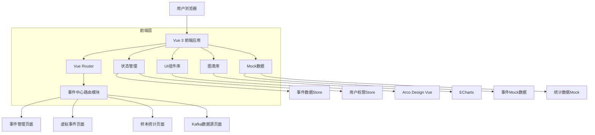

## 1. 架构设计



## 2. 技术栈描述

**桌面优先技术栈**
- **前端框架**: Vue 3.3 + Composition API
- **构建工具**: Vite 4.4
- **路由管理**: Vue Router 4.2
- **状态管理**: Vuex 4.1
- **UI组件**: Arco Design Vue 2.5
- **图表库**: ECharts 5.4
- **图表引擎**: AntV X6 2.0
- **开发语言**: TypeScript 5.0 + JavaScript
- **代码规范**: ESLint + Prettier
- **初始化工具**: vite-init

**Professional Desktop Features**
- **Fixed Layout Engine**: Fixed-width 1920×1080 layout with no responsive scaling
- **WebGL Acceleration**: Hardware-accelerated charts for massive datasets (10k+ data points)
- **Advanced Keyboard System**: Complete keyboard navigation with customizable shortcuts
- **Multi-Window Architecture**: Cross-tab state synchronization and multi-monitor support
- **Native Desktop Integration**: System notifications, clipboard operations, file drag-drop
- **Real-time Data Engine**: WebSocket-based live data streaming with 1s latency
- **Professional Data Tools**: Excel export, bulk operations, advanced filtering
- **Performance Optimization**: Virtual scrolling, lazy loading, memory management

## 3. 路由定义

| 路由路径 | 页面组件 | 功能描述 |
|----------|----------|----------|
| /exploration/customer-center/event-center | EventCenterLayout.vue | 事件中心布局容器 |
| /exploration/customer-center/event-center/event-management | EventManagement.vue | 事件管理主页面 |
| /exploration/customer-center/event-center/virtual-events | VirtualEvents.vue | 虚拟事件配置页面 |
| /exploration/customer-center/event-center/sample-stats | SampleStats.vue | 样本统计分析页面 |
| /exploration/customer-center/event-center/kafka-datasource | KafkaDatasource.vue | Kafka数据源管理页面 |

## 4. 核心数据模型

### 4.1 TypeScript类型定义

**事件数据接口**
```typescript
// src/types/event.ts
export interface EventData {
  id: string;
  eventName: string;
  eventType: '系统事件' | '业务事件' | '用户事件' | '营销事件' | '风控事件';
  eventSource: '系统' | '用户操作' | '定时任务' | '外部触发' | 'API调用';
  triggerCondition: string;
  status: '上线' | '下线';
  createTime: string;
  updateTime: string;
  owner: string;
  description: string;
  registryKey: string;
}

export interface VirtualEventData {
  id: string;
  eventName: string;
  eventId: string;
  scenario: '营销触达' | '风险控制' | '用户分析' | '行为监控';
  status: '已上线' | '已下线' | '草稿';
  updater: string;
  updateTime: string;
  createTime: string;
  description: string;
  logicRelation: 'AND' | 'OR';
  conditionGroups: ConditionGroup[];
  realEventId: string | null;
  syncStatus: 'pending' | 'synced' | 'failed';
}

export interface ConditionGroup {
  id: number;
  conditions: Condition[];
}

export interface Condition {
  field: string;
  operator: string;
  value: string;
  logic: '等于' | '不等于' | '包含';
}
```

**样本统计数据接口**
```typescript
export interface SampleStats {
  eventId: string;
  totalClicks: number;
  conversionRate: number;
  avgResponseTime: number;
  errorRate: number;
  hourlyStats: HourlyStat[];
  dailyStats: DailyStat[];
  weeklyStats: WeeklyStat[];
  userPath: UserPathNode[];
  anomalies: Anomaly[];
}

export interface HourlyStat {
  hour: string;
  clicks: number;
  conversions: number;
  errors: number;
}

export interface DailyStat {
  date: string;
  clicks: number;
  conversions: number;
  errors: number;
}

export interface WeeklyStat {
  week: string;
  clicks: number;
  conversions: number;
  errors: number;
}

export interface UserPathNode {
  nodeId: string;
  nodeName: string;
  visits: number;
  conversions: number;
  dropoffs: number;
  nextNodes: string[];
}

export interface Anomaly {
  id: string;
  type: 'spike' | 'drop' | 'pattern';
  severity: 'low' | 'medium' | 'high';
  description: string;
  detectedAt: string;
  value: number;
  threshold: number;
}
```

**Kafka数据源接口**
```typescript
export interface KafkaDatasource {
  id: string;
  name: string;
  bootstrapServers: string;
  securityProtocol: 'PLAINTEXT' | 'SSL' | 'SASL_PLAINTEXT' | 'SASL_SSL';
  saslMechanism?: 'PLAIN' | 'SCRAM-SHA-256' | 'SCRAM-SHA-512';
  username?: string;
  password?: string;
  status: 'connected' | 'disconnected' | 'error';
  topics: KafkaTopic[];
  createdAt: string;
  updatedAt: string;
}

export interface KafkaTopic {
  name: string;
  partitions: number;
  replicationFactor: number;
  consumerGroups: ConsumerGroup[];
}

export interface ConsumerGroup {
  groupId: string;
  lag: number;
  members: number;
  state: 'Stable' | 'PreparingRebalance' | 'CompletingRebalance' | 'Empty' | 'Dead';
}
```

### 4.2 组件架构

**页面组件结构**
```
src/pages/exploration/customer-center/event-center/
├── index.vue                    # 事件中心首页
├── event-management.vue         # 事件管理页面
├── virtual-events.vue           # 虚拟事件页面
├── sample-stats.vue              # 样本统计页面
├── kafka-datasource.vue          # Kafka数据源页面
└── components/                   # 共享组件
    ├── EventTable.vue           # 事件表格组件
    ├── EventForm.vue            # 事件表单组件
    ├── StatsChart.vue           # 统计图表组件
    ├── FieldMapper.vue          # 字段映射组件
    └── KafkaConfig.vue          # Kafka配置组件
```

### 4.3 Mock数据服务

**事件Mock服务**
```javascript
// src/mock/event.ts
import Mock from 'mockjs';

export const generateEventData = (count: number): EventData[] => {
  const eventTypes = ['系统事件', '业务事件', '用户事件', '营销事件', '风控事件'];
  const eventSources = ['系统', '用户操作', '定时任务', '外部触发', 'API调用'];
  const statusOptions = ['上线', '下线'];
  const owners = ['张三', '李四', '王五', '赵六', '系统管理员'];
  
  return Array.from({ length: count }, (_, i) => ({
    id: `EVT${Mock.Random.string('number', 6)}`,
    eventName: `${Mock.Random.pick(eventTypes)}${Mock.Random.ctitle(3, 8)}`,
    eventType: Mock.Random.pick(eventTypes),
    eventSource: Mock.Random.pick(eventSources),
    triggerCondition: Mock.Random.sentence(5, 10),
    status: Mock.Random.pick(statusOptions),
    createTime: Mock.Random.datetime('yyyy-MM-dd HH:mm:ss'),
    updateTime: Mock.Random.datetime('yyyy-MM-dd HH:mm:ss'),
    owner: Mock.Random.pick(owners),
    description: Mock.Random.sentence(10, 20),
    registryKey: Mock.Random.pick(['user_id', 'order_id', 'transaction_id', 'event_id', 'session_id'])
  }));
};

export const generateSampleStats = (eventId: string): SampleStats => {
  const hourlyStats = Array.from({ length: 24 }, (_, i) => ({
    hour: `${i.toString().padStart(2, '0')}:00`,
    clicks: Mock.Random.integer(100, 1000),
    conversions: Mock.Random.integer(10, 100),
    errors: Mock.Random.integer(0, 10)
  }));
  
  return {
    eventId,
    totalClicks: Mock.Random.integer(10000, 50000),
    conversionRate: Mock.Random.float(1, 10),
    avgResponseTime: Mock.Random.integer(50, 500),
    errorRate: Mock.Random.float(0.1, 2),
    hourlyStats,
    dailyStats: [], // 类似结构
    weeklyStats: [], // 类似结构
    userPath: [], // 路径数据
    anomalies: [] // 异常数据
  };
};
```

## 5. 状态管理设计

**Vuex Store结构**
```javascript
// src/store/modules/event.ts
export const eventStore = {
  namespaced: true,
  state: {
    events: [],
    virtualEvents: [],
    sampleStats: {},
    kafkaDatasources: [],
    loading: false,
    error: null
  },
  
  mutations: {
    SET_EVENTS(state, events) {
      state.events = events;
    },
    SET_VIRTUAL_EVENTS(state, events) {
      state.virtualEvents = events;
    },
    SET_SAMPLE_STATS(state, { eventId, stats }) {
      state.sampleStats[eventId] = stats;
    },
    SET_KAFKA_DATASOURCES(state, datasources) {
      state.kafkaDatasources = datasources;
    }
  },
  
  actions: {
    async fetchEvents({ commit }) {
      // 获取事件列表
    },
    async createEvent({ commit }, eventData) {
      // 创建事件
    },
    async fetchSampleStats({ commit }, eventId) {
      // 获取样本统计
    },
    async testEvent({ commit }, eventId) {
      // 测试事件
    }
  },
  
  getters: {
    getEventById: (state) => (id) => {
      return state.events.find(event => event.id === id);
    },
    getSampleStatsByEventId: (state) => (eventId) => {
      return state.sampleStats[eventId];
    }
  }
};
```

## 6. 组件通信设计

**父子组件通信**
- 使用 props 向下传递数据
- 使用 emit 向上传递事件
- 使用 v-model 实现双向绑定

**兄弟组件通信**
- 通过共同的父组件进行中转
- 使用 Vuex 进行状态共享
- 使用事件总线处理复杂场景

**跨层级通信**
- 使用 provide/inject 进行依赖注入
- 使用 Vuex 进行全局状态管理

## 7. 性能优化策略

**组件优化**
- 使用异步组件加载
- 合理使用 v-show 和 v-if
- 使用 computed 缓存计算结果
- 使用 watch 监听数据变化

**数据优化**
- 使用虚拟滚动处理大量数据
- 实现数据分页加载
- 使用防抖和节流优化频繁操作
- 合理使用缓存策略

**渲染优化**
- 使用 key 优化列表渲染
- 避免不必要的组件重渲染
- 使用 CSS 动画替代 JavaScript 动画
- 合理使用图片懒加载

## 8. 错误处理机制

**全局错误处理**
```javascript
// src/utils/errorHandler.ts
export const errorHandler = {
  // 处理API错误
  handleApiError(error) {
    console.error('API Error:', error);
    // 显示错误提示
  },
  
  // 处理组件错误
  handleComponentError(error, component) {
    console.error(`Component Error in ${component}:`, error);
    // 记录错误日志
  },
  
  // 处理路由错误
  handleRouterError(error) {
    console.error('Router Error:', error);
    // 跳转到错误页面
  }
};
```

**组件级错误处理**
- 使用 errorCaptured 捕获子组件错误
- 使用 try-catch 处理异步操作
- 提供友好的错误提示界面

## 9. 开发规范

**代码规范**
- 使用 ESLint 进行代码检查
- 使用 Prettier 进行代码格式化
- 遵循 Vue 3 Composition API 规范
- 使用 TypeScript 进行类型检查

**命名规范**
- 组件名使用 PascalCase
- 变量名使用 camelCase
- 常量名使用 UPPER_SNAKE_CASE
- 文件名使用 kebab-case

**注释规范**
- 公共 API 必须添加 JSDoc 注释
- 复杂逻辑需要添加详细注释
- 使用中文注释便于团队理解