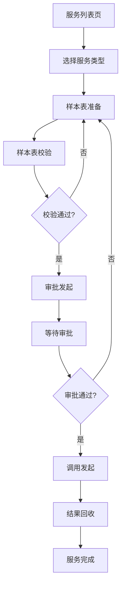

# 外数数据服务流程改造方案

## 1. 产品概述

本方案旨在将现有的6种外数数据服务（在线批量调用、外数离线回溯申请、周期跑批任务申请、全量变量回溯申请、风险合规离线回溯申请、批量外数调用服务申请）的创建和编辑流程进行标准化改造，统一为5个标准化阶段：样本表准备、样本表校验、审批发起、调用发起、结果回收。

通过流程标准化，提升用户体验一致性，降低学习成本，同时保留各服务类型的差异化执行细节。

## 2. 核心功能

### 2.1 用户角色

| 角色 | 注册方式 | 核心权限 |
|------|----------|----------|
| 普通用户 | 企业邮箱注册 | 创建服务申请、查看个人申请、编辑草稿 |
| 审批人员 | 管理员分配 | 审批服务申请、查看待审批列表 |
| 系统管理员 | 超级管理员创建 | 管理所有服务、配置系统参数、查看统计报表 |

### 2.2 功能模块

改造后的外数数据服务系统包含以下核心页面：

1. **服务列表页**：展示所有服务申请，支持筛选和搜索
2. **服务创建页**：5步骤向导式创建流程
3. **服务详情页**：查看服务详情和进度状态
4. **审批管理页**：审批人员处理待审批事项
5. **结果查看页**：查看调用结果和回收数据

### 2.3 页面详情

| 页面名称 | 模块名称 | 功能描述 |
|----------|----------|----------|
| 服务列表页 | 服务列表 | 展示服务申请列表，包含状态、类型、创建时间等信息 |
| 服务列表页 | 搜索筛选 | 按服务类型、状态、时间范围等条件筛选 |
| 服务列表页 | 快捷操作 | 支持新建、编辑、删除、复制等快捷操作 |
| 服务创建页 | 步骤导航 | 5步骤进度导航，显示当前所处阶段 |
| 服务创建页 | 样本表准备 | 上传样本文件、配置数据源、设置参数 |
| 服务创建页 | 样本表校验 | 自动校验数据格式、完整性检查、错误提示 |
| 服务创建页 | 审批发起 | 选择审批人、填写申请理由、提交审批 |
| 服务创建页 | 调用发起 | 配置调用参数、设置执行计划、启动调用 |
| 服务创建页 | 结果回收 | 查看执行进度、下载结果、数据可视化 |
| 服务详情页 | 基本信息 | 展示服务类型、状态、创建人等基础信息 |
| 服务详情页 | 进度跟踪 | 5个阶段的执行进度和状态展示 |
| 服务详情页 | 操作日志 | 记录所有操作历史和时间节点 |
| 审批管理页 | 待审批列表 | 展示需要审批的服务申请 |
| 审批管理页 | 审批操作 | 支持通过、驳回、转交等审批操作 |
| 结果查看页 | 结果概览 | 展示调用结果的统计信息 |
| 结果查看页 | 数据详情 | 详细的结果数据和错误信息 |

## 3. 核心流程

### 3.1 服务创建流程

所有6种服务类型统一遵循以下5阶段流程：



### 3.2 各服务类型差异化执行

#### 3.2.1 在线批量调用
- **样本表准备**：支持Excel/CSV上传，最大10万条记录
- **样本表校验**：实时校验手机号、身份证号格式
- **审批发起**：一级审批，系统自动分配审批人
- **调用发起**：实时调用，支持批量处理
- **结果回收**：实时返回结果，支持分页查看

#### 3.2.2 外数离线回溯申请
- **样本表准备**：支持历史数据上传，时间范围限制
- **样本表校验**：校验历史数据完整性和时效性
- **审批发起**：需要二级审批，风控部门参与
- **调用发起**：异步调用，支持断点续传
- **结果回收**：24小时内完成，支持分批下载

#### 3.2.3 周期跑批任务申请
- **样本表准备**：支持动态数据源配置
- **样本表校验**：校验数据源连接和权限
- **审批发起**：需要技术部门审批
- **调用发起**：配置cron表达式，定时执行
- **结果回收**：每次执行后自动回收，支持历史记录查询

#### 3.2.4 全量变量回溯申请
- **样本表准备**：全量数据表，支持增量更新
- **样本表校验**：校验数据表结构和字段映射
- **审批发起**：需要数据部门审批
- **调用发起**：分批处理，支持并发控制
- **结果回收**：支持按变量维度查看结果

#### 3.2.5 风险合规离线回溯申请
- **样本表准备**：敏感数据需要脱敏处理
- **样本表校验**：合规性检查，数据脱敏验证
- **审批发起**：必须经过合规部门审批
- **调用发起**：加密传输，审计日志记录
- **结果回收**：结果加密存储，访问权限控制

#### 3.2.6 批量外数调用服务申请
- **样本表准备**：支持多数据源混合
- **样本表校验**：校验数据源兼容性和冲突
- **审批发起**：业务部门和技术部门双重审批
- **调用发起**：支持多种调用策略配置
- **结果回收**：统一结果格式，支持API回调

## 4. 用户界面设计

### 4.1 设计规范

- **主色调**：蓝色系（#1890ff）为主，体现专业性和可信度
- **辅助色**：绿色（#52c41a）表示成功，红色（#f5222d）表示错误
- **按钮样式**：圆角矩形，主要操作使用主色调
- **字体规范**：14px为主标题，12px为辅助文字
- **布局风格**：卡片式布局，步骤导航固定在顶部

### 4.2 页面布局策略

#### 4.2.1 服务创建页布局
采用左右分栏布局：
- **左侧**：步骤导航面板（宽度：240px）
- **右侧**：内容操作区域（自适应宽度）

每个阶段的具体布局：

| 阶段 | 左侧导航 | 右侧内容 |
|------|----------|----------|
| 样本表准备 | 高亮当前阶段，显示完成状态 | 文件上传区 + 数据源配置区 |
| 样本表校验 | 显示校验进度 | 校验结果列表 + 错误详情 |
| 审批发起 | 显示审批流程图 | 审批表单 + 审批人选择 |
| 调用发起 | 显示调用配置选项 | 参数配置区 + 执行预览 |
| 结果回收 | 显示执行进度 | 结果展示区 + 下载操作 |

#### 4.2.2 统一组件规范

1. **步骤导航组件**
   - 支持点击已完成的步骤进行回退
   - 显示每个步骤的状态图标（待处理/进行中/已完成/错误）
   - 显示步骤预计耗时

2. **文件上传组件**
   - 支持拖拽上传
   - 显示上传进度和文件大小
   - 支持文件格式校验

3. **数据表格组件**
   - 支持分页、排序、筛选
   - 显示数据总行数和加载状态
   - 支持批量操作

4. **进度展示组件**
   - 环形进度条显示整体进度
   - 列表形式展示详细进度
   - 支持展开查看子任务进度

### 4.3 响应式设计

- **桌面端**：优先设计，充分利用屏幕空间
- **平板端**：适配1024px以上分辨率，保持功能完整性
- **移动端**：核心功能可用，简化操作流程

### 4.4 数据结构设计

#### 4.4.1 服务基础数据结构

```typescript
interface DataService {
  id: string;
  name: string;
  type: ServiceType;
  status: ServiceStatus;
  currentStage: ServiceStage;
  creator: UserInfo;
  createTime: string;
  updateTime: string;
  stages: ServiceStageInfo[];
  approval?: ApprovalInfo;
  result?: ServiceResult;
}

enum ServiceType {
  ONLINE_BATCH = 'online_batch',
  OFFLINE_BACKTRACK = 'offline_backtrack',
  PERIODIC_BATCH = 'periodic_batch',
  FULL_VARIABLE_BACKTRACK = 'full_variable_backtrack',
  RISK_COMPLIANCE_BACKTRACK = 'risk_compliance_backtrack',
  BATCH_EXTERNAL_CALL = 'batch_external_call'
}

enum ServiceStage {
  SAMPLE_PREPARE = 'sample_prepare',
  SAMPLE_VALIDATE = 'sample_validate',
  APPROVAL_START = 'approval_start',
  CALL_START = 'call_start',
  RESULT_COLLECT = 'result_collect'
}

interface ServiceStageInfo {
  stage: ServiceStage;
  status: StageStatus;
  startTime?: string;
  endTime?: string;
  error?: string;
  config?: Record<string, any>;
}
```

#### 4.4.2 各阶段专用数据结构

**样本表准备阶段配置**：
```typescript
interface SamplePrepareConfig {
  fileInfo: FileInfo;
  dataSource: DataSourceConfig;
  sampleCount: number;
  fieldMapping: FieldMapping[];
  validationRules?: ValidationRule[];
}
```

**样本表校验结果**：
```typescript
interface ValidationResult {
  totalRows: number;
  validRows: number;
  invalidRows: number;
  errors: ValidationError[];
  warnings: ValidationWarning[];
  statistics: Record<string, any>;
}
```

**审批信息**：
```typescript
interface ApprovalInfo {
  approvers: UserInfo[];
  approvalChain: ApprovalNode[];
  currentNode: number;
  approvalComment?: string;
  rejectReason?: string;
}
```

## 5. 交互设计要点

### 5.1 操作反馈
- 每个操作都有即时反馈
- 长时间操作显示进度条
- 错误操作提供明确的错误提示和解决方案

### 5.2 状态可视化
- 使用颜色、图标、文字三重标识状态
- 复杂状态使用进度条和百分比
- 支持hover查看详细状态信息

### 5.3 导航便利性
- 支持步骤间的前进和回退
- 已完成的步骤可以随时返回修改
- 提供快捷导航到关键页面

## 6. 性能优化策略

### 6.1 前端优化
- 大文件上传使用分片上传
- 数据分页加载，避免一次性加载大量数据
- 使用虚拟滚动优化长列表性能

### 6.2 用户体验优化
- 提供操作记忆功能，记住用户的常用配置
- 支持模板保存，快速创建相似服务
- 提供操作引导和帮助文档

## 7. 安全性设计

### 7.1 数据安全
- 敏感数据上传前进行加密
- 审批流程中的数据访问权限控制
- 操作日志完整记录，支持审计

### 7.2 权限控制
- 基于角色的权限管理
- 数据隔离，用户只能查看自己的数据
- 管理员可以查看和管理所有数据

这个改造方案通过标准化的5阶段流程，既保证了各服务类型的统一用户体验，又保留了各自的差异化特性，为用户提供了一致且灵活的服务创建和管理体验。