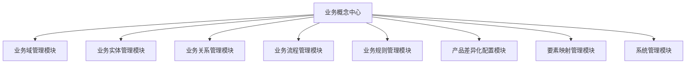
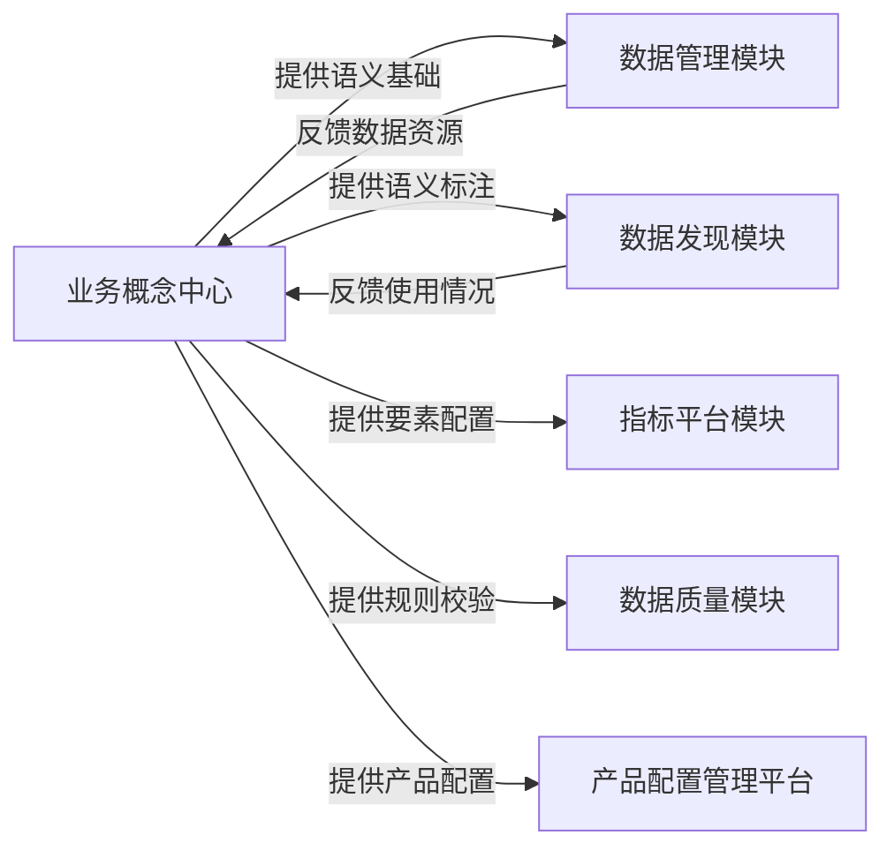
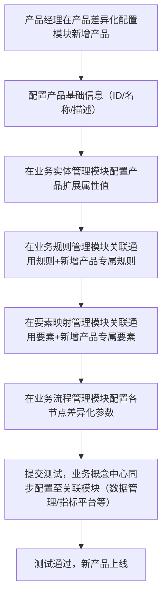
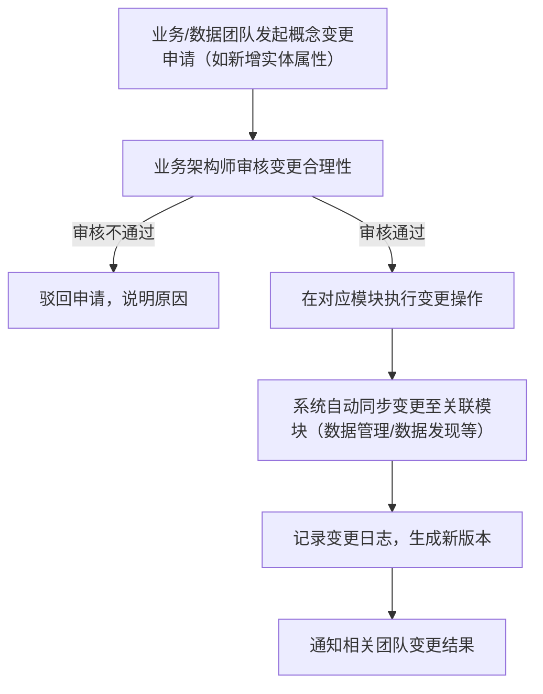

# 消费金融业务概念中心产品 PRD

## 文档信息

| 项目名称   | 消费金融数据中台本体化建设 - 业务概念中心                                                                              |
| ------ | --------------------------------------------------------------------------------------------------- |
| PRD 版本 | V1.0                                                                                                |
| 产品定位   | 消费金融全产品统一的业务语义核心平台，打通业务 - 数据 - 资产链路，支撑产品差异化配置与快速迭代                                                  |
| 核心目标   | 1. 构建全产品统一的业务语义骨架（域 / 实体 / 关系 / 流程 / 规则）；2. 支撑产品差异化配置（属性 / 规则 / 要素）；3. 联动数据管理、数据发现等模块，实现语义驱动的数据高效流转 |
| 适用范围   | 消费金融所有产品（统一流程：注册→实名→授信→用信→还款→贷后）、业务团队、数据团队、技术团队                                                     |

## 一、产品核心模块拆解（基于设计文档落地）

### 1.1 模块全景图

### 1.2 各模块核心功能与需求说明

| 模块名称         | 核心功能                                                     | 详细需求                                                                                                            | 业务价值对应                             |
| ------------ | -------------------------------------------------------- | --------------------------------------------------------------------------------------------------------------- | ---------------------------------- |
| 1. 业务域管理模块   | 1. 业务域新增 / 编辑 / 删除 / 查询；2. 业务域关联关系可视化；3. 业务域负责人配置        | 1. 支持按编码 / 名称模糊查询业务域；2. 新增业务域需填写编码、名称、描述、覆盖环节、负责人；3. 支持拖拽式配置业务域关联关系；4. 业务域删除需校验是否关联实体，关联则禁止删除                   | 统一全产品业务域划分，避免跨部门语义冲突               |
| 2. 业务实体管理模块  | 1. 实体新增 / 编辑 / 删除 / 查询；2. 通用属性 / 扩展属性配置；3. 实体关联关系查询      | 1. 实体需关联所属业务域，支持按域筛选；2. 通用属性不可删除，扩展属性支持新增 / 停用；3. 属性配置需填写编码、名称、类型、数据类型、描述、产品扩展配置说明；4. 支持查看实体关联的其他实体及关系          | 构建全产品统一实体骨架，通过 “通用 + 扩展” 属性支撑产品差异化 |
| 3. 业务关系管理模块  | 1. 关系新增 / 编辑 / 删除 / 查询；2. 关系图谱可视化；3. 关系 cardinality 配置   | 1. 关系需关联源实体、目标实体、关系类型、基数；2. 支持图谱化展示实体 - 关系 - 实体链路；3. 支持按实体筛选关联关系；4. 关系删除需校验是否被流程 / 规则引用                         | 明确业务逻辑关联，为数据血缘、流程流转提供语义基础          |
| 4. 业务流程管理模块  | 1. 主流程配置；2. 流程节点新增 / 编辑；3. 节点差异化配置点管理                    | 1. 固定核心主流程，支持新增自定义节点（仅对特定产品启用）；2. 节点需关联所属流程、描述、关联实体；3. 支持配置节点的产品差异化参数（如验证方式、审批规则）；4. 支持流程流转链路可视化                | 统一全产品流程骨架，通过节点配置实现产品差异化，无需重复设计流程   |
| 5. 业务规则管理模块  | 1. 规则新增 / 编辑 / 删除 / 查询；2. 规则分类管理；3. 规则适用范围配置             | 1. 规则分类为通用规则 / 产品专属规则 / 风控规则；2. 规则需关联所属业务域、适用流程节点、关联实体；3. 支持配置规则表达式（可视化配置 + 自定义 SQL）；4. 产品专属规则需绑定产品 ID          | 统一规则管理，支持按产品灵活配置，避免规则冗余            |
| 6. 产品差异化配置模块 | 1. 产品新增 / 编辑；2. 产品 - 属性配置；3. 产品 - 规则配置；4. 产品 - 要素配置      | 1. 新增产品需填写产品 ID、名称、描述、适用流程；2. 支持为产品配置扩展属性值（如额度上限、利率区间）；3. 支持为产品关联通用规则、新增专属规则；4. 支持启用 / 停用产品对应的要素                | 实现产品差异化配置集中管理，支撑新产品快速上线            |
| 7. 要素映射管理模块  | 1. 要素新增 / 编辑 / 查询；2. 要素 - 概念映射；3. 要素 - 资源映射；4. 要素 - 资产映射 | 1. 要素类型分为指标 / 标签 / 变量 / 口径；2. 要素需关联业务概念（实体 / 属性 / 规则）、所属产品；3. 支持关联数据资源（表 / 字段）和数据资产（API / 看板）；4. 支持按要素类型 / 产品筛选 | 打通业务概念与数据资源、资产的链路，实现语义驱动的数据复用      |
| 8. 系统管理模块    | 1. 角色管理；2. 权限分配；3. 操作日志；4. 版本管理                          | 1. 预设角色：业务管理员、数据管理员、技术管理员、只读用户；2. 支持按模块分配权限（新增 / 编辑 / 删除 / 查询）；3. 记录所有操作的用户、时间、操作内容；4. 支持核心配置的版本回溯              | 保障系统安全与可审计，支持配置变更回溯                |

## 二、与数据管理、数据发现等模块的关联关系

### 2.1 模块关联全景图

### 2.2 核心关联模块详细说明

#### 2.2.1 与数据管理模块的关联

| 关联方向            | 具体关联逻辑                                                                                                                     | 交互方式                                                                                                 | 价值体现                                                               |
| --------------- | -------------------------------------------------------------------------------------------------------------------------- | ---------------------------------------------------------------------------------------------------- | ------------------------------------------------------------------ |
| 业务概念中心 → 数据管理模块 | 1. 提供业务语义标签：将业务域、实体、属性等语义同步至数据管理模块，为表 / 字段添加业务标注；2. 提供要素映射关系：将要素与表 / 字段的映射关系同步至数据管理模块；3. 提供业务规则：将数据校验类规则同步至数据管理模块，用于数据质量监控 | 1. 接口同步：业务概念中心通过开放 API 将语义配置、要素映射、规则同步至数据管理模块；2. 实时更新：核心配置变更后 10 分钟内同步完成；3. 异常重试：同步失败时自动重试 3 次，失败则告警 | 1. 数据管理模块获得业务语义支撑，表 / 字段具备业务含义，避免 “数据孤岛”；2. 数据质量监控可直接复用业务规则，无需重复配置 |
| 数据管理模块 → 业务概念中心 | 1. 反馈数据资源状态：将表 / 字段的同步状态、数据量、质量情况反馈至业务概念中心；2. 反馈元数据变更：表 / 字段新增 / 修改 / 删除时，同步至业务概念中心，触发要素映射校验                               | 1. 接口回调：数据管理模块通过回调 API 反馈数据状态；2. 告警通知：元数据变更时触发业务概念中心告警，提醒维护要素映射                                      | 1. 业务概念中心可查看数据资源的实际状态，确保语义与数据一致；2. 及时响应元数据变更，避免要素映射失效              |

#### 2.2.2 与数据发现模块的关联

| 关联方向            | 具体关联逻辑                                                                                                                       | 交互方式                                                                                     | 价值体现                                                                          |
| --------------- | ---------------------------------------------------------------------------------------------------------------------------- | ---------------------------------------------------------------------------------------- | ----------------------------------------------------------------------------- |
| 业务概念中心 → 数据发现模块 | 1. 提供业务概念检索库：将业务域、实体、属性、要素等作为检索维度同步至数据发现模块；2. 提供关联链路：将 “业务概念→要素→数据资源→数据资产” 的链路同步至数据发现模块；3. 提供产品筛选维度：将产品信息同步至数据发现模块，支持按产品筛选数据 | 1. 接口同步：业务概念中心将检索维度、关联链路、产品信息同步至数据发现模块；2. 全文索引：业务概念信息同步至数据发现模块的全文检索引擎；3. 每日全量同步 + 实时增量同步 | 1. 数据发现模块支持按业务概念（如 “授信合同”“支用率”）检索数据，无需懂表 / 字段名称；2. 用户可通过关联链路快速找到所需数据资产，提升取数效率 |
| 数据发现模块 → 业务概念中心 | 1. 反馈检索热度：将业务概念、要素的检索频次反馈至业务概念中心；2. 反馈使用问题：用户在数据发现模块使用时反馈的语义歧义、映射错误等问题同步至业务概念中心                                              | 1. 定期同步：检索热度按日同步，使用问题实时同步；2. 问题工单：业务概念中心接收问题后生成工单，分配负责人处理                                | 1. 业务概念中心可基于检索热度优化语义配置（如高频概念优先展示）；2. 及时处理语义歧义，提升业务概念的准确性                      |

#### 2.2.3 与指标平台模块的关联

| 关联方向            | 具体关联逻辑                                                                                                                          | 交互方式                                                                        | 价值体现                                                                    |
| --------------- | ------------------------------------------------------------------------------------------------------------------------------- | --------------------------------------------------------------------------- | ----------------------------------------------------------------------- |
| 业务概念中心 → 指标平台模块 | 1. 提供指标语义基础：将指标关联的业务概念（实体 / 属性 / 规则）同步至指标平台；2. 提供产品差异化配置：将指标的产品额度、利率等差异化参数同步至指标平台；3. 提供计算规则：将指标的计算逻辑（如支用率 = 支用金额 / 授信额度）同步至指标平台 | 1. 接口同步：业务概念中心通过 API 将指标语义、产品配置、计算规则同步至指标平台；2. 版本关联：指标规则变更时，同步生成新版本并关联至指标平台 | 1. 指标平台的指标具备完整业务语义，可解释性提升；2. 指标计算直接复用业务规则，避免逻辑不一致；3. 支持按产品维度计算指标，无需重复开发 |
| 指标平台模块 → 业务概念中心 | 1. 反馈指标计算状态：将指标计算的成功率、延迟情况反馈至业务概念中心；2. 反馈指标使用情况：将指标的调用频次、复用率反馈至业务概念中心                                                           | 1. 实时反馈：计算状态实时同步，使用情况按日同步；2. 告警通知：指标计算失败时触发告警，提醒检查规则配置                      | 1. 业务概念中心可监控指标计算状态，及时排查规则配置问题；2. 基于使用情况优化指标关联的业务概念                      |

#### 2.2.4 与数据质量模块的关联

| 关联方向            | 具体关联逻辑                                                                                | 交互方式                                                               | 价值体现                                                      |
| --------------- | ------------------------------------------------------------------------------------- | ------------------------------------------------------------------ | --------------------------------------------------------- |
| 业务概念中心 → 数据质量模块 | 1. 提供业务校验规则：将 “授信额度非负”“支用金额≤剩余授信额度” 等业务规则同步至数据质量模块；2. 提供要素校验标准：将要素的取值范围、格式要求同步至数据质量模块 | 1. 接口同步：业务概念中心将规则表达式、校验标准同步至数据质量模块；2. 规则联动：业务规则变更时，数据质量模块的校验规则自动更新 | 1. 数据质量模块无需重复编写业务校验规则，降低配置成本；2. 校验规则与业务保持一致，提升数据质量问题识别准确率 |
| 数据质量模块 → 业务概念中心 | 1. 反馈校验结果：将数据质量问题（如超额度支用、负金额）反馈至业务概念中心；2. 反馈规则有效性：将规则的命中频次、误判率反馈至业务概念中心               | 1. 定期同步：校验结果按小时同步，规则有效性按周同步；2. 问题关联：数据质量问题关联至对应的业务规则和产品，便于定位原因     | 1. 业务概念中心可基于校验结果优化业务规则（如调整阈值）；2. 及时发现无效规则，提升规则配置的准确性      |

## 三、核心业务流程

### 3.1 新产品上线配置流程（核心流程）

**流程说明**：全程无需修改代码，通过配置完成新产品上线，周期从 “月级” 压缩至 “周级”。

### 3.2 业务概念变更流程

**流程说明**：变更需经过审核，确保不影响现有业务，同步至关联模块避免数据语义不一致。

## 四、界面原型设计规范（简化版）

### 4.1 核心界面布局

1. 顶部导航栏：产品名称、核心模块入口、搜索框（支持业务概念全局搜索）、用户中心；

2. 左侧菜单栏：各核心模块及子功能入口；

3. 中间内容区：模块核心功能展示（列表 / 表单 / 图谱）；

4. 右侧辅助区：关联信息展示（如实体关联的关系、规则）、操作指引。

### 4.2 关键界面示例

#### 示例 1：业务实体管理界面

* 左侧：按业务域筛选实体；

* 中间：实体列表（编码、名称、所属业务域、负责人、状态），支持新增 / 编辑 / 删除；

* 右侧：选中实体的属性配置（通用属性 + 扩展属性）、关联实体展示；

* 操作按钮：新增实体、批量导入属性、导出实体配置、查看关系图谱。

#### 示例 2：业务关系图谱界面

* 顶部：筛选条件（实体名称、业务域）；

* 中间：图谱展示区（实体为节点，关系为连线，支持拖拽、放大缩小、高亮关联链路）；

* 底部：关系详情（选中关系后展示编码、名称、源实体、目标实体、基数、描述）。

## 五、非功能需求

### 5.1 性能要求

1. 页面加载时间≤2 秒；

2. 接口响应时间≤500ms；

3. 支持同时在线用户≥500 人；

4. 批量同步数据（如要素映射同步至数据管理模块）时，单次处理量≥1000 条，处理时间≤30 秒。

### 5.2 安全要求

1. 基于角色的权限控制，不同角色仅能操作对应模块；

2. 敏感操作（如删除实体、变更规则）需二次确认；

3. 所有操作日志保留≥1 年，支持追溯；

4. 数据传输采用 HTTPS 加密，存储加密。

### 5.3 可扩展性要求

1. 支持新增业务域、实体、属性、规则类型，无需修改底层架构；

2. 支持新增关联模块，通过 API 接口实现对接；

3. 支持产品数量扩展，无上限限制。

## 六、依赖与风险

### 6.1 依赖条件

1. 数据中台核心组件已部署（如元数据平台、数据管理模块），并提供开放 API；

2. 业务概念设计文档已通过跨团队评审，确认统一的业务域、实体、关系等；

3. 核心业务数据已按数仓分层存储，表 / 字段元数据已收录至元数据平台。

### 6.2 风险与应对措施

| 风险类型 | 具体风险                             | 应对措施                                                   |
| ---- | -------------------------------- | ------------------------------------------------------ |
| 业务风险 | 业务团队对概念理解不一致，导致配置错误              | 1. 配置前组织业务评审；2. 新增配置需业务负责人审批；3. 提供操作指引和示例配置            |
| 技术风险 | 关联模块（如数据管理）接口不兼容，导致同步失败          | 1. 提前与关联模块团队确认接口规范；2. 开发适配层，支持不同接口版本；3. 同步失败时自动重试 + 告警 |
| 性能风险 | 数据量增大后（如实体属性≥1000 个），页面加载和接口响应变慢 | 1. 优化数据库索引；2. 实现数据分页加载；3. 高频访问数据缓存至 Redis              |

## 七、项目排期建议

| 阶段      | 时间周期 | 核心工作                     |
| ------- | ---- | ------------------------ |
| 需求分析与设计 | 2 周  | 细化需求、界面原型设计、接口规范制定、跨团队评审 |
| 开发阶段    | 8 周  | 核心模块开发、关联模块对接、接口开发、单元测试  |
| 测试阶段    | 2 周  | 功能测试、性能测试、安全测试、跨团队联调测试   |
| 上线阶段    | 2 周  | 灰度发布、数据迁移、用户培训、问题修复      |
| 运营阶段    | 持续   | 监控系统运行状态、收集用户反馈、迭代优化     |

## 八、附录

### 8.1 术语定义（同设计文档）

### 8.2 责任分工

| 角色    | 核心职责                            |
| ----- | ------------------------------- |
| 产品经理  | 需求梳理、PRD 编写、界面原型设计、跨团队协调、项目进度跟踪 |
| 业务架构师 | 业务概念设计、配置审核、变更评审                |
| 开发工程师 | 模块开发、接口开发、关联模块对接                |
| 测试工程师 | 功能测试、性能测试、安全测试、编写测试用例           |
| 业务团队  | 需求确认、配置操作、反馈使用问题                |
| 数据团队  | 要素映射配置、关联模块对接测试、数据资源状态反馈        |

> （注：文档部分内容可能由 AI 生成）