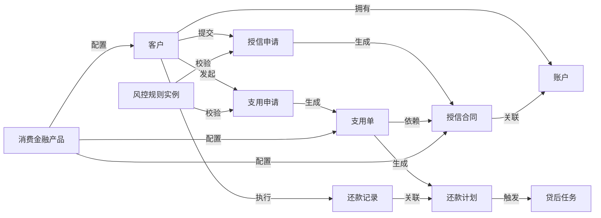

# 消费金融全产品业务概念中心设计文档

## 文档信息

| 项目名称 | 消费金融数据中台本体化建设 - 业务概念中心                                            |
| ---- | ----------------------------------------------------------------- |
| 文档版本 | V1.0                                                              |
| 适用场景 | 所有消费金融产品（统一流程：注册→实名→授信→用信→还款→贷后）                                  |
| 设计目标 | 1. 构建全产品统一的业务语义骨架；2. 支撑产品差异化配置（规则 / 属性 / 变量）；3. 打通业务 - 数据 - 资产全链路 |
| 核心原则 | 统一骨架、差异配置、可扩展、非侵入式                                                |

## 一、业务域设计（全产品统一）

### 1.1 核心业务域清单

| 业务域编码  | 业务域名称    | 业务域描述                    | 覆盖产品环节       | 负责人     |
| ------ | -------- | ------------------------ | ------------ | ------- |
| DOM001 | 客户域      | 管理用户注册、实名、客户信息相关业务       | 注册、实名        | 客户运营负责人 |
| DOM002 | 账户域      | 管理用户账户创建、状态维护、权限控制       | 注册后→全流程      | 账户运营负责人 |
| DOM003 | 授信域      | 管理授信申请、审核、额度审批、授信合同相关业务  | 授信环节         | 授信业务负责人 |
| DOM004 | 支用域（用信域） | 管理支用申请、放款、用信记录相关业务       | 用信环节         | 用信业务负责人 |
| DOM005 | 还款域      | 管理还款计划、还款执行、还款记录相关业务     | 还款环节         | 还款业务负责人 |
| DOM006 | 贷后域      | 管理逾期监控、催收、资产处置相关业务       | 贷后管理环节       | 贷后业务负责人 |
| DOM007 | 产品域      | 管理消费金融产品定义、产品属性、产品配置相关业务 | 全流程（产品差异化控制） | 产品经理负责人 |
| DOM008 | 风控域      | 管理全流程风控规则、风险评估、风险标签相关业务  | 全流程（风控校验）    | 风控负责人   |

### 1.2 业务域关联关系

* 客户域 → 关联 → 账户域（1 个客户可对应 1 个主账户）

* 账户域 → 关联 → 授信域（1 个账户可申请多笔授信）

* 授信域 → 关联 → 支用域（1 笔授信可多次支用）

* 支用域 → 关联 → 还款域（1 笔支用对应 1 个还款计划）

* 还款域 → 关联 → 贷后域（逾期还款触发贷后流程）

* 产品域 → 关联 → 所有业务域（为各环节提供差异化配置）

* 风控域 → 关联 → 所有业务域（为各环节提供风控规则）

## 二、业务实体设计（全产品统一骨架 + 产品扩展）

### 2.1 核心业务实体清单

| 实体编码   | 实体名称   | 所属业务域 | 实体描述                        | 核心关联实体               | 全产品是否必选   |
| ------ | ------ | ----- | --------------------------- | -------------------- | --------- |
| ENT001 | 客户     | 客户域   | 消费金融产品用户的核心身份实体，存储基础信息      | 账户、授信合同              | 是         |
| ENT002 | 账户     | 账户域   | 客户在平台的资金 / 业务账户，存储账户状态、权限等  | 客户、支用单、还款计划          | 是         |
| ENT003 | 授信申请   | 授信域   | 客户的授信申请记录，存储申请信息、审核结果       | 客户、账户、授信合同           | 是         |
| ENT004 | 授信合同   | 授信域   | 授信审批通过后生成的合同实体，存储额度、利率等核心信息 | 客户、账户、授信申请、支用单       | 是         |
| ENT005 | 支用申请   | 支用域   | 客户的用信申请记录，存储申请金额、用途等        | 客户、账户、授信合同、支用单       | 是         |
| ENT006 | 支用单    | 支用域   | 用信审批通过后生成的支用凭证，存储放款信息       | 客户、账户、授信合同、支用申请、还款计划 | 是         |
| ENT007 | 还款计划   | 还款域   | 基于支用单生成的还款计划，存储每期还款金额、日期    | 客户、账户、支用单、还款记录       | 是         |
| ENT008 | 还款记录   | 还款域   | 客户的实际还款记录，存储还款金额、时间、渠道      | 客户、账户、还款计划           | 是         |
| ENT009 | 贷后任务   | 贷后域   | 逾期后生成的催收 / 处置任务，存储任务状态、执行结果 | 客户、账户、还款计划           | 是（逾期场景必选） |
| ENT010 | 消费金融产品 | 产品域   | 消费金融产品定义实体，存储产品属性、差异化配置     | 所有业务实体（提供配置）         | 是         |
| ENT011 | 风控规则实例 | 风控域   | 各环节风控规则的执行实例，存储规则触发结果       | 客户、账户、授信申请、支用申请      | 是         |

### 2.2 实体属性设计（通用属性 + 产品扩展属性）

#### 示例：核心实体 “授信合同” 属性设计

| 属性编码   | 属性名称      | 属性类型 | 数据类型  | 所属实体 | 属性描述       | 全产品通用 | 产品扩展配置说明                                   |
| ------ | --------- | ---- | ----- | ---- | ---------- | ----- | ------------------------------------------ |
| ATT001 | 合同编号      | 通用属性 | 字符串   | 授信合同 | 授信合同唯一标识   | 是     | -                                          |
| ATT002 | 客户 ID     | 通用属性 | 字符串   | 授信合同 | 关联客户的唯一标识  | 是     | -                                          |
| ATT003 | 账户 ID     | 通用属性 | 字符串   | 授信合同 | 关联账户的唯一标识  | 是     | -                                          |
| ATT004 | 授信额度      | 通用属性 | 数值（元） | 授信合同 | 审批通过的总授信额度 | 是     | 不同产品可配置额度上限 / 下限（如产品 A≤5 万，产品 B≤20 万）      |
| ATT005 | 授信期限      | 通用属性 | 数值（月） | 授信合同 | 授信额度的有效期限  | 是     | 不同产品可配置期限选项（如产品 A：3/6/12 月，产品 B：6/12/24 月） |
| ATT006 | 年化利率      | 通用属性 | 数值（%） | 授信合同 | 授信的年化利率    | 是     | 不同产品可配置利率区间（如产品 A：8%-12%，产品 B：6%-10%）      |
| ATT007 | 还款方式      | 通用属性 | 枚举    | 授信合同 | 支持的还款方式    | 是     | 不同产品可配置支持的选项（如产品 A：等额本息，产品 B：等额本息 + 先息后本）  |
| ATT008 | 循环额度标识    | 扩展属性 | 布尔    | 授信合同 | 是否支持循环支用   | 否     | 产品 A：是，产品 B：否，产品 C：可配置                     |
| ATT009 | 担保方式      | 扩展属性 | 枚举    | 授信合同 | 授信的担保类型    | 否     | 产品 A：无担保，产品 B：质押担保，产品 C：保证担保               |
| ATT010 | 提前还款违约金比例 | 扩展属性 | 数值（%） | 授信合同 | 提前还款的违约金比例 | 否     | 产品 A：0%，产品 B：1%，产品 C：0.5%                  |

## 三、业务关系设计（全产品统一）

### 3.1 核心业务关系清单

| 关系编码   | 关系名称 | 源实体    | 目标实体     | 关系类型 | 关系描述                  | cardinality（基数）     |
| ------ | ---- | ------ | -------- | ---- | --------------------- | ------------------- |
| REL001 | 拥有   | 客户     | 账户       | 关联关系 | 客户在平台拥有一个或多个账户        | 1:N（1 个客户→N 个账户）    |
| REL002 | 提交   | 客户     | 授信申请     | 行为关系 | 客户向平台提交授信申请           | 1:N（1 个客户→N 个授信申请）  |
| REL003 | 生成   | 授信申请   | 授信合同     | 衍生关系 | 授信申请审批通过后生成授信合同       | 1:1（1 个申请→1 个合同）    |
| REL004 | 关联   | 授信合同   | 账户       | 关联关系 | 授信合同与客户账户绑定           | 1:1（1 个合同→1 个账户）    |
| REL005 | 发起   | 客户     | 支用申请     | 行为关系 | 客户基于授信合同发起支用申请        | 1:N（1 个客户→N 个支用申请）  |
| REL006 | 生成   | 支用申请   | 支用单      | 衍生关系 | 支用申请审批通过后生成支用单        | 1:1（1 个申请→1 个支用单）   |
| REL007 | 依赖   | 支用单    | 授信合同     | 依赖关系 | 支用单的生成依赖授信合同的额度       | N:1（N 个支用单→1 个合同）   |
| REL008 | 生成   | 支用单    | 还款计划     | 衍生关系 | 支用单生成后自动创建还款计划        | 1:1（1 个支用单→1 个还款计划） |
| REL009 | 执行   | 客户     | 还款记录     | 行为关系 | 客户按还款计划执行还款，生成还款记录    | 1:N（1 个客户→N 个还款记录）  |
| REL010 | 关联   | 还款记录   | 还款计划     | 关联关系 | 还款记录与还款计划的某一期绑定       | N:1（N 个记录→1 个计划）    |
| REL011 | 触发   | 还款计划   | 贷后任务     | 触发关系 | 还款计划逾期后触发贷后催收任务       | 1:1（1 个逾期计划→1 个任务）  |
| REL012 | 配置   | 消费金融产品 | 所有实体     | 配置关系 | 产品为各实体提供差异化属性 / 规则配置  | 1:N（1 个产品→N 个实体配置）  |
| REL013 | 校验   | 风控规则实例 | 所有业务环节实体 | 校验关系 | 风控规则对各环节实体进行合规 / 风险校验 | N:N（N 个规则→N 个实体）    |

### 3.2 业务关系图谱（简化版）

## 四、业务流程设计（全产品统一主流程 + 节点差异化配置）

### 4.1 核心业务主流程

| 流程编码   | 流程名称    | 流程描述           | 涉及业务域 | 核心节点                                                   | 全产品是否必选 |
| ------ | ------- | -------------- | ----- | ------------------------------------------------------ | ------- |
| PRO001 | 消费金融全流程 | 所有消费金融产品的统一主流程 | 所有业务域 | 注册→实名→授信申请→授信审批→授信合同生成→支用申请→支用审批→放款→还款计划生成→还款→贷后（逾期场景） | 是       |

### 4.2 核心流程节点设计（含产品差异化配置点）

| 节点编码   | 节点名称   | 所属流程      | 节点描述                 | 关联实体         | 产品差异化配置点                                                                                                     |
| ------ | ------ | --------- | -------------------- | ------------ | ------------------------------------------------------------------------------------------------------------ |
| PNT001 | 注册     | 全流程       | 客户完成平台账号注册，获取账户 ID   | 客户、账户        | 1. 注册渠道限制（产品 A 支持 APP / 小程序，产品 B 仅支持 APP）；2. 注册手机号运营商限制（产品 C 仅支持三大运营商）                                       |
| PNT002 | 实名验证   | 全流程       | 客户完成身份验证，完善客户信息      | 客户           | 1. 实名方式（产品 A：身份证 + 人脸，产品 B：身份证 + 银行卡，产品 C：多要素组合）；2. 验证渠道（产品 A 支持自研验证，产品 B 支持第三方验证）                           |
| PNT003 | 授信申请   | 全流程       | 客户提交授信申请，填写申请信息      | 授信申请、客户、账户   | 1. 申请材料要求（产品 A 无需收入证明，产品 B 需上传收入证明）；2. 申请额度范围限制（产品 A：1 千 - 5 万，产品 B：5 万 - 20 万）                              |
| PNT004 | 授信审批   | 全流程       | 平台对授信申请进行审核（自动 + 人工） | 授信申请、风控规则实例  | 1. 审批方式（产品 A：纯自动审批，产品 B：自动 + 人工审批）；2. 风控规则集（产品 A 用规则集 A，产品 B 用规则集 B）；3. 审批时效（产品 A：T+0，产品 B：T+1）              |
| PNT005 | 授信合同生成 | 全流程       | 审批通过后生成授信合同          | 授信合同、授信申请    | 1. 合同模板（产品 A：电子合同，产品 B：电子 + 纸质合同）；2. 合同签署方式（产品 A：线上签署，产品 B：线上 + 线下签署）                                        |
| PNT006 | 支用申请   | 全流程       | 客户基于授信合同提交用信申请       | 支用申请、客户、授信合同 | 1. 支用方式（产品 A：循环支用，产品 B：一次性支用）；2. 支用用途限制（产品 A：消费场景不限，产品 B：仅支持装修场景）                                            |
| PNT007 | 支用审批   | 全流程       | 平台对支用申请进行审核          | 支用申请、风控规则实例  | 1. 审批阈值（产品 A：≤1 万自动通过，产品 B：≤5 万自动通过）；2. 风控校验维度（产品 A 侧重征信，产品 B 侧重消费场景）                                        |
| PNT008 | 放款     | 全流程       | 支用审批通过后，向客户账户放款      | 支用单、账户       | 1. 放款渠道（产品 A：支持银行卡 / 钱包，产品 B：仅支持银行卡）；2. 放款时效（产品 A：实时到账，产品 B：T+0 到账）；3. 放款手续费（产品 A：0 元，产品 B：0.1%/ 笔）          |
| PNT009 | 还款计划生成 | 全流程       | 基于支用单生成每期还款计划        | 还款计划、支用单     | 1. 还款周期（产品 A：按月还，产品 B：按季度还）；2. 还款日规则（产品 A：固定每月 5 日，产品 B：放款日对应日）                                              |
| PNT010 | 还款     | 全流程       | 客户按还款计划完成还款          | 还款记录、还款计划    | 1. 还款渠道（产品 A：支持银行卡 / 支付宝 / 微信，产品 B：仅支持银行卡）；2. 自动扣款开关（产品 A 默认开启，产品 B 默认关闭）；3. 提前还款规则（产品 A 无违约金，产品 B 收 1% 违约金） |
| PNT011 | 贷后管理   | 全流程（逾期场景） | 针对逾期还款进行催收、处置        | 贷后任务、还款计划    | 1. 逾期起算时间（产品 A：还款日次日，产品 B：宽限期 3 天后）；2. 催收方式（产品 A：短信 + 电话，产品 B：短信 + 电话 + 上门）；3. 催收频率（产品 A：每日 1 次，产品 B：每日 2 次） |

## 五、业务规则设计（全产品通用规则 + 产品专属规则）

### 5.1 规则分类与核心规则清单

| 规则编码   | 规则名称            | 规则类型   | 所属业务域 | 适用流程节点      | 规则描述                               | 适用范围        | 规则表达式（示例）                                                 |
| ------ | --------------- | ------ | ----- | ----------- | ---------------------------------- | ----------- | --------------------------------------------------------- |
| RUL001 | 授信额度非负规则        | 通用规则   | 授信域   | 授信审批、授信合同生成 | 授信额度必须大于等于 0                       | 所有产品        | 授信额度 ≥ 0                                                  |
| RUL002 | 支用金额不超过剩余授信额度规则 | 通用规则   | 支用域   | 支用审批、放款     | 单笔支用金额 ≤ 授信合同剩余额度                  | 所有产品        | 支用金额 ≤ （授信额度 - 已支用金额）                                     |
| RUL003 | 逾期率范围规则         | 通用规则   | 贷后域   | 贷后任务生成      | 逾期率必须在 0-100% 之间                   | 所有产品        | 逾期率 ∈ \[0, 100%]                                          |
| RUL004 | 产品 A 授信额度上限规则   | 产品专属规则 | 授信域   | 授信审批        | 产品 A 的授信额度上限为 5 万元                 | 产品 A        | 授信额度 ≤ 50000 且 产品 ID = 产品 A                               |
| RUL005 | 产品 B 循环支用规则     | 产品专属规则 | 支用域   | 支用申请、支用审批   | 产品 B 不支持循环支用，已结清支用单不可再次支用          | 产品 B        | 循环额度标识 = 否 且 产品 ID = 产品 B                                 |
| RUL006 | 产品 C 提前还款违约金规则  | 产品专属规则 | 还款域   | 还款          | 产品 C 提前还款违约金比例为 0.5%，且违约金 ≤ 当期应还利息 | 产品 C        | 提前还款违约金 = 提前还款金额 × 0.5% 且 提前还款违约金 ≤ 当期应还利息 且 产品 ID = 产品 C |
| RUL007 | 实名验证通过率规则       | 风控规则   | 客户域   | 实名验证        | 实名验证材料齐全且信息一致时，验证通过                | 所有产品        | 身份证信息一致 = 是 且 人脸核验通过 = 是 且 材料齐全 = 是                       |
| RUL008 | 授信审批风控规则        | 风控规则   | 风控域   | 授信审批        | 征信无逾期记录且收入≥授信额度 ×20% 时，自动审批通过      | 所有产品（可配置阈值） | 征信逾期记录 = 无 且 月收入 ≥ 授信额度 × 20%                             |

### 5.2 规则管理与配置逻辑

1. **规则存储**：所有规则统一存储在业务概念中心的 “规则库”，按 “通用规则 / 产品专属规则 / 风控规则” 分类管理；

2. **规则关联**：每个规则绑定 “适用产品 ID、适用流程节点、关联实体”，支持多产品复用同一规则；

3. **规则生效**：流程执行时，按 “产品 ID + 节点名称” 自动加载匹配的规则集，执行校验 / 计算；

4. **规则变更**：支持规则版本管理，变更后按产品维度生效，不影响其他产品运行。

## 六、业务要素映射设计（打通概念 - 要素 - 资源 - 资产）

### 6.1 核心业务要素与概念映射

| 要素编码   | 要素名称       | 要素类型 | 关联业务概念（实体 / 属性 / 规则）        | 所属产品        | 关联数据资源（表 / 字段示例）                                      | 关联数据资产（示例）            |
| ------ | ---------- | ---- | --------------------------- | ----------- | ----------------------------------------------------- | --------------------- |
| ELE001 | 授信额度       | 指标   | 实体：授信合同；属性：授信额度             | 所有产品        | 表：dwd\_credit\_contract；字段：credit\_amount             | 资产：授信额度统计看板、授信 API    |
| ELE002 | 支用率        | 指标   | 实体：授信合同、支用单；规则：支用金额 / 授信额度  | 所有产品        | 表：dws\_credit\_analysis；字段：usage\_rate                | 资产：支用率趋势分析、用户支用行为 API |
| ELE003 | 逾期率        | 指标   | 实体：还款计划、贷后任务；规则：逾期金额 / 应还金额 | 所有产品        | 表：dws\_overdue\_analysis；字段：overdue\_rate             | 资产：贷后风险监控看板、逾期预警 API  |
| ELE004 | 循环额度标识     | 变量   | 实体：授信合同；属性：循环额度标识           | 产品 A / 产品 C | 表：dwd\_credit\_contract；字段：cycle\_credit\_flag        | 资产：产品配置管理平台           |
| ELE005 | 提前还款违约金比例  | 变量   | 实体：授信合同；属性：提前还款违约金比例        | 产品 B / 产品 C | 表：dwd\_credit\_contract；字段：prepayment\_penalty\_ratio | 资产：产品定价管理 API         |
| ELE006 | 高价值客户标签    | 标签   | 实体：客户；规则：月收入≥1 万且无逾期记录      | 所有产品        | 表：dws\_customer\_tag；字段：high\_value\_flag             | 资产：客户分层运营看板、高价值客户圈选工具 |
| ELE007 | 授信审批自动通过口径 | 口径   | 实体：授信申请；规则：征信无逾期 + 收入达标     | 所有产品        | 表：dwd\_credit\_apply；字段：auto\_approve\_caliber        | 资产：授信审批效率分析报表         |

### 6.2 要素差异化配置逻辑

1. **要素与产品绑定**：每个要素通过 “产品 ID” 字段关联适用产品，支持 “全产品适用”“部分产品适用”；

2. **要素值动态加载**：流程执行时，按 “产品 ID + 要素名称” 从要素清单中加载对应的值 / 规则 / 口径；

3. **要素复用**：通用要素（如逾期率）在所有产品中复用，仅需按产品维度过滤统计；产品专属要素（如循环额度标识）仅在对应产品中启用。

## 七、扩展设计（支持新产品快速上线）

### 7.1 新产品上线扩展流程

1. **产品定义**：在 “消费金融产品” 实体中新增产品记录，维护产品基础信息；

2. **属性配置**：在核心实体的 “扩展属性” 中，配置该产品的专属属性值（如额度上限、利率区间）；

3. **规则配置**：在规则库中关联通用规则，新增产品专属规则（如审批规则、定价规则）；

4. **要素配置**：关联通用要素，新增产品专属要素（如特殊变量、标签）；

5. **流程节点配置**：在统一主流程中，配置各节点的产品差异化参数（如验证方式、放款渠道）；

6. **测试上线**：基于配置自动生成产品业务逻辑，测试通过后直接上线。

### 7.2 扩展性保障

1. **实体扩展**：支持新增实体扩展属性，无需修改现有实体结构；

2. **规则扩展**：支持新增规则类型（如定价规则、渠道规则），不影响现有规则执行；

3. **要素扩展**：支持新增要素类型（如场景标签、渠道变量），与现有要素统一管理；

4. **流程扩展**：支持在主流程中新增节点（如 “场景验证节点”），仅对特定产品启用。

## 八、文档附录

### 8.1 术语定义

| 术语名称   | 术语定义                           |
| ------ | ------------------------------ |
| 通用属性   | 所有消费金融产品共用的实体属性，不可修改           |
| 扩展属性   | 仅部分产品使用的实体属性，可按产品配置            |
| 通用规则   | 所有产品必须遵守的业务规则，不可修改             |
| 产品专属规则 | 仅特定产品遵守的业务规则，可灵活配置             |
| 业务要素   | 指标、标签、变量、口径、枚举值的统称，是业务概念的数值化表达 |

### 8.2 责任分工

| 模块            | 负责团队          | 核心职责                   |
| ------------- | ------------- | ---------------------- |
| 业务域 / 实体 / 关系 | 业务架构师 + 业务负责人 | 定义统一骨架，确认业务逻辑          |
| 业务流程 / 节点     | 产品经理 + 业务负责人  | 设计统一主流程，梳理差异化配置点       |
| 业务规则          | 风控团队 + 业务负责人  | 制定通用规则 + 产品专属规则        |
| 要素映射          | 数据团队 + 业务负责人  | 打通概念 - 要素 - 资源 - 资产的关联 |
| 扩展配置          | 产品经理 + 研发团队   | 支持新产品快速上线配置            |

### 8.3 版本变更记录

| 版本号  | 变更日期 | 变更内容          | 变更人 | 审批人 |
| ---- | ---- | ------------- | --- | --- |
| V1.0 | -    | 初始版本，完成核心模块设计 | -   | -   |

> （注：文档部分内容可能由 AI 生成）