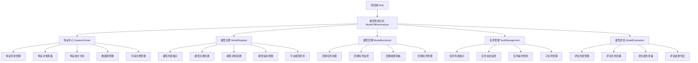
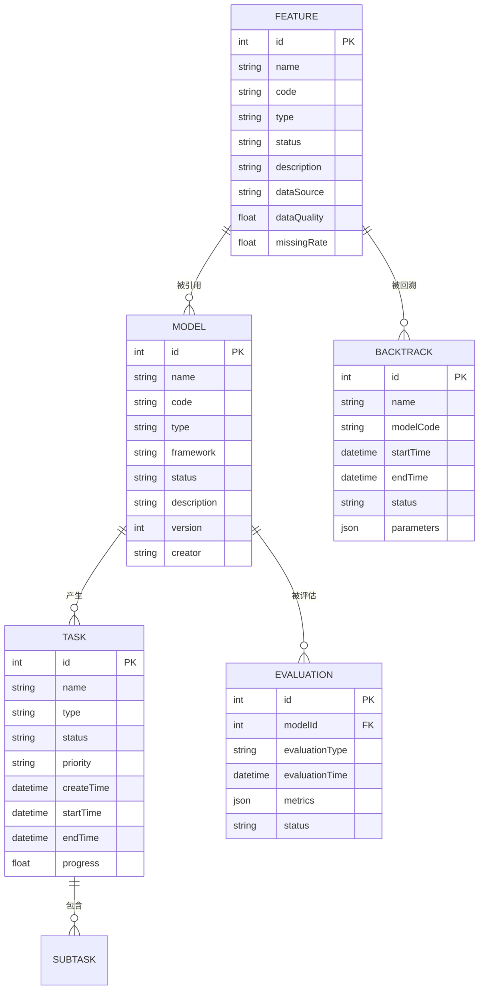
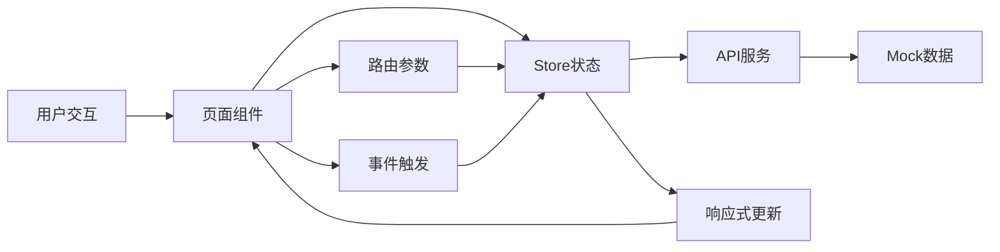

# 数据社区平台 - 项目结构优化方案

## 1. 项目概述

数据社区平台是一个企业级数据管理与分析平台，基于Vue 3 + Vite + Arco Design技术栈构建。平台主要功能包括数据发现、数据探索、数据管理、数字营销、数字风险管理和触达管理等模块。

本方案旨在优化项目结构，明确子应用边界，规范状态管理，清理过期文件，确保数据无冲突，提升项目可维护性和扩展性。

## 2. 一级菜单结构

### 2.1 菜单层级关系

```
首页
数据发现
数据探索  
数据管理
数字营销
数字风险
触达管理
```

### 2.2 菜单配置详情

| 菜单key       | 菜单标题 | 图标              | 类型     | 默认路径                      | 实现状态  |
| ----------- | ---- | --------------- | ------ | ------------------------- | ----- |
| home        | 首页   | icon-home       | single | /home                     | ✅ 已实现 |
| discovery   | 数据发现 | icon-search     | module | /discovery/asset-overview | ✅ 已实现 |
| exploration | 数据探索 | icon-experiment | module | /exploration/index        | ✅ 已实现 |
| management  | 数据管理 | icon-robot      | module | /management/service       | ✅ 已实现 |
| marketing   | 数字营销 | icon-dashboard  | module | /marketing/dashboard      | ✅ 已实现 |
| risk        | 数字风险 | icon-safe       | module | /risk/index               | ✅ 已实现 |
| touch       | 触达管理 | icon-send       | module | /touch                    | ✅ 已实现 |

## 3. 二级菜单详细规划

### 3.1 数据发现模块

#### 3.1.1 基础功能

| 菜单key                  | 页面标题  | 路由路径                            | 页面文件                                               | 实现状态  |
| ---------------------- | ----- | ------------------------------- | -------------------------------------------------- | ----- |
| asset-overview         | 资产总览  | /discovery/asset-overview       | pages/discovery/asset-overview/index.vue           | ✅ 已实现 |
| data-map               | 统一搜索  | /discovery/data-map             | pages/discovery/data-map/index.vue                 | ✅ 已实现 |
| full-data              | 全量数据  | /discovery/data-map/table-list  | pages/discovery/data-map/TableList.vue             | ✅ 已实现 |
| collections-management | 常用表管理 | /discovery/data-map/collections | pages/discovery/data-map/CollectionsManagement.vue | ✅ 已实现 |
| favorites              | 我的收藏  | /discovery/favorites            | pages/discovery/favorites/index.vue                | ✅ 已实现 |
| lineage                | 血缘分析  | /discovery/lineage              | pages/discovery/lineage/index.vue                  | ✅ 已实现 |
| customer360            | 客户360 | /discovery/customer360          | pages/discovery/customer360/index.vue              | ✅ 已实现 |

#### 3.1.2 数据资产组

| 菜单key            | 页面标题 | 路由路径                    | 页面文件                                   | 实现状态  |
| ---------------- | ---- | ----------------------- | -------------------------------------- | ----- |
| metrics-map      | 指标地图 | /discovery/metrics-map  | pages/discovery/metrics-map/index.vue  | ✅ 已实现 |
| variable-map     | 变量地图 | /discovery/variable-map | pages/discovery/variable-map/index.vue | ✅ 已实现 |
| credit-variables | 征信变量 | /discovery/credit       | pages/discovery/credit/index.vue       | ✅ 已实现 |
| external-data    | 外部数据 | /external-data-v1/list  | pages/external-data-v1/index.vue       | ✅ 已实现 |

#### 3.1.3 数据要素组

| 菜单key      | 页面标题  | 路由路径                  | 页面文件                                 | 实现状态  |
| ---------- | ----- | --------------------- | ------------------------------------ | ----- |
| api-market | API集市 | /discovery/api-market | pages/discovery/api-market/index.vue | ✅ 已实现 |

#### 3.1.4 数据注册组

| 菜单key                  | 页面标题   | 路由路径                                               | 页面文件                                                              | 实现状态  |
| ---------------------- | ------ | -------------------------------------------------- | ----------------------------------------------------------------- | ----- |
| batch-asset-management | 批量资产管理 | /discovery/asset-management/batch-asset-management | pages/discovery/asset-management/batch-asset-management/index.vue | ✅ 已实现 |

### 3.2 数据探索模块

#### 3.2.1 基础功能

| 菜单key             | 页面标题 | 路由路径               | 页面文件                        | 实现状态  |
| ----------------- | ---- | ------------------ | --------------------------- | ----- |
| exploration-index | 探索首页 | /exploration/index | pages/exploration/index.vue | ✅ 已实现 |

#### 3.2.2 客群中心组

| 菜单key               | 页面标题 | 路由路径                                                             | 页面文件                                                                      | 实现状态  |
| ------------------- | ---- | ---------------------------------------------------------------- | ------------------------------------------------------------------------- | ----- |
| audience-management | 人群管理 | /exploration/customer-center/audience-system/audience-management | pages/exploration/customer-center/audience-system/audience-management.vue | ✅ 已实现 |

#### 3.2.3 事件中心组

| 菜单key              | 页面标题     | 路由路径                                                       | 页面文件                                                                | 实现状态  |
| ------------------ | -------- | ---------------------------------------------------------- | ------------------------------------------------------------------- | ----- |
| event-center-index | 事件中心首页   | /exploration/customer-center/event-center                  | pages/exploration/customer-center/event-center/index.vue            | ✅ 已实现 |
| event-management   | 事件管理     | /exploration/customer-center/event-center/event-management | pages/exploration/customer-center/event-center/event-management.vue | ✅ 已实现 |
| virtual-events     | 虚拟事件     | /exploration/customer-center/event-center/virtual-events   | pages/exploration/customer-center/event-center/virtual-events.vue   | ✅ 已实现 |
| sample-stats       | 样本统计     | /exploration/customer-center/event-center/sample-stats     | pages/exploration/customer-center/event-center/sample-stats.vue     | ✅ 已实现 |
| kafka-datasource   | Kafka数据源 | /exploration/customer-center/event-center/kafka-datasource | pages/exploration/customer-center/event-center/kafka-datasource.vue | ✅ 已实现 |

#### 3.2.4 标签体系组

| 菜单key                 | 页面标题   | 路由路径                                                         | 页面文件                                                                  | 实现状态  |
| --------------------- | ------ | ------------------------------------------------------------ | --------------------------------------------------------------------- | ----- |
| tag-system-index      | 标签体系首页 | /exploration/customer-center/tag-system                      | pages/exploration/customer-center/tag-system/index.vue                | ✅ 已实现 |
| table-management      | 标签表管理  | /exploration/customer-center/tag-system/table-management     | pages/exploration/customer-center/tag-system/table-management.vue     | ✅ 已实现 |
| tag-management        | 标签管理   | /exploration/customer-center/tag-system/tag-management       | pages/exploration/customer-center/tag-system/tag-management.vue       | ✅ 已实现 |
| attribute-management  | 属性管理   | /exploration/customer-center/tag-system/attribute-management | pages/exploration/customer-center/tag-system/attribute-management.vue | ✅ 已实现 |
| tag-center            | 标签特征中心 | /exploration/customer-center/tag-system/tag-center           | pages/exploration/customer-center/tag-system/tag-center.vue           | ✅ 已实现 |
| datasource-management | 数据源管理  | /exploration/customer-center/datasource-management           | pages/exploration/customer-center/datasource-management/index.vue     | ✅ 已实现 |

#### 3.2.5 分析工具组

| 菜单key               | 页面标题   | 路由路径                   | 页面文件                                            | 实现状态  |
| ------------------- | ------ | ---------------------- | ----------------------------------------------- | ----- |
| workflow-management | 分析流程管理 | /exploration/workflows | pages/exploration/workflows/WorkflowManager.vue | ✅ 已实现 |

### 3.3 数据管理模块

#### 3.3.1 数据服务组

| 菜单key             | 页面标题      | 路由路径                                  | 页面文件                                              | 实现状态  |
| ----------------- | --------- | ------------------------------------- | ------------------------------------------------- | ----- |
| service-index     | 服务首页      | /management/service                   | pages/management/index.vue                        | ✅ 已实现 |
| detail-data-query | 明细数据查询服务  | /management/service/detail-data-query | pages/management/service/detail-data-query.vue    | ✅ 已实现 |
| api-management    | API管理     | /management/service/api-management    | pages/management/service/api-management/index.vue | ✅ 已实现 |
| data-models       | 数据查询&管理模型 | /management/data-models               | pages/management/data-models/index.vue            | ✅ 已实现 |

#### 3.3.2 资产管理组

| 菜单key                    | 页面标题   | 路由路径                                                                     | 页面文件                                                                                    | 实现状态  |
| ------------------------ | ------ | ------------------------------------------------------------------------ | --------------------------------------------------------------------------------------- | ----- |
| table-management         | 表管理    | /management/asset-management/listing-management/table-management         | pages/management/asset-management/listing-management/table-management/index.vue         | ✅ 已实现 |
| external-data-management | 外部数据管理 | /management/asset-management/listing-management/external-data-management | pages/management/asset-management/listing-management/external-data-management/index.vue | ✅ 已实现 |
| metric-management        | 指标管理   | /management/asset-management/listing-management/metric-management        | pages/management/asset-management/listing-management/metric-management/index.vue        | ✅ 已实现 |
| variable-management      | 变量注册   | /management/asset-management/listing-management/variable-management      | pages/management/asset-management/listing-management/variable-management/index.vue      | ✅ 已实现 |

#### 3.3.3 基础管理组

| 菜单key               | 页面标题  | 路由路径                                                              | 页面文件                                                                             | 实现状态  |
| ------------------- | ----- | ----------------------------------------------------------------- | -------------------------------------------------------------------------------- | ----- |
| metadata-collection | 元数据采集 | /management/asset-management/basic-management/metadata-collection | pages/management/asset-management/basic-management/metadata-collection/index.vue | ✅ 已实现 |
| tag-management      | 标签管理  | /management/asset-management/basic-management/tag-management      | pages/management/asset-management/basic-management/tag-management/index.vue      | ✅ 已实现 |

#### 3.3.4 权限管理组

| 菜单key            | 页面标题   | 路由路径                                   | 页面文件                                                  | 实现状态  |
| ---------------- | ------ | -------------------------------------- | ----------------------------------------------------- | ----- |
| permission-apply | 权限服务   | /management/permission                 | pages/management/permission/index.vue                 | ✅ 已实现 |
| business-module  | 业务模块管理 | /management/permission/business-module | pages/management/permission/business-module/index.vue | ✅ 已实现 |
| role-management  | 角色管理   | /management/permission/role-management | pages/management/permission/role-management/index.vue | ✅ 已实现 |
| user-management  | 用户管理   | /management/permission/user-management | pages/management/permission/user-management/index.vue | ✅ 已实现 |
| data-permission  | 数据权限   | /management/permission/data-permission | pages/management/permission/data-permission/index.vue | ✅ 已实现 |
| app-permission   | 应用权限   | /management/permission/app-permission  | pages/management/permission/app-permission/index.vue  | ✅ 已实现 |

#### 3.3.5 数据标准组

| 菜单key     | 页面标题   | 路由路径                                | 页面文件                                               | 实现状态  |
| --------- | ------ | ----------------------------------- | -------------------------------------------------- | ----- |
| standards | 数据标准管理 | /management/data-standard/standards | pages/management/data-standard/standards/index.vue | ✅ 已实现 |
| domains   | 数据域管理  | /management/data-standard/domains   | pages/management/data-standard/domains/index.vue   | ✅ 已实现 |
| codes     | 标准代码管理 | /management/data-standard/codes     | pages/management/data-standard/codes/index.vue     | ✅ 已实现 |
| words     | 标准单词管理 | /management/data-standard/words     | pages/management/data-standard/words/index.vue     | ✅ 已实现 |

### 3.4 数字营销模块

#### 3.4.1 权益中心组

| 菜单key             | 页面标题 | 路由路径                          | 页面文件                                         | 实现状态  |
| ----------------- | ---- | ----------------------------- | -------------------------------------------- | ----- |
| dashboard         | 权益首页 | /marketing/dashboard          | pages/marketing/index.vue                    | ✅ 已实现 |
| template          | 模板管理 | /marketing/benefit/template   | pages/marketing/benefit/template/index.vue   | ✅ 已实现 |
| coupon-management | 券管理  | /marketing/benefit/management | pages/marketing/benefit/management/index.vue | ✅ 已实现 |
| package           | 券包管理 | /marketing/benefit/package    | pages/marketing/benefit/package/index.vue    | ✅ 已实现 |

#### 3.4.2 数据统计组

| 菜单key       | 页面标题 | 路由路径                            | 页面文件                                       | 实现状态  |
| ----------- | ---- | ------------------------------- | ------------------------------------------ | ----- |
| coupon-logs | 权益日志 | /marketing/statistics/logs      | pages/marketing/coupon/record/index.vue    | ✅ 已实现 |
| inventory   | 库存查询 | /marketing/statistics/inventory | pages/marketing/coupon/inventory/index.vue | ✅ 已实现 |

#### 3.4.3 全局管理组

| 菜单key            | 页面标题 | 路由路径                        | 页面文件                                       | 实现状态  |
| ---------------- | ---- | --------------------------- | ------------------------------------------ | ----- |
| global-rules     | 全局规则 | /marketing/global/rules     | pages/marketing/global/rules/index.vue     | ✅ 已实现 |
| alert-management | 预警管理 | /marketing/alert/management | pages/marketing/alert/management/index.vue | ✅ 已实现 |

#### 3.4.4 营销中心组

| 菜单key                      | 页面标题   | 路由路径                        | 页面文件                            | 实现状态  |
| -------------------------- | ------ | --------------------------- | ------------------------------- | ----- |
| marketing-tasks            | 营销任务   | /marketing/tasks            | pages/marketing/tasks/index.vue | ✅ 已实现 |
| marketing-tasks-horizontal | 横版营销画布 | /marketing/tasks/horizontal | pages/marketing/tasks/index.vue | ✅ 已实现 |

### 3.5 数字风险模块

#### 3.5.1 风险首页

| 菜单key      | 页面标题 | 路由路径        | 页面文件                 | 实现状态  |
| ---------- | ---- | ----------- | -------------------- | ----- |
| risk-index | 风险首页 | /risk/index | pages/risk/index.vue | ✅ 已实现 |

#### 3.5.2 预算管理组

| 菜单key                        | 页面标题 | 路由路径                    | 页面文件                                | 实现状态  |
| ---------------------------- | ---- | ----------------------- | ----------------------------------- | ----- |
| risk-budget-overview         | 预算总览 | /risk/budget-overview   | modules/budget/pages/Overview\.vue  | ✅ 已实现 |
| risk-budget-list             | 预算列表 | /risk/budget/list       | modules/budget/pages/List.vue       | ✅ 已实现 |
| risk-contract-management     | 合同管理 | /risk/budget/contracts  | modules/budget/pages/Contracts.vue  | ✅ 已实现 |
| risk-budget-monitor          | 预算监控 | /risk/budget/monitor    | modules/budget/pages/Monitor.vue    | ✅ 已实现 |
| risk-budget-settlement-index | 结算管理 | /risk/budget/settlement | modules/budget/pages/Settlement.vue | ✅ 已实现 |

#### 3.5.3 外数生命周期组

| 菜单key                              | 页面标题   | 路由路径                           | 页面文件                                       | 实现状态  |
| ---------------------------------- | ------ | ------------------------------ | ------------------------------------------ | ----- |
| risk-external-data-lifecycle-index | 外数生命周期 | /risk/external-data/lifecycle  | modules/external-data/pages/Lifecycle.vue  | ✅ 已实现 |
| risk-external-data-archive         | 外数档案   | /risk/external-data/archive    | modules/external-data/pages/Archive.vue    | ✅ 已实现 |
| risk-external-data-evaluation      | 外数评估   | /risk/external-data/evaluation | modules/external-data/pages/Evaluation.vue | ✅ 已实现 |
| risk-budget-management             | 预算管理   | /risk/budget-overview          | modules/budget/pages/Overview\.vue         | ✅ 已实现 |
| risk-external-data-service         | 外数服务   | /risk/external-data/service    | modules/external-data/pages/Service.vue    | ✅ 已实现 |

#### 3.5.4 模型离线分析组

| 菜单key                 | 页面标题 | 路由路径                                          | 页面文件 | 实现状态  |
| --------------------- | ---- | --------------------------------------------- | ---- | ----- |
| risk-feature-center   | 特征中心 | /risk/model-offline-analysis/feature-center   | 待创建  | ❌ 待实现 |
| risk-model-register   | 模型注册 | /risk/model-offline-analysis/model-register   | 待创建  | ❌ 待实现 |
| risk-model-backtrack  | 模型回溯 | /risk/model-offline-analysis/model-backtrack  | 待创建  | ❌ 待实现 |
| risk-task-management  | 任务管理 | /risk/model-offline-analysis/task-management  | 待创建  | ❌ 待实现 |
| risk-model-evaluation | 模型评估 | /risk/model-offline-analysis/model-evaluation | 待创建  | ❌ 待实现 |

### 3.6 触达管理模块

#### 3.6.1 基础功能

| 菜单key             | 页面标题   | 路由路径                     | 页面文件                             | 实现状态  |
| ----------------- | ------ | ------------------------ | -------------------------------- | ----- |
| touch-index       | 触达首页   | /touch                   | pages/touch/index.vue            | ✅ 已实现 |
| channel-blacklist | 渠道黑名单  | /touch/channel/blacklist | pages/touch/channel/index.vue    | ✅ 已实现 |
| manual-sms        | 手动短信   | /touch/manual-sms        | pages/touch/manual-sms/index.vue | ✅ 已实现 |
| manual-sms-list   | 手动短信列表 | /touch/manual-sms/list   | pages/touch/manual-sms/list.vue  | ✅ 已实现 |
| policy-template   | 策略模板   | /touch/policy/template   | pages/touch/policy/index.vue     | ✅ 已实现 |
| touch-query       | 触达查询   | /touch/query             | pages/touch/query/index.vue      | ✅ 已实现 |

## 4. 统一路由规划

### 4.1 路由命名规范

#### 4.1.1 基础命名规则

* 使用小写字母和连字符（kebab-case）

* 避免使用特殊字符和空格

* 保持语义化和可读性

#### 4.1.2 模块级命名

```
模块名-功能名：discovery-asset-overview
模块名-子模块-功能名：exploration-customer-center-event-center
```

#### 4.1.3 页面级命名

```
功能名：asset-overview
功能名-操作：coupon-create
功能名-详情：customer-detail
```

### 4.2 路由路径规范

#### 4.2.1 基础路径规则

* 使用小写字母和连字符

* 层级结构清晰，避免过深嵌套

* 复数形式表示集合，单数表示单个资源

#### 4.2.2 路径结构示例

```
模块根路径：/discovery
功能路径：/discovery/asset-overview
详情路径：/discovery/customer360/detail/:id
操作路径：/marketing/coupon/create
```

### 4.3 路由元信息规范

#### 4.3.1 必需字段

```javascript
meta: {
  title: '页面标题',           // 必需，用于页面标题和面包屑
  requiresAuth: true,        // 可选，是否需要登录
  icon: 'icon-name',         // 可选，菜单图标
  hidden: false            // 可选，是否在菜单中隐藏
}
```

#### 4.3.2 可选字段

```javascript
meta: {
  layout: 'blank',         // 可选，使用空白布局
  description: '页面描述',   // 可选，页面描述
  breadcrumb: [...]        // 可选，自定义面包屑
}
```

## 5. 待实现占位页清单

### 5.1 数字风险模块 - 模型离线分析

#### 5.1.1 特征中心页面

* **页面路径**: `/risk/model-offline-analysis/feature-center`

* **页面文件**: `pages/risk/model-offline-analysis/feature-center/index.vue`

* **功能描述**: 模型特征管理与配置

* **命名规范**: `RiskFeatureCenter`

#### 5.1.2 模型注册页面

* **页面路径**: `/risk/model-offline-analysis/model-register`

* **页面文件**: `pages/risk/model-offline-analysis/model-register/index.vue`

* **功能描述**: 新模型注册与配置

* **命名规范**: `RiskModelRegister`

#### 5.1.3 模型回溯页面

* **页面路径**: `/risk/model-offline-analysis/model-backtrack`

* **页面文件**: `pages/risk/model-offline-analysis/model-backtrack/index.vue`

* **功能描述**: 历史模型数据回溯分析

* **命名规范**: `RiskModelBacktrack`

#### 5.1.4 任务管理页面

* **页面路径**: `/risk/model-offline-analysis/task-management`

* **页面文件**: `pages/risk/model-offline-analysis/task-management/index.vue`

* **功能描述**: 模型训练任务管理

* **命名规范**: `RiskTaskManagement`

#### 5.1.5 模型评估页面

* **页面路径**: `/risk/model-offline-analysis/model-evaluation`

* **页面文件**: `pages/risk/model-offline-analysis/model-evaluation/index.vue`

* **功能描述**: 模型效果评估与对比

* **命名规范**: `RiskModelEvaluation`

## 6. 风险域-模型离线分析模块映射

### 6.1 模块架构概览

模型离线分析模块是数字风险域的核心子模块，提供从特征管理到模型评估的完整机器学习生命周期管理能力。



### 6.2 核心业务实体关系



## 7. 页面-路由-目录对应表

### 7.1 模型离线分析模块完整映射

| 页面名称 | 路由路径 | 页面文件路径 | 路由名称 | 菜单配置 | 状态 |
|---------|---------|-------------|---------|---------|------|
| **特征中心** | `/risk/model-offline-analysis/feature-center` | `/src/pages/risk/model-offline-analysis/featureCenter/index.vue` | `RiskFeatureCenter` | `risk-model-offline-analysis.risk-feature-center` | ✅ 已实现 |
| **模型注册** | `/risk/model-offline-analysis/model-register` | `/src/pages/risk/model-offline-analysis/modelRegister/index.vue` | `RiskModelRegister` | `risk-model-offline-analysis.risk-model-register` | ✅ 已实现 |
| **模型回溯** | `/risk/model-offline-analysis/model-backtrack` | `/src/pages/risk/model-offline-analysis/modelBacktrack/index.vue` | `RiskModelBacktrack` | `risk-model-offline-analysis.risk-model-backtrack` | ✅ 已实现 |
| **任务管理** | `/risk/model-offline-analysis/task-management` | `/src/pages/risk/model-offline-analysis/taskManagement/index.vue` | `RiskTaskManagement` | `risk-model-offline-analysis.risk-task-management` | ✅ 已实现 |
| **模型评估** | `/risk/model-offline-analysis/model-evaluation` | `/src/pages/risk/model-offline-analysis/modelEvaluation/index.vue` | `RiskModelEvaluation` | `risk-model-offline-analysis.risk-model-evaluation` | ✅ 已实现 |
| **模块布局** | `/risk/model-offline-analysis/*` | `/src/pages/risk/model-offline-analysis/Layout.vue` | `ModelOfflineAnalysis` | `risk-model-offline-analysis` (父级) | ✅ 已实现 |

### 7.2 路由配置文件映射

| 路由配置文件 | 功能描述 | 包含路由 | 状态 |
|-------------|---------|---------|------|
| `/src/router/model-offline-analysis.js` | 模型离线分析专用路由配置 | 5个子路由 + 1个布局路由 | ✅ 已配置 |
| `/src/router/offlineModel.js` | 独立离线模型模块路由 | 15个路由（包含详情页） | ✅ 已配置 |
| `/src/config/menuConfig.js` | 统一菜单配置 | 风险域模型离线分析分组 | ✅ 已配置 |

### 7.3 组件结构映射

| 组件类型 | 路径 | 功能描述 | 状态 |
|---------|------|---------|------|
| **布局组件** | `/src/pages/risk/model-offline-analysis/Layout.vue` | 模块统一布局，包含侧边导航 | ✅ 已实现 |
| **页面头组件** | `/src/pages/risk/model-offline-analysis/components/PageHeader.vue` | 统一页面头部，显示面包屑和标题 | ✅ 已实现 |
| **特征中心页** | `/src/pages/risk/model-offline-analysis/featureCenter/index.vue` | 特征列表、搜索、管理功能 | ✅ 已实现 |
| **模型注册页** | `/src/pages/risk/model-offline-analysis/modelRegister/index.vue` | 模型列表、注册、配置功能 | ✅ 已实现 |
| **模型回溯页** | `/src/pages/risk/model-offline-analysis/modelBacktrack/index.vue` | 回溯任务管理界面 | ✅ 已实现 |
| **任务管理页** | `/src/pages/risk/model-offline-analysis/taskManagement/index.vue` | 任务列表、状态监控 | ✅ 已实现 |
| **模型评估页** | `/src/pages/risk/model-offline-analysis/modelEvaluation/index.vue` | 评估任务管理界面 | ✅ 已实现 |

## 8. 数据与状态管理规范

### 8.1 Store模块结构

模型离线分析模块采用Pinia进行状态管理，在 `/src/store/modules/model-offline.js` 中定义了以下Store：

#### 8.1.1 特征中心状态管理 (`useFeatureStore`)

```javascript
// 状态结构
state: {
  features: [],              // 特征列表数据
  loading: false,            // 加载状态
  pagination: {              // 分页配置
    current: 1,
    pageSize: 10,
    total: 0
  },
  filterForm: {               // 筛选表单
    name: '',
    type: '',
    status: ''
  },
  selectedRows: [],           // 选中行数据
  stats: {                    // 统计信息
    totalFeatures: 0,
    activeFeatures: 0,
    pendingFeatures: 0,
    expiredFeatures: 0
  }
}

// 主要Actions
- setFeatures(features)          // 设置特征列表
- setLoading(loading)            // 设置加载状态
- setPagination(pagination)      // 更新分页
- setFilterForm(form)            // 更新筛选条件
- setSelectedRows(rows)          // 设置选中行
- setStats(stats)                // 更新统计信息
- resetFilter()                  // 重置筛选条件
```

#### 8.1.2 模型注册状态管理 (`useModelStore`)

```javascript
// 状态结构
state: {
  models: [],                // 模型列表数据
  loading: false,            // 加载状态
  pagination: {              // 分页配置
    current: 1,
    pageSize: 10,
    total: 0
  },
  filterForm: {               // 筛选表单
    name: '',
    type: '',
    framework: '',
    status: ''
  },
  selectedRows: [],          // 选中行数据
  stats: {                   // 统计信息
    totalModels: 0,
    activeModels: 0,
    trainingModels: 0,
    failedModels: 0
  }
}

// 主要Actions
- setModels(models)            // 设置模型列表
- setLoading(loading)          // 设置加载状态
- setPagination(pagination)    // 更新分页
- setFilterForm(form)          // 更新筛选条件
- setSelectedRows(rows)        // 设置选中行
- setStats(stats)              // 更新统计信息
- resetFilter()                // 重置筛选条件
```

#### 8.1.3 任务管理状态管理 (`useTaskStore`)

```javascript
// 状态结构
state: {
  tasks: [],                 // 任务列表数据
  loading: false,            // 加载状态
  pagination: {              // 分页配置
    current: 1,
    pageSize: 10,
    total: 0
  },
  filterForm: {               // 筛选表单
    name: '',
    type: '',
    status: '',
    priority: ''
  },
  selectedRows: [],          // 选中行数据
  stats: {                   // 统计信息
    runningTasks: 0,
    completedTasks: 0,
    failedTasks: 0,
    pausedTasks: 0
  }
}

// 主要Actions
- setTasks(tasks)              // 设置任务列表
- setLoading(loading)          // 设置加载状态
- setPagination(pagination)    // 更新分页
- setFilterForm(form)          // 更新筛选条件
- setSelectedRows(rows)        // 设置选中行
- setStats(stats)              // 更新统计信息
- resetFilter()                // 重置筛选条件
```

#### 8.1.4 模型评估状态管理 (`useEvaluationStore`)

```javascript
// 状态结构
state: {
  evaluations: [],           // 评估列表数据
  loading: false,            // 加载状态
  pagination: {              // 分页配置
    current: 1,
    pageSize: 10,
    total: 0
  },
  filterForm: {               // 筛选表单
    modelName: '',
    evaluationType: '',
    dateRange: []
  },
  selectedRows: []           // 选中行数据
}

// 主要Actions
- setEvaluations(evaluations)    // 设置评估列表
- setLoading(loading)            // 设置加载状态
- setPagination(pagination)      // 更新分页
- setFilterForm(form)            // 更新筛选条件
- setSelectedRows(rows)          // 设置选中行
- resetFilter()                  // 重置筛选条件
```

#### 8.1.5 主模块状态管理 (`useModelOfflineStore`)

```javascript
// 状态结构
state: {
  activeMenu: 'feature-center',    // 当前激活菜单
  collapsed: false,                // 侧边栏折叠状态
  breadcrumb: []                   // 面包屑导航
}

// 主要Actions
- setActiveMenu(menu)              // 设置激活菜单
- setCollapsed(collapsed)          // 设置折叠状态
- setBreadcrumb(breadcrumb)        // 设置面包屑
```

### 8.2 API接口规范

#### 8.2.1 API文件结构

模型离线分析模块的API定义在 `/src/api/offlineModel/index.js` 中，采用分层设计：

```javascript
// API分层结构
/src/api/offlineModel/
├── index.js              # 主入口文件，定义所有API接口
└── [待扩展]              # 可按功能拆分子模块

// Mock数据服务
/src/mock/offlineModel/
├── index.js              # Mock主入口
├── feature.js            # 特征中心Mock数据
├── model.js              # 模型注册Mock数据
├── backtrack.js          # 模型回溯Mock数据
└── task.js               # 任务管理Mock数据
```

#### 8.2.2 特征中心API定义

```javascript
// 特征中心API集合
export const featureAPI = {
  getFeatures: (params) => mockAPI.feature.getFeatures(params),
  getFeatureDetail: (id) => mockAPI.feature.getFeatureDetail(id),
  createFeature: (data) => mockAPI.feature.createFeature(data),
  updateFeature: (id, data) => mockAPI.feature.updateFeature(id, data),
  deleteFeature: (id) => mockAPI.feature.deleteFeature(id),
  archiveFeature: (id) => mockAPI.feature.archiveFeature(id),
  getFeatureStats: () => mockAPI.feature.getFeatureStats(),
  importFeatures: (data) => mockAPI.feature.importFeatures(data),
  exportFeatures: (params) => mockAPI.feature.exportFeatures(params),
  getFeatureTypes: () => mockAPI.feature.getFeatureTypes(),
  getFeatureStatus: () => mockAPI.feature.getFeatureStatus(),
  
  // 数据源管理
  listTables: () => mockAPI.feature.listTables(),
  getTableColumns: (tableName) => mockAPI.feature.getTableColumns(tableName),
  getTableMeta: (tableName) => mockAPI.feature.getTableMeta(tableName),
  setTableMeta: (tableName, meta) => mockAPI.feature.setTableMeta(tableName, meta),
  getRegisteredFields: (tableName) => mockAPI.feature.getRegisteredFields(tableName),
  getUnregisteredFields: (tableName) => mockAPI.feature.getUnregisteredFields(tableName),
  batchRegisterFields: (tableName, fields) => mockAPI.feature.batchRegisterFields(tableName, fields),
  listDatabases: (sourceType) => mockAPI.feature.listDatabases(sourceType),
  listTablesByDb: (sourceType, dbName) => mockAPI.feature.listTablesByDb(sourceType, dbName)
}
```

#### 8.2.3 模型注册API定义

```javascript
// 模型注册API集合
export const modelAPI = {
  getModels: (params) => mockAPI.model.getModels(params),
  getModelDetail: (id) => mockAPI.model.getModelDetail(id),
  createModel: (data) => mockAPI.model.createModel(data),
  updateModel: (id, data) => mockAPI.model.updateModel(id, data),
  deleteModel: (id) => mockAPI.model.deleteModel(id),
  archiveModel: (id) => mockAPI.model.archiveModel(id),
  getModelVersions: (id) => mockAPI.model.getModelVersions(id),
  getModelVersionDetail: (id, version) => mockAPI.model.getModelVersionDetail(id, version),
  getModelStats: () => mockAPI.model.getModelStats(),
  importModels: (data) => mockAPI.model.importModels(data),
  exportModels: (params) => mockAPI.model.exportModels(params),
  getModelTypes: () => mockAPI.model.getModelTypes(),
  getFrameworks: () => mockAPI.model.getFrameworks(),
  getModelStatus: () => mockAPI.model.getModelStatus(),
  retrainModel: (id) => mockAPI.model.retrainModel(id),
  
  // 平台模型同步
  listPlatformModels: () => mockAPI.model.listPlatformModels(),
  getPlatformModel: (serviceName) => mockAPI.model.getPlatformModel(serviceName),
  downloadPlatformModelFile: (serviceName) => mockAPI.model.downloadPlatformModelFile(serviceName),
  createModelVersion: (id) => mockAPI.model.createModelVersion(id)
}
```

#### 8.2.4 统一响应格式

```javascript
// 统一API响应格式
function createResponse(data, success = true, message = '') {
  return {
    success,           // 成功状态
    message,           // 响应消息
    data,              // 响应数据
    timestamp: new Date().toISOString()  // 时间戳
  }
}

// 统一错误响应格式
function createErrorResponse(message, code = 500) {
  return {
    success: false,     // 失败状态
    message,           // 错误消息
    code,              // 错误代码
    timestamp: new Date().toISOString()  // 时间戳
  }
}
```

### 8.3 Mock数据规范

#### 8.3.1 Mock数据组织结构

Mock数据采用模块化设计，每个业务模块独立管理：

```javascript
// 特征中心Mock数据结构
// /src/mock/offlineModel/feature.js
const FEATURE_TYPES = {
  NUMERICAL: 'numerical',
  CATEGORICAL: 'categorical',
  TEXT: 'text',
  TIME: 'time'
}

const FEATURE_STATUS = {
  ACTIVE: 'active',
  INACTIVE: 'inactive',
  DRAFT: 'draft',
  PENDING: 'pending',
  EXPIRED: 'expired'
}

// 模拟特征数据
const mockFeatures = [
  {
    id: 1,
    name: '用户年龄',
    code: 'user_age',
    type: FEATURE_TYPES.NUMERICAL,
    description: '用户的年龄信息',
    majorCategory: 'credit',
    level1: 'credit_report',
    level2: 'query_count',
    status: FEATURE_STATUS.ACTIVE,
    createTime: '2024-01-15 10:30:00',
    creator: '张三',
    dataSource: '用户注册信息',
    updateFrequency: '每日',
    dataQuality: 95.2,
    missingRate: 0.8,
    uniqueValueCount: 1200
  }
  // ... 更多特征数据
]
```

#### 8.3.2 模型注册Mock数据结构

```javascript
// 模型注册Mock数据结构
// /src/mock/offlineModel/model.js
const MODEL_TYPES = {
  CLASSIFICATION: 'classification',
  REGRESSION: 'regression',
  CLUSTERING: 'clustering',
  DEEP_LEARNING: 'deep_learning'
}

const FRAMEWORKS = {
  SKLEARN: 'sklearn',
  TENSORFLOW: 'tensorflow',
  PYTORCH: 'pytorch',
  XGBOOST: 'xgboost'
}

const MODEL_STATUS = {
  ONLINE: 'online',
  ARCHIVED: 'archived'
}

// 模拟模型数据
const mockModels = [
  {
    id: 1,
    name: '信用评分模型',
    code: 'credit_score_model',
    type: MODEL_TYPES.CLASSIFICATION,
    framework: FRAMEWORKS.XGBOOST,
    version: 1,
    description: '基于用户行为数据的信用评分预测模型',
    status: MODEL_STATUS.ONLINE,
    createTime: '2024-01-15 10:30:00',
    creator: '张三',
    trainingDataSize: 50000,
    modelSize: '25.6MB',
    trainingTime: '2小时30分钟',
    hyperparameters: {
      max_depth: 6,
      learning_rate: 0.1,
      n_estimators: 100
    },
    features: ['user_age', 'user_income', 'credit_history', 'employment_status'],
    modelPath: '/models/credit_score_model.pkl',
    lastUpdateTime: '2024-01-15 10:30:00'
  }
  // ... 更多模型数据
]
```

#### 8.3.3 平台模型同步Mock数据

```javascript
// 平台模型同步Mock数据
const platformModels = [
  {
    serviceName: 'credit_score_service',
    name: '信用评分模型服务',
    code: 'credit_score_model',
    version: 'v1.0.0',
    framework: FRAMEWORKS.XGBOOST,
    type: MODEL_TYPES.CLASSIFICATION,
    description: '来自平台的信用评分服务，提供风险评分与标签输出',
    pkFields: ['cert_no', 'flow_id', 'report_id'],
    inputs: [
      { name: 'age', type: 'number', description: '用户年龄' },
      { name: 'income', type: 'number', description: '用户收入' },
      { name: 'credit_history', type: 'number', description: '信用历史分' }
    ],
    outputs: [
      { name: 'score', type: 'number', description: '风险评分' },
      { name: 'label', type: 'number', description: '预测标签' }
    ],
    fileUrl: '/platform/models/credit_score_model_v1.pkl'
  }
  // ... 更多平台模型
]
```

### 8.4 数据流规范

#### 8.4.1 组件数据流



#### 8.4.2 数据获取流程

1. **组件挂载阶段**：通过 `onMounted` 生命周期钩子调用 Store Action
2. **Store处理**：Store Action 调用 API 服务获取数据
3. **API调用**：API 服务调用 Mock 数据（开发环境）或真实接口
4. **数据更新**：Store 更新状态，组件通过响应式系统自动更新
5. **错误处理**：统一的错误处理和用户提示

#### 8.4.3 数据更新流程

1. **用户操作**：用户触发表单提交或按钮点击
2. **参数验证**：前端参数校验和格式化
3. **API调用**：调用相应的API服务进行数据更新
4. **结果处理**：处理API响应，更新Store状态
5. **界面反馈**：显示操作结果，刷新相关数据

### 5.2 占位页面模板

#### 5.2.1 基础模板结构

```vue
<template>
  <div class="placeholder-page">
    <a-card>
      <template #title>
        <span>{{ pageTitle }}</span>
      </template>
      <a-result
        status="info"
        :title="`🚧 ${pageTitle}开发中`"
        :sub-title="`该功能正在开发中，敬请期待...`"
      >
        <template #extra>
          <a-space>
            <a-button type="primary" @click="goBack">返回</a-button>
            <a-button @click="goHome">回到首页</a-button>
          </a-space>
        </template>
      </a-result>
    </a-card>
  </div>
</template>

<script setup>
import { useRouter } from 'vue-router'

const router = useRouter()
const pageTitle = '页面标题'

const goBack = () => {
  router.back()
}

const goHome = () => {
  router.push('/home')
}
</script>

<style scoped>
.placeholder-page {
  padding: 24px;
  min-height: 500px;
}
</style>
```

## 6. 命名规范

### 6.1 文件命名规范

#### 6.1.1 Vue组件文件

* 使用PascalCase命名法

* 以功能模块为前缀

* 示例：`RiskFeatureCenter.vue`、`CustomerDetail.vue`

#### 6.1.2 工具函数文件

* 使用camelCase命名法

* 以功能为描述

* 示例：`validationUtils.js`、`dateFormatter.js`

#### 6.1.3 配置文件

* 使用kebab-case命名法

* 以config为后缀

* 示例：`canvas-config.js`、`menu-config.js`

### 6.2 组件命名规范

#### 6.2.1 页面组件

```javascript
// 路由配置
{
  path: '/risk/model-offline-analysis/feature-center',
  name: 'RiskFeatureCenter',           // PascalCase
  component: () => import('../pages/risk/model-offline-analysis/feature-center/index.vue')
}
```

#### 6.2.2 通用组件

```javascript
// 组件命名
export default {
  name: 'BaseModal',                    // PascalCase
  components: {
    BaseTable,                          // PascalCase
    SearchForm
  }
}
```

### 6.3 变量命名规范

#### 6.3.1 响应式变量

```javascript
const userInfo = ref({})                // camelCase
const tableData = ref([])               // camelCase
const isLoading = ref(false)            // is前缀表示布尔值
```

#### 6.3.2 函数命名

```javascript
const getUserList = () => {}            // get前缀表示获取
const handleSubmit = () => {}           // handle前缀表示处理
const formatDate = () => {}             // 动词开头表示操作
```

#### 6.3.3 常量命名

```javascript
const ROUTE_NAMES = {                    // 全大写下划线
  HOME: 'home',
  DISCOVERY: 'discovery'
}

const API_URLS = {                       // 全大写下划线
  USER_LIST: '/api/users',
  USER_DETAIL: '/api/users/:id'
}
```

## 7. 子应用划分与边界

### 7.1 子应用识别与分类

#### 7.1.1 独立子应用（apps/目录）
基于项目结构分析，识别出以下独立子应用：

| 子应用名称 | 目录路径 | 功能边界 | 技术栈 | 状态 |
|----------|---------|---------|--------|------|
| **horizontal-canvas** | `apps/horizontal-canvas/` | 横版画布编辑器，提供营销流程可视化编辑能力 | Vue3 + Vite + Arco Design + AntV X6 | ✅ 活跃开发 |
| **report-monitor** | `apps/report-monitor/` | 报表监控平台，提供数据报表和监控告警功能 | Vue3 + Vite + TailwindCSS | ✅ 活跃开发 |
| **report-monitor-backend** | `apps/report-monitor-backend/` | 报表监控后端服务，提供API接口支持 | Node.js + TypeScript | ✅ 活跃开发 |
| **touch** | `apps/touch/` | 触达管理子应用，处理短信、外呼等触达渠道 | Vue3 + Vite + Arco Design | ✅ 活跃开发 |

#### 7.1.2 子应用边界定义

**横向画布子应用边界**：
- **核心功能**：营销流程画布编辑器、节点配置、连线管理、布局算法
- **数据边界**：仅处理画布相关数据，不直接访问业务数据
- **接口边界**：通过标准化API与主应用通信
- **样式边界**：独立样式系统，不依赖全局样式

**报表监控子应用边界**：
- **核心功能**：报表展示、监控告警、数据源管理
- **数据边界**：只读访问监控数据，不修改业务数据
- **部署边界**：可独立部署，支持微前端集成

### 7.2 子应用管理规范

#### 7.2.1 目录结构规范
```
apps/
├── [子应用名]/
│   ├── src/                 # 源代码目录
│   ├── docs/                # 子应用文档
│   ├── public/              # 静态资源
│   ├── package.json         # 独立依赖管理
│   ├── vite.config.ts       # 独立构建配置
│   └── README.md           # 子应用说明
```

#### 7.2.2 依赖管理原则
- **独立依赖**：各子应用维护独立的package.json
- **核心依赖复用**：Vue、Vue Router等核心依赖通过monorepo管理
- **构建工具统一**：统一使用Vite作为构建工具

## 8. 过期文件识别与处置

### 8.1 过期文件分类标准

#### 8.1.1 开发测试文件（立即清理）
**特征识别**：
- 文件名前缀：`test-*.html`、`debug-*.js`、`browser-*.js`
- 文件位置：项目根目录下的测试文件
- 创建时间：超过3个月且无更新的测试文件

**已识别文件列表**：
```
# 测试HTML文件（23个）
test-window-preview-system.html
test-storage.html
test-snap-operation.html
test-preview-line-in-browser.html
test-node-creation.html
test-in-port.html
...

# 调试JS文件（8个）
debug-y-coordinate-simple.js
debug-y-coordinate-complete.js
debug-undefined-error.js
debug-manual-call-config.js
...
```

#### 8.1.2 副本文件（评估后处理）
**特征识别**：
- 文件名包含：`_副本`、`_backup`、`_old`等后缀
- 文件内容：与原文件高度相似但无功能性修改

**已识别文件**：
```
src/components/MonacoEditor_副本.vue  # 疑似备份文件
```

#### 8.1.3 废弃文档（归档处理）
**特征识别**：
- 文档标题包含："旧版"、"废弃"、"历史"
- 文档内容：描述已不存在的功能或架构
- 创建时间：超过6个月且无人维护的功能文档

### 8.2 过期文件处置流程

#### 8.2.1 清理优先级划分
| 优先级 | 文件类型 | 处理方式 | 时间要求 |
|-------|---------|---------|---------|
| **P0** | 测试调试文件 | 立即删除 | 1周内 |
| **P1** | 副本备份文件 | 评估后删除/归档 | 2周内 |
| **P2** | 废弃文档 | 归档到历史目录 | 1个月内 |

#### 8.2.2 清理执行步骤
1. **备份阶段**：清理前创建完整代码备份
2. **通知阶段**：在团队群组发布清理通知
3. **执行阶段**：按优先级顺序执行清理
4. **验证阶段**：清理后运行完整测试验证
5. **记录阶段**：记录清理操作到变更日志

#### 8.2.3 风险控制措施
- **版本控制**：所有清理操作通过Git提交，支持回滚
- **测试覆盖**：清理后必须运行自动化测试
- **灰度清理**：先清理明确无用的文件，再处理边界文件
- **审批流程**：重要文件清理需技术负责人审批

## 9. 迁移清单与验收

### 9.1 子应用迁移清单

#### 9.1.1 横向画布子应用迁移
**迁移范围**：
```
apps/horizontal-canvas/
├── src/components/canvas/     # 画布核心组件
├── src/components/nodes/      # 节点组件库
├── src/composables/canvas/    # 画布逻辑复用
├── src/pages/marketing/tasks/horizontal/  # 横版画布页面
└── docs/                       # 相关文档
```

**验收标准**：
- ✅ 功能完整性：所有画布功能正常可用
- ✅ 数据隔离：不直接访问主应用业务数据
- ✅ 样式独立：样式不影响主应用
- ✅ 构建独立：可独立构建和部署
- ✅ 接口规范：通过标准化API通信

#### 9.1.2 报表监控子应用迁移
**迁移范围**：
```
apps/report-monitor/
├── src/pages/           # 报表页面
├── src/services/        # 数据服务
├── src/components/      # 报表组件
└── apps/report-monitor-backend/  # 后端服务
```

**验收标准**：
- ✅ 数据准确性：报表数据与源数据一致
- ✅ 性能指标：页面加载时间<2秒
- ✅ 告警功能：监控告警正常触发
- ✅ 部署独立：支持独立部署和扩展

### 9.2 过期文件清理清单

#### 9.2.1 第一阶段清理（测试调试文件）
**清理文件列表**：
```bash
# 测试HTML文件（23个）
rm test-*.html

# 调试JS文件（8个）  
rm debug-*.js

# 浏览器测试文件
rm browser-*.js
rm check-*.js
```

**验收标准**：
- ✅ 文件删除后项目可正常构建
- ✅ 自动化测试全部通过
- ✅ 核心功能无回归
- ✅ 代码覆盖率无下降

#### 9.2.2 第二阶段清理（副本文件）
**处理方案**：
```bash
# 评估副本文件
src/components/MonacoEditor_副本.vue → 删除（与主文件功能重复）

# 检查其他副本文件
find . -name "*副本*" -type f
find . -name "*backup*" -type f  
find . -name "*old*" -type f
```

**验收标准**：
- ✅ 副本文件功能已合并到主文件
- ✅ 无功能丢失
- ✅ 团队成员确认可删除

### 9.3 迁移时间表

| 阶段 | 任务内容 | 预计工时 | 负责人 | 完成时间 |
|-----|---------|---------|--------|----------|
| **阶段一** | 过期文件识别与分类 | 4小时 | 技术负责人 | 2026-01-23 |
| **阶段二** | 测试调试文件清理 | 2小时 | 前端开发 | 2026-01-24 |
| **阶段三** | 子应用边界梳理 | 8小时 | 架构师 | 2026-01-27 |
| **阶段四** | 副本文件处理 | 4小时 | 前端开发 | 2026-01-28 |
| **阶段五** | 迁移验收测试 | 6小时 | 测试团队 | 2026-01-29 |

### 9.4 风险评估与应对

#### 9.4.1 主要风险点
1. **功能回归风险**：清理过程中误删重要文件
2. **依赖冲突风险**：子应用独立后依赖版本冲突
3. **部署风险**：子应用独立部署失败
4. **数据隔离风险**：子应用与主应用数据耦合

#### 9.4.2 应对措施
- **完整备份**：迁移前创建完整代码和数据库备份
- **灰度发布**：先在小范围环境验证，再全量发布
- **快速回滚**：建立快速回滚机制，支持版本回退
- **监控告警**：加强迁移后的系统监控和告警
- **团队沟通**：迁移前后充分沟通，确保信息同步

## 10. 子应用与目录结构优化

### 10.1 子应用识别与分类

#### 10.1.1 独立子应用（apps/目录）
基于项目结构分析，识别出以下独立子应用：

| 子应用名称 | 目录路径 | 功能边界 | 技术栈 | 状态 | 风险域映射 |
|----------|---------|---------|--------|------|------------|
| **horizontal-canvas** | `apps/horizontal-canvas/` | 横版画布编辑器，提供营销流程可视化编辑能力 | Vue3 + Vite + Arco Design + AntV X6 | ✅ 活跃开发 | 数字营销-营销画布 |
| **report-monitor** | `apps/report-monitor/` | 报表监控平台，提供数据报表和监控告警功能 | Vue3 + Vite + TailwindCSS | ✅ 活跃开发 | 通用监控-报表展示 |
| **report-monitor-backend** | `apps/report-monitor-backend/` | 报表监控后端服务，提供API接口支持 | Node.js + TypeScript | ✅ 活跃开发 | 通用监控-后端服务 |
| **touch** | `apps/touch/` | 触达管理子应用，处理短信、外呼等触达渠道 | Vue3 + Vite + Arco Design | ✅ 活跃开发 | 触达管理-渠道管理 |

#### 10.1.2 子应用边界定义

**横向画布子应用边界**：
- **核心功能**：营销流程画布编辑器、节点配置、连线管理、布局算法
- **数据边界**：仅处理画布相关数据，不直接访问业务数据
- **接口边界**：通过标准化API与主应用通信
- **样式边界**：独立样式系统，不依赖全局样式
- **路由边界**：独立路由系统，通过微前端方式集成

**报表监控子应用边界**：
- **核心功能**：报表展示、监控告警、数据源管理
- **数据边界**：只读访问监控数据，不修改业务数据
- **部署边界**：可独立部署，支持微前端集成
- **接口边界**：通过RESTful API与主应用通信

**触达管理子应用边界**：
- **核心功能**：短信、外呼、AI呼叫等触达渠道管理
- **数据边界**：管理触达模板、记录、黑名单等数据
- **渠道边界**：集成多个第三方触达服务商
- **权限边界**：独立的权限管理体系

### 10.2 目录结构优化规范

#### 10.2.1 统一目录结构
```
apps/
├── [子应用名]/
│   ├── src/                 # 源代码目录
│   │   ├── components/      # 通用组件
│   │   ├── pages/          # 页面组件
│   │   ├── services/       # API服务
│   │   ├── store/          # 状态管理
│   │   ├── router/         # 路由配置
│   │   ├── utils/          # 工具函数
│   │   ├── types/          # TypeScript类型定义
│   │   └── assets/         # 静态资源
│   ├── docs/                # 子应用文档
│   ├── public/              # 静态资源
│   ├── tests/               # 测试文件
│   ├── package.json         # 独立依赖管理
│   ├── vite.config.ts       # 独立构建配置
│   ├── tsconfig.json        # TypeScript配置
│   └── README.md           # 子应用说明
```

#### 10.2.2 依赖管理原则
- **独立依赖**：各子应用维护独立的package.json
- **核心依赖复用**：Vue、Vue Router等核心依赖通过monorepo管理
- **构建工具统一**：统一使用Vite作为构建工具
- **UI组件统一**：统一使用Arco Design，保持视觉一致性
- **状态管理**：子应用内部使用Pinia，与主应用数据交互通过API

## 11. 风险域模型离线分析模块映射

### 11.1 模块架构概览

模型离线分析模块是数字风险域的核心子模块，提供从特征管理到模型评估的完整机器学习生命周期管理能力。


### 11.2 核心业务实体关系


### 11.3 页面-路由-目录映射表

| 页面名称 | 路由路径 | 页面文件路径 | 路由名称 | 菜单配置 | 状态 | 风险等级 |
|---------|---------|-------------|---------|---------|------|----------|
| **特征中心** | `/risk/model-offline-analysis/feature-center` | `/src/pages/risk/model-offline-analysis/featureCenter/index.vue` | `RiskFeatureCenter` | `risk-model-offline-analysis.risk-feature-center` | ✅ 已实现 | 低 |
| **模型注册** | `/risk/model-offline-analysis/model-register` | `/src/pages/risk/model-offline-analysis/modelRegister/index.vue` | `RiskModelRegister` | `risk-model-offline-analysis.risk-model-register` | ✅ 已实现 | 低 |
| **模型回溯** | `/risk/model-offline-analysis/model-backtrack` | `/src/pages/risk/model-offline-analysis/modelBacktrack/index.vue` | `RiskModelBacktrack` | `risk-model-offline-analysis.risk-model-backtrack` | ✅ 已实现 | 中 |
| **任务管理** | `/risk/model-offline-analysis/task-management` | `/src/pages/risk/model-offline-analysis/taskManagement/index.vue` | `RiskTaskManagement` | `risk-model-offline-analysis.risk-task-management` | ✅ 已实现 | 中 |
| **模型评估** | `/risk/model-offline-analysis/model-evaluation` | `/src/pages/risk/model-offline-analysis/modelEvaluation/index.vue` | `RiskModelEvaluation` | `risk-model-offline-analysis.risk-model-evaluation` | ✅ 已实现 | 低 |
| **模块布局** | `/risk/model-offline-analysis/*` | `/src/pages/risk/model-offline-analysis/Layout.vue` | `ModelOfflineAnalysis` | `risk-model-offline-analysis` (父级) | ✅ 已实现 | 低 |

## 12. 状态管理（Vuex+Pinia）并存与迁移策略

### 12.1 现状分析

#### 12.1.1 当前状态管理结构
```
src/
├── store/                    # Vuex状态管理（传统）
│   ├── modules/
│   │   ├── app.js           # 应用级状态
│   │   ├── user.js          # 用户状态
│   │   ├── budget.ts        # 预算管理
│   │   ├── model-offline.js # 模型离线分析
│   │   └── ...
│   └── index.js             # Vuex入口
├── stores/                   # Pinia状态管理（新模块）
│   ├── offlineModel/        # 离线模型
│   ├── datasource.ts        # 数据源
│   └── ...
└── main.js                  # 同时初始化Vuex和Pinia
```

#### 12.1.2 双轨制问题
- **维护成本高**：需要同时维护两套状态管理方案
- **数据隔离**：Vuex和Pinia数据无法直接共享
- **学习成本**：团队成员需要掌握两套API
- **类型支持**：Vuex对TypeScript支持不如Pinia友好

### 12.2 迁移策略

#### 12.2.1 迁移原则
- **渐进式迁移**：分模块逐步迁移，避免大规模重构
- **向后兼容**：保持现有功能正常运行
- **类型安全**：迁移过程中加强TypeScript类型定义
- **测试覆盖**：确保迁移后功能正确性

#### 12.2.2 迁移优先级
| 优先级 | 模块 | 原因 | 预计工时 | 风险等级 |
|-------|------|------|----------|----------|
| **P0** | model-offline.js | 新功能活跃开发，Pinia支持更好 | 8小时 | 低 |
| **P1** | budget.ts | 业务逻辑复杂，需要类型支持 | 6小时 | 中 |
| **P2** | user.js | 核心模块，影响面广 | 4小时 | 高 |
| **P3** | app.js | 基础模块，相对稳定 | 2小时 | 低 |
| **P4** | 其他模块 | 按业务优先级逐个迁移 | 平均4小时/模块 | 中 |

#### 12.2.3 迁移步骤

**步骤1：创建Pinia替代Store**
```typescript
// stores/user.ts
import { defineStore } from 'pinia'
import type { UserState, UserInfo } from '@/types/user'

export const useUserStore = defineStore('user', {
  state: (): UserState => ({
    userInfo: null,
    token: '',
    permissions: [],
    roles: []
  }),
  
  getters: {
    isLogin: (state) => !!state.token,
    userName: (state) => state.userInfo?.name || ''
  },
  
  actions: {
    setUserInfo(userInfo: UserInfo) {
      this.userInfo = userInfo
    },
    
    async login(loginForm: LoginForm) {
      // 登录逻辑
      const response = await loginAPI(loginForm)
      this.token = response.token
      this.userInfo = response.userInfo
      return response
    }
  }
})
```

**步骤2：创建兼容层**
```typescript
// store/modules/user.js (添加兼容方法)
import { useUserStore } from '@/stores/user'

const userStore = {
  // 原有Vuex状态和方法
  state: { /* ... */ },
  mutations: { /* ... */ },
  actions: { /* ... */ },
  
  // 新增兼容方法
  piniaActions: {
    async login({ commit }, loginForm) {
      const piniaUserStore = useUserStore()
      const result = await piniaUserStore.login(loginForm)
      commit('SET_USER_INFO', result.userInfo)
      commit('SET_TOKEN', result.token)
      return result
    }
  }
}
```

**步骤3：逐步替换组件引用**
```typescript
// 原有组件
import { mapState, mapActions } from 'vuex'

export default {
  computed: {
    ...mapState('user', ['userInfo'])
  },
  methods: {
    ...mapActions('user', ['login'])
  }
}

// 迁移后组件
import { useUserStore } from '@/stores/user'
import { storeToRefs } from 'pinia'

export default {
  setup() {
    const userStore = useUserStore()
    const { userInfo } = storeToRefs(userStore)
    
    return {
      userInfo,
      login: userStore.login
    }
  }
}
```

**步骤4：验证和清理**
- 运行完整测试用例，确保功能正确性
- 监控应用性能，确保无性能退化
- 逐步移除Vuex相关代码
- 更新开发文档和API文档

### 12.3 并存期管理规范

#### 12.3.1 命名规范
- **Pinia Store**: 使用`useXxxStore`命名规范
- **Vuex Module**: 保持原有命名，逐步迁移
- **State Key**: 避免命名冲突，新功能优先使用Pinia

#### 12.3.2 数据共享机制
```typescript
// 创建桥接工具
import { useUserStore } from '@/stores/user'
import store from '@/store'

// Vuex到Pinia的数据同步
export function syncVuexToPinia() {
  const userStore = useUserStore()
  
  // 监听Vuex状态变化
  store.watch(
    (state) => state.user.userInfo,
    (newValue) => {
      userStore.setUserInfo(newValue)
    }
  )
}
```

## 13. 过期文件分类清单

### 13.1 过期文件识别标准

#### 13.1.1 开发测试文件（立即清理）
**特征识别**：
- 文件名前缀：`test-*.html`、`debug-*.js`、`browser-*.js`
- 文件位置：项目根目录下的测试文件
- 创建时间：超过3个月且无更新的测试文件
- 文件内容：包含调试代码、测试数据、临时解决方案

**已识别文件列表**：
```bash
# 测试HTML文件（23个）
test-window-preview-system.html
test-storage.html
test-snap-operation.html
test-preview-line-in-browser.html
test-node-creation.html
test-in-port.html
test-global-verification.html
test-global-preview-system.html
test-debug-panel.html
test-connection-delete.html
test-y-coordinate-fix.html
test-y-coordinate-fix-verification.html
test-vue-simple.html
test-user-887123-debug.html
test-user-887123.html
test-solution-d.html
test-simple-render.html
test-route-debug.html
test-page-visibility.html
test-layer-calculation.html
test-customer360-simple.html
test-customer360-diagnosis.html
test-coordinate-fix.html
test-api-direct.html
test-api-browser.html

# 调试JS文件（8个）
debug-y-coordinate-simple.js
debug-y-coordinate-comprehensive.js
debug-y-coordinate-complete.js
debug-y-coordinate-detailed.js
debug-undefined-error.js
debug-audience-split-logger.js
debug-manual-call-config.js
debug-comprehensive-error.js

# 浏览器测试文件（4个）
browser-debug-y-coordinate.js
check-actual-node-positions.js
check-page-render.html
check-y-coordinate.js
```

#### 13.1.2 副本文件（评估后处理）
**已识别文件**：
```bash
src/components/MonacoEditor_副本.vue  # 疑似备份文件，需评估是否与主文件功能重复
```

#### 13.1.3 废弃配置（归档处理）
**特征识别**：
- 配置文件包含"deprecated"、"old"、"backup"等关键词
- 配置项已不在代码中引用
- 创建时间超过6个月且无人维护

### 13.2 过期文件处置方案

#### 13.2.1 清理优先级划分
| 优先级 | 文件类型 | 处理方式 | 时间要求 | 风险评估 |
|-------|---------|---------|---------|----------|
| **P0** | 测试调试文件 | 立即删除 | 1周内 | 低风险 |
| **P1** | 副本备份文件 | 评估后删除/归档 | 2周内 | 中风险 |
| **P2** | 废弃配置 | 归档到历史目录 | 1个月内 | 低风险 |

#### 13.2.2 清理执行步骤
1. **备份阶段**：清理前创建完整代码备份
2. **通知阶段**：在团队群组发布清理通知
3. **执行阶段**：按优先级顺序执行清理
4. **验证阶段**：清理后运行完整测试验证
5. **记录阶段**：记录清理操作到变更日志

#### 13.2.3 风险控制措施
- **版本控制**：所有清理操作通过Git提交，支持回滚
- **测试覆盖**：清理后必须运行自动化测试
- **灰度清理**：先清理明确无用的文件，再处理边界文件
- **审批流程**：重要文件清理需技术负责人审批

## 14. 数据与命名冲突避免策略

### 14.1 路由命名冲突避免

#### 14.1.1 命名空间规划
```typescript
// 主应用路由命名规范
const ROUTE_NAMES = {
  // 一级模块
  HOME: 'home',
  DISCOVERY: 'discovery',
  EXPLORATION: 'exploration',
  MANAGEMENT: 'management',
  MARKETING: 'marketing',
  RISK: 'risk',
  TOUCH: 'touch',
  
  // 二级模块（模块-子模块格式）
  DISCOVERY_ASSET_OVERVIEW: 'discovery-asset-overview',
  DISCOVERY_DATA_MAP: 'discovery-data-map',
  
  // 三级模块（模块-子模块-功能格式）
  RISK_MODEL_OFFLINE_FEATURE_CENTER: 'risk-model-offline-feature-center',
  RISK_MODEL_OFFLINE_MODEL_REGISTER: 'risk-model-offline-model-register'
}
```

#### 14.1.2 子应用路由隔离
```typescript
// 子应用内部路由命名规范
const SUB_APP_ROUTE_NAMES = {
  // 添加子应用前缀，避免冲突
  HORIZONTAL_CANVAS_EDITOR: 'horizontal-canvas-editor',
  HORIZONTAL_CANVAS_TEMPLATE: 'horizontal-canvas-template',
  
  REPORT_MONITOR_DASHBOARD: 'report-monitor-dashboard',
  REPORT_MONITOR_ALERTS: 'report-monitor-alerts',
  
  TOUCH_CHANNEL_SMS: 'touch-channel-sms',
  TOUCH_CHANNEL_AI: 'touch-channel-ai'
}
```

### 14.2 Store命名冲突避免

#### 14.2.1 Vuex Module命名规范
```javascript
// 模块命名（按业务域划分）
const vuexModules = {
  user: 'user',                    // 用户模块
  app: 'app',                      // 应用模块
  budget: 'budget',                // 预算管理
  'model-offline': 'modelOffline', // 模型离线分析
  'external-data': 'externalData'  // 外部数据
}
```

#### 14.2.2 Pinia Store命名规范
```typescript
// Store ID命名（带模块前缀）
export const useUserStore = defineStore('app-user', {})      // 用户Store
export const useBudgetStore = defineStore('risk-budget', {}) // 预算Store
export const useFeatureStore = defineStore('risk-feature', {}) // 特征Store
export const useModelStore = defineStore('risk-model', {})   // 模型Store
```

### 14.3 API命名冲突避免

#### 14.3.1 接口路径命名规范
```typescript
// 主应用API路径规范
const API_PATHS = {
  // 模块路径（/api/模块/子模块/功能）
  USER_LOGIN: '/api/user/login',
  USER_PROFILE: '/api/user/profile',
  
  BUDGET_LIST: '/api/risk/budget/list',
  BUDGET_DETAIL: '/api/risk/budget/detail',
  
  FEATURE_LIST: '/api/risk/model-offline/feature/list',
  MODEL_REGISTER: '/api/risk/model-offline/model/register'
}
```

#### 14.3.2 子应用API隔离
```typescript
// 子应用API路径规范（添加子应用前缀）
const SUB_APP_API_PATHS = {
  // 横版画布子应用
  CANVAS_SAVE: '/api/horizontal-canvas/save',
  CANVAS_LOAD: '/api/horizontal-canvas/load',
  CANVAS_TEMPLATE: '/api/horizontal-canvas/template',
  
  // 报表监控子应用
  MONITOR_DASHBOARD: '/api/report-monitor/dashboard',
  MONITOR_ALERTS: '/api/report-monitor/alerts',
  MONITOR_METRICS: '/api/report-monitor/metrics'
}
```

### 14.4 Mock命名空间冲突避免

#### 14.4.1 Mock数据命名规范
```javascript
// Mock数据命名空间（按模块划分）
const mockNamespaces = {
  // 主应用Mock
  'user': () => import('@/mock/user.js'),
  'budget': () => import('@/mock/budget.js'),
  'model-offline': () => import('@/mock/offlineModel/index.js'),
  
  // 子应用Mock（添加命名空间前缀）
  'horizontal-canvas': () => import('@/apps/horizontal-canvas/mock/index.js'),
  'report-monitor': () => import('@/apps/report-monitor/mock/index.js'),
  'touch': () => import('@/apps/touch/mock/index.js')
}
```

#### 14.4.2 Mock数据隔离机制
```javascript
// 创建Mock命名空间管理器
class MockNamespaceManager {
  constructor() {
    this.namespaces = new Map()
  }
  
  register(namespace, mockData) {
    if (this.namespaces.has(namespace)) {
      console.warn(`命名空间 ${namespace} 已存在，将被覆盖`)
    }
    this.namespaces.set(namespace, mockData)
  }
  
  get(namespace) {
    return this.namespaces.get(namespace)
  }
  
  hasConflict(namespace) {
    return this.namespaces.has(namespace)
  }
}

// 使用示例
const mockManager = new MockNamespaceManager()
mockManager.register('risk-model-offline', modelOfflineMock)
mockManager.register('horizontal-canvas', horizontalCanvasMock)
```

### 14.5 组件命名冲突避免

#### 14.5.1 组件命名规范
```vue
<!-- 主应用组件（模块-功能格式） -->
<BaseTable />                    <!-- 通用组件 -->
<DiscoveryAssetList />          <!-- 数据发现-资产列表 -->
<RiskFeatureCenter />           <!-- 风险-特征中心 -->
<MarketingCouponCreate />       <!-- 营销-券创建 -->

<!-- 子应用组件（子应用-模块-功能格式） -->
<HorizontalCanvasEditor />      <!-- 横版画布-编辑器 -->
<HorizontalCanvasNodeConfig />  <!-- 横版画布-节点配置 -->
<ReportMonitorDashboard />      <!-- 报表监控-仪表板 -->
<TouchChannelSmsTemplate />     <!-- 触达管理-短信模板 -->
```

#### 14.5.2 自动命名检查工具
```javascript
// 创建命名冲突检测工具
class NamingConflictDetector {
  constructor() {
    this.names = new Set()
    this.warnings = []
  }
  
  check(name, context) {
    if (this.names.has(name)) {
      this.warnings.push({
        type: 'DUPLICATE_NAME',
        name,
        context,
        suggestion: `考虑使用更具体的命名，如：${context}-${name}`
      })
    }
    this.names.add(name)
  }
  
  getWarnings() {
    return this.warnings
  }
}
```

## 15. 迁移清单与验收标准

### 15.1 子应用迁移清单

#### 15.1.1 横向画布子应用迁移
**迁移范围**：
```
apps/horizontal-canvas/
├── src/components/canvas/     # 画布核心组件
├── src/components/nodes/      # 节点组件库
├── src/composables/canvas/    # 画布逻辑复用
├── src/pages/marketing/tasks/horizontal/  # 横版画布页面
└── docs/                       # 相关文档
```

**验收标准**：
- ✅ 功能完整性：所有画布功能正常可用
- ✅ 数据隔离：不直接访问主应用业务数据
- ✅ 样式独立：样式不影响主应用
- ✅ 构建独立：可独立构建和部署
- ✅ 接口规范：通过标准化API通信
- ✅ 路由隔离：独立路由系统，无命名冲突

#### 15.1.2 报表监控子应用迁移
**迁移范围**：
```
apps/report-monitor/
├── src/pages/           # 报表页面
├── src/services/        # 数据服务
├── src/components/      # 报表组件
└── apps/report-monitor-backend/  # 后端服务
```

**验收标准**：
- ✅ 数据准确性：报表数据与源数据一致
- ✅ 性能指标：页面加载时间<2秒
- ✅ 告警功能：监控告警正常触发
- ✅ 部署独立：支持独立部署和扩展
- ✅ 接口独立：API路径无冲突

### 15.2 过期文件清理清单

#### 15.2.1 第一阶段清理（测试调试文件）
**清理文件列表**：
```bash
# 测试HTML文件（23个）
rm test-*.html

# 调试JS文件（8个）  
rm debug-*.js

# 浏览器测试文件（4个）
rm browser-*.js
rm check-*.js
```

**验收标准**：
- ✅ 文件删除后项目可正常构建
- ✅ 自动化测试全部通过
- ✅ 核心功能无回归
- ✅ 代码覆盖率无下降

#### 15.2.2 第二阶段清理（副本文件）
**处理方案**：
```bash
# 评估副本文件
src/components/MonacoEditor_副本.vue → 删除（与主文件功能重复）

# 检查其他副本文件
find . -name "*副本*" -type f
find . -name "*backup*" -type f  
find . -name "*old*" -type f
```

**验收标准**：
- ✅ 副本文件功能已合并到主文件
- ✅ 无功能丢失
- ✅ 团队成员确认可删除

### 15.3 状态管理迁移清单

#### 15.3.1 Vuex到Pinia迁移
**迁移优先级**：
1. **model-offline.js**：新功能活跃开发，Pinia支持更好
2. **budget.ts**：业务逻辑复杂，需要类型支持
3. **user.js**：核心模块，影响面广
4. **app.js**：基础模块，相对稳定

**验收标准**：
- ✅ 所有状态正确迁移
- ✅ 组件引用正确更新
- ✅ 功能测试全部通过
- ✅ 性能无明显下降
- ✅ TypeScript类型定义完整

### 15.4 命名冲突解决清单

#### 15.4.1 路由命名冲突
**检查项目**：
- ✅ 主应用路由命名规范统一
- ✅ 子应用路由添加前缀隔离
- ✅ 路由路径无重复
- ✅ 路由参数命名一致

#### 15.4.2 Store命名冲突
**检查项目**：
- ✅ Vuex Module命名规范
- ✅ Pinia Store ID唯一性
- ✅ 状态键名无冲突
- ✅ Getter命名一致性

#### 15.4.3 API命名冲突
**检查项目**：
- ✅ 接口路径命名规范
- ✅ 子应用API路径隔离
- ✅ HTTP方法使用正确
- ✅ 参数命名一致性

### 15.5 迁移时间表

| 阶段 | 任务内容 | 预计工时 | 负责人 | 完成时间 | 风险等级 |
|-----|---------|---------|--------|----------|----------|
| **阶段一** | 过期文件识别与分类 | 4小时 | 技术负责人 | 2026-01-23 | 低 |
| **阶段二** | 测试调试文件清理 | 2小时 | 前端开发 | 2026-01-24 | 低 |
| **阶段三** | 子应用边界梳理 | 8小时 | 架构师 | 2026-01-27 | 中 |
| **阶段四** | 副本文件处理 | 4小时 | 前端开发 | 2026-01-28 | 中 |
| **阶段五** | 状态管理迁移（model-offline） | 8小时 | 前端开发 | 2026-01-29 | 中 |
| **阶段六** | 命名冲突检测与修复 | 6小时 | 前端开发 | 2026-01-30 | 中 |
| **阶段七** | 迁移验收测试 | 6小时 | 测试团队 | 2026-02-02 | 高 |

### 15.6 风险评估与应对

#### 15.6.1 主要风险点
1. **功能回归风险**：清理过程中误删重要文件
2. **依赖冲突风险**：子应用独立后依赖版本冲突
3. **部署风险**：子应用独立部署失败
4. **数据隔离风险**：子应用与主应用数据耦合
5. **命名冲突风险**：迁移后命名空间冲突

#### 15.6.2 风险应对措施
- **完整备份**：迁移前创建完整代码和数据库备份
- **灰度发布**：先在小范围环境验证，再全量发布
- **快速回滚**：建立快速回滚机制，支持版本回退
- **监控告警**：加强迁移后的系统监控和告警
- **团队沟通**：迁移前后充分沟通，确保信息同步
- **自动化测试**：建立完整的自动化测试覆盖
- **命名检查**：使用自动化工具检查命名冲突

## 16. 质量保证与监控

### 16.1 代码质量保障
- **ESLint规则**：严格执行代码规范检查
- **TypeScript类型**：确保类型定义完整性
- **代码审查**：重要变更必须经过代码审查
- **自动化测试**：单元测试、集成测试全覆盖

### 16.2 性能监控
- **构建时间**：监控项目构建时间变化
- **包体积**：跟踪打包后文件大小
- **运行性能**：监控页面加载和响应时间
- **内存使用**：检测内存泄漏问题

### 16.3 持续优化
- **定期评估**：每月评估项目结构合理性
- **团队反馈**：收集团队成员使用反馈
- **最佳实践**：持续更新开发最佳实践
- **工具升级**：及时升级开发工具和依赖

## 17. 总结

本项目结构优化方案通过系统性的分析和规划，明确了子应用边界，规范了状态管理，清理了过期文件，建立了完整的命名冲突避免策略。方案实施后，将显著提升项目的可维护性、可扩展性和团队协作效率。

关键成果：
1. **清晰的架构边界**：明确了各子应用的功能边界和技术栈
2. **统一的状态管理**：制定了Vuex到Pinia的迁移路径
3. **干净的代码仓库**：清理了大量过期和无用的文件
4. **规范的命名体系**：建立了完整的路由、API、组件命名规范
5. **可执行的迁移计划**：提供了详细的迁移清单和时间表

通过严格执行本方案，可以确保数据社区平台项目结构的长期健康和可持续发展。

