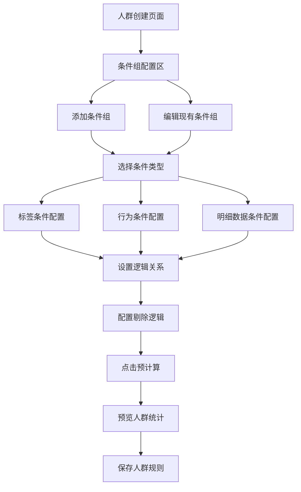

# 人群创建条件组配置优化需求文档

## 1. 产品概述

本需求旨在优化火山引擎客户数据平台中自定义规则创建人群功能的条件组配置界面，提升用户在配置复杂筛选条件时的操作体验和效率。

通过重新设计条件配置区域的交互方式和视觉布局，解决当前界面在条件管理、逻辑关系展示和操作便捷性方面的不足，为数据分析师和营销人员提供更直观、高效的人群筛选工具。

目标是将条件配置的操作复杂度降低30%，提升用户配置效率，减少配置错误率。

## 2. 核心功能

### 2.1 用户角色

| 角色 | 使用场景 | 核心权限 |
|------|----------|----------|
| 数据分析师 | 创建复杂的人群筛选规则 | 可创建、编辑、删除条件组和条件 |
| 营销人员 | 创建营销活动目标人群 | 可使用预设模板和简单条件配置 |
| 管理员 | 管理人群规则和权限 | 全部权限，包括模板管理和权限分配 |

### 2.2 功能模块

本次优化涉及的主要页面：

1. **人群创建页面**：条件组配置区域、条件逻辑设置、剔除逻辑配置、预计算预览
2. **条件配置面板**：条件类型选择、参数配置、逻辑关系设置、剔除条件设置
3. **条件组管理**：条件组的增删改、复制功能

### 2.3 页面详情

| 页面名称 | 模块名称 | 功能描述 |
|----------|----------|----------|
| 人群创建页面 | 条件组配置区 | 重新设计条件组的展示方式，采用卡片式布局，支持折叠展开；优化条件添加流程，提供快捷添加按钮；改进逻辑关系的可视化展示 |
| 人群创建页面 | 标签条件配置 | 支持多层级标签选择，提供标签树形结构展示；支持标签值的多选和范围设置；增加标签预览和实时验证功能 |
| 人群创建页面 | 事件条件配置 | 支持事件名称选择和事件属性配置；提供时间范围设置（动态/固定）；支持事件聚合方式配置（次数、总和、平均值等） |
| 人群创建页面 | 明细数据条件配置 | 支持数据源类型选择和字段配置；提供聚合方式和操作符设置；支持时间范围和动态时间配置 |
| 人群创建页面 | 条件逻辑管理 | 改进条件间逻辑关系（且/或）的设置方式；增加逻辑关系的可视化连接线；支持条件组间逻辑切换 |
| 人群创建页面 | 剔除逻辑配置 | 支持设置剔除条件组，用于排除特定人群；提供剔除逻辑的可视化标识；支持剔除条件的独立配置和管理 |
| 人群创建页面 | 操作工具栏 | 新增条件组快捷操作按钮；增加批量操作功能；添加预计算按钮 |
| 人群创建页面 | 预计算预览区 | 配置完成后点击预计算按钮预览人群数量；提供条件配置的统计信息；增加配置有效性检查 |

## 3. 核心流程

### 3.1 条件组配置流程

用户进入人群创建页面后，通过以下步骤配置筛选条件：

1. 创建条件组 → 2. 选择条件类型 → 3. 配置条件参数 → 4. 设置逻辑关系 → 5. 配置剔除逻辑（可选） → 6. 点击预计算预览人群 → 7. 保存配置

### 3.2 页面导航流程图

## 4. 用户界面设计

### 4.1 设计风格

- **主色调**：#1664FF（主蓝色），#F7F8FA（背景灰）
- **辅助色**：#00B42A（成功绿），#FF7D00（警告橙），#F53F3F（错误红）
- **按钮样式**：圆角4px，支持悬停和点击状态变化
- **字体**：PingFang SC，主要字号14px，辅助字号12px
- **布局风格**：卡片式设计，左右布局，支持响应式适配
- **图标风格**：线性图标，统一使用Arco Design图标库

### 4.2 页面设计概览

| 页面名称 | 模块名称 | UI元素 |
|----------|----------|--------|
| 人群创建页面 | 条件组配置区 | 采用卡片式设计，每个条件组为独立卡片；卡片头部显示条件组名称和操作按钮；支持折叠/展开状态切换；使用阴影和圆角增强层次感 |
| 人群创建页面 | 标签条件配置 | 标签选择器采用树形下拉组件，支持搜索和多选；标签值配置使用标签组件展示已选项；操作符使用下拉选择器，支持图标提示；值输入框根据数据类型动态调整（文本框/数字框/日期选择器） |
| 人群创建页面 | 事件条件配置 | 事件选择使用搜索下拉框，支持分类筛选；事件属性配置采用动态表单，支持添加/删除属性行；时间配置使用标签页切换（固定时间/动态时间）；聚合方式使用图标化选择器 |
| 人群创建页面 | 明细数据条件配置 | 数据源选择使用卡片式选择器，显示数据源图标和描述；字段选择支持分组展示和搜索；聚合配置使用下拉选择器配合说明文字；时间配置复用事件条件的时间组件 |
| 人群创建页面 | 条件逻辑管理 | 条件间逻辑使用可点击的标签组件（且/或），支持悬停效果；条件组间逻辑使用更大的标签样式，位于条件组之间；连接线使用SVG绘制，支持动画效果 |
| 人群创建页面 | 剔除逻辑配置 | 剔除条件组使用特殊的红色边框标识；剔除标签使用红色背景和白色文字；剔除逻辑连接线使用虚线样式；支持剔除条件组的独立配置界面 |
| 人群创建页面 | 操作工具栏 | 固定在页面顶部，包含主要操作按钮；使用图标+文字的组合方式；预计算按钮使用主色调突出显示 |
| 人群创建页面 | 预计算预览区 | 位于页面右侧，采用卡片式布局；点击预计算后显示统计数据；提供配置有效性检查结果 |

### 4.3 响应式设计

- **桌面端优先**：主要针对1920x1080及以上分辨率优化
- **平板适配**：支持1024px以上宽度的平板设备，调整布局为上下结构

## 5. 优化重点

### 5.1 当前问题分析

1. **界面布局问题**：条件配置区域布局分散，用户需要在多个区域间切换操作
2. **交互复杂度高**：添加条件需要多步操作，缺少快捷方式
3. **逻辑关系不清晰**：条件间的逻辑关系展示不够直观
4. **缺少剔除逻辑**：无法设置排除特定人群的剔除条件
5. **操作反馈不足**：缺少配置验证和预计算功能

### 5.2 优化方案

#### 5.2.1 界面布局优化
- **卡片式设计**：将每个条件组设计为独立卡片，提高视觉层次
- **折叠展开**：支持条件组的折叠展开，节省页面空间
- **统一布局**：标准化所有条件类型的表单布局和间距

#### 5.2.2 标签条件配置优化
- **树形选择器**：支持多层级标签选择，提供搜索和筛选功能
- **标签值管理**：支持标签值的多选、范围设置和自定义输入
- **操作符优化**：根据标签数据类型动态显示适用的操作符
- **预览功能**：实时预览标签条件的匹配结果

#### 5.2.3 事件条件配置优化
- **事件选择器**：支持事件名称搜索和分类筛选
- **属性配置**：动态表单支持添加/删除事件属性条件
- **时间范围**：统一的时间配置组件，支持固定和动态时间
- **聚合方式**：图标化的聚合方式选择，提供清晰的说明

#### 5.2.4 明细数据条件配置优化
- **数据源选择**：卡片式数据源选择器，显示数据源详细信息
- **字段管理**：支持字段分组展示和智能搜索
- **聚合配置**：提供聚合方式的详细说明和示例
- **时间配置**：复用事件条件的时间配置组件

#### 5.2.5 逻辑关系可视化优化
- **条件内逻辑**：使用可点击的标签组件展示条件间的且/或关系
- **条件组间逻辑**：使用更大的标签样式展示条件组间的逻辑关系
- **连接线展示**：使用SVG绘制动态连接线，支持动画效果
- **交互切换**：支持点击直接切换逻辑关系，提供悬停预览

#### 5.2.6 剔除逻辑配置优化
- **剔除条件组**：支持设置剔除条件组，用于排除特定人群
- **可视化标识**：剔除条件组使用红色边框和特殊图标标识
- **剔除逻辑**：剔除条件组与包含条件组之间使用"排除"逻辑连接
- **独立配置**：剔除条件组支持独立的条件配置和管理

#### 5.2.7 预计算反馈优化
- **条件验证**：配置完成后验证条件配置的有效性
- **预计算功能**：点击预计算按钮获取预估人群数量
- **错误提示**：清晰的错误信息和修复建议

### 5.3 技术实现要点

#### 5.3.1 组件架构优化
- **组件重构**：重构 `ConditionGroup.vue` 组件，采用更清晰的组件结构
- **条件类型组件**：分离标签、事件、明细数据条件为独立组件
- **公共组件**：抽取逻辑关系、时间配置等公共组件
- **组件通信**：优化组件间的数据传递和事件处理机制

#### 5.3.2 标签条件技术实现
- **树形选择器**：使用 Arco Design 的 TreeSelect 组件
- **标签值管理**：实现动态标签值组件，支持多种数据类型
- **搜索功能**：集成模糊搜索和分类筛选
- **数据缓存**：使用本地缓存优化标签数据加载

#### 5.3.3 事件条件技术实现
- **事件选择器**：使用 Select 组件配合搜索功能
- **动态表单**：实现可添加/删除的事件属性配置表单
- **时间组件**：开发统一的时间范围配置组件
- **聚合配置**：使用图标化的选择器组件

#### 5.3.4 明细数据条件技术实现
- **数据源选择**：使用卡片式选择器组件
- **字段管理**：实现分组展示和智能搜索功能
- **聚合说明**：提供交互式的聚合方式说明组件
- **配置复用**：复用事件条件的时间配置组件

#### 5.3.5 逻辑关系管理技术实现
- **逻辑组件**：开发可点击切换的逻辑标签组件
- **连接线绘制**：使用 SVG 或 Canvas 绘制动态连接线
- **状态管理**：使用 Vuex 管理逻辑关系状态

#### 5.3.6 剔除逻辑技术实现
- **剔除条件组件**：开发专门的剔除条件组组件
- **可视化标识**：使用CSS样式和图标区分剔除条件组
- **逻辑处理**：实现剔除逻辑的计算和验证
- **数据结构**：扩展条件组数据结构支持剔除标识

#### 5.3.7 预计算功能技术实现
- **预计算接口**：开发预计算API接口调用
- **加载状态**：实现预计算过程的加载状态展示
- **结果展示**：开发预计算结果的可视化组件
- **缓存机制**：实现预计算结果的本地缓存

#### 5.3.8 性能和体验优化
- **虚拟滚动**：处理大量条件数据的渲染性能
- **懒加载**：实现条件配置的按需加载
- **动画效果**：使用 Vue Transition 实现平滑动画
- **键盘支持**：添加键盘快捷键支持

## 6. 验收标准

### 6.1 功能验收

#### 6.1.1 基础功能
- [ ] 条件组支持卡片式展示和折叠/展开功能
- [ ] 支持剔除条件组的设置和管理
- [ ] 配置完成后点击预计算显示人群数量和配置验证

#### 6.1.2 标签条件配置
- [ ] 标签选择器支持树形结构展示和搜索功能
- [ ] 支持标签值的多选和范围设置
- [ ] 操作符根据标签数据类型动态显示
- [ ] 提供标签条件的实时预览功能

#### 6.1.3 事件条件配置
- [ ] 事件选择器支持搜索和分类筛选
- [ ] 事件属性配置支持动态添加/删除
- [ ] 时间配置支持固定时间和动态时间切换
- [ ] 聚合方式选择器提供图标化展示

#### 6.1.4 明细数据条件配置
- [ ] 数据源选择器采用卡片式设计，显示详细信息
- [ ] 字段选择支持分组展示和智能搜索
- [ ] 聚合配置提供详细说明和示例
- [ ] 时间配置复用事件条件的时间组件

#### 6.1.5 逻辑关系管理
- [ ] 条件间逻辑关系使用可点击标签组件展示
- [ ] 条件组间逻辑关系使用更大的标签样式
- [ ] 支持点击切换且/或逻辑关系
- [ ] 连接线使用SVG绘制，支持动画效果

#### 6.1.6 剔除逻辑功能
- [ ] 支持设置剔除条件组，用于排除特定人群
- [ ] 剔除条件组使用红色边框和特殊图标标识
- [ ] 剔除逻辑连接线使用虚线样式区分
- [ ] 支持剔除条件组的独立配置和管理

### 6.2 性能验收
- [ ] 页面加载时间不超过2秒
- [ ] 条件配置操作响应时间不超过500ms
- [ ] 支持至少100个条件的流畅操作
- [ ] 内存使用优化，避免内存泄漏
- [ ] 大量条件数据支持虚拟滚动

### 6.3 用户体验验收
- [ ] 界面布局清晰，信息层次分明
- [ ] 操作流程简化，减少用户操作步骤
- [ ] 错误提示清晰，提供修复建议
- [ ] 支持键盘快捷键操作
- [ ] 逻辑关系可视化清晰易懂
- [ ] 剔除逻辑标识清晰，易于理解
- [ ] 条件配置界面统一且易用

### 6.4 兼容性验收
- [ ] 支持主流浏览器（Chrome、Firefox、Safari、Edge）
- [ ] 功能完整性：所有现有功能正常工作，新增功能按需求实现
- [ ] 界面一致性：设计风格与整体产品保持一致

## 7. 实施计划

### 7.1 开发阶段

**第一阶段（1-2周）：基础重构和组件架构**
- 重构 `ConditionGroup.vue` 组件结构
- 分离标签、事件、明细数据条件为独立组件
- 抽取逻辑关系、时间配置等公共组件
- 实现卡片式布局和基础交互

**第二阶段（2-3周）：条件配置功能开发**
- 开发标签条件配置组件（树形选择器、标签值管理）
- 开发事件条件配置组件（事件选择器、属性配置、聚合方式）
- 开发明细数据条件配置组件（数据源选择、字段管理）
- 实现统一的时间配置组件

**第三阶段（2周）：逻辑关系管理和剔除逻辑**
- 开发可点击切换的逻辑标签组件
- 实现SVG连接线绘制和动画效果
- 开发剔除逻辑配置功能
- 实现剔除条件组的可视化标识

**第四阶段（1-2周）：预计算功能和性能优化**
- 开发预计算功能和API接口
- 实现预计算结果的可视化展示
- 添加配置验证功能
- 优化大量数据的渲染性能
- 添加键盘快捷键支持

**第五阶段（1周）：测试和优化**
- 功能测试和性能测试
- 用户体验测试和反馈收集
- 问题修复和细节优化
- 文档完善和代码审查

### 7.2 里程碑
- **里程碑1**：基础架构重构和组件分离完成
- **里程碑2**：三种条件类型配置功能开发完成
- **里程碑3**：逻辑关系管理和剔除逻辑功能完成
- **里程碑4**：预计算功能和性能优化完成
- **里程碑5**：测试验收通过，正式发布

### 7.3 风险控制
- **技术风险**：复杂的逻辑关系可视化实现，预留额外开发时间
- **兼容性风险**：确保与现有系统的兼容性，进行充分测试
- **性能风险**：大量条件数据的渲染性能，采用虚拟滚动等优化方案
- **用户体验风险**：定期进行用户测试，及时调整设计方案