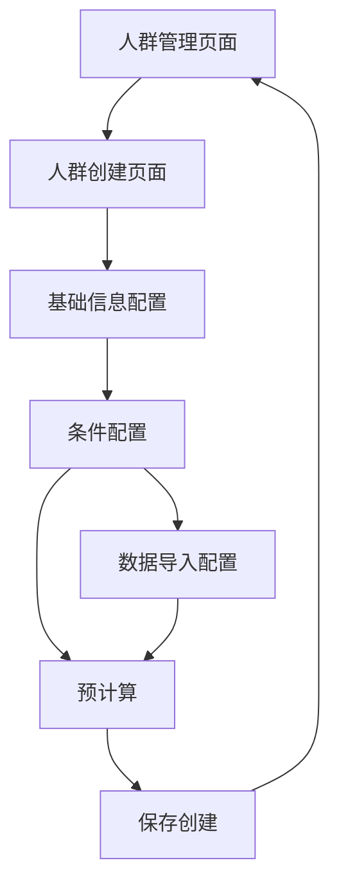

# 人群创建页面问题分析与改进需求文档

## 1. 产品概述

本文档针对人群创建页面（audience-create.vue）中的条件配置功能进行问题分析，重点关注标签配置、事件配置和页面按钮显示等问题，并提出相应的改进方案。

## 2. 核心功能

### 2.1 用户角色

| 角色 | 注册方式 | 核心权限 |
|------|----------|----------|
| 数据分析师 | 系统账号登录 | 可创建、编辑、删除人群，配置复杂条件规则 |
| 业务用户 | 系统账号登录 | 可查看和使用已创建的人群，进行基础条件配置 |

### 2.2 功能模块

人群创建页面包含以下主要功能模块：
1. **基础信息配置**：人群名称、类型、共享级别、更新频率等基本属性设置
2. **条件配置**：支持标签条件、行为条件、明细数据条件的复合配置
3. **数据导入**：支持文件上传、数据库导入、API接口导入等多种数据来源
4. **预览计算**：根据配置的条件规则预估人群规模和统计信息

### 2.3 页面详情

| 页面名称 | 模块名称 | 功能描述 |
|----------|----------|----------|
| 人群创建页面 | 基础信息配置 | 设置人群名称、描述、类型、共享级别、更新频率等基本属性 |
| 人群创建页面 | 条件配置组件 | 配置标签条件、行为条件、明细数据条件，支持多条件组合和逻辑运算 |
| 人群创建页面 | 数据导入配置 | 支持文件上传（CSV、Excel、JSON）、数据库连接、API接口等导入方式 |
| 人群创建页面 | 预览结果展示 | 显示预估人群规模、规则条件数、数据覆盖率、预计执行时间等统计信息 |

## 3. 核心流程

用户操作流程如下：
1. 进入人群创建页面，选择创建模式（规则创建或数据导入）
2. 填写基础信息（人群名称、描述等）
3. 配置条件规则（添加标签条件、行为条件、明细数据条件）
4. 设置条件组间的逻辑关系（且/或）
5. 执行预计算，查看预估结果
6. 确认无误后保存创建人群



## 4. 用户界面设计

### 4.1 设计风格
- **主色调**：蓝色系（#165dff）作为主色，灰色系作为辅助色
- **按钮样式**：圆角按钮，支持不同尺寸（small、mini）和类型（primary、text、dashed）
- **字体**：系统默认字体，标题使用24px，正文使用14px
- **布局风格**：卡片式布局，顶部导航，左右分栏结构
- **图标风格**：使用Arco Design图标库，线性风格

### 4.2 页面设计概览

| 页面名称 | 模块名称 | UI元素 |
|----------|----------|--------|
| 人群创建页面 | 页面头部 | 面包屑导航、页面标题、描述文字、模式切换按钮 |
| 人群创建页面 | 基础信息卡片 | 表单输入框、下拉选择器、日期选择器、文本域 |
| 人群创建页面 | 条件配置卡片 | 条件组折叠面板、添加按钮、删除按钮、逻辑切换按钮 |
| 人群创建页面 | 预览结果卡片 | 统计数字展示、进度条、状态标签 |
| 人群创建页面 | 页面底部 | 取消按钮、预计算按钮、保存按钮 |

### 4.3 响应式设计

页面采用桌面优先的响应式设计，支持1200px以上宽屏显示，条件配置区域支持垂直滚动以适应长表单内容。

## 5. 问题分析

### 5.1 标签配置问题

**现状分析：**
- 当前`getTagOptions`函数返回的是抽象的分类选项（如"基础属性"、"金融属性"），而不是具体的标签属性
- 用户期望看到的是具体的标签选项，如"年龄"、"响应层级"、"风险等级"等可直接使用的属性字段
- 现有实现缺少标签属性的二级选择机制

**问题根因：**
```javascript
// 当前实现 - 返回抽象分类
const getTagOptions = () => {
  return [
    { label: '基础属性', value: 'basic_attributes' },
    { label: '金融属性', value: 'financial_attributes' },
    // ...
  ]
}
```

**改进需求：**
- 标签选项应直接提供具体的属性字段，如年龄、性别、收入水平、风险等级等
- 支持标签分类展示，但用户可直接选择具体标签
- 标签值输入应支持不同数据类型（数值、文本、枚举等）

### 5.2 事件配置问题

**现状分析：**
- 当前事件配置返回的是事件分类（如"贷款相关"、"风险相关"），而不是具体的事件名称
- 用户期望事件配置应该像明细数据一样，从数据源中选择具体的事件
- 缺少事件数据源的选择机制

**问题根因：**
```javascript
// 当前实现 - 返回事件分类
const getEventOptions = () => {
  return [
    { label: '贷款相关', value: 'loan_events' },
    { label: '风险相关', value: 'risk_events' },
    // ...
  ]
}
```

**改进需求：**
- 事件配置应首先选择数据源，然后从该数据源中选择具体的事件名称
- 事件属性配置应基于选定的具体事件动态加载
- 支持事件的时间范围、频次等条件配置

### 5.3 页面按钮显示问题

**现状分析：**
- 页面底部的操作按钮（取消、预计算、保存）可能存在显示问题
- 按钮的显示逻辑依赖于多个状态变量，可能存在条件判断错误

**问题根因：**
```javascript
// 按钮显示逻辑
<a-button 
  v-if="!showPreviewResult" 
  type="primary" 
  @click="preCalculate" 
  :loading="preCalculating"
  :disabled="!canPreCalculate"
>
  预计算
</a-button>
```

**改进需求：**
- 检查`canPreCalculate`计算属性的实现
- 确保按钮在不同状态下的正确显示
- 优化按钮的禁用和加载状态逻辑

### 5.4 ConditionConfig组件实现问题

**现状分析：**
- `ConditionConfig`组件正确接收了各种选项获取函数作为props
- `ConditionGroup`组件中标签和事件条件的实现逻辑基本正确
- 问题主要在于选项数据的内容不符合用户期望

**改进需求：**
- 优化条件组的折叠展开交互
- 改进条件添加和删除的用户体验
- 增强条件配置的表单验证

## 6. 改进方案

### 6.1 标签配置改进

1. **重构标签选项结构**
   - 提供具体的标签属性选项
   - 支持标签分组显示
   - 添加标签描述和数据类型信息

2. **优化标签值输入**
   - 根据标签类型提供不同的输入组件
   - 支持枚举值的下拉选择
   - 添加数值范围验证

### 6.2 事件配置改进

1. **引入数据源选择**
   - 添加事件数据源选择步骤
   - 从选定数据源动态加载事件列表
   - 支持事件搜索和过滤

2. **完善事件属性配置**
   - 基于具体事件动态加载属性选项
   - 支持复杂的事件条件组合
   - 添加事件时间窗口配置

### 6.3 按钮显示修复

1. **检查计算属性**
   - 实现`canPreCalculate`计算属性
   - 优化按钮显示逻辑
   - 添加表单验证状态检查

2. **改进用户反馈**
   - 添加操作提示信息
   - 优化加载状态显示
   - 完善错误处理机制

### 6.4 整体用户体验优化

1. **交互优化**
   - 改进条件添加的引导流程
   - 优化大量条件时的页面性能
   - 添加操作撤销功能

2. **数据验证**
   - 添加实时表单验证
   - 提供配置建议和提示
   - 支持配置模板保存和复用

## 7. 实施优先级

1. **高优先级**：修复按钮显示问题，确保基本功能可用
2. **中优先级**：改进标签和事件配置，提供具体的选项内容
3. **低优先级**：优化用户体验和交互细节

## 8. 验收标准

1. 标签配置能够显示具体的属性选项（年龄、风险等级等）
2. 事件配置支持数据源选择和具体事件选择
3. 页面按钮正常显示和响应用户操作
4. 条件配置功能完整可用，支持复杂规则组合
5. 页面交互流畅，无明显性能问题