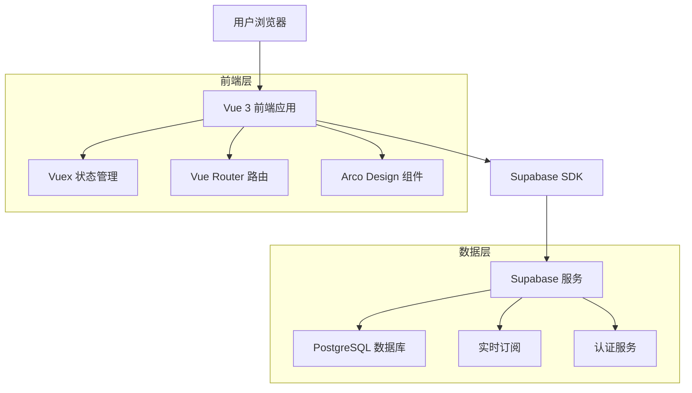
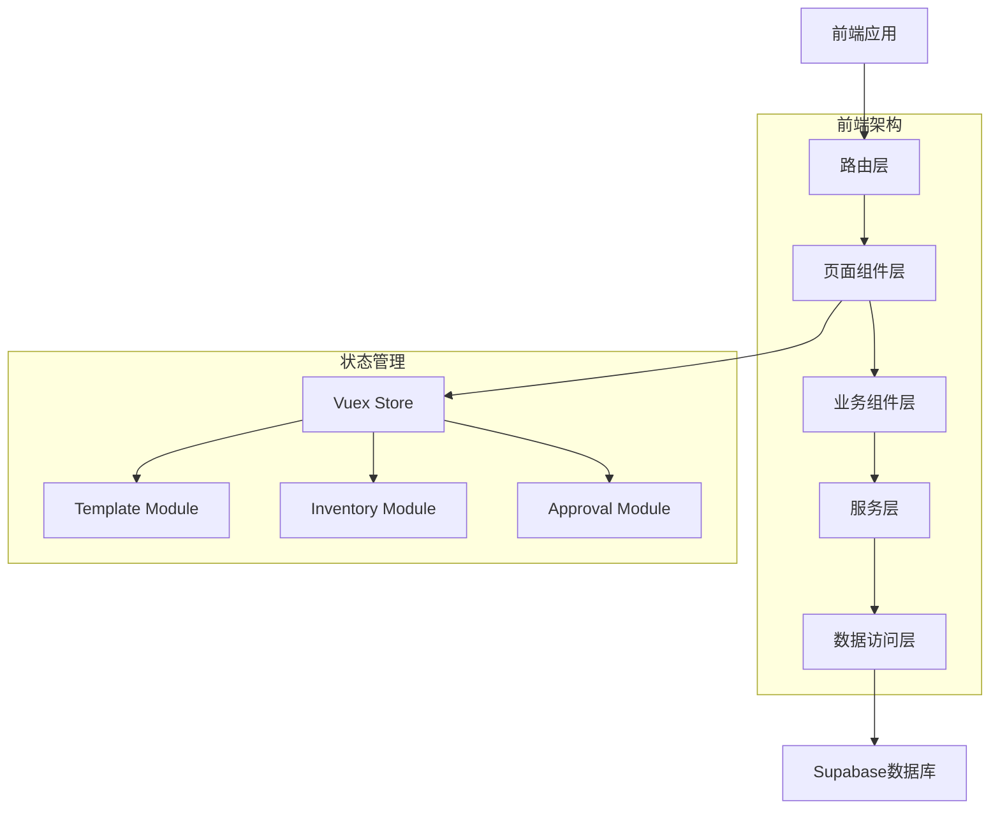
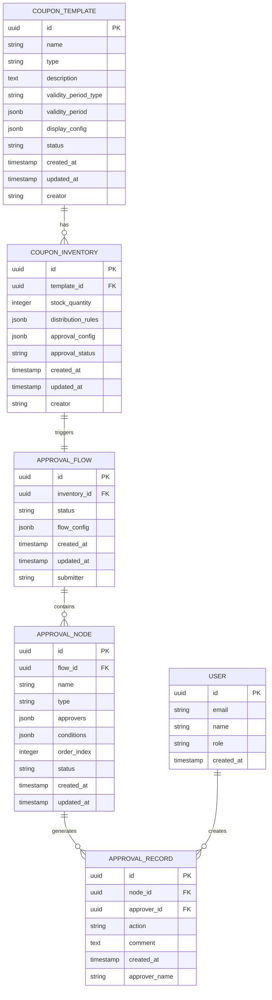

# 优惠券审批流程重构技术架构文档

## 1. 架构设计



## 2. 技术描述

- **前端**：Vue 3 + Composition API + TypeScript + Arco Design + Vite
- **状态管理**：Vuex 4
- **路由管理**：Vue Router 4
- **数据库**：Supabase (PostgreSQL)
- **实时通信**：Supabase Realtime
- **认证授权**：Supabase Auth

## 3. 路由定义

| 路由 | 用途 |
|------|------|
| /marketing/coupon/template | 券模板管理页面，显示模板列表和基础操作 |
| /marketing/coupon/template/create | 券模板创建页面，配置模板信息和展示规则 |
| /marketing/coupon/template/edit/:id | 券模板编辑页面，修改模板配置 |
| /marketing/coupon/inventory | 券库存管理页面，显示库存列表和状态 |
| /marketing/coupon/inventory/create | 券库存创建页面，配置库存和审批流程 |
| /marketing/coupon/inventory/edit/:id | 券库存编辑页面，修改库存配置 |
| /marketing/coupon/approval | 审批管理页面，显示待审批任务列表 |
| /marketing/coupon/approval/detail/:id | 审批详情页面，执行审批操作 |
| /marketing/coupon/approval/monitor | 审批监控页面，监控审批流程和效率 |

## 4. API定义

### 4.1 券模板相关API

**创建券模板**
```
POST /api/coupon/template
```

请求参数：
| 参数名称 | 参数类型 | 是否必需 | 描述 |
|----------|----------|----------|------|
| name | string | true | 券模板名称 |
| type | string | true | 券类型（interest_free/discount） |
| description | string | false | 券模板描述 |
| validityPeriodType | string | true | 有效期类型 |
| validityPeriod | array | false | 有效期范围 |
| displayConfig | object | true | 展示配置信息 |

响应参数：
| 参数名称 | 参数类型 | 描述 |
|----------|----------|------|
| success | boolean | 操作是否成功 |
| data | object | 创建的模板信息 |
| message | string | 响应消息 |

示例：
```json
{
  "name": "新人专享免息券",
  "type": "interest_free",
  "description": "新用户首借专享30天免息",
  "validityPeriodType": "limited",
  "validityPeriod": ["2024-01-01", "2024-12-31"],
  "displayConfig": {
    "customerDisplayName": "新人专享券",
    "cornerText": "免息",
    "categoryText": "新人专享",
    "reductionValue": "30天",
    "showExpiryDate": true,
    "usageInstructions": "仅限新用户首次借款使用"
  }
}
```

**获取券模板列表**
```
GET /api/coupon/template
```

请求参数：
| 参数名称 | 参数类型 | 是否必需 | 描述 |
|----------|----------|----------|------|
| page | number | false | 页码，默认1 |
| pageSize | number | false | 每页数量，默认10 |
| type | string | false | 券类型筛选 |
| status | string | false | 状态筛选 |

### 4.2 券库存相关API

**创建券库存**
```
POST /api/coupon/inventory
```

请求参数：
| 参数名称 | 参数类型 | 是否必需 | 描述 |
|----------|----------|----------|------|
| templateId | string | true | 券模板ID |
| stockQuantity | number | true | 库存数量 |
| distributionRules | object | true | 发放规则 |
| approvalConfig | object | true | 审批配置 |

响应参数：
| 参数名称 | 参数类型 | 描述 |
|----------|----------|------|
| success | boolean | 操作是否成功 |
| data | object | 创建的库存信息 |
| approvalId | string | 审批流程ID |

### 4.3 审批流程相关API

**提交审批申请**
```
POST /api/approval/submit
```

请求参数：
| 参数名称 | 参数类型 | 是否必需 | 描述 |
|----------|----------|----------|------|
| inventoryId | string | true | 库存ID |
| approvalFlow | array | true | 审批流程配置 |
| submitter | string | true | 提交人 |

**执行审批操作**
```
POST /api/approval/action
```

请求参数：
| 参数名称 | 参数类型 | 是否必需 | 描述 |
|----------|----------|----------|------|
| approvalId | string | true | 审批ID |
| nodeId | string | true | 审批节点ID |
| action | string | true | 审批动作（approve/reject/return） |
| comment | string | false | 审批意见 |
| approver | string | true | 审批人 |

**获取待审批任务**
```
GET /api/approval/pending
```

请求参数：
| 参数名称 | 参数类型 | 是否必需 | 描述 |
|----------|----------|----------|------|
| approver | string | true | 审批人ID |
| status | string | false | 状态筛选 |
| page | number | false | 页码 |
| pageSize | number | false | 每页数量 |

## 5. 服务架构图



## 6. 数据模型

### 6.1 数据模型定义



### 6.2 数据定义语言

**券模板表 (coupon_templates)**
```sql
-- 创建券模板表
CREATE TABLE coupon_templates (
    id UUID PRIMARY KEY DEFAULT gen_random_uuid(),
    name VARCHAR(255) NOT NULL,
    type VARCHAR(50) NOT NULL CHECK (type IN ('interest_free', 'discount')),
    description TEXT,
    validity_period_type VARCHAR(20) NOT NULL CHECK (validity_period_type IN ('limited', 'unlimited')),
    validity_period JSONB,
    display_config JSONB NOT NULL,
    status VARCHAR(20) DEFAULT 'draft' CHECK (status IN ('draft', 'active', 'inactive')),
    created_at TIMESTAMP WITH TIME ZONE DEFAULT NOW(),
    updated_at TIMESTAMP WITH TIME ZONE DEFAULT NOW(),
    creator VARCHAR(255) NOT NULL
);

-- 创建索引
CREATE INDEX idx_coupon_templates_type ON coupon_templates(type);
CREATE INDEX idx_coupon_templates_status ON coupon_templates(status);
CREATE INDEX idx_coupon_templates_creator ON coupon_templates(creator);

-- 设置权限
GRANT SELECT ON coupon_templates TO anon;
GRANT ALL PRIVILEGES ON coupon_templates TO authenticated;
```

**券库存表 (coupon_inventories)**
```sql
-- 创建券库存表
CREATE TABLE coupon_inventories (
    id UUID PRIMARY KEY DEFAULT gen_random_uuid(),
    template_id UUID NOT NULL,
    stock_quantity INTEGER NOT NULL DEFAULT 0,
    distribution_rules JSONB NOT NULL DEFAULT '{}',
    approval_config JSONB NOT NULL DEFAULT '{}',
    approval_status VARCHAR(20) DEFAULT 'pending' CHECK (approval_status IN ('pending', 'approved', 'rejected', 'cancelled')),
    created_at TIMESTAMP WITH TIME ZONE DEFAULT NOW(),
    updated_at TIMESTAMP WITH TIME ZONE DEFAULT NOW(),
    creator VARCHAR(255) NOT NULL
);

-- 创建索引
CREATE INDEX idx_coupon_inventories_template_id ON coupon_inventories(template_id);
CREATE INDEX idx_coupon_inventories_approval_status ON coupon_inventories(approval_status);
CREATE INDEX idx_coupon_inventories_creator ON coupon_inventories(creator);

-- 设置权限
GRANT SELECT ON coupon_inventories TO anon;
GRANT ALL PRIVILEGES ON coupon_inventories TO authenticated;
```

**审批流程表 (approval_flows)**
```sql
-- 创建审批流程表
CREATE TABLE approval_flows (
    id UUID PRIMARY KEY DEFAULT gen_random_uuid(),
    inventory_id UUID NOT NULL,
    status VARCHAR(20) DEFAULT 'pending' CHECK (status IN ('pending', 'approved', 'rejected', 'cancelled')),
    flow_config JSONB NOT NULL DEFAULT '{}',
    created_at TIMESTAMP WITH TIME ZONE DEFAULT NOW(),
    updated_at TIMESTAMP WITH TIME ZONE DEFAULT NOW(),
    submitter VARCHAR(255) NOT NULL
);

-- 创建索引
CREATE INDEX idx_approval_flows_inventory_id ON approval_flows(inventory_id);
CREATE INDEX idx_approval_flows_status ON approval_flows(status);
CREATE INDEX idx_approval_flows_submitter ON approval_flows(submitter);

-- 设置权限
GRANT SELECT ON approval_flows TO anon;
GRANT ALL PRIVILEGES ON approval_flows TO authenticated;
```

**审批节点表 (approval_nodes)**
```sql
-- 创建审批节点表
CREATE TABLE approval_nodes (
    id UUID PRIMARY KEY DEFAULT gen_random_uuid(),
    flow_id UUID NOT NULL,
    name VARCHAR(255) NOT NULL,
    type VARCHAR(20) NOT NULL CHECK (type IN ('single', 'multiple', 'any')),
    approvers JSONB NOT NULL DEFAULT '[]',
    conditions JSONB DEFAULT '{}',
    order_index INTEGER NOT NULL,
    status VARCHAR(20) DEFAULT 'pending' CHECK (status IN ('pending', 'approved', 'rejected', 'skipped')),
    created_at TIMESTAMP WITH TIME ZONE DEFAULT NOW(),
    updated_at TIMESTAMP WITH TIME ZONE DEFAULT NOW()
);

-- 创建索引
CREATE INDEX idx_approval_nodes_flow_id ON approval_nodes(flow_id);
CREATE INDEX idx_approval_nodes_status ON approval_nodes(status);
CREATE INDEX idx_approval_nodes_order ON approval_nodes(order_index);

-- 设置权限
GRANT SELECT ON approval_nodes TO anon;
GRANT ALL PRIVILEGES ON approval_nodes TO authenticated;
```

**审批记录表 (approval_records)**
```sql
-- 创建审批记录表
CREATE TABLE approval_records (
    id UUID PRIMARY KEY DEFAULT gen_random_uuid(),
    node_id UUID NOT NULL,
    approver_id UUID NOT NULL,
    action VARCHAR(20) NOT NULL CHECK (action IN ('approve', 'reject', 'return')),
    comment TEXT,
    created_at TIMESTAMP WITH TIME ZONE DEFAULT NOW(),
    approver_name VARCHAR(255) NOT NULL
);

-- 创建索引
CREATE INDEX idx_approval_records_node_id ON approval_records(node_id);
CREATE INDEX idx_approval_records_approver_id ON approval_records(approver_id);
CREATE INDEX idx_approval_records_created_at ON approval_records(created_at DESC);

-- 设置权限
GRANT SELECT ON approval_records TO anon;
GRANT ALL PRIVILEGES ON approval_records TO authenticated;
```

**初始化数据**
```sql
-- 插入示例券模板数据
INSERT INTO coupon_templates (name, type, description, validity_period_type, validity_period, display_config, status, creator) VALUES
('新人专享免息券', 'interest_free', '新用户首借专享30天免息', 'limited', '["2024-01-01", "2024-12-31"]', '{"customerDisplayName": "新人专享券", "cornerText": "免息", "categoryText": "新人专享", "reductionValue": "30天", "showExpiryDate": true, "usageInstructions": "仅限新用户首次借款使用"}', 'active', 'admin'),
('复借8折优惠券', 'discount', '老用户复借享受8折优惠', 'limited', '["2024-01-01", "2024-12-31"]', '{"customerDisplayName": "复借优惠券", "cornerText": "8折", "categoryText": "复借专享", "reductionValue": "8折", "showExpiryDate": true, "usageInstructions": "仅限老用户复借使用"}', 'active', 'admin');

-- 插入示例用户数据（如果需要）
INSERT INTO auth.users (email, encrypted_password, email_confirmed_at, created_at, updated_at) VALUES
('admin@example.com', crypt('password123', gen_salt('bf')), NOW(), NOW(), NOW()),
('approver1@example.com', crypt('password123', gen_salt('bf')), NOW(), NOW(), NOW()),
('approver2@example.com', crypt('password123', gen_salt('bf')), NOW(), NOW(), NOW());
```

## 7. 组件架构

### 7.1 核心组件设计

**券模板配置组件**
- `TemplateForm.vue`：模板基础信息配置表单
- `DisplayConfigForm.vue`：展示规则配置表单
- `TemplatePreview.vue`：模板预览组件
- `TemplateList.vue`：模板列表组件

**券库存配置组件**
- `InventoryForm.vue`：库存基础配置表单
- `ApprovalFlowConfig.vue`：审批流程配置组件
- `ApprovalNodeEditor.vue`：审批节点编辑器
- `InventoryList.vue`：库存列表组件

**审批管理组件**
- `ApprovalTaskList.vue`：待审批任务列表
- `ApprovalDetail.vue`：审批详情和操作组件
- `ApprovalHistory.vue`：审批历史记录组件
- `ApprovalMonitor.vue`：审批流程监控组件

### 7.2 状态管理设计

**Template Module**
```javascript
const templateModule = {
  namespaced: true,
  state: {
    templates: [],
    currentTemplate: null,
    loading: false
  },
  mutations: {
    SET_TEMPLATES(state, templates) {
      state.templates = templates
    },
    SET_CURRENT_TEMPLATE(state, template) {
      state.currentTemplate = template
    },
    SET_LOADING(state, loading) {
      state.loading = loading
    }
  },
  actions: {
    async fetchTemplates({ commit }) {
      commit('SET_LOADING', true)
      // API调用逻辑
      commit('SET_LOADING', false)
    },
    async createTemplate({ commit }, templateData) {
      // 创建模板逻辑
    }
  }
}
```

**Approval Module**
```javascript
const approvalModule = {
  namespaced: true,
  state: {
    pendingTasks: [],
    approvalHistory: [],
    currentApproval: null
  },
  mutations: {
    SET_PENDING_TASKS(state, tasks) {
      state.pendingTasks = tasks
    },
    SET_APPROVAL_HISTORY(state, history) {
      state.approvalHistory = history
    }
  },
  actions: {
    async fetchPendingTasks({ commit }, approver) {
      // 获取待审批任务
    },
    async submitApproval({ commit }, approvalData) {
      // 提交审批决策
    }
  }
}
```

## 8. 安全和权限控制

### 8.1 认证机制
- 使用Supabase Auth进行用户认证
- 支持邮箱密码登录和第三方登录
- JWT Token管理和自动刷新

### 8.2 权限控制
- 基于角色的访问控制（RBAC）
- 页面级权限控制
- 操作级权限验证
- 数据级权限隔离

### 8.3 数据安全
- 敏感数据加密存储
- API请求签名验证
- SQL注入防护
- XSS攻击防护

## 9. 性能优化

### 9.1 前端优化
- 组件懒加载和代码分割
- 虚拟滚动处理大量数据
- 图片懒加载和压缩
- 缓存策略优化

### 9.2 数据库优化
- 合理的索引设计
- 查询语句优化
- 连接池管理
- 数据分页处理

### 9.3 实时通信优化
- Supabase Realtime订阅管理
- 事件去重和批处理
- 连接状态监控
- 自动重连机制

## 10. 监控和日志

### 10.1 应用监控
- 页面性能监控
- 错误日志收集
- 用户行为分析
- API调用统计

### 10.2 审批流程监控
- 审批效率统计
- 审批瓶颈识别
- 异常审批预警
- 审批报表生成

### 10.3 系统健康检查
- 服务可用性监控
- 数据库连接状态
- 第三方服务状态
- 系统资源使用情况