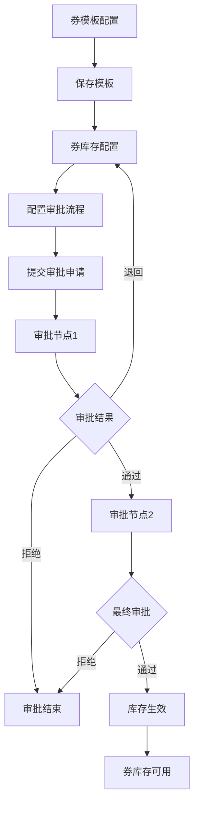

# 优惠券审批流程重构需求文档

## 1. 产品概述

本次重构旨在优化优惠券系统的审批流程配置，将审批环节从券模板配置阶段移动到券库存配置阶段，实现更清晰的职责分离和更灵活的审批管理。
- 券模板配置专注于模板基础信息和展示规则的定义，简化模板创建流程
- 券库存配置承担审批流程管理职责，提供完整的审批节点配置和状态跟踪功能

## 2. 核心功能

### 2.1 用户角色

| 角色 | 权限范围 | 核心职责 |
|------|----------|----------|
| 券模板配置员 | 券模板创建和编辑 | 配置券模板基础信息、展示规则，无需审批权限 |
| 券库存管理员 | 券库存创建和审批配置 | 配置券库存、设置审批流程、管理审批节点 |
| 审批人员 | 审批操作 | 执行审批决策、填写审批意见、跟踪审批状态 |
| 系统管理员 | 全局配置 | 管理审批角色、配置审批规则、系统参数设置 |

### 2.2 功能模块

重构后的优惠券系统包含以下核心页面：
1. **券模板配置页面**：模板基础信息配置、展示规则设置
2. **券库存配置页面**：库存创建、审批流程配置、审批节点管理
3. **审批管理页面**：审批任务处理、审批历史查看、状态跟踪
4. **审批监控页面**：审批流程监控、效率分析、异常处理

### 2.3 页面详情

| 页面名称 | 模块名称 | 功能描述 |
|----------|----------|----------|
| 券模板配置页面 | 基础信息配置 | 配置券名称、类型、有效期、使用规则等基础信息 |
| 券模板配置页面 | 展示规则配置 | 设置对客展示名称、角标文字、使用说明、预览样式等 |
| 券模板配置页面 | 模板预览 | 实时预览券模板展示效果，支持多端预览 |
| 券库存配置页面 | 库存基础配置 | 设置库存数量、发放规则、使用限制等 |
| 券库存配置页面 | 审批流程配置 | 配置审批节点、审批人员、审批顺序、审批规则 |
| 券库存配置页面 | 审批节点管理 | 添加、编辑、删除审批节点，设置节点属性和条件 |
| 审批管理页面 | 待审批任务 | 显示当前用户的待审批任务列表，支持批量操作 |
| 审批管理页面 | 审批操作 | 执行审批决策（通过/拒绝），填写审批意见和建议 |
| 审批管理页面 | 审批历史 | 查看历史审批记录，包括审批时间、审批人、审批结果 |
| 审批监控页面 | 流程监控 | 实时监控审批流程状态，识别审批瓶颈和异常 |
| 审批监控页面 | 效率分析 | 分析审批效率指标，生成审批报表和趋势图 |

## 3. 核心流程

### 3.1 券模板配置流程
1. 用户进入券模板配置页面
2. 填写券模板基础信息（名称、类型、有效期等）
3. 配置展示规则（对客名称、角标、使用说明等）
4. 实时预览券模板展示效果
5. 保存券模板配置（无需审批，直接生效）

### 3.2 券库存配置和审批流程
1. 用户选择已配置的券模板
2. 配置库存基础信息（数量、发放规则等）
3. 设置审批流程（审批节点、审批人、审批顺序）
4. 提交库存配置申请
5. 系统自动启动审批流程
6. 审批人员依次进行审批操作
7. 审批完成后，库存配置生效

### 3.3 审批处理流程
1. 审批人员接收审批任务通知
2. 查看库存配置详情和审批要求
3. 执行审批决策（通过/拒绝/退回）
4. 填写审批意见和建议
5. 提交审批结果
6. 系统自动流转到下一审批节点或完成审批



## 4. 用户界面设计

### 4.1 设计风格
- **主色调**：#1890FF（蓝色）作为主色，#52C41A（绿色）作为成功色
- **辅助色**：#FAAD14（橙色）作为警告色，#FF4D4F（红色）作为错误色
- **按钮样式**：圆角按钮，支持多种状态（默认、悬停、激活、禁用）
- **字体**：系统默认字体，标题使用16px，正文使用14px，辅助文字使用12px
- **布局风格**：卡片式布局，清晰的模块分割，响应式设计
- **图标风格**：使用Arco Design图标库，简洁现代的线性图标

### 4.2 页面设计概览

| 页面名称 | 模块名称 | UI元素 |
|----------|----------|--------|
| 券模板配置页面 | 基础信息配置 | 表单布局，输入框、选择器、日期选择器，实时验证提示 |
| 券模板配置页面 | 展示规则配置 | 富文本编辑器、图片上传、颜色选择器、预览面板 |
| 券库存配置页面 | 审批流程配置 | 流程图组件、节点配置面板、人员选择器、规则配置表单 |
| 券库存配置页面 | 审批节点管理 | 拖拽式节点编辑、属性配置面板、条件设置器 |
| 审批管理页面 | 待审批任务 | 任务列表、状态标签、操作按钮、批量操作工具栏 |
| 审批管理页面 | 审批操作 | 详情展示、审批按钮组、意见输入框、附件上传 |
| 审批监控页面 | 流程监控 | 实时状态图表、进度条、异常提醒、统计面板 |

### 4.3 响应式设计
- **桌面优先**：主要面向PC端用户，提供完整的功能体验
- **移动适配**：支持平板和手机端访问，关键功能保持可用性
- **触控优化**：按钮和交互元素适配触控操作，提供良好的移动端体验

## 5. 技术要求

### 5.1 前端技术栈
- **框架**：Vue 3 + Composition API
- **构建工具**：Vite
- **UI组件库**：Arco Design
- **状态管理**：Vuex
- **路由管理**：Vue Router
- **开发语言**：JavaScript + TypeScript

### 5.2 核心功能要求
- **审批流程引擎**：支持多级审批、并行审批、条件审批
- **状态管理**：实时跟踪审批状态，支持状态变更通知
- **权限控制**：基于角色的权限管理，精确控制操作权限
- **数据验证**：前端表单验证和后端数据校验
- **异常处理**：完善的错误处理机制和用户友好的错误提示

### 5.3 性能要求
- **页面加载**：首屏加载时间不超过2秒
- **交互响应**：用户操作响应时间不超过500ms
- **数据处理**：支持大量审批数据的高效处理和展示
- **并发支持**：支持多用户同时进行审批操作

## 6. 数据模型设计

### 6.1 券模板数据结构
```typescript
interface CouponTemplate {
  id: string
  name: string
  type: 'interest_free' | 'discount'
  description: string
  validityPeriodType: 'limited' | 'unlimited'
  validityPeriod?: [Date, Date]
  displayConfig: {
    customerDisplayName: string
    cornerText: string
    categoryText: string
    reductionValue: string
    showExpiryDate: boolean
    usageInstructions: string
  }
  // 移除审批相关字段
  createTime: Date
  updateTime: Date
  creator: string
  status: 'draft' | 'active' | 'inactive'
}
```

### 6.2 券库存数据结构
```typescript
interface CouponInventory {
  id: string
  templateId: string
  stockQuantity: number
  distributionRules: object
  approvalConfig: {
    approvalFlow: ApprovalNode[]
    autoApproval: boolean
    approvalTimeout: number
  }
  approvalStatus: 'pending' | 'approved' | 'rejected' | 'cancelled'
  approvalHistory: ApprovalRecord[]
  createTime: Date
  updateTime: Date
  creator: string
}
```

### 6.3 审批节点数据结构
```typescript
interface ApprovalNode {
  id: string
  name: string
  type: 'single' | 'multiple' | 'any'
  approvers: string[]
  approvalRoles: string[]
  conditions?: object
  timeout?: number
  order: number
  status: 'pending' | 'approved' | 'rejected' | 'skipped'
}
```

## 7. 实施计划

### 7.1 第一阶段：券模板配置重构（1周）
- 移除券模板配置中的审批相关字段和逻辑
- 优化券模板配置界面，专注于模板和展示规则配置
- 完善券模板预览功能

### 7.2 第二阶段：券库存审批配置开发（2周）
- 开发券库存配置页面的审批流程配置功能
- 实现审批节点管理和审批人员配置
- 集成审批流程引擎

### 7.3 第三阶段：审批管理功能开发（1.5周）
- 开发审批管理页面和审批操作功能
- 实现审批历史记录和状态跟踪
- 完善审批通知和提醒机制

### 7.4 第四阶段：测试和优化（0.5周）
- 进行功能测试和性能测试
- 优化用户体验和界面交互
- 修复发现的问题和缺陷

## 8. 验收标准

### 8.1 功能验收
- 券模板配置功能完整，无审批相关内容
- 券库存配置支持完整的审批流程配置
- 审批管理功能正常，支持各种审批操作
- 审批状态跟踪准确，历史记录完整

### 8.2 性能验收
- 页面加载和交互响应时间符合要求
- 支持预期的并发用户数量
- 数据处理效率满足业务需求

### 8.3 用户体验验收
- 界面设计符合设计规范
- 操作流程清晰直观
- 错误提示友好准确
- 响应式设计效果良好