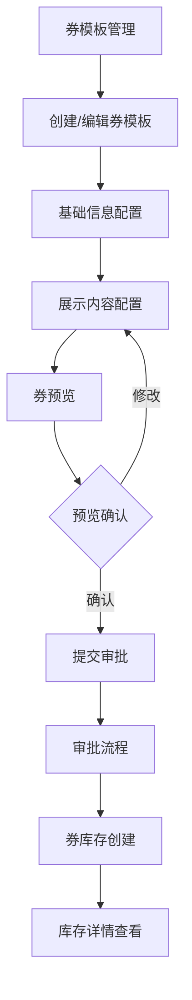

# 优惠券展示配置功能需求文档

## 1. 产品概述

本需求旨在优化现有的优惠券模板管理系统，新增展示内容配置功能，支持券的前端展示样式配置和预览，提升用户体验和运营效率。系统将在现有券模板基础上扩展展示配置能力，并在券库存详情查询和审批流程中集成相应的展示内容配置和预览功能。

## 2. 核心功能

### 2.1 用户角色

| 角色   | 权限说明       | 核心功能                |
| ---- | ---------- | ------------------- |
| 运营人员 | 券模板创建和配置权限 | 创建券模板、配置展示内容、预览券样式  |
| 审批人员 | 券审批权限      | 查看券展示配置、预览券效果、审批券库存 |
| 管理员  | 全部权限       | 管理券模板、审批流程、系统配置     |

### 2.2 功能模块

系统主要包含以下核心页面：

1. **券模板管理页面**：券模板列表、创建、编辑功能
2. **展示配置页面**：新增的展示内容配置界面
3. **券预览页面**：实时预览券的前端展示效果
4. **券库存详情页面**：查看券库存信息及展示配置
5. **审批流程页面**：集成展示配置的审批界面

### 2.3 页面详情

| 页面名称     | 模块名称   | 功能描述                     |
| -------- | ------ | ------------------------ |
| 券模板管理    | 模板列表   | 展示所有券模板，支持筛选、搜索、操作       |
| 券模板创建/编辑 | 基础信息配置 | 配置券名称、类型、有效期等基础信息        |
| 券模板创建/编辑 | 展示内容配置 | 配置优惠券类型展示、角标文字、类别文字、减免值等 |
| 券模板创建/编辑 | 对客展示配置 | 配置对客展示名称、到期日显示、使用说明等     |
| 券预览      | 实时预览   | 根据配置实时生成券的前端展示样式         |
| 券库存详情    | 展示配置查看 | 查看券的展示内容配置和预览效果          |
| 审批流程     | 展示配置审批 | 在审批时查看和确认券的展示配置          |

## 3. 核心流程

### 3.1 券模板创建流程

运营人员创建券模板时，需要完成基础信息配置和展示内容配置，然后通过预览确认展示效果，最后提交审批。

### 3.2 券库存创建流程

基于已审批的券模板创建券库存，系统自动继承模板的展示配置，支持在库存详情中查看展示效果。

### 3.3 审批流程

审批人员在审批券库存时，可以查看完整的展示配置和预览效果，确认无误后完成审批。

## 4. 用户界面设计

### 4.1 设计风格

* **主色调**：#165DFF（Arco Design主色）、#F53F3F（警告色）

* **按钮样式**：圆角按钮，支持多种状态（primary、success、warning）

* **字体**：系统默认字体，标题16px，正文14px，辅助文字12px

* **布局风格**：卡片式布局，左侧导航，响应式设计

* **图标风格**：使用Arco Design图标库，简洁现代

### 4.2 页面设计概览

| 页面名称  | 模块名称   | UI元素                 |
| ----- | ------ | -------------------- |
| 券模板创建 | 展示配置区域 | 表单布局，分组展示，支持折叠展开     |
| 券预览   | 预览区域   | 模拟手机界面，实时更新，支持不同尺寸预览 |
| 库存详情  | 展示信息   | 只读展示，卡片布局，清晰的信息层级    |
| 审批页面  | 配置预览   | 集成预览组件，支持展开查看详情      |

### 4.3 响应式设计

系统采用桌面优先的响应式设计，支持1920px、1440px、1024px等主流分辨率，预览功能支持移动端样式模拟。

## 5. 详细功能规格

### 5.1 展示内容配置

#### 5.1.1 优惠券类型配置

**免息券类型配置**：

* 免天数/期数：展示具体免息天数或期数

* 免固定金额：展示金额+利息减免

| 配置项  | 示例  | 备注   | 规则              |
| ---- | --- | ---- | --------------- |
| 天数   | 3天  | 免息   | X为【1，365】天，需为整数 |
| 期数   | 1期  | 免息   | X为【1，12】期，需为整数  |
| 固定金额 | 20元 | 利息减免 | 金额支持最多2位小数      |

**折扣券类型配置**：

| 配置项 | 示例  | 规则                                                    |
| --- | --- | ----------------------------------------------------- |
| X%  | 80% | 1、X为（0-100%），配置比例即代表本笔借据折扣2、比例为整数，不支持小数3、85%前端显示为8.5折 |

#### 5.1.2 角标和类别文字配置

* **角标文字**：支持自定义文本，如"免息券"、"折扣券"

* **类别文字**：支持配置类别描述，如"7天"、"10元"、"8折"

* **减免值**：根据券类型自动计算或手动配置

#### 5.1.3 对客展示名称

* 支持自定义文本，字数限制20字以内

* 与券库存名称、券模板名称无关联关系

* 不同券的券名称可重复

* 示例：新客7天免息券（苏银消金APP专享）

#### 5.1.4 券到期日期展示

| 券期限 | 规则                                |
| --- | --------------------------------- |
| 有期限 | 根据券库存有效期展示具体到期日，当券有效期≤7天时提示"仅剩X天" |
| 无期限 | 展示为"长期有效"                         |

* 支持配置是否展示剩余到期日

* 支持配置开始展示的剩余天数阈值

#### 5.1.5 使用说明配置

* 自定义文本，限200字以内

* 支持富文本编辑器，可进行加粗、变色等基本文本编辑

* 支持换行、列表等格式

#### 5.1.6 券预览功能

* 券配置完成后，实时生成前端展示样式

* 支持移动端样式预览

* 预览内容包含所有配置的展示字段和到期日期

* 创建人预览确认后可提交审批

#### 5.1.7 锁定参数配置

| 锁定期限类型 | 锁定期限值              | 限定方式   | 借钱页对客展示                  | 还款页对客展示           |
| ------ | ------------------ | ------ | ------------------------ | ----------------- |
| 天/期    | 【1，365】整数/【1，12】整数 | 限制还款   | 用券后，本笔借款不支持提前还款          | 弹窗提示：温馨提醒，不支持提前还款 |
| 天/期    | 【1，365】整数/【1，12】整数 | 补收免息息费 | 用券后，在X期数/天数内提前还款将收回已减免息费 | 增加收费项字段：优惠收回      |

### 5.2 库存详情展示

* 在券库存详情页面展示完整的展示内容配置

* 支持预览券的前端展示效果

* 展示配置信息以只读方式呈现

* 支持导出配置信息

### 5.3 审批流程集成

* 审批时展示券的展示内容配置

* 支持在审批页面预览券效果

* 审批人员可查看完整的配置详情

* 支持审批意见和修改建议

## 6. 技术要求

### 6.1 前端技术栈

* Vue 3 + Composition API

* Arco Design 组件库

* Vue Router 路由管理

* Vuex 状态管理

* TypeScript 类型支持

### 6.2 功能要求

* 富文本编辑器集成

* 实时预览功能

* 响应式设计

* 表单验证

* 数据持久化

### 6.3 性能要求

* 页面加载时间 < 2秒

* 预览功能响应时间 < 500ms

* 支持并发用户数 > 100

* 数据保存成功率 > 99%

## 7. 验收标准

### 7.1 功能验收

* [ ] 券模板创建支持展示内容配置

* [ ] 实时预览功能正常工作

* [ ] 库存详情正确展示配置信息

* [ ] 审批流程集成展示配置

* [ ] 富文本编辑器功能完整

* [ ] 表单验证规则正确

### 7.2 界面验收

* [ ] 界面设计符合设计规范

* [ ] 响应式布局适配各种屏幕

* [ ] 交互体验流畅自然

* [ ] 错误提示清晰明确

### 7.3 性能验收

* [ ] 页面加载性能达标

* [ ] 预览功能响应及时

* [ ] 数据保存稳定可靠

* [ ] 并发访问正常

