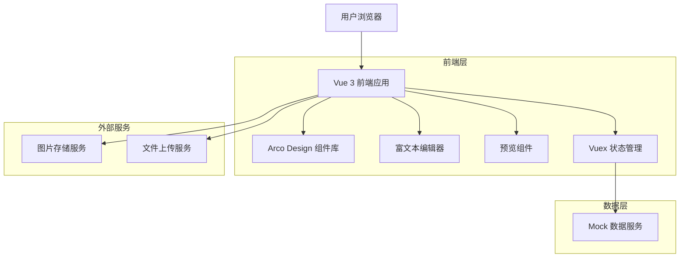
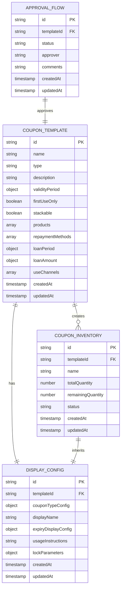

# 优惠券展示配置技术架构文档

## 1. 架构设计



## 2. 技术描述

- **前端框架**：Vue 3 + Composition API + TypeScript
- **UI组件库**：Arco Design
- **构建工具**：Vite
- **状态管理**：Vuex
- **路由管理**：Vue Router
- **富文本编辑**：@arco-design/web-vue Editor 或 Quill.js
- **数据模拟**：Mock.js
- **样式处理**：Less/SCSS

## 3. 路由定义

| 路由 | 用途 |
|------|------|
| /marketing/coupon/template | 券模板管理列表页 |
| /marketing/coupon/template/create | 券模板创建页（包含展示配置） |
| /marketing/coupon/template/edit/:id | 券模板编辑页（包含展示配置） |
| /marketing/coupon/template/preview/:id | 券预览页面 |
| /marketing/coupon/inventory | 券库存管理列表页 |
| /marketing/coupon/inventory/detail/:id | 券库存详情页（包含展示配置查看） |
| /marketing/coupon/approval | 券审批流程页面 |
| /marketing/coupon/approval/detail/:id | 券审批详情页（包含展示配置预览） |

## 4. API定义

### 4.1 券模板相关API

**获取券模板列表**
```
GET /api/coupon/template/list
```

Response:
| 参数名 | 参数类型 | 描述 |
|--------|----------|------|
| code | number | 响应状态码 |
| data | Array | 券模板列表 |
| message | string | 响应消息 |

**创建券模板**
```
POST /api/coupon/template/create
```

Request:
| 参数名 | 参数类型 | 是否必填 | 描述 |
|--------|----------|----------|------|
| name | string | 是 | 券模板名称 |
| type | string | 是 | 券类型（interest_free/discount） |
| displayConfig | object | 是 | 展示配置信息 |

**更新券模板**
```
PUT /api/coupon/template/update/:id
```

**获取券模板详情**
```
GET /api/coupon/template/detail/:id
```

### 4.2 展示配置相关API

**保存展示配置**
```
POST /api/coupon/display-config/save
```

Request:
| 参数名 | 参数类型 | 是否必填 | 描述 |
|--------|----------|----------|------|
| templateId | string | 是 | 券模板ID |
| couponType | object | 是 | 优惠券类型配置 |
| displayName | string | 是 | 对客展示名称 |
| expiryDisplay | object | 否 | 到期日显示配置 |
| usageInstructions | string | 否 | 使用说明 |

**获取展示配置**
```
GET /api/coupon/display-config/:templateId
```

### 4.3 预览相关API

**生成券预览**
```
POST /api/coupon/preview/generate
```

Request:
| 参数名 | 参数类型 | 是否必填 | 描述 |
|--------|----------|----------|------|
| templateId | string | 是 | 券模板ID |
| displayConfig | object | 是 | 展示配置 |

Response示例:
```json
{
  "code": 200,
  "data": {
    "previewUrl": "https://example.com/preview/123",
    "previewData": {
      "couponType": "免息券",
      "tagText": "3天",
      "categoryText": "免息",
      "displayName": "新客7天免息券（苏银消金APP专享）",
      "expiryDate": "2025年9月10日到期",
      "usageInstructions": "仅限首次借款使用..."
    }
  }
}
```

## 5. 数据模型

### 5.1 数据模型定义



### 5.2 数据定义语言

**券模板表 (coupon_templates)**
```sql
-- 创建券模板表
CREATE TABLE coupon_templates (
    id VARCHAR(36) PRIMARY KEY DEFAULT (UUID()),
    name VARCHAR(100) NOT NULL COMMENT '券模板名称',
    type ENUM('interest_free', 'discount') NOT NULL COMMENT '券类型',
    description TEXT COMMENT '券描述',
    validity_period_type ENUM('limited', 'unlimited') DEFAULT 'limited',
    validity_period_start DATETIME NULL,
    validity_period_end DATETIME NULL,
    first_use_only BOOLEAN DEFAULT FALSE,
    stackable BOOLEAN DEFAULT FALSE,
    products JSON COMMENT '适用产品',
    repayment_methods JSON COMMENT '还款方式',
    loan_period_config JSON COMMENT '借款期限配置',
    loan_amount_config JSON COMMENT '借款金额配置',
    use_channels JSON COMMENT '使用渠道',
    interest_free_config JSON COMMENT '免息券配置',
    discount_config JSON COMMENT '折扣券配置',
    status ENUM('draft', 'pending', 'approved', 'rejected') DEFAULT 'draft',
    created_by VARCHAR(36),
    created_at TIMESTAMP DEFAULT CURRENT_TIMESTAMP,
    updated_at TIMESTAMP DEFAULT CURRENT_TIMESTAMP ON UPDATE CURRENT_TIMESTAMP
);

-- 创建展示配置表
CREATE TABLE coupon_display_configs (
    id VARCHAR(36) PRIMARY KEY DEFAULT (UUID()),
    template_id VARCHAR(36) NOT NULL,
    coupon_type_config JSON COMMENT '优惠券类型配置',
    display_name VARCHAR(100) COMMENT '对客展示名称',
    expiry_display_config JSON COMMENT '到期日显示配置',
    usage_instructions TEXT COMMENT '使用说明',
    lock_parameters JSON COMMENT '锁定参数',
    created_at TIMESTAMP DEFAULT CURRENT_TIMESTAMP,
    updated_at TIMESTAMP DEFAULT CURRENT_TIMESTAMP ON UPDATE CURRENT_TIMESTAMP,
    FOREIGN KEY (template_id) REFERENCES coupon_templates(id)
);

-- 创建券库存表
CREATE TABLE coupon_inventories (
    id VARCHAR(36) PRIMARY KEY DEFAULT (UUID()),
    template_id VARCHAR(36) NOT NULL,
    name VARCHAR(100) NOT NULL,
    total_quantity INT DEFAULT 0,
    remaining_quantity INT DEFAULT 0,
    status ENUM('active', 'inactive', 'expired') DEFAULT 'active',
    created_by VARCHAR(36),
    created_at TIMESTAMP DEFAULT CURRENT_TIMESTAMP,
    updated_at TIMESTAMP DEFAULT CURRENT_TIMESTAMP ON UPDATE CURRENT_TIMESTAMP,
    FOREIGN KEY (template_id) REFERENCES coupon_templates(id)
);

-- 创建审批流程表
CREATE TABLE approval_flows (
    id VARCHAR(36) PRIMARY KEY DEFAULT (UUID()),
    template_id VARCHAR(36) NOT NULL,
    status ENUM('pending', 'approved', 'rejected') DEFAULT 'pending',
    approver VARCHAR(36),
    comments TEXT,
    approved_at TIMESTAMP NULL,
    created_at TIMESTAMP DEFAULT CURRENT_TIMESTAMP,
    updated_at TIMESTAMP DEFAULT CURRENT_TIMESTAMP ON UPDATE CURRENT_TIMESTAMP,
    FOREIGN KEY (template_id) REFERENCES coupon_templates(id)
);

-- 创建索引
CREATE INDEX idx_coupon_templates_type ON coupon_templates(type);
CREATE INDEX idx_coupon_templates_status ON coupon_templates(status);
CREATE INDEX idx_display_configs_template_id ON coupon_display_configs(template_id);
CREATE INDEX idx_inventories_template_id ON coupon_inventories(template_id);
CREATE INDEX idx_approval_flows_template_id ON approval_flows(template_id);
CREATE INDEX idx_approval_flows_status ON approval_flows(status);

-- 初始化数据
INSERT INTO coupon_templates (name, type, description, status) VALUES
('新客免息券模板', 'interest_free', '新客专享免息券', 'approved'),
('折扣券模板', 'discount', '通用折扣券', 'approved');

INSERT INTO coupon_display_configs (template_id, coupon_type_config, display_name, usage_instructions) VALUES
((SELECT id FROM coupon_templates WHERE name = '新客免息券模板'), 
 '{"type": "interest_free", "tagText": "7天", "categoryText": "免息", "reductionValue": "7天免息"}',
 '新客7天免息券（苏银消金APP专享）',
 '1. 仅限首次借款使用\n2. 不可与其他优惠叠加\n3. 详情请咨询客服');
```

## 6. 组件架构

### 6.1 核心组件结构

```
src/pages/marketing/coupon/
├── template/
│   ├── index.vue                    # 券模板列表页
│   ├── create.vue                   # 券模板创建页
│   ├── edit.vue                     # 券模板编辑页
│   └── components/
│       ├── DisplayConfigForm.vue    # 展示配置表单组件
│       ├── CouponPreview.vue        # 券预览组件
│       ├── TypeConfigForm.vue       # 类型配置表单
│       ├── ExpiryConfigForm.vue     # 到期日配置表单
│       └── UsageInstructionsEditor.vue # 使用说明编辑器
├── inventory/
│   ├── index.vue                    # 券库存列表页
│   ├── detail.vue                   # 券库存详情页
│   └── components/
│       └── DisplayConfigView.vue    # 展示配置查看组件
├── approval/
│   ├── index.vue                    # 审批列表页
│   ├── detail.vue                   # 审批详情页
│   └── components/
│       └── ApprovalPreview.vue      # 审批预览组件
└── shared/
    ├── CouponCard.vue               # 券卡片组件
    ├── PreviewModal.vue             # 预览弹窗组件
    └── RichTextEditor.vue           # 富文本编辑器组件
```

### 6.2 状态管理

```typescript
// store/modules/coupon.ts
interface CouponState {
  templates: CouponTemplate[]
  currentTemplate: CouponTemplate | null
  displayConfig: DisplayConfig | null
  previewData: PreviewData | null
  inventories: CouponInventory[]
  approvalFlows: ApprovalFlow[]
}

interface DisplayConfig {
  couponTypeConfig: {
    type: 'interest_free' | 'discount'
    tagText: string
    categoryText: string
    reductionValue: string
  }
  displayName: string
  expiryDisplayConfig: {
    showExpiry: boolean
    thresholdDays: number
  }
  usageInstructions: string
  lockParameters: {
    lockType: 'days' | 'periods'
    lockValue: number
    limitType: 'restrict_repayment' | 'recover_interest'
  }
}
```

### 6.3 工具函数

```typescript
// utils/couponUtils.ts

// 生成券预览数据
export function generatePreviewData(template: CouponTemplate, displayConfig: DisplayConfig): PreviewData {
  return {
    couponType: displayConfig.couponTypeConfig.type,
    tagText: displayConfig.couponTypeConfig.tagText,
    categoryText: displayConfig.couponTypeConfig.categoryText,
    displayName: displayConfig.displayName,
    expiryDate: calculateExpiryDate(template.validityPeriod),
    usageInstructions: displayConfig.usageInstructions
  }
}

// 计算到期日显示
export function calculateExpiryDate(validityPeriod: ValidityPeriod): string {
  if (validityPeriod.type === 'unlimited') {
    return '长期有效'
  }
  
  const endDate = new Date(validityPeriod.endDate)
  const now = new Date()
  const diffDays = Math.ceil((endDate.getTime() - now.getTime()) / (1000 * 60 * 60 * 24))
  
  if (diffDays <= 7) {
    return `仅剩${diffDays}天`
  }
  
  return endDate.toLocaleDateString('zh-CN')
}

// 验证展示配置
export function validateDisplayConfig(config: DisplayConfig): ValidationResult {
  const errors: string[] = []
  
  if (!config.displayName || config.displayName.length > 20) {
    errors.push('对客展示名称不能为空且不超过20字')
  }
  
  if (config.usageInstructions && config.usageInstructions.length > 200) {
    errors.push('使用说明不能超过200字')
  }
  
  return {
    valid: errors.length === 0,
    errors
  }
}
```

## 7. 部署架构

### 7.1 开发环境

- **开发服务器**：Vite Dev Server (端口: 3000)
- **Mock服务**：集成在前端项目中
- **热更新**：支持组件级热更新
- **调试工具**：Vue DevTools

### 7.2 构建配置

```javascript
// vite.config.js
export default defineConfig({
  plugins: [
    vue(),
    Components({
      resolvers: [ArcoResolver()]
    })
  ],
  resolve: {
    alias: {
      '@': path.resolve(__dirname, 'src')
    }
  },
  build: {
    rollupOptions: {
      output: {
        manualChunks: {
          'arco-design': ['@arco-design/web-vue'],
          'rich-editor': ['quill']
        }
      }
    }
  }
})
```

### 7.3 性能优化

- **代码分割**：按路由和组件进行代码分割
- **懒加载**：非关键组件采用懒加载
- **缓存策略**：静态资源长期缓存，API数据短期缓存
- **预览优化**：预览组件采用虚拟滚动和防抖处理