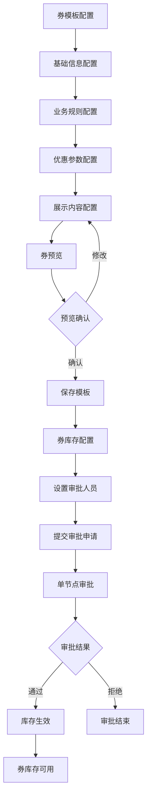

# 优惠券系统完整需求文档

## 1. 产品概述

本需求旨在构建一个完整的优惠券管理系统，包含券模板配置、券库存管理、展示内容配置和审批流程管理等核心功能。系统采用职责分离的设计理念：券模板专注于基础信息和展示规则配置，券库存承担审批流程管理职责，实现更清晰的业务逻辑和更灵活的管理方式。
- 券模板配置：定义券的基础信息、业务规则和展示配置，支持实时预览
- 券库存配置：基于券模板创建库存，配置审批流程和发放规则
- 展示内容配置：与券模板字段保持一致，确保数据同步和展示统一

## 2. 核心功能

### 2.1 用户角色

| 角色 | 权限范围 | 核心职责 |
|------|----------|----------|
| 券模板配置员 | 券模板创建和编辑 | 配置券模板基础信息、展示规则、预览券样式 |
| 券库存管理员 | 券库存创建和审批配置 | 配置券库存、设置单节点审批人员 |
| 审批人员 | 审批操作 | 执行审批决策、填写审批意见 |
| 运营人员 | 券管理和监控 | 监控券使用情况、分析券效果、优化券配置 |
| 系统管理员 | 全局配置 | 管理审批角色、系统参数设置 |

### 2.2 功能模块

系统主要包含以下核心页面：

1. **券模板管理页面**：券模板列表、创建、编辑功能
2. **券模板配置页面**：基础信息配置、展示规则设置
3. **券预览页面**：实时预览券的前端展示效果
4. **券库存管理页面**：库存列表、创建、单节点审批配置
5. **券库存配置页面**：库存创建、单节点审批人员设置

### 2.3 页面详情

| 页面名称 | 模块名称 | 功能描述 |
|----------|----------|----------|
| 券模板管理 | 模板列表 | 展示所有券模板，支持筛选、搜索、操作 |
| 券模板配置 | 基础信息配置 | 配置券名称、类型、有效期、使用规则等基础信息 |
| 券模板配置 | 展示内容配置 | 配置对客展示名称、角标文字、类别、减免值、使用说明等 |
| 券模板配置 | 业务规则配置 | 配置贷款产品、还款方式、借款期限、金额范围、使用渠道等 |
| 券模板配置 | 优惠参数配置 | 配置免息天数/金额或折扣类型/折扣率等优惠参数 |
| 券预览 | 实时预览 | 根据配置实时生成券的前端展示样式，支持多端预览 |
| 券库存管理 | 库存列表 | 展示券库存统计，支持批量操作和数据导出 |
| 券库存配置 | 库存基础配置 | 设置库存数量、发放规则、使用限制等 |
| 券库存配置 | 单节点审批配置 | 设置审批人员、审批规则 |
| 券库存配置 | 审批历史查看 | 查看历史审批记录，包括审批时间、审批人、审批结果 |

## 3. 核心流程

### 3.1 券模板配置流程
1. 用户进入券模板配置页面
2. 填写券模板基础信息（名称、类型、有效期等）
3. 配置业务规则（贷款产品、还款方式、借款期限等）
4. 配置优惠参数（免息天数/折扣率等）
5. 配置展示规则（对客名称、角标、使用说明等）
6. 实时预览券模板展示效果
7. 保存券模板配置（无需审批，直接生效）

### 3.2 券库存配置和审批流程
1. 用户选择已配置的券模板
2. 配置库存基础信息（数量、发放规则等）
3. 设置单节点审批人员
4. 提交库存配置申请
5. 系统通知审批人员进行审批
6. 审批人员进行审批操作（通过/拒绝）
7. 审批完成后，库存配置生效

### 3.3 审批处理流程
1. 审批人员接收审批任务通知
2. 查看库存配置详情和券预览效果
3. 执行审批决策（通过/拒绝）
4. 填写审批意见
5. 提交审批结果，审批流程结束



## 4. 用户界面设计

### 4.1 设计风格

* **主色调**：#165DFF（Arco Design主色）、#00B42A（成功色）
* **辅助色**：#FF7D00（警告色）、#F53F3F（错误色）
* **按钮样式**：圆角按钮，支持多种状态（primary、success、warning、danger）
* **字体**：系统默认字体，标题16px，正文14px，辅助文字12px
* **布局风格**：卡片式布局，左侧导航，响应式设计
* **图标风格**：使用Arco Design图标库，简洁现代的线性图标

### 4.2 页面设计概览

| 页面名称 | 模块名称 | UI元素 |
|----------|----------|--------|
| 券模板配置 | 基础信息配置 | 表单布局，输入框、选择器、日期选择器，实时验证提示 |
| 券模板配置 | 展示配置区域 | 富文本编辑器、颜色选择器、预览面板，分组展示，支持折叠展开 |
| 券预览 | 预览区域 | 模拟手机界面，实时更新，支持不同尺寸预览 |
| 券库存配置 | 单节点审批配置 | 人员选择器、审批规则配置表单 |
| 券库存配置 | 审批历史查看 | 审批记录列表、状态标签、审批意见展示 |

### 4.3 响应式设计

系统采用桌面优先的响应式设计，支持1920px、1440px、1024px等主流分辨率，预览功能支持移动端样式模拟，关键功能在移动端保持可用性。

## 5. 详细功能规格

### 5.1 券模板基础信息配置

基于现有代码结构，券模板包含以下核心字段：

| 字段名称 | 字段类型 | 必填 | 说明 |
|----------|----------|------|------|
| name | string | 是 | 优惠券名称 |
| type | string | 是 | 券类型：interest_free(免息券)/discount(折扣券) |
| validityPeriodType | string | 是 | 有效期类型：limited(有期限)/unlimited(无期限) |
| validityPeriod | [Date, Date] | 否 | 有效期时间范围 |
| firstUseOnly | boolean | 是 | 是否仅限首次支用 |
| stackable | boolean | 是 | 是否支持叠加 |
| products | string[] | 是 | 适用贷款产品 |
| repaymentMethods | string[] | 是 | 还款方式 |
| loanPeriodType | string | 是 | 借款期限类型 |
| loanAmountMin | number | 否 | 最小借款金额 |
| loanAmountMax | number | 否 | 最大借款金额 |
| useChannels | string[] | 是 | 使用渠道 |
| creditChannels | string[] | 是 | 授信渠道 |

### 5.2 优惠参数配置

**免息券参数**：
| 字段名称 | 字段类型 | 说明 |
|----------|----------|------|
| interestFreeDays | number | 免息天数，范围[0, 1000] |
| maxInterestFreeAmount | number | 最大免息金额 |

**折扣券参数**：
| 字段名称 | 字段类型 | 说明 |
|----------|----------|------|
| discountType | string | 折扣类型：uniform(统一折扣)/tiered(分期折扣)/fixed(固定利率) |
| uniformDiscount | number | 统一折扣率，范围[0, 1] |
| frontPeriods | number | 前期期数 |
| frontDiscount | number | 前期折扣率 |
| backPeriods | number | 后期期数 |
| backDiscount | number | 后期折扣率 |

### 5.3 展示内容配置

展示配置需要与券模板字段保持一致，确保数据同步：

#### 5.3.1 优惠券类型展示配置

**免息券类型配置**：
* 免天数/期数：基于券模板的 `interestFreeDays` 字段自动计算展示
* 免固定金额：基于券模板的 `maxInterestFreeAmount` 字段展示

| 配置项 | 展示规则 | 数据来源 |
|--------|----------|----------|
| 天数 | X天免息 | formData.interestFreeDays |
| 期数 | X期免息 | 基于loanPeriodType计算 |
| 固定金额 | X元利息减免 | formData.maxInterestFreeAmount |

**折扣券类型配置**：
* 折扣率展示：基于券模板的 `uniformDiscount` 等字段计算

| 配置项 | 展示规则 | 数据来源 |
|--------|----------|----------|
| 统一折扣 | X折 | (formData.uniformDiscount * 10).toFixed(1) + '折' |
| 分期折扣 | 前X期Y折，后Z期W折 | 基于frontPeriods、frontDiscount等计算 |

#### 5.3.2 角标和展示字段配置

* **角标文字**：基于券模板的 `type` 字段自动生成，支持自定义覆盖
* **类别**：基于券类型自动生成，如"免息"、"折扣"等
* **减免值**：根据券类型和优惠参数自动计算
  - 免息券：显示期数（如"3期"）或金额（如"100元"）
  - 折扣券：显示折扣率（如"8折"）

#### 5.3.3 对客展示名称

* 支持自定义文本，字数限制20字以内
* 默认值基于券模板的 `name` 字段
* 与券库存名称、券模板名称保持关联但可独立配置
* 示例：新客7天免息券（苏银消金APP专享）

#### 5.3.4 券到期日期展示

基于券模板的 `validityPeriodType` 和 `validityPeriod` 字段：

| 券期限类型 | 展示规则 |
|------------|----------|
| limited | 根据validityPeriod展示具体到期日，当券有效期≤7天时提示"仅剩X天" |
| unlimited | 展示为"长期有效" |

#### 5.3.5 使用说明配置

* 自定义文本，限200字以内
* 支持富文本编辑器，可进行加粗、变色等基本文本编辑
* 可基于券模板的业务规则自动生成默认说明
* 支持换行、列表等格式

### 5.4 券预览功能

#### 5.4.1 实时预览基本功能
* 券配置完成后，基于券模板字段实时生成前端展示样式
* 支持移动端样式预览，模拟真实使用场景
* 预览内容包含所有配置的展示字段和到期日期
* 展示内容与券模板数据保持实时同步
* 创建人预览确认后可提交或保存

#### 5.4.2 预览默认状态处理
* **展示名称未填写时**：显示初始状态，使用默认文案"借6期免前3期优惠券"
* **有效期未配置时**：显示默认到期日期"2025年9月10日到期"
* **类别和减免值**：根据券类型显示默认值
  - 免息券：类别显示"免息"，减免值显示"3期"
  - 折扣券：类别显示"折扣"，减免值显示对应折扣率

#### 5.4.3 有效期展示规则
* **有期限券**：
  - 显示具体到期日期，格式为"YYYY年MM月DD日到期"
  - 当剩余天数≤7天时，显示"仅剩X天"提醒
* **长期有效券**：
  - 显示"长期有效"文案
  - 在配置界面提供"长期有效"选项

#### 5.4.4 响应式设计要求
* 预览区域采用响应式布局，避免出现横向滚动
* 移动端预览宽度固定为375px，居中显示
* 桌面端预览区域自适应容器宽度，最大宽度不超过500px
* 预览内容在不同屏幕尺寸下保持良好的可读性和布局

### 5.5 单节点审批配置

#### 5.5.1 审批配置

| 配置项 | 类型 | 说明 |
|--------|------|------|
| 审批人员 | string | 审批人员ID |
| 审批人姓名 | string | 审批人员姓名 |
| 审批角色 | string | 审批角色 |
| 超时时间 | number | 审批超时时间（小时），默认24小时 |

#### 5.5.2 审批状态管理

| 状态 | 说明 |
|------|------|
| pending | 待审批 |
| approved | 已通过 |
| rejected | 已拒绝 |
| cancelled | 已取消 |

### 5.6 库存详情展示

* 在券库存详情页面展示完整的券模板配置和展示内容配置
* 支持预览券的前端展示效果，与券模板预览保持一致
* 展示配置信息以只读方式呈现
* 支持导出配置信息和审批历史

## 6. 技术要求

### 6.1 前端技术栈

* **框架**：Vue 3 + Composition API
* **构建工具**：Vite
* **UI组件库**：Arco Design
* **状态管理**：Vuex
* **路由管理**：Vue Router
* **开发语言**：JavaScript + TypeScript

### 6.2 核心功能要求

* **数据一致性**：展示配置与券模板字段保持实时同步
* **单节点审批**：支持简单的单人审批流程
* **状态管理**：实时跟踪审批状态，支持状态变更通知
* **权限控制**：基于角色的权限管理，精确控制操作权限
* **富文本编辑器**：支持使用说明的富文本编辑
* **实时预览功能**：支持券样式的实时预览和多端适配
* **表单验证**：前端表单验证和数据校验
* **异常处理**：完善的错误处理机制和用户友好的错误提示

### 6.3 性能要求

* **页面加载**：首屏加载时间不超过2秒
* **预览功能**：预览响应时间不超过500ms
* **交互响应**：用户操作响应时间不超过500ms
* **数据处理**：支持大量券模板和库存数据的高效处理
* **并发支持**：支持多用户同时进行配置和审批操作
* **数据保存**：数据保存成功率 > 99%

## 7. 数据模型设计

### 7.1 券模板数据结构
```typescript
interface CouponTemplate {
  id: string
  name: string
  type: 'interest_free' | 'discount'
  validityPeriodType: 'limited' | 'unlimited'
  validityPeriod?: [Date, Date]
  firstUseOnly: boolean
  stackable: boolean
  products: string[]
  repaymentMethods: string[]
  loanPeriodType: string
  loanPeriodMin?: number
  loanPeriodMax?: number
  loanAmountMin?: number
  loanAmountMax?: number
  useChannels: string[]
  creditChannels: string[]
  
  // 免息券参数
  interestFreeDays?: number
  maxInterestFreeAmount?: number
  
  // 折扣券参数
  discountType?: 'uniform' | 'tiered' | 'fixed'
  uniformDiscount?: number
  frontPeriods?: number
  frontDiscount?: number
  backPeriods?: number
  backDiscount?: number
  
  // 展示配置
  displayConfig: {
    customerDisplayName: string
    cornerText: string
    categoryText: string
    reductionValue: string
    showExpiryDate: boolean
    expiryThreshold: number
    usageInstructions: string
  }
  
  createTime: Date
  updateTime: Date
  creator: string
  status: 'draft' | 'active' | 'inactive'
}
```

### 7.2 券库存数据结构
```typescript
interface CouponInventory {
  id: string
  templateId: string
  stockQuantity: number
  distributionRules: {
    maxPerUser: number
    dailyLimit: number
    totalLimit: number
    userConditions: object
  }
  approvalConfig: {
    approver: string
    approverName: string
    approverRole: string
    timeout: number
  }
  approvalStatus: 'pending' | 'approved' | 'rejected' | 'cancelled'
  approvalHistory: ApprovalRecord[]
  createTime: Date
  updateTime: Date
  creator: string
}
```

### 7.3 审批记录数据结构
```typescript
interface ApprovalRecord {
  id: string
  inventoryId: string
  approver: string
  approverName: string
  action: 'approve' | 'reject'
  comment: string
  createTime: Date
  processTime?: Date
}
```

## 8. 实施计划

### 8.1 第一阶段：券模板配置优化（1.5周）
- 完善券模板基础信息配置功能
- 开发展示内容配置功能，确保与券模板字段一致性
- 实现券预览功能，支持实时预览和多端适配
- 优化券模板配置界面和用户体验

### 8.2 第二阶段：券库存单节点审批开发（1周）
- 开发券库存配置页面的单节点审批配置功能
- 实现审批人员配置和基本审批操作
- 开发库存详情展示功能
- 实现审批历史记录和状态跟踪

### 8.3 第三阶段：系统集成和优化（1周）
- 进行功能测试和性能测试
- 优化数据一致性和同步机制
- 完善用户体验和界面交互
- 修复发现的问题和缺陷

## 9. 验收标准

### 9.1 功能验收
- [ ] 券模板配置功能完整，支持所有必要字段配置
- [ ] 展示内容配置与券模板字段保持一致性
- [ ] 实时预览功能正常工作，支持多端预览
- [ ] 券库存配置支持完整的审批流程配置
- [ ] 审批管理功能正常，支持各种审批操作
- [ ] 审批状态跟踪准确，历史记录完整
- [ ] 库存详情正确展示配置信息和预览效果
- [ ] 富文本编辑器功能完整
- [ ] 表单验证规则正确

### 9.2 数据一致性验收
- [ ] 展示配置与券模板字段实时同步
- [ ] 券预览效果与实际展示一致
- [ ] 审批流程中的券信息展示准确
- [ ] 数据修改后相关展示自动更新

### 9.3 性能验收
- [ ] 页面加载和交互响应时间符合要求
- [ ] 预览功能响应及时，体验流畅
- [ ] 支持预期的并发用户数量
- [ ] 数据处理效率满足业务需求
- [ ] 数据保存稳定可靠

### 9.4 用户体验验收
- [ ] 界面设计符合设计规范
- [ ] 操作流程清晰直观
- [ ] 错误提示友好准确
- [ ] 响应式设计效果良好
- [ ] 券预览效果真实可信