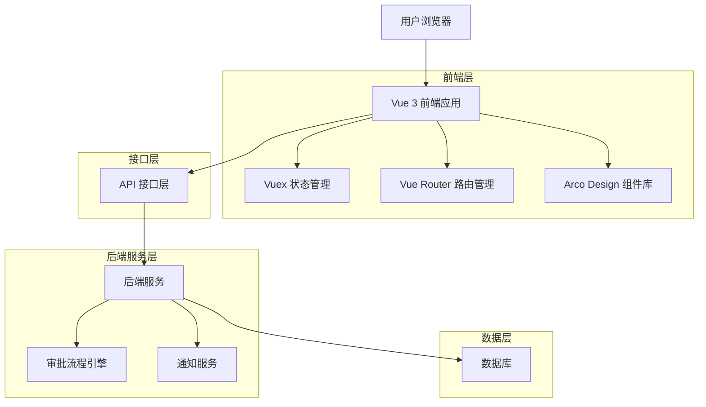
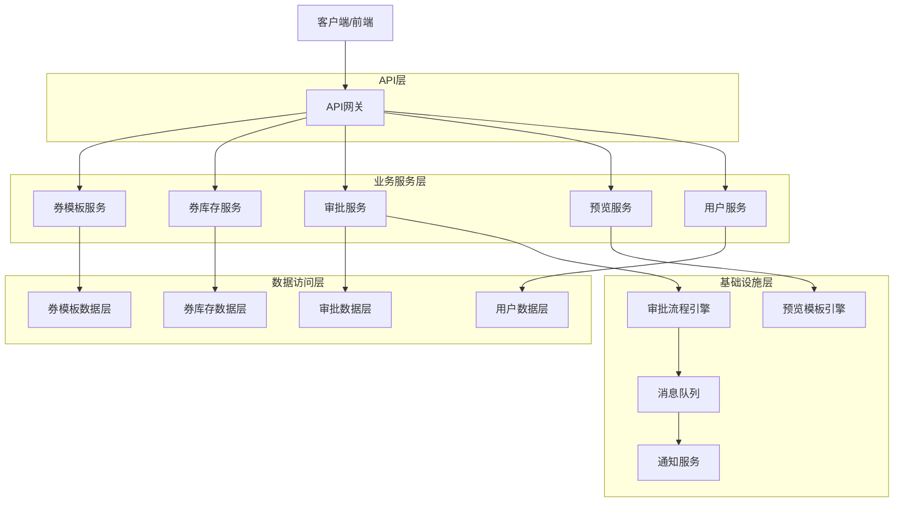

# 优惠券系统技术架构文档

## 1. 架构设计



## 2. 技术描述

### 2.1 前端技术栈
- **框架**：Vue 3 + Composition API
- **构建工具**：Vite
- **UI组件库**：Arco Design
- **状态管理**：Vuex
- **路由管理**：Vue Router
- **开发语言**：JavaScript + TypeScript
- **图形引擎**：AntV X6（用于审批流程图）
- **富文本编辑器**：@arco-design/web-vue/es/rich-text-editor

### 2.2 后端技术栈
- **框架**：Node.js + Express / Spring Boot（可选）
- **数据库**：PostgreSQL / MySQL
- **缓存**：Redis
- **消息队列**：RabbitMQ / Apache Kafka
- **审批引擎**：自研审批流程引擎

## 3. 路由定义

| 路由 | 页面名称 | 功能描述 |
|------|----------|----------|
| /marketing/coupon/template | 券模板管理 | 券模板列表页面，支持创建、编辑、删除操作 |
| /marketing/coupon/template/create | 券模板创建 | 券模板创建页面，包含基础信息、展示配置、预览功能 |
| /marketing/coupon/template/edit/:id | 券模板编辑 | 券模板编辑页面，支持修改模板配置和预览 |
| /marketing/coupon/template/preview/:id | 券模板预览 | 券模板预览页面，展示券的前端效果 |
| /marketing/coupon/inventory | 券库存管理 | 券库存列表页面，支持库存创建、审批配置 |
| /marketing/coupon/inventory/create | 券库存创建 | 券库存创建页面，包含库存配置和单节点审批设置 |
| /marketing/coupon/inventory/detail/:id | 券库存详情 | 券库存详情页面，展示库存信息和审批状态 |


## 4. API 定义

### 4.1 券模板管理 API

创建券模板
```
POST /api/coupon/template
```

Request:
| 参数名 | 参数类型 | 是否必填 | 描述 |
|--------|----------|----------|------|
| name | string | true | 券模板名称 |
| type | string | true | 券类型：interest_free（免息券）、discount（折扣券） |
| description | string | false | 券描述 |
| validityPeriod | object | true | 有效期配置 |
| applicableProducts | array | true | 适用产品列表 |
| repaymentMethods | array | true | 还款方式 |
| loanTerms | array | true | 借款期限 |
| amountRange | object | true | 适用金额范围 |
| usageChannels | array | true | 使用渠道 |
| benefitConfig | object | true | 权益配置（免息天数或折扣信息） |

Response:
| 参数名 | 参数类型 | 描述 |
|--------|----------|------|
| success | boolean | 操作是否成功 |
| data | object | 创建的券模板信息 |
| message | string | 响应消息 |

### 4.2 券库存管理 API

创建券库存
```
POST /api/coupon/inventory
```

Request:
| 参数名 | 参数类型 | 是否必填 | 描述 |
|--------|----------|----------|------|
| templateId | string | true | 券模板ID |
| stockQuantity | number | true | 库存数量 |
| distributionRules | object | true | 分发规则配置 |
| approvalConfig | object | true | 单节点审批配置 |

Response:
| 参数名 | 参数类型 | 描述 |
|--------|----------|------|
| success | boolean | 操作是否成功 |
| data | object | 创建的券库存信息 |
| message | string | 响应消息 |

### 4.3 审批操作 API

执行审批操作
```
POST /api/coupon/approval/process
```

Request:
| 参数名 | 参数类型 | 是否必填 | 描述 |
|--------|----------|----------|------|
| inventoryId | string | true | 券库存ID |
| action | string | true | 审批动作：approve（通过）、reject（拒绝） |
| comment | string | false | 审批意见 |

Response:
| 参数名 | 参数类型 | 描述 |
|--------|----------|------|
| success | boolean | 操作是否成功 |
| message | string | 响应消息 |

获取审批历史
```
GET /api/coupon/approval/history/:inventoryId
```

Response:
| 参数名 | 参数类型 | 描述 |
|--------|----------|------|
| success | boolean | 操作是否成功 |
| data | array | 审批历史记录列表 |

### 4.4 预览相关 API

#### 券预览数据生成
```
POST /api/coupon/preview
```

请求体：
```json
{
  "templateData": {
    "name": "券名称",
    "type": "interest_free",
    "displayConfig": {}
  }
}
```

响应数据：
```json
{
  "code": 200,
  "message": "success",
  "data": {
    "previewHtml": "<div>...</div>",
    "previewData": {}
  }
}
```

## 5. 服务器架构图



## 6. 数据模型

### 6.1 数据模型定义

```mermaid
erDiagram
    COUPON_TEMPLATE ||--o{ COUPON_INVENTORY : creates
    COUPON_INVENTORY ||--o{ APPROVAL_RECORD : has
    APPROVAL_NODE ||--o{ APPROVAL_RECORD : processes
    COUPON_INVENTORY ||--o{ APPROVAL_NODE : configures

    COUPON_TEMPLATE {
        string id PK
        string name
        string type
        string validity_period_type
        date validity_period_start
        date validity_period_end
        boolean first_use_only
        boolean stackable
        json products
        json repayment_methods
        string loan_period_type
        decimal loan_amount_min
        decimal loan_amount_max
        json use_channels
        json credit_channels
        int interest_free_days
        decimal max_interest_free_amount
        string discount_type
        decimal uniform_discount
        json display_config
        datetime create_time
        datetime update_time
        string creator
        string status
    }

    COUPON_INVENTORY {
        string id PK
        string template_id FK
        int stock_quantity
        json distribution_rules
        json approval_config
        string approval_status
        datetime create_time
        datetime update_time
        string creator
    }

    APPROVAL_NODE {
        string id PK
        string inventory_id FK
        string name
        string type
        json approvers
        json approval_roles
        json conditions
        int timeout
        int order
        string status
        datetime create_time
    }

    APPROVAL_RECORD {
        string id PK
        string node_id FK
        string inventory_id FK
        string approver
        string approver_name
        string action
        text comment
        json attachments
        datetime create_time
        datetime process_time
    }
```



### 6.2 数据定义语言

#### 券模板表 (coupon_templates)
```sql
-- 创建券模板表
CREATE TABLE coupon_templates (
    id VARCHAR(36) PRIMARY KEY DEFAULT (UUID()),
    name VARCHAR(100) NOT NULL COMMENT '券模板名称',
    type ENUM('interest_free', 'discount') NOT NULL COMMENT '券类型',
    validity_period_type ENUM('limited', 'unlimited') NOT NULL COMMENT '有效期类型',
    validity_period_start DATE NULL COMMENT '有效期开始时间',
    validity_period_end DATE NULL COMMENT '有效期结束时间',
    first_use_only BOOLEAN DEFAULT FALSE COMMENT '是否仅限首次支用',
    stackable BOOLEAN DEFAULT FALSE COMMENT '是否支持叠加',
    products JSON NOT NULL COMMENT '适用贷款产品',
    repayment_methods JSON NOT NULL COMMENT '还款方式',
    loan_period_type VARCHAR(20) NOT NULL COMMENT '借款期限类型',
    loan_amount_min DECIMAL(15,2) NULL COMMENT '最小借款金额',
    loan_amount_max DECIMAL(15,2) NULL COMMENT '最大借款金额',
    use_channels JSON NOT NULL COMMENT '使用渠道',
    credit_channels JSON NOT NULL COMMENT '授信渠道',
    interest_free_days INT NULL COMMENT '免息天数',
    max_interest_free_amount DECIMAL(15,2) NULL COMMENT '最大免息金额',
    discount_type ENUM('uniform', 'tiered', 'fixed') NULL COMMENT '折扣类型',
    uniform_discount DECIMAL(5,4) NULL COMMENT '统一折扣率',
    display_config JSON NOT NULL COMMENT '展示配置',
    create_time TIMESTAMP DEFAULT CURRENT_TIMESTAMP COMMENT '创建时间',
    update_time TIMESTAMP DEFAULT CURRENT_TIMESTAMP ON UPDATE CURRENT_TIMESTAMP COMMENT '更新时间',
    creator VARCHAR(50) NOT NULL COMMENT '创建人',
    status ENUM('draft', 'active', 'inactive') DEFAULT 'draft' COMMENT '状态'
);

-- 创建索引
CREATE INDEX idx_coupon_templates_type ON coupon_templates(type);
CREATE INDEX idx_coupon_templates_status ON coupon_templates(status);
CREATE INDEX idx_coupon_templates_creator ON coupon_templates(creator);
CREATE INDEX idx_coupon_templates_create_time ON coupon_templates(create_time DESC);
```

#### 券库存表 (coupon_inventories)
```sql
-- 创建券库存表
CREATE TABLE coupon_inventories (
    id VARCHAR(36) PRIMARY KEY DEFAULT (UUID()),
    template_id VARCHAR(36) NOT NULL COMMENT '券模板ID',
    stock_quantity INT NOT NULL DEFAULT 0 COMMENT '库存数量',
    distribution_rules JSON NOT NULL COMMENT '发放规则',
    approval_config JSON NOT NULL COMMENT '审批配置',
    approval_status ENUM('pending', 'approved', 'rejected', 'cancelled') DEFAULT 'pending' COMMENT '审批状态',
    create_time TIMESTAMP DEFAULT CURRENT_TIMESTAMP COMMENT '创建时间',
    update_time TIMESTAMP DEFAULT CURRENT_TIMESTAMP ON UPDATE CURRENT_TIMESTAMP COMMENT '更新时间',
    creator VARCHAR(50) NOT NULL COMMENT '创建人',
    FOREIGN KEY (template_id) REFERENCES coupon_templates(id) ON DELETE CASCADE
);

-- 创建索引
CREATE INDEX idx_coupon_inventories_template_id ON coupon_inventories(template_id);
CREATE INDEX idx_coupon_inventories_approval_status ON coupon_inventories(approval_status);
CREATE INDEX idx_coupon_inventories_creator ON coupon_inventories(creator);
CREATE INDEX idx_coupon_inventories_create_time ON coupon_inventories(create_time DESC);
```

#### 审批节点表 (approval_nodes)
```sql
-- 创建审批节点表
CREATE TABLE approval_nodes (
    id VARCHAR(36) PRIMARY KEY DEFAULT (UUID()),
    inventory_id VARCHAR(36) NOT NULL COMMENT '券库存ID',
    name VARCHAR(100) NOT NULL COMMENT '节点名称',
    type ENUM('single', 'multiple', 'any') NOT NULL COMMENT '审批类型',
    approvers JSON NOT NULL COMMENT '审批人员',
    approval_roles JSON NOT NULL COMMENT '审批角色',
    conditions JSON NULL COMMENT '审批条件',
    timeout INT DEFAULT 24 COMMENT '超时时间(小时)',
    order_num INT NOT NULL COMMENT '节点顺序',
    status ENUM('pending', 'approved', 'rejected', 'skipped') DEFAULT 'pending' COMMENT '节点状态',
    create_time TIMESTAMP DEFAULT CURRENT_TIMESTAMP COMMENT '创建时间',
    FOREIGN KEY (inventory_id) REFERENCES coupon_inventories(id) ON DELETE CASCADE
);

-- 创建索引
CREATE INDEX idx_approval_nodes_inventory_id ON approval_nodes(inventory_id);
CREATE INDEX idx_approval_nodes_status ON approval_nodes(status);
CREATE INDEX idx_approval_nodes_order ON approval_nodes(inventory_id, order_num);
```

#### 审批记录表 (approval_records)
```sql
-- 创建审批记录表
CREATE TABLE approval_records (
    id VARCHAR(36) PRIMARY KEY DEFAULT (UUID()),
    node_id VARCHAR(36) NOT NULL COMMENT '审批节点ID',
    inventory_id VARCHAR(36) NOT NULL COMMENT '券库存ID',
    approver VARCHAR(50) NOT NULL COMMENT '审批人',
    approver_name VARCHAR(100) NOT NULL COMMENT '审批人姓名',
    action ENUM('approve', 'reject', 'return') NOT NULL COMMENT '审批动作',
    comment TEXT NULL COMMENT '审批意见',
    attachments JSON NULL COMMENT '附件',
    create_time TIMESTAMP DEFAULT CURRENT_TIMESTAMP COMMENT '创建时间',
    process_time TIMESTAMP NULL COMMENT '处理时间',
    FOREIGN KEY (node_id) REFERENCES approval_nodes(id) ON DELETE CASCADE,
    FOREIGN KEY (inventory_id) REFERENCES coupon_inventories(id) ON DELETE CASCADE
);

-- 创建索引
CREATE INDEX idx_approval_records_node_id ON approval_records(node_id);
CREATE INDEX idx_approval_records_inventory_id ON approval_records(inventory_id);
CREATE INDEX idx_approval_records_approver ON approval_records(approver);
CREATE INDEX idx_approval_records_create_time ON approval_records(create_time DESC);
```

#### 初始化数据
```sql
-- 插入示例券模板数据
INSERT INTO coupon_templates (
    id, name, type, validity_period_type, validity_period_start, validity_period_end,
    first_use_only, stackable, products, repayment_methods, loan_period_type,
    loan_amount_min, loan_amount_max, use_channels, credit_channels,
    interest_free_days, display_config, creator, status
) VALUES (
    'template_001',
    '新客7天免息券',
    'interest_free',
    'limited',
    '2024-01-01',
    '2024-12-31',
    true,
    false,
    '["product1", "product2"]',
    '["method1"]',
    'days',
    1000.00,
    50000.00,
    '["app", "web"]',
    '["channel1"]',
    7,
    '{"customerDisplayName": "新客7天免息券", "cornerText": "免息券", "categoryText": "7天", "reductionValue": "7天免息", "showExpiryDate": true, "expiryThreshold": 7, "usageInstructions": "仅限首次借款使用"}',
    'admin',
    'active'
);

-- 插入示例券库存数据
INSERT INTO coupon_inventories (
    id, template_id, stock_quantity, distribution_rules, approval_config, creator
) VALUES (
    'inventory_001',
    'template_001',
    10000,
    '{"maxPerUser": 1, "dailyLimit": 1000, "totalLimit": 10000, "userConditions": {}}',
    '{"approvalFlow": [{"id": "node1", "name": "初审", "type": "single", "approvers": ["reviewer1"], "timeout": 24, "order": 1}], "autoApproval": false, "approvalTimeout": 72}',
    'admin'
);
```

## 7. 组件架构

### 7.1 前端组件结构

```
src/
├── components/                 # 公共组件
│   ├── CouponPreview/         # 券预览组件
│   │   ├── index.vue
│   │   └── types.ts
│   ├── ApprovalFlow/          # 审批流程组件
│   │   ├── index.vue
│   │   ├── FlowNode.vue
│   │   └── types.ts
│   ├── RichTextEditor/        # 富文本编辑器
│   │   ├── index.vue
│   │   └── config.ts
│   └── FormValidator/         # 表单验证组件
│       ├── index.vue
│       └── rules.ts
├── pages/                     # 页面组件
│   └── marketing/
│       └── coupon/
│           ├── template/      # 券模板相关页面
│           │   ├── index.vue  # 模板列表
│           │   ├── create.vue # 模板创建
│           │   └── edit.vue   # 模板编辑
│           ├── inventory/     # 券库存相关页面
│           │   ├── index.vue  # 库存列表
│           │   ├── create.vue # 库存创建
│           │   └── detail.vue # 库存详情
│           └── approval/      # 审批相关页面
│               ├── index.vue  # 审批列表
│               ├── detail.vue # 审批详情
│               └── monitor.vue # 审批监控
├── stores/                    # Vuex状态管理
│   ├── modules/
│   │   ├── coupon.js         # 券相关状态
│   │   ├── approval.js       # 审批相关状态
│   │   └── user.js           # 用户相关状态
│   └── index.js
├── api/                       # API接口
│   ├── coupon.js             # 券相关接口
│   ├── approval.js           # 审批相关接口
│   └── common.js             # 公共接口
├── utils/                     # 工具函数
│   ├── validation.js         # 验证工具
│   ├── format.js             # 格式化工具
│   └── constants.js          # 常量定义
└── types/                     # TypeScript类型定义
    ├── coupon.ts             # 券相关类型
    ├── approval.ts           # 审批相关类型
    └── common.ts             # 公共类型
```

### 7.2 核心组件设计

#### CouponPreview 组件
```vue
<template>
  <div class="coupon-preview">
    <div class="preview-container" :class="deviceType">
      <div class="coupon-card">
        <div class="coupon-header">
          <span class="corner-text">{{ displayConfig.cornerText }}</span>
          <span class="category-text">{{ displayConfig.categoryText }}</span>
        </div>
        <div class="coupon-content">
          <div class="reduction-value">{{ displayConfig.reductionValue }}</div>
          <div class="customer-name">{{ displayConfig.customerDisplayName }}</div>
        </div>
        <div class="coupon-footer">
          <div class="expiry-info" v-if="displayConfig.showExpiryDate">
            {{ expiryText }}
          </div>
          <div class="usage-instructions">
            {{ displayConfig.usageInstructions }}
          </div>
        </div>
      </div>
    </div>
  </div>
</template>
```

#### ApprovalFlow 组件
```vue
<template>
  <div class="approval-flow">
    <div class="flow-container" ref="flowContainer"></div>
    <div class="flow-config">
      <a-form :model="flowConfig" layout="vertical">
        <a-form-item label="审批节点">
          <FlowNode 
            v-for="node in flowConfig.nodes" 
            :key="node.id"
            :node="node"
            @update="updateNode"
            @delete="deleteNode"
          />
        </a-form-item>
        <a-button @click="addNode" type="dashed" block>
          <icon-plus /> 添加审批节点
        </a-button>
      </a-form>
    </div>
  </div>
</template>
```

## 8. 安全和权限

### 8.1 权限控制

#### 角色权限矩阵
| 功能模块 | 券模板配置员 | 券库存管理员 | 审批人员 | 运营人员 | 系统管理员 |
|----------|-------------|-------------|----------|----------|------------|
| 券模板创建 | ✓ | - | - | ✓ | ✓ |
| 券模板编辑 | ✓ | - | - | ✓ | ✓ |
| 券模板删除 | - | - | - | - | ✓ |
| 券库存创建 | - | ✓ | - | ✓ | ✓ |
| 审批配置 | - | ✓ | - | - | ✓ |
| 审批操作 | - | - | ✓ | - | ✓ |
| 审批监控 | - | ✓ | ✓ | ✓ | ✓ |

#### 前端权限控制
```typescript
// 权限检查工具
export const hasPermission = (permission: string): boolean => {
  const userPermissions = store.getters['user/permissions']
  return userPermissions.includes(permission)
}

// 路由守卫
router.beforeEach((to, from, next) => {
  const requiredPermission = to.meta.permission
  if (requiredPermission && !hasPermission(requiredPermission)) {
    next('/403')
  } else {
    next()
  }
})
```

### 8.2 数据安全

#### API接口安全
- JWT Token认证
- 接口访问频率限制
- 敏感数据加密传输
- 输入参数验证和过滤

#### 数据库安全
- 数据库连接加密
- 敏感字段加密存储
- 定期数据备份
- 访问日志记录

## 9. 性能优化

### 9.1 前端性能优化

#### 代码分割和懒加载
```javascript
// 路由懒加载
const CouponTemplate = () => import('@/pages/marketing/coupon/template/index.vue')
const CouponInventory = () => import('@/pages/marketing/coupon/inventory/index.vue')

// 组件懒加载
const CouponPreview = defineAsyncComponent(() => 
  import('@/components/CouponPreview/index.vue')
)
```

#### 状态管理优化
```javascript
// Vuex模块化
const couponModule = {
  namespaced: true,
  state: () => ({
    templates: [],
    inventories: [],
    loading: false
  }),
  mutations: {
    SET_TEMPLATES(state, templates) {
      state.templates = templates
    }
  },
  actions: {
    async fetchTemplates({ commit }) {
      commit('SET_LOADING', true)
      try {
        const response = await api.getCouponTemplates()
        commit('SET_TEMPLATES', response.data)
      } finally {
        commit('SET_LOADING', false)
      }
    }
  }
}
```

#### 缓存策略
- 券模板数据缓存
- 审批流程配置缓存
- 用户权限信息缓存
- 静态资源CDN缓存

### 9.2 后端性能优化

#### 数据库优化
- 合理的索引设计
- 查询语句优化
- 数据库连接池配置
- 读写分离

#### 缓存策略
- Redis缓存热点数据
- 审批流程状态缓存
- 用户会话缓存

#### 异步处理
- 审批通知异步发送
- 数据统计异步计算
- 文件上传异步处理

## 10. 监控和日志

### 10.1 系统监控

#### 性能监控指标
- 页面加载时间
- API响应时间
- 数据库查询性能
- 系统资源使用率

#### 业务监控指标
- 券模板创建成功率
- 审批流程完成率
- 用户操作成功率
- 系统异常率

### 10.2 日志管理

#### 日志分类
- 访问日志：记录用户访问行为
- 操作日志：记录关键业务操作
- 错误日志：记录系统异常和错误
- 审计日志：记录审批操作和权限变更

#### 日志格式
```json
{
  "timestamp": "2024-01-01T10:00:00Z",
  "level": "INFO",
  "module": "coupon-template",
  "action": "create",
  "userId": "user123",
  "requestId": "req-456",
  "data": {
    "templateId": "template_001",
    "templateName": "新客7天免息券"
  }
}
```

## 11. 部署和运维

### 11.1 部署架构

#### 前端部署
- 静态资源CDN部署
- Nginx反向代理
- 多环境配置管理
- 自动化构建和部署

#### 后端部署
- 容器化部署（Docker）
- 负载均衡配置
- 数据库集群部署
- 缓存集群部署

### 11.2 运维监控

#### 健康检查
- 应用健康状态检查
- 数据库连接检查
- 缓存服务检查
- 外部依赖检查

#### 告警机制
- 系统异常告警
- 性能指标告警
- 业务指标告警
- 安全事件告警