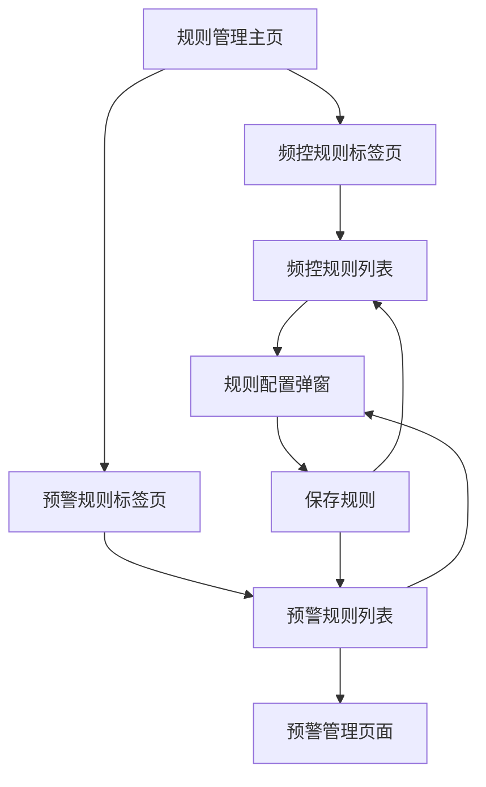

# 全局规则管理系统产品需求文档

## 1. Product Overview

全局规则管理系统是一个统一的规则配置和管理平台，整合了频控规则和预警规则的管理功能。系统通过分标签页的方式提供清晰的规则分类管理，支持规则的创建、编辑、启用/禁用等操作，并与预警管理页面实现联动跳转。

- 解决当前规则管理分散、预警规则重复配置的问题，为运营人员提供统一的规则管理入口
- 提升规则管理效率，降低系统维护成本，增强用户体验

## 2. Core Features

### 2.1 User Roles

| Role | Registration Method | Core Permissions |
|------|---------------------|------------------|
| 运营管理员 | 系统内部账号登录 | 可创建、编辑、删除所有类型规则，查看规则执行状态 |
| 业务运营 | 系统内部账号登录 | 可创建、编辑频控规则和预警规则，查看规则状态 |
| 只读用户 | 系统内部账号登录 | 仅可查看规则配置和状态，无编辑权限 |

### 2.2 Feature Module

我们的全局规则管理系统包含以下主要页面：

1. **规则管理主页**：标签页导航、规则列表展示、搜索筛选功能
2. **频控规则管理**：频控规则的创建、编辑、查看、启用/禁用操作
3. **预警规则管理**：预警规则的创建、编辑、查看、启用/禁用操作，支持跳转到预警管理页
4. **规则配置弹窗**：统一的规则创建和编辑界面

### 2.3 Page Details

| Page Name | Module Name | Feature description |
|-----------|-------------|---------------------|
| 规则管理主页 | 标签页导航 | 提供频控规则和预警规则两个标签页切换，显示当前激活的标签页内容 |
| 规则管理主页 | 搜索筛选区域 | 支持按规则名称、类型、状态进行搜索和筛选，提供重置功能 |
| 规则管理主页 | 操作工具栏 | 提供新增规则按钮，批量操作功能（启用、禁用、删除） |
| 频控规则管理 | 规则列表 | 展示频控规则列表，包含规则名称、类型、描述、优先级、状态、操作按钮 |
| 频控规则管理 | 规则操作 | 支持编辑、查看、删除、启用/禁用规则，提供状态切换开关 |
| 预警规则管理 | 规则列表 | 展示预警规则列表，包含规则名称、监控类型、触发条件、通知渠道、状态 |
| 预警规则管理 | 规则操作 | 支持编辑、查看、删除、启用/禁用规则，激活规则显示"查看预警"链接 |
| 预警规则管理 | 预警管理跳转 | 激活的预警规则提供跳转到预警管理页的链接，支持直接查看预警详情 |
| 规则配置弹窗 | 基础信息配置 | 配置规则名称、类型、描述、优先级、状态等基础信息 |
| 规则配置弹窗 | 频控规则配置 | 配置频控规则的时间窗口、限制次数、限制范围等参数 |
| 规则配置弹窗 | 预警规则配置 | 配置预警规则的监控类型、触发条件、通知渠道、检查频率等参数 |

## 3. Core Process

### 运营管理员流程
1. 登录系统 → 进入规则管理页面
2. 选择频控规则或预警规则标签页
3. 查看规则列表，使用搜索筛选功能定位目标规则
4. 创建新规则：点击新增按钮 → 填写规则配置 → 保存
5. 编辑规则：点击编辑按钮 → 修改配置 → 保存
6. 管理规则状态：使用状态开关启用/禁用规则
7. 查看预警详情：对于激活的预警规则，点击"查看预警"跳转到预警管理页

### 业务运营流程
1. 登录系统 → 进入规则管理页面
2. 根据业务需求选择对应的规则类型标签页
3. 创建或编辑规则配置
4. 启用规则并监控执行状态
5. 通过预警管理链接查看预警触发情况

## 4. User Interface Design

### 4.1 Design Style

- **主色调**：主色 #165DFF（蓝色），辅助色 #00B42A（绿色）、#FF7D00（橙色）、#F53F3F（红色）
- **按钮样式**：圆角按钮，主要按钮使用填充样式，次要按钮使用线框样式
- **字体**：系统默认字体，标题使用 16px 加粗，正文使用 14px 常规，辅助信息使用 12px
- **布局风格**：卡片式布局，顶部导航 + 标签页 + 内容区域的层级结构
- **图标风格**：使用 Arco Design 图标库，线性风格，统一的视觉语言

### 4.2 Page Design Overview

| Page Name | Module Name | UI Elements |
|-----------|-------------|-------------|
| 规则管理主页 | 页面标题区域 | 大标题"规则管理"，副标题描述，右侧操作按钮区域 |
| 规则管理主页 | 标签页导航 | 水平标签页，"频控规则"和"预警规则"两个标签，激活状态高亮显示 |
| 规则管理主页 | 搜索筛选区域 | 水平表单布局，输入框和下拉选择器，查询和重置按钮 |
| 频控规则管理 | 规则列表表格 | 斑马纹表格，状态列使用开关组件，操作列使用文字按钮 |
| 预警规则管理 | 规则列表表格 | 斑马纹表格，监控类型使用标签显示，激活规则显示跳转链接 |
| 规则配置弹窗 | 表单布局 | 垂直表单布局，标签右对齐，必填项标红星号，底部确认取消按钮 |

### 4.3 Responsiveness

产品采用桌面优先设计，支持响应式适配：
- 桌面端（≥1200px）：完整功能展示，表格显示所有列
- 平板端（768px-1199px）：适当调整表格列宽，隐藏次要信息列
- 移动端（<768px）：表格转为卡片式布局，操作按钮收缩为下拉菜单
- 支持触摸交互优化，按钮和链接区域增大点击范围