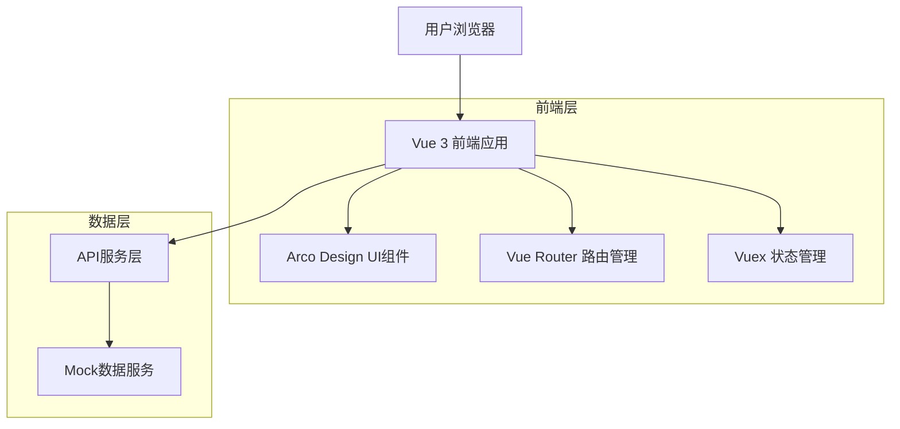
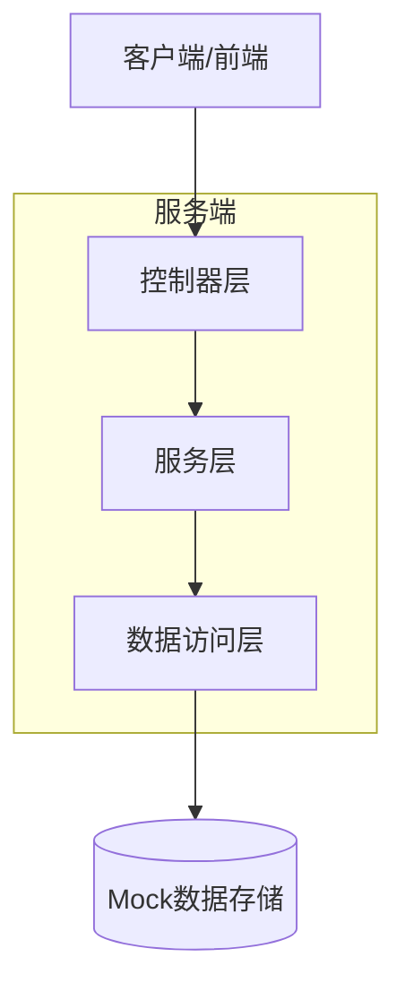
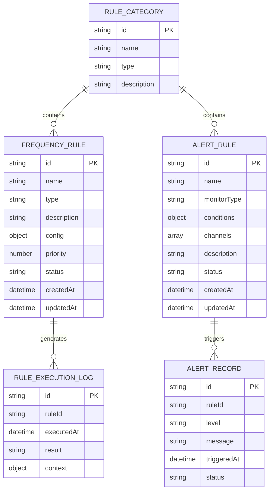

# 全局规则管理系统技术架构文档

## 1. Architecture design



## 2. Technology Description

- Frontend: Vue@3 (Composition API) + Arco Design + Vue Router + Vuex + Vite
- Backend: Mock数据服务（开发阶段）

## 3. Route definitions

| Route | Purpose |
|-------|---------|
| /marketing/global/rules | 规则管理主页，包含频控规则和预警规则的标签页切换 |
| /marketing/alert/management | 预警管理页面，显示激活的预警规则和预警详情 |
| /marketing/alert/rules | 预警规则配置页面（将被整合到规则管理主页） |

## 4. API definitions

### 4.1 Core API

频控规则管理相关
```
GET /api/frequency-rules
```

Request:
| Param Name| Param Type  | isRequired  | Description |
|-----------|-------------|-------------|-------------|
| page      | number      | false       | 页码，默认1 |
| pageSize  | number      | false       | 每页数量，默认10 |
| search    | string      | false       | 搜索关键词 |
| type      | string      | false       | 规则类型筛选 |
| status    | string      | false       | 状态筛选 |

Response:
| Param Name| Param Type  | Description |
|-----------|-------------|-------------|
| success   | boolean     | 请求是否成功 |
| data      | object      | 响应数据 |
| data.list | array       | 规则列表 |
| data.total| number      | 总数量 |

```
POST /api/frequency-rules
```

Request:
| Param Name| Param Type  | isRequired  | Description |
|-----------|-------------|-------------|-------------|
| name      | string      | true        | 规则名称 |
| type      | string      | true        | 规则类型 |
| description| string     | false       | 规则描述 |
| config    | object      | true        | 规则配置参数 |
| priority  | number      | false       | 优先级，默认1 |
| status    | string      | false       | 状态，默认active |

预警规则管理相关
```
GET /api/alert-rules
```

Request:
| Param Name| Param Type  | isRequired  | Description |
|-----------|-------------|-------------|-------------|
| page      | number      | false       | 页码，默认1 |
| pageSize  | number      | false       | 每页数量，默认10 |
| search    | string      | false       | 搜索关键词 |
| monitorType| string     | false       | 监控类型筛选 |
| status    | string      | false       | 状态筛选 |

```
POST /api/alert-rules
```

Request:
| Param Name| Param Type  | isRequired  | Description |
|-----------|-------------|-------------|-------------|
| name      | string      | true        | 规则名称 |
| monitorType| string     | true        | 监控类型 |
| conditions| object      | true        | 触发条件配置 |
| channels  | array       | true        | 通知渠道列表 |
| description| string     | false       | 规则描述 |
| status    | string      | false       | 状态，默认active |

规则状态管理
```
PUT /api/rules/{ruleId}/status
```

Request:
| Param Name| Param Type  | isRequired  | Description |
|-----------|-------------|-------------|-------------|
| status    | string      | true        | 新状态值（active/inactive） |

Example
```json
{
  "name": "用户发券频控规则",
  "type": "frequency_control",
  "description": "限制单用户每日发券次数",
  "config": {
    "timeWindow": "1d",
    "maxCount": 5,
    "scope": "user"
  },
  "priority": 10,
  "status": "active"
}
```

## 5. Server architecture diagram



## 6. Data model

### 6.1 Data model definition



### 6.2 Data Definition Language

频控规则表 (frequency_rules)
```sql
-- 创建频控规则表
CREATE TABLE frequency_rules (
    id VARCHAR(36) PRIMARY KEY DEFAULT (UUID()),
    name VARCHAR(255) NOT NULL,
    type VARCHAR(50) NOT NULL,
    description TEXT,
    config JSON NOT NULL,
    priority INT DEFAULT 1,
    status VARCHAR(20) DEFAULT 'active' CHECK (status IN ('active', 'inactive')),
    created_at TIMESTAMP DEFAULT CURRENT_TIMESTAMP,
    updated_at TIMESTAMP DEFAULT CURRENT_TIMESTAMP ON UPDATE CURRENT_TIMESTAMP
);

-- 创建索引
CREATE INDEX idx_frequency_rules_type ON frequency_rules(type);
CREATE INDEX idx_frequency_rules_status ON frequency_rules(status);
CREATE INDEX idx_frequency_rules_priority ON frequency_rules(priority DESC);

-- 初始化数据
INSERT INTO frequency_rules (name, type, description, config, priority, status) VALUES
('用户发券频控', 'user_coupon_limit', '限制单用户每日发券次数', '{"timeWindow": "1d", "maxCount": 5, "scope": "user"}', 10, 'active'),
('IP发券频控', 'ip_coupon_limit', '限制单IP每小时发券次数', '{"timeWindow": "1h", "maxCount": 10, "scope": "ip"}', 8, 'active'),
('设备发券频控', 'device_coupon_limit', '限制单设备每日发券次数', '{"timeWindow": "1d", "maxCount": 3, "scope": "device"}', 9, 'active');
```

预警规则表 (alert_rules)
```sql
-- 创建预警规则表
CREATE TABLE alert_rules (
    id VARCHAR(36) PRIMARY KEY DEFAULT (UUID()),
    name VARCHAR(255) NOT NULL,
    monitor_type VARCHAR(50) NOT NULL,
    conditions JSON NOT NULL,
    channels JSON NOT NULL,
    description TEXT,
    status VARCHAR(20) DEFAULT 'active' CHECK (status IN ('active', 'inactive')),
    created_at TIMESTAMP DEFAULT CURRENT_TIMESTAMP,
    updated_at TIMESTAMP DEFAULT CURRENT_TIMESTAMP ON UPDATE CURRENT_TIMESTAMP
);

-- 创建索引
CREATE INDEX idx_alert_rules_monitor_type ON alert_rules(monitor_type);
CREATE INDEX idx_alert_rules_status ON alert_rules(status);
CREATE INDEX idx_alert_rules_created_at ON alert_rules(created_at DESC);

-- 初始化数据
INSERT INTO alert_rules (name, monitor_type, conditions, channels, description, status) VALUES
('券库存不足预警', 'coupon_inventory', '{"threshold": 100, "type": "absolute"}', '["email", "sms"]', '监控券库存数量，低于阈值时预警', 'active'),
('券包过期预警', 'coupon_package', '{"days": 7, "type": "expiry"}', '["email"]', '监控券包过期时间，提前7天预警', 'active'),
('核销失败率预警', 'coupon_instance_lifecycle', '{"failureRate": 10, "timeWindow": "1h"}', '["webhook"]', '监控券核销失败率，超过10%时预警', 'active');
```

规则执行日志表 (rule_execution_logs)
```sql
-- 创建规则执行日志表
CREATE TABLE rule_execution_logs (
    id VARCHAR(36) PRIMARY KEY DEFAULT (UUID()),
    rule_id VARCHAR(36) NOT NULL,
    rule_type VARCHAR(50) NOT NULL,
    executed_at TIMESTAMP DEFAULT CURRENT_TIMESTAMP,
    result VARCHAR(20) NOT NULL,
    context JSON,
    INDEX idx_rule_execution_logs_rule_id (rule_id),
    INDEX idx_rule_execution_logs_executed_at (executed_at DESC)
);
```