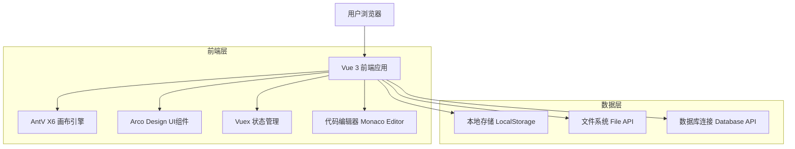
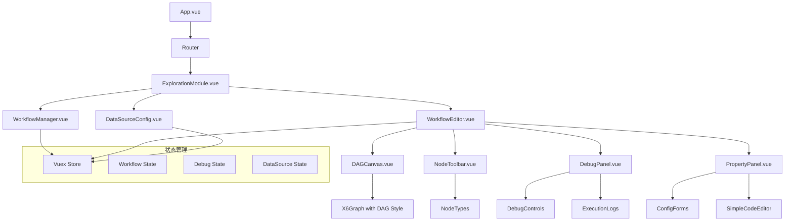

# 分析流程可视化编辑工具技术架构文档

## 1.Architecture design



## 2. 技术描述

* 前端：Vue 3 (Composition API) + AntV X6 + Arco Design + Vite + TypeScript + Monaco Editor

* 后端：无（纯前端应用）

* 数据存储：LocalStorage + File API

* 代码执行：浏览器内JavaScript执行（模拟SQL和Python）

## 3. 路由定义

| 路由                        | 用途                          |
| ------------------------- | --------------------------- |
| /exploration              | 数据探索模块主页                    |
| /exploration/workflows    | 流程管理面板，管理所有分析流程             |
| /exploration/workflow/create | 创建新流程页面                     |
| /exploration/workflow/:id/edit | 流程编辑画布，集成调试功能的拖拽式画布编辑器      |
| /exploration/datasources  | 数据源配置页面，文件上传和数据库配置          |

## 4. 数据结构定义

### 4.1 核心数据类型

**工作流定义**

```typescript
interface Workflow {
  id: string;
  name: string;
  description?: string;
  status: 'draft' | 'published';
  nodes: WorkflowNode[];
  edges: WorkflowEdge[];
  debugConfig?: DebugConfig;
  createdAt: Date;
  updatedAt: Date;
}

interface WorkflowNode {
  id: string;
  type: 'datasource' | 'sql' | 'python';
  position: { x: number; y: number };
  data: {
    label: string;
    config: NodeConfig;
  };
  debugInfo?: {
    status: 'idle' | 'running' | 'success' | 'error' | 'breakpoint';
    output?: any;
    error?: string;
    executionTime?: number;
  };
}

interface WorkflowEdge {
  id: string;
  source: string;
  target: string;
}
```

**节点配置**

```typescript
interface DataSourceConfig {
  type: 'file' | 'database';
  fileData?: {
    fileName: string;
    content: string;
  };
  databaseData?: {
    host: string;
    port: number;
    database: string;
    table: string;
  };
}

interface SqlConfig {
  query: string;
}

interface PythonConfig {
  script: string;
}

interface DebugConfig {
  mode: 'step' | 'full';
  breakpoints: string[]; // node ids
  autoSave: boolean;
}

// 节点测试结果
interface NodeTestResult {
  success: boolean;
  output?: any;
  error?: string;
  executionTime?: number;
  timestamp: Date;
}

// 流程执行状态
interface FlowExecutionState {
  status: 'idle' | 'running' | 'completed' | 'failed';
  currentNodeId?: string;
  executionLog: string[];
  startTime?: Date;
  endTime?: Date;
}

type NodeConfig = DataSourceConfig | SqlConfig | PythonConfig;
```

## 5. 前端组件架构



### 5.1 核心组件说明

| 组件名称 | 功能描述 |
|---------|----------|
| FlowCanvas | 基于AntV X6的DAG画布组件，支持节点拖拽、连接、缩放等操作 |
| NodeEditor | 节点配置编辑器，支持数据源配置、SQL/Python代码编辑，内置测试功能 |
| NodeTestRunner | 节点内置测试组件，用于单独验证节点脚本的有效性 |
| FlowDebugger | 全流程调试组件，支持完整流程的执行和状态监控 |
| FileUploader | 文件上传组件，支持CSV等格式的数据文件上传 |
| DatabaseConnector | 数据库连接配置组件，支持多种数据库类型 |
| CodeEditor | 基础代码编辑器，提供语法提示功能 |

### 5.2 节点内置测试功能设计

**交互方式：**
- 节点悬停时显示测试按钮图标
- 点击测试按钮触发单节点脚本执行
- 测试结果通过模态框或抽屉组件展示
- 支持测试结果的数据表格预览和错误信息显示

**实现逻辑：**
```typescript
// 节点测试执行器
class NodeTestExecutor {
  async executeNodeTest(node: FlowNode): Promise<NodeTestResult> {
    try {
      // 根据节点类型执行相应的测试逻辑
      const result = await this.runNodeScript(node);
      return {
        success: true,
        output: result,
        executionTime: Date.now() - startTime,
        timestamp: new Date()
      };
    } catch (error) {
      return {
        success: false,
        error: error.message,
        executionTime: Date.now() - startTime,
        timestamp: new Date()
      };
    }
  }
}
```

## 6. 本地存储结构

### 6.1 LocalStorage 数据结构

```typescript
// 工作流列表
interface WorkflowStorage {
  workflows: Workflow[];
  currentWorkflowId?: string;
  debugSessions: DebugSession[];
}

interface DebugSession {
  workflowId: string;
  sessionId: string;
  startTime: Date;
  logs: DebugLog[];
  currentNodeId?: string;
}

interface DebugLog {
  timestamp: Date;
  nodeId: string;
  level: 'info' | 'warn' | 'error' | 'debug';
  message: string;
  data?: any;
}

// 数据源配置
interface DataSourceStorage {
  dataSources: {
    files: FileDataSource[];
    databases: DatabaseConnection[];
  };
}

// 应用设置
interface AppSettings {
  theme: 'light' | 'dark';
  language: 'zh-CN' | 'en-US';
  canvasSettings: {
    gridSize: number;
    snapToGrid: boolean;
  };
}
```

### 6.2 存储键名约定

- `workflow_storage`: 工作流数据和状态
- `datasource_storage`: 数据源配置
- `debug_storage`: 调试会话和日志
- `app_settings`: 应用设置
- `temp_files`: 临时文件数据
- `execution_cache`: 节点执行结果缓存

