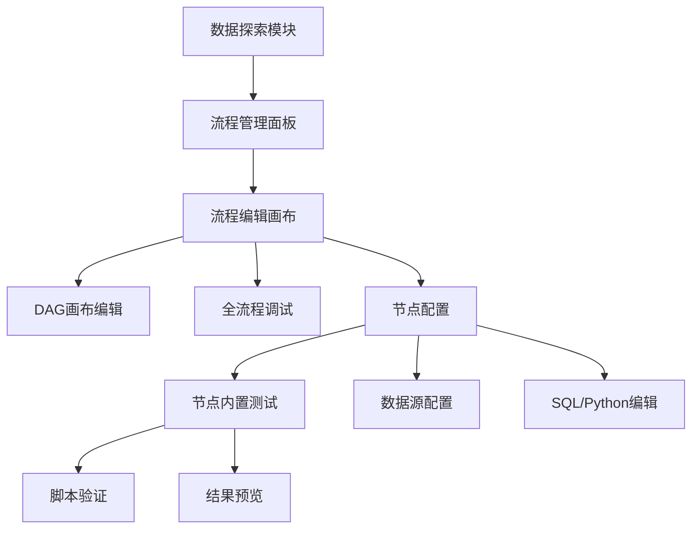

# 分析流程可视化编辑工具需求文档

**文档版本：** v2.0  
**最后更新：** 2025-01-21  
**更新内容：** 补充数据输出节点详细描述，添加最新工作流编辑器优化内容，校验功能实现状态

## 版本历史

| 版本 | 日期 | 更新内容 | 更新人 |
|------|------|----------|--------|
| v2.0 | 2025-01-21 | 补充数据输出节点，添加v2.0优化内容，功能实现状态校验 | SOLO Document |
| v1.0 | 2024-12-19 | 初始需求文档创建，定义基础功能和技术架构 | 产品团队 |

## 1. 产品概述

分析流程可视化编辑工具是一个集成在数据探索模块下的前端demo样例，基于Vue 3和AntV X6构建的数据分析流程设计界面。参考AntV X6数据加工DAG图的实现方式，用户可以通过拖拽式画布创建简单的数据处理流程，支持文件上传和数据库连接作为数据源，使用SQL和Python进行数据处理。

* 作为数据探索模块的子功能，展示可视化流程编辑器的核心功能和交互体验。

* 面向数据分析师和开发者，用于快速构建和调试数据处理流程。

* 产品价值在于提供一个轻量级的流程编辑和调试环境，简化数据处理流程的开发过程。

## 2. 核心功能

### 2.1 用户角色

本demo项目不涉及用户权限管理，所有功能对所有用户开放。

### 2.2 功能模块

我们的分析流程可视化编辑工具demo包含以下主要页面：

1. **流程管理面板**：展示已创建的分析流程、基本的增删改查操作
2. **流程编辑画布**：参考AntV X6数据加工DAG图的拖拽式画布编辑器、集成调试功能、节点配置面板
3. **数据源配置**：文件上传界面、数据库连接配置

### 2.3 页面详情

| 页面名称   | 模块名称     | 功能描述                                    |
| ------ | -------- | --------------------------------------- |
| 流程管理面板 | 流程管理     | 创建、删除、重命名流程，显示流程基本信息和状态                 |
| 流程管理面板 | 搜索筛选     | 按名称搜索流程，按状态筛选（草稿、已发布）                   |
| 流程编辑画布 | DAG画布编辑器 | 参考AntV X6数据加工DAG图，拖拽节点、连接线条、画布缩放平移、网格对齐 |
| 流程编辑画布 | 节点配置面板   | 配置数据源（文件上传/数据库）、SQL查询、Python脚本，基础语法提示   |
| 流程编辑画布 | 节点内置调试   | 每个节点内置测试运行功能，用于验证分析脚本有效性，显示执行结果和错误信息    |
| 流程编辑画布 | 全流程调试    | 画布层面的完整流程执行、实时状态显示、调试日志                 |
| 流程编辑画布 | 简化工具栏    | 保存流程、撤销重做、清空画布、发布状态切换                   |
| 数据源配置  | 文件上传     | 支持CSV等文件格式上传、文件预览、数据格式检查                |
| 数据源配置  | 数据库连接    | 配置数据库连接参数、测试连接、表结构预览                    |

## 3. 核心流程

**主要用户操作流程：**

1. **流程创建流程**：数据探索模块 → 流程管理面板 → 创建新流程 → 进入编辑画布
2. **流程编辑流程**：拖拽数据源节点 → 配置数据连接（文件上传或数据库） → 添加处理节点 → 编写SQL/Python（基础语法提示） → 连接节点 → 保存流程
3. **节点测试流程**：选择节点 → 点击节点内置测试按钮 → 查看执行结果和错误信息 → 修改脚本配置 → 重新测试
4. **全流程调试**：配置完所有节点 → 执行完整流程 → 查看整体执行状态 → 优化流程配置
5. **发布流程**：调试完成 → 状态切换为已发布 → 流程可用于生产环境

## 4. 用户界面设计

### 4.1 设计风格

* **主色调**：科技蓝 (#1890FF) 和深灰色 (#2F3349)

* **辅助色**：成功绿 (#52C41A)、警告橙 (#FA8C16)、错误红 (#FF4D4F)

* **按钮样式**：圆角按钮，基本的悬停效果

* **字体**：系统默认字体，标题 16-18px，正文 14px

* **布局风格**：简洁的顶部导航 + 主内容区域

* **图标风格**：使用 Arco Design 图标库

* **节点测试交互**：节点悬停显示测试按钮，点击弹出测试结果模态框，支持数据表格预览和错误信息展示

### 4.2 页面设计概览

| 页面名称   | 模块名称    | UI元素                                |
| ------ | ------- | ----------------------------------- |
| 流程管理面板 | 导航面板    | 数据探索模块下的子导航，流程管理标题和基本操作按钮           |
| 流程管理面板 | 流程列表    | 表格列表，显示流程名称、状态（草稿/已发布）、创建时间、操作按钮    |
| 流程编辑画布 | DAG画布区域 | 参考AntV X6数据加工DAG图，白色背景、网格、左右滑动控制、节点连线（仅支持从左到右） |
| 流程编辑画布 | 节点工具栏   | 左侧工具栏，简化节点类型（数据输入、数据处理、数据输出）        |
| 流程编辑画布 | 调试控制面板  | 顶部调试工具栏，调试模式切换、执行按钮、状态指示器、日志面板      |
| 流程编辑画布 | 节点配置面板  | 右侧配置面板，表单控件、基础代码编辑器（仅语法提示，无自动补全）    |
| 流程编辑画布 | 节点内置测试  | 节点内测试按钮（悬停显示），测试结果弹窗，错误信息提示，数据预览表格  |
| 流程编辑画布 | 状态显示    | 节点执行状态（等待、运行中、成功、失败）、连线状态、调试信息      |
| 数据源配置  | 文件上传区域  | 拖拽上传区域、文件列表、数据预览、格式验证               |
| 数据源配置  | 数据库配置区域 | 连接表单、测试按钮、表结构展示、连接状态指示              |

### 4.3 响应式设计

* **桌面优先**：主要针对 1920x1080 分辨率设计

* **最小宽度**：1024px，不考虑移动端适配

## 5. 技术需求补充

### 5.1 节点类型定义

**数据输入节点：**

* CSV文件上传节点：支持文件拖拽上传、基本格式验证、数据预览、调试时显示数据样本

* 数据库表节点：支持MySQL、PostgreSQL等数据库连接配置、表结构预览、调试时显示查询结果

**数据处理节点：**

* SQL查询节点：基础代码编辑器、语法高亮、基础语法提示（无自动补全）、调试时显示执行结果

* Python脚本节点：基础代码编辑器、语法高亮、基础语法提示（无自动补全）、支持pandas操作、调试时显示变量状态

**数据输出节点：**

* 数据导出节点：支持多种输出格式（CSV、JSON、Excel等）、数据预览、导出配置、调试时显示输出结果
* 数据库写入节点：支持将处理结果写入数据库、表结构映射、写入模式配置（插入/更新/覆盖）
* API输出节点：支持将数据通过API接口输出、请求配置、响应处理、调试时显示API调用结果

 

### 5.2 调试和执行要求

**调试功能（集成在画布中）：**

* 分节点调试：单步执行，可在任意节点设置断点，查看节点输入输出数据

* 全流程调试：完整执行整个流程，实时显示各节点执行状态

* 调试状态显示：节点状态指示（等待、运行中、成功、失败、断点）

* 调试日志：实时显示执行日志、错误信息、数据统计

**执行控制：**

* 支持暂停、继续、停止调试

* 支持重新执行单个节点或整个流程

* 基本的错误处理和异常捕获

### 5.3 发布和存储

**发布功能（简化）：**

* 发布仅为状态变更：草稿 → 已发布

* 已发布流程不可编辑，需要创建新版本或回退到草稿状态

* 简单的版本标识，无复杂的版本管理

**数据存储：**

* 使用浏览器本地存储保存流程配置和状态

* 上传的文件临时存储在浏览器中

* 调试结果和日志临时缓存

* 不涉及服务端数据持久化

## 6. 技术实现要点

### 6.1 AntV X6 DAG图参考实现

**画布实现参考：**

* 基于AntV X6数据加工DAG图的节点和连线样式

* 支持节点拖拽、自动对齐、连线规则验证

* 实现节点状态的可视化反馈（颜色、图标变化）

* 支持画布平移、框选等基础交互，禁用缩放功能，仅支持左右滑动

### 6.2 编辑器简化要求

**代码编辑器配置：**

* 使用Monaco Editor或类似轻量级编辑器

* 仅提供基础语法高亮和语法提示

* 禁用自动补全、智能提示等高级功能

* 支持基础的代码格式化和错误标记

### 6.3 模块集成

**数据探索模块集成：**

* 作为数据探索模块的子功能页面

* 共享数据探索模块的导航和布局

* 可以引用数据探索模块中的数据源配置

* 与其他数据分析工具保持一致的用户体验

### 6.4 性能和限制

**功能限制：**

* 单个流程最多支持50个节点

* 文件上传限制在100MB以内

* 调试时数据预览限制在1000行

* 本地存储限制在10MB以内

## 7. 最新优化内容（v2.0）

### 7.1 节点类型简化

**已实现功能：**
* 将原有复杂节点类型简化为3种基础类型：
  - 数据输入节点（INPUT）：作为工作流起始点
  - 数据处理节点（PROCESSING）：支持Python和SQL两种子类型
  - 数据输出节点（OUTPUT）：作为工作流结束点
* 每种节点类型都有独特的图标和颜色标识
* 支持节点名称自定义编辑（数据处理节点）

### 7.2 画布交互优化

**已实现功能：**
* 禁用画布缩放功能，简化用户操作
* 支持左右滑动查看长流程
* 强制从左到右的节点连接规则
* 优化网格显示和节点对齐

### 7.3 调试功能增强

**已实现功能：**
* 节点级调试：支持单个节点的输入输出调试
* 全流程调试：支持完整工作流的执行和状态监控
* 实时状态显示：节点执行状态可视化反馈
* 详细调试日志：显示执行过程和错误信息

### 7.4 用户体验改进

**已实现功能：**
* 简化的节点创建流程
* 直观的节点配置界面
* 优化的错误提示和验证
* 响应式的界面布局

## 8. 功能实现状态校验

### 8.1 已实现功能

✅ **核心画布功能**
- 基于AntV X6的DAG画布
- 节点拖拽和连接
- 网格对齐和视觉反馈
- 禁用缩放，支持左右滑动
- 从左到右连接限制

✅ **节点管理**
- 3种简化节点类型
- 节点创建和删除
- 节点属性配置
- 数据处理节点名称编辑

✅ **调试功能**
- 节点级调试
- 全流程调试
- 状态可视化
- 调试日志

✅ **基础工具**
- 撤销/重做
- 保存/加载
- 工作流管理

### 8.2 待实现功能

🔄 **数据源集成**
- 文件上传功能（部分实现）
- 数据库连接配置
- 数据预览和验证

🔄 **代码编辑器**
- Monaco Editor集成
- 语法高亮和提示
- 代码格式化

🔄 **输出功能**
- 多格式数据导出
- 数据库写入
- API输出接口

🔄 **发布和版本管理**
- 流程发布功能
- 版本控制
- 状态管理

### 8.3 优先级建议

**高优先级（核心功能）：**
1. 完善数据源配置界面
2. 集成Monaco代码编辑器
3. 实现基础的数据导出功能

**中优先级（增强功能）：**
1. 数据库连接和写入
2. 流程发布和版本管理
3. API输出接口

**低优先级（扩展功能）：**
1. 高级调试功能
2. 性能优化
3. 用户权限管理

## 9. 验收标准更新

### 9.1 功能验收

**基础功能：**
- [ ] 能够创建包含3种节点类型的完整工作流
- [ ] 节点连接遵循从左到右规则
- [ ] 画布支持左右滑动，禁用缩放
- [ ] 数据处理节点支持名称编辑
- [ ] 调试功能能够显示节点输入输出

**数据处理：**
- [ ] Python节点能够执行基础脚本
- [ ] SQL节点能够执行查询语句
- [ ] 数据在节点间正确传递

**用户体验：**
- [ ] 界面响应流畅，无明显卡顿
- [ ] 错误提示清晰准确
- [ ] 操作逻辑符合用户直觉

### 9.2 技术验收

**代码质量：**
- [ ] 代码符合Vue 3 + TypeScript规范
- [ ] 组件结构清晰，职责分离
- [ ] 错误处理完善

**性能要求：**
- [ ] 支持50个节点的流程编辑
- [ ] 画布操作响应时间<100ms
- [ ] 内存使用控制在合理范围

**测试覆盖：**
- [ ] 单元测试覆盖率>80%
- [ ] 集成测试覆盖核心流程
- [ ] 端到端测试验证用户场景

