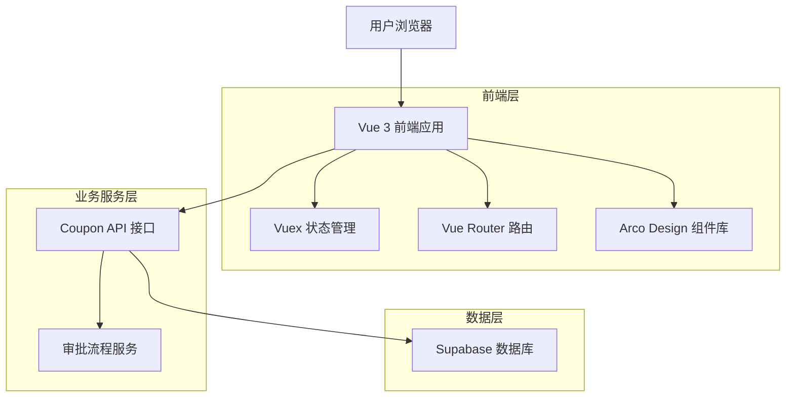
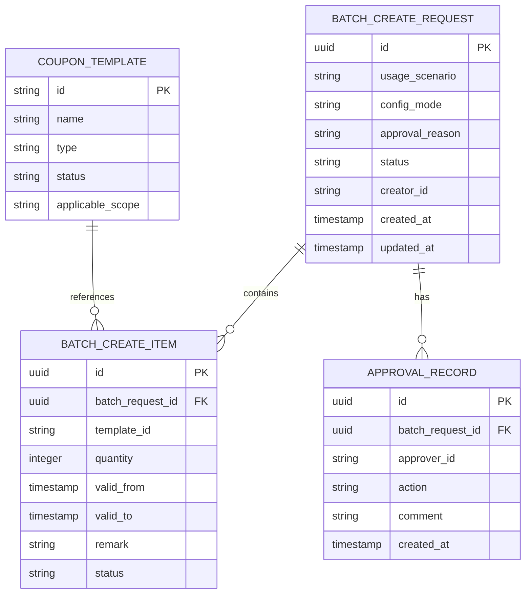

# 券库存批量创建功能优化技术架构文档

## 1. 架构设计



## 2. 技术描述
- **前端框架**：Vue 3 (Composition API) + TypeScript + Vite
- **UI组件库**：Arco Design Vue
- **状态管理**：Vuex 4
- **路由管理**：Vue Router 4
- **构建工具**：Vite
- **数据存储**：Supabase (PostgreSQL)

## 3. 路由定义

| 路由 | 用途 |
|------|------|
| /marketing/benefit/management | 券库存管理主页，包含批量创建入口 |
| /marketing/benefit/management/batch-create | 优化后的单页面批量创建页面 |
| /marketing/benefit/management/approval | 审批管理页面 |
| /marketing/benefit/management/history | 创建历史页面 |

## 4. API 定义

### 4.1 核心 API

**券模版搜索接口**
```
GET /api/coupon/templates/search
```

请求参数：
| 参数名 | 参数类型 | 是否必需 | 描述 |
|--------|----------|----------|------|
| keyword | string | false | 搜索关键词 |
| status | string | false | 模版状态筛选 |
| page | number | false | 页码，默认1 |
| pageSize | number | false | 每页数量，默认20 |

响应：
| 参数名 | 参数类型 | 描述 |
|--------|----------|------|
| success | boolean | 请求是否成功 |
| data | object | 响应数据 |
| data.list | array | 券模版列表 |
| data.total | number | 总数量 |

**批量创建券库存接口**
```
POST /api/coupon/inventory/batch-create
```

请求参数：
| 参数名 | 参数类型 | 是否必需 | 描述 |
|--------|----------|----------|------|
| usageScenario | string | true | 使用场景：batch_distribute/telesales |
| configMode | string | true | 配置模式：unified/individual |
| templates | array | true | 券模版配置列表 |
| approvalReason | string | true | 审批申请理由 |

请求示例：
```json
{
  "usageScenario": "batch_distribute",
  "configMode": "individual",
  "templates": [
    {
      "templateId": "TPL001",
      "quantity": 1000,
      "validFrom": "2024-01-01 00:00:00",
      "validTo": "2024-12-31 23:59:59",
      "remark": "春节活动券"
    }
  ],
  "approvalReason": "春节营销活动需要"
}
```

**获取批量创建历史接口**
```
GET /api/coupon/inventory/batch-history
```

请求参数：
| 参数名 | 参数类型 | 是否必需 | 描述 |
|--------|----------|----------|------|
| status | string | false | 状态筛选 |
| startDate | string | false | 开始时间 |
| endDate | string | false | 结束时间 |
| page | number | false | 页码 |
| pageSize | number | false | 每页数量 |

## 5. 数据模型

### 5.1 数据模型定义



### 5.2 数据定义语言

**批量创建申请表 (batch_create_requests)**
```sql
-- 创建表
CREATE TABLE batch_create_requests (
    id UUID PRIMARY KEY DEFAULT gen_random_uuid(),
    usage_scenario VARCHAR(50) NOT NULL CHECK (usage_scenario IN ('batch_distribute', 'telesales')),
    config_mode VARCHAR(20) NOT NULL CHECK (config_mode IN ('unified', 'individual')),
    approval_reason TEXT NOT NULL,
    status VARCHAR(20) DEFAULT 'pending' CHECK (status IN ('pending', 'approved', 'rejected', 'processing', 'completed', 'failed')),
    creator_id VARCHAR(100) NOT NULL,
    created_at TIMESTAMP WITH TIME ZONE DEFAULT NOW(),
    updated_at TIMESTAMP WITH TIME ZONE DEFAULT NOW()
);

-- 创建索引
CREATE INDEX idx_batch_create_requests_creator ON batch_create_requests(creator_id);
CREATE INDEX idx_batch_create_requests_status ON batch_create_requests(status);
CREATE INDEX idx_batch_create_requests_created_at ON batch_create_requests(created_at DESC);

-- 权限设置
GRANT SELECT ON batch_create_requests TO anon;
GRANT ALL PRIVILEGES ON batch_create_requests TO authenticated;
```

**批量创建项目表 (batch_create_items)**
```sql
-- 创建表
CREATE TABLE batch_create_items (
    id UUID PRIMARY KEY DEFAULT gen_random_uuid(),
    batch_request_id UUID NOT NULL REFERENCES batch_create_requests(id) ON DELETE CASCADE,
    template_id VARCHAR(50) NOT NULL,
    quantity INTEGER NOT NULL CHECK (quantity > 0),
    valid_from TIMESTAMP WITH TIME ZONE NOT NULL,
    valid_to TIMESTAMP WITH TIME ZONE NOT NULL,
    remark TEXT,
    status VARCHAR(20) DEFAULT 'pending' CHECK (status IN ('pending', 'success', 'failed')),
    created_at TIMESTAMP WITH TIME ZONE DEFAULT NOW()
);

-- 创建索引
CREATE INDEX idx_batch_create_items_batch_request ON batch_create_items(batch_request_id);
CREATE INDEX idx_batch_create_items_template ON batch_create_items(template_id);

-- 权限设置
GRANT SELECT ON batch_create_items TO anon;
GRANT ALL PRIVILEGES ON batch_create_items TO authenticated;
```

**审批记录表 (approval_records)**
```sql
-- 创建表
CREATE TABLE approval_records (
    id UUID PRIMARY KEY DEFAULT gen_random_uuid(),
    batch_request_id UUID NOT NULL REFERENCES batch_create_requests(id) ON DELETE CASCADE,
    approver_id VARCHAR(100) NOT NULL,
    action VARCHAR(20) NOT NULL CHECK (action IN ('approve', 'reject', 'request_change')),
    comment TEXT,
    created_at TIMESTAMP WITH TIME ZONE DEFAULT NOW()
);

-- 创建索引
CREATE INDEX idx_approval_records_batch_request ON approval_records(batch_request_id);
CREATE INDEX idx_approval_records_approver ON approval_records(approver_id);

-- 权限设置
GRANT SELECT ON approval_records TO anon;
GRANT ALL PRIVILEGES ON approval_records TO authenticated;
```

**初始化数据**
```sql
-- 插入测试数据
INSERT INTO batch_create_requests (usage_scenario, config_mode, approval_reason, status, creator_id)
VALUES 
  ('batch_distribute', 'unified', '春节营销活动批量创建券库存', 'approved', 'user001'),
  ('telesales', 'individual', '电销团队专用券库存创建', 'pending', 'user002');
```