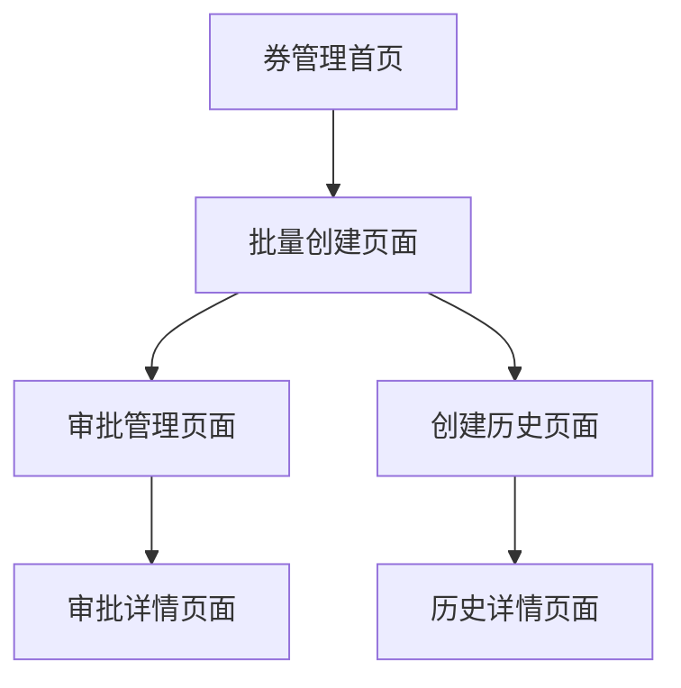

# 券库存批量创建功能优化需求文档

## 1. 产品概述
优化现有的券库存批量创建功能，将复杂的4步骤向导式界面改为简洁直观的单页面列表设计，提升用户操作效率和体验。
- 解决现有步骤式流程操作繁琐、用户需要多次点击才能完成创建的问题
- 面向营销运营人员，提供快速批量创建券库存的高效工具
- 通过简化操作流程，提高券库存创建效率，降低操作门槛

## 2. 核心功能

### 2.1 用户角色
| 角色 | 权限说明 | 核心功能 |
|------|----------|----------|
| 营销运营人员 | 可创建、编辑券库存批量申请 | 批量创建券库存、提交审批申请 |
| 审批人员 | 可审批券库存创建申请 | 审批管理、查看申请详情 |

### 2.2 功能模块
优化后的券库存批量创建包含以下核心页面：
1. **批量创建页面**：单页面列表式设计，支持快速添加券模版和配置
2. **审批管理页面**：查看和处理批量创建申请的审批流程
3. **创建历史页面**：查看历史批量创建记录和状态

### 2.3 页面详情

| 页面名称 | 模块名称 | 功能描述 |
|----------|----------|----------|
| 批量创建页面 | 基础配置区 | 选择使用场景（批量下发/电销使用）、配置模式（统一配置/个别编辑） |
| 批量创建页面 | 券模版列表区 | 动态添加券模版行，支持搜索选择、快速配置库存参数 |
| 批量创建页面 | 操作工具栏 | 添加券模版、批量删除、统一配置、预览提交等操作 |
| 批量创建页面 | 审批申请区 | 填写申请理由、选择审批人、提交审批申请 |
| 审批管理页面 | 申请列表 | 显示待审批、已审批的批量创建申请 |
| 审批管理页面 | 审批详情 | 查看申请详情、审批操作、审批历史 |
| 创建历史页面 | 历史记录 | 查看历史批量创建记录、状态跟踪、结果查看 |

## 3. 核心流程

### 3.1 用户操作流程
1. 用户进入批量创建页面
2. 选择使用场景（批量下发或电销使用）
3. 选择配置模式（统一配置或个别编辑）
4. 通过"添加券模版"按钮快速添加券模版行
5. 为每个券模版配置库存参数（数量、有效期、备注等）
6. 支持统一配置功能，一键应用相同参数到所有券模版
7. 填写审批申请理由并提交
8. 系统自动进入审批流程

### 3.2 页面导航流程图

## 4. 用户界面设计

### 4.1 设计风格
- **主色调**：蓝色系（#1890ff）作为主色，绿色（#52c41a）表示成功状态
- **按钮风格**：圆角按钮，主要操作使用实心按钮，次要操作使用线框按钮
- **字体**：14px 常规字体，标题使用 16px 加粗
- **布局风格**：卡片式布局，清晰的区域划分，顶部工具栏 + 主内容区
- **图标风格**：使用 Arco Design 图标库，简洁线性图标

### 4.2 页面设计概览

| 页面名称 | 模块名称 | UI元素 |
|----------|----------|---------|
| 批量创建页面 | 页面头部 | 面包屑导航、页面标题、返回按钮 |
| 批量创建页面 | 基础配置卡片 | 使用场景单选按钮组、配置模式单选按钮组、帮助提示文本 |
| 批量创建页面 | 工具栏 | 添加券模版按钮（主按钮）、批量删除按钮、统一配置按钮 |
| 批量创建页面 | 券模版列表 | 可编辑表格、行内编辑、删除按钮、券模版选择器 |
| 批量创建页面 | 底部操作区 | 审批申请表单、提交按钮、取消按钮 |
| 审批管理页面 | 筛选区域 | 状态筛选、时间筛选、搜索框 |
| 审批管理页面 | 申请列表 | 数据表格、状态标签、操作按钮 |
| 创建历史页面 | 历史列表 | 数据表格、状态标签、详情链接 |

### 4.3 响应式设计
- **桌面优先**：主要面向桌面端操作，1200px 以上最佳体验
- **平板适配**：768px-1200px 区间，表格列数适当减少，保持核心功能
- **移动端**：小于 768px 时，表格转为卡片式布局，操作按钮堆叠显示