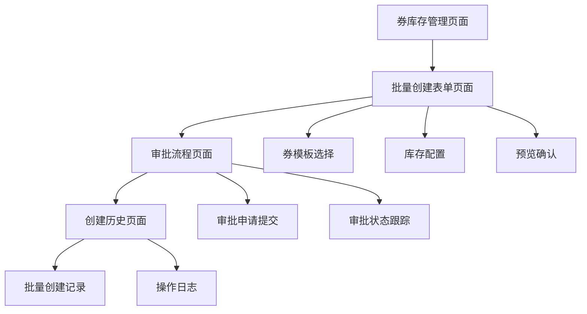

# 券库存批量创建功能需求文档

## 1. 产品概述
为营销画布券库存管理系统新增批量创建券库存功能，支持运营人员一次性创建多个券库存，提高运营效率并通过统一审批流程确保券库存创建的合规性。该功能将显著提升券库存管理的操作效率，减少重复性工作，同时保证审批流程的规范化管理。

## 2. 核心功能

### 2.1 用户角色
| 角色 | 注册方法 | 核心权限 |
|------|----------|----------|
| 运营人员 | 内部账号登录 | 可创建、查看券库存，提交批量创建申请 |
| 审批人员 | 内部账号登录 | 可审批券库存创建申请，查看审批历史 |
| 管理员 | 内部账号登录 | 拥有所有权限，可管理用户角色和系统配置 |

### 2.2 功能模块
券库存批量创建功能包含以下主要页面：
1. **券库存管理页面**：现有库存列表展示，新增批量创建入口
2. **批量创建表单页面**：券模板选择，库存配置，批量操作设置
3. **审批流程页面**：审批申请提交，审批状态跟踪，审批历史查看
4. **创建历史页面**：批量创建记录，操作日志，结果统计

### 2.3 页面详情
| 页面名称 | 模块名称 | 功能描述 |
|----------|----------|----------|
| 券库存管理页面 | 批量创建入口 | 新增"批量创建"按钮，点击进入批量创建流程 |
| 券库存管理页面 | 库存列表展示 | 显示现有券库存，支持筛选查看批量创建的券库存 |
| 批量创建表单页面 | 券模板选择器 | 支持多选券模板，显示模板详情预览 |
| 批量创建表单页面 | 使用场景选择 | 单选模式：批量下发 或 电销使用，不支持混合场景 |
| 批量创建表单页面 | 配置模式切换 | 统一配置模式 或 分别编辑模式的切换开关 |
| 批量创建表单页面 | 统一配置区域 | 统一配置模式下，所有券使用相同的库存数量、有效期等参数 |
| 批量创建表单页面 | 分别编辑区域 | 分别编辑模式下，每个券模板可单独配置不同参数 |
| 批量创建表单页面 | 批量操作设置 | 统一设置创建时间、备注信息、审批说明 |
| 批量创建表单页面 | 配置预览区域 | 展示即将创建的券库存列表，支持编辑和删除 |
| 审批流程页面 | 审批申请提交 | 提交批量创建申请，填写申请理由和预期效果 |
| 审批流程页面 | 审批状态跟踪 | 实时显示审批进度，支持查看审批意见 |
| 审批流程页面 | 审批历史查看 | 查看历史审批记录，支持按时间、状态筛选 |
| 创建历史页面 | 批量创建记录 | 显示所有批量创建操作记录，包含成功和失败记录 |
| 创建历史页面 | 操作日志 | 详细记录每次批量创建的操作步骤和结果 |
| 创建历史页面 | 结果统计 | 统计批量创建的成功率、券库存数量等指标 |

## 3. 功能特性详述

### 3.1 配置模式说明

#### 统一配置模式
- **适用场景**：当所有券需要使用相同配置参数时
- **配置内容**：库存数量、有效期、生效时间等参数统一设置
- **操作方式**：在统一配置区域设置一次参数，自动应用到所有选中的券模板
- **优势**：操作简单快捷，适合大批量相同配置的券创建

#### 分别编辑模式
- **适用场景**：当不同券需要使用不同配置参数时
- **配置内容**：每个券模板可独立设置库存数量、有效期、生效时间等
- **操作方式**：在表格中为每个券模板单独配置参数
- **优势**：配置灵活，满足个性化需求

### 3.2 使用场景限制

#### 批量下发场景
- **定义**：券库存创建后用于系统自动批量发放给用户
- **特点**：通常数量较大，发放规则统一
- **限制**：选择此场景后，所有券只能用于批量下发，不能用于电销

#### 电销使用场景
- **定义**：券库存创建后用于电销人员手动发放给客户
- **特点**：通常数量适中，发放更加精准
- **限制**：选择此场景后，所有券只能用于电销使用，不能用于批量下发

#### 场景互斥性
- 每次批量创建只能选择一种使用场景
- 不支持在同一批次中混合不同使用场景的券
- 场景选择后影响后续的券发放和管理流程

## 4. 核心流程

### 运营人员操作流程
1. 登录系统进入券库存管理页面
2. 点击"批量创建"按钮进入批量创建表单页面
3. 选择券使用场景（批量下发 或 电销使用，单选）
4. 选择需要创建库存的券模板（支持多选）
5. 选择配置模式（统一配置 或 分别编辑）
6. 根据配置模式设置库存参数：
   - 统一配置：所有券使用相同参数（数量、有效期等）
   - 分别编辑：每个券模板单独配置不同参数
7. 设置批量操作的通用参数（创建时间、备注等）
8. 预览确认即将创建的券库存列表
9. 提交审批申请，填写申请理由
10. 等待审批结果，可在审批流程页面跟踪进度

### 审批人员操作流程
1. 登录系统查看待审批的批量创建申请
2. 审查申请详情，包括券模板、库存配置、申请理由
3. 根据业务规则和风险评估做出审批决定
4. 填写审批意见并提交审批结果
5. 系统自动执行批量创建或拒绝申请

## 5. 用户界面设计

### 4.1 设计风格
- **主色调**：#1890ff（蓝色）作为主色，#52c41a（绿色）作为成功状态色
- **辅助色**：#faad14（橙色）作为警告色，#f5222d（红色）作为错误色
- **按钮样式**：圆角按钮设计，主要操作使用实心按钮，次要操作使用线框按钮
- **字体**：系统默认字体，标题使用16px，正文使用14px，辅助信息使用12px
- **布局风格**：卡片式布局，清晰的模块分割，响应式设计适配不同屏幕
- **图标风格**：使用Arco Design图标库，简洁现代的线性图标

### 4.2 页面设计概览
| 页面名称 | 模块名称 | UI元素 |
|----------|----------|---------|
| 券库存管理页面 | 批量创建入口 | 蓝色主按钮，位于页面右上角，图标+文字组合 |
| 批量创建表单页面 | 使用场景选择 | 单选按钮组，批量下发/电销使用，互斥选择 |
| 批量创建表单页面 | 券模板选择器 | 卡片式模板展示，支持多选，选中状态有蓝色边框高亮 |
| 批量创建表单页面 | 配置模式切换 | 开关组件，统一配置/分别编辑模式切换 |
| 批量创建表单页面 | 统一配置区域 | 单一表单区域，所有券共用相同配置参数 |
| 批量创建表单页面 | 分别编辑区域 | 表格形式展示，每行对应一个券模板，独立配置参数 |
| 批量创建表单页面 | 配置预览区域 | 列表形式展示即将创建的券库存，支持编辑和删除操作 |
| 审批流程页面 | 审批状态跟踪 | 步骤条组件显示审批进度，不同状态使用不同颜色标识 |
| 创建历史页面 | 批量创建记录 | 表格展示，支持分页和筛选，状态列使用标签组件 |

### 4.3 响应式设计
产品采用桌面优先的响应式设计，主要面向PC端用户使用。在移动端访问时，表格会自动适配为卡片式布局，确保在小屏幕设备上的可用性。批量操作功能在移动端会简化为单个操作，保证操作的准确性。