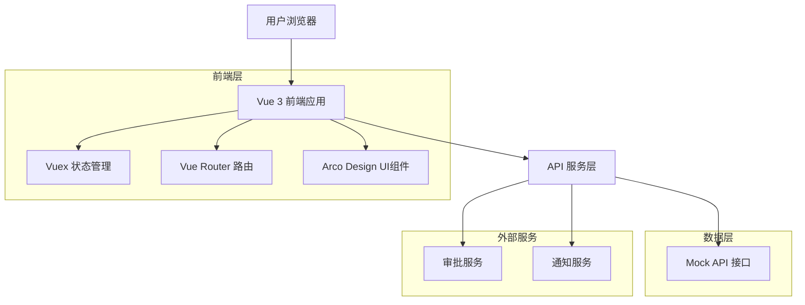
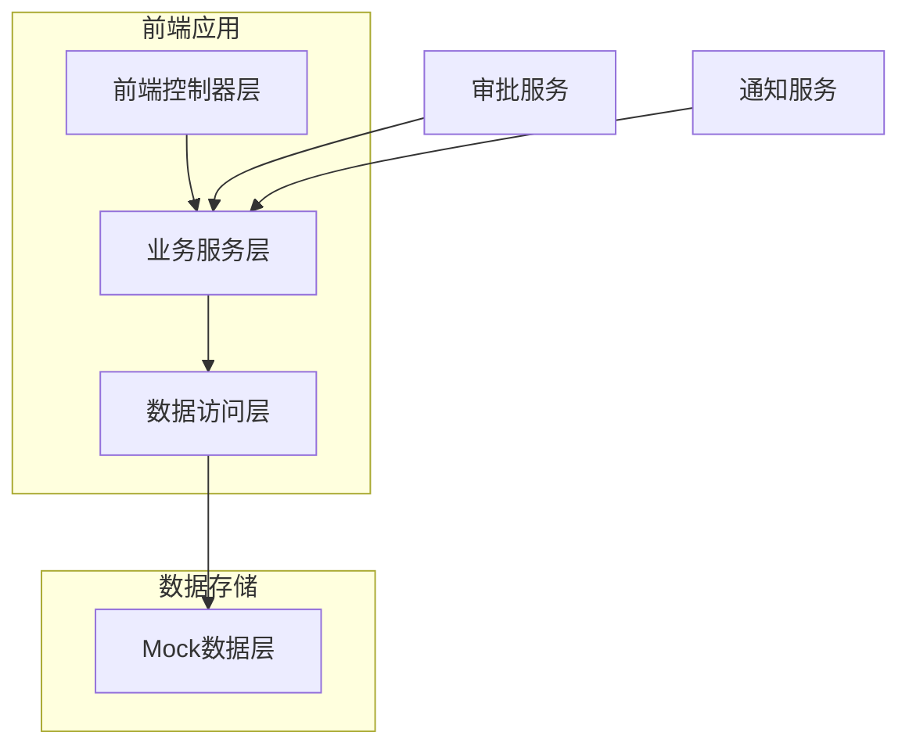
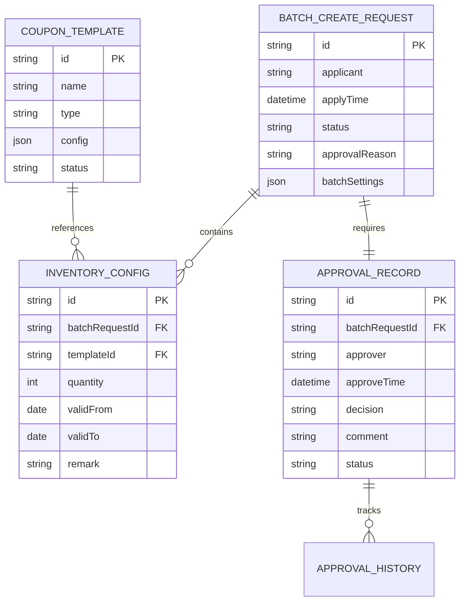

# 券库存批量创建技术架构文档

## 1. 架构设计



## 2. 技术描述

- **前端框架**：Vue 3 (Composition API) + TypeScript + Vite
- **UI组件库**：Arco Design Vue
- **状态管理**：Vuex 4
- **路由管理**：Vue Router 4
- **构建工具**：Vite
- **开发语言**：JavaScript + TypeScript
- **数据模拟**：Mock API (开发阶段)

## 3. 路由定义

| 路由 | 用途 |
|------|-----|
| /marketing/benefit/management | 券库存管理主页面，包含批量创建入口 |
| /marketing/benefit/management/batch-create | 批量创建券库存表单页面 |
| /marketing/benefit/management/approval | 审批流程管理页面 |
| /marketing/benefit/management/history | 批量创建历史记录页面 |
| /marketing/benefit/management/approval/:id | 审批详情页面 |

## 4. API定义

### 4.1 核心API

#### 批量创建券库存
```
POST /api/coupon/inventory/batch-create
```

请求参数：
| 参数名称 | 参数类型 | 是否必需 | 描述 |
|----------|----------|----------|------|
| usageScenario | string | true | 使用场景：batch_distribute 或 telesales |
| configMode | string | true | 配置模式：unified 或 individual |
| templateIds | string[] | true | 券模板ID数组 |
| unifiedConfig | InventoryConfig | false | 统一配置（统一模式时必需） |
| individualConfigs | InventoryConfig[] | false | 分别配置（分别编辑模式时必需） |
| batchSettings | BatchSettings | true | 批量操作设置 |
| approvalReason | string | true | 审批申请理由 |

响应参数：
| 参数名称 | 参数类型 | 描述 |
|----------|----------|------|
| code | number | 响应状态码 |
| data | BatchCreateResult | 批量创建结果 |
| message | string | 响应消息 |

统一配置模式请求示例：
```json
{
  "usageScenario": "batch_distribute",
  "configMode": "unified",
  "templateIds": ["TPL001", "TPL002", "TPL003"],
  "unifiedConfig": {
    "quantity": 10000,
    "validFrom": "2024-01-01",
    "validTo": "2024-12-31"
  },
  "batchSettings": {
    "createTime": "2024-01-15T10:00:00Z",
    "remark": "春节活动券库存",
    "operator": "张三"
  },
  "approvalReason": "为春节营销活动准备券库存"
}
```

分别编辑模式请求示例：
```json
{
  "usageScenario": "telesales",
  "configMode": "individual",
  "templateIds": ["TPL001", "TPL002"],
  "individualConfigs": [
    {
      "templateId": "TPL001",
      "quantity": 5000,
      "validFrom": "2024-01-01",
      "validTo": "2024-06-30"
    },
    {
      "templateId": "TPL002",
      "quantity": 8000,
      "validFrom": "2024-02-01",
      "validTo": "2024-12-31"
    }
  ],
  "batchSettings": {
    "createTime": "2024-01-15T10:00:00Z",
    "remark": "电销专用券库存",
    "operator": "李四"
  },
  "approvalReason": "为电销团队准备专用券库存"
}
```

#### 获取审批列表
```
GET /api/coupon/approval/list
```

请求参数：
| 参数名称 | 参数类型 | 是否必需 | 描述 |
|----------|----------|----------|------|
| status | string | false | 审批状态筛选 |
| page | number | false | 页码 |
| pageSize | number | false | 每页数量 |

响应参数：
| 参数名称 | 参数类型 | 描述 |
|----------|----------|------|
| list | ApprovalRecord[] | 审批记录列表 |
| total | number | 总记录数 |

#### 提交审批决定
```
POST /api/coupon/approval/submit
```

请求参数：
| 参数名称 | 参数类型 | 是否必需 | 描述 |
|----------|----------|----------|------|
| approvalId | string | true | 审批记录ID |
| decision | string | true | 审批决定 (approved/rejected) |
| comment | string | true | 审批意见 |

#### 获取批量创建历史
```
GET /api/coupon/inventory/batch-history
```

请求参数：
| 参数名称 | 参数类型 | 是否必需 | 描述 |
|----------|----------|----------|------|
| startDate | string | false | 开始日期 |
| endDate | string | false | 结束日期 |
| status | string | false | 创建状态 |

### 4.2 TypeScript类型定义

```typescript
// 使用场景枚举
type UsageScenario = 'batch_distribute' | 'telesales'

// 配置模式枚举
type ConfigMode = 'unified' | 'individual'

// 库存配置接口
interface InventoryConfig {
  templateId?: string  // 分别编辑模式时必需
  quantity: number
  validFrom: string
  validTo: string
  remark?: string
}

// 批量设置接口
interface BatchSettings {
  createTime: string
  remark: string
  operator: string
}

// 批量创建请求接口
interface BatchCreateRequest {
  usageScenario: UsageScenario
  configMode: ConfigMode
  templateIds: string[]
  unifiedConfig?: InventoryConfig    // 统一配置模式时使用
  individualConfigs?: InventoryConfig[]  // 分别编辑模式时使用
  batchSettings: BatchSettings
  approvalReason: string
}

// 批量创建结果接口
interface BatchCreateResult {
  approvalId: string
  totalCount: number
  estimatedProcessTime: string
  status: 'pending' | 'processing' | 'completed' | 'failed'
  usageScenario: UsageScenario
  configMode: ConfigMode
}

// 审批记录接口
interface ApprovalRecord {
  id: string
  type: 'batch_create'
  applicant: string
  applyTime: string
  status: 'pending' | 'approved' | 'rejected'
  approver?: string
  approveTime?: string
  comment?: string
  details: BatchCreateRequest
}
```

## 5. 服务架构图



## 6. 数据模型

### 6.1 数据模型定义



### 6.2 数据定义语言

由于当前使用Mock数据进行开发，以下是Mock数据结构定义：

#### 批量创建请求数据结构
```javascript
// Mock数据 - 批量创建请求
const batchCreateRequests = [
  {
    id: 'BCR001',
    applicant: '张三',
    applyTime: '2024-01-15T10:30:00Z',
    status: 'pending',
    approvalReason: '为春节营销活动准备券库存',
    batchSettings: {
      createTime: '2024-01-20T00:00:00Z',
      remark: '春节活动券库存',
      operator: '张三'
    },
    inventoryConfigs: [
      {
        templateId: 'TPL001',
        quantity: 10000,
        validFrom: '2024-01-20',
        validTo: '2024-02-20'
      }
    ]
  }
]

// Mock数据 - 审批记录
const approvalRecords = [
  {
    id: 'APR001',
    batchRequestId: 'BCR001',
    approver: '李四',
    approveTime: '2024-01-15T14:30:00Z',
    decision: 'approved',
    comment: '活动需求合理，同意创建',
    status: 'completed'
  }
]

// Mock数据 - 券模板
const couponTemplates = [
  {
    id: 'TPL001',
    name: '新用户专享免息券',
    type: 'interest_free',
    config: {
      maxAmount: 50000,
      interestFreeDays: 30
    },
    status: 'active'
  }
]
```

#### 初始化数据
```javascript
// 初始化批量创建历史记录
const initBatchHistory = () => {
  return [
    {
      id: 'BCH001',
      batchRequestId: 'BCR001',
      executeTime: '2024-01-15T15:00:00Z',
      totalCount: 3,
      successCount: 3,
      failedCount: 0,
      status: 'completed',
      operator: '系统',
      details: [
        {
          templateId: 'TPL001',
          templateName: '新用户专享免息券',
          quantity: 10000,
          status: 'success'
        }
      ]
    }
  ]
}
```