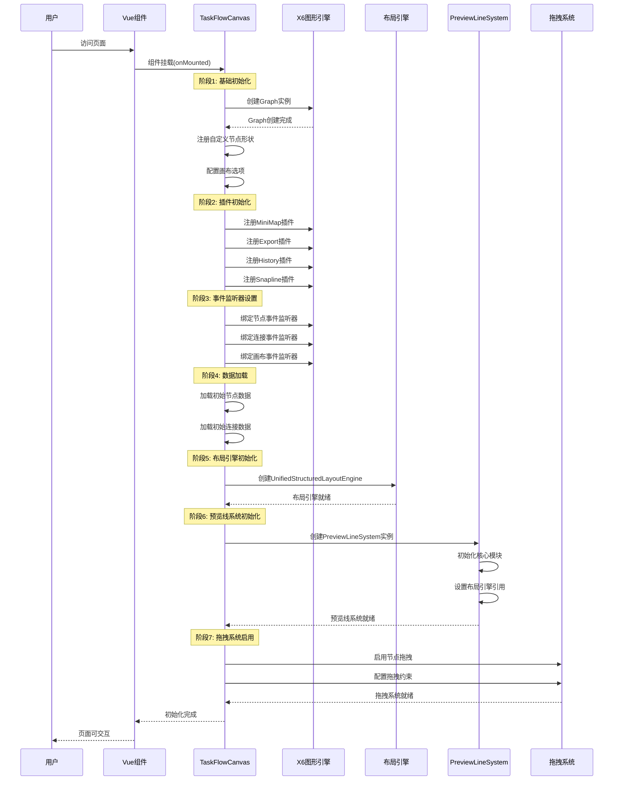
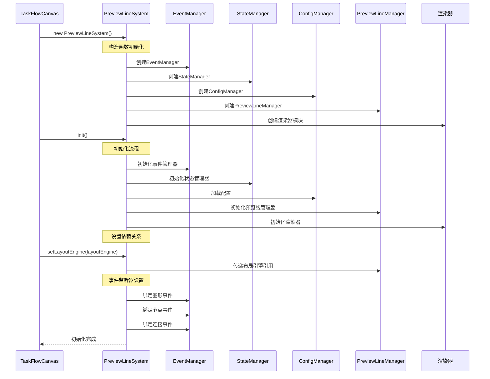
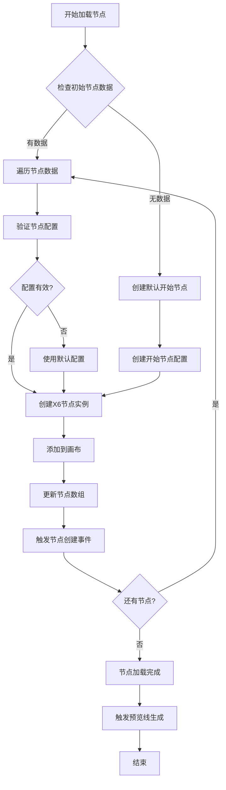
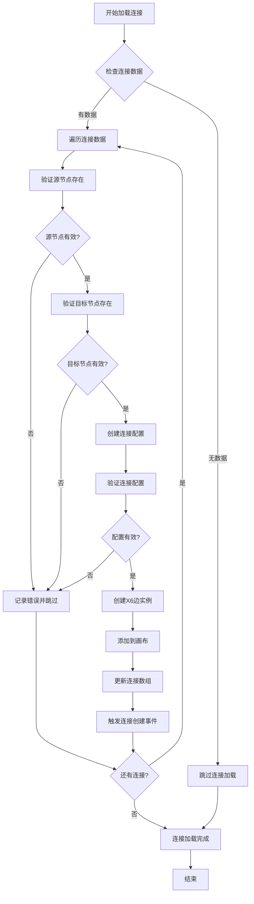
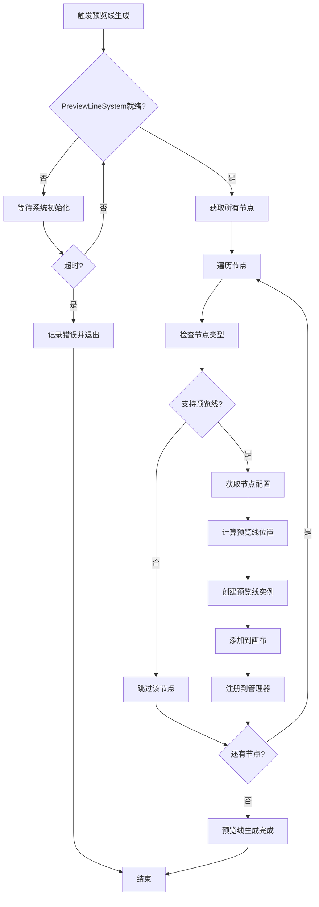
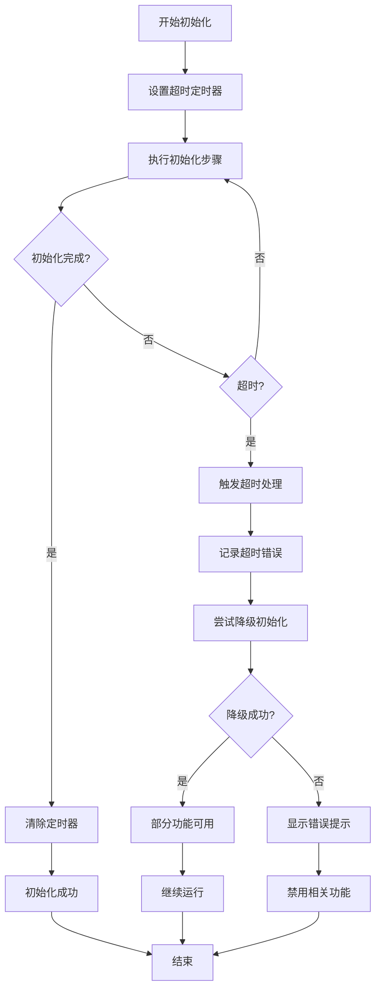

# TaskFlowCanvas 功能加载时序图与评估方案

## 1. 系统初始化时序图

### 1.1 整体初始化流程



### 1.2 PreviewLineSystem 详细初始化流程



## 2. 功能加载流程图

### 2.1 节点加载流程



### 2.2 连接线加载流程



### 2.3 预览线生成流程



## 3. 异常情况处理方案

### 3.1 初始化超时处理



### 3.2 组件加载失败处理

| 失败组件 | 检测方式 | 处理策略 | 降级方案 |
|---------|---------|---------|---------|
| X6图形引擎 | 实例创建检查 | 重试3次，间隔1秒 | 显示静态图片 |
| 布局引擎 | 方法调用检查 | 使用默认布局 | 手动布局模式 |
| PreviewLineSystem | 初始化状态检查 | 重新初始化 | 禁用预览线功能 |
| 拖拽系统 | 事件绑定检查 | 重新绑定事件 | 只读模式 |
| 小地图插件 | 插件注册检查 | 跳过插件加载 | 隐藏小地图按钮 |

### 3.3 预览线系统异常处理

```javascript
// 预览线系统异常处理示例
const handlePreviewLineError = (error, context) => {
  const errorTypes = {
    INITIALIZATION_TIMEOUT: {
      message: '预览线系统初始化超时',
      action: () => {
        // 重新初始化
        previewLineSystem = null
        initializePreviewLineSystem()
      }
    },
    LAYOUT_ENGINE_NOT_READY: {
      message: '布局引擎未就绪',
      action: () => {
        // 等待布局引擎就绪后重试
        waitForLayoutEngine().then(() => {
          previewLineSystem.setLayoutEngine(layoutEngine)
        })
      }
    },
    METHOD_NOT_FOUND: {
      message: '预览线方法不存在',
      action: () => {
        // 检查系统版本兼容性
        checkSystemCompatibility()
      }
    }
  }
  
  const errorHandler = errorTypes[error.type] || {
    message: '未知预览线错误',
    action: () => console.error('未处理的预览线错误:', error)
  }
  
  console.error(`[PreviewLineSystem] ${errorHandler.message}:`, error)
  errorHandler.action()
}
```

## 4. 性能评估指标

### 4.1 加载时间指标

| 指标名称 | 目标值 | 测量方式 | 优化建议 |
|---------|--------|---------|---------|
| 组件挂载时间 | < 100ms | performance.mark() | 减少同步操作 |
| X6初始化时间 | < 200ms | 构造函数计时 | 延迟插件加载 |
| 预览线系统初始化 | < 300ms | init()方法计时 | 异步初始化 |
| 首次渲染时间 | < 500ms | 首屏渲染完成 | 虚拟滚动 |
| 交互就绪时间 | < 800ms | 事件绑定完成 | 优先级加载 |

### 4.2 内存使用指标

```javascript
// 内存监控示例
const memoryMonitor = {
  baseline: 0,
  checkpoints: {},
  
  record(checkpoint) {
    if (performance.memory) {
      this.checkpoints[checkpoint] = {
        used: performance.memory.usedJSHeapSize,
        total: performance.memory.totalJSHeapSize,
        limit: performance.memory.jsHeapSizeLimit,
        timestamp: Date.now()
      }
    }
  },
  
  analyze() {
    const results = {}
    Object.entries(this.checkpoints).forEach(([name, data]) => {
      results[name] = {
        memoryUsed: `${(data.used / 1024 / 1024).toFixed(2)}MB`,
        memoryGrowth: this.baseline ? 
          `${((data.used - this.baseline) / 1024 / 1024).toFixed(2)}MB` : '0MB'
      }
    })
    return results
  }
}

// 使用示例
memoryMonitor.record('component-mount')
memoryMonitor.record('x6-initialized')
memoryMonitor.record('preview-system-ready')
```

### 4.3 渲染性能指标

| 指标名称 | 目标值 | 测量方式 | 关键因素 |
|---------|--------|---------|---------|
| 帧率(FPS) | > 30fps | requestAnimationFrame | 节点数量、动画复杂度 |
| 节点渲染时间 | < 16ms | 单个节点渲染耗时 | 节点复杂度、样式计算 |
| 预览线渲染时间 | < 10ms | 预览线生成耗时 | 算法复杂度、节点数量 |
| 拖拽响应时间 | < 5ms | 鼠标事件响应 | 事件处理复杂度 |

## 5. 测试验证方案

### 5.1 单元测试方案

```javascript
// TaskFlowCanvas 单元测试示例
describe('TaskFlowCanvas 初始化测试', () => {
  let wrapper
  
  beforeEach(() => {
    wrapper = mount(TaskFlowCanvas, {
      props: {
        initialNodes: [],
        initialConnections: []
      }
    })
  })
  
  test('应该正确初始化X6图形引擎', async () => {
    await nextTick()
    expect(wrapper.vm.graph).toBeDefined()
    expect(wrapper.vm.graph.constructor.name).toBe('Graph')
  })
  
  test('应该正确初始化预览线系统', async () => {
    await nextTick()
    await new Promise(resolve => setTimeout(resolve, 500))
    expect(wrapper.vm.previewLineSystem).toBeDefined()
    expect(wrapper.vm.isInitializationComplete).toBe(true)
  })
  
  test('应该正确处理初始化超时', async () => {
    // 模拟初始化超时
    const consoleSpy = vi.spyOn(console, 'warn')
    wrapper.vm.initializationTimeout = 100
    
    await new Promise(resolve => setTimeout(resolve, 200))
    expect(consoleSpy).toHaveBeenCalledWith(
      expect.stringContaining('初始化超时')
    )
  })
})
```

### 5.2 集成测试方案

```javascript
// 预览线系统集成测试
describe('PreviewLineSystem 集成测试', () => {
  let canvas, previewSystem, layoutEngine
  
  beforeEach(async () => {
    canvas = mount(TaskFlowCanvas)
    await nextTick()
    
    previewSystem = canvas.vm.previewLineSystem
    layoutEngine = canvas.vm.layoutEngine
  })
  
  test('预览线系统应该与布局引擎正确集成', () => {
    expect(previewSystem.getLayoutEngine()).toBe(layoutEngine)
    expect(previewSystem.isLayoutEngineReady()).toBe(true)
  })
  
  test('节点移动应该触发预览线更新', async () => {
    const spy = vi.spyOn(previewSystem, 'updatePreviewLinePosition')
    
    // 模拟节点移动
    const node = canvas.vm.graph.addNode({
      id: 'test-node',
      x: 100,
      y: 100
    })
    
    node.setPosition({ x: 200, y: 200 })
    await nextTick()
    
    expect(spy).toHaveBeenCalledWith(node)
  })
})
```

### 5.3 端到端测试方案

```javascript
// E2E 测试示例 (使用 Playwright)
test('完整的节点创建和连接流程', async ({ page }) => {
  await page.goto('/marketing/tasks')
  
  // 等待画布加载完成
  await page.waitForSelector('.task-flow-canvas')
  await page.waitForFunction(() => window.previewLineSystem !== undefined)
  
  // 创建节点
  await page.click('[data-testid="add-sms-node"]')
  await page.click('.canvas-container', { position: { x: 200, y: 200 } })
  
  // 验证节点创建
  const nodes = await page.locator('.vue-shape').count()
  expect(nodes).toBeGreaterThan(0)
  
  // 验证预览线生成
  const previewLines = await page.locator('[id*="preview"]').count()
  expect(previewLines).toBeGreaterThan(0)
  
  // 测试节点拖拽
  await page.dragAndDrop(
    '.vue-shape:first-child',
    '.canvas-container',
    { targetPosition: { x: 300, y: 300 } }
  )
  
  // 验证拖拽后预览线更新
  await page.waitForTimeout(100)
  const updatedPreviewLines = await page.locator('[id*="preview"]').count()
  expect(updatedPreviewLines).toBeGreaterThan(0)
})
```

### 5.4 性能测试方案

```javascript
// 性能测试示例
describe('TaskFlowCanvas 性能测试', () => {
  test('大量节点加载性能', async () => {
    const startTime = performance.now()
    
    const nodes = Array.from({ length: 100 }, (_, i) => ({
      id: `node-${i}`,
      type: 'sms',
      position: { x: (i % 10) * 150, y: Math.floor(i / 10) * 100 }
    }))
    
    const wrapper = mount(TaskFlowCanvas, {
      props: { initialNodes: nodes }
    })
    
    await nextTick()
    await new Promise(resolve => setTimeout(resolve, 1000))
    
    const endTime = performance.now()
    const loadTime = endTime - startTime
    
    expect(loadTime).toBeLessThan(2000) // 2秒内完成加载
    expect(wrapper.vm.nodes.length).toBe(100)
  })
  
  test('预览线生成性能', async () => {
    const wrapper = mount(TaskFlowCanvas)
    await nextTick()
    
    const startTime = performance.now()
    
    // 触发预览线生成
    await wrapper.vm.previewLineSystem.forceRegeneratePreviewLines()
    
    const endTime = performance.now()
    const generateTime = endTime - startTime
    
    expect(generateTime).toBeLessThan(500) // 500ms内完成生成
  })
})
```

## 6. 监控和调试方案

### 6.1 实时监控指标

```javascript
// 实时监控系统
const monitoringSystem = {
  metrics: {
    initializationTime: 0,
    renderingFPS: 0,
    memoryUsage: 0,
    errorCount: 0,
    previewLineCount: 0
  },
  
  startMonitoring() {
    // FPS监控
    let frameCount = 0
    let lastTime = performance.now()
    
    const measureFPS = () => {
      frameCount++
      const currentTime = performance.now()
      
      if (currentTime - lastTime >= 1000) {
        this.metrics.renderingFPS = frameCount
        frameCount = 0
        lastTime = currentTime
      }
      
      requestAnimationFrame(measureFPS)
    }
    
    measureFPS()
    
    // 内存监控
    setInterval(() => {
      if (performance.memory) {
        this.metrics.memoryUsage = performance.memory.usedJSHeapSize
      }
    }, 5000)
  },
  
  reportMetrics() {
    return {
      ...this.metrics,
      timestamp: Date.now()
    }
  }
}
```

### 6.2 错误追踪和日志

```javascript
// 错误追踪系统
const errorTracker = {
  errors: [],
  
  track(error, context) {
    const errorInfo = {
      message: error.message,
      stack: error.stack,
      context: context,
      timestamp: Date.now(),
      userAgent: navigator.userAgent,
      url: window.location.href
    }
    
    this.errors.push(errorInfo)
    
    // 发送到监控服务
    this.sendToMonitoring(errorInfo)
  },
  
  sendToMonitoring(errorInfo) {
    // 发送错误信息到监控服务
    fetch('/api/errors', {
      method: 'POST',
      headers: { 'Content-Type': 'application/json' },
      body: JSON.stringify(errorInfo)
    }).catch(console.error)
  }
}
```

## 7. 优化建议

### 7.1 初始化优化

1. **分阶段初始化**: 将初始化过程分为关键路径和非关键路径
2. **异步加载**: 非关键组件使用异步加载，避免阻塞主线程
3. **预加载策略**: 预加载常用的节点类型和配置
4. **缓存机制**: 缓存初始化结果，避免重复计算

### 7.2 性能优化

1. **虚拟化渲染**: 大量节点时使用虚拟化技术
2. **防抖节流**: 对频繁触发的事件进行防抖处理
3. **内存管理**: 及时清理不需要的对象引用
4. **批量更新**: 将多个DOM操作合并为批量更新

### 7.3 用户体验优化

1. **加载指示器**: 显示详细的加载进度
2. **错误恢复**: 提供错误恢复机制和用户指导
3. **降级方案**: 在功能不可用时提供替代方案
4. **性能提示**: 在性能较差时给出优化建议

这个完整的评估方案涵盖了TaskFlowCanvas系统的各个方面，从初始化时序到性能监控，为系统的稳定运行和持续优化提供了全面的指导。