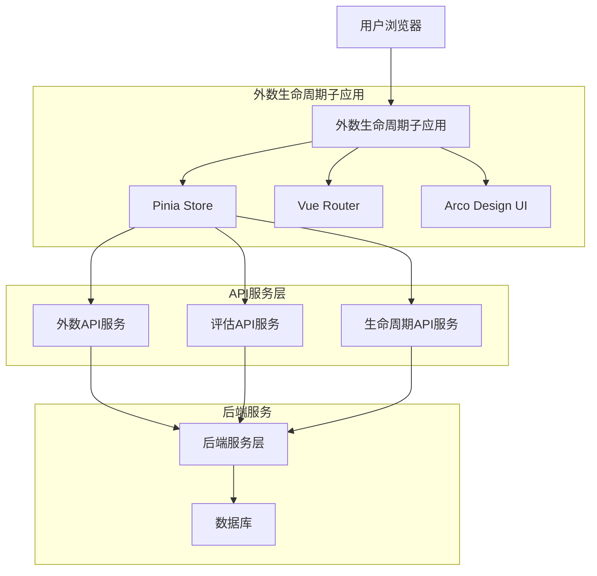
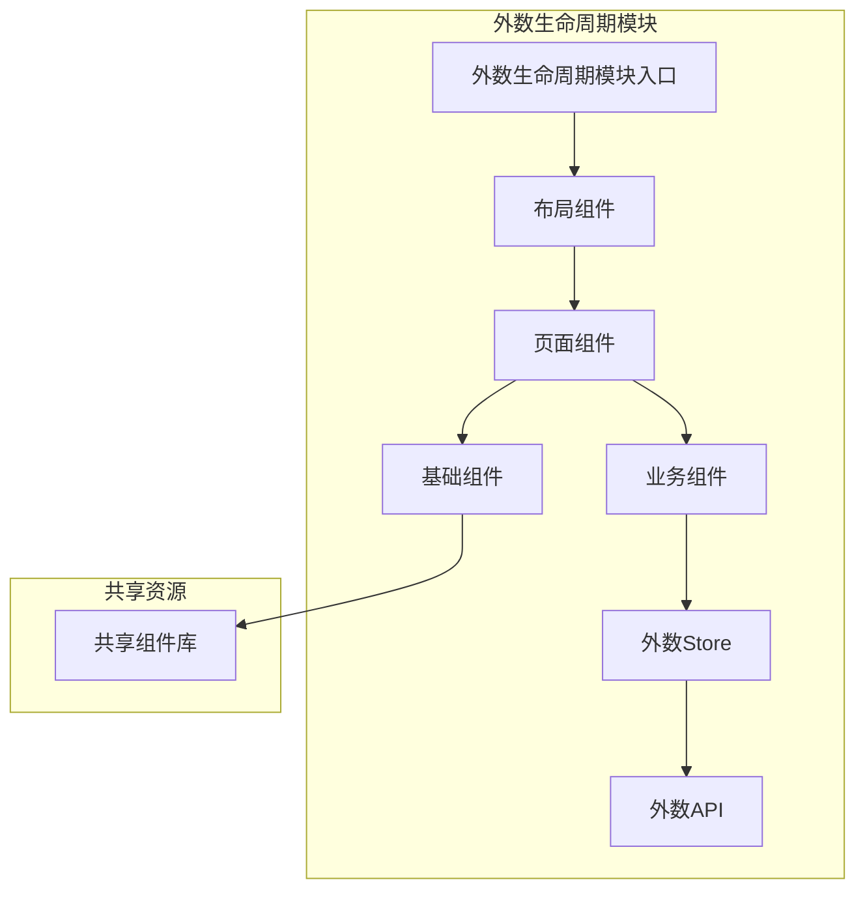
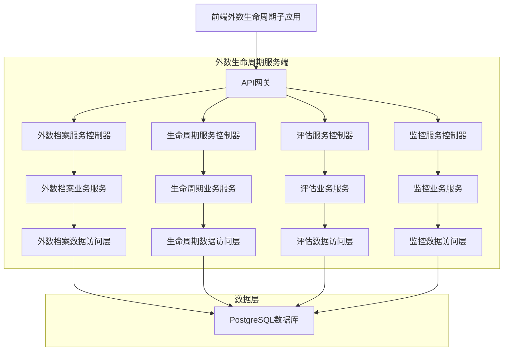
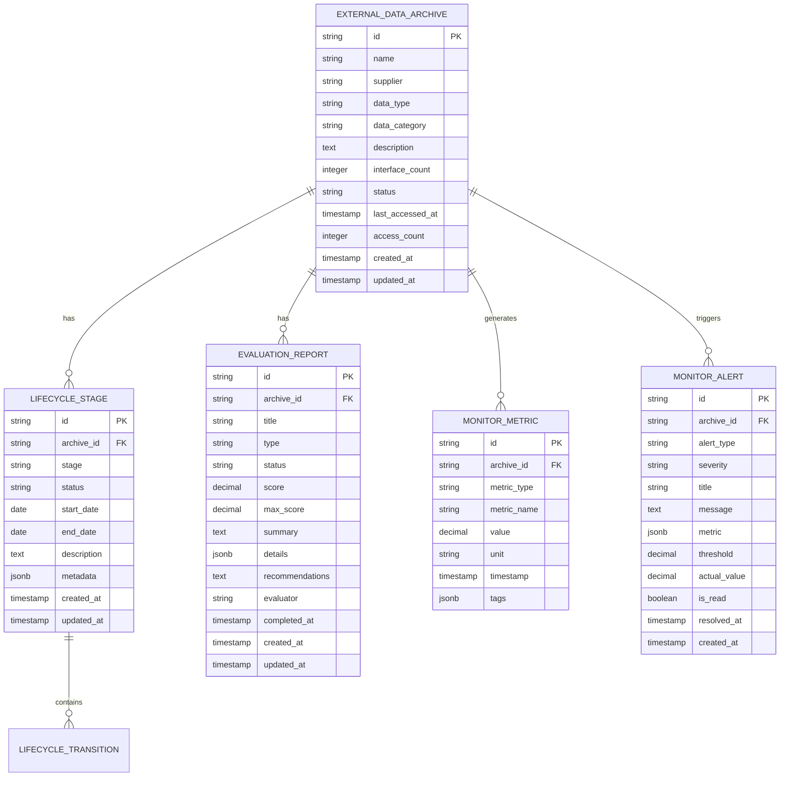

# 外数生命周期子应用技术架构文档

## 1. 架构设计

### 1.1 整体架构



### 1.2 模块架构



## 2. 技术描述

**前端技术栈：**
- 框架：Vue 3.3+ (Composition API)
- 构建工具：Vite 4.0+
- 状态管理：Pinia 2.1+
- 路由管理：Vue Router 4.2+
- UI组件：Arco Design Vue 2.5+
- 图表库：Chart.js / ECharts
- HTTP客户端：Axios 1.4+
- 类型系统：TypeScript 5.0+

**初始化工具：**
- vite-init (Vue 3 + TypeScript + Vite模板)

**后端服务：**
- 通过API接口与现有后端服务通信
- 使用统一的API网关进行请求转发

## 3. 路由定义

### 3.1 主路由配置

| 路由路径 | 页面组件 | 功能描述 |
|---------|----------|----------|
| /external-data/archive | ExternalDataArchive.vue | 外数档案管理页面，管理外部数据源档案 |
| /external-data/lifecycle | ExternalDataLifecycle.vue | 外数生命周期页面，跟踪数据生命周期状态 |
| /external-data/service | ExternalDataService.vue | 外数数据服务页面，配置和管理数据服务 |
| /external-data/evaluation | ExternalDataEvaluation.vue | 外数评估中心页面，进行数据质量评估 |
| /external-data/monitor | ExternalDataMonitor.vue | 外数监控中心页面，监控数据使用情况 |

### 3.2 路由配置代码

```typescript
// modules/external-data/router/index.ts
import { createRouter, createWebHistory, RouteRecordRaw } from 'vue-router'

const routes: RouteRecordRaw[] = [
  {
    path: '/external-data',
    component: () => import('../layouts/ExternalDataLayout.vue'),
    children: [
      {
        path: '',
        redirect: '/external-data/archive'
      },
      {
        path: 'archive',
        name: 'ExternalDataArchive',
        component: () => import('../pages/ExternalDataArchive.vue'),
        meta: { title: '外数档案管理', requiresAuth: true }
      },
      {
        path: 'lifecycle',
        name: 'ExternalDataLifecycle',
        component: () => import('../pages/ExternalDataLifecycle.vue'),
        meta: { title: '外数生命周期', requiresAuth: true }
      },
      {
        path: 'service',
        name: 'ExternalDataService',
        component: () => import('../pages/ExternalDataService.vue'),
        meta: { title: '外数数据服务', requiresAuth: true }
      },
      {
        path: 'evaluation',
        name: 'ExternalDataEvaluation',
        component: () => import('../pages/ExternalDataEvaluation.vue'),
        meta: { title: '外数评估中心', requiresAuth: true }
      },
      {
        path: 'monitor',
        name: 'ExternalDataMonitor',
        component: () => import('../pages/ExternalDataMonitor.vue'),
        meta: { title: '外数监控中心', requiresAuth: true }
      }
    ]
  }
]

export const externalDataRouter = createRouter({
  history: createWebHistory(),
  routes
})
```

## 4. API定义

### 4.1 外数档案管理API

```typescript
// modules/external-data/api/archive.ts

// 外数档案数据类型定义
export interface ExternalDataArchive {
  id: string
  name: string
  supplier: string
  dataType: 'verification' | 'scoring' | 'tag' | 'list' | 'price_evaluation'
  dataCategory: string
  description: string
  interfaceCount: number
  status: 'active' | 'inactive' | 'deprecated'
  createdAt: string
  updatedAt: string
  lastAccessedAt: string
  accessCount: number
}

export interface ExternalDataArchiveListParams {
  page?: number
  pageSize?: number
  supplier?: string
  dataType?: string
  dataCategory?: string
  status?: string
  search?: string
}

export interface ExternalDataArchiveCreateData {
  name: string
  supplier: string
  dataType: string
  dataCategory: string
  description: string
  interfaces: Array<{
    name: string
    endpoint: string
    method: string
    description: string
  }>
}

// API接口定义
export const archiveApi = {
  // 获取外数档案列表
  getArchives: (params: ExternalDataArchiveListParams) => 
    http.get<ApiResponse<ExternalDataArchive[]>>('/api/external-data/archives', { params }),
  
  // 获取外数档案详情
  getArchive: (id: string) => 
    http.get<ApiResponse<ExternalDataArchive>>(`/api/external-data/archives/${id}`),
  
  // 创建外数档案
  createArchive: (data: ExternalDataArchiveCreateData) => 
    http.post<ApiResponse<ExternalDataArchive>>('/api/external-data/archives', data),
  
  // 更新外数档案
  updateArchive: (id: string, data: Partial<ExternalDataArchiveCreateData>) => 
    http.put<ApiResponse<ExternalDataArchive>>(`/api/external-data/archives/${id}`, data),
  
  // 删除外数档案
  deleteArchive: (id: string) => 
    http.delete<ApiResponse<void>>(`/api/external-data/archives/${id}`),
  
  // 获取外数档案统计
  getArchiveStats: () => 
    http.get<ApiResponse<ArchiveStats>>('/api/external-data/archives/stats'),
  
  // 导出外数档案数据
  exportArchives: (params: ExternalDataArchiveListParams) => 
    http.get('/api/external-data/archives/export', { params, responseType: 'blob' })
}
```

### 4.2 外数生命周期管理API

```typescript
// modules/external-data/api/lifecycle.ts

export interface LifecycleStage {
  id: string
  archiveId: string
  stage: 'registration' | 'evaluation' | 'approval' | 'deployment' | 'operation' | 'deprecation'
  status: 'pending' | 'in_progress' | 'completed' | 'failed'
  startDate: string
  endDate?: string
  description: string
  metadata?: Record<string, any>
  createdAt: string
  updatedAt: string
}

export interface LifecycleData {
  id: string
  archiveId: string
  currentStage: string
  currentStatus: string
  stages: LifecycleStage[]
  overallStatus: 'healthy' | 'warning' | 'critical'
  nextStage?: string
  estimatedCompletionDate?: string
  createdAt: string
  updatedAt: string
}

export interface LifecycleTransitionData {
  toStage: string
  description: string
  metadata?: Record<string, any>
}

export const lifecycleApi = {
  // 获取生命周期数据
  getLifecycle: (archiveId: string) => 
    http.get<ApiResponse<LifecycleData>>(`/api/external-data/${archiveId}/lifecycle`),
  
  // 获取生命周期阶段历史
  getLifecycleStages: (archiveId: string) => 
    http.get<ApiResponse<LifecycleStage[]>>(`/api/external-data/${archiveId}/lifecycle/stages`),
  
  // 推进生命周期阶段
  advanceLifecycle: (archiveId: string, data: LifecycleTransitionData) => 
    http.post<ApiResponse<LifecycleStage>>(`/api/external-data/${archiveId}/lifecycle/advance`, data),
  
  // 回退生命周期阶段
  rollbackLifecycle: (archiveId: string, reason: string) => 
    http.put<ApiResponse<LifecycleStage>>(`/api/external-data/${archiveId}/lifecycle/rollback`, { reason }),
  
  // 获取生命周期模板
  getLifecycleTemplates: () => 
    http.get<ApiResponse<LifecycleTemplate[]>>(`/api/external-data/lifecycle/templates`),
  
  // 应用生命周期模板
  applyLifecycleTemplate: (archiveId: string, templateId: string) => 
    http.post<ApiResponse<void>>(`/api/external-data/${archiveId}/lifecycle/templates/${templateId}`)
}
```

### 4.3 外数评估中心API

```typescript
// modules/external-data/api/evaluation.ts

export interface EvaluationReport {
  id: string
  archiveId: string
  title: string
  type: 'quality' | 'performance' | 'cost_effectiveness' | 'comprehensive'
  status: 'draft' | 'in_progress' | 'completed' | 'archived'
  score: number
  maxScore: number
  summary: string
  details: {
    quality?: EvaluationMetric
    performance?: EvaluationMetric
    cost?: EvaluationMetric
    [key: string]: EvaluationMetric | undefined
  }
  recommendations: string[]
  evaluator: string
  createdAt: string
  updatedAt: string
  completedAt?: string
}

export interface EvaluationMetric {
  score: number
  maxScore: number
  weight: number
  criteria: Array<{
    name: string
    score: number
    maxScore: number
    description: string
  }>
}

export interface EvaluationCreateData {
  archiveId: string
  title: string
  type: string
  evaluationCriteria: Array<{
    category: string
    weight: number
    metrics: Array<{
      name: string
      maxScore: number
      description: string
    }>
  }>
}

export const evaluationApi = {
  // 获取评估报告列表
  getEvaluationReports: (params: { archiveId?: string; type?: string; status?: string }) => 
    http.get<ApiResponse<EvaluationReport[]>>('/api/external-data/evaluations', { params }),
  
  // 获取评估报告详情
  getEvaluationReport: (id: string) => 
    http.get<ApiResponse<EvaluationReport>>(`/api/external-data/evaluations/${id}`),
  
  // 创建评估报告
  createEvaluationReport: (data: EvaluationCreateData) => 
    http.post<ApiResponse<EvaluationReport>>('/api/external-data/evaluations', data),
  
  // 更新评估报告
  updateEvaluationReport: (id: string, data: Partial<EvaluationCreateData>) => 
    http.put<ApiResponse<EvaluationReport>>(`/api/external-data/evaluations/${id}`, data),
  
  // 完成评估报告
  completeEvaluationReport: (id: string, finalScore: number, summary: string) => 
    http.put<ApiResponse<EvaluationReport>>(`/api/external-data/evaluations/${id}/complete`, { 
      finalScore, 
      summary 
    }),
  
  // 归档评估报告
  archiveEvaluationReport: (id: string) => 
    http.put<ApiResponse<void>>(`/api/external-data/evaluations/${id}/archive`),
  
  // 获取评估模板
  getEvaluationTemplates: () => 
    http.get<ApiResponse<EvaluationTemplate[]>>(`/api/external-data/evaluation-templates`)
}
```

### 4.4 外数监控中心API

```typescript
// modules/external-data/api/monitor.ts

export interface MonitorMetric {
  id: string
  archiveId: string
  metricType: 'usage' | 'performance' | 'quality' | 'cost'
  metricName: string
  value: number
  unit: string
  timestamp: string
  tags?: Record<string, string>
}

export interface MonitorAlert {
  id: string
  archiveId: string
  alertType: 'threshold' | 'anomaly' | 'system'
  severity: 'info' | 'warning' | 'critical'
  title: string
  message: string
  metric?: MonitorMetric
  threshold?: number
  actualValue?: number
  isRead: boolean
  createdAt: string
  resolvedAt?: string
}

export interface MonitorDashboard {
  archiveId: string
  metrics: {
    totalUsage: number
    avgResponseTime: number
    successRate: number
    totalCost: number
    dataQuality: number
  }
  trends: {
    usage: Array<{ timestamp: string; value: number }>
    performance: Array<{ timestamp: string; value: number }>
    quality: Array<{ timestamp: string; value: number }>
  }
  alerts: MonitorAlert[]
  lastUpdated: string
}

export const monitorApi = {
  // 获取监控指标
  getMonitorMetrics: (archiveId: string, metricType?: string, timeRange?: string) => 
    http.get<ApiResponse<MonitorMetric[]>>(`/api/external-data/${archiveId}/metrics`, { 
      params: { metricType, timeRange } 
    }),
  
  // 获取监控仪表板
  getMonitorDashboard: (archiveId: string) => 
    http.get<ApiResponse<MonitorDashboard>>(`/api/external-data/${archiveId}/dashboard`),
  
  // 获取监控预警
  getMonitorAlerts: (archiveId?: string, severity?: string) => 
    http.get<ApiResponse<MonitorAlert[]>>(`/api/external-data/alerts`, { 
      params: { archiveId, severity } 
    }),
  
  // 标记预警为已读
  markAlertAsRead: (alertId: string) => 
    http.put<ApiResponse<void>>(`/api/external-data/alerts/${alertId}/read`),
  
  // 解决预警
  resolveAlert: (alertId: string, resolution: string) => 
    http.put<ApiResponse<void>>(`/api/external-data/alerts/${alertId}/resolve`, { resolution }),
  
  // 获取监控配置
  getMonitorConfig: (archiveId: string) => 
    http.get<ApiResponse<MonitorConfig>>(`/api/external-data/${archiveId}/monitor-config`),
  
  // 更新监控配置
  updateMonitorConfig: (archiveId: string, config: MonitorConfig) => 
    http.put<ApiResponse<MonitorConfig>>(`/api/external-data/${archiveId}/monitor-config`, config)
}
```

## 5. 服务器架构

### 5.1 服务端分层架构



### 5.2 服务端技术栈

**后端技术：**
- 框架：Node.js + Express.js / Nest.js
- 数据库：PostgreSQL 14+
- 缓存：Redis 7+
- 消息队列：RabbitMQ / Apache Kafka
- 时序数据库：InfluxDB (监控数据)
- 文件存储：MinIO / AWS S3

**服务端API示例：**
```typescript
// 外数档案服务控制器
@Controller('api/external-data/archives')
export class ExternalDataArchiveController {
  constructor(private readonly archiveService: ExternalDataArchiveService) {}
  
  @Get()
  async getArchives(@Query() params: ExternalDataArchiveListParams) {
    return this.archiveService.findAll(params)
  }
  
  @Get(':id')
  async getArchive(@Param('id') id: string) {
    return this.archiveService.findOne(id)
  }
  
  @Post()
  async createArchive(@Body() createData: ExternalDataArchiveCreateData) {
    return this.archiveService.create(createData)
  }
  
  @Put(':id')
  async updateArchive(@Param('id') id: string, @Body() updateData: Partial<ExternalDataArchiveCreateData>) {
    return this.archiveService.update(id, updateData)
  }
  
  @Delete(':id')
  async deleteArchive(@Param('id') id: string) {
    return this.archiveService.remove(id)
  }
  
  @Get('stats')
  async getArchiveStats() {
    return this.archiveService.getStats()
  }
}
```

## 6. 数据模型

### 6.1 数据库实体关系图



### 6.2 数据定义语言

#### 外数档案表
```sql
-- 外数档案表
CREATE TABLE external_data_archives (
    id UUID PRIMARY KEY DEFAULT gen_random_uuid(),
    name VARCHAR(255) NOT NULL,
    supplier VARCHAR(255) NOT NULL,
    data_type VARCHAR(50) CHECK (data_type IN ('verification', 'scoring', 'tag', 'list', 'price_evaluation')),
    data_category VARCHAR(100),
    description TEXT,
    interface_count INTEGER DEFAULT 0,
    status VARCHAR(50) DEFAULT 'active' CHECK (status IN ('active', 'inactive', 'deprecated')),
    last_accessed_at TIMESTAMP WITH TIME ZONE,
    access_count INTEGER DEFAULT 0,
    created_at TIMESTAMP WITH TIME ZONE DEFAULT NOW(),
    updated_at TIMESTAMP WITH TIME ZONE DEFAULT NOW(),
    created_by UUID,
    updated_by UUID
);

-- 索引
CREATE INDEX idx_archives_supplier ON external_data_archives(supplier);
CREATE INDEX idx_archives_data_type ON external_data_archives(data_type);
CREATE INDEX idx_archives_status ON external_data_archives(status);
CREATE INDEX idx_archives_created_at ON external_data_archives(created_at DESC);
CREATE INDEX idx_archives_last_accessed ON external_data_archives(last_accessed_at DESC);
```

#### 生命周期阶段表
```sql
-- 生命周期阶段表
CREATE TABLE lifecycle_stages (
    id UUID PRIMARY KEY DEFAULT gen_random_uuid(),
    archive_id UUID NOT NULL REFERENCES external_data_archives(id) ON DELETE CASCADE,
    stage VARCHAR(50) CHECK (stage IN ('registration', 'evaluation', 'approval', 'deployment', 'operation', 'deprecation')),
    status VARCHAR(50) CHECK (status IN ('pending', 'in_progress', 'completed', 'failed')),
    start_date DATE NOT NULL,
    end_date DATE,
    description TEXT,
    metadata JSONB,
    created_at TIMESTAMP WITH TIME ZONE DEFAULT NOW(),
    updated_at TIMESTAMP WITH TIME ZONE DEFAULT NOW(),
    created_by UUID,
    updated_by UUID
);

-- 索引
CREATE INDEX idx_lifecycle_stages_archive_id ON lifecycle_stages(archive_id);
CREATE INDEX idx_lifecycle_stages_stage ON lifecycle_stages(stage);
CREATE INDEX idx_lifecycle_stages_status ON lifecycle_stages(status);
CREATE INDEX idx_lifecycle_stages_start_date ON lifecycle_stages(start_date);
```

#### 评估报告表
```sql
-- 评估报告表
CREATE TABLE evaluation_reports (
    id UUID PRIMARY KEY DEFAULT gen_random_uuid(),
    archive_id UUID NOT NULL REFERENCES external_data_archives(id) ON DELETE CASCADE,
    title VARCHAR(255) NOT NULL,
    type VARCHAR(50) CHECK (type IN ('quality', 'performance', 'cost_effectiveness', 'comprehensive')),
    status VARCHAR(50) DEFAULT 'draft' CHECK (status IN ('draft', 'in_progress', 'completed', 'archived')),
    score DECIMAL(5,2),
    max_score DECIMAL(5,2) DEFAULT 100,
    summary TEXT,
    details JSONB,
    recommendations TEXT[],
    evaluator UUID,
    completed_at TIMESTAMP WITH TIME ZONE,
    created_at TIMESTAMP WITH TIME ZONE DEFAULT NOW(),
    updated_at TIMESTAMP WITH TIME ZONE DEFAULT NOW()
);

-- 索引
CREATE INDEX idx_evaluation_reports_archive_id ON evaluation_reports(archive_id);
CREATE INDEX idx_evaluation_reports_type ON evaluation_reports(type);
CREATE INDEX idx_evaluation_reports_status ON evaluation_reports(status);
CREATE INDEX idx_evaluation_reports_score ON evaluation_reports(score DESC);
CREATE INDEX idx_evaluation_reports_created_at ON evaluation_reports(created_at DESC);
```

#### 监控指标表
```sql
-- 监控指标表
CREATE TABLE monitor_metrics (
    id UUID PRIMARY KEY DEFAULT gen_random_uuid(),
    archive_id UUID NOT NULL REFERENCES external_data_archives(id) ON DELETE CASCADE,
    metric_type VARCHAR(50) CHECK (metric_type IN ('usage', 'performance', 'quality', 'cost')),
    metric_name VARCHAR(255) NOT NULL,
    value DECIMAL(15,4) NOT NULL,
    unit VARCHAR(50),
    timestamp TIMESTAMP WITH TIME ZONE DEFAULT NOW(),
    tags JSONB
);

-- 索引
CREATE INDEX idx_monitor_metrics_archive_id ON monitor_metrics(archive_id);
CREATE INDEX idx_monitor_metrics_metric_type ON monitor_metrics(metric_type);
CREATE INDEX idx_monitor_metrics_metric_name ON monitor_metrics(metric_name);
CREATE INDEX idx_monitor_metrics_timestamp ON monitor_metrics(timestamp DESC);
CREATE INDEX idx_monitor_metrics_archive_timestamp ON monitor_metrics(archive_id, timestamp DESC);
```

#### 监控预警表
```sql
-- 监控预警表
CREATE TABLE monitor_alerts (
    id UUID PRIMARY KEY DEFAULT gen_random_uuid(),
    archive_id UUID NOT NULL REFERENCES external_data_archives(id) ON DELETE CASCADE,
    alert_type VARCHAR(50) CHECK (alert_type IN ('threshold', 'anomaly', 'system')),
    severity VARCHAR(20) CHECK (severity IN ('info', 'warning', 'critical')),
    title VARCHAR(255) NOT NULL,
    message TEXT NOT NULL,
    metric JSONB,
    threshold DECIMAL(15,4),
    actual_value DECIMAL(15,4),
    is_read BOOLEAN DEFAULT FALSE,
    resolved_at TIMESTAMP WITH TIME ZONE,
    created_at TIMESTAMP WITH TIME ZONE DEFAULT NOW()
);

-- 索引
CREATE INDEX idx_monitor_alerts_archive_id ON monitor_alerts(archive_id);
CREATE INDEX idx_monitor_alerts_severity ON monitor_alerts(severity);
CREATE INDEX idx_monitor_alerts_is_read ON monitor_alerts(is_read);
CREATE INDEX idx_monitor_alerts_created_at ON monitor_alerts(created_at DESC);
```

## 7. 组件架构

### 7.1 页面组件结构

```
modules/external-data/components/
├── layout/
│   ├── ExternalDataLayout.vue      # 外数生命周期布局
│   └── ExternalDataSidebar.vue     # 外数侧边导航
├── pages/
│   ├── ExternalDataArchive.vue     # 外数档案管理页面
│   ├── ExternalDataLifecycle.vue   # 外数生命周期页面
│   ├── ExternalDataService.vue     # 外数数据服务页面
│   ├── ExternalDataEvaluation.vue  # 外数评估中心页面
│   └── ExternalDataMonitor.vue     # 外数监控中心页面
├── business/
│   ├── ArchiveCard.vue             # 档案卡片组件
│   ├── ArchiveForm.vue             # 档案表单组件
│   ├── ArchiveFilter.vue           # 档案筛选组件
│   ├── LifecycleTimeline.vue       # 生命周期时间线组件
│   ├── LifecycleStage.vue          # 生命周期阶段组件
│   ├── EvaluationCard.vue          # 评估卡片组件
│   ├── EvaluationForm.vue          # 评估表单组件
│   ├── MetricCard.vue              # 监控指标卡片组件
│   ├── AlertCard.vue               # 预警卡片组件
│   └── MonitorDashboard.vue        # 监控仪表板组件
├── charts/
│   ├── UsageTrendChart.vue         # 使用趋势图表
│   ├── PerformanceChart.vue        # 性能图表
│   ├── QualityChart.vue            # 质量图表
│   └── CostChart.vue               # 成本图表
└── common/
    ├── ArchiveStatusBadge.vue      # 档案状态标签
    ├── LifecycleStatusBadge.vue    # 生命周期状态标签
    ├── EvaluationStatusBadge.vue   # 评估状态标签
    └── AlertSeverityBadge.vue      # 预警级别标签
```

### 7.2 核心组件示例

#### ExternalDataLayout.vue
```vue
<template>
  <div class="external-data-layout">
    <ExternalDataSidebar />
    <div class="external-data-content">
      <router-view />
    </div>
  </div>
</template>

<script setup lang="ts">
import ExternalDataSidebar from './ExternalDataSidebar.vue'
</script>

<style scoped>
.external-data-layout {
  display: flex;
  height: 100vh;
}

.external-data-content {
  flex: 1;
  padding: 20px;
  overflow-y: auto;
}
</style>
```

#### ExternalDataArchive.vue
```vue
<template>
  <div class="external-data-archive">
    <a-page-header title="外数档案管理" />
    
    <!-- 统计卡片 -->
    <a-row :gutter="16" class="stats-row">
      <a-col :span="6">
        <ArchiveStatCard
          title="总档案数"
          :value="stats.totalArchives"
          unit="个"
          trend="up"
        />
      </a-col>
      <a-col :span="6">
        <ArchiveStatCard
          title="活跃档案"
          :value="stats.activeArchives"
          unit="个"
          :percentage="stats.activePercentage"
        />
      </a-col>
      <a-col :span="6">
        <ArchiveStatCard
          title="数据供应商"
          :value="stats.totalSuppliers"
          unit="家"
        />
      </a-col>
      <a-col :span="6">
        <ArchiveStatCard
          title="平均评分"
          :value="stats.averageScore"
          unit="分"
          type="score"
        />
      </a-col>
    </a-row>
    
    <!-- 筛选和搜索 -->
    <a-card class="filter-card">
      <ArchiveFilter
        :loading="loading"
        @search="handleSearch"
        @filter="handleFilter"
      />
    </a-card>
    
    <!-- 档案列表 -->
    <a-card title="外数档案列表" class="archive-list-card">
      <ArchiveList
        :data="archives"
        :loading="loading"
        :pagination="pagination"
        @page-change="handlePageChange"
        @edit="handleEdit"
        @delete="handleDelete"
        @evaluate="handleEvaluate"
      />
    </a-card>
  </div>
</template>

<script setup lang="ts">
import { ref, onMounted } from 'vue'
import { useArchiveStore } from '../stores/archive'
import ArchiveStatCard from '../components/business/ArchiveStatCard.vue'
import ArchiveFilter from '../components/business/ArchiveFilter.vue'
import ArchiveList from '../components/business/ArchiveList.vue'

const archiveStore = useArchiveStore()

const stats = ref({
  totalArchives: 0,
  activeArchives: 0,
  activePercentage: 0,
  totalSuppliers: 0,
  averageScore: 0
})

const archives = ref([])
const loading = ref(false)
const pagination = ref({
  page: 1,
  pageSize: 10,
  total: 0
})

const searchParams = ref({})

onMounted(async () => {
  loading.value = true
  try {
    await Promise.all([
      loadStats(),
      loadArchives()
    ])
  } finally {
    loading.value = false
  }
})

async function loadStats() {
  const response = await archiveStore.getArchiveStats()
  stats.value = response.data
}

async function loadArchives(params = {}) {
  const response = await archiveStore.fetchArchives({
    page: pagination.value.page,
    pageSize: pagination.value.pageSize,
    ...params
  })
  archives.value = response.data.data
  pagination.value.total = response.data.total
}

function handleSearch(searchText: string) {
  searchParams.value = { ...searchParams.value, search: searchText }
  loadArchives(searchParams.value)
}

function handleFilter(filterParams: any) {
  searchParams.value = { ...searchParams.value, ...filterParams }
  loadArchives(searchParams.value)
}

function handlePageChange(page: number) {
  pagination.value.page = page
  loadArchives(searchParams.value)
}

function handleEdit(archive: ExternalDataArchive) {
  // 处理编辑逻辑
  router.push(`/external-data/archive/edit/${archive.id}`)
}

function handleDelete(archive: ExternalDataArchive) {
  // 处理删除逻辑
  Modal.confirm({
    title: '确认删除',
    content: `确定要删除档案 "${archive.name}" 吗？`,
    onOk: async () => {
      await archiveStore.deleteArchive(archive.id)
      loadArchives(searchParams.value)
    }
  })
}

function handleEvaluate(archive: ExternalDataArchive) {
  // 处理评估逻辑
  router.push(`/external-data/evaluation/create?archiveId=${archive.id}`)
}
</script>

<style scoped>
.stats-row {
  margin-bottom: 24px;
}

.filter-card {
  margin-bottom: 24px;
}

.archive-list-card {
  margin-top: 24px;
}
</style>
```

## 8. 状态管理

### 8.1 Archive Store

```typescript
// modules/external-data/stores/archive.ts
import { defineStore } from 'pinia'
import { ref, computed } from 'vue'
import type { ExternalDataArchive, ExternalDataArchiveListParams } from '../api/archive'
import { archiveApi } from '../api/archive'

export const useArchiveStore = defineStore('externalDataArchive', () => {
  // 状态
  const archives = ref<ExternalDataArchive[]>([])
  const currentArchive = ref<ExternalDataArchive | null>(null)
  const loading = ref(false)
  const error = ref<string | null>(null)
  const pagination = ref({
    page: 1,
    pageSize: 10,
    total: 0
  })

  // 计算属性
  const totalArchives = computed(() => archives.value.length)
  
  const activeArchives = computed(() => 
    archives.value.filter(archive => archive.status === 'active')
  )
  
  const archiveStats = computed(() => {
    const total = archives.value.length
    const active = activeArchives.value.length
    const inactive = archives.value.filter(a => a.status === 'inactive').length
    const deprecated = archives.value.filter(a => a.status === 'deprecated').length
    const suppliers = new Set(archives.value.map(a => a.supplier)).size
    
    return { total, active, inactive, deprecated, suppliers }
  })

  // 方法
  const fetchArchives = async (params?: ExternalDataArchiveListParams) => {
    loading.value = true
    error.value = null
    
    try {
      const response = await archiveApi.getArchives(params || {})
      archives.value = response.data.data
      pagination.value = {
        page: response.data.page,
        pageSize: response.data.pageSize,
        total: response.data.total
      }
    } catch (err) {
      error.value = err instanceof Error ? err.message : '获取档案列表失败'
      throw err
    } finally {
      loading.value = false
    }
  }

  const fetchArchive = async (id: string) => {
    loading.value = true
    error.value = null
    
    try {
      const response = await archiveApi.getArchive(id)
      currentArchive.value = response.data.data
      return response.data.data
    } catch (err) {
      error.value = err instanceof Error ? err.message : '获取档案详情失败'
      throw err
    } finally {
      loading.value = false
    }
  }

  const createArchive = async (data: any) => {
    loading.value = true
    error.value = null
    
    try {
      const response = await archiveApi.createArchive(data)
      archives.value.unshift(response.data.data)
      pagination.value.total++
      return response.data.data
    } catch (err) {
      error.value = err instanceof Error ? err.message : '创建档案失败'
      throw err
    } finally {
      loading.value = false
    }
  }

  const updateArchive = async (id: string, data: any) => {
    loading.value = true
    error.value = null
    
    try {
      const response = await archiveApi.updateArchive(id, data)
      const index = archives.value.findIndex(a => a.id === id)
      if (index !== -1) {
        archives.value[index] = response.data.data
      }
      if (currentArchive.value?.id === id) {
        currentArchive.value = response.data.data
      }
      return response.data.data
    } catch (err) {
      error.value = err instanceof Error ? err.message : '更新档案失败'
      throw err
    } finally {
      loading.value = false
    }
  }

  const deleteArchive = async (id: string) => {
    loading.value = true
    error.value = null
    
    try {
      await archiveApi.deleteArchive(id)
      archives.value = archives.value.filter(a => a.id !== id)
      pagination.value.total--
      if (currentArchive.value?.id === id) {
        currentArchive.value = null
      }
    } catch (err) {
      error.value = err instanceof Error ? err.message : '删除档案失败'
      throw err
    } finally {
      loading.value = false
    }
  }

  const getArchiveStats = async () => {
    try {
      const response = await archiveApi.getArchiveStats()
      return response.data
    } catch (err) {
      error.value = err instanceof Error ? err.message : '获取档案统计失败'
      throw err
    }
  }

  const setCurrentArchive = (archive: ExternalDataArchive | null) => {
    currentArchive.value = archive
  }

  const clearError = () => {
    error.value = null
  }

  return {
    // 状态
    archives: readonly(archives),
    currentArchive: readonly(currentArchive),
    loading: readonly(loading),
    error: readonly(error),
    pagination: readonly(pagination),
    
    // 计算属性
    totalArchives,
    activeArchives,
    archiveStats,
    
    // 方法
    fetchArchives,
    fetchArchive,
    createArchive,
    updateArchive,
    deleteArchive,
    getArchiveStats,
    setCurrentArchive,
    clearError
  }
})
```

### 8.2 Lifecycle Store

```typescript
// modules/external-data/stores/lifecycle.ts
import { defineStore } from 'pinia'
import { ref, computed } from 'vue'
import type { LifecycleData, LifecycleStage } from '../api/lifecycle'
import { lifecycleApi } from '../api/lifecycle'

export const useLifecycleStore = defineStore('externalDataLifecycle', () => {
  // 状态
  const lifecycleData = ref<Map<string, LifecycleData>>(new Map())
  const currentLifecycle = ref<LifecycleData | null>(null)
  const stages = ref<LifecycleStage[]>([])
  const loading = ref(false)
  const error = ref<string | null>(null)

  // 计算属性
  const currentStage = computed(() => {
    if (!currentLifecycle.value) return null
    return currentLifecycle.value.stages.find(s => s.status === 'in_progress') || 
           currentLifecycle.value.stages[currentLifecycle.value.stages.length - 1]
  })
  
  const completedStages = computed(() => {
    if (!currentLifecycle.value) return []
    return currentLifecycle.value.stages.filter(s => s.status === 'completed')
  })
  
  const pendingStages = computed(() => {
    if (!currentLifecycle.value) return []
    return currentLifecycle.value.stages.filter(s => s.status === 'pending')
  })

  // 方法
  const fetchLifecycle = async (archiveId: string) => {
    loading.value = true
    error.value = null
    
    try {
      const response = await lifecycleApi.getLifecycle(archiveId)
      lifecycleData.value.set(archiveId, response.data.data)
      currentLifecycle.value = response.data.data
      return response.data.data
    } catch (err) {
      error.value = err instanceof Error ? err.message : '获取生命周期数据失败'
      throw err
    } finally {
      loading.value = false
    }
  }

  const fetchStages = async (archiveId: string) => {
    loading.value = true
    error.value = null
    
    try {
      const response = await lifecycleApi.getLifecycleStages(archiveId)
      stages.value = response.data.data
      return response.data.data
    } catch (err) {
      error.value = err instanceof Error ? err.message : '获取生命周期阶段失败'
      throw err
    } finally {
      loading.value = false
    }
  }

  const advanceLifecycle = async (archiveId: string, data: any) => {
    loading.value = true
    error.value = null
    
    try {
      const response = await lifecycleApi.advanceLifecycle(archiveId, data)
      await fetchLifecycle(archiveId)
      return response.data.data
    } catch (err) {
      error.value = err instanceof Error ? err.message : '推进生命周期失败'
      throw err
    } finally {
      loading.value = false
    }
  }

  const rollbackLifecycle = async (archiveId: string, reason: string) => {
    loading.value = true
    error.value = null
    
    try {
      const response = await lifecycleApi.rollbackLifecycle(archiveId, reason)
      await fetchLifecycle(archiveId)
      return response.data.data
    } catch (err) {
      error.value = err instanceof Error ? err.message : '回退生命周期失败'
      throw err
    } finally {
      loading.value = false
    }
  }

  const getLifecycleTemplates = async () => {
    try {
      const response = await lifecycleApi.getLifecycleTemplates()
      return response.data.data
    } catch (err) {
      error.value = err instanceof Error ? err.message : '获取生命周期模板失败'
      throw err
    }
  }

  const applyLifecycleTemplate = async (archiveId: string, templateId: string) => {
    try {
      await lifecycleApi.applyLifecycleTemplate(archiveId, templateId)
      await fetchLifecycle(archiveId)
    } catch (err) {
      error.value = err instanceof Error ? err.message : '应用生命周期模板失败'
      throw err
    }
  }

  const clearError = () => {
    error.value = null
  }

  return {
    // 状态
    lifecycleData: readonly(lifecycleData),
    currentLifecycle: readonly(currentLifecycle),
    stages: readonly(stages),
    loading: readonly(loading),
    error: readonly(error),
    
    // 计算属性
    currentStage,
    completedStages,
    pendingStages,
    
    // 方法
    fetchLifecycle,
    fetchStages,
    advanceLifecycle,
    rollbackLifecycle,
    getLifecycleTemplates,
    applyLifecycleTemplate,
    clearError
  }
})
```

### 8.3 Evaluation Store

```typescript
// modules/external-data/stores/evaluation.ts
import { defineStore } from 'pinia'
import { ref, computed } from 'vue'
import type { EvaluationReport } from '../api/evaluation'
import { evaluationApi } from '../api/evaluation'

export const useEvaluationStore = defineStore('externalDataEvaluation', () => {
  // 状态
  const evaluations = ref<EvaluationReport[]>([])
  const currentEvaluation = ref<EvaluationReport | null>(null)
  const loading = ref(false)
  const error = ref<string | null>(null)
  const pagination = ref({
    page: 1,
    pageSize: 10,
    total: 0
  })

  // 计算属性
  const completedEvaluations = computed(() => 
    evaluations.value.filter(e => e.status === 'completed')
  )
  
  const averageScore = computed(() => {
    if (completedEvaluations.value.length === 0) return 0
    const totalScore = completedEvaluations.value.reduce((sum, e) => sum + e.score, 0)
    return totalScore / completedEvaluations.value.length
  })
  
  const evaluationStats = computed(() => {
    const total = evaluations.value.length
    const completed = completedEvaluations.value.length
    const inProgress = evaluations.value.filter(e => e.status === 'in_progress').length
    const draft = evaluations.value.filter(e => e.status === 'draft').length
    const archived = evaluations.value.filter(e => e.status === 'archived').length
    
    return { total, completed, inProgress, draft, archived }
  })

  // 方法
  const fetchEvaluations = async (params?: any) => {
    loading.value = true
    error.value = null
    
    try {
      const response = await evaluationApi.getEvaluationReports(params || {})
      evaluations.value = response.data.data
      pagination.value = {
        page: response.data.page,
        pageSize: response.data.pageSize,
        total: response.data.total
      }
    } catch (err) {
      error.value = err instanceof Error ? err.message : '获取评估报告失败'
      throw err
    } finally {
      loading.value = false
    }
  }

  const fetchEvaluation = async (id: string) => {
    loading.value = true
    error.value = null
    
    try {
      const response = await evaluationApi.getEvaluationReport(id)
      currentEvaluation.value = response.data.data
      return response.data.data
    } catch (err) {
      error.value = err instanceof Error ? err.message : '获取评估报告详情失败'
      throw err
    } finally {
      loading.value = false
    }
  }

  const createEvaluation = async (data: any) => {
    loading.value = true
    error.value = null
    
    try {
      const response = await evaluationApi.createEvaluationReport(data)
      evaluations.value.unshift(response.data.data)
      pagination.value.total++
      return response.data.data
    } catch (err) {
      error.value = err instanceof Error ? err.message : '创建评估报告失败'
      throw err
    } finally {
      loading.value = false
    }
  }

  const completeEvaluation = async (id: string, finalScore: number, summary: string) => {
    loading.value = true
    error.value = null
    
    try {
      const response = await evaluationApi.completeEvaluationReport(id, finalScore, summary)
      const index = evaluations.value.findIndex(e => e.id === id)
      if (index !== -1) {
        evaluations.value[index] = response.data.data
      }
      if (currentEvaluation.value?.id === id) {
        currentEvaluation.value = response.data.data
      }
      return response.data.data
    } catch (err) {
      error.value = err instanceof Error ? err.message : '完成评估报告失败'
      throw err
    } finally {
      loading.value = false
    }
  }

  const archiveEvaluation = async (id: string) => {
    try {
      await evaluationApi.archiveEvaluationReport(id)
      const index = evaluations.value.findIndex(e => e.id === id)
      if (index !== -1) {
        evaluations.value[index].status = 'archived'
      }
      if (currentEvaluation.value?.id === id) {
        currentEvaluation.value.status = 'archived'
      }
    } catch (err) {
      error.value = err instanceof Error ? err.message : '归档评估报告失败'
      throw err
    }
  }

  const getEvaluationTemplates = async () => {
    try {
      const response = await evaluationApi.getEvaluationTemplates()
      return response.data.data
    } catch (err) {
      error.value = err instanceof Error ? err.message : '获取评估模板失败'
      throw err
    }
  }

  const clearError = () => {
    error.value = null
  }

  return {
    // 状态
    evaluations: readonly(evaluations),
    currentEvaluation: readonly(currentEvaluation),
    loading: readonly(loading),
    error: readonly(error),
    pagination: readonly(pagination),
    
    // 计算属性
    completedEvaluations,
    averageScore,
    evaluationStats,
    
    // 方法
    fetchEvaluations,
    fetchEvaluation,
    createEvaluation,
    completeEvaluation,
    archiveEvaluation,
    getEvaluationTemplates,
    clearError
  }
})
```

## 9. 部署配置

### 9.1 Vite配置

```typescript
// modules/external-data/vite.config.ts
import { defineConfig } from 'vite'
import vue from '@vitejs/plugin-vue'
import vueJsx from '@vitejs/plugin-vue-jsx'
import { resolve } from 'path'

export default defineConfig({
  plugins: [vue(), vueJsx()],
  
  resolve: {
    alias: {
      '@': resolve(__dirname, 'src'),
      '@shared': resolve(__dirname, '../../shared'),
      '@core': resolve(__dirname, '../../core')
    }
  },
  
  server: {
    port: 3002,
    proxy: {
      '/api': {
        target: 'http://localhost:8080',
        changeOrigin: true,
        rewrite: (path) => path.replace(/^\/api/, '/api/external-data')
      }
    }
  },
  
  build: {
    lib: {
      entry: resolve(__dirname, 'src/main.ts'),
      name: 'ExternalDataModule',
      fileName: 'external-data-module',
      formats: ['es', 'umd']
    },
    rollupOptions: {
      external: ['vue', 'vue-router', 'pinia', '@arco-design/web-vue'],
      output: {
        globals: {
          vue: 'Vue',
          'vue-router': 'VueRouter',
          pinia: 'Pinia',
          '@arco-design/web-vue': 'ArcoDesignVue'
        }
      }
    }
  }
})
```

### 9.2 环境配置

```typescript
// modules/external-data/config/env.ts
export interface EnvConfig {
  apiBaseUrl: string
  timeout: number
  retryCount: number
  enableMock: boolean
  mockDelay: number
  wsUrl?: string
}

const env = import.meta.env

export const config: EnvConfig = {
  apiBaseUrl: env.VITE_API_BASE_URL || '/api',
  timeout: Number(env.VITE_API_TIMEOUT) || 30000,
  retryCount: Number(env.VITE_API_RETRY_COUNT) || 3,
  enableMock: env.VITE_ENABLE_MOCK === 'true',
  mockDelay: Number(env.VITE_MOCK_DELAY) || 500,
  wsUrl: env.VITE_WS_URL || 'ws://localhost:8080/ws'
}
```

### 9.3 构建脚本

```json
// modules/external-data/package.json
{
  "name": "@app/external-data-module",
  "version": "1.0.0",
  "type": "module",
  "scripts": {
    "dev": "vite",
    "build": "vue-tsc && vite build",
    "build:watch": "vite build --watch",
    "preview": "vite preview",
    "test": "vitest",
    "test:ui": "vitest --ui",
    "lint": "eslint . --ext .vue,.js,.jsx,.cjs,.mjs,.ts,.tsx,.cts,.mts",
    "lint:fix": "eslint . --ext .vue,.js,.jsx,.cjs,.mjs,.ts,.tsx,.cts,.mts --fix"
  },
  "dependencies": {
    "vue": "^3.3.0",
    "vue-router": "^4.2.0",
    "pinia": "^2.1.0",
    "@arco-design/web-vue": "^2.52.0",
    "axios": "^1.4.0",
    "chart.js": "^4.3.0",
    "vue-chartjs": "^5.2.0",
    "@vueuse/core": "^10.0.0"
  },
  "devDependencies": {
    "@vitejs/plugin-vue": "^4.2.0",
    "@vitejs/plugin-vue-jsx": "^3.0.0",
    "vite": "^4.4.0",
    "typescript": "^5.0.0",
    "vue-tsc": "^1.8.0",
    "vitest": "^0.34.0",
    "@vue/test-utils": "^2.4.0"
  }
}
```

这个技术架构文档详细描述了外数生命周期子应用的技术实现方案，包括架构设计、路由配置、API接口、数据模型、组件结构和部署配置等各个方面。整个架构遵循模块化、可维护、可扩展的原则，确保系统的稳定性和可维护性。